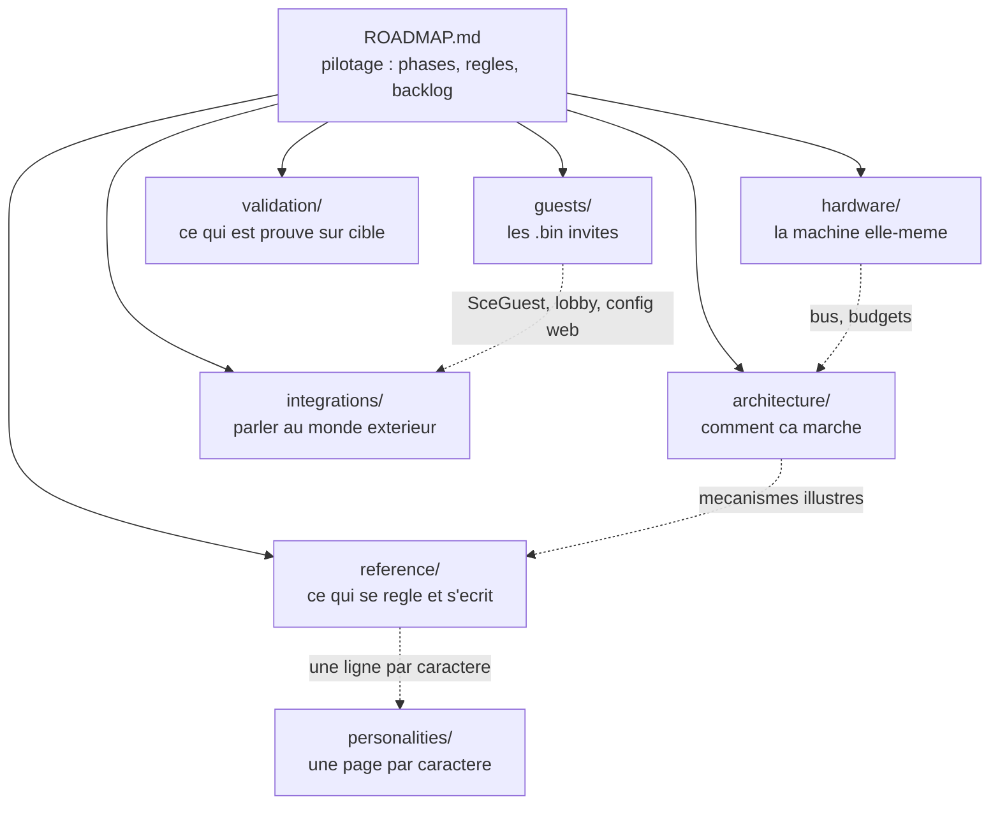

> [English](README.md) · **Français** — l'anglais est la version de référence.
> Ce fichier peut être en retard d'une mise à jour : en cas de divergence, l'anglais fait foi.

# Documentation — StackChan-Companion

Carte de la documentation. Le document de **pilotage** est
[`ROADMAP.fr.md`](ROADMAP.fr.md) : état des phases, règles absolues, procédures,
backlog et spécifications. Tout le reste s'y rattache.

Vous voulez seulement installer une release publiée sur un robot ?
[`INSTALL.fr.md`](INSTALL.fr.md) couvre le flash, la carte SD, le WiFi et les
mises à jour, sans outil de compilation.

## `architecture/` — comment le firmware fonctionne

| Document | Rôle |
|---|---|
| [`WORKFLOWS.fr.md`](architecture/WORKFLOWS.fr.md) | **les mécanismes clés en diagrammes** : tâches FreeRTOS, VOR, danses, réseau, flash. Point d'entrée quand on veut comprendre un enchaînement — les autres docs y renvoient plutôt que de le redessiner |
| [`CONVENTIONS.fr.md`](architecture/CONVENTIONS.fr.md) | unités, axes viewer-centric, mapping IMU validé sur cible, style de code |

## `hardware/` — la machine que le firmware pilote

| Document | Rôle |
|---|---|
| [`README.fr.md`](hardware/README.fr.md) | **ce qu'est la machine** : l'inventaire complet, l'ordre de démarrage et pourquoi c'en est un, les deux profils de carte, les références |
| [`BUSES.fr.md`](hardware/BUSES.fr.md) | les quatre bus et ce que coûte leur partage — deux piles I2C sur une seule paire physique, le SPI2 LCD/SD, l'I2S1 micro/haut-parleur, l'UART servo semi-duplex |
| [`PERIPHERALS.fr.md`](hardware/PERIPHERALS.fr.md) | chaque pièce une par une : adresse, pilote, étalonnage, et comment elle échoue. Contient l'enveloppe des servos et pourquoi elle vaut ±130° |
| [`LIMITS.fr.md`](hardware/LIMITS.fr.md) | budgets et impasses : carte de la flash et slots OTA, PSRAM, la frame de 33 ms, et ce qui a été tenté sur cette carte et a échoué |

## `reference/` — ce qui se règle, s'écrit, s'étend

| Document | Rôle |
|---|---|
| [`CONFIG.fr.md`](reference/CONFIG.fr.md) | schéma de `config.yaml`, arborescence SD, correspondance API ↔ YAML |
| [`STATUSBAR.fr.md`](reference/STATUSBAR.fr.md) | bande de statut : modes, champs lus, API, icônes |
| [`API.fr.md`](reference/API.fr.md) | **l'API REST** : les 47 routes par famille, les quatre conventions qu'elles suivent toutes, et pourquoi la liste exhaustive est l'OpenAPI du robot lui-même |
| [`EMOTIONS.fr.md`](reference/EMOTIONS.fr.md) | les 30 expressions — les noms que prennent l'API, les règles et les danses |
| [`SECURITY.fr.md`](reference/SECURITY.fr.md) | ce que le robot expose sans mot de passe, et ce que ça coûte. Il a une caméra |
| [`EYES.fr.md`](reference/EYES.fr.md) | **le visage lui-même** : géométrie des yeux, chaîne d'animation, transitions entre émotions, clignement, roulette, synchronisation des LED, et comment une frame atteint la dalle |
| [`CHOREGRAPHIES.fr.md`](reference/CHOREGRAPHIES.fr.md) | le système de danses : keyframes, eyes-lead, format CSV sur SD |
| [`PERSONALITIES.fr.md`](reference/PERSONALITIES.fr.md) | **quel caractère le robot porte** : le sélecteur de personnalité, ce qu'une personnalité possède et ce à quoi elle ne touche jamais, l'interrupteur des humeurs aléatoires, et comment en ajouter une |
| [`PLUGINS.fr.md`](reference/PLUGINS.fr.md) | étendre sans recompiler : champs, règles, widgets |

## `personalities/` — une page par caractère

Non pas le mécanisme (c'est `reference/PERSONALITIES.fr.md`) mais les
CARACTÈRES : ce que chacun est à vivre avec, ce qu'il remarque et ce à quoi il
est mauvais.

| Document | Rôle |
|---|---|
| [`README.fr.md`](personalities/README.fr.md) | l'index, et pourquoi le caractère par défaut n'a pas de page propre |
| [`HARO.fr.md`](personalities/HARO.fr.md) | **Haro** — un compagnon plutôt qu'un instrument : ses règles regardent la personne, pas la télémétrie du robot |

## `guests/` — les binaires invités

| Document | Rôle |
|---|---|
| [`README.fr.md`](guests/README.fr.md) | **le contrat `SceGuest`** : rendre un `.bin` tiers arrêtable, lobby de boot, page de configuration web |
| [`FLIGHT-RADAR.fr.md`](guests/FLIGHT-RADAR.fr.md) | radar d'avions ADS-B temps réel |
| [`HA-REMOTE.fr.md`](guests/HA-REMOTE.fr.md) | télécommande Home Assistant |
| [`SPACE.fr.md`](guests/SPACE.fr.md) | instrument spatial de bureau : ISS + passages calculés à bord (SGP4), Lune, planètes, lancements |
| [`LED-FLUID.fr.md`](guests/LED-FLUID.fr.md) | du liquide dans une boîte : un fluide à particules dont la gravité est l'inclinaison de la carte, peint en grille de pastilles |

## `integrations/` — parler au monde extérieur

| Document | Rôle |
|---|---|
| [`HOMEASSISTANT.fr.md`](integrations/HOMEASSISTANT.fr.md) | Home Assistant **pilote le robot** (REST natif, sans ESPHome). Pour l'inverse — le robot pilote la domotique — voir [`guests/HA-REMOTE.md`](guests/HA-REMOTE.fr.md) |

## `validation/` — ce qui est prouvé sur le matériel

| Document | Rôle |
|---|---|
| [`PLAYBOOK-HW.fr.md`](validation/PLAYBOOK-HW.fr.md) | procédures de validation pas à pas sur le robot |
| [`VALIDATION.fr.md`](validation/VALIDATION.fr.md) | tableau de bord : ce qui est validé, ce qui reste |

## Hors `docs/` — contribuer

[`CONTRIBUTING.fr.md`](../CONTRIBUTING.fr.md) est le pendant humain de cette
carte : comment compiler, ce que vérifient les neuf portails et ce que chacun
vous dira en échouant, et la poignée de règles qui piègent à la première
modification.

## Hors `docs/` — les outils PC

[`tools/`](../tools/) réunit ce qui tourne sur la machine de développement et
non sur le robot, classé par ce qu'il fait : `choregraphies/` (l'**éditeur de
chorégraphies**, qui simule une danse et produit son CSV), `generators/` (écrit
un fichier que le firmware ou la carte SD consomme ensuite) et `probes/` (parle
à un service externe, pour écrire un analyseur sur ce qu'il répond vraiment).

[`scripts/`](../scripts/) est classé par **qui le lance** : `gates/` (ce que
`check-all` lance, et rien d'autre), `dev/` (lancé à la main contre une carte)
et `build/` (lancé par PlatformIO).

## Hors `docs/` — la carte du code

La carte du code lui-même n'est **pas ici** : elle vit dans
[`ROADMAP.fr.md`](ROADMAP.fr.md) §A4, à côté des règles qui l'ont façonnée, et la
convention en bas de cette page dit pourquoi elle n'est pas répétée — une
deuxième carte du code est une carte du code qui se périme.

Un répertoire mérite d'être nommé depuis ici, parce que c'est celui sur lequel
on tombe sans savoir qu'il existe : **`firmware/common/`** tient les dix-sept
en-têtes partagés entre firmwares, surtout entre le companion **et** les bins
invités, pour qu'une règle
ait une seule implémentation au lieu d'une famille de jumeaux — le décodeur de
ligne YAML (`Yaml.h`, règle A2.23), les chaînes bilingues (`I18n.h`), la trace
debug à chaud (`Trace.h`), l'identité du build (`FirmwareInfo.h`), la machine à
états multi-boutons (`ButtonFsm.h`), le coucher/lever du soleil (`SunClock.h`),
le pilote de lumière ambiante (`Ltr553.h`), l'allocateur JSON en PSRAM
(`PsJson.h`), plus `CellText.h`, `CfgBool.h`, `SdPins.h`, le classificateur de balayage
(`Gesture.h`), la surveillance de carte SD (`SdWatch.h`), le déplacement unique
de l'ancien dossier de carte (`SdRoot.h`), la trame des LED du PY32
(`Py32Leds.h`) et le cou des bins invités qui font bouger la tête
avec sa visée (`HeadServo.h`, `headtrack.h`). Cinq d'entre eux
sont **vendorés** dans `src/guest/SceGuest.h` pour que le stub reste copiable
seul dans un projet tiers, et `check-vendored.py` prouve que les copies ne
divergent pas.

## `assets/`

Images utilisées par la documentation (références visuelles des yeux,
photos de l'inspiration Cozmo), plus un fichier qui n'est pas une image :

| Fichier | Rôle |
|---|---|
| [`autorouter.postman_collection.json`](assets/autorouter.postman_collection.json) | Collection Postman de l'API **NOTAM autorouter.aero**, importable telle quelle. Elle rejoue exactement les deux appels que fait l'invité flight-radar — le jeton OAuth 2.0, puis la requête NOTAM — plus les deux échecs délibérés (mauvais mot de passe, jeton périmé) : une vue NOTAM qui reste vide se diagnostique depuis le PC au lieu du robot. Écrite d'après le CODE, pas d'après la documentation de l'éditeur. **Les identifiants sont déclarés vides et typés `secret`** : à remplir dans Postman, jamais dans le fichier — le compte est votre login autorouter, pas une clé jetable |

---

**Convention** : un mécanisme n'est décrit **qu'une fois**. S'il est déjà
illustré dans `architecture/WORKFLOWS.md`, les autres documents y
renvoient au lieu de le redessiner — c'est ce qui garde les schémas
cohérents entre eux quand le code bouge.
