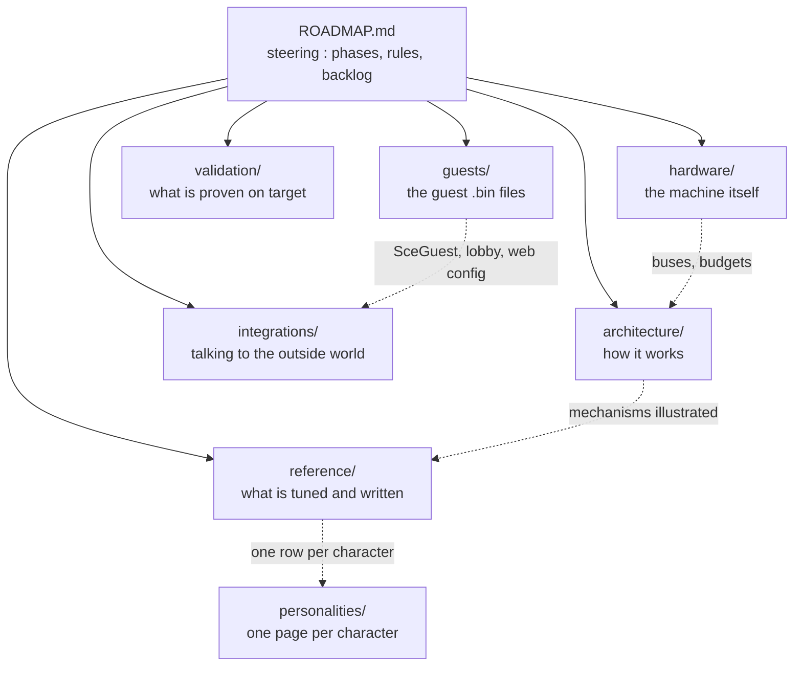

> **English** · [Français](README.fr.md)

# Documentation — StackChan-Companion

Map of the documentation. The **steering** document is
[`ROADMAP.md`](ROADMAP.md): phase status, absolute rules, procedures, backlog
and specifications. Everything else hangs off it.

Just want to put a published release on a robot? [`INSTALL.md`](INSTALL.md)
covers flashing, the SD card, WiFi and updates, with no build tools.

## `architecture/` — how the firmware works

| Document | Role |
|---|---|
| [`WORKFLOWS.md`](architecture/WORKFLOWS.md) | **the key mechanisms as diagrams**: FreeRTOS tasks, VOR, dances, network, flashing. The entry point when you want to understand a chain of events — the other docs link here instead of redrawing it |
| [`CONVENTIONS.md`](architecture/CONVENTIONS.md) | units, viewer-centric axes, IMU mapping validated on target, code style |

## `hardware/` — the machine the firmware drives

| Document | Role |
|---|---|
| [`README.md`](hardware/README.md) | **what the machine is**: the full parts inventory, the boot order and why it is an order, the two board profiles, the reference links |
| [`BUSES.md`](hardware/BUSES.md) | the four buses and what sharing them costs — two I2C stacks on one physical pair, the LCD/SD SPI2, the mic/speaker I2S1, the half-duplex servo UART |
| [`PERIPHERALS.md`](hardware/PERIPHERALS.md) | every part one by one: address, driver, calibration, and how it fails. Includes the servo envelope and why it is ±130° |
| [`LIMITS.md`](hardware/LIMITS.md) | budgets and dead ends: flash map and OTA slots, PSRAM, the 33 ms frame, and what was tried on this board and failed |

## `reference/` — what is tuned, written, extended

| Document | Role |
|---|---|
| [`CONFIG.md`](reference/CONFIG.md) | `config.yaml` schema, SD card tree, API ↔ YAML mapping |
| [`STATUSBAR.md`](reference/STATUSBAR.md) | status bar: modes, fields read, API, icons |
| [`API.md`](reference/API.md) | **the REST API**: all 47 routes by family, the four conventions they all obey, and why the exhaustive list is the robot's own OpenAPI |
| [`EMOTIONS.md`](reference/EMOTIONS.md) | the 30 expressions — the names the API, the rules and the dances all take |
| [`SECURITY.md`](reference/SECURITY.md) | what the robot exposes with no password, and what that costs. It has a camera |
| [`EYES.md`](reference/EYES.md) | **the face itself**: eye geometry, the animation chain, transitions between emotions, blinking, the roulette, LED synchronisation, and how a frame reaches the panel |
| [`CHOREGRAPHIES.md`](reference/CHOREGRAPHIES.md) | the dance system: keyframes, eyes-lead, CSV format on SD |
| [`PERSONALITIES.md`](reference/PERSONALITIES.md) | **which character the robot is**: the personality selector, what one owns and what it may never touch, the random-moods switch, and how to add one |
| [`PLUGINS.md`](reference/PLUGINS.md) | extending without recompiling: fields, rules, widgets |

## `personalities/` — one page per character

Not the mechanism (that is `reference/PERSONALITIES.md`) but the CHARACTERS: what
each one is like to live with, what it notices and what it is bad at.

| Document | Role |
|---|---|
| [`README.md`](personalities/README.md) | the index, and why the default character has no page of its own |
| [`HARO.md`](personalities/HARO.md) | **Haro** — a companion rather than an instrument: its rules watch the person, not the robot's telemetry |

## `guests/` — the guest binaries

| Document | Role |
|---|---|
| [`README.md`](guests/README.md) | **the `SceGuest` contract**: making a third-party `.bin` stoppable, boot lobby, web configuration page |
| [`FLIGHT-RADAR.md`](guests/FLIGHT-RADAR.md) | real-time ADS-B aircraft radar |
| [`HA-REMOTE.md`](guests/HA-REMOTE.md) | Home Assistant remote control |
| [`SPACE.md`](guests/SPACE.md) | desk space instrument: ISS + passes computed on board (SGP4), Moon, planets, launches |
| [`LED-FLUID.md`](guests/LED-FLUID.md) | liquid in a box: a particle fluid whose gravity is the tilt of the board, painted as a grid of dots |

## `integrations/` — talking to the outside world

| Document | Role |
|---|---|
| [`HOMEASSISTANT.md`](integrations/HOMEASSISTANT.md) | Home Assistant **drives the robot** (native REST, no ESPHome). For the opposite direction — the robot driving your home automation — see [`guests/HA-REMOTE.md`](guests/HA-REMOTE.md) |

## `validation/` — what is proven on the hardware

| Document | Role |
|---|---|
| [`PLAYBOOK-HW.md`](validation/PLAYBOOK-HW.md) | step-by-step validation procedures on the robot |
| [`VALIDATION.md`](validation/VALIDATION.md) | dashboard: what is validated, what is left |

## Outside `docs/` — contributing

[`CONTRIBUTING.md`](../CONTRIBUTING.md) is the human counterpart of this map:
how to build, what the eight gates check and what each one will tell you when
it fails, and the handful of rules that catch people out on a first change.

## Outside `docs/` — the PC tools

[`tools/`](../tools/) gathers what runs on the development machine rather than
on the robot, sorted by what it does: `choregraphies/` (the **choreography
editor**, which simulates a dance and produces its CSV), `generators/` (write a
file the firmware or the SD card then consumes) and `probes/` (talk to an
external service, so a parser is written against what it really answers).

[`scripts/`](../scripts/) is sorted by **who runs it**: `gates/` (what
`check-all` runs, and nothing else), `dev/` (run by hand against a board) and
`build/` (run by PlatformIO).

## Outside `docs/` — the code map

The map of the code itself is **not here**: it lives in [`ROADMAP.md`](ROADMAP.md)
§A4, next to the rules that shaped it, and the convention at the bottom of this
page is why it is not restated — a second code map is a code map that goes
stale.

One directory is worth naming from here, because it is the one place a reader
lands without knowing it exists: **`firmware/common/`** holds the thirteen headers
the companion **and** the guest bins share, so that a rule has a single
implementation instead of a family of twins — the YAML line decoder (`Yaml.h`,
rule A2.23), the bilingual strings (`I18n.h`), the runtime debug trace
(`Trace.h`), the build identity (`FirmwareInfo.h`), the multi-button state
machine (`ButtonFsm.h`), sunrise/sunset (`SunClock.h`), the ambient-light driver
(`Ltr553.h`), the PSRAM JSON allocator (`PsJson.h`), plus `CellText.h`,
`CfgBool.h`, `SdPins.h`, the swipe classifier (`Gesture.h`) and the SD
hot-plug watcher (`SdWatch.h`). Five of them are **vendored** into
`src/guest/SceGuest.h` so the stub stays copyable into a third-party project on
its own, and `check-vendored.py` proves the copies never drift.

## `assets/`

Images used by the documentation (visual references for the eyes, photos of the
Cozmo inspiration), plus one file that is not an image:

| File | Role |
|---|---|
| [`autorouter.postman_collection.json`](assets/autorouter.postman_collection.json) | Postman collection for the **autorouter.aero NOTAM** API, importable as is. It replays exactly the two calls the flight-radar guest makes — the OAuth 2.0 token, then the NOTAM query — plus the two deliberate failures (wrong password, expired token), so a NOTAM view that stays empty can be diagnosed from the PC instead of from the robot. Written from the code, not from the vendor documentation. **Credentials are declared empty and typed `secret`**: fill them in Postman, never in the file — the account is your autorouter login, not a throwaway key |

---

**Convention**: a mechanism is described **only once**. If it is already
illustrated in `architecture/WORKFLOWS.md`, the other documents link there
instead of redrawing it — that is what keeps the diagrams consistent with each
other when the code moves.
