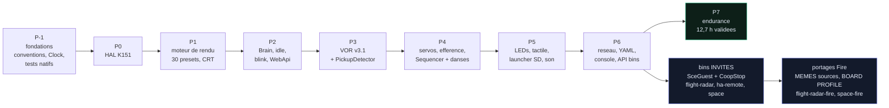

> [English](ROADMAP.md) · **Français** — l'anglais est la version de référence.
> Ce fichier peut être en retard d'une mise à jour : en cas de divergence, l'anglais fait foi.

# ROADMAP.md — StackChan-Companion : guide d'exécution + spécifications

> **Document unique de pilotage.** PARTIE A = quoi faire, comment, dans quel
> ordre — écrite pour être suivie sans autre contexte. PARTIE B = spécifications de
> référence ; la **numérotation § est conservée** car le code source y renvoie
> (`§2.3`, `§3.7`…). Documents frères :
> [`architecture/CONVENTIONS.fr.md`](architecture/CONVENTIONS.fr.md) (normatif
> signes/unités), [`reference/CONFIG.fr.md`](reference/CONFIG.fr.md) (schéma
> YAML), [`validation/PLAYBOOK-HW.fr.md`](validation/PLAYBOOK-HW.fr.md)
> (playbook de validation hardware),
> [`validation/VALIDATION.fr.md`](validation/VALIDATION.fr.md) (verdicts).
> Plus bas, les noms de fichiers nus renvoient toujours à ces chemins.

═══════════════════════════════════════════════════════════════════════════
# PARTIE A — GUIDE D'EXÉCUTION
═══════════════════════════════════════════════════════════════════════════

## A1. Mission et état

**Projet** : firmware compagnon StackChan (M5Stack CoreS3, kit K151).
Objectif : robot compagnon aux animations fluides et naturelles avec
identité robotique assumée — référence artistique **Wall-E / Cozmo /
Vector** (§3.0). Env PlatformIO principal : **`companion`**.

L'enchaînement des phases, et ce que chacune conditionne. Les dépendances
ne sont pas chronologiques mais **techniques** : P3 (VOR) suppose le
mapping gyro de P-1, P4 (danses) suppose l'efférence de P3.



Six firmwares sortent de ce graphe, et `scripts/check-all.ps1` les construit
tous les six : `companion`, `flight-radar`, `flight-radar-fire`, `ha-remote`,
`space`, `space-fire`. Les portages Fire ne dupliquent AUCUNE source — c'est
le même `main.cpp` derrière un bloc de drapeaux `BOARD PROFILE` (A2.25 pour ce
qu'un invité qui crée une tâche doit encore au companion).

**Toutes les phases sont validées HW.** Ce qui vit encore, c'est la
colonne de droite : les bins invités, et les 🔧/🔲 résiduels du playbook.

| Phase | Contenu | État |
|---|---|---|
| P-1 | Spike perf renderer + fondations (conventions, Clock, tests natifs) | ✅ validé HW |
| P0 | HAL K151 (VM_EN, LEDs protocole réel, Si12T/IMU probes) | ✅ validé HW |
| P1 | Moteur de rendu (EyeRig 30 presets, Renderer, FaceState, CRT) | ✅ validé HW |
| P2 | Brain, roulette, idle saccades, BlinkController+Sleepy, WebApi, tuning | ✅ **validé HW 2026-07-11** (squash/Sleepy/API OK ; lag œil droit paramétrable `blink_lag_ms`, défaut 30 ms) |
| P3 | **VOR v3.1** (mapping gyro runtime validé : yaw=Y+ pitch=X+, tilt gelé, shake 3 axes ; efférence validée → VOR actif pendant les danses), PickupDetector (seuils tuning) | ✅ **validé HW complet** (§1 entière, préemption, pickup) |
| P4 | ServoMotion, efférence, **head-follow (ON par défaut depuis 2026-07-13)**, Sequencer + 15 danses (miroir aléa, eyes-lead) + DanceStore CSV SD, auto-release | ✅ **validé HW 2026-07-13** (4.2 head-follow, danses, télécommande) |
| P5a | EmotionLeds (off par défaut) | ✅ flashé — validation PLAYBOOK-HW §4c |
| P5b | TouchGestures + Si12T (interactions tactiles) | ✅ flashé — validation PLAYBOOK-HW §4c |
| P5c | Launcher SD `/bins/` + SD-Updater | ✅ flashé — validation PLAYBOOK-HW §4c (préparer /bins/) |
| P5d | SoundFx chirps | ✅ flashé — validation : `?sound=1`, chirps par valence aux changements d'émotion |
| P6 | STA+repli AP, SdConfig YAML (tuning+wifi persistés), `POST /api/wifi`, **API [Bins]** (GET/POST upload/DELETE/launch/stop), console embarquée `/` (zéro CDN), Swagger UI `/swagger` + `/api/openapi.json`, portail captif DNS (mode AP), mDNS `stackchan.local`, stub `src/guest/SceGuest.h`, modèle `sdcard/` | ✅ COMPLET, flashé — validation PLAYBOOK-HW §4d |
| P7 | Endurance + docs finales | ✅ **VALIDÉ 2026-07-13** — run de nuit **12,7 h sans reboot firmware** (seul reset = USB), heap stable (160,1 Ko constant, plancher 143,3 Ko figé 11 h+, zéro fuite), piles saines (min 2716 mots ≫ 128), 0 panic/ECHEC ; frame avg 30,7-31 ms avec **CRT resté ON toute la nuit** (< période 33 ms, zéro famine). Détail : PLAYBOOK-HW 5.2 |

**TOUTES LES PHASES SONT VALIDÉES HW** (le nombre de tests natifs est imposé
par `scripts/check-all.ps1`, voir A3). Reste au fil de l'eau : les 🔧/🔲
résiduels de PLAYBOOK-HW (4d.6 résolution mDNS, 4d.15-4d.17 détection
hot-plug SD, 4g.2 bandeau batterie faible, 4g.9 volume nuit à l'oreille) —
et de nouvelles danses si demande future (mécanisme CSV déjà en place, voir
T7 dans le journal des lots ci-dessous).

**La fusion magnétomètre/VOR est CLOSE, verdict ❌** — pas en attente. Le
BMM150 lit les aimants des servos, pas la Terre : 370 µT sur 80° de lacet, et
non reproductible d'un run à l'autre. Le code reste, `vor_mag_alpha` reste à
0, et la seule voie restante est un capteur Grove EXTERNE, loin des aimants.
Gardé ici parce que la mesure a été payée : ne pas rouvrir sur le capteur
interne. Détail : `validation/VALIDATION.md`.

## A2. RÈGLES ABSOLUES (ne jamais enfreindre — chacune a coûté un débogage HW)

1. **UNE seule tâche touche `M5.Display`** : la tâche renderer. L'app poste
   son bandeau via `Renderer::setStatus()`. Violation = transaction SPI
   interrompue = affichage décalé/wrappé.
2. **JAMAIS `setBrightness()` par frame** : sur CoreS3 c'est une transaction
   I2C vers le PMIC AXP2101 — collision avec `M5.update()` = écran coupé.
3. **Bus LCD à 40 MHz** (80 MHz = artefacts fantômes sur ce panel), et la
   reconfiguration de fréquence se fait **AVANT `SD.begin()`** (bus SPI2
   partagé — sinon deadlock du spi_bus_lock). Déjà en place dans `hal/Board.h`.
4. **Anti-famine** : période d'une tâche cadencée > pire temps d'itération,
   ET yield d'un tick garanti quand le deadline est dépassé (pattern présent
   dans toutes les tâches — le copier pour toute nouvelle tâche).
5. **`TripleBuffer<FaceState>` est MONO-producteur (Brain) / MONO-consommateur
   (Renderer)**. Aucun autre `read()` nulle part — utiliser
   `brain->currentEmotion()` (atomic) ou recalculer localement.
6. **Les callbacks AsyncTCP ne touchent JAMAIS l'état** : uniquement
   `brain->post(Command{...})` ou écrire un champ du registre `Tuning`
   (floats indépendants, écriture atomique 32 bits).
7. **Toute mutation du comportement passe par la CommandQueue** (enum
   `CmdType` dans `behavior/Brain.h`) — pas de nouveaux atomics ad hoc.
8. **RÈGLE RÉFLEXE (exigence utilisateur)** : secousse et soulèvement
   préemptent IMMÉDIATEMENT tout (animation, danse, émotion). Tout nouveau
   comportement doit s'aborter sur `_vor.shakeDetected()` / `pev.lifted`.
   Priorité : secousse (Scared) > soulèvement (Curious).
9. **Conventions viewer-centric** (`CONVENTIONS.md`) : +X = droite de
   l'OBSERVATEUR, +Y = haut ; `gaze.x > 0` = yeux vers la droite observateur.
   ⚠ une convention antérieure était INVERSE (gazeH>0 = gauche) — toute
   donnée historique importée passe par `units::gazeFromLegacyConvention()`.
   Toute conversion vit dans `engine/Units.h`, jamais inline.
10. **`engine/` et `behavior/` restent PURS** (Clock/Rng injectés, pas
    d'Arduino) sauf fichiers explicitement device (Renderer, Brain,
    ServoMotion, hal/, app/). Toute machine d'états = testable FakeClock.
11. **Presets** (`engine/presets/`) : générés à l'origine par
    `tools/generators/scale_presets.py` (esp32-eyes 128×64 → 320×160, ×2,5), puis
    **RETOUCHÉS À LA MAIN** — direction artistique Cozmo, verdicts matériels, et
    tous les verdicts utilisateur depuis. Ce sont des SOURCES maintenues à la
    main, pas un produit de compilation : on les édite, et on ne les RÉGÉNÈRE
    jamais, ce qui effacerait en silence chaque retouche. Ce qui est
    réellement généré va dans l'autre sens : `tools/choregraphies/presets.js`
    est produit À PARTIR de ces fichiers par `tools/choregraphies/extract-presets.py`.
    **Tout le projet est distribué sous AGPL-3.0** (`LICENSE` à la racine du
    dépôt). Les fichiers portés d'esp32-eyes/ESP32_Faces
    (`EyeDrawer`/presets/`Transitions`/`Animations`) conservent simplement leur
    en-tête AGPL-3.0 d'origine en tête de fichier ; étant compilés dans le même
    binaire, l'AGPL-3.0 régit la distribution du firmware complet (cf. README
    §Licences). Aucune exception permissive n'existe pour ces fichiers-là —
    le matériel StackChan sous Apache-2.0 crédité séparément (keyframes de
    danses, driver Si12T, `behavior/Dances.h`/`hal/Si12T.h`) est une licence
    différente et compatible sur des fichiers différents, pas une exception à
    celle-ci.
12. Ne pas nommer une constante `EPS` (macro xtensa `specreg.h`).
13. Limites servo K151 (clampées dans ServoMotion, ne pas contourner) :
    yaw 166±130° (X sans restriction officielle — le vrai plafond est notre
    `writeDeg`, 0-300°, soit +134/-166), **pitch 19..99°** — SPEC
    OFFICIELLE M5Stack (docs.m5stack.com/en/StackChan) : « Y-axis
    recommended within 5 ~ 85°, extreme angles may cause servo stall and
    permanent damage ». Repère officiel (0-90°, 90 = bascule arrière max)
    INVERSE du raw mesuré (butées physiques 14/104) : raw ≈ 104 − officiel
    → 5..85 officiel = raw 19..99. Tenir une butée (14/104 raw) cale le
    servo — dommage permanent possible, ne jamais contourner le clamp.
    HOME pitch = 93 : marge pour BAISSER la tête — posture par émotion
    (`Brain::pitchBiasFor`), appliquée au changement d'émotion + head-follow.
14. Chaque danse/séquence finit **Normal + pose neutre** (sinon la roulette
    reste bloquée — garanti par `test_sequencer`).
15. **Le Brain est la SEULE source de lissage des canaux continus** (gaze,
    openL/R, squash, VOR — blenders/saccades à 100 Hz). Renderer et EyeRig
    appliquent TEL QUEL — ne jamais y réintroduire rampe/LPF : une rampe
    200 ms dans EyeTransformation écrase blink (60 ms), wink et VOR jusqu'à
    les rendre invisibles. Seule la transition d'ÉMOTION (morph de forme,
    événementielle) reste animée.
16. **Toute écriture/lecture SD différée (loop()) DOIT encadrer l'accès de
    `renderer.pause()`/`resume()`** : le bus SPI2 est PARTAGÉ LCD/SD — une
    écriture qui coïncide avec un push renderer fait échouer le protocole
    carte (retries « no token received »/« Card Failed ») ET gèle
    l'affichage ~0,7 s. La cause est la CONTENTION, pas la fréquence (même
    symptôme identique reproduit à n'importe quelle fréquence SD) — le
    pause/resume (déjà le pattern du Launcher, §3.6) est le vrai fix,
    vérifié par rafale de 10 écritures (frame max 30 ms contre 675 ms). SD
    conservée à 15 MHz en marge de signal. Les uploads AsyncTCP
    (bins/danses) restent l'exception documentée (pas de pause —
    opérations rares, explicites).
    `pause()`/`resume()` est REFCOUNTÉ sous spinlock (`_pauseMux`) : deux
    pauseurs concurrents existent (loop() SD + tâche caméra autour de
    fb_get, cœurs différents). La paire (compteur, `_pauseReq`) mute
    atomiquement, compteur clampé à 0, et la boucle renderer re-vérifie
    `_pauseReq` après son ack (`continue`) avant de dessiner — sans ça, un
    resume() préempté réveillerait le renderer pendant l'écriture SD d'un
    autre pauseur.
17. **Invariants visuels validés user — ne pas régresser** :
    - paupières ANCRÉES EN BAS par DÉFAUT (canal `lid` séparé du scale — le
      bas de l'œil ne remonte jamais : Happy/Glee/Blush/Sleepy/…) ;
      EXCEPTION : Normal, Surprised, Awe, Nervous, Excited, Questioning,
      Curious, Doubt, Contempt, Smug, Dead, Squint ferment en mode CENTRÉ —
      blinks/winks convergent vers le centre vertical du PLUS PETIT œil de
      la paire (`EyeTransformation::LidCenter/LidAnchorY`, posés par
      setEmotion) ; 2 yeux fermés = ligne 1 px posée là où la fermeture
      ABOUTIT (`EyeRig::bottomEdgeY` la suit dans les deux modes —
      continuité slit → ligne) ;
    - ÉQUIDISTANCE : OffsetX = 0 dans TOUS les presets (discipline de
      preset — `EyeRig::mirrored` ne neutralise PLUS, il inverse le signe
      pour l'œil droit) — l'écart des centres est constant sur les 30
      émotions (+ réglable `eye_spacing`). SEULE exception documentée :
      `Preset_Nervous_Alt` (petit œil 50 px rapproché de +20 px pour garder
      l'espacement bord-à-bord standard) ;
    - MIROIR ALÉATOIRE des asymétries : le Brain tire `FaceState.asymMirror`
      à chaque épisode d'émotion (et le CALE sur le sens miroité de la
      danse en cours) — la décision est au Brain, JAMAIS dans le
      Renderer/EyeRig. Le flip ne choisit QUE quel œil reçoit le preset
      Alt/les variations ; la géométrie miroir (pentes, OffsetX,
      OuterIsLeft) est ANATOMIQUE (œil physique) — la flipper retourne les
      presets symétriques vers l'extérieur (visible sur Angry/Sad, d'où la
      séparation entre flip de preset et flip de géométrie) ;
    - LEDs : couleur = `Renderer::eyeColorRgb()` (celle réellement
      affichée), JAMAIS recalculée côté LEDs — sinon décalage écran/LEDs ;
    - pas de rendu « posé sous » un rendu spécial (l'étoile Excited se
      dessine SEULE — un fond qui dépasse = artefacts) ;
    - danses : seuls des pointeurs STATIQUES transitent par la CommandQueue
      (DanceStore double-banque — jamais de buffer dynamique).
18. **Voir règle 16** (pause/resume SD) pour toute écriture différée.
19. **Ordre d'enregistrement des routes WebApi = ordre de spécificité** :
    une route spécifique enregistrée APRÈS son propre préfixe ne se déclenche
    jamais — les endpoints touchés sont `/api/config/reload`, `/api/bins/
    launch`, `/api/bins/stop`. ESPAsyncWebServer route les URI simples
    (`_server.on("/api/x", ...)`) en mode « BackwardCompatible » :
    `path == "/api/x"` **OU** `path.startsWith("/api/x/")` (`WebServer.cpp`,
    `AsyncURIMatcher::matches`). `/api/x` matche donc AUSSI `/api/x/y` — et
    le PREMIER handler enregistré qui matche gagne (silencieusement, pas
    d'erreur). RÈGLE : enregistrer TOUJOURS un endpoint `/api/x/y` AVANT
    `/api/x` du MÊME verbe HTTP. Après tout ajout de route, vérifier par un
    appel direct (`curl`/`Invoke-RestMethod`) que la réponse vient du bon
    handler — une réponse « plausible mais fausse » (ex.
    `{"error":"aucun param"}` d'un autre endpoint) est le symptôme, pas une
    exception levée.
    **La règle est VÉRIFIÉE au démarrage** : toute route passe par
    `WebApi::route()`, qui la note, et `checkRouteOrder()` relit la liste
    avant `_server.begin()` en dénonçant en série toute paire mal ordonnée
    (`[api] A2.19 VIOLEE : … avale …`). Le critère de collision est celui
    du routeur lui-même (`^{uri}(/.*)?$`), pas une approximation : `/` ne
    capture donc QUE `/`, et `/api/bins` ne capture pas `/api/binsxyz`.
    Le contrôle ne dispense pas de l'appel direct — il attrape l'ordre, pas
    un handler qui répond mal.
20. **M5.Mic / M5.Speaker (bus I2S1 PARTAGÉ sur CoreS3)** — un mode de
    panne boot-loop possible (Guru LoadProhibited : i2s_read ←
    Mic_Class::mic_task) si l'ordre ci-dessous est violé :
    - JAMAIS de `M5.Mic.begin()` explicite avant `record()` : begin() part
      avec un sample rate interne à 0, le premier record(rate) déclenche
      alors un cycle end()/begin() interne pendant lequel la mic_task lit
      un driver I2S désinstallé → panic. `record()` fait l'init correcte.
    - `isEnabled()` M5Unified = CONFIG des pins (TOUJOURS vrai sur
      CoreS3), `isRunning()` = état RÉEL — l'arbitrage Speaker/Mic passe
      par isRunning() exclusivement.
    - Les buffers passés à `record()` doivent être PERSISTANTS (membres) :
      record() est asynchrone, la mic_task écrit après le retour.
    - Toute activation de périphérique risqué pilotée par une option
      runtime persistée DOIT être retardée (garde 20 s d'uptime,
      SoundTracker) : si elle crashe, chaque cycle de boot garde une
      fenêtre où l'API répond pour désactiver l'option — un crash ne
      bricke jamais le robot (une fenêtre de 5 s suffit à désactiver via
      `POST /api/tuning`).
21. **Bus I2C 11/12 PARTAGÉ = verrou obligatoire (`hal/I2cBus.h`)** — le bus
    interne `M5.In_I2C` (IMU/AXP/RTC/touch/SCCB caméra/audio) ET `Wire1`
    (PY32, Si12T, INA226) sont sur les MÊMES broches G11/G12 ; `m5gfx::i2c`
    n'est pas thread-safe. TOUTE transaction passe par `sce::i2cbus::Guard`
    (mutex récursif court, héritage de priorité). JAMAIS le verrou à travers
    un `delay()` — SEULE exception assumée : l'init caméra tient le verrou
    EXCLUSIVEMENT sur la rafale de config SCCB (~0,5 s de gel VOR — un
    verrou par-écriture corrompt le capteur) ; le power-cycle ALDO3
    (~650 ms) se fait HORS verrou. Caméra (tâche dédiée cœur 0 prio 1) :
    deinit PURGE tout (`_initReq`, `_failed` sur camera=0, état snapshot,
    frame-gate) — un champ oublié y produit un re-init fantôme, une caméra
    morte, ou un live-lock 503 ; le flux MJPEG re-sert à 300 ms CONSTANT
    (budget de crédits AsyncTCP à vie, vérifié dans la lib — ne jamais
    élargir la fenêtre TRY_AGAIN).
22. **Budget frame 33 ms + UN SEUL point d'appel de dessin par forme**
    (diagnostiqué sur la forme X Dead) — deux contraintes prouvées SUR
    CIBLE (relecture du buffer canvas par série) :
    (a) JAMAIS `drawWideLine`/primitives anti-aliasées dans le chemin par
    frame : 4 barres AA = ~57 ms > budget → le renderer (prio 3) ne rend
    plus la main et AFFAME le polling tactile de loop() (prio 1, MÊME
    cœur 1) — « plus aucun swipe pendant l'émotion » ; garde anti-famine :
    frame en dépassement → `vTaskDelay(3)`.
    (b) GCC 8.4 Xtensa SUPPRIME du binaire le SECOND de deux appels de
    dessin similaires d'un même corps (helper « barre A→B » appelé 2×
    COMME deux `fillCircle` par itération d'une boucle) : le bras / du X
    Dead n'était jamais dessiné, 5 réécritures sans effet. Forme sûre =
    boucle ALTERNÉE à point d'appel unique (i pair = bras \, impair = /).
    Méthode de diagnostic : sonde `canvas->getBuffer()` (relecture d'octets)
    + compteur statique d'appels — distingue code-non-exécuté /
    pixel-écrasé / conversion couleur.

23. **UN SEUL analyseur YAML — `firmware/common/Yaml.h`**. Le DÉCODAGE d'une
    ligne (`sce::yaml::decodeLine`, `sce::yaml::scalar`) vit là et nulle part
    ailleurs : guillemets LITTÉRAUX (`""` = chaîne vide, un mot de passe garde
    ses `#` et ses espaces), `#` coupé seulement HORS guillemets, et section
    **DÉCLARÉE par l'appelant** (`sectioned`), jamais devinée — l'heuristique
    « valeur vide = section » transforme un `host:` non encore configuré en
    section et avale la clé suivante. Un SSID quoté ou une source ADS-B quotée
    sont exactement le cas où des analyseurs divergents ne sont plus d'accord,
    d'où l'unicité, et d'où le fait qu'il est **testé nativement**
    (`test_yaml`). `firmware/common/` est un répertoire que les DEUX côtés
    incluent déjà, donc la contrainte « pas de dépendance companion →
    `guest/` » est tenue sans rien dupliquer : `SdConfig.h` l'inclut,
    `SceGuest.h` l'inclut. `SdConfig::parseScalar` et `yamlScalar` sont
    SUPPRIMÉS — c'étaient les jumeaux assumés, et ils avaient déjà divergé
    une fois.
    **Les cinq copies VENDORÉES.** `SceGuest.h` doit rester copiable SEUL
    dans un projet tiers (`docs/guests/README.md`) : il porte donc une copie
    de repli de quatre en-têtes partagés derrière `__has_include` —
    **`Yaml.h`, `I18n.h`, `FirmwareInfo.h`, `Trace.h`**. Dans ce dépôt le vrai
    en-tête gagne toujours ; la copie n'existe que pour un invité construit
    hors de l'arbre. Une copie qui dérive, c'est un analyseur qui n'est de
    nouveau plus d'accord : `scripts/gates/check-vendored.py` compare donc les
    quatre paires marqueur à marqueur (commentaires ôtés, blancs normalisés)
    et fait échouer le portail à la moindre dérive. Ajouter un cinquième
    en-tête partagé à `SceGuest.h`, c'est ajouter sa paire à ce portail dans
    le même lot.
    **Ce qui reste dupliqué, à dessein** : la LECTURE BORNÉE
    (`SceGuest::yamlForEach` et la boucle de `SdConfig::load`) —
    `readBytesUntil` dans un tampon de PILE de `MAX_LINE` (512) octets, en
    JETANT le reste d'une ligne trop longue jusqu'au `'\n'`. C'est de l'E/S,
    pas de l'interprétation, et les jumeaux n'y ont jamais divergé (`MAX_LINE`
    lui-même est tenu égal par `check-mirrors.py`). Tester la longueur APRÈS
    un `readStringUntil` ne protège rien : la String a déjà grossi. Un binaire
    renommé `.yaml`/`.csv` n'a pas de `'\n'` avant des méga-octets et épuise
    le tas AVANT le test. Même discipline dans `DanceStore::parseCsv` (ces
    fichiers arrivent par téléversement API).

24. **JSON volumineux → PSRAM** via `sce::psAlloc`
    (`firmware/common/PsJson.h`). Un `JsonDocument` par défaut
    prend des centaines de kilooctets sur le tas INTERNE, celui que se
    partagent WiFi, TLS, AsyncTCP et les tampons DMA — d'où une pile réseau
    morte loin de sa cause. Le repli sur le tas interne est BORNÉ
    (`FALLBACK_MAX` par bloc, `FALLBACK_BUDGET` au cumul) et TRACÉ : un gros
    bloc est REFUSÉ plutôt que pris (`deserializeJson` rend NoMemory,
    l'appelant rejoue — une analyse ratée est rattrapable, un tas interne
    épuisé ne l'est pas).
    **Le refus n'est sûr qu'à l'ALLOCATION.** `reallocate` ne refuse JAMAIS :
    ArduinoJson tient pour acquis qu'un realloc de RÉDUCTION aboutit
    (`StringBuffer::commitStringNode` : `ARDUINOJSON_ASSERT(node != nullptr)`,
    effacé en release) et `StringNode::resize` a DÉJÀ libéré le bloc quand
    l'allocateur rend `nullptr` — refuser là déréférence un pointeur nul,
    exactement dans le cas qu'on prétendait dégrader proprement. Ce qui est
    concédé y est donc compté et tracé, pas refusé.
    PsJson.h est SÉPARÉ de `SceGuest.h`, et n'est délibérément PAS l'une des
    cinq copies vendorées d'A2.23 : `SceGuest.h` doit rester copiable tel
    quel dans un projet tiers, et y faire entrer ArduinoJson imposerait cette
    dépendance à tout invité, même celui qui ne parle pas JSON. Un invité qui
    veut du JSON en PSRAM inclut `firmware/common/PsJson.h` lui-même — les
    trois qui le font (`flight-radar`, `ha-remote`, `space`) le nomment tous.

25. **Un bin invité qui crée une tâche DOIT la garer avant le reflash —
    `sce::CoopStop` (`src/guest/SceGuest.h`), branché par
    `guest.netGuard`.** Rendre la main au robot, c'est appeler `updateFromFS`,
    qui reflashe la partition OTA depuis `/companion.bin` de la carte SD. Une
    tâche de fond qui fait encore du HTTP ou de la SD pendant cette fenêtre se
    bat avec le flash pour le bus SPI2, et le coût est MESURÉ : un reflash de
    ~9 s est devenu **plus de 10 minutes** de contention avec une tâche réseau
    non garée. Le contrat tient en trois lignes, et les trois sont exigées :
    - `if (guard.shouldPark()) continue;` en TÊTE de la boucle de tâche — il
      publie l'accusé (`parked`) HORS de tout verrou et dort 50 ms ;
    - `if (guard.stopping()) return;` dans les assistants HTTP, pour qu'aucun
      travail NEUF ne s'ouvre une fois l'arrêt demandé ;
    - `guard.windowMs` dimensionné sur la pire itération de CE bin, et
      `guest.netGuard = &guard;` avant `guest.begin()`.
    `stopToCompanion()` appelle alors `requestAndWait()` avant `updateFromFS`
    et — c'est la part facile à oublier — appelle `release()` sur le chemin
    d'ÉCHEC, pour qu'un bin dont le flash n'a pas pris reprenne sa tâche au
    lieu de rester figé. Cette libération a remplacé un minuteur
    d'auto-guérison de 15 s : une libération déterministe sur le chemin
    d'échec connu vaut mieux qu'un délai qui devine qu'il s'est passé
    quelque chose.
    Un accusé manquant ne BLOQUE pas le flash (il alerte en série et
    poursuit — refuser de rendre le robot serait pire) : la vraie contrainte
    est donc le portail. `scripts/gates/check-mirrors.py` lit chaque
    `firmware/*/main.cpp` sauf celui du companion, et tout fichier contenant
    `xTaskCreate` sans `guest.netGuard = &…` fait ÉCHOUER check-all. Il y a UN
    `CoopStop`, pas un par bin — trois copies écrites à la main avaient déjà
    divergé.

26. **Un flash réussi ne prouve pas que le robot l'EXÉCUTE — observer
    l'identité du build, ne pas la déduire (`GET /api/firmware`).**
    `pio run -t upload` écrit le slot `app0` et **ne touche JAMAIS
    `otadata`**, qui est pourtant ce qui décide du slot démarré ;
    `updateFromFS` (lancement d'invité, retour d'invité, `/api/update`) écrit
    l'AUTRE slot et pointe `otadata` dessus. Un `/companion.bin` périmé sur la
    carte SD peut donc ÉCRASER un flash USB tout neuf pendant que tous les
    signaux extérieurs disent quand même « réussi » — esptool vérifie son
    propre hash contre ce qu'il a écrit, et le robot revient sur le WiFi, en
    exécutant l'autre image. Table des partitions et alternance des slots :
    `architecture/CONVENTIONS.md §7`.
    La règle qui en découle : après tout flash, rafraîchir la copie SD, puis
    DEMANDER à la carte ce qu'elle exécute — `sha` contre
    `sha256sum firmware.elf`, `console` contre `gen_console_gz.py --check`,
    `slot` pour la partition démarrée, `reset` pour la cause du dernier
    démarrage. Procédure et pièges en A3.
    Les invités publient la même identité en pied de leur page `/config`, et
    `firmware/common/FirmwareInfo.h` est l'unique implémentation des deux
    côtés (vendorée dans `SceGuest.h`, tenue par `check-vendored.py`).
    Corollaire : un champ qui a l'air de faire autorité et qui est faux vaut
    moins que pas de champ — d'où l'absence d'horodatage de build (A3).

## A3. PROCÉDURES

### Cycle de travail (à suivre pour CHAQUE modification)
```powershell
# 0. Tout d'un coup : parite docs, contraste, copies vendorees, tests natifs
#    (>= 37 suites / >= 429 cas), les HUIT builds de firmware, A2.22 verifie
#    DANS le binaire. -Fast saute les builds et A2.22.
.\scripts\check-all.ps1
# 1. Tests natifs seuls, pour aller vite (nombre impose par check-all.ps1)
.\scripts\gates\test-native.ps1                 # ou: .\scripts\gates\test-native.ps1 test_vor
# 2. Build + flash (fermer tout moniteur série d'abord — port busy sinon)
& "$env:USERPROFILE\.platformio\penv\Scripts\pio.exe" run -e companion -t upload --upload-port COM6
# 3. Rafraichir la copie SD — sinon le prochain retour d'invité restaure
#    l'ANCIEN companion par-dessus le flash tout neuf (note plus bas, A2.26)
curl -X POST "http://<ip>/api/sd/put?path=/companion.bin" `
     -F "file=@.pio/build/companion/firmware.bin;filename=companion.bin"
# 4. VÉRIFIER CE QUI TOURNE VRAIMENT — un flash réussi ne prouve pas qu'il a
#    DÉMARRÉ (A2.26). Trois réponses, trois sources indépendantes :
curl -s "http://<ip>/api/firmware"     # -> slot / sha / console / reset
sha256sum .pio/build/companion/firmware.elf   # 8 premiers hex == le `sha` ci-dessus
python scripts/build/gen_console_gz.py --check # imprime la même empreinte `console`
#    `reset` doit valoir poweron/sw — panic/task_wdt/brownout = plantage.
# 5. Capture série 115200 — DTR OBLIGATOIRE (sinon 0 octet reçu),
#    RTS JAMAIS (DTR+RTS à l'ouverture = séquence bootloader esptool →
#    chip figé en mode download)
$p = New-Object System.IO.Ports.SerialPort 'COM6',115200,'None',8,'One'
$p.DtrEnable = $true; $p.RtsEnable = $false; $p.Open()
# ... lire $p.ReadExisting() en boucle ~20 s, chercher "alive" (heartbeat 5 s)
$p.Close()
# 6. Commit (messages FR SANS accents — PowerShell les mange dans -m)
```
- `pio` n'est pas dans le PATH : chemin complet ci-dessus.
- Tests natifs : MinGW requis, `scripts/gates/test-native.ps1` règle le PATH seul.
- Le boot log est facile à rater : le firmware a un **heartbeat série 5 s**
  (`companion ... alive - emotion:X CRT:x ip:X frame avg/max uptime`) —
  s'y fier plutôt qu'au boot.
- Si COM6 absent : demander à l'utilisateur de rebrancher (câble DATA sur le
  port USB-C du module CoreS3) ; vérifier `[System.IO.Ports.SerialPort]::GetPortNames()`.
- **`POST /api/bins/stop` reflashe la partition OTA depuis `/companion.bin`
  de la carte SD** — c'est ce fichier, pas le dernier flash USB, qu'un bin
  invité restaure réellement. Après TOUTE modification du companion,
  rafraîchir aussi la copie SD (multipart, pas `--data-binary` — un corps
  brut répond silencieusement un `500 import failed` sec) :
  ```powershell
  curl -X POST "http://<ip>/api/sd/put?path=/companion.bin" `
       -F "file=@.pio/build/companion/firmware.bin;filename=companion.bin"
  ```
  Voir l'avertissement du cycle de travail dans CLAUDE.md sur le fait de ne
  pas enchaîner stop → sd/put → launch sans confirmer que la copie est
  bien arrivée.
- **Les trois réponses de `GET /api/firmware`, et ce que chacune tranche**
  (A2.26 pour la raison d'être de la question) :
  - `slot` — la partition OTA sur laquelle le chip a réellement DÉMARRÉ
    (`app0`/`app1`). Un flash USB écrit toujours `app0` ; si `slot` dit
    `app1`, l'image qui tourne vient d'un OTA (lancement d'invité, retour
    d'invité, `/api/update`), pas de votre téléversement.
  - `sha` — les 8 premiers hex du sha256 de l'ELF, **reproductible depuis la
    copie de travail** : `sha256sum .pio/build/<env>/firmware.elf`. Égalité =
    le robot exécute le binaire que vous venez de construire. C'est le seul
    champ qui relie la carte à un arbre de sources précis.
  - `console` — l'empreinte de `WebConsole.h`, celle-là même qu'imprime
    `gen_console_gz.py --check`. Elle attrape le cas étroit d'une retouche de
    console qui n'est jamais arrivée dans les octets servis.
  - `reset` — POURQUOI la carte a démarré la dernière fois (`poweron`/`sw`/
    `panic`/`task_wdt`/`brownout`). Un boot-loop silencieux se lit ici avant
    de se lire ailleurs.
  Le même bloc ouvre la trace série : une carte sans réseau répond quand même.
  ⚠ **Ne jamais re-gzipper les sources soi-même pour comparer la console** :
  le zlib du python système et celui du penv PlatformIO produisent des flux
  deflate DIFFÉRENTS pour une entrée identique. `src/app/WebConsoleGz.h` fait
  seul foi — d'où le drapeau `--check` plutôt qu'une comparaison à la main.
  ⚠ Il n'y a délibérément **aucun horodatage `built`**. Il a existé et a été
  retiré : sa source (`esp_ota_get_app_description()->date`) est la date de
  compilation des bibliothèques Arduino PRÉCOMPILÉES, elle répondait donc
  « Mar 5 2024 » pour un firmware compilé cinq minutes plus tôt. Un champ qui
  a l'air de faire autorité et qui est faux vaut moins que pas de champ.

### API (robot en marche — rejoindre l'AP WiFi `StackChan-AP` / `goodlife`)
Base `http://192.168.4.1` — aide-mémoire sur `/` :
`GET /api/status` · `POST /api/emotion?name=Happy[&ms=]` ·
`POST /api/animation?name=blink|winkLeft|winkRight` ·
`POST /api/config?crt=0|1` · `GET|POST /api/tuning` (clés = `Tuning::table()`) ·
`GET /api/dances` · `POST /api/dance?name=happy|...|stop`.
**Télémétrie** : `POST /api/tuning?telemetry=1` → série 10 Hz
(gX/gY/gZ bruts, headVelX/Y, vorX/Y, tiltX/Y, gazeX/Y, openL) — l'outil de
calibration/tuning. Mapping gyro À CHAUD : `gyro_yaw_axis/sign`,
`gyro_pitch_axis/sign` (boutons dans la console `/`, persistés SD).

### Recherche dans les projets de référence
Les dépôts portés/sources d'inspiration : esp32-eyes, RoboEyes,
StackChan-main/firmware (liens dans les remerciements du README). En interne
ce projet les indexe avec `graphify query "..."` (outil privé Claude Code,
pas nécessaire pour lire le code). Fiche matérielle :
https://docs.m5stack.com/en/StackChan/

## A4. CARTE DU CODE (src/, tout est header-only)

```
engine/  (pur sauf mention)      rôle
  Units.h                        conversions normatives, Vec2f, limites K151
  Clock.h                        interface temps + FakeClock (tests)
  Rng.h                          xorshift32 seedable (tests déterministes)
  Emotions.h                     enum 30 + noms + palette + dim/lerp RGB888
  EyeConfig.h / EyeGeometry.h    géométrie œil + normalize() (invariants §2.3)
  Transitions.h / Animations.h   ease/spring + générateurs 0→1 (AGPL, Clock injecté)
  EyeRig.h            [device]   œil complet : chaîne anim + émotion→preset + Dead/Excited
  EyeDrawer.h         [device]   dessin Bresenham (AGPL) + normalize + isDrawable
  presets/                       30 presets validés HW (SOURCE maintenue à la main, voir A2.11 — ne jamais régénérer)
  FaceState.h                    snapshot POD + TripleBuffer sans verrou
  FieldStore.h                   blackboard champs nommés (bande de statut + règles)
  EyeEffects.h                   overlays par émotion (blush 4 traits, sparkles, sweat)
  Blender.h                      crossfades par canal (§3.7) — gaze 80 ms, lids 120 ms
  CrtEffect.h         [device]   scanlines/phosphore/drops par LUT (jamais M5.Display)
  Renderer.h          [device]   tâche 30 Hz cœur 1 : consomme FaceState, pause/resume
  Tuning.h                       registre paramètres à chaud (table nom→champ)
behavior/
  Brain.h             [device]   tâche 100 Hz cœur 1 prio 4 — SEUL écrivain FaceState,
                                 CommandQueue, compose tous les modules ci-dessous
  EmotionRoulette.h              tirage pondéré 6-12 s (verrouillé si override/danse)
  IdleBehavior.h                 fixation→saccade→overshoot (pas de flottement)
  BlinkController.h              paupières : politiques/expression + Sleepy « lutte »
                                 + lag œil droit `blink_lag_ms` (30 ms) + winks
                                 + preempt() réflexe
  VestibularSystem.h             VOR : gyro direct + biais appris + deadband +
                                 dérive gated + saccade rattrapage + shake
  PickupDetector.h               soulevé/posé (|a|≠1g soutenu, guard gyro)
  SoundDirection.h               PUR : RMS G/D, porte seuil+ambiant EMA par canal,
                                 imbalance lissée (canal 1 ES7210 = micro DROIT)
  Sequencer.h / Dances.h         timeline danses (hold≥servo garanti) + 15 danses
  RuleEngine.h                   règles déclaratives champ→Commande (sustain/cooldown/gate)
  Command.h                      enum CmdType + struct Command (CommandQueue)
  ServoMotion.h  [device, #ifdef SCE_USE_SERVO]  trajectoires 50 Hz cœur 0,
                                 WritePos brut (moveXY lib = BLOQUANT), efférence
hal/     (device)
  Board.h                        init K151 ORDONNÉE (M5→display 40MHz→SD→Wire1→PY32 VM_EN)
                                 + batterie AXP2101 (batteryPercent/isCharging/vbusPresent)
  Py32Expander.h                 VM_EN + LEDs (protocole validé : GPIO13 + 0x24/0x30)
  ImuReader.h                    BMI270→axes écran (mapping gyro VALIDÉ HW, réglable à
                                 chaud) + double-tap logiciel + orientation face haut/bas
  CpuLoad.h                      charge CPU par cœur (hooks idle FreeRTOS, console)
  Si12T.h                        touch tête I2C 0x68 (Wire1) — caresse/glissement
  Camera.h                       GC0308 (HA/Frigate) : capture RGB565 + JPEG
                                 logiciel dans loop(), SCCB via M5.In_I2C
  ArduinoClock.h                 Clock de prod
  I2cBus.h                       verrou du bus I2C 11/12 partagé (Guard, A2.21)
  Ina226.h                       jauge batterie externe (tension bus + shunt)
  Ltr553.h                       lumière ambiante (auto_brightness, mode nuit) —
                                 enveloppe MINCE : la carte des registres vit dans
                                 firmware/common/Ltr553.h, ce fichier ajoute la
                                 politique de transaction (un registre par Guard I2C)
app/     (device)
  WebApi.h                       STA+repli AP, REST complet, mDNS, portail captif,
                                 API [Bins] — flags consommés par loop (A2.6)
  WebConsole.h                   CONSOLE_HTML (console `/` zéro CDN) + SWAGGER_HTML
                                 (`/swagger`) + OPENAPI_JSON (`/api/openapi.json`)
  EmotionLeds.h                  emphase LED (off défaut, tuning leds=1)
  SoundFx.h                      chirps par valence (off défaut, tuning sound=1) +
                                 volume nuit (solaire, sound_volume_night, lat/lon)
  SoundTracker.h                 capture stéréo M5.Mic continue (ring 3 buffers) →
                                 SoundDirection → tête vers le bruit (sound_track=1)
  Launcher.h                     UI SD `/bins/` (swipe bas) + SD-Updater
  SdConfig.h                     persistance YAML wifi+tuning (/stackchan-companion/) +
                                 migration cfg_version (recalibrages de défauts)
  DanceStore.h                   chorégraphies SD (/dances/*.csv, upload/reload API)
  RuleStore.h                    règles SD (/stackchan-companion/rules.txt, hot-reload) ;
                                 porte le modèle PAR DÉFAUT, écrit sur une carte qui
                                 n'en a pas — sdcard/stackchan-companion/rules.txt.example
                                 en est le miroir (scripts/gates/check-mirrors.py)
interact/ (device)
  TouchGestures.h                gestes écran : swipes 4 dir + taps par tiers (zone yeux)
guest/   (à embarquer dans les .bin tiers — PAS compilé dans companion)
  SceGuest.h                     contrat des bins invités, COPIABLE TEL QUEL (aucune
                                 dépendance vers src/) : WebServer (GET / + /config +
                                 POST /api/bins/stop filtré par Origin), lobby de boot,
                                 formulaire de config typé (Num/Bool/Text/Choice/Secret),
                                 blocs cadre Réseau et Debug, pied de page d'identité
                                 du build, écrans de flash SD-Updater habillés,
                                 swipe-bas de sortie (confirmation), lecture yaml
                                 bornée (décodage délégué à Yaml.h) et les quatre
                                 replis vendorés d'A2.23.
                                 **`sce::CoopStop`** — L'arrêt coopératif avant un
                                 reflash : shouldPark()/stopping()/requestAndWait()
                                 /release(), branché par `guest.netGuard` (A2.25).
                                 stopToCompanion() gare avant updateFromFS et libère
                                 sur le chemin d'ÉCHEC
sdcard/                          modèle du contenu de la carte SD (config.yaml, bins/)
firmware/companion/main.cpp   assemblage : Board→Renderer→Brain→Servo→WebApi→LEDs
firmware/companion/sccb_m5.cpp  override SCCB esp32-camera → M5.In_I2C (caméra)
firmware/flight-radar/main.cpp  bin INVITÉ : radar ADS-B (docs/guests/FLIGHT-RADAR.md)
firmware/ha-remote/main.cpp     bin INVITÉ : télécommande Home Assistant
                                 (docs/guests/HA-REMOTE.md)
firmware/space/main.cpp         bin INVITÉ : instrument spatial — ISS/SGP4 calculé
                                 à bord, passages, Lune, planètes, lancements
                                 (spec §5, docs/guests/SPACE.md)
firmware/*/input.h              vocabulaire UiEvent propre au bin (PUR, testé) :
                                 tactile et boutons sont deux PRODUCTEURS,
                                 applyEvent() l'unique consommateur. La FSM
                                 elle-même est partagée — voir ButtonFsm.h plus bas
  (flight-radar et space construisent chacun une variante Fire —
   `flight-radar-fire`, `space-fire` — depuis le MÊME main.cpp derrière un bloc de
   drapeaux `BOARD PROFILE` : SCE_INPUT_BUTTONS / SCE_HAS_SERVO / SCE_HAS_LTR553 /
   SCE_COMPANION / SCE_SD_*, nommés d'après ce que la CARTE POSSÈDE, jamais
   d'après une carte. Aucune source n'est dupliquée.)

firmware/common/   EN-TÊTES PARTAGÉS — le répertoire que les DEUX côtés incluent
                   déjà, ce qui permet au companion et aux invités d'être
                   d'accord sans que le companion dépende jamais de `guest/`
                   (A2.23). Quatre d'entre eux sont AUSSI vendorés dans
                   SceGuest.h derrière `__has_include`, pour qu'un invité reste
                   copiable hors de l'arbre ; check-vendored.py tient ces
                   quatre-là égaux à l'original.
  Yaml.h                         [vendoré] LE décodeur de ligne YAML (decodeLine,
                                 scalar) — un seul analyseur, testé par test_yaml (A2.23)
  I18n.h                         [vendoré] bilingue EN/FR par paires sce::T(en,fr),
                                 sans table de clés ; sce::setLang/langCode
  FirmwareInfo.h                 [vendoré] quel build tourne et pourquoi il a
                                 démarré : slot()/sha8()/resetReasonName(). Lectures
                                 en flash mappée seulement → sûr sous AsyncTCP (A2.26)
  Trace.h                        [vendoré] trace debug runtime sce::trace::log,
                                 éteinte = un test booléen par site ; ne journalise
                                 jamais un secret (URL coupées à la query string)
  PsJson.h                       allocateur ArduinoJson en PSRAM (repli interne
                                 BORNÉ et tracé) — délibérément PAS vendoré : il ne
                                 doit pas imposer ArduinoJson à tout invité (A2.24)
  ButtonFsm.h                    LA machine à états multi-boutons (sce::ButtonFsm) :
                                 amorçage au boot (un bouton tenu au démarrage ne
                                 tire rien avant relâchement), anti-rebond, un
                                 évènement par appel, chord(a,b) qui avale les deux
                                 actions individuelles. PURE (temps injecté) —
                                 extraite de flight-radar pour que space n'en fasse
                                 pas pousser une seconde
  SunClock.h                     lever/coucher NOAA PUR, isNight, clockSynced — le
                                 volume nuit du companion et le thème nuit des
                                 invités ne doivent pas diverger sur l'heure qu'il est
  Ltr553.h                       carte des registres LTR-553 + l'étalonnage qui ne
                                 doit pas dériver (gain 96x, courbe ln(4096)). La
                                 POLITIQUE DE TRANSACTION n'est pas partagée :
                                 src/hal/Ltr553.h l'enveloppe avec le Guard I2C (A2.21)
  SdPins.h                       câblage SD SPI2, QUATRE gardes #ifndef séparées
                                 (une par broche) — une garde de groupe unique était
                                 précisément le bug
  CfgBool.h                      une seule définition de « vrai » pour une valeur de
                                 config (1/on/true/yes/y/t, insensible à la casse) — testée
  CellText.h                     table de texte différée à exactement UN point
                                 d'appel noinline de drawString (A2.22) + troncature
                                 nommée
  SdWatch.h                      la carte, SURVEILLÉE et pas seulement montée :
                                 deux cadences (3 s présente, 10 s après un
                                 retrait) et un recul 10→60 s tant qu'aucune n'a
                                 jamais été vue, parce que remonter bloque
                                 loop() des centaines de ms. Un bin l'avait, deux
                                 tenaient la réponse du démarrage pour définitive
  Gesture.h                      LE classificateur de balayage et le budget d'appui
                                 (SWIPE_PX 60, EXIT_PX 100, LONG_MS/ARM/SLOP). PURE,
                                 testée. La même question était résolue à SEPT
                                 endroits, avec CINQ seuils et TROIS règles
                                 d'égalité ; un seuil est un contrat avec la sortie
                                 SceGuest au-dessus, et l'écart entre les deux est
                                 l'endroit où un glissement était lu comme un appui
test/test_*/                     suites natives (37 suites / 429 cas, planchers dans
                                 check-all.ps1) — pio test -e native
tools/choregraphies/             éditeur de danses PC → CSV (tools/README.md) ;
                                 presets.js est GÉNÉRÉ par extract-presets.py
tools/generators/                écrivent un fichier que le firmware ou la SD
                                 consomme ;
tools/probes/                    interrogent un service externe, pour analyser
                                 ce qu'il répond vraiment ;
scripts/gates/                   ce que check-all lance, et rien d'autre
                                 (check-doc-parity, check-contrast, check-vendored,
                                 check-mirrors — qui impose aussi la règle netGuard
                                 A2.25 — check-console, check-a222 et test-native).
                                 check-comments-only.py est la seule exception : il
                                 se lance à la main, pour prouver qu'un lot n'a
                                 touché que des commentaires ;
scripts/dev/                     lancés à la main contre une carte (find-port,
                                 endurance-log, test-mag, statusbar-push,
                                 claude-statusline) ;
scripts/build/                   lancé par PlatformIO (hook pre:)
```

- **Exceptions connues à A2.6 (accès SD dans les callbacks AsyncTCP,
  `src/app/WebApi.h`)** — A2.6 n'autorise dans un callback AsyncTCP que
  `post()` et l'écriture de Tuning ; une E/S SD dans un callback bloque sur
  le bus SPI2 que l'écran partage (A2.16). La plupart des routes respectent
  ça (`/api/bins/launch` vérifie le nom contre un cache que `loop()`
  reconstruit via `refreshBins`, sans toucher la carte). Deux catégories
  restent des exceptions structurelles plutôt que d'être différées vers
  `loop()` :
  - **Routes qui doivent RENVOYER des données de la carte dans leur
    réponse** — `/api/bins` GET, `/api/sd/list`, `GET /api/sd/get`. Les
    différer vers `loop()` supposerait des réponses asynchrones chunkées
    (une refonte de la couche HTTP, pas un correctif), et ils ne peuvent
    pas non plus emprunter `renderer.pause()` : pause() ATTEND l'accusé de
    fin de frame — jusqu'à 500 ms de `vTaskDelay` (`engine/Renderer.h`) —
    et bloquer la tâche AsyncTCP un tiers de seconde est pire que la
    contention qu'on éviterait.
  - **Les gestionnaires de téléversement** écrivent les fragments reçus au
    fil de l'eau (tamponner une image de plusieurs Mo en RAM est
    impossible). Marqués à chaque site par `⚠ DELIBERATE EXCEPTION to rule
    A2.6`.
  Ce fichier porte l'unique voie de secours du robot (restauration de
  companion.bin) — tout futur balayage de ses sites touchant la carte SD
  demande le même soin que l'audit d'origine, pas une passe précipitée.

## A5. BACKLOG

### Travail ouvert

Ce qui reste vraiment ouvert (les labels T0-T9 plus bas sont des lots clos,
gardés seulement comme glossaire) :

| Ouvert | Détail |
|---|---|
| **Re-vérifier les 🔧 des bins invités** | `ha-remote` : glissement de la position d'un volet au drag (`dragEnt`), boutons de volet jointifs/pleine hauteur, bouton unique MARCHE/ARRÊT, compteur `3/6` d'entités actives, panneau de réglages au swipe →, écriture partielle des réglages. Liste tenue dans `validation/VALIDATION.md` § bins invités |
| **Bin invité Espace — travail restant** | la tête suit désormais le satellite (option `servo`, `guests/SPACE.fr.md`), mais le sens dans lequel elle tourne n'a pas encore été observé sur le robot (PLAYBOOK 4j) ; le reste du bin n'a toujours pas de verdict matériel de bout en bout. L'overlay de debug (accord A+C), `sce::ButtonFsm`, l'instrumentation de trace et `netGuard` sont FAITS et couverts par les portails |
| **Commentaires du code** | passe « lisible par un nouveau venu » commencée par les en-têtes des deux bins invités ; le reste de `src/` n'est pas repris |
| **Volume nuit** | le planificateur de chirps tourne sur NTP + `sce::isNight` sur les réglages `lat`/`lon` ; la DÉCISION de nuit est validée sur cible (`/api/sensors` publie `clock` + `night`, et décaler `lon` de 180° la fait basculer 0→1→0). Reste seulement le volume du chirp, à l'oreille |
| **🔧/🔲 de `PLAYBOOK-HW.md`** | 4d.6 résolution mDNS, 4d.15-4d.17 détection hot-plug SD, 4g.2 bandeau batterie faible, 4g.9 volume nuit à l'oreille (4g.10 magnétomètre est CLOS ❌, voir A1) |
| **Port IR** (spec **§6**) | réception+émission via RMT (libre : les LEDs passent par le PY32). Conception faite, code non démarré — la vérification des conflits de broches avec la caméra vient d'abord |
| **Lecteur NFC** (spec **§7**) | UID seul d'abord, écrit à la main — RFAL rejeté comme premier pas (boucles tenant le bus vs règle 15). Conception faite, sonde matérielle d'abord |
| **Assistant via MCP + bouche du bandeau** (spec **§8**) | la couche 1 (serveur MCP côté PC sur REST) ne coûte aucun firmware et c'est là que la prochaine session commence ; la bouche réutilise le bus `SoundFrame` depuis l'audio TTS SORTANT |

### Clos par décision — ne pas rouvrir sans élément nouveau

Des choses qui MARCHAIENT, ou presque, et qui ont été retirées quand même.
Chacune a coûté une mesure ; c'est la raison qui vaut d'être gardée.

| Abandonné | Pourquoi |
|---|---|
| **`drawPhaseBody`** (schéma orbital de space) | Il dessinait la phase vue de la Terre (un disque gibbeux) sur un schéma dont la SEULE affirmation est l'ANGLE Soleil-Terre-Lune et l'éclairage que cet angle impose. Deux énoncés contradictoires dans une même image. La phase garde ses deux foyers propres — la vignette et le grand pourcentage — tous deux tenus par `drawMoonDisc` |
| **Champ `built` de `/api/firmware`** | Sa source (`esp_ota_get_app_description()->date`) est la date de compilation des bibliothèques Arduino PRÉCOMPILÉES : il répondait « Mar 5 2024 » pour un firmware compilé cinq minutes plus tôt. Retiré alors qu'il marchait — voir A2.26 |
| **Le minuteur d'auto-guérison de 15 s du radar** | `netStop` libérait sur un délai, c'est-à-dire en devinant qu'il s'était passé quelque chose. Remplacé par `CoopStop::release()` appelé déterministement sur le chemin d'échec de `stopToCompanion` (A2.25) |
| **Fusion magnétomètre/VOR** | Verdict matériel ❌ — le BMM150 lit les aimants des servos (370 µT sur 80° de lacet, non reproductible). Le code reste, `vor_mag_alpha` reste à 0. Seule voie restante : un capteur Grove externe (A1) |
| **Re-gzipper les sources pour comparer la console** | Le zlib du python système et celui du penv PlatformIO émettent des flux deflate DIFFÉRENTS pour une entrée identique : la comparaison ne prouve rien. `WebConsoleGz.h` fait seul foi ; utiliser `gen_console_gz.py --check` (A3) |
| **Trois arrêts coopératifs écrits à la main** | Un par bin invité, et ils avaient déjà divergé. Désormais un seul `sce::CoopStop`, imposé par portail (A2.25) |

### Labels des lots (T0 → T9, clos)

Un glossaire, pas une file d'attente. Le code et `validation/` citent encore
ces labels ; ce que chaque lot a construit est documenté là où il vit
aujourd'hui, et comment il a été construit est dans `CHANGELOG.fr.md`.

| Label | Ce qu'il couvrait | Documenté dans |
|---|---|---|
| T0 | premier flash + test de fumée | A3 (cycle de travail) |
| T1 | passe de validation matérielle | `validation/PLAYBOOK-HW.fr.md`, `architecture/CONVENTIONS.fr.md §3` |
| T2 | tactile de tête (Si12T) + gestes à l'écran | `hardware/PERIPHERALS.fr.md`, `architecture/WORKFLOWS.fr.md`, `src/interact/TouchGestures.h` |
| T3 | launcher SD | §3.6, `guests/README.fr.md` |
| T4 | chirps procéduraux (`SoundFx`) | §3.9 |
| T5 | API REST, console, mDNS, portail captif, `SdConfig`, stub `SceGuest` | `reference/API.fr.md`, `reference/CONFIG.fr.md`, `guests/README.fr.md` |
| T6 | instrumentation d'endurance (`heapMin`, marge de pile) | `scripts/dev/endurance-log.ps1` (critères en tête) |
| T7 | effets overlay, `Blush`, format CSV des danses, `furious` | `reference/EYES.fr.md` (Overlays), `reference/CHOREGRAPHIES.fr.md` |
| T8 | direction artistique des yeux (rayons par coin, asymétrie miroir, mouvement propre à chaque émotion), OTA du firmware, tête vers le bruit | `reference/EYES.fr.md` (Overlays et mouvement propre à chaque émotion), `reference/API.fr.md`, `hardware/PERIPHERALS.fr.md` |
| T9 | batterie, volume de nuit RTC, double-tap logiciel, face contre table | `hardware/PERIPHERALS.fr.md`, `reference/STATUSBAR.fr.md` |

═══════════════════════════════════════════════════════════════════════════
# PARTIE B — SPÉCIFICATIONS (numérotation historique conservée — le code y renvoie)
═══════════════════════════════════════════════════════════════════════════

## §2 — Bugs historiques analysés (résolus par conception)

### §2.1 Bandes au boot ✅
Cause : `EyeConfig` non initialisé + transition vers un `Destin` jamais posé
+ pas d'`applyEmotion` au 1er frame. Fix : initialiseurs partout,
`EyeTransition` naît en no-op (Destin = état courant), `isDrawable()` court-
circuite toute géométrie nulle. Vérifié : boot ×10 sans artefact.

### §2.2 IMU / RVO ✅ (code) — VestibularSystem v3.1
```
Entrées : gyro brut °/s axes écran, tilt accel, |a| g, cmdVel efférence servo
- biais gyro appris IMMOBILE (EMA 0.05 <2s boot, 0.002 ensuite)
- zone morte 0,8 °/s post-biais
- phase lente : offset -= vel·dt·DEG2GAZE·vor_gain  (AUCUN lissage)
- dérive GATED : complémentaire (α=vor_drift_alpha) vers cible tilt
  UNIQUEMENT si tête calme ET |a|≈1g  (l'accel ment en mouvement)
- phase rapide : saccade 60-100 ms VERS LA CIBLE D'ÉQUILIBRE (pas zéro)
  si saturation (>saccade_recentre×max) ou résiduel tête stable 300 ms ;
  suppression saccadique pendant le rattrapage
- secousse : |vel|>shake_gyro_thr soutenu 400 ms → Scared (via Brain)
```
**PickupReaction** : GROUNDED→LIFTED (|a|−1g > `pickup_dev_g` soutenu
`pickup_hold_ms`, gyro sous `LIFT_GYRO_MAX_DEGS` = 60 °/s — au-delà c'est une
secousse, pas une levée) → Curious + tête +10° + couple relâché (pieds
ballants) ; LIFTED→GROUNDED (écart < 0,05 g stable 1000 ms) → ré-engage +
pitch neutre + blink. Défauts livrés : `pickup_dev_g` **0,08 g** et
`pickup_hold_ms` **120 ms**, tous deux dans `Tuning` (réglables à chaud).
**RÈGLE RÉFLEXE** : voir A2.8.

### §2.3 Coins qui débordent ✅
`EyeGeometry::normalize()` — invariants I1..I5 (dims ≥0, ΣRayons ≤ H-1,
2×max(R) ≤ W, inverses ≤ W/2, proportionnalité préservée) appliqués par le
drawer sur la config FINALE. Fuzz 5000 configs en test.

### §2.4 Launcher `.bin` → spec §3.6.

## §3 — Architecture

### §3.0 Direction artistique — Wall-E / Cozmo / Vector
1. **« Eyes lead, head follows »** : saccade d'abord, tête ensuite (100-250 ms),
   le VOR recentre les yeux pendant la rotation. Implémenté, `head_follow = 1`
   par défaut.
2. **Squash & stretch procédural** : compression V / étirement H ∝ vitesse de
   saccade, retour élastique. Implémenté (Brain → FaceState.squashX/Y).
3. **Asymétrie permanente** : lag œil droit `blink_lag_ms` (défaut
   **30 ms**), presets _Alt. Étendre au besoin (micro-décalages par
   fixation).
4. **Holds + moves secs** : fixations immobiles, saccades ease-out cube,
   jamais de flottement continu.
5. **Mécanique assumée** : on choisit ce qui est lisse (transitions, settling)
   et ce qui claque (saccades, réflexes, danses robotiques).
6. **Paupières = sourcils** : l'expressivité d'inclinaison passe par les
   `Slope_*` des presets (pas d'axe roll sur K151).

### §3.1 Arborescence → voir A4 (à jour). Licences : A2.11.

### §3.2 GazeArbiter (implémenté dans Brain)
`gaze = clamp( base(idle | danse:gazeFromHead(servo)+gazeYBias) + vor.offset )`
Base = propriétaire exclusif crossfadé (Vec2Blender 80 ms) ; VOR toujours
additif, jamais suspendu (l'efférence gère les danses).

### §3.3 IdleBehavior + BlinkController (implémentés)
Idle : FIXATION 800-4000 ms (jitter si >2 s) → SACCADE (saccade_ms ±20 %,
ease-out cube, cible biaisée centre) → OVERSHOOT ressort ~2 px.
Blink : intervalle log-uniforme (médiane blink_median_ms × politique) ;
politiques : gel borné 2-4 s Surprised/Scared/Awe puis blinks lents, Dead
bloqué, Focused ÷2, Angry/Furious/Excited ×1,5, Frozen/Scary/Squint/Contempt
rares. **Sleepy « lutte contre le sommeil »** : droop (100→35 % en 2-4 s) →
chute 100 ms → réouverture laborieuse 500-900 ms avec 1-2 micro-redescentes,
plafond ~70 % → re-droop ; sursaut ~1/4 (95 %, tenue 1 s) ; sortie crossfadée
360 ms. Couplages : saccade large→blink probable, transition STRONG→blink,
réfractaire 300 ms, `preempt()` réflexe.

### §3.4 ServoMotion (implémenté)
Trajectoires 50 Hz cœur 0, ease-in-out, `WritePos` par tick (period=20 ms) —
`moveXY()` SCS de stackchan-arduino est BLOQUANT, ne jamais l'utiliser.
`cmdVelDegS()` = efférence (axes écran, mapping à valider avec le gyro).
Auto-release après `servo_idle_release_ms` (0=off), ré-engage au moveTo.
Head-follow : fixation excentrée tenue `headfollow_hold_ms` → moveTo
(headFromGaze, 600 ms), cadence ≥2,5 s, inhibé si danse/pickup/secousse.

### §3.5 Threading (en place)
| Tâche | Cœur | Prio | Cadence |
|---|---|---|---|
| brain | 1 | 4 | 100 Hz |
| renderer | 1 | 3 | 30 Hz (zone 320×160 SRAM @40 MHz : 21,5 ms nu / 27,8 ms CRT) |
| servo | 0 | 3 | 50 Hz |
| AsyncTCP/WiFi | 0 | lib | — |
| loop() | 1 | 1 | ~50 Hz (Si12T/touch/LEDs/heartbeat/launcher) |
Primitives : CommandQueue (xQueue), TripleBuffer FaceState, registre Tuning.
Anti-famine : A2.4. Aucune tâche fx/worker n'a jamais été créée : les chirps
partent du Brain et de loop(), le tableau ci-dessus est donc complet.

### §3.6 Launcher SD (IMPLÉMENTÉ — `src/app/Launcher.h`)
```
Répertoire /bins/*.bin ; /companion.bin (racine) = restauration SD-Updater.
Geste : SWIPE_DOWN (zone y<200)
  → brain : freeze court (émotion Sleepy 200 ms) ; renderer.pause()
  → Launcher.run() bloquant dans loop() :
      scan /bins/*.bin (nom, taille) ; UI M5GFX pleine page : liste 5 lignes,
      scroll par swipe V, tap = sélection, [Annuler] [Lancer] ;
      entrée « Sauver le firmware actuel » → saveSketchToFS(SD, "/companion.bin") ;
      Lancer → confirmation → updateFromFS(SD, path) → ESP.restart() ;
      Annuler / swipe up / timeout 30 s → sortie
  → renderer.resume() ; brain : réveil (blink + Normal)
API [Bins] (P6/T5) :
  GET /api/bins · POST /api/bins (upload multipart streamé SD) ·
  DELETE /api/bins?name=X · POST /api/bins/launch?name=X (202 puis flash
  différé dans loop) · POST /api/bins/stop (contrainte : une fois un .bin
  tiers flashé, companion ne tourne plus — stop distant seulement si le bin
  embarque le stub SceGuest.h [WiFi + /api/bins/stop → updateFromFS
  companion.bin] ; sinon lobby SD-Updater au boot de l'invité —
  cf. docs/guests/README.md § Le lobby).
Refuser les .bin > taille partition OTA ; upload et flash mutuellement exclusifs.
```

### §3.7 Qualité d'animation (acquis + règles pour la suite)
- **Aucun canal ne saute jamais** : crossfades par canal (Blender — gaze
  80 ms, paupières 120 ms), préemption de séquence = play() direct (blend
  géré par les blenders), settling au retour idle.
- Danses : hold≥servo garanti, anticipation (contre-mouvement 4°/80 ms),
  slow-in/out aux extrémités, arcs yaw+pitch, dernière keyframe
  Normal+neutre (testé), NOD/SHY plongent par gazeYBias.
- Blink jamais coupé à mi-course SAUF préemption réflexe (preempt()).

### §3.8 Effet CRT (implémenté, off par défaut)
`POST /api/config?crt=1`. Scanlines LUT 50 %, rémanence phosphore decay -1
(~230 ms, validée), drops de frame (~1/90), glow = second dessin dilaté
(crt_glow_px=3, crt_glow_dim=0.28, validés). JAMAIS de per-frame PMIC (A2.2).

### §3.9 Son & LEDs (les deux IMPLÉMENTÉS — `EmotionLeds.h`, `SoundFx.h`)
LEDs : `app/EmotionLeds.h` — emphase (palette yeux assombrie, respiration,
pulse 120 ms au changement, Sleepy bas, Dead rouge), off défaut
(`tuning leds=1`, `leds_brightness`), protocole PY32 validé.
Son (T4) : chirps procéduraux (sweeps 60-300 ms), mapping événementiel
(émotion STRONG montant/descendant selon valence, tick sur grande saccade,
« ?! » Surprised, jingle boot/launcher, piste optionnelle par keyframe de
danse), SILENCE en idle pur,
throttle 400 ms, volume nuit (RTC), off défaut.

### §3.10 Supprimé volontairement (ne pas réintroduire)
m5stack-avatar, ExpressionRegistry, TimedEmotion, EyeStateManager, IdleDrift,
AnimationQueue, ServoAnimator, BehaviorEngine (absorbés par Brain/Sequencer/
modules), EspMouth (réintroduction éventuelle avec lipsync), spring idle
flottant, `SCE_SCALE`, pupille/reflet du drawer.

## §4 — Journal des phases

L'histoire de la construction de chaque phase vit dans `CHANGELOG.md` et
`git log`.

## §5 — Le bin invité « Espace » → [`guests/SPACE.fr.md`](guests/SPACE.fr.md)

Le bin est construit et livré ; sa spécification est devenue sa documentation.
Les pièges numérotés que cite le code sont dans
[`guests/SPACE.fr.md` § Les dix pièges](guests/SPACE.fr.md#les-dix-pièges).

## §6 — Spécification : le port IR (réception + émission) — RÉFLEXION SEULE, non démarré

### Le matériel

| Fait | Valeur |
|---|---|
| Récepteur | IRM-56384, démodulé 38 kHz, sur **G10** |
| Émetteur | LED IR sur **G5** |
| Périphérique requis | **RMT** — et il est LIBRE sur ce build : l'anneau WS2812 passe par l'expandeur PY32, pas par RMT. Ce seul fait est ce qui rend l'IR bon marché ici |
| Bibliothèque | IRremoteESP8266 (mûre, ESP32-S3 supporté, base RMT, tous les protocoles grand public) |

### L'ancrage dans l'architecture

- **Décodage dans `loop()`**, à sa propre cadence — l'ISR de la bibliothèque ne
  fait qu'horodater des fronts. Tout l'aval passe par FieldStore/CommandQueue,
  comme chaque autre entrée.
- **Le code est un champ CHAÎNE, pas un flottant.** Un code IR fait 32-64 bits
  et les flottants de FieldStore portent 24 bits de mantisse : `0x20DF10EF`
  serait arrondi en silence vers un code DIFFÉRENT et toujours plausible.
  Donc : `ir_code_s` (hexa) + `ir_proto_s` + un compteur `ir_evt` pour le
  moteur de règles. Une ligne de règle transforme alors n'importe quelle
  télécommande du salon en télécommande StackChan :
  `ir_code_s == "0x20DF10EF" -> danse`.
- **L'émission** est `POST /api/ir/send?proto=NEC&code=0x...&bits=32`, mise en
  file et émise depuis `loop()` (RMT tx). Cas d'usage : Home Assistant pilote
  le robot en télécommande universelle pointée vers la télé.
- Derrière `ir_enable`, défaut 0 — et `check-console.py` exigera le contrôle
  console le jour où la clé entre dans `Tuning::table()`.

### Les phases

| Phase | Contenu | Coût |
|---|---|---|
| P1 | réception → champs → une règle démo ; validé avec n'importe quelle télécommande | S |
| P2 | API d'émission + exemple HA | S |
| P3 | panneau console, docs CONFIG/STATUSBAR, section PLAYBOOK | S |

### Questions ouvertes

- **Les conflits G10/G5** sont à vérifier contre la carte des broches DVP de la
  caméra CoreS3 en session matérielle avant toute ligne de code — les notes
  K151 nomment les broches sans jurer qu'elles sont libres.
- Le courant de la LED IR (donc la portée) n'est pas mesuré : P1 part sur une
  attente de 10-30 cm jusqu'à preuve du contraire.

## §7 — Spécification : NFC (ST25R3916) — RÉFLEXION SEULE, non démarré

### Le matériel

| Fait | Valeur |
|---|---|
| Puce | lecteur ST25R3916, I2C **0x50**, ISO14443A/B + 15693 |
| Bus | présumé la paire partagée G11/G12 — **la règle 15 s'applique à chaque transaction** |
| Pile officielle | ST RFAL — et c'est le mauvais premier pas : ~100 Ko, des dizaines de fichiers, des idiomes ST-HAL, des boucles d'attente qui TIENDRAIENT le bus partagé (la leçon de l'init caméra, règle 15) |

### L'ancrage dans l'architecture

- **La phase 1 est UID seul, écrit à la main.** REQA + anticollision pour lire
  l'UID d'un badge, c'est 300-500 lignes contre la datasheet — sans RFAL. Les
  80 % de valeur tiennent dans « un badge connu a touché la tête » :
  `nfc_uid_s` dans FieldStore, et le moteur de règles fait le reste (badge →
  réveil, badge → danse, badge → lancer un bin).
- **Champ RF en rapport cyclique, jamais continu.** Le champ coûte ~100 mA ;
  la puce a un mode wake-up basse consommation (mesure périodique) fait pour
  exactement cela. Sondage depuis `loop()`, transactions courtes et bornées,
  sous `i2cbus::Guard` — le Brain BLOQUE brièvement, ne saute jamais (règle 15).
- La lecture NDEF texte/URI est la phase 2 (dire/afficher le contenu) ;
  l'écriture et l'émulation de carte sont explicitement HORS champ tant
  qu'aucun usage n'existe.
- Derrière `nfc_enable`, défaut 0.

### Les phases

| Phase | Contenu | Coût |
|---|---|---|
| P1 | sonde + lecture UID + `nfc_uid_s` + une règle démo | M |
| P2 | NDEF texte/URI → say | M |
| P3 | panneau console, docs, section PLAYBOOK | S |

### Questions ouvertes

- Le bus et l'adresse sont NON PROUVÉS : premier geste matériel, une sonde I2C
  à 0x50 sur les deux bus candidats.
- La ligne IRQ est-elle seulement câblée vers un GPIO ? Le sondage marche dans
  les deux cas ; la réponse décide du câblage du wake-up.
- L'accord d'antenne est celui de M5 — supposé fait, portée non mesurée.

## §8 — Spécification : assistant via MCP, et la bouche du bandeau — RÉFLEXION SEULE

### Ce que c'est

Le modèle StackChan-main / xiaozhi-esp32 : le robot CONVERSE — parole entrante,
LLM, parole sortante — le LLM pilote le robot par des **outils MCP**, et
pendant que le robot parle, le bandeau s'anime comme sa **bouche**. Deux
couches, et la première ne demande aucun firmware.

### Couche 1 — un serveur MCP sur l'API REST existante (côté PC)

Tout ce qu'un LLM devrait avoir le droit de faire existe déjà en endpoint :
émotion, danse, say, tête, tuning, capteurs, photo caméra. Un serveur MCP dans
`tools/mcp/` (Python ou Node, transport stdio) les enveloppe en outils et
Claude pilote le robot DÈS AUJOURD'HUI — zéro flash, zéro risque, testable en
une après-midi. Il referme aussi la boucle que le pont statusline (PLUGINS.md)
avait ouverte. C'est ici que le travail doit COMMENCER.

### Couche 2 — la conversation embarquée, et la bouche

- **Le half-duplex n'est pas un compromis, c'est le matériel** (A2.20) : micro
  et haut-parleur partagent I2S1, donc le robot ÉCOUTE ou PARLE, jamais les
  deux. La machine à états (repos → écoute → parole) est l'arbitrage que
  SoundTracker fait déjà. Le barge-in demanderait de l'AEC — l'ES7210 a un
  canal de référence écho, donc c'est possible PLUS TARD ; ce n'est
  explicitement pas la phase 1.
- **La bouche est nourrie par l'audio SORTANT.** Pendant la parole le micro
  est coupé (bus), donc le bandeau ne peut pas écouter la voix du robot. Le
  PCM du TTS est analysé AVANT d'atteindre le haut-parleur — mêmes calculs que
  `SoundViz`, même `TripleBuffer<SoundFrame>`, mêmes trois styles côté
  renderer. Un PRODUCTEUR de plus, zéro peintre nouveau, A2.15 intact : le
  bandeau sait déjà être une bouche, c'est pour cela que `band_sound` a été
  construit.
- **Appui-pour-parler avant le mot d'éveil.** Le toucher de tête Si12T est un
  bouton d'éveil que le robot possède déjà : tenir la tête pour parler. Le mot
  d'éveil ESP-SR coûte ~1-2 Mo de modèle en flash plus la RAM de l'AFE, et sa
  coexistence avec la caméra n'est pas prouvée — c'est la phase 5, pas un
  prérequis.
- **Le LAN d'abord, Opus ensuite.** Sur le réseau local, du PCM brut 16 kHz
  16 bits mono fait 256 kbit/s — trivial en WebSocket, aucun codec dans le
  firmware. Un pont PC fait STT/TTS/LLM (et peut lui-même être piloté par
  MCP). Le protocole xiaozhi (trames Opus 60 ms, contrôle JSON, outils MCP
  déclarés côté appareil) ne vaut son coût que HORS du LAN ; l'adopter est la
  phase 4, et à ce moment-là la machine à états et la bouche existent déjà.
- **Le dispatch d'outils sur le robot = `post()`.** Quel que soit le transport
  qui porte l'appel d'outil, le gestionnaire obéit à la même loi que les
  callbacks de WebApi : CommandQueue et champs Tuning, rien d'autre. La règle 4
  ne plie pas pour l'IA.

### Les phases

| Phase | Contenu | Coût |
|---|---|---|
| P1 | serveur `tools/mcp/` sur REST — Claude pilote le robot | S |
| P2 | streaming PCM `/api/speak` + producteur bouche-depuis-TTS — le robot parle et le bandeau bouge | M |
| P3 | voie écoute : micro → WebSocket sortant, appui-pour-parler au toucher de tête | M |
| P4 | client de conversation complet (pont PC ou protocole xiaozhi), outils MCP embarqués | L |
| P5 | mot d'éveil (ESP-SR), barge-in AEC — verdicts matériels | L |

### Questions ouvertes

- Fréquence d'échantillonnage du haut-parleur pendant le TTS (16 ou 24 kHz)
  face à la config des chirps — une réinit I2S par changement d'état, ou une
  fréquence pour tout ?
- Tas : WebSocket + TLS + tampons doivent vivre en PSRAM (règle 18) ; la
  coexistence avec le flux caméra est le cas de stress à mesurer.
- La garde micro de 20 s (A2.20) bride AUSSI l'écoute — normal au boot, mais
  la spec doit le dire, sinon la première tentative de conversation semble
  morte.

## §9 — Le bin invité `led-fluid` → [`guests/LED-FLUID.fr.md`](guests/LED-FLUID.fr.md)

Le bin est construit et livré ; ses choix de conception et questions ouvertes
sont dans [`guests/LED-FLUID.fr.md` § Notes de conception](guests/LED-FLUID.fr.md#notes-de-conception).

## §10 — Spécification : les barres de LED comme canal de profondeur — P1+P2 LIVRÉES, P3 (matériel) en attente

### Ce que c'est

Les douze WS2812 forment deux barres de six, et ces barres sont
**perpendiculaires à l'écran** : leurs LED s'échelonnent de l'avant vers
l'arrière. Le firmware n'a jamais utilisé cet axe — les six d'une barre
reçoivent la même valeur, donc aujourd'hui chaque barre ne porte qu'un nombre.

Ceci ajoute une seconde dimension sans dépenser la première : la luminosité déjà
calculée reste l'**amplitude** de la barre, et le nouveau signal ne décide que
de la **répartition** de cette amplitude en profondeur. Au repos la répartition
est uniforme, c'est-à-dire les douze mêmes valeurs qu'aujourd'hui ; pendant que
la tête tourne, la lumière se masse vers une extrémité.

```
tete immobile   [ ● ● ● ● ● ● ]   uniforme
virage a gauche [ ● ● ◐ ○ ○ ○ ]   massee vers l avant
```

**Le critère d'acceptation est que rien ne soit perdu**, et il est plus fort
qu'une promesse : sans mouvement, la charge utile est identique octet pour octet
à celle d'aujourd'hui, parce que répartition uniforme × amplitude existante
*est* ce que `setLedsBars` écrit — et `setLedsBars` passe déjà par
`setLedsRaw`. Ce n'est pas une fonctionnalité à côté de l'existante, c'est une
généralisation dont le cas dégénéré est l'existante.

### Le matériel

| Fait | Valeur |
|---|---|
| La chaîne | 12 WS2812C sur GPIO 13 du PY32, RAM couleur en `0x30`, douze entrées RGB565 LE |
| La géométrie | deux barres de six, **perpendiculaires à l'écran** — l'axe disponible est la PROFONDEUR, pas la largeur |
| Qui le voit | de côté les six se lisent ; de face elles se superposent en une seule luminosité |
| Déjà présent | `Py32Expander::setLedsRaw()` écrit les douze individuellement ; `setLedsBars` et `setAllLeds` en sont deux appelants |
| L'entrée | `ServoMotion::isMoving()` et `yawDeg()` — atomiques tous deux, déjà lus depuis `loop()` par la garde de mouvement propre du VOR |

### Insertion dans l'architecture

- **A2.17 n'est pas touchée.** Une seule teinte, toujours
  `Renderer::eyeColorRgb()`. Seule la position varie. Ce qui voudrait une
  seconde couleur est une autre proposition et un changement délibéré de cette
  règle, pas un choix libre.
- **Tout ce que les barres disent aujourd'hui survit par construction**, parce
  que tout cela vit dans l'amplitude : un clignement la met à zéro et la lumière
  s'éteint, un wink n'en prend qu'une, le pulse ×2 au changement d'émotion met
  toute la barre à l'échelle, la respiration ±20 % se pose par-dessus.
- **Le mouvement COMMANDÉ, pas le gyro.** `ServoMotion::yawDeg()` rapporte ce
  que le firmware a demandé. Le gyro se déclenche aussi quand un humain tourne
  le robot à la main, et les barres indiqueraient alors un virage que le robot
  n'a pas fait — un clignotant qui ment sur qui conduit. C'est un choix de sens,
  écrit ici pour qu'en changer plus tard soit une décision et non une dérive.
- **La suppression d'écriture est conservée, et ne coûte rien.** `EmotionLeds`
  saute déjà la rafale I2C quand couleur et luminosité n'ont pas bougé ; une
  tête immobile donne une répartition constante, donc un robot au repos
  n'ajoute **aucun trafic de bus** sur les broches que partage l'IMU du VOR
  (règle 15).
- **La répartition est une fonction PURE** — `(amplitude, sens, vitesse) → six
  poids` — donc elle vit dans un en-tête sans Arduino dedans et se teste
  nativement comme `engine/` (règle 7). Ce que le test épingle : au repos tous
  les poids valent un ; **aucun poids n'est jamais supérieur à un** ; le
  déplacement est monotone en la vitesse. L'assertion d'identité au repos est le
  critère d'acceptation ci-dessus, exprimé là où il coûte une seconde au lieu
  d'un cycle de flash.
- **La redistribution SOUSTRAIT, elle n'ajoute jamais — et c'est contraint, pas
  un goût.** `EmotionLeds` borne sa luminosité à 255 (`EmotionLeds.h:102`) et
  une barre peut légitimement y être. Masser la lumière vers l'avant à total
  constant exigerait que les LED avant dépassent la luminosité de la barre :
  au plafond elles écrêteraient et le total s'effondrerait en silence — dans le
  cas précis où l'effet compte le plus, puisque la luminosité culmine quand
  l'émotion est intense. Un poids supérieur à un est donc interdit : un virage
  **assombrit l'extrémité opposée** au lieu d'éclaircir la proche. La barre perd
  de la lumière pendant qu'elle tourne, ce qui est honnête (rien n'est inventé)
  et lisible (l'œil suit l'extrémité sombre qui se déplace), et le plafond de
  luminosité garde exactement le sens qu'il a aujourd'hui.

### Les phases

| Phase | Contenu | Coût |
|---|---|---|
| P1 | ✅ la répartition pure (`engine/LedBars.h`) + `test_ledbars`, 7 cas, dont l'identité EXACTE au repos | S |
| P2 | ✅ câblée dans `EmotionLeds` derrière `led_depth` (gain %, 0 par défaut) et `led_depth_front` ; contrôles console dans la section LEDs ; la suppression d'écriture surveille désormais aussi la répartition, sinon une barre dont la lumière a bougé sous une luminosité inchangée n'aurait jamais été envoyée | S |
| P3 | session matérielle — seul juge de six LED vues par la tranche. Ce qu'elle doit trancher : le SENS de profondeur (`led_depth_front`), et `FULL_RATE_DEG_S` (120 °/s, provisoire — la courbe vitesse→déplacement est une décision « ça rend bien », et l'a toujours été) | S |

### Questions ouvertes

- **Quelle extrémité porte l'indice 0 ?** Personne n'a mesuré si les LED d'une
  barre vont de l'avant vers l'arrière ou l'inverse. `led_swap` existe parce que
  le câblage gauche/droite n'était pas certain non plus ; il faut son équivalent
  en profondeur, sinon la lumière se masse du mauvais côté et personne ne peut
  distinguer le câblage de l'arithmétique.
- Une danse doit-elle le piloter aussi ? Les keyframes portent déjà un sens
  miroité (`FaceState.asymMirror`), donc un chenillard le long du corps
  viendrait presque gratuitement — mais une danse n'est pas un virage, et
  réutiliser un canal pour deux sens est la façon dont un signal cesse de
  vouloir dire quelque chose.
- Le tangage a lui aussi un titre sur cet axe (une tête qui pique du nez *est*
  un mouvement en profondeur). Deux producteurs pour un canal, c'est le même
  piège ; si les deux sont voulus, la spec doit dire lequel gagne.
- La courbe qui va de la vitesse au déplacement n'est pas spécifiée, exprès :
  c'est une décision de rendu, et elle se prendra devant le robot.
