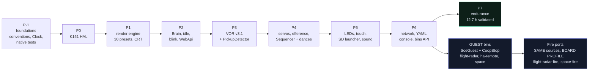

> **English** · [Français](ROADMAP.fr.md)

# ROADMAP.md — StackChan-Companion: execution guide + specifications

> **Single steering document.** PART A = what to do, how, in what order —
> written to be followed with no other context. PART B = reference
> specifications; the **§ numbering is preserved** because the source code
> points at it (`§2.3`, `§3.7`…). Sibling documents:
> [`architecture/CONVENTIONS.md`](architecture/CONVENTIONS.md) (normative
> signs/units), [`reference/CONFIG.md`](reference/CONFIG.md) (YAML schema),
> [`validation/PLAYBOOK-HW.md`](validation/PLAYBOOK-HW.md) (hardware validation
> playbook), [`validation/VALIDATION.md`](validation/VALIDATION.md) (verdicts).
> Below, bare file names always refer to those paths.

═══════════════════════════════════════════════════════════════════════════
# PART A — EXECUTION GUIDE
═══════════════════════════════════════════════════════════════════════════

## A1. Mission and status

**Project**: StackChan companion firmware (M5Stack CoreS3, K151 kit).
Goal: a companion robot with fluid, natural animation and an unapologetically
robotic identity — artistic reference **Wall-E / Cozmo / Vector** (§3.0).
Main PlatformIO env: **`companion`**.

The phase chain, and what each one unlocks. The dependencies are not
chronological but **technical**: P3 (VOR) assumes the gyro mapping from P-1,
P4 (dances) assumes the efference from P3.



Six firmwares come out of that graph, and `scripts/check-all.ps1` builds all
six: `companion`, `flight-radar`, `flight-radar-fire`, `ha-remote`, `space`,
`space-fire`. The Fire ports duplicate NO source — they are the same
`main.cpp` behind a `BOARD PROFILE` flag block (A2.25 for what a guest that
spawns a task still owes the companion).

**Every phase is HW-validated.** What is still alive is the right-hand
column: the guest bins, and the leftover 🔧/🔲 items from the playbook.

| Phase | Contents | Status |
|---|---|---|
| P-1 | Renderer perf spike + foundations (conventions, Clock, native tests) | ✅ HW-validated |
| P0 | K151 HAL (VM_EN, real LED protocol, Si12T/IMU probes) | ✅ HW-validated |
| P1 | Render engine (EyeRig 30 presets, Renderer, FaceState, CRT) | ✅ HW-validated |
| P2 | Brain, roulette, idle saccades, BlinkController+Sleepy, WebApi, tuning | ✅ **HW-validated 2026-07-11** (squash/Sleepy/API OK; right-eye lag tunable via `blink_lag_ms`, default 30 ms) |
| P3 | **VOR v3.1** (runtime gyro mapping validated: yaw=Y+ pitch=X+, tilt frozen, shake on 3 axes; efference validated → VOR active during dances), PickupDetector (tunable thresholds) | ✅ **fully HW-validated** (all of §1, preemption, pickup) |
| P4 | ServoMotion, efference, **head-follow (ON by default since 2026-07-13)**, Sequencer + 15 dances (random mirror, eyes-lead) + DanceStore CSV on SD, auto-release | ✅ **HW-validated 2026-07-13** (4.2 head-follow, dances, remote control) |
| P5a | EmotionLeds (off by default) | ✅ flashed — validation PLAYBOOK-HW §4c |
| P5b | TouchGestures + Si12T (touch interactions) | ✅ flashed — validation PLAYBOOK-HW §4c |
| P5c | SD launcher `/bins/` + SD-Updater | ✅ flashed — validation PLAYBOOK-HW §4c (prepare /bins/) |
| P5d | SoundFx chirps | ✅ flashed — validation: `?sound=1`, valence-based chirps on emotion changes |
| P6 | STA + AP fallback, SdConfig YAML (tuning+wifi persisted), `POST /api/wifi`, **[Bins] API** (GET/POST upload/DELETE/launch/stop), embedded console `/` (zero CDN), Swagger UI `/swagger` + `/api/openapi.json`, DNS captive portal (AP mode), mDNS `stackchan.local`, `src/guest/SceGuest.h` stub, `sdcard/` template | ✅ COMPLETE, flashed — validation PLAYBOOK-HW §4d |
| P7 | Endurance + final docs | ✅ **VALIDATED 2026-07-13** — overnight run **12.7 h with no firmware reboot** (the only reset was USB), stable heap (160.1 kB constant, floor pinned at 143.3 kB for 11 h+, zero leak), healthy stacks (min 2716 words ≫ 128), 0 panic/FAIL; frame avg 30.7-31 ms with **CRT left ON all night** (< the 33 ms period, zero starvation). Details: PLAYBOOK-HW 5.2 |

**ALL PHASES ARE HW-VALIDATED** (native test count enforced by
`scripts/check-all.ps1`, see A3). Left as we go: the leftover 🔧/🔲 items
from PLAYBOOK-HW (4d.6 mDNS resolution, 4d.15-4d.17 SD hot-plug detection,
4g.2 low-charge banner, 4g.9 night-volume-by-ear) — plus new dances if a
future request comes in (the CSV mechanism is already in place, see T7 in
the batch journal below).

**Magnetometer/VOR fusion is CLOSED, verdict ❌** — not pending. The BMM150
reads the servo magnets, not the Earth: 370 µT over 80° of yaw, and not
reproducible from one run to the next. The code stays, `vor_mag_alpha` stays
at 0, and the only remaining path is an EXTERNAL Grove sensor far from the
magnets. Kept here because the measurement was paid for: do not re-open it
on the internal sensor. Detail: `validation/VALIDATION.md`.

## A2. ABSOLUTE RULES (never break them — each one cost an HW debugging session)

1. **ONE single task touches `M5.Display`**: the renderer task. The app posts
   its status bar through `Renderer::setStatus()`. Violating this = an
   interrupted SPI transaction = a shifted/wrapped display.
2. **NEVER call `setBrightness()` per frame**: on the CoreS3 that is an I2C
   transaction to the AXP2101 PMIC — colliding with `M5.update()` = a dead
   screen.
3. **LCD bus at 40 MHz** (80 MHz = ghosting artifacts on this panel), and the
   frequency reconfiguration happens **BEFORE `SD.begin()`** (shared SPI2 bus
   — otherwise the spi_bus_lock deadlocks). Already in place in `hal/Board.h`.
4. **Anti-starvation**: a periodic task's period > its worst-case iteration
   time, AND a guaranteed one-tick yield whenever the deadline is missed
   (the pattern exists in every task — copy it for any new task).
5. **`TripleBuffer<FaceState>` is SINGLE-producer (Brain) / SINGLE-consumer
   (Renderer)**. No other `read()` anywhere — use `brain->currentEmotion()`
   (atomic) or recompute locally.
6. **AsyncTCP callbacks NEVER touch state**: only `brain->post(Command{...})`
   or writing a field of the `Tuning` registry (independent floats, atomic
   32-bit write).
7. **Every behavior mutation goes through the CommandQueue** (`CmdType` enum
   in `behavior/Brain.h`) — no new ad-hoc atomics.
8. **REFLEX RULE (user requirement)**: shake and pickup preempt EVERYTHING
   IMMEDIATELY (animation, dance, emotion). Any new behavior must abort on
   `_vor.shakeDetected()` / `pev.lifted`. Priority: shake (Scared) > pickup
   (Curious).
9. **Viewer-centric conventions** (`CONVENTIONS.md`): +X = the OBSERVER's
   right, +Y = up; `gaze.x > 0` = eyes toward the observer's right.
   ⚠ an earlier convention was the INVERSE (gazeH>0 = left) — any imported
   historical data goes through `units::gazeFromLegacyConvention()`.
   Every conversion lives in `engine/Units.h`, never inline.
10. **`engine/` and `behavior/` stay PURE** (Clock/Rng injected, no Arduino)
    except for explicitly device-side files (Renderer, Brain, ServoMotion,
    hal/, app/). Every state machine must be testable with a FakeClock.
11. **Presets** (`engine/presets/`): originally generated by
    `tools/generators/scale_presets.py` (esp32-eyes 128×64 → 320×160, ×2.5), then
    **RETOUCHED BY HAND** — Cozmo art direction, hardware verdicts, and every
    user verdict since. They are HAND-MAINTAINED SOURCE, not build output: edit
    them, and never REGENERATE them, which would silently drop every retouch.
    What is genuinely generated is the other direction: `tools/choregraphies/
    presets.js` is produced FROM these files by `tools/choregraphies/extract-presets.py`.
    **The whole project is distributed under AGPL-3.0** (`LICENSE` at the repo
    root). The files ported from esp32-eyes/ESP32_Faces
    (`EyeDrawer`/presets/`Transitions`/`Animations`) simply keep their original
    AGPL-3.0 header at the top of the file; since they are compiled into the
    same binary, AGPL-3.0 governs the distribution of the complete firmware
    (see README §Licences). No permissive carve-out exists for these files —
    the separately-credited Apache-2.0 StackChan material (dance keyframes,
    Si12T driver, `behavior/Dances.h`/`hal/Si12T.h`) is a different, compatible
    license on different files, not an exception to this one.
12. Never name a constant `EPS` (xtensa `specreg.h` macro).
13. K151 servo limits (clamped in ServoMotion, do not work around them):
    yaw 166±130° (X has no official restriction — the real bound is our own
    `writeDeg`, 0-300°, giving +134/-166), **pitch 19..99°** — OFFICIAL
    M5Stack SPEC (docs.m5stack.com/en/StackChan): "Y-axis recommended within
    5 ~ 85°, extreme angles may cause servo stall and permanent damage". The
    official frame of reference (0-90°, 90 = max backward tilt) is the
    INVERSE of the measured raw one (physical end stops 14/104): raw ≈ 104 −
    official → 5..85 official = raw 19..99. Holding either end stop (14/104
    raw) stalls the servo — permanent damage possible, never work around the
    clamp. HOME pitch = 93: headroom to LOWER the head — per-emotion posture
    (`Brain::pitchBiasFor`), applied on emotion change + head-follow.
14. Every dance/sequence ends on **Normal + a neutral pose** (otherwise the
    roulette stays stuck — guaranteed by `test_sequencer`).
15. **The Brain is the ONLY source of smoothing for the continuous channels**
    (gaze, openL/R, squash, VOR — blenders/saccades at 100 Hz). Renderer and
    EyeRig apply them AS IS — never reintroduce a ramp/LPF there: a 200 ms
    ramp in EyeTransformation crushes blink (60 ms), wink and VOR into
    invisibility. Only the EMOTION transition (shape morph, event-driven)
    stays animated.
16. **Every deferred SD write/read (in loop()) MUST bracket the access with
    `renderer.pause()`/`resume()`**: the SPI2 bus is SHARED between LCD and
    SD — a write that coincides with a renderer push makes the card protocol
    fail (retries "no token received"/"Card Failed") AND freezes the display
    for ~0.7 s. The cause is CONTENTION, not the frequency (the identical
    symptom reproduces at any SD clock) — pause/resume (already the
    Launcher's pattern, §3.6) is the real fix, verified with a burst of 10
    writes (max frame 30 ms versus 675 ms). SD kept at 15 MHz for signal
    margin. AsyncTCP uploads (bins/dances) remain the documented exception
    (no pause — rare, explicit operations).
    `pause()`/`resume()` is REFCOUNTED under a spinlock (`_pauseMux`): there
    are two concurrent pausers (loop() SD + the camera task around fb_get,
    on different cores). The pair (counter, `_pauseReq`) mutates atomically,
    the counter is clamped at 0, and the renderer loop re-checks `_pauseReq`
    after its ack (`continue`) before drawing — without that, a preempted
    resume() would wake the renderer up in the middle of another pauser's SD
    write.
17. **User-validated visual invariants — do not regress**:
    - eyelids ANCHORED AT THE BOTTOM by DEFAULT (`lid` channel, separate from
      scale — the bottom of the eye never rises: Happy/Glee/Blush/Sleepy/…);
      EXCEPTION: Normal, Surprised, Awe, Nervous, Excited, Questioning,
      Curious, Doubt, Contempt, Smug, Dead, Squint close in CENTERED mode —
      blinks/winks converge toward the vertical center of the SMALLER eye of
      the pair (`EyeTransformation::LidCenter/LidAnchorY`, set by
      setEmotion); both eyes closed = a 1 px line placed exactly where the
      closure ENDS (`EyeRig::bottomEdgeY` follows it in both modes — slit →
      line continuity);
    - EQUIDISTANCE: OffsetX = 0 in ALL presets (a preset discipline —
      `EyeRig::mirrored` no longer NEUTRALIZES it, it flips the sign for the
      right eye) — the gap between centers is constant across the 30
      emotions (+ tunable via `eye_spacing`). The ONLY documented exception:
      `Preset_Nervous_Alt` (the 50 px small eye is moved +20 px closer to
      keep the standard edge-to-edge spacing);
    - RANDOM MIRRORING of asymmetries: the Brain draws `FaceState.asymMirror`
      at every emotion episode (and ALIGNS it with the mirrored direction of
      the current dance) — the decision belongs to the Brain, NEVER to
      Renderer/EyeRig. The flip ONLY chooses which eye gets the Alt preset /
      the variations; the mirror geometry (slopes, OffsetX, OuterIsLeft) is
      ANATOMICAL (physical eye) — flipping it turns the symmetric presets
      outward (visible on Angry/Sad, hence the split between preset flip and
      geometry flip);
    - LEDs: color = `Renderer::eyeColorRgb()` (the one actually displayed),
      NEVER recomputed on the LED side — otherwise screen and LEDs drift
      apart;
    - no rendering "laid underneath" a special rendering (the Excited star
      draws ALONE — a background that sticks out = artifacts);
    - dances: only STATIC pointers travel through the CommandQueue
      (DanceStore double-bank — never a dynamic buffer).
18. **See rule 16** (SD pause/resume) for any deferred write.
19. **WebApi route registration order = order of specificity**: a specific
    route silently registered AFTER its own prefix never fires — the
    endpoints that have hit this are `/api/config/reload`, `/api/bins/
    launch`, `/api/bins/stop`. ESPAsyncWebServer routes simple URIs
    (`_server.on("/api/x", ...)`) in "BackwardCompatible" mode: `path ==
    "/api/x"` **OR** `path.startsWith("/api/x/")` (`WebServer.cpp`,
    `AsyncURIMatcher::matches`). So `/api/x` ALSO matches `/api/x/y` — and
    the FIRST registered handler that matches wins (silently, no error).
    RULE: ALWAYS register an `/api/x/y` endpoint BEFORE `/api/x` for the SAME
    HTTP verb. After adding any route, verify with a direct call
    (`curl`/`Invoke-RestMethod`) that the response comes from the right
    handler — a "plausible but wrong" response (e.g. `{"error":"aucun
    param"}` from another endpoint) is the symptom, not a thrown exception.
    **The rule is VERIFIED at boot**: every route goes through
    `WebApi::route()`, which records it, and `checkRouteOrder()` re-reads the
    list before `_server.begin()`, calling out every badly ordered pair in a
    row (`[api] A2.19 VIOLEE : … avale …`). The collision criterion is the
    router's own (`^{uri}(/.*)?$`), not an approximation: `/` therefore
    captures ONLY `/`, and `/api/bins` does not capture `/api/binsxyz`.
    That check does not excuse you from the direct call — it catches the
    order, not a handler that answers wrongly.
20. **M5.Mic / M5.Speaker (SHARED I2S1 bus on the CoreS3)** — a boot-loop
    failure mode (Guru LoadProhibited: i2s_read ← Mic_Class::mic_task) if
    the ordering below is violated:
    - NEVER call `M5.Mic.begin()` explicitly before `record()`: begin()
      starts with an internal sample rate of 0, so the first record(rate)
      triggers an internal end()/begin() cycle during which mic_task reads an
      uninstalled I2S driver → panic. `record()` performs the correct init.
    - M5Unified's `isEnabled()` = pin CONFIGURATION (ALWAYS true on the
      CoreS3), `isRunning()` = the REAL state — Speaker/Mic arbitration goes
      through isRunning() exclusively.
    - The buffers passed to `record()` must be PERSISTENT (members):
      record() is asynchronous, mic_task writes after it returns.
    - Any activation of a risky peripheral driven by a persisted runtime
      option MUST be delayed (20 s uptime guard, SoundTracker): if it
      crashes, every boot cycle keeps a window in which the API answers and
      the option can be turned off — a crash never bricks the robot (a
      5 s window is enough to disable it via `POST /api/tuning`).
21. **SHARED I2C bus 11/12 = mandatory lock (`hal/I2cBus.h`)** — the internal
    bus `M5.In_I2C` (IMU/AXP/RTC/touch/camera SCCB/audio) AND `Wire1` (PY32,
    Si12T, INA226) are on the SAME pins G11/G12; `m5gfx::i2c` is not
    thread-safe. EVERY transaction goes through `sce::i2cbus::Guard` (short
    recursive mutex, priority inheritance). NEVER hold the lock across a
    `delay()` — the ONLY accepted exception: camera init holds the lock
    EXCLUSIVELY for the SCCB config burst (~0.5 s of VOR freeze — a
    per-write lock corrupts the sensor); the ALDO3 power cycle (~650 ms)
    happens OUTSIDE the lock. Camera (dedicated task, core 0 prio 1): deinit
    PURGES everything (`_initReq`, `_failed` on camera=0, snapshot state,
    frame gate) — a forgotten field there produces phantom re-init, a dead
    camera, or a 503 live-lock; the MJPEG stream re-serves at a CONSTANT
    300 ms (AsyncTCP credit budget for life, verified in the library — never
    widen the TRY_AGAIN window).
22. **33 ms frame budget + ONE SINGLE draw call site per shape** (diagnosed
    on the X Dead shape) — two constraints proven ON TARGET (by reading the
    canvas buffer back over a run):
    (a) NEVER use `drawWideLine`/anti-aliased primitives in the per-frame
    path: 4 AA bars = ~57 ms > budget → the renderer (prio 3) stops yielding
    and STARVES loop()'s touch polling (prio 1, SAME core 1) — "no more
    swiping at all during that emotion"; anti-starvation guard: an
    over-budget frame → `vTaskDelay(3)`.
    (b) GCC 8.4 Xtensa REMOVES from the binary the SECOND of two similar draw
    calls in the same body (a "bar A→B" helper called 2× LIKE two
    `fillCircle` per loop iteration): the / arm of the X Dead was never
    drawn, 5 rewrites with no effect. The safe form is an ALTERNATING loop
    with a single call site (even i = \ arm, odd = /).
    Diagnostic method: probe `canvas->getBuffer()` (read the bytes back) +
    a static call counter — this distinguishes code-not-executed /
    pixel-overwritten / color-conversion.

23. **ONE SINGLE YAML parser — `firmware/common/Yaml.h`**. The DECODING of a
    line (`sce::yaml::decodeLine`, `sce::yaml::scalar`) lives there and
    nowhere else: LITERAL quotes (`""` = empty string, a password keeps its
    `#` and its spaces), `#` cut only OUTSIDE quotes, and the section
    **DECLARED by the caller** (`sectioned`), never guessed — the "empty
    value = section" heuristic turns a not-yet-configured `host:` into a
    section and swallows the next key. A quoted SSID or a quoted ADS-B source
    string is exactly the case where divergent parsers disagree, which is why
    there is only one, and why it is **tested natively** (`test_yaml`).
    `firmware/common/` is a directory BOTH sides already include, so the
    constraint "no companion → `guest/` dependency" is met without
    duplicating anything: `SdConfig.h` includes it, `SceGuest.h` includes it.
    `SdConfig::parseScalar` and `yamlScalar` are DELETED — they were the
    accepted twins, and they had already diverged once.
    **The five VENDORED copies.** `SceGuest.h` must stay copyable ON ITS OWN
    into a third-party project (`docs/guests/README.md`), so it carries a
    fallback copy of four shared headers behind `__has_include`: **`Yaml.h`,
    `I18n.h`, `FirmwareInfo.h`, `Trace.h`**. In this repo the real header
    always wins; the copy only exists for a guest built outside the tree.
    A copy that drifts is a parser that disagrees again, so
    `scripts/gates/check-vendored.py` compares the four pairs
    marker-to-marker (comment-stripped, whitespace-normalised) and fails the
    gate on any drift. Adding a fifth shared header to `SceGuest.h` means
    adding its pair to that gate in the same change.
    **What stays duplicated, deliberately**: the BOUNDED READ
    (`SceGuest::yamlForEach` and the loop in `SdConfig::load`) —
    `readBytesUntil` into a STACK buffer of `MAX_LINE` (512) bytes, DISCARDING
    the rest of an over-long line up to the `'\n'`. That is I/O, not
    interpretation, and the twins have never diverged there (`MAX_LINE`
    itself is held equal by `check-mirrors.py`). Testing the length AFTER a
    `readStringUntil` protects nothing: the String has already grown. A binary
    renamed `.yaml`/`.csv` has no `'\n'` for megabytes and exhausts the heap
    BEFORE the test. Same discipline in `DanceStore::parseCsv` (those files
    arrive via API upload).

24. **Large JSON → PSRAM** via `sce::psAlloc` (`firmware/common/PsJson.h`).
    A default `JsonDocument` takes
    hundreds of kilobytes from the INTERNAL heap, the one shared by WiFi,
    TLS, AsyncTCP and the DMA buffers — hence a network stack that dies far
    from its cause. The fallback onto the internal heap is BOUNDED
    (`FALLBACK_MAX` per block, `FALLBACK_BUDGET` cumulative) and TRACED: a
    large block is REFUSED rather than taken (`deserializeJson` returns
    NoMemory, the caller retries — a failed parse is recoverable, an
    exhausted internal heap is not).
    **Refusing is only safe at ALLOCATION time.** `reallocate` NEVER refuses:
    ArduinoJson takes for granted that a SHRINKING realloc succeeds
    (`StringBuffer::commitStringNode`: `ARDUINOJSON_ASSERT(node != nullptr)`,
    compiled out in release) and `StringNode::resize` has ALREADY freed the
    block when the allocator returns `nullptr` — refusing there dereferences
    a null pointer, in exactly the case we claimed to degrade gracefully.
    What is conceded there is therefore counted and traced, not refused.
    PsJson.h is SEPARATE from `SceGuest.h`, and is deliberately NOT one of
    the five vendored copies of A2.23: `SceGuest.h` must stay copyable as is
    into a third-party project, and bringing ArduinoJson into it would impose
    that dependency on every guest, even one that does not speak JSON. A
    guest that wants PSRAM JSON includes `firmware/common/PsJson.h` itself —
    the three that do (`flight-radar`, `ha-remote`, `space`) all name it.

25. **A guest bin that spawns a task MUST park it before the reflash —
    `sce::CoopStop` (`src/guest/SceGuest.h`), wired through
    `guest.netGuard`.** Handing the robot back means calling `updateFromFS`,
    which reflashes the OTA partition from `/companion.bin` on the SD card.
    A background task still doing HTTP or SD work during that window fights
    the flash for the SPI2 bus, and the cost is MEASURED: a ~9 s reflash
    became **more than 10 minutes** of contention with an unparked network
    task. The contract is three lines, and all three are required:
    - `if (guard.shouldPark()) continue;` at the HEAD of the task loop — it
      publishes the ACK (`parked`) OUTSIDE any lock and sleeps 50 ms;
    - `if (guard.stopping()) return;` in the HTTP helpers, so no NEW work
      opens once the stop is asked;
    - `guard.windowMs` sized for that bin's worst-case iteration, and
      `guest.netGuard = &guard;` before `guest.begin()`.
    `stopToCompanion()` then calls `requestAndWait()` before `updateFromFS`,
    and — this is the part that is easy to drop — calls `release()` on the
    FAILURE path, so a bin whose flash did not take resumes its task instead
    of staying frozen. That release replaced a 15 s self-healing timer: a
    deterministic release on the known failure path beats a timeout guessing
    that something went wrong.
    A missing ACK does NOT block the flash (it warns on serial and proceeds —
    refusing to hand the robot back would be worse), so the real enforcement
    is the gate: `scripts/gates/check-mirrors.py` reads every
    `firmware/*/main.cpp` except the companion's, and any file containing
    `xTaskCreate` without `guest.netGuard = &…` FAILS check-all. There is ONE
    `CoopStop`, not one per bin — three hand-written copies had already
    diverged.

26. **A successful flash does not prove the robot is RUNNING it — observe
    the build identity, do not infer it (`GET /api/firmware`).**
    `pio run -t upload` writes the `app0` slot and **never touches
    `otadata`**, which is what actually decides the boot slot; `updateFromFS`
    (guest launch, guest return, `/api/update`) writes the OTHER slot and
    points `otadata` at it. So a stale `/companion.bin` on the SD card can
    OVERWRITE a brand-new USB flash, while every outward signal still says
    success — esptool verifies its own hash against what it wrote, and the
    robot comes back on WiFi, running the other image. Partition table and
    slot alternation: `architecture/CONVENTIONS.md §7`.
    The rule that follows: after any flash, refresh the SD copy, then ASK the
    board what it is running — `sha` against `sha256sum firmware.elf`,
    `console` against `gen_console_gz.py --check`, `slot` for which partition
    booted, `reset` for why it last started. Procedure and traps in A3.
    Guests publish the same identity at the foot of their `/config` page, and
    `firmware/common/FirmwareInfo.h` is the single implementation on both
    sides (vendored into `SceGuest.h`, held by `check-vendored.py`).
    Corollary: a field that looks authoritative and is wrong is worth less
    than no field — hence no build timestamp (A3).

## A3. PROCEDURES

### Work cycle (to follow for EVERY change)
```powershell
# 0. Everything at once: doc parity, contrast, vendored copies, native tests
#    (>= 37 suites / >= 427 cases), the EIGHT firmware builds, A2.22 checked
#    INSIDE the binary. -Fast skips the builds and A2.22.
.\scripts\check-all.ps1
# 1. Native tests alone, to go fast (count enforced by check-all.ps1)
.\scripts\gates\test-native.ps1                 # or: .\scripts\gates\test-native.ps1 test_vor
# 2. Build + flash (close every serial monitor first — otherwise the port is busy)
& "$env:USERPROFILE\.platformio\penv\Scripts\pio.exe" run -e companion -t upload --upload-port COM6
# 3. Refresh the SD copy — otherwise the next guest return restores the OLD
#    companion over the brand-new flash (see the note below, and A2.26)
curl -X POST "http://<ip>/api/sd/put?path=/companion.bin" `
     -F "file=@.pio/build/companion/firmware.bin;filename=companion.bin"
# 4. VERIFY WHAT IS ACTUALLY RUNNING — a successful flash does not prove it
#    BOOTED (A2.26). Three answers, three independent sources:
curl -s "http://<ip>/api/firmware"     # -> slot / sha / console / reset
sha256sum .pio/build/companion/firmware.elf   # first 8 hex == the `sha` above
python scripts/build/gen_console_gz.py --check # prints the same `console` digest
#    `reset` must be poweron/sw — panic/task_wdt/brownout means it crashed.
# 5. Serial capture at 115200 — DTR MANDATORY (otherwise 0 bytes received),
#    RTS NEVER (DTR+RTS on open = the esptool bootloader sequence →
#    chip stuck in download mode)
$p = New-Object System.IO.Ports.SerialPort 'COM6',115200,'None',8,'One'
$p.DtrEnable = $true; $p.RtsEnable = $false; $p.Open()
# ... read $p.ReadExisting() in a loop for ~20 s, look for "alive" (5 s heartbeat)
$p.Close()
# 6. Commit (French messages WITHOUT accents — PowerShell eats them in -m)
```
- `pio` is not on the PATH: use the full path above.
- Native tests: MinGW required, `scripts/gates/test-native.ps1` sets the PATH itself.
- The boot log is easy to miss: the firmware has a **5 s serial heartbeat**
  (`companion ... alive - emotion:X CRT:x ip:X frame avg/max uptime`) — rely
  on that rather than on boot.
- If COM6 is missing: ask the user to re-plug (a DATA cable on the CoreS3
  module's USB-C port); check
  `[System.IO.Ports.SerialPort]::GetPortNames()`.
- **`POST /api/bins/stop` reflashes the OTA partition from `/companion.bin`
  on the SD card** — that file, not the last USB flash, is the companion a
  guest bin actually restores. After ANY companion change, refresh the SD
  copy too (multipart, not `--data-binary` — a raw body silently answers a
  flat `500 import failed`):
  ```powershell
  curl -X POST "http://<ip>/api/sd/put?path=/companion.bin" `
       -F "file=@.pio/build/companion/firmware.bin;filename=companion.bin"
  ```
  See the workflow warning above (§Cycle de travail in CLAUDE.md) about not
  chaining stop → sd/put → launch without confirming the copy landed.
- **The three answers of `GET /api/firmware`, and what each one settles**
  (A2.26 for why the question exists at all):
  - `slot` — the OTA partition the chip actually BOOTED (`app0`/`app1`).
    A USB flash always writes `app0`; if `slot` says `app1`, the running
    image came from an OTA (a guest launch, a guest return, `/api/update`),
    not from your upload.
  - `sha` — the first 8 hex of the sha256 of the ELF, **reproducible from the
    working copy**: `sha256sum .pio/build/<env>/firmware.elf`. Equal = the
    robot is running the binary you just built. This is the only field that
    ties the board to a specific source tree.
  - `console` — the digest of `WebConsole.h`, the same one
    `gen_console_gz.py --check` prints. It catches the narrow case of a
    console edit that never made it into the served bytes.
  - `reset` — WHY the board last started (`poweron`/`sw`/`panic`/`task_wdt`/
    `brownout`). A silent boot-loop reads here before it reads anywhere else.
  The same block heads the serial trace, so a board with no network still
  answers.
  ⚠ **Never re-gzip the sources yourself to compare the console**: the system
  Python's zlib and the PlatformIO penv's produce DIFFERENT deflate streams
  for identical input. `src/app/WebConsoleGz.h` is the only authority — hence
  the `--check` flag rather than a hand-rolled comparison.
  ⚠ There is deliberately **no `built` timestamp**. One existed and was
  removed: its source (`esp_ota_get_app_description()->date`) is the build
  date of the PRECOMPILED Arduino libraries, so it answered "Mar 5 2024" for
  a firmware compiled five minutes earlier. A field that looks authoritative
  and is wrong is worth less than no field.

### API (robot running — join the WiFi AP `StackChan-AP` / `goodlife`)
Base `http://192.168.4.1` — cheat sheet on `/`:
`GET /api/status` · `POST /api/emotion?name=Happy[&ms=]` ·
`POST /api/animation?name=blink|winkLeft|winkRight` ·
`POST /api/config?crt=0|1` · `GET|POST /api/tuning` (keys = `Tuning::table()`) ·
`GET /api/dances` · `POST /api/dance?name=happy|...|stop`.
**Telemetry**: `POST /api/tuning?telemetry=1` → serial at 10 Hz
(raw gX/gY/gZ, headVelX/Y, vorX/Y, tiltX/Y, gazeX/Y, openL) — the
calibration/tuning tool. Gyro mapping ON THE FLY: `gyro_yaw_axis/sign`,
`gyro_pitch_axis/sign` (buttons in the `/` console, persisted to SD).

### Searching the reference projects
The ported/inspiration repos: esp32-eyes, RoboEyes, StackChan-main/firmware
(see README's acknowledgements for links). Internally this project indexes
them with `graphify query "..."` (a private Claude Code tool, not needed to
read the code). Hardware datasheet:
https://docs.m5stack.com/en/StackChan/

## A4. CODE MAP (src/, everything is header-only)

```
engine/  (pure unless noted)      role
  Units.h                        normative conversions, Vec2f, K151 limits
  Clock.h                        time interface + FakeClock (tests)
  Rng.h                          seedable xorshift32 (deterministic tests)
  Emotions.h                     enum of 30 + names + palette + dim/lerp RGB888
  EyeConfig.h / EyeGeometry.h    eye geometry + normalize() (invariants §2.3)
  Transitions.h / Animations.h   ease/spring + 0→1 generators (AGPL, Clock injected)
  EyeRig.h            [device]   a complete eye: anim chain + emotion→preset + Dead/Excited
  EyeDrawer.h         [device]   Bresenham drawing (AGPL) + normalize + isDrawable
  presets/                       30 HW-validated presets (HAND-MAINTAINED source, see A2.11 — never regenerate)
  FaceState.h                    POD snapshot + lock-free TripleBuffer
  FieldStore.h                   named-field blackboard (status bar + rules)
  EyeEffects.h                   per-emotion overlays (blush 4 strokes, sparkles, sweat)
  Blender.h                      per-channel crossfades (§3.7) — gaze 80 ms, lids 120 ms
  CrtEffect.h         [device]   scanlines/phosphor/drops via LUT (never M5.Display)
  Renderer.h          [device]   30 Hz task on core 1: consumes FaceState, pause/resume
  Tuning.h                       hot parameter registry (name→field table)
behavior/
  Brain.h             [device]   100 Hz task, core 1, prio 4 — the ONLY FaceState writer,
                                 CommandQueue, composes every module below
  EmotionRoulette.h              weighted draw every 6-12 s (locked during override/dance)
  IdleBehavior.h                 fixation→saccade→overshoot (no floating drift)
  BlinkController.h              eyelids: policies/expression + Sleepy "struggle"
                                 + right-eye lag `blink_lag_ms` (30 ms) + winks
                                 + reflex preempt()
  VestibularSystem.h             VOR: direct gyro + learned bias + deadband +
                                 gated drift + catch-up saccade + shake
  PickupDetector.h               lifted/put down (sustained |a|≠1g, gyro guard)
  SoundDirection.h               PURE: L/R RMS, threshold+ambient EMA gate per channel,
                                 smoothed imbalance (ES7210 channel 1 = RIGHT mic)
  Sequencer.h / Dances.h         dance timeline (hold≥servo guaranteed) + 15 dances
  RuleEngine.h                   declarative field→Command rules (sustain/cooldown/gate)
  Command.h                      CmdType enum + Command struct (CommandQueue)
  ServoMotion.h  [device, #ifdef SCE_USE_SERVO]  50 Hz trajectories on core 0,
                                 raw WritePos (the lib's moveXY = BLOCKING), efference
hal/     (device)
  Board.h                        ORDERED K151 init (M5→display 40MHz→SD→Wire1→PY32 VM_EN)
                                 + AXP2101 battery (batteryPercent/isCharging/vbusPresent)
  Py32Expander.h                 VM_EN + LEDs (validated protocol: GPIO13 + 0x24/0x30)
  ImuReader.h                    BMI270→screen axes (gyro mapping HW-VALIDATED, tunable on
                                 the fly) + software double-tap + face up/down orientation
  CpuLoad.h                      per-core CPU load (FreeRTOS idle hooks, console)
  Si12T.h                        head touch I2C 0x68 (Wire1) — stroke/slide
  Camera.h                       GC0308 (HA/Frigate): RGB565 capture + software
                                 JPEG in loop(), SCCB through M5.In_I2C
  ArduinoClock.h                 production Clock
  I2cBus.h                       lock for the shared I2C bus 11/12 (Guard, A2.21)
  Ina226.h                       external battery gauge (bus voltage + shunt)
  Ltr553.h                       ambient light (auto_brightness, night mode) —
                                 a THIN wrapper: the register map lives in
                                 firmware/common/Ltr553.h, this file adds the
                                 transaction policy (one register per I2C Guard)
app/     (device)
  WebApi.h                       STA + AP fallback, full REST, mDNS, captive portal,
                                 [Bins] API — flags consumed by loop (A2.6)
  WebConsole.h                   CONSOLE_HTML (the `/` console, zero CDN) + SWAGGER_HTML
                                 (`/swagger`) + OPENAPI_JSON (`/api/openapi.json`)
  EmotionLeds.h                  LED emphasis (off by default, tuning leds=1)
  SoundFx.h                      valence-based chirps (off by default, tuning sound=1) +
                                 night volume (solar, sound_volume_night, lat/lon)
  SoundTracker.h                 continuous M5.Mic stereo capture (3-buffer ring) →
                                 SoundDirection → head toward the noise (sound_track=1)
  Launcher.h                     SD UI for `/bins/` (swipe down) + SD-Updater
  SdConfig.h                     YAML persistence of wifi+tuning (/stackchan-companion/) +
                                 cfg_version migration (default recalibrations)
  DanceStore.h                   choreographies on SD (/dances/*.csv, upload/reload API)
  RuleStore.h                    rules on SD (/stackchan-companion/rules.txt, hot reload);
                                 holds the DEFAULT template, written to a card that
                                 has none — sdcard/stackchan-companion/rules.txt.example
                                 is its mirror (scripts/gates/check-mirrors.py)
interact/ (device)
  TouchGestures.h                screen gestures: 4-direction swipes + taps by third (eye zone)
guest/   (to embed in third-party .bin files — NOT compiled into companion)
  SceGuest.h                     the guest-bin contract, COPYABLE AS IS (no
                                 dependency on src/): WebServer (GET / + /config +
                                 POST /api/bins/stop filtered by Origin), boot lobby,
                                 typed config form (Num/Bool/Text/Choice/Secret),
                                 Network + Debug framework blocks, build-identity
                                 footer, styled SD-Updater flash screens, swipe-down
                                 to exit (with confirmation), bounded yaml reading
                                 (decoding delegated to Yaml.h), and the four
                                 vendored fallbacks of A2.23.
                                 **`sce::CoopStop`** — THE cooperative stop before
                                 a reflash: shouldPark()/stopping()/requestAndWait()
                                 /release(), wired by `guest.netGuard` (A2.25).
                                 stopToCompanion() parks before updateFromFS and
                                 releases on the FAILURE path
sdcard/                          template of the SD card contents (config.yaml, bins/)
firmware/companion/main.cpp   assembly: Board→Renderer→Brain→Servo→WebApi→LEDs
firmware/companion/sccb_m5.cpp  esp32-camera SCCB override → M5.In_I2C (camera)
firmware/flight-radar/main.cpp  GUEST bin: ADS-B radar (docs/guests/FLIGHT-RADAR.md)
firmware/ha-remote/main.cpp     GUEST bin: Home Assistant remote
                                 (docs/guests/HA-REMOTE.md)
firmware/space/main.cpp         GUEST bin: space instrument — ISS/SGP4 computed
                                 on board, passes, Moon, planets, launches
                                 (spec §5, docs/guests/SPACE.md)
firmware/*/input.h              per-bin UiEvent vocabulary (PURE, tested):
                                 touch and buttons are two PRODUCERS,
                                 applyEvent() the only consumer. The FSM
                                 itself is shared — see ButtonFsm.h below
  (flight-radar and space each also build a Fire variant — `flight-radar-fire`,
   `space-fire` — from the SAME main.cpp behind a `BOARD PROFILE` flag block:
   SCE_INPUT_BUTTONS / SCE_HAS_SERVO / SCE_HAS_LTR553 / SCE_COMPANION / SCE_SD_*,
   named after what the BOARD HAS, never after a board. No source is duplicated.)

firmware/common/   SHARED HEADERS — the directory BOTH sides already include,
                   which is what lets the companion and the guests agree
                   without the companion ever depending on `guest/` (A2.23).
                   Four of them are ALSO vendored into SceGuest.h behind
                   `__has_include` so a guest stays copyable out of the tree;
                   check-vendored.py holds those four to the original.
  Yaml.h                         [vendored] THE YAML line decoder (decodeLine,
                                 scalar) — one parser, tested by test_yaml (A2.23)
  I18n.h                         [vendored] bilingual EN/FR via sce::T(en,fr)
                                 pairs, no key table; sce::setLang/langCode
  FirmwareInfo.h                 [vendored] which build is running and why it
                                 last booted: slot()/sha8()/resetReasonName().
                                 Mapped-flash reads only → AsyncTCP-safe (A2.26)
  Trace.h                        [vendored] runtime debug trace sce::trace::log,
                                 off = one bool test per site; never logs a
                                 secret (URLs cut at the query string)
  PsJson.h                       ArduinoJson allocator in PSRAM (BOUNDED, traced
                                 internal fallback) — deliberately NOT vendored:
                                 it must not impose ArduinoJson on every guest (A2.24)
  ButtonFsm.h                    THE multi-button state machine (sce::ButtonFsm):
                                 boot priming (a button held at startup fires
                                 nothing until released), debounce, one event per
                                 call, chord(a,b) swallowing both singles. PURE
                                 (time injected) — extracted from flight-radar so
                                 space could not grow a second one
  SunClock.h                     PURE NOAA sunrise/sunset, isNight, clockSynced —
                                 the companion's night volume and the guests' night
                                 theme must not disagree on when night is
  Ltr553.h                       LTR-553 register map + the calibration that must
                                 not drift (gain 96x, ln(4096) level curve). The
                                 TRANSACTION POLICY is not shared: src/hal/Ltr553.h
                                 wraps this one with the I2C Guard (A2.21)
  SdPins.h                       SD SPI2 wiring, FOUR separate #ifndef guards (one
                                 per pin) — a single group guard was the bug
  CfgBool.h                      one definition of "true" for a config value
                                 (1/on/true/yes/y/t, case-insensitive) — tested
  CellText.h                     deferred text table with exactly ONE noinline
                                 drawString call site (A2.22) + named truncation
  SdWatch.h                      the card, WATCHED and not merely mounted: two
                                 cadences (3 s present, 10 s after a removal)
                                 and a 10→60 s backoff while none was ever
                                 seen, because re-mounting blocks loop() for
                                 hundreds of ms. One bin had it and two treated
                                 the boot answer as permanent
  Gesture.h                      THE swipe classifier and the press budget
                                 (SWIPE_PX 60, EXIT_PX 100, LONG_MS/ARM/SLOP).
                                 PURE, tested. The same question was answered in
                                 SEVEN places with FIVE thresholds and THREE
                                 tie-break rules; a threshold is a contract with
                                 SceGuest's exit above it, and the gap between the
                                 two is where a drag was read as a tap
test/test_*/                     native suites (37 suites / 427 cases, floors in
                                 check-all.ps1) — pio test -e native
tools/choregraphies/             PC dance editor → CSV (tools/README.md);
                                 presets.js is GENERATED by extract-presets.py
tools/generators/                write a file the firmware or the SD consumes;
tools/probes/                    query an external service, to parse what it
                                 really answers;
scripts/gates/                   what check-all runs, and nothing else
                                 (check-doc-parity, check-contrast, check-vendored,
                                 check-mirrors — which also enforces the netGuard
                                 rule A2.25 — check-console, check-a222, and
                                 test-native). check-comments-only.py is the one
                                 exception: it is run by hand, to prove a change
                                 touched only comments;
scripts/dev/                     run by hand against a board (find-port,
                                 endurance-log, test-mag, statusbar-push,
                                 claude-statusline);
scripts/build/                   run by PlatformIO (pre: hook)
```

- **Known exceptions to A2.6 (SD access inside AsyncTCP callbacks,
  `src/app/WebApi.h`)** — A2.6 allows AsyncTCP callbacks only `post()` and
  Tuning writes; SD I/O in a callback is blocking on the SPI2 bus the LCD
  shares (A2.16). Most routes respect this (`/api/bins/launch` checks the
  name against a cache `loop()` rebuilds via `refreshBins`, touching no
  card). Two categories stay structural exceptions rather than being
  deferred to `loop()`:
  - **Routes that must RETURN card data in their response** — `/api/bins`
    GET, `/api/sd/list`, `GET /api/sd/get`. Deferring them to `loop()` would
    need async chunked responses (a redesign of the HTTP layer, not a
    patch), and they cannot borrow `renderer.pause()` either: pause() waits
    for the end-of-frame ack — up to 500 ms of `vTaskDelay` (`engine/
    Renderer.h`) — and blocking the AsyncTCP task for a third of a second is
    worse than the contention it would prevent.
  - **Upload handlers** stream received chunks straight to the card
    (buffering a multi-MB image in RAM is not possible). Marked at each site
    with `⚠ DELIBERATE EXCEPTION to rule A2.6`.
  This file carries the robot's only recovery path (companion.bin restore) —
  any future sweep across its SD-touching sites needs the same care as the
  original audit, not a rushed pass.

## A5. BACKLOG

### Open work

What genuinely remains open (the T0-T9 labels further down are closed batches,
kept only as a glossary):

| Open | Details |
|---|---|
| **Re-check the 🔧 items of the guest bins** | `ha-remote`: shutter position dragging (`dragEnt`), shutter buttons flush/full height, single TURN ON/OFF button, `3/6` active-entity counter, settings panel on swipe →, settings partial-write. List kept in `validation/VALIDATION.md` § guest bins |
| **Space guest bin — remaining work** | head tracking during a visible ISS pass (the servo envelope is ready, not wired to the pass view); hardware verdict still pending (never run end to end on target). The debug overlay (A+C chord), `sce::ButtonFsm`, the trace instrumentation and `netGuard` are DONE and gate-covered |
| **Code comments** | the "readable by a newcomer" pass started with the headers of the two guest bins; the rest of `src/` has not been revisited |
| **Night volume** | the chirp scheduler runs on NTP + `sce::isNight` over the `lat`/`lon` tuning keys; the night DECISION is validated on target (`/api/sensors` publishes `clock` + `night`, and moving `lon` by 180° flips it 0→1→0). Only the chirp volume itself is left to hear |
| **🔧/🔲 items of `PLAYBOOK-HW.md`** | 4d.6 mDNS resolution, 4d.15-4d.17 SD hot-plug detection, 4g.2 low-charge banner, 4g.9 night-volume-by-ear (4g.10 magnetometer is CLOSED ❌, see A1) |
| **`check-rules.py` gate** | Written ad-hoc twice during the 09-12 review and it caught six real defects plus a miscount of my own. It should read the valid fields, emotions, dances and caps FROM THE SOURCE (as `check-mirrors.py` does) and validate EVERY rule file, not just `rules.txt` — a broken Haro set is otherwise invisible until the day you switch to it. Catches: unknown field/emotion/dance, the absent-field-reads-zero trap, silent cap overflow, and thresholds unreachable on the real light curve |
| **IR port** (spec **§6**) | receive+send via RMT (free: the LEDs go through the PY32). Design done, code not started — the pin-conflict check against the camera comes first |
| **NFC reader** (spec **§7**) | UID-only first, hand-written — RFAL rejected as the first step (bus-holding loops vs rule 15). Design done, hardware probe first |
| **Assistant over MCP + mouth band** (spec **§8**) | layer 1 (PC-side MCP server over REST) has no firmware cost and is where the next session starts; the mouth reuses the `SoundFrame` bus from the OUTGOING TTS audio |

### Closed by decision — do not re-open without new evidence

Things that WORKED, or nearly did, and were removed anyway. Each cost a
measurement; the reason is what is worth keeping.

| Dropped | Why |
|---|---|
| **`drawPhaseBody`** (space orbital diagram) | It drew the phase as seen from Earth (a gibbous disc) on a diagram whose ONLY claim is the Sun-Earth-Moon ANGLE and the lighting that angle imposes. Two contradictory statements in one picture. The phase keeps its two proper homes — the thumbnail and the large percentage — both driven by `drawMoonDisc` |
| **`built` field of `/api/firmware`** | Its source (`esp_ota_get_app_description()->date`) is the build date of the PRECOMPILED Arduino libraries: it answered "Mar 5 2024" for a firmware compiled five minutes earlier. Removed after working — see A2.26 |
| **The radar's 15 s self-healing timer** | `netStop` released on a timeout, i.e. guessing that something had gone wrong. Replaced by `CoopStop::release()` called deterministically on the failure path of `stopToCompanion` (A2.25) |
| **Magnetometer/VOR fusion** | Hardware verdict ❌ — the BMM150 reads the servo magnets (370 µT over 80° of yaw, not reproducible). Code stays, `vor_mag_alpha` stays 0. Only path left: an external Grove sensor (A1) |
| **Re-gzipping the sources to compare the console** | The system Python's zlib and the PlatformIO penv's emit DIFFERENT deflate streams for identical input, so the comparison proves nothing. `WebConsoleGz.h` is the only authority; use `gen_console_gz.py --check` (A3) |
| **Three hand-written cooperative stops** | One per guest bin, and they had already diverged. Now one `sce::CoopStop`, gate-enforced (A2.25) |

### Batch labels (T0 → T9, closed)

A glossary, not a queue. The code and `validation/` still cite these labels;
what each batch built is documented where it lives today, and how it was built
is in `CHANGELOG.md`.

| Label | What it covered | Documented in |
|---|---|---|
| T0 | first flash + smoke test | A3 (work cycle) |
| T1 | hardware validation pass | `validation/PLAYBOOK-HW.md`, `architecture/CONVENTIONS.md §3` |
| T2 | head touch (Si12T) + screen gestures | `hardware/PERIPHERALS.md`, `architecture/WORKFLOWS.md`, `src/interact/TouchGestures.h` |
| T3 | SD launcher | §3.6, `guests/README.md` |
| T4 | procedural chirps (`SoundFx`) | §3.9 |
| T5 | REST API, console, mDNS, captive portal, `SdConfig`, `SceGuest` stub | `reference/API.md`, `reference/CONFIG.md`, `guests/README.md` |
| T6 | endurance instrumentation (`heapMin`, stack headroom) | `scripts/dev/endurance-log.ps1` (criteria in its header) |
| T7 | overlay effects, `Blush`, dance CSV format, `furious` | `reference/EYES.md` (Overlays), `reference/CHOREGRAPHIES.md` |
| T8 | eye art direction (per-corner radii, mirrored asymmetry, per-emotion motion), firmware OTA, head toward the noise | `reference/EYES.md` (Overlays and per-emotion motion), `reference/API.md`, `hardware/PERIPHERALS.md` |
| T9 | battery, RTC night volume, software double-tap, face-down | `hardware/PERIPHERALS.md`, `reference/STATUSBAR.md` |

═══════════════════════════════════════════════════════════════════════════
# PART B — SPECIFICATIONS (historical numbering preserved — the code points at it)
═══════════════════════════════════════════════════════════════════════════

## §2 — Historical bugs analyzed (solved by design)

### §2.1 Bands at boot ✅
Cause: `EyeConfig` not initialized + a transition toward a `Destin` that was
never set + no `applyEmotion` on the 1st frame. Fix: initializers everywhere,
`EyeTransition` is born as a no-op (Destin = the current state),
`isDrawable()` short-circuits any null geometry. Verified: boot ×10 with no
artifact.

### §2.2 IMU / VOR ✅ (code) — VestibularSystem v3.1
```
Inputs: raw gyro °/s on screen axes, accel tilt, |a| in g, servo efference cmdVel
- gyro bias learned while STILL (EMA 0.05 for <2s after boot, 0.002 afterwards)
- 0.8 °/s dead zone after bias removal
- slow phase: offset -= vel·dt·DEG2GAZE·vor_gain  (NO smoothing)
- GATED drift: complementary filter (α=vor_drift_alpha) toward the tilt target
  ONLY if the head is calm AND |a|≈1g  (the accel lies while moving)
- fast phase: a 60-100 ms saccade TOWARD THE EQUILIBRIUM TARGET (not zero)
  on saturation (>saccade_recentre×max) or a residual with a stable head for 300 ms;
  saccadic suppression during the catch-up
- shake: |vel|>shake_gyro_thr sustained for 400 ms → Scared (via the Brain)
```
**PickupReaction**: GROUNDED→LIFTED (|a|−1g > `pickup_dev_g` sustained for
`pickup_hold_ms`, with the gyro below `LIFT_GYRO_MAX_DEGS` = 60 °/s — above
that it is a shake, not a lift) → Curious + head +10° + torque released (legs
dangling); LIFTED→GROUNDED (dev < 0.05 g stable for 1000 ms) → re-engage +
neutral pitch + blink. Shipped defaults: `pickup_dev_g` **0.08 g** and
`pickup_hold_ms` **120 ms**, both live in `Tuning` (hot-adjustable).
**REFLEX RULE**: see A2.8.

### §2.3 Corners that overflow ✅
`EyeGeometry::normalize()` — invariants I1..I5 (dims ≥0, ΣRadii ≤ H-1,
2×max(R) ≤ W, inverses ≤ W/2, proportionality preserved) applied by the
drawer to the FINAL config. Fuzzed over 5000 configs in the tests.

### §2.4 `.bin` launcher → spec §3.6.

## §3 — Architecture

### §3.0 Art direction — Wall-E / Cozmo / Vector
1. **"Eyes lead, head follows"**: the saccade first, the head afterwards
   (100-250 ms), the VOR re-centers the eyes during the rotation.
   Implemented, `head_follow = 1` by default.
2. **Procedural squash & stretch**: vertical compression / horizontal stretch
   ∝ saccade speed, elastic return. Implemented (Brain →
   FaceState.squashX/Y).
3. **Permanent asymmetry**: right-eye lag `blink_lag_ms` (default **30 ms**),
   _Alt presets. Extend as needed (micro offsets per fixation).
4. **Holds + crisp moves**: motionless fixations, ease-out-cubic saccades,
   never a continuous drift.
5. **Unapologetic mechanics**: we choose what is smooth (transitions,
   settling) and what snaps (saccades, reflexes, robotic dances).
6. **Eyelids = eyebrows**: the expressiveness of tilt comes from the presets'
   `Slope_*` (there is no roll axis on the K151).

### §3.1 Directory tree → see A4 (up to date). Licenses: A2.11.

### §3.2 GazeArbiter (implemented in the Brain)
`gaze = clamp( base(idle | dance:gazeFromHead(servo)+gazeYBias) + vor.offset )`
The base is an exclusive owner, crossfaded (Vec2Blender 80 ms); the VOR is
always additive, never suspended (the efference handles the dances).

### §3.3 IdleBehavior + BlinkController (implemented)
Idle: FIXATION 800-4000 ms (jitter if >2 s) → SACCADE (saccade_ms ±20 %,
ease-out cubic, target biased toward the center) → spring OVERSHOOT of ~2 px.
Blink: log-uniform interval (median blink_median_ms × the policy); policies:
a bounded 2-4 s freeze for Surprised/Scared/Awe then slow blinks, Dead
blocked, Focused ÷2, Angry/Furious/Excited ×1.5, Frozen/Scary/Squint/Contempt
rare. **Sleepy "struggling against sleep"**: droop (100→35 % in 2-4 s) →
100 ms fall → laborious 500-900 ms reopening with 1-2 micro re-descents,
ceiling ~70 % → droop again; jolt ~1/4 of the time (95 %, held for 1 s);
exit crossfaded over 360 ms. Couplings: a large saccade→a likely blink, a
STRONG transition→a blink, 300 ms refractory, reflex `preempt()`.

### §3.4 ServoMotion (implemented)
50 Hz trajectories on core 0, ease-in-out, `WritePos` per tick
(period=20 ms) — stackchan-arduino's SCS `moveXY()` is BLOCKING, never use
it. `cmdVelDegS()` = the efference (screen axes, mapping to be validated
against the gyro). Auto-release after `servo_idle_release_ms` (0=off),
re-engages on moveTo. Head-follow: an off-center fixation held for
`headfollow_hold_ms` → moveTo (headFromGaze, 600 ms), cadence ≥2.5 s,
inhibited during a dance/pickup/shake.

### §3.5 Threading (in place)
| Task | Core | Prio | Rate |
|---|---|---|---|
| brain | 1 | 4 | 100 Hz |
| renderer | 1 | 3 | 30 Hz (320×160 SRAM zone @40 MHz: 21.5 ms bare / 27.8 ms with CRT) |
| servo | 0 | 3 | 50 Hz |
| AsyncTCP/WiFi | 0 | lib | — |
| loop() | 1 | 1 | ~50 Hz (Si12T/touch/LEDs/heartbeat/launcher) |
Primitives: CommandQueue (xQueue), TripleBuffer FaceState, Tuning registry.
Anti-starvation: A2.4. No fx/worker task was ever created: the chirps run
from the Brain and from loop(), so the table above is complete.

### §3.6 SD launcher (IMPLEMENTED — `src/app/Launcher.h`)
```
Directory /bins/*.bin ; /companion.bin (at the root) = SD-Updater restore.
Gesture: SWIPE_DOWN (zone y<200)
  → brain: short freeze (Sleepy emotion for 200 ms); renderer.pause()
  → Launcher.run() blocking inside loop():
      scan /bins/*.bin (name, size); full-page M5GFX UI: 5-line list,
      vertical swipe to scroll, tap = select, [Cancel] [Launch];
      the "Save the current firmware" entry → saveSketchToFS(SD, "/companion.bin");
      Launch → confirmation → updateFromFS(SD, path) → ESP.restart();
      Cancel / swipe up / 30 s timeout → exit
  → renderer.resume(); brain: wake up (blink + Normal)
[Bins] API (P6/T5):
  GET /api/bins · POST /api/bins (multipart upload streamed to SD) ·
  DELETE /api/bins?name=X · POST /api/bins/launch?name=X (202 then a
  deferred flash inside loop) · POST /api/bins/stop (constraint: once a
  third-party .bin has been flashed, companion is no longer running — a
  remote stop is only possible if the bin embeds the SceGuest.h stub
  [WiFi + /api/bins/stop → updateFromFS companion.bin]; otherwise the
  SD-Updater lobby at the guest's boot — see docs/guests/README.md § The lobby).
Refuse .bin files larger than the OTA partition; upload and flash are mutually exclusive.
```

### §3.7 Animation quality (what is achieved + rules for what follows)
- **No channel ever jumps**: per-channel crossfades (Blender — gaze 80 ms,
  eyelids 120 ms), preempting a sequence = a direct play() (the blending is
  handled by the blenders), settling on the return to idle.
- Dances: hold≥servo guaranteed, anticipation (a 4°/80 ms counter-movement),
  slow-in/out at the extremes, yaw+pitch arcs, last keyframe Normal+neutral
  (tested), NOD/SHY dive through gazeYBias.
- A blink is never cut mid-way EXCEPT by a reflex preemption (preempt()).

### §3.8 CRT effect (implemented, off by default)
`POST /api/config?crt=1`. 50 % scanline LUT, phosphor persistence with
decay -1 (~230 ms, validated), dropped frames (~1/90), glow = a second
dilated draw (crt_glow_px=3, crt_glow_dim=0.28, both validated). NEVER touch
the PMIC per frame (A2.2).

### §3.9 Sound & LEDs (both IMPLEMENTED — `EmotionLeds.h`, `SoundFx.h`)
LEDs: `app/EmotionLeds.h` — emphasis (darkened eye palette, breathing,
120 ms pulse on change, Sleepy low, Dead red), off by default
(`tuning leds=1`, `leds_brightness`), PY32 protocol validated.
Sound (T4): procedural chirps (60-300 ms sweeps), event mapping (a STRONG
emotion rising/falling depending on valence, a tick on a large saccade, a
"?!" for Surprised, a boot/launcher jingle, an optional track per dance
keyframe), SILENCE in pure idle, 400 ms
throttle, night volume (RTC), off by default.

### §3.10 Deliberately removed (do not reintroduce)
m5stack-avatar, ExpressionRegistry, TimedEmotion, EyeStateManager, IdleDrift,
AnimationQueue, ServoAnimator, BehaviorEngine (absorbed by
Brain/Sequencer/modules), EspMouth (possible reintroduction along with
lipsync), the floating spring idle, `SCE_SCALE`, the drawer's pupil/glint.

## §4 — Phase journal

History of how each phase was built lives in `CHANGELOG.md` and `git log`.

## §5 — The "Space" guest bin → [`guests/SPACE.md`](guests/SPACE.md)

The bin is built and shipped; its specification became its documentation.
The numbered traps the code cites are in
[`guests/SPACE.md` § The ten traps](guests/SPACE.md#the-ten-traps).

## §6 — Specification: the IR port (receive + send) — DESIGN ONLY, not started

### The hardware

| Fact | Value |
|---|---|
| Receiver | IRM-56384, demodulated 38 kHz, on **G10** |
| Emitter | IR LED on **G5** |
| Peripheral needed | **RMT** — and it is FREE on this build: the WS2812 ring goes through the PY32 expander, not through RMT. That one fact is what makes IR cheap here |
| Library | IRremoteESP8266 (mature, ESP32-S3 supported, RMT-based, every consumer protocol) |

### Fit with the architecture

- **Decoding in `loop()`**, at its own poll cadence — the library's ISR only
  timestamps edges. Everything downstream is FieldStore/CommandQueue, like
  every other input.
- **The code is a STRING field, not a float.** IR codes are 32-64 bits and
  FieldStore floats carry a 24-bit mantissa: `0x20DF10EF` would be silently
  rounded to a DIFFERENT code that still looks plausible. So: `ir_code_s`
  (hex string) + `ir_proto_s` + an `ir_evt` counter for the rules engine.
  One rule row then turns ANY living-room remote into a StackChan remote:
  `ir_code_s == "0x20DF10EF" -> dance`.
- **Send** is `POST /api/ir/send?proto=NEC&code=0x...&bits=32`, queued and
  emitted from `loop()` (RMT tx). Use case: Home Assistant drives the robot as
  a universal remote pointed at the TV.
- Behind `ir_enable`, default 0 — and `check-console.py` will demand the
  console control the day the key lands in `Tuning::table()`.

### The phases

| Phase | Content | Cost |
|---|---|---|
| P1 | receive → fields → one demo rule; validated with any TV remote | S |
| P2 | send API + HA example | S |
| P3 | console panel, CONFIG/STATUSBAR docs, PLAYBOOK section | S |

### Open questions

- **G10/G5 conflicts** must be verified against the CoreS3 camera DVP pin map
  in a hardware session before any code — the K151 notes name the pins but do
  not swear they are unshared.
- IR LED drive strength (and so range) is unmeasured: P1 ships with a
  10-30 cm expectation until proven otherwise.

## §7 — Specification: NFC (ST25R3916) — DESIGN ONLY, not started

### The hardware

| Fact | Value |
|---|---|
| Chip | ST25R3916 reader, I2C **0x50**, ISO14443A/B + 15693 |
| Bus | presumed the shared G11/G12 pair — **rule 15 applies to every transaction** |
| Official stack | ST RFAL — and it is the wrong first step: ~100 KB, dozens of files, ST-HAL idioms, timing loops that would HOLD the shared bus (the camera-init lesson, A2 rule 15) |

### Fit with the architecture

- **Phase 1 is UID-only, hand-written.** REQA + anticollision to read a tag
  UID is 300-500 lines against the datasheet — no RFAL. The valuable 80 % is
  "a known badge touched the head": `nfc_uid_s` in FieldStore, and the rules
  engine does the rest (badge → wake, badge → dance, badge → launch a bin).
- **Duty-cycled field, never continuous.** The RF field costs ~100 mA; the
  chip has a low-power wake-up mode (periodic measurement) built for exactly
  this. Poll from `loop()`, transactions short and bounded, under
  `i2cbus::Guard` — the Brain must block briefly, never skip (rule 15).
- NDEF text/URI read is phase 2 (say/display the payload); write and card
  emulation are explicitly OUT until a use case exists.
- Behind `nfc_enable`, default 0.

### The phases

| Phase | Content | Cost |
|---|---|---|
| P1 | probe + UID read + `nfc_uid_s` + one demo rule | M |
| P2 | NDEF text/URI → say | M |
| P3 | console panel, docs, PLAYBOOK section | S |

### Open questions

- Bus and address are UNPROVEN: first hardware step is an I2C probe at 0x50 on
  both candidate buses.
- Is the IRQ line wired to a GPIO at all? Polling works either way; the answer
  decides the wake-up wiring.
- Antenna matching is M5's — assumed done, range unmeasured.

## §8 — Specification: assistant over MCP, and the mouth band — DESIGN ONLY

### What it is

The StackChan-main / xiaozhi-esp32 model: the robot CONVERSES — speech in,
LLM, speech out — the LLM drives the robot through **MCP tools**, and while
the robot speaks, the status band animates as its **mouth**. Two layers, and
the first needs no firmware at all.

### Layer 1 — an MCP server over the existing REST API (PC-side)

Everything an LLM should be allowed to do already exists as an endpoint:
emotion, dance, say, head, tuning, sensors, camera still. An MCP server in
`tools/mcp/` (Python or Node, stdio transport) wraps them as tools and Claude
drives the robot TODAY — no flash, no risk, testable in an afternoon. It also
closes the loop the statusline bridge (PLUGINS.md) opened. This layer is where
the work should START.

### Layer 2 — on-device conversation, and the mouth

- **Half-duplex is not a compromise, it is the hardware** (A2.20): mic and
  speaker share I2S1, so the robot LISTENS or SPEAKS, never both. The state
  machine (idle → listening → speaking) is the same arbitration SoundTracker
  already performs. Barge-in would need AEC — the ES7210 has an echo reference
  channel, so it is possible LATER; it is explicitly not phase 1.
- **The mouth is fed from the OUTGOING audio.** While speaking, the mic is off
  (bus), so the band cannot listen to the robot's own voice. Instead the TTS
  PCM is analysed BEFORE it reaches the speaker — same maths as `SoundViz`,
  same `TripleBuffer<SoundFrame>`, same three styles in the renderer. A new
  PRODUCER, zero new painter, A2.15 intact: the band already knows how to be
  a mouth, that is what `band_sound` was built into.
- **Push-to-talk before wake word.** The Si12T head touch is a wake button the
  robot already has: hold the head to talk. ESP-SR wake word costs ~1-2 MB of
  flash model plus AFE RAM and coexistence with the camera is unproven — it is
  phase 5, not a prerequisite.
- **LAN first, Opus later.** On the local network, raw 16 kHz/16-bit mono PCM
  is 256 kbit/s — trivial over WebSocket, no codec in the firmware at all. A
  PC bridge does STT/TTS/LLM (and can itself be MCP-driven). The xiaozhi wire
  protocol (Opus 60 ms frames, JSON control, device-side MCP registration)
  becomes worthwhile only for OFF-LAN use; adopting it is phase 4, and by then
  the state machine and the mouth already exist.
- **Tool dispatch on the robot = `post()`.** Whatever transport carries a tool
  call, the handler obeys the same law as WebApi callbacks: CommandQueue and
  Tuning fields only. Rule 4 does not bend for AI.

### The phases

| Phase | Content | Cost |
|---|---|---|
| P1 | `tools/mcp/` server over REST — Claude drives the robot | S |
| P2 | `/api/speak` PCM streaming + mouth-from-TTS producer — the robot talks and the band moves | M |
| P3 | listen path: mic → WebSocket out, push-to-talk on head touch | M |
| P4 | full conversation client (PC bridge or xiaozhi protocol), on-device MCP tools | L |
| P5 | wake word (ESP-SR), AEC barge-in — hardware verdicts | L |

### Open questions

- Speaker sample rate during TTS (16 vs 24 kHz) vs the chirps' config — one
  I2S reinit per state change, or one rate for everything?
- Heap: WebSocket + TLS + buffers must live in PSRAM (rule 18); coexistence
  with the camera stream is the stress case to measure.
- The 20 s mic guard (A2.20) gates LISTENING too — fine for boot, but the
  spec must say so or the first conversation attempt looks dead.

## §9 — The `led-fluid` guest bin → [`guests/LED-FLUID.md`](guests/LED-FLUID.md)

The bin is built and shipped; its design rationale and open questions are in
[`guests/LED-FLUID.md` § Design notes](guests/LED-FLUID.md#design-notes).

## §10 — Specification: the LED bars as a depth channel — P1+P2 SHIPPED, P3 (hardware) pending

### What it is

The twelve WS2812 are two bars of six, and the bars run **perpendicular to the
display**: their LEDs are staggered front to back. The firmware has never used
that axis — all six of a bar are written to the same value, so today the bars
carry exactly one number each.

This adds a second dimension without spending the first: the brightness already
computed stays the bar's **amplitude**, and the new signal decides only how that
amplitude is **distributed** along the depth. At rest the distribution is
uniform, which is the same twelve values the bars already receive; while the
head turns, the light gathers toward one end.

```
head still      [ ● ● ● ● ● ● ]   uniform
turning left    [ ● ● ◐ ○ ○ ○ ]   massed toward the front
```

**The acceptance criterion is that nothing is lost**, and it is stronger than a
promise: with no motion the payload is byte-identical to today's, because
uniform distribution × the existing amplitude *is* what `setLedsBars` writes —
and `setLedsBars` already goes through `setLedsRaw`. This is not a feature
beside the existing one, it is a generalisation whose degenerate case is the
existing one.

### The hardware

| Fact | Value |
|---|---|
| The chain | 12 WS2812C on PY32 GPIO 13, colour RAM at `0x30`, twelve entries of RGB565 LE |
| The geometry | two bars of six, **perpendicular to the screen** — the axis available is DEPTH, not width |
| Who sees it | from the side all six are legible; from the front they stack into one brightness |
| Already there | `Py32Expander::setLedsRaw()` writes the twelve individually; `setLedsBars` and `setAllLeds` are two callers of it |
| The input | `ServoMotion::isMoving()` and `yawDeg()` — both atomic, both already read from `loop()` by the VOR's self-motion guard |

### Fit with the architecture

- **A2.17 is untouched.** One hue, still `Renderer::eyeColorRgb()`. Only the
  position varies. Anything wanting a second colour is a different proposal and
  a deliberate change to that rule, not a free choice.
- **Everything the bars say today survives by construction**, because it all
  lives in the amplitude: a blink takes it to zero and the light goes out, a
  wink takes one bar only, the ×2 pulse on an emotion change scales the whole
  bar, the ±20 % breathing rides on top.
- **COMMANDED motion, not the gyro.** `ServoMotion::yawDeg()` reports what the
  firmware asked for. The gyro also fires when a human turns the robot by hand,
  and the bars would then indicate a turn the robot never made — an indicator
  that lies about who is driving. It is a semantic choice and it is written
  here so that changing it later is a decision rather than a drift.
- **The write suppression is kept, and costs nothing.** `EmotionLeds` already
  skips the I2C burst when colour and brightness are unchanged; a still head
  gives a constant distribution, so a robot at rest adds **no bus traffic at
  all** on the pins the VOR's IMU shares (rule 15).
- **The distribution is a PURE function** — `(amplitude, direction, rate) → six
  weights` — so it belongs in a header with no Arduino in it and is tested
  natively like `engine/` (rule 7). What the test pins: at rest every weight is
  equal to one; **no weight is ever above one**; the displacement is monotone in
  the rate. The identity-at-rest assertion is the acceptance criterion above,
  expressed where it costs a second instead of a flash cycle.
- **The redistribution SUBTRACTS, it never adds — and that is forced, not a
  taste.** `EmotionLeds` clamps its brightness at 255 (`EmotionLeds.h:102`) and
  a bar can legitimately sit there. Massing light toward the front at constant
  total would need the front LEDs to exceed the bar's own brightness, so at the
  ceiling they would clip and the total would quietly collapse — in the very
  case the effect matters most, since brightness peaks when the emotion is
  intense. A weight above one is therefore forbidden: a turn **darkens the far
  end** rather than brightening the near one. The bar loses light while it
  turns, which is honest (nothing is invented) and legible (the eye reads the
  dark end moving), and the brightness ceiling keeps meaning exactly what it
  means today.

### The phases

| Phase | Content | Cost |
|---|---|---|
| P1 | ✅ the pure distribution (`engine/LedBars.h`) + `test_ledbars`, 7 cases, including the exact identity at rest | S |
| P2 | ✅ wired into `EmotionLeds` behind `led_depth` (gain %, default 0) and `led_depth_front`; console controls in the LEDs section; the write-suppression now watches the distribution too, or a bar whose light had moved under an unchanged brightness would never have been sent | S |
| P3 | hardware session — the only judge of six LEDs seen edge-on. What it has to settle: the depth ORDER (`led_depth_front`), and `FULL_RATE_DEG_S` (120 °/s, provisional — the rate-to-displacement curve is a looks-right decision and always was) | S |

### Open questions

- **Which end is index 0?** Nobody has measured whether a bar's LEDs run front
  to back or back to front. `led_swap` exists because the left/right wiring was
  not certain either; this needs its depth equivalent, or the light masses at
  the wrong end and no one can tell the wiring from the arithmetic.
- Should a dance drive it too? The keyframes already carry a mirrored direction
  (`FaceState.asymMirror`), so a chase along the body would come almost free —
  but a dance is not a turn, and reusing one channel for two meanings is how a
  signal stops meaning anything.
- Pitch has a claim on this axis as well (a head nodding forward *is* motion in
  depth). Two producers for one channel is the same trap; if both are wanted,
  the spec has to say which wins.
- The curve from rate to displacement is unspecified on purpose: it is a
  looks-right decision, and it will be made in front of the robot.
