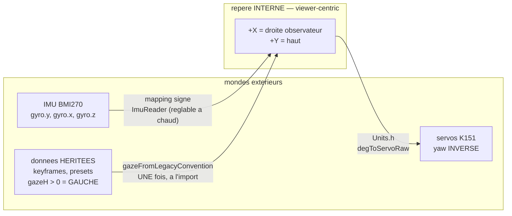

> [English](CONVENTIONS.md) · **Français** — l'anglais est la version de référence.
> Ce fichier peut être en retard d'une mise à jour : en cas de divergence, l'anglais fait foi.

# CONVENTIONS — repères, unités, signes, conversions

> **Document normatif** : tout le code s'y conforme. Les erreurs de convention
> (négations de yaw dispersées, unités mixtes, `/60` magiques) sont faciles à
> introduire et coûteuses à traquer. Une seule règle : **une
> grandeur = une unité = un signe, définis ici, encodés dans
> `src/engine/Units.h`, jamais redéfinis ailleurs.**

---

## 1. Repère unique : viewer-centric

Tout est exprimé du point de vue de **l'observateur qui regarde le robot**
(pas du robot). C'est le repère naturel pour dessiner à l'écran et pour juger
le rendu — et l'inverse du firmware K151 pour le yaw, d'où les conversions §4.

```
            +Y (haut)
             ↑
             │      Écran vu par l'observateur
   ─────────┼─────────→  +X (droite de l'observateur)
             │
```

- **+X = droite de l'observateur** (= gauche du robot).
- **+Y = haut**.
- Ce repère s'applique à : cible de regard, gaze, offsets IMU, coordonnées
  écran logiques. **Aucun module ne raisonne en "gauche/droite du robot".**

`gaze.x > 0` = les yeux se déplacent vers la droite de l'observateur. Les jeux
de données hérités (keyframes et presets esp32-eyes) suivent la convention
**inverse**, `gazeH > 0` = *gauche* viewer : les convertir par
`gazeFromLegacyConvention` à l'import, une seule fois — jamais par une
négation de signe au point d'usage.

Les trois repères en présence, et l'endroit **unique** où l'on passe de
l'un à l'autre. Toute négation de signe ailleurs est un bug de convention :



## 2. Grandeurs et unités par couche

| Grandeur | Type/unité | Plage | Propriétaire |
|---|---|---|---|
| `GazeTarget` (cible de regard monde) | `Vec2f`, unités gaze | [-1, +1] | Brain (IdleBehavior/Sequencer) |
| `Gaze` (position courante des yeux) | `Vec2f`, unités gaze | [-GAZE_MAX_X, +GAZE_MAX_X] × [-GAZE_MAX_Y, +GAZE_MAX_Y] | GazeArbiter |
| Déplacement pupille écran | pixels (float) | ±GAZE_PX_X (=62), ±GAZE_PX_Y (=50) | EyeRig (seul convertisseur gaze→px) |
| Angles tête | degrés servo `float` | yaw : 166 ± 130 (la borne vient du chemin de commande 0-300°, pas de la mécanique) ; pitch : 19..99 (home 93 ; spec officielle Y 5~85° mappée raw) | ServoMotion |
| Vitesses angulaires (IMU, efférence) | °/s, axes écran | — | ImuReader / ServoMotion |
| Temps | `uint32_t` ms (durées) / `uint64_t` µs (mesures) | — | Clock (§5) |
| Couleurs | RGB888 `uint32_t` partout ; conversion 332/565 uniquement au dessin | — | Renderer |
| Ouverture paupière | `float` ratio | [0, 1] | BlinkController |

**Règle** : les pixels n'apparaissent QUE dans `engine/` (EyeRig, Renderer,
drawer). `behavior/` ne manipule que des unités gaze, des degrés et des ms.
Jamais de `SCE_SCALE(8)` dans une amplitude d'animation (sinon les amplitudes
en px esp32-eyes finiraient divisées par 60 puis clampées silencieusement).

## 3. Axes IMU, topologie I2C, carte de la flash → `hardware/`

Trois sections vivaient ici et parlaient de la **carte**, non de conventions :
la table des axes du BMI270 validée sur cible, la topologie I2C partagée 11/12,
et la table des partitions de la flash. Elles vivent désormais là où un lecteur
qui cherche du matériel les trouvera, plutôt que dans un document sur les
unités et les signes :

- axes et signes de l'IMU, et le verdict sur le magnétomètre →
  [`hardware/PERIPHERALS.fr.md`](../hardware/PERIPHERALS.fr.md)
- les deux piles I2C sur une seule paire physique, et `sce::i2cbus::Guard` →
  [`hardware/BUSES.fr.md`](../hardware/BUSES.fr.md)
- partitions, slots OTA et lequel a réellement démarré →
  [`hardware/LIMITS.fr.md`](../hardware/LIMITS.fr.md)

Ce qui reste ici est ce à quoi sert le reste de ce fichier : `ImuReader` livre
`headVel` déjà exprimé en **°/s dans les axes écran, avec des signes
viewer-centric**, si bien que le VOR n'a plus aucun mapping à faire — cela,
c'est une *convention*, et c'est la raison pour laquelle la table de mapping a
le droit de vivre ailleurs.

## 3bis. Invariants de rendu (ne pas régresser)

| Invariant | Règle |
|---|---|
| Paupières | Canal `lid` SÉPARÉ du scale. **Ancré en bas par DÉFAUT** (la fermeture vient du haut, le bord bas ne remonte jamais — Happy/Glee/Sleepy…). **Mode CENTRÉ** pour 12 émotions « rondes » (Normal, Surprised, Awe, Nervous, Excited, Questioning, Curious, Doubt, Contempt, Smug, Dead, Squint) : blinks/winks convergent vers le **centre vertical du plus petit œil de la paire** (`EyeTransformation::LidCenter/LidAnchorY`). Squash/profondeur restent centrés. |
| Yeux fermés | Les DEUX ≤ 0.06 → **une ligne 1 px pleine largeur, posée là où la fermeture aboutit** (`EyeRig::bottomEdgeY` — bord bas en mode tombant, ligne d'ancrage en mode centré ; continuité slit → ligne, signature Cozmo). Wink = rendu par œil. |
| Équidistance | **`OffsetX = 0` dans TOUS les presets** (discipline de preset — `EyeRig::mirrored` inverse le signe pour l'œil droit) : centres constants sur les 30 émotions, écart réglable `eye_spacing` (±px/œil), clamp GAP-1 à ligne médiane MOBILE en filet. SEULE exception : `Preset_Nervous_Alt` (+20 px, petit œil rapproché). |
| Miroir asym | `FaceState.asymMirror` (Brain) : à chaque épisode d'émotion, quel œil porte l'asymétrie est tiré au hasard — et CALÉ sur le sens miroité de la danse en cours. EyeRig applique : leftness effective = `IsMirrored XOR asymMirror`. |
| Rendus spéciaux | Dessinés SEULS sur fond noir (étoile Excited) — jamais posés sur l'œil rectangulaire (dépassements). |
| LEDs | Couleur = `Renderer::eyeColorRgb()` (celle réellement affichée, transition incluse) — jamais recalculée côté LEDs. Luminosité : rampe ∝ intensité de l'émotion. |
| Biseaux (slopes) | Le raccord pente/coin crée des décrochés : slopes réservées aux formes qui en ont besoin (Angry/Skeptic/Scared/Awe/Squint). Sur le bord bas, éviter les « traits » parasites sous les yeux (Sleepy/Scared/Awe/Disgust) ; les pentes basses (Awe -0.08, Squint +0.20) sont volontairement légères. |

## 4. Conversions canoniques (contenu de `Units.h`)

```cpp
// --- Constantes géométrie (ex-LayoutConfig, inchangées) ---
SCREEN_W=320  SCREEN_H=240  EYEZONE_H=160
EYE_L_CX=90   EYE_R_CX=230  EYE_CY=80

// --- Gaze ---
GAZE_MAX_X = 0.40f            // amplitude horizontale max (unités gaze)
GAZE_MAX_Y = 0.20f            // amplitude verticale max
GAZE_PX_X  = 62.0f            // px de déplacement pupille à gaze.x = 1.0
GAZE_PX_Y  = 50.0f            // px à gaze.y = 1.0
pxFromGaze(g)  = { g.x * GAZE_PX_X, -g.y * GAZE_PX_Y }   // -Y : écran vers le bas

// --- Servo (calibration K151, mesurée) ---
YAW_CENTER=166  YAW_RANGE=130  PITCH_NEUTRAL=93  PITCH_MIN=19  PITCH_MAX=99
YAW_REFLEX_RANGE = 40         // clamp des mouvements RELATIFS (suivi du son,
                              // virage après sursaut) : ils font marcher le
                              // yaw sans borne propre, donc un stimulus
                              // soutenu hors axe ne doit pas emporter l'écran
                              // loin de la personne qu'il regarde. Les
                              // commandes absolues (danses, POST /api/servo)
                              // gardent YAW_RANGE.
PITCH_DOWN_MAX = PITCH_MAX - PITCH_NEUTRAL   // = 6, biais « tête baissée » max
                              // atteignable depuis le home — DÉRIVÉ, jamais
                              // écrit en dur

// --- Tête ↔ gaze (remplace toute constante /45 ou /25 dispersée ailleurs) ---
YAW_FULL_GAZE   = 45.0f   // ±45° de yaw = gaze.x = ∓1  (voir signe ci-dessous)
PITCH_FULL_GAZE = 25.0f   // 25° de tilt = gaze.y = +1

// Signe yaw : le servo K151 a yaw < CENTER = tête vers la GAUCHE observateur.
// gazeFromHead : les yeux compensent la tête (regard stable monde) :
gazeFromHead(yawDeg, pitchDeg) = {
    x: -(YAW_CENTER  - yawDeg)   / YAW_FULL_GAZE,   // tête à gauche → yeux à droite (+X)
    y:  (PITCH_NEUTRAL - pitchDeg) / PITCH_FULL_GAZE // tête relevée → yeux vers le haut
}
headFromGaze(g) = inverse exacte (utilisée par le head-follow)

// --- IMU ---
DEG2GAZE_X = 1.0f / YAW_FULL_GAZE    // °→unités gaze (VOR intègre gyro*dt*DEG2GAZE)
DEG2GAZE_Y = 1.0f / PITCH_FULL_GAZE
```

Toute nouvelle conversion s'ajoute **ici et dans Units.h**, jamais inline.

## 5. Temps — abstraction Clock

`engine/` et `behavior/` n'appellent jamais `millis()`/`micros()` directement :

```cpp
struct Clock {                    // interface injectée partout
    virtual uint32_t ms() const = 0;
    virtual uint64_t us() const = 0;
};
// Prod : ArduinoClock (millis/esp_timer). Tests natifs : FakeClock
// (temps piloté par le test → machines d'états testables pas à pas).
```

Corollaires :
- Durées relatives uniquement (`now - start >= dur`) — jamais de comparaison
  de timestamps absolus (wrap-safe).
- Toute logique périodique = timer FreeRTOS ou accumulation de dt, pas de
  `static uint32_t last` dispersés.

## 6. Nommage et style

- Langue : code, commentaires et docs en **anglais** ; chaque `*.md` de
  `docs/` a un jumeau français `*.fr.md` tenu en phase avec lui, l'anglais
  faisant foi. Le texte à l'écran et en console est bilingue via la clé
  `lang` (`docs/reference/CONFIG.md`).
- Suffixes d'unité obligatoires quand ambigu : `Ms`, `Us`, `Deg`, `DegS`
  (°/s), `Px`. Les unités gaze n'ont pas de suffixe (défaut du domaine).
- Un fichier = un composant ; en-tête de fichier : rôle, propriétaire
  (tâche), entrées/sorties, référence ROADMAP.md §.
- Pas de macros hors garde d'include (`SCE_SCALE` disparaît).
- Membres : `_camelCase` ; constantes : `SCREAMING_SNAKE` ; tout état partagé
  entre tâches passe par les primitives §3.5 du plan (queue/triple buffer),
  jamais par un membre "thread-safe par chance".

## 7. Carte de la flash → `hardware/LIMITS.fr.md`

La table des partitions, les deux slots OTA et la raison pour laquelle le
slot qui tourne ne se déduit pas du dernier flash vivent dans
[`hardware/LIMITS.fr.md`](../hardware/LIMITS.fr.md). Ce sont des faits sur
la puce, pas des conventions adoptées par ce code.
