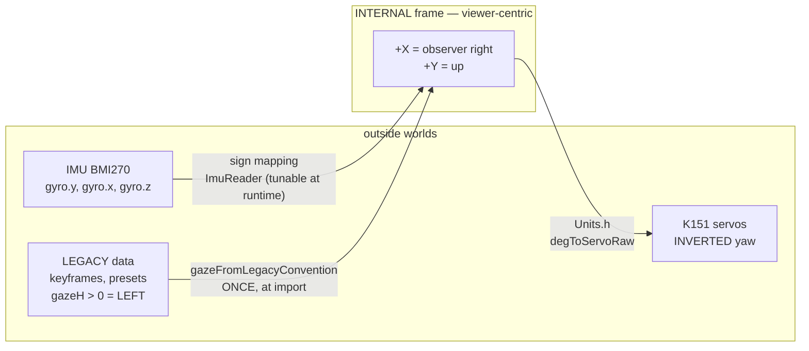

> **English** · [Français](CONVENTIONS.fr.md)

# CONVENTIONS — frames, units, signs, conversions

> **Normative document**: all the code conforms to it. Convention mistakes
> (yaw negations scattered around, mixed units, magic `/60`) are easy to
> introduce and expensive to hunt down. One single rule: **one
> quantity = one unit = one sign, defined here, encoded in
> `src/engine/Units.h`, never redefined anywhere else.**

---

## 1. One single frame: viewer-centric

Everything is expressed from the point of view of **the observer looking at
the robot** (not the robot's). That is the natural frame for drawing on screen
and for judging the result — and the opposite of the K151 firmware for yaw,
hence the conversions in §4.

```
            +Y (up)
             ↑
             │      Screen as seen by the observer
   ─────────┼─────────→  +X (observer's right)
             │
```

- **+X = observer's right** (= robot's left).
- **+Y = up**.
- This frame applies to: gaze target, gaze, IMU offsets, logical screen
  coordinates. **No module ever reasons in "robot left/right".**

`gaze.x > 0` = the eyes move towards the observer's right. Legacy data sets
(esp32-eyes keyframes and presets) use the **opposite** convention, `gazeH > 0`
= viewer *left*: convert them through `gazeFromLegacyConvention` at import
time, once — never by negating a sign at the point of use.

The three frames in play, and the **one** place where you cross from one to
another. Any sign negation elsewhere is a convention bug:



## 2. Quantities and units per layer

| Quantity | Type/unit | Range | Owner |
|---|---|---|---|
| `GazeTarget` (world gaze target) | `Vec2f`, gaze units | [-1, +1] | Brain (IdleBehavior/Sequencer) |
| `Gaze` (current eye position) | `Vec2f`, gaze units | [-GAZE_MAX_X, +GAZE_MAX_X] × [-GAZE_MAX_Y, +GAZE_MAX_Y] | GazeArbiter |
| Screen pupil displacement | pixels (float) | ±GAZE_PX_X (=62), ±GAZE_PX_Y (=50) | EyeRig (sole gaze→px converter) |
| Head angles | servo degrees `float` | yaw: 166 ± 130 (the bound comes from the 0-300° command path, not from the mechanism) ; pitch: 19..99 (home 93 ; official spec Y 5~85° mapped to raw) | ServoMotion |
| Angular velocities (IMU, efference) | °/s, screen axes | — | ImuReader / ServoMotion |
| Time | `uint32_t` ms (durations) / `uint64_t` µs (measurements) | — | Clock (§5) |
| Colors | RGB888 `uint32_t` everywhere; 332/565 conversion only at draw time | — | Renderer |
| Eyelid opening | `float` ratio | [0, 1] | BlinkController |

**Rule**: pixels appear ONLY in `engine/` (EyeRig, Renderer, drawer).
`behavior/` handles nothing but gaze units, degrees and ms. Never a
`SCE_SCALE(8)` inside an animation amplitude (otherwise the esp32-eyes px
amplitudes would end up divided by 60 and then silently clamped).

## 3. IMU axes, I2C topology, flash map → `hardware/`

Three sections lived here and were about the **board**, not about conventions:
the BMI270 axis map validated on target, the shared 11/12 I2C topology, and the
flash partition table. They now live where a reader looking for hardware will
find them, instead of inside a document about units and signs:

- axes and signs of the IMU, and the magnetometer verdict →
  [`hardware/PERIPHERALS.md`](../hardware/PERIPHERALS.md)
- the two I2C stacks on one physical pair, and `sce::i2cbus::Guard` →
  [`hardware/BUSES.md`](../hardware/BUSES.md)
- partitions, OTA slots and which one actually booted →
  [`hardware/LIMITS.md`](../hardware/LIMITS.md)

What stays here is what the rest of this file is for: `ImuReader` delivers
`headVel` already expressed in **°/s in screen axes with viewer-centric
signs**, so the VOR has no mapping left to do — that is a *convention*, and it
is the reason the mapping table is allowed to live elsewhere.

## 3bis. Rendering invariants (do not regress)

| Invariant | Rule |
|---|---|
| Eyelids | `lid` channel SEPARATE from scale. **Bottom-anchored by DEFAULT** (closing comes from the top, the bottom edge never rises — Happy/Glee/Sleepy…). **CENTERED mode** for 12 "round" emotions (Normal, Surprised, Awe, Nervous, Excited, Questioning, Curious, Doubt, Contempt, Smug, Dead, Squint): blinks/winks converge towards the **vertical center of the smaller eye of the pair** (`EyeTransformation::LidCenter/LidAnchorY`). Squash/depth stay centered. |
| Closed eyes | BOTH ≤ 0.06 → **one full-width 1 px line, laid down where the closing ends up** (`EyeRig::bottomEdgeY` — bottom edge in dropping mode, anchor line in centered mode; slit → line continuity, a Cozmo signature). Wink = rendered per eye. |
| Equidistance | **`OffsetX = 0` in ALL presets** (preset discipline — `EyeRig::mirrored` flips the sign for the right eye): constant centers across the 30 emotions, spacing tunable via `eye_spacing` (±px/eye), GAP-1 clamp against a MOVING median line as a safety net. ONE exception: `Preset_Nervous_Alt` (+20 px, the small eye pulled closer). |
| Asym mirror | `FaceState.asymMirror` (Brain): on every emotion episode, which eye carries the asymmetry is drawn at random — and LOCKED to the mirrored direction of the dance in progress. EyeRig applies it: effective leftness = `IsMirrored XOR asymMirror`. |
| Special renders | Drawn ALONE on black (the Excited star) — never laid on top of the rectangular eye (overflows). |
| LEDs | Color = `Renderer::eyeColorRgb()` (the one actually displayed, transition included) — never recomputed on the LED side. Brightness: ramp ∝ emotion intensity. |
| Bevels (slopes) | The slope/corner junction creates steps: slopes are reserved for the shapes that need them (Angry/Skeptic/Scared/Awe/Squint). On the bottom edge, avoid stray "strokes" under the eyes (Sleepy/Scared/Awe/Disgust); the low slopes (Awe -0.08, Squint +0.20) are deliberately gentle. |

## 4. Canonical conversions (contents of `Units.h`)

```cpp
// --- Geometry constants (ex-LayoutConfig, unchanged) ---
SCREEN_W=320  SCREEN_H=240  EYEZONE_H=160
EYE_L_CX=90   EYE_R_CX=230  EYE_CY=80

// --- Gaze ---
GAZE_MAX_X = 0.40f            // max horizontal amplitude (gaze units)
GAZE_MAX_Y = 0.20f            // max vertical amplitude
GAZE_PX_X  = 62.0f            // px of pupil displacement at gaze.x = 1.0
GAZE_PX_Y  = 50.0f            // px at gaze.y = 1.0
pxFromGaze(g)  = { g.x * GAZE_PX_X, -g.y * GAZE_PX_Y }   // -Y: screen Y goes down

// --- Servo (K151 calibration, measured) ---
YAW_CENTER=166  YAW_RANGE=130  PITCH_NEUTRAL=93  PITCH_MIN=19  PITCH_MAX=99
YAW_REFLEX_RANGE = 40         // clamp of the RELATIVE movers (sound tracking,
                              // post-startle turn): they walk the yaw with no
                              // bound of their own, so a sustained off-axis
                              // stimulus must not carry the screen away from
                              // the person it faces. Absolute commands
                              // (dances, POST /api/servo) keep YAW_RANGE.
PITCH_DOWN_MAX = PITCH_MAX - PITCH_NEUTRAL   // = 6, max reachable "head down"
                              // bias from home — DERIVED, never hardcoded

// --- Head ↔ gaze (replaces every /45 or /25 constant scattered elsewhere) ---
YAW_FULL_GAZE   = 45.0f   // ±45° of yaw = gaze.x = ∓1  (see sign below)
PITCH_FULL_GAZE = 25.0f   // 25° of tilt = gaze.y = +1

// Yaw sign: on the K151 servo, yaw < CENTER = head towards the observer's LEFT.
// gazeFromHead: the eyes compensate for the head (world-stable gaze):
gazeFromHead(yawDeg, pitchDeg) = {
    x: -(YAW_CENTER  - yawDeg)   / YAW_FULL_GAZE,   // head left → eyes right (+X)
    y:  (PITCH_NEUTRAL - pitchDeg) / PITCH_FULL_GAZE // head raised → eyes up
}
headFromGaze(g) = exact inverse (used by head-follow)

// --- IMU ---
DEG2GAZE_X = 1.0f / YAW_FULL_GAZE    // °→gaze units (the VOR integrates gyro*dt*DEG2GAZE)
DEG2GAZE_Y = 1.0f / PITCH_FULL_GAZE
```

Every new conversion is added **here and in Units.h**, never inline.

## 5. Time — the Clock abstraction

`engine/` and `behavior/` never call `millis()`/`micros()` directly:

```cpp
struct Clock {                    // interface injected everywhere
    virtual uint32_t ms() const = 0;
    virtual uint64_t us() const = 0;
};
// Prod: ArduinoClock (millis/esp_timer). Native tests: FakeClock
// (time driven by the test → state machines testable step by step).
```

Corollaries:
- Relative durations only (`now - start >= dur`) — never a comparison of
  absolute timestamps (wrap-safe).
- Any periodic logic = a FreeRTOS timer or dt accumulation, no
  `static uint32_t last` scattered around.

## 6. Naming and style

- Language: code, comments and docs in **English**; every `*.md` under `docs/`
  has a French twin `*.fr.md` kept in step with it, the English being
  authoritative. On-screen and console text is bilingual through the `lang`
  key (`docs/reference/CONFIG.md`).
- Unit suffixes are mandatory whenever ambiguous: `Ms`, `Us`, `Deg`, `DegS`
  (°/s), `Px`. Gaze units carry no suffix (the domain default).
- One file = one component; file header: role, owner (task), inputs/outputs,
  ROADMAP.md § reference.
- No macros outside the include guard (`SCE_SCALE` goes away).
- Members: `_camelCase`; constants: `SCREAMING_SNAKE`; every piece of state
  shared between tasks goes through the §3.5 primitives of the plan
  (queue/triple buffer), never through a member that is "thread-safe by
  luck".

## 7. Flash map → `hardware/LIMITS.md`

The partition table, the two OTA slots and the reason the running slot is
not implied by the last flash live in
[`hardware/LIMITS.md`](../hardware/LIMITS.md). They are facts about the
chip, not conventions this code adopted.
