> [English](WORKFLOWS.md) · **Français** — l'anglais est la version de référence.
> Ce fichier peut être en retard d'une mise à jour : en cas de divergence, l'anglais fait foi.

# WORKFLOWS.md — mécanismes clés illustrés

Complète `docs/ROADMAP.md` (référence normative) et `docs/architecture/CONVENTIONS.md`
(unités/axes) avec des diagrammes pour visualiser les mécanismes qui
traversent plusieurs fichiers. Source de vérité toujours : le code.

## 1. Architecture générale — tâches FreeRTOS et primitives

Quatre tâches concurrentes (+ loop()), aucune ne partage de mémoire mutable
sans passer par une primitive dédiée. Le Renderer ne lit jamais l'état
interne du Brain, le Brain n'écrit jamais l'écran, ServoMotion ne connaît
que des cibles. La tâche Caméra (encodage JPEG logiciel ~50-300 ms/frame,
buffers en PSRAM) est en prio 1 : servos et réseau la PRÉEMPTENT — le flux
ne ralentit ni les danses ni l'API.

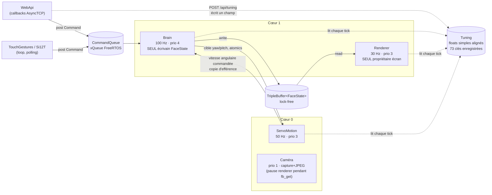

**Règles absolues** (détail ROADMAP §A2) :
- Le Brain est le **seul écrivain** de `FaceState` — ailleurs, lire via
  `brain->currentEmotion()`.
- Le Brain est la **seule source de lissage** des canaux continus (gaze,
  openL/R, squash, VOR) — Renderer et EyeRig appliquent tel quel, jamais de
  rampe/filtre côté rendu (règle A2.15 : une rampe côté rendu rendrait le
  VOR et les blinks invisibles).
- Toute mutation externe passe par la `CommandQueue` : les callbacks
  AsyncTCP ne touchent que `post()` ou un champ `Tuning` — jamais l'état
  partagé directement.

`Tuning` est le seul bloc partagé qui ne porte **aucune** primitive : 73 clés
enregistrées, des `float` nus, ni mutex ni `std::atomic`. Il repose sur une
hypothèse de plateforme explicite — sur Xtensa, l'écriture d'un float 32 bits
aligné est atomique — si bien qu'un lecteur obtient l'ancienne valeur ou la
nouvelle, jamais une valeur déchirée. Cela suffit parce que chaque paramètre a
un sens indépendamment des autres : rien ici n'exige que deux champs changent
ensemble. Ce qui l'exigerait relèverait de la `CommandQueue`.

## 2. Un tick du Brain (100 Hz)

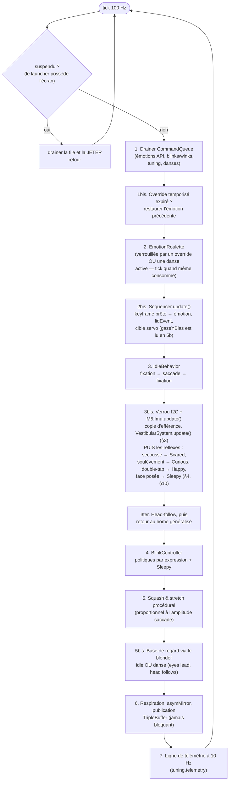

**Un réflexe ne court-circuite pas le tick.** On est tenté de lire les réflexes
comme une porte en tête de tick — ils n'en sont pas une : ils sont évalués à
l'étape 3bis, *après* que la roulette et IdleBehavior ont déjà tourné, parce
qu'ils ont besoin de la lecture IMU qui s'y fait. Ce qui les rend préemptifs,
c'est ce qu'ils FONT — poster un override `SetEmotion` temporisé, appeler
`abortDance()`, préempter le blink — pas l'endroit où ils sont assis. Les
étapes qui ont tourné avant eux dans le même tick sont simplement écrasées
avant toute publication, et l'étape 6 est le seul écrivain que le Renderer
voie jamais.

## 3. Pipeline VOR (réflexe vestibulo-oculaire)

Le VOR compense en continu la rotation de la tête pour garder le regard
stable dans le monde — comme l'œil humain.

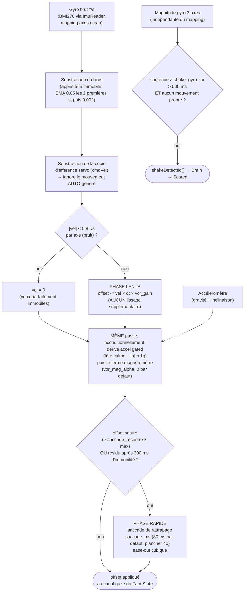

La dérive n'est **pas** l'alternative à une saccade. Phase lente, dérive accel
gated tête calme et terme magnétomètre tournent tous dans la même passe de
stabilisation, l'un après l'autre ; ce n'est qu'ensuite que le résultat est
testé pour la saturation. Lire la dérive comme une branche `else` laisserait
croire que les yeux cessent d'intégrer dès qu'ils ont rattrapé, ce qui est
l'inverse de ce qui se passe.

Deux choses envoient les yeux en phase rapide : l'offset qui **sature**, et un
**résidu** qui survit — la tête est immobile depuis 300 ms et le regard est
toujours à côté de sa cible. Le second existe parce qu'une dérive lente peut
garer les yeux hors du centre sans jamais atteindre la borne de saturation, et
un robot dont les yeux restent tranquillement de travers a l'air cassé plutôt
que vivant.

La détection de secousse est **inhibée par tout mouvement auto-généré** — une
danse en cours *ou* un servo qui bouge, pas les danses seules (l'efférence
2 axes ne corrige pas la magnitude 3 axes) ; l'intégration VOR, elle, reste
**active** pendant les danses (efférence validée).

Le terme magnétomètre est câblé mais neutre : `vor_mag_alpha` vaut 0 par
défaut, et le code le borne à 0,2 même s'il est réglé. Sur le K151 les aimants
des servos biaisent bien trop le champ pour que la lecture soit exploitable —
voir `CONVENTIONS.md §3`.

## 4. Réflexes préemptifs

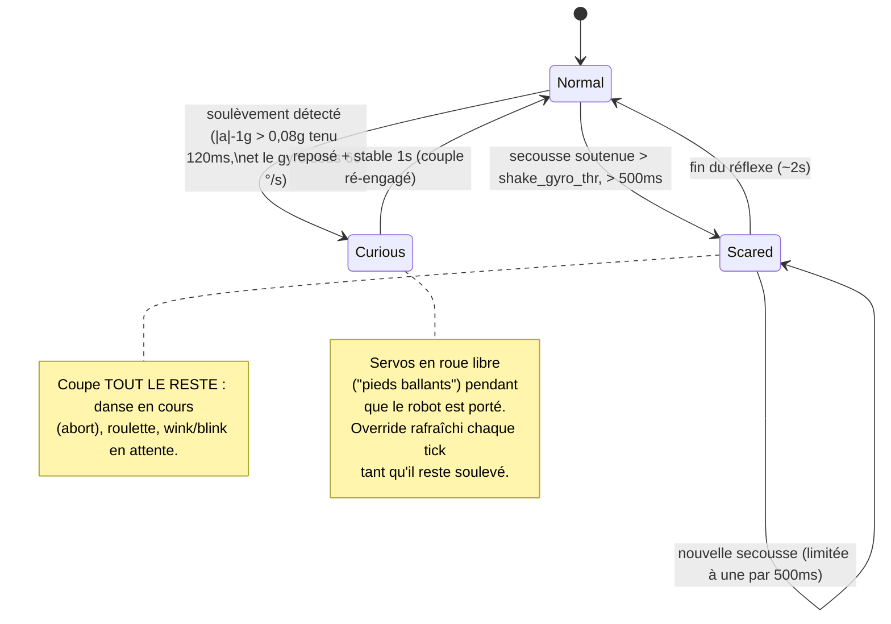

Les deux réflexes passent avant tout le reste, et aucun ne passe avant l'autre :
ce sont deux overrides temporisés appliqués l'un après l'autre dans le même
tick, si bien qu'un soulèvement détecté sur le même tick qu'une secousse arrive
simplement second et gagne. Il n'y a pas d'arbitrage entre eux parce que les
deux gestes ne se produisent pas vraiment ensemble — un robot qu'on soulève
n'est pas en même temps secoué. Les réflexes venus ensuite (double-tap, face
posée), eux, vérifient explicitement les deux avant de tirer : c'est ce qui les
rend polis plutôt que préemptifs.

La porte du soulèvement exige aussi que le gyro reste **sous 60 °/s** :
soulever est une translation, secouer est une rotation, et ne lire que l'écart
accélérométrique ferait passer toute secousse vigoureuse pour une prise en
main. Cette borne discrimine la secousse, elle ne teste pas l'immobilité — une
main qui soulève un robot n'est jamais parfaitement stable, et l'exiger
rejetterait précisément le geste que la porte existe pour attraper.

## 5. Séquencement d'une danse

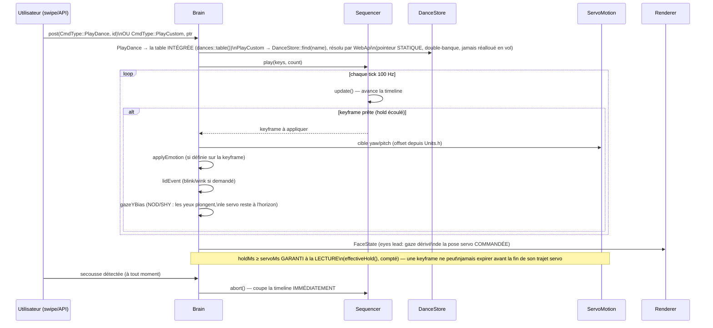

Deux commandes, un seul Sequencer. `PlayDance` porte un **indice** dans la
table intégrée compilée dans le firmware ; `PlayCustom` porte un **pointeur**
que WebApi a déjà résolu via `DanceStore::find(name)`. La séparation existe
parce que les deux sources n'ont pas la même durée de vie — une table intégrée
est immortelle, une chorégraphie SD peut être rechargée sous les pieds du
robot — et la double-banque est ce qui les réconcilie : un rechargement
remplit la banque au repos et bascule un indice, si bien que le pointeur que
tient une danse en cours reste valide jusqu'à sa dernière keyframe.

La garantie `holdMs ≥ servoMs` est appliquée quand la keyframe est **jouée**,
pas quand elle est chargée. Cela garde les tables de keyframes `const` (elles
peuvent vivre en flash plutôt qu'en RAM) et signifie qu'un CSV écrit à la main
ne peut pas faire passer en fraude une keyframe qui expire en plein trajet — le
clamp l'attrape dans les deux cas.

Il se compte aussi lui-même (`Sequencer::clampCount()`), et ce compteur n'est
lu par rien d'autre que `test_sequencer` : le faire remonter en télémétrie
était prévu et ne l'a jamais été. Il reste parce que le test épingle le clamp
au travers — un compteur avec un lecteur honnête vaut mieux qu'un compteur
dont la seule justification était un projet.

Les chorégraphies personnalisées (`/dances/*.csv` sur la carte SD) sont parsées
par `DanceStore::reload()` au boot, à la demande (`POST /api/dances/reload`) et
après un remontage de la SD — détail complet du format :
[`docs/reference/CHOREGRAPHIES.md`](../reference/CHOREGRAPHIES.fr.md).

## 6. Réseau : STA avec repli AP + portail captif

Même forme des deux côtés — tenter la station, se replier sur un point d'accès
qui sert un portail captif — mais les deux ne résolvent pas leurs identifiants
de la même façon, et cette différence est tout l'enjeu : le companion est
provisionné par la **carte**, un invité peut l'être **à la main sur
l'appareil**.

```mermaid
flowchart TD
    subgraph C["companion — WebApi::begin()"]
      CB(["boot"]) --> CQ{"config.yaml porte un\nclient_ssid non vide ?"}
      CQ -- non --> CAP["softAP(ap_ssid)\npar défaut StackChan-AP"]
      CQ -- oui --> CSTA["setHostname(hostname)\nWiFi.begin(ssid, pass)\n10 s, UNE tentative"]
      CSTA --> COK{"WL_CONNECTED ?"}
      COK -- non --> CAP
      COK -- oui --> CGOT["STA"]
      CAP --> CDNS["DNSServer :53 sur '*'\nportail captif"]
      CGOT --> CEnd
      CDNS --> CEnd["setSleep(false), TxPower 19,5 dBm\nmDNS hostname.local — les DEUX modes\nmiddleware Basic-Auth, routes,\ncheckRouteOrder(), server.begin()"]
    end

    subgraph G["invité — SceGuest::begin()"]
      GB(["boot"]) --> GSD["lit /stackchan-companion/config.yaml\n(même carte, même fichier)"]
      GSD --> GNVS{"la NVS 'sce-net'\ntient un ssid ?"}
      GNVS -- oui --> GOV["il SUPPLANTE la carte\n(quelqu'un l'a saisi ICI)"]
      GNVS -- non --> GCARD["la carte, sinon les\narguments de begin()"]
      GOV --> GSTA["WiFi.begin(...) 10 s"]
      GCARD --> GSTA
      GSTA --> GOK{"connecté ?"}
      GOK -- oui --> GTok["jeton CSRF tiré\n(radio levée = vraie entropie)"]
      GOK -- non --> GAP["AP : ap_ssid depuis la carte,\nsinon SCE-Guest / goodlife"]
      GAP --> GDNS["DNSServer :53 sur '*'\n+ onNotFound -> 302 /config"]
      GDNS --> GTok
    end
```

**Un portail captif a deux moitiés, et la redirection est celle qui l'ouvre.**
Le DNS joker garantit seulement que le nom demandé par le téléphone résout vers
la carte ; ce qui décide de l'apparition du portail, c'est la réponse à la
sonde qui suit — `/generate_204` sur Android, `/hotspot-detect.html` chez
Apple, `/connecttest.txt` sous Windows, `/canonical.html` pour Firefox. Aucune
n'est une route déclarée : elles tombaient donc sur le 404 intégré du
WebServer. Cela suffit à Android et Windows pour finir par proposer une
connexion, mais Apple *affiche* la page renvoyée dans sa feuille de portail —
l'usager lisait donc « Not found » là où le formulaire devait être.
`onNotFound` répond désormais une **302 vers `/config`**, qui n'est le corps
attendu par personne et se lit donc comme un portail chez les quatre.

Elle n'est posée qu'**en mode AP**, et cette limite porte : sur un réseau
rejoint, le même gestionnaire transformerait chaque faute de frappe et chaque
signet périmé en redirection silencieuse vers la page de réglages. Une route
absente doit rester absente. La redirection nomme l'**IP** de l'AP et non un
nom d'hôte — toute la situation étant qu'aucun nom ne résout — et c'est
l'adresse qu'imprime déjà l'écran sans réseau : ignorer la fenêtre et la taper
à la main mène au même endroit.

Quatre sources classées côté invité, la première qui répond gagne : la **NVS**
(un acte délibéré sur CETTE unité passe avant une carte qui nomme peut-être
encore l'ancien réseau), puis la carte, puis le SSID compilé dans `begin()`,
puis l'AP. « Oublier » sur `/config` efface l'entrée NVS et rend l'autorité à
la carte. C'est la seule voie par laquelle un bin autonome — un Fire sans
companion — apprend un jour un réseau.

Aucun des deux côtés ne réessaie : une tentative, dix secondes, puis l'AP. La
pompe qui répond au portail diffère, et chacune garde ce qu'elle possède
réellement : le companion fait tourner le `DNSServer` depuis `webApi->update()`
**quand il est en mode AP**, l'invité le fait tourner **quand le serveur DNS a
effectivement démarré**. Le mDNS est un service propre au companion, et il est
enregistré dans les **deux** modes — le nom répond aussi sur l'AP.

La table de routes est enregistrée sous la règle A2.19 (chemin spécifique avant
son préfixe) ; `checkRouteOrder()` relit au boot la table consignée et dénonce
les violations en série. Il ne fait que signaler — rien ne se réordonne tout
seul, donc une ligne série est tout l'avertissement.

## 7. Séquence de boot matériel (`hal/Board.h`)

L'ordre est contraint par le matériel K151 — l'inverser casse le boot.
`Board` lève les **rails et les bus**, et s'arrête là : il lève VM_EN pour que
les servos *aient du courant*, mais il n'appelle jamais `servo.begin()` —
ServoMotion s'en charge plus tard, depuis sa propre tâche, et cela ne marche
que parce que le rail est déjà levé. Garder les deux séparés est ce qui permet
à une carte sans servo de démarrer exactement de la même façon.

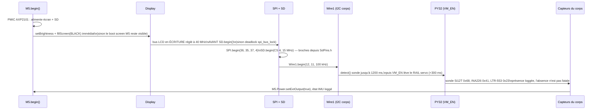

## 8. Écriture/lecture SD différée : `renderer.pause()`/`resume()`

Le bus SPI2 est **partagé** entre le LCD et la SD. Une écriture SD qui
coïncide avec un push du renderer fait échouer le protocole carte
(retries « no token received ») ET gèle l'affichage le temps des retries.

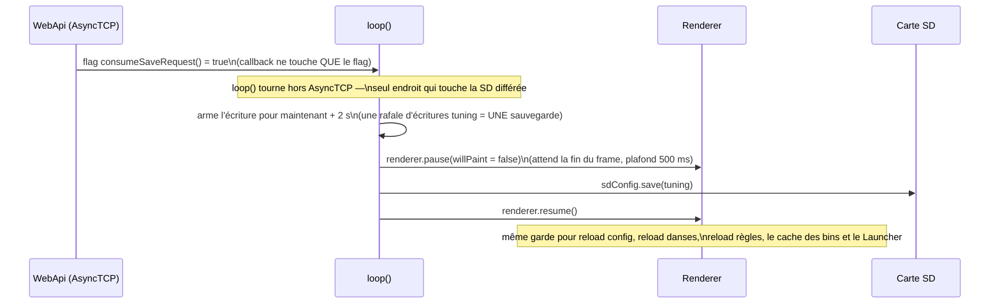

Le débounce est toute la raison d'être de l'armement à deux secondes : la
console écrit une clé par widget, et un utilisateur qui traîne un curseur en
poste une douzaine en une seconde. Sauvegarder à chaque fois, ce serait une
douzaine de frames en pause et une douzaine d'écritures carte pour une seule
intention. L'écriture en attente est forcée avant un redémarrage ou une
extinction, si bien qu'attendre ne perd rien.

`pause(willPaint)` dit si le pauseur va **dessiner** pendant qu'il tient
l'écran. Les sites de SD différée passent `false` — ils veulent seulement que
le bus SPI2 se taise — tandis que le Launcher passe `true` parce qu'il prend
l'écran entièrement à son compte, et que le renderer doit invalider ses caches
avant de repeindre. L'attente elle-même est plafonnée à 500 ms : si le renderer
est coincé, l'appelant poursuit plutôt que de bloquer la loop().

`pause()`/`resume()` est **refcounté sous spinlock** : deux
pauseurs concurrents coexistent (loop() pour la SD, tâche caméra autour de
`fb_get`, cœurs différents). Premier pauseur arme, dernier resume désarme ;
compteur clampé à 0. La boucle renderer **re-vérifie la demande après son
ack** et avant de dessiner, si bien qu'un ack émis juste avant l'arrivée d'un
second pauseur ne peut pas se lire comme une autorisation de dessiner.
Toujours apparier pause et resume ; jamais de resume orphelin.

## 9. Suivi du son (tête vers le bruit, `sound_track=1`)

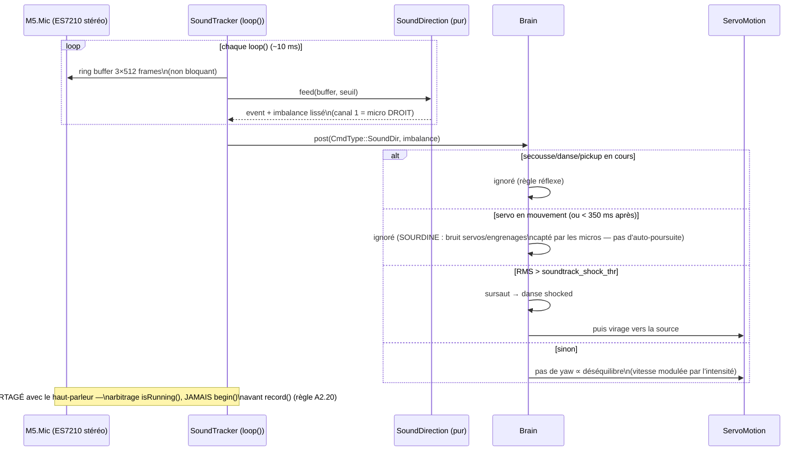

## 10. Gestes IMU additionnels

Le BMI270 via M5Unified n'expose aucune interruption tap matérielle —
double-tap et orientation sont dérivés du flux accel/gyro déjà lu par le VOR
(§3), pas d'un capteur/bus séparé.

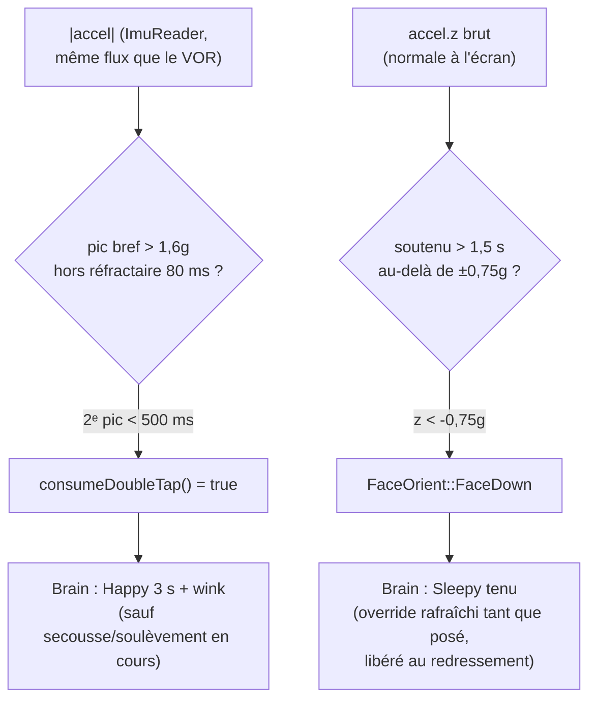

## 11. Bande de statut & plugins (`sources → champs → {widgets, règles}`)

Contrat unique : toute source pose des **champs** dans le blackboard
(`FieldStore`) ; le Renderer les DESSINE (widgets de la bande) et le
`RuleEngine` y RÉAGIT (règles `champ → Commande`). Détail : `docs/reference/STATUSBAR.md`
(affichage) + `docs/reference/PLUGINS.md` (contrat). Aucune source ne câble de chemin
dédié vers l'écran ou le Brain.

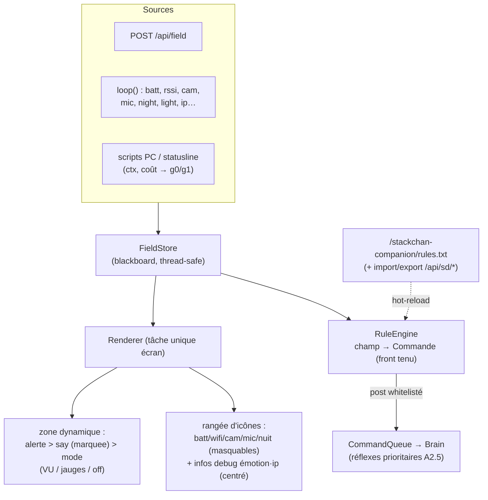

## 12. Lancer un `.bin` invité, et revenir

La chaîne qui échange le firmware exécuté par la puce. Chaque flèche traverse
un redémarrage, et c'est pourquoi rien ici ne peut être un appel de fonction.

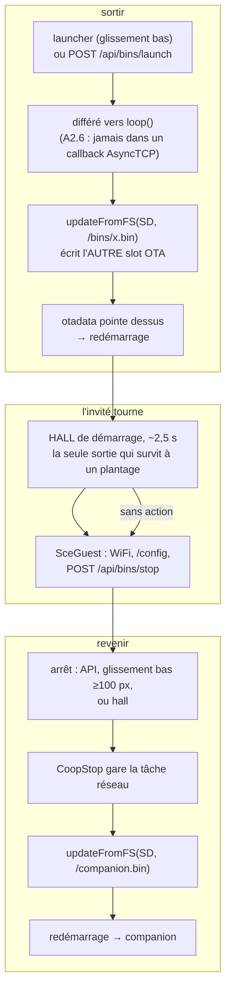

**Le piège est la dernière flèche.** Revenir reflashe le companion **depuis la
carte SD** : un `/companion.bin` périmé écrase donc en silence un firmware que
vous venez de flasher par USB — et tous les signaux extérieurs annoncent quand
même un succès. C'est pour cela que `GET /api/firmware` publie `slot`, `sha`
et `console`, et que rafraîchir la copie SD fait partie du flash au lieu d'en
être la suite. L'arithmétique des partitions derrière tout cela — deux slots
applicatifs, `otadata`, et pourquoi le slot qui tourne ne se déduit pas du
dernier flash — est dans [`hardware/LIMITS.fr.md`](../hardware/LIMITS.fr.md).

**Pourquoi le garage compte.** `updateFromFS` lit la carte et écrit la flash
depuis `loop()`. Une tâche invitée encore en train de télécharger en TLS lui
dispute le bus SD/SPI et le tas, et un reflash de ~9 s devient des minutes de
contention avec HTTP muet — vu du réseau, impossible à distinguer d'un
plantage. `sce::CoopStop` est l'arrêt coopératif qui l'évite ; le contrat, y
compris la fenêtre d'acquittement que chaque bin choisit, est dans
[`../guests/README.fr.md`](../guests/README.fr.md).

**Pourquoi le hall existe.** C'est le seul retour qui ne dépende ni du code de
l'invité ni du réseau. Les trois sorties se dégradent dans cet ordre : l'API
est muette si le WiFi est tombé, le geste est muet si le `loop()` de l'invité
est bloqué, et le hall n'est muet que si le démarrage lui-même plante — auquel
cas on sort la carte et la copie se fait à la main.
