> **English** · [Français](WORKFLOWS.fr.md)

# WORKFLOWS.md — key mechanisms, illustrated

Complements `docs/ROADMAP.md` (the normative reference) and
`docs/architecture/CONVENTIONS.md` (units/axes) with diagrams that make the
mechanisms spanning several files visible at a glance. The source of truth is
always the code.

## 1. Overall architecture — FreeRTOS tasks and primitives

Four concurrent tasks (+ `loop()`), none of which shares mutable memory
without going through a dedicated primitive. The Renderer never reads the
Brain's internal state, the Brain never writes to the screen, ServoMotion
knows nothing but targets. The Camera task (software JPEG encoding
~50-300 ms/frame, buffers in PSRAM) runs at priority 1: servos and network
PREEMPT it — the stream slows down neither the dances nor the API.

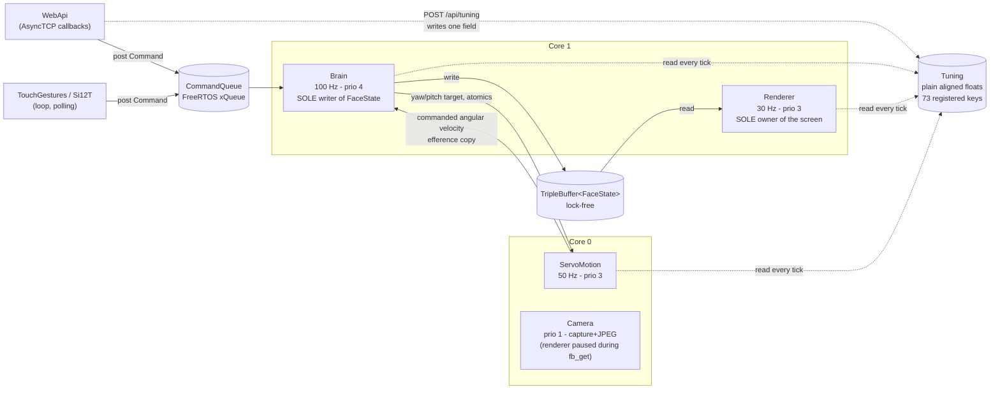

**Absolute rules** (details in ROADMAP §A2):
- The Brain is the **sole writer** of `FaceState` — everywhere else, read via
  `brain->currentEmotion()`.
- The Brain is the **sole source of smoothing** for the continuous channels
  (gaze, openL/R, squash, VOR) — Renderer and EyeRig apply values as-is, never
  a ramp or filter on the render side (rule A2.15: a ramp on the render side
  would make the VOR and the blinks invisible).
- Every external mutation goes through the `CommandQueue`: AsyncTCP callbacks
  touch nothing but `post()` or a `Tuning` field — never the shared state
  directly.

`Tuning` is the one shared block that carries **no** primitive: 73 registered
keys, plain `float`, no mutex and no `std::atomic`. It rests on an explicit
platform assumption — an aligned 32-bit float write is atomic on Xtensa — so
a reader gets the old value or the new one, never a torn one. That is enough
because every parameter is independently meaningful: nothing here needs two
fields to change together. Anything that did would belong in the
`CommandQueue` instead.

## 2. One Brain tick (100 Hz)

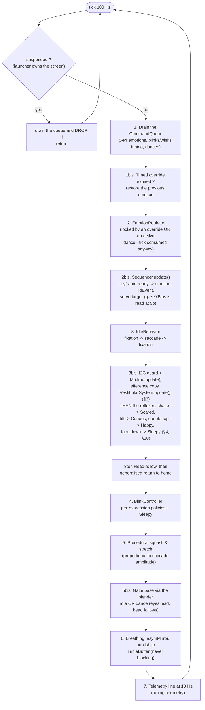

**A reflex does not short-circuit the tick.** It is tempting to read the
reflexes as a gate at the top — they are not: they are evaluated in step 3bis,
*after* the roulette and IdleBehavior have already run, because they need the
IMU read that happens there. What makes them preemptive is what they DO — post
a timed `SetEmotion` override, call `abortDance()`, preempt the blink — not
where they sit. The steps that ran before them in the same tick are simply
overwritten before anything is published, and step 6 is the only writer the
Renderer ever sees.

## 3. VOR pipeline (vestibulo-ocular reflex)

The VOR continuously compensates for head rotation so the gaze stays stable
in the world — just like the human eye.

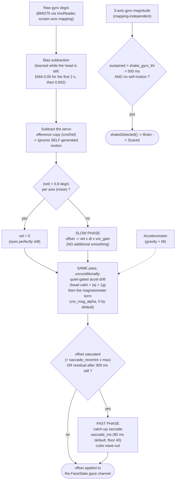

The drift is **not** the alternative to a saccade. Slow phase, quiet-gated
accel drift and magnetometer term all run in the same stabilise pass, one
after the other; only then is the result tested for saturation. Reading the
drift as an `else` branch suggests the eyes stop integrating as soon as they
catch up, which is the opposite of what happens.

Two things send the eyes into the fast phase: the offset **saturating**, and a
**residual** that survives — the head has been still for 300 ms and the gaze
is still off its target. The second exists because a slow drift can park the
eyes off-centre without ever reaching the saturation bound, and a robot whose
eyes sit quietly off-axis looks broken rather than alive.

Shake detection is **inhibited by any self-generated motion** — a running
dance *or* a moving servo, not dances alone (the 2-axis efference does not
correct the 3-axis magnitude). VOR integration, on the other hand, stays
**active** during the dances (efference validated).

The magnetometer term is wired but neutral: `vor_mag_alpha` defaults to 0, and
the code clamps it to 0.2 even when set. On the K151 the servo magnets bias
the field far too much for the reading to be usable — see
`CONVENTIONS.md §3`.

## 4. Preemptive reflexes

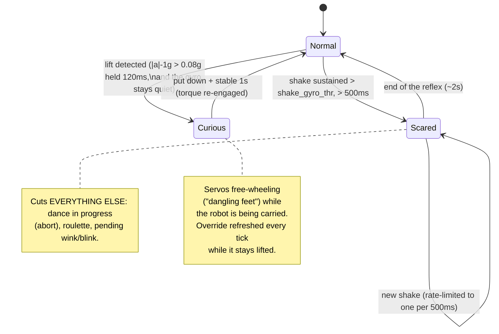

Both reflexes outrank everything else, and neither outranks the other: they
are two timed overrides applied one after the other in the same tick, so a
lift detected on the same tick as a shake simply lands second and wins. There
is no arbitration between them because the two gestures do not really
co-occur — a robot being picked up is not also being shaken. The reflexes that
came later (double-tap, face-down) *do* check both explicitly before firing,
which is what makes them polite rather than preemptive.

The lift gate also requires the gyro to stay **below 60 °/s**: lifting is a
translation, shaking is a rotation, and reading only the accelerometer
deviation would make every vigorous shake look like a pickup. That bound is a
shake discriminator, not a stillness test — a hand picking a robot up is never
perfectly steady, and demanding that it be would reject the very gesture the
gate exists to catch.

## 5. Sequencing of a dance

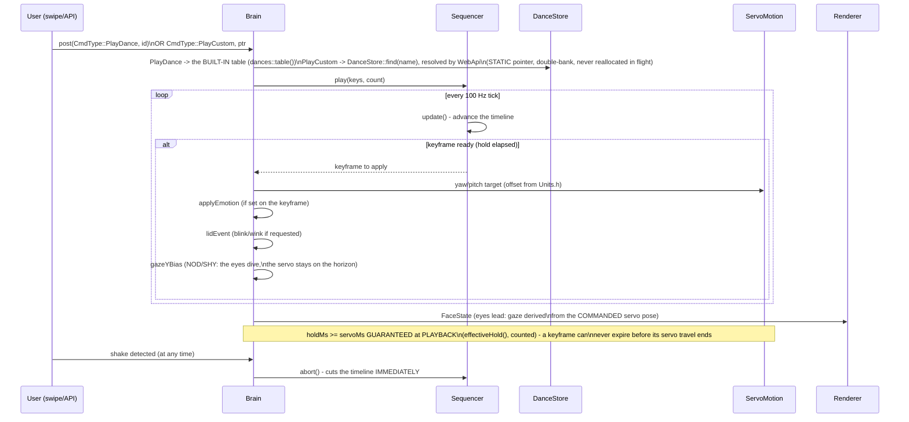

Two commands, one Sequencer. `PlayDance` carries an **index** into the
built-in table compiled into the firmware; `PlayCustom` carries a **pointer**
that WebApi has already resolved through `DanceStore::find(name)`. The split
exists because the two sources have different lifetimes — a built-in table is
immortal, an SD choreography can be reloaded under the robot's feet — and the
double-bank is what reconciles them: a reload fills the idle bank and flips an
index, so the pointer a running dance holds stays valid to its last keyframe.

The `holdMs >= servoMs` guarantee is enforced when the keyframe is **played**,
not when it is loaded. That keeps keyframe tables `const` (they can live in
flash rather than RAM) and means a hand-written CSV cannot smuggle in a
keyframe that expires mid-travel — the clamp catches it either way.

It also counts itself (`Sequencer::clampCount()`), and that counter is read by
nothing but `test_sequencer`: surfacing it in telemetry was intended and never
done. It stays because the test pins the clamp through it — a counter with one
honest reader is worth more than a counter whose only claim was a plan.

Custom choreographies (`/dances/*.csv` on the SD card) are parsed by
`DanceStore::reload()` at boot, on demand (`POST /api/dances/reload`) and after
an SD remount — full format details:
[`docs/reference/CHOREGRAPHIES.md`](../reference/CHOREGRAPHIES.md).

## 6. Network: STA with AP fallback + captive portal

Same shape on both sides — try the station, fall back to an access point that
serves a captive portal — but the two do not resolve their credentials the
same way, and that difference is the whole point: the companion is
provisioned by the **card**, a guest can be provisioned by **hand on the
device**.

```mermaid
flowchart TD
    subgraph C["companion — WebApi::begin()"]
      CB(["boot"]) --> CQ{"config.yaml carries a\nnon-empty client_ssid ?"}
      CQ -- no --> CAP["softAP(ap_ssid)\ndefault StackChan-AP"]
      CQ -- yes --> CSTA["setHostname(hostname)\nWiFi.begin(ssid, pass)\n10 s, ONE attempt"]
      CSTA --> COK{"WL_CONNECTED ?"}
      COK -- no --> CAP
      COK -- yes --> CGOT["STA"]
      CAP --> CDNS["DNSServer :53 on '*'\ncaptive portal"]
      CGOT --> CEnd
      CDNS --> CEnd["setSleep(false), TxPower 19.5 dBm\nmDNS hostname.local - BOTH modes\nBasic-Auth middleware, routes,\ncheckRouteOrder(), server.begin()"]
    end

    subgraph G["guest — SceGuest::begin()"]
      GB(["boot"]) --> GSD["read /stackchan-companion/config.yaml\n(same card, same file)"]
      GSD --> GNVS{"NVS 'sce-net'\nholds an ssid ?"}
      GNVS -- yes --> GOV["it OVERRIDES the card\n(somebody typed it HERE)"]
      GNVS -- no --> GCARD["the card, else the\nbegin() arguments"]
      GOV --> GSTA["WiFi.begin(...) 10 s"]
      GCARD --> GSTA
      GSTA --> GOK{"connected ?"}
      GOK -- yes --> GTok["CSRF token drawn\n(radio up = real entropy)"]
      GOK -- no --> GAP["AP: ap_ssid from the card,\nelse SCE-Guest / goodlife"]
      GAP --> GDNS["DNSServer :53 on '*'\n+ onNotFound -> 302 /config"]
      GDNS --> GTok
    end
```

**A captive portal is two halves, and the redirect is the half that opens it.**
Wildcard DNS only guarantees that whatever name the phone asks for resolves to
the board; what decides whether a portal appears is the answer to the probe
that follows — `/generate_204` on Android, `/hotspot-detect.html` on Apple,
`/connecttest.txt` on Windows, `/canonical.html` on Firefox. None of those is a
registered route, so they used to fall through to the WebServer's built-in
404. That is enough for Android and Windows to raise a "sign in" notice
eventually, but Apple *displays* the returned page in its portal sheet — so
what a user actually got was the words "Not found" where the form should have
been. `onNotFound` now answers a **302 to `/config`**, which is the expected
body for nobody and therefore reads as a portal to all four.

It is registered **only in AP mode**, and that limit is load-bearing: on a
joined network the same handler would turn every typo and every stale bookmark
into a silent redirect to the settings page. A missing route has to stay a
missing route. The redirect names the AP's **IP** rather than a hostname —
the whole situation being that no name resolves — and it is the same address
the no-network screen prints, so ignoring the pop-up and typing it by hand
lands in the same place.

Four ranked sources on the guest side, first match wins: **NVS** (a
deliberate act on THIS unit outranks a card that may still name the old
network), then the card, then the SSID compiled into `begin()`, then the AP.
"Forget" on `/config` erases the NVS entry and hands authority back to the
card. This is the only road by which a standalone bin — a Fire with no
companion — ever learns a network.

Neither side retries: one attempt, ten seconds, then the AP. The pump that
answers the portal differs, and each guards what it actually has: the
companion runs the `DNSServer` from `webApi->update()` **when in AP mode**,
the guest runs it **when the DNS server actually started**. mDNS is a
companion-only service, and it is registered in **both** modes — the name
answers on the AP too.

The route table is registered under the A2.19 rule (specific path before its
prefix); `checkRouteOrder()` re-reads the recorded table at boot and denounces
violations on serial. It only reports — nothing reorders itself, so a serial
line is the whole warning.

## 7. Hardware boot sequence (`hal/Board.h`)

The order is dictated by the K151 hardware — reversing it breaks the boot.
`Board` brings up the **rails and the buses**, and stops there: it raises
VM_EN so the servos *have current*, but it never calls `servo.begin()` —
ServoMotion does that later, from its own task, and it only works because the
rail is already up. Keeping the two apart is what lets a board with no servo
boot exactly the same way.

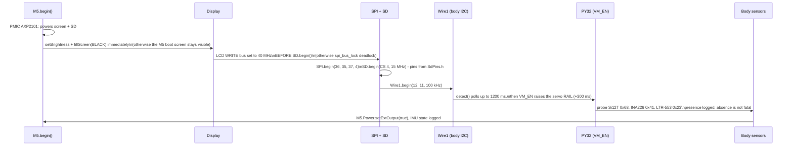

## 8. Deferred SD writes/reads: `renderer.pause()`/`resume()`

The SPI2 bus is **shared** between the LCD and the SD card. An SD write that
coincides with a renderer push makes the card protocol fail (retries, "no
token received") AND freezes the display for the duration of the retries.

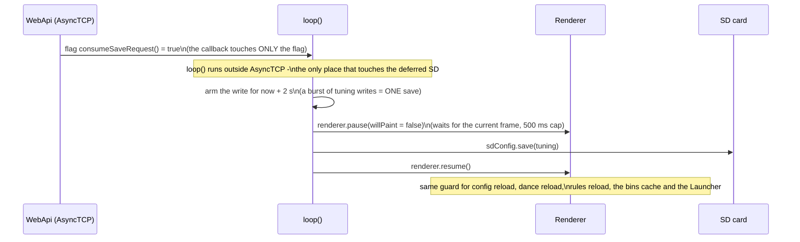

The debounce is the point of the two-second arming: the console writes one key
per widget, and a user dragging a slider posts a dozen in a second. Saving on
each would mean a dozen paused frames and a dozen card writes for one
intention. The pending write is force-flushed before a reboot or a power-off,
so nothing is lost by waiting.

`pause(willPaint)` says whether the pauser will **draw** while it holds the
screen. The deferred-SD sites pass `false` — they only want the SPI2 bus quiet
— while the Launcher passes `true` because it takes the screen over
completely, and the renderer must invalidate its caches before painting again.
The wait itself is capped at 500 ms: if the renderer is wedged, the caller
proceeds rather than deadlocking the loop.

`pause()`/`resume()` is **refcounted under a spinlock**: two concurrent
pausers coexist (`loop()` for the SD, the camera task around `fb_get`,
different cores). The first pauser arms it, the last resume disarms it; the
counter is clamped at 0. The renderer loop **re-checks the request after its
ack** and before drawing, so an ack issued a moment before a second pauser
arrives cannot be read as permission to draw. Always pair pause with resume;
never issue an orphan resume.

## 9. Sound tracking (head towards the noise, `sound_track=1`)

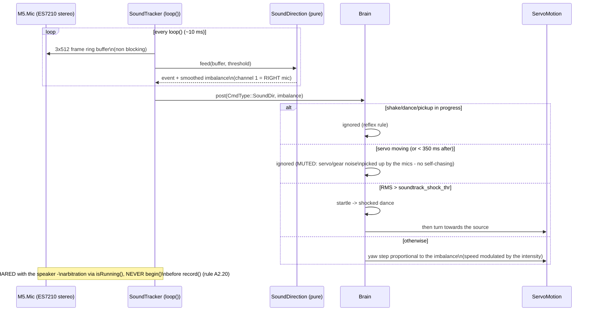

## 10. Additional IMU gestures

The BMI270 via M5Unified exposes no hardware tap interrupt — double-tap and
orientation are derived from the accel/gyro stream the VOR already reads (§3),
not from a separate sensor or bus.

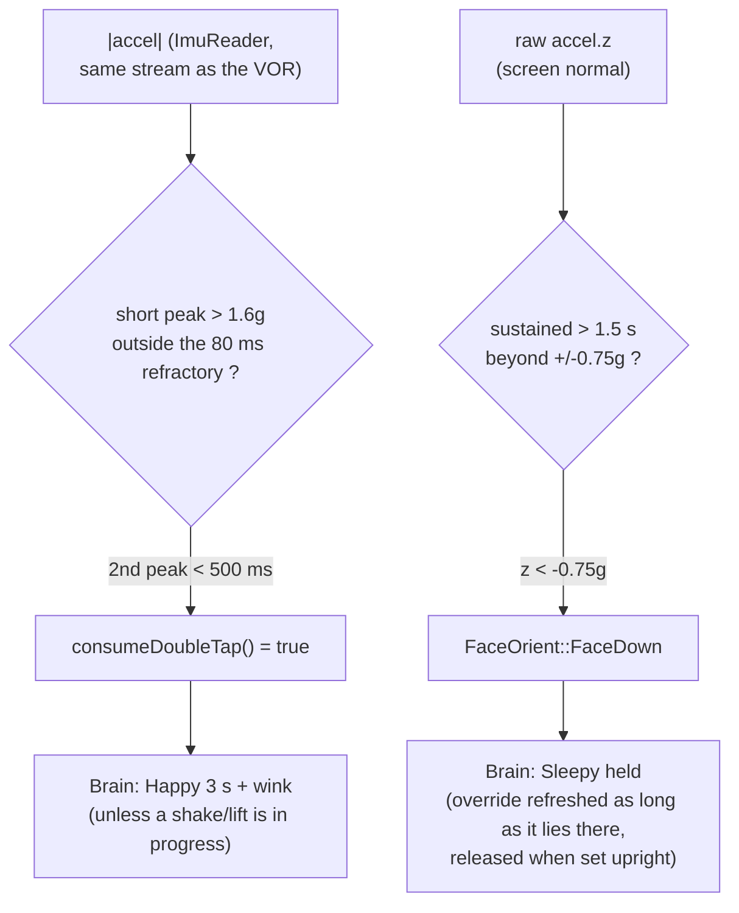

## 11. Status bar & plugins (`sources → fields → {widgets, rules}`)

One single contract: every source drops **fields** into the blackboard
(`FieldStore`); the Renderer DRAWS them (status bar widgets) and the
`RuleEngine` REACTS to them (`field → Command` rules). Details:
`docs/reference/STATUSBAR.md` (display) + `docs/reference/PLUGINS.md`
(contract). No source ever wires a dedicated path to the screen or the Brain.

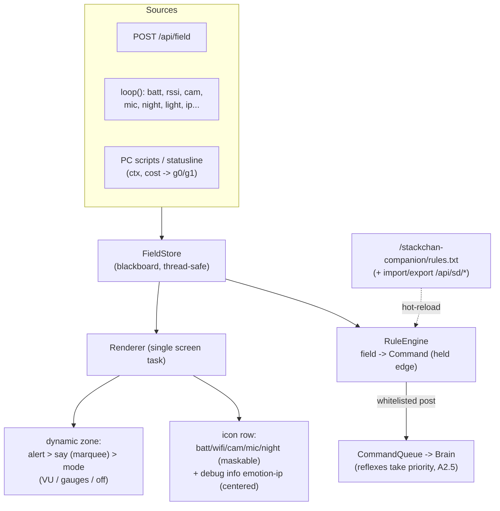

## 12. Launching a guest `.bin`, and coming back

The chain that swaps the firmware running on the chip. Every arrow crosses a
reboot, which is why nothing here can be a function call.

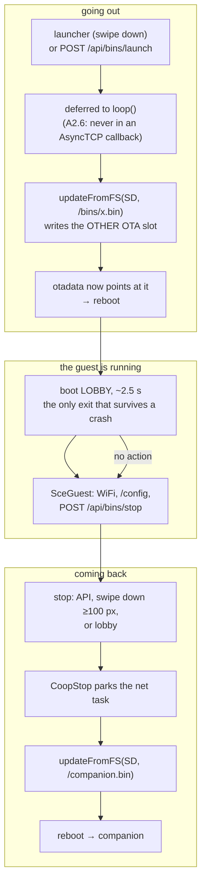

**The trap is the last arrow.** Coming back reflashes the companion **from the
SD card**, so a stale `/companion.bin` silently overwrites a firmware you just
flashed over USB — and every outward signal still reports success. That is why
`GET /api/firmware` publishes `slot`, `sha` and `console`, and why refreshing
the SD copy is part of flashing rather than an afterthought. The partition
arithmetic behind it — two app slots, `otadata`, and why the running slot is
not implied by the last flash — is in
[`hardware/LIMITS.md`](../hardware/LIMITS.md).

**Why parking matters.** `updateFromFS` reads the card and writes flash from
inside `loop()`. A guest task still fetching over TLS fights it for the SD/SPI
bus and the heap, and a ~9 s reflash becomes minutes of contention with HTTP
dark — from the network, indistinguishable from a crash. `sce::CoopStop` is
the cooperative stop that avoids it; the contract, including the ACK window
each bin chooses, is in [`../guests/README.md`](../guests/README.md).

**Why the lobby exists.** It is the only way back that does not depend on the
guest's own code or on the network. The three exits degrade in that order:
the API is silent if WiFi went down, the swipe is silent if the guest's
`loop()` is blocked, and the lobby is silent only if the boot itself crashes —
at which point the card comes out and the copy is manual.
