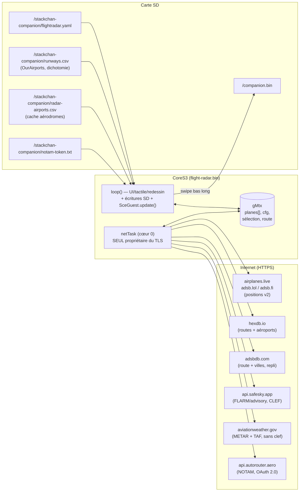
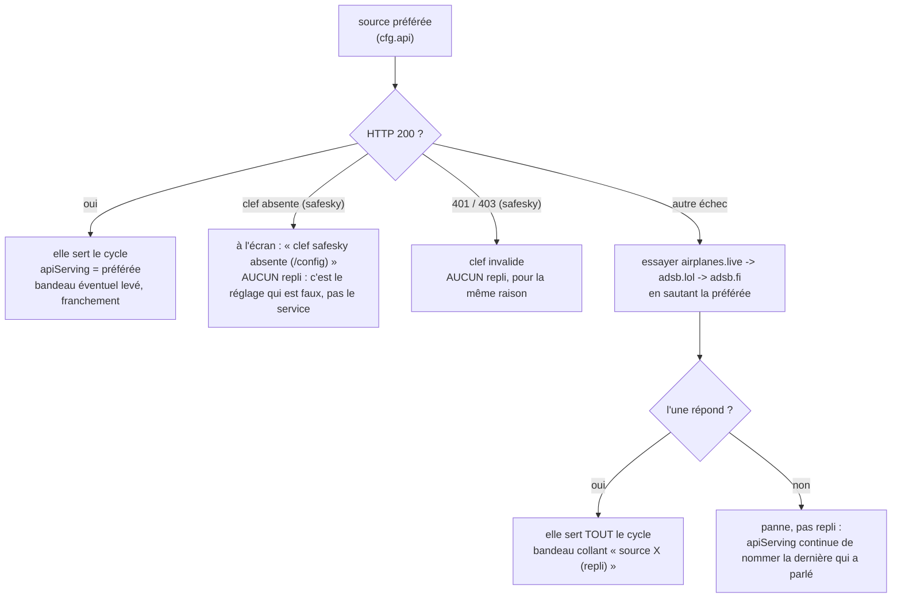
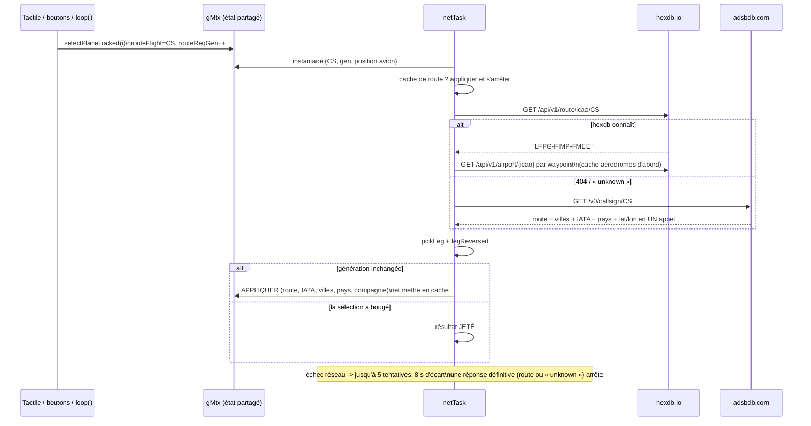
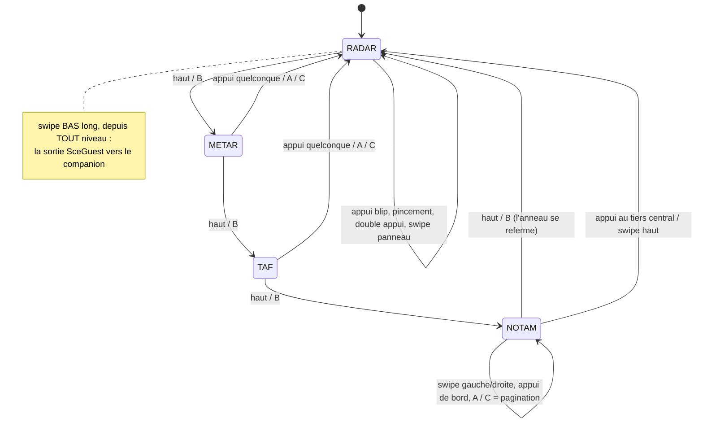
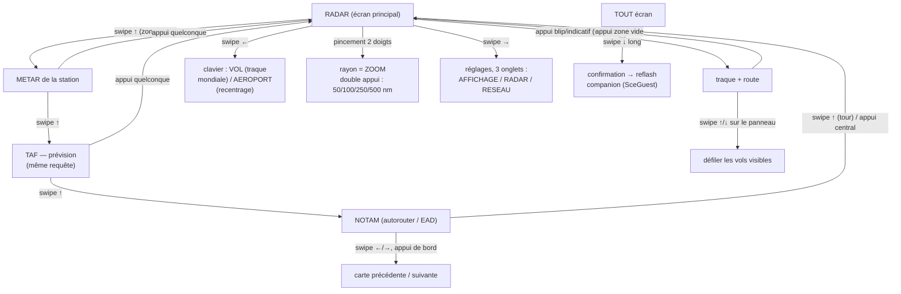
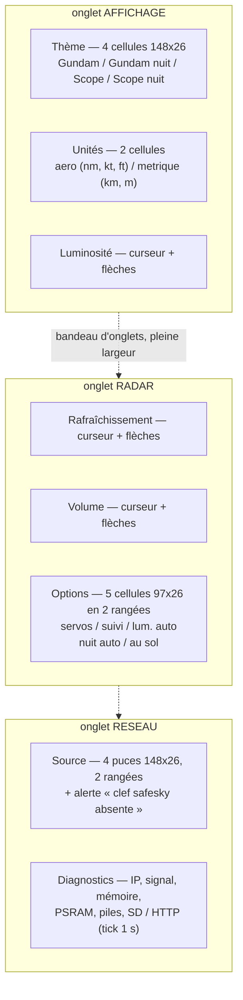
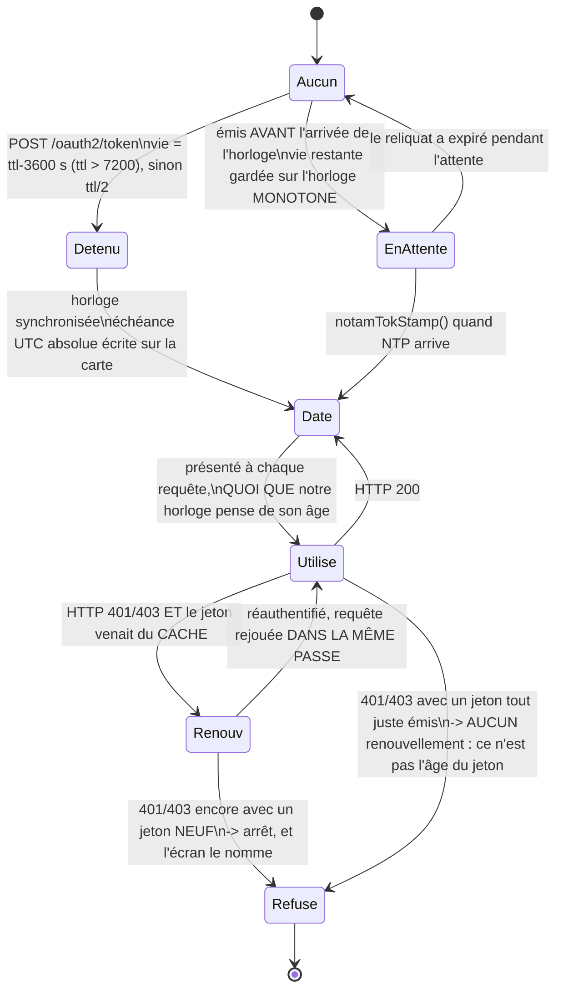
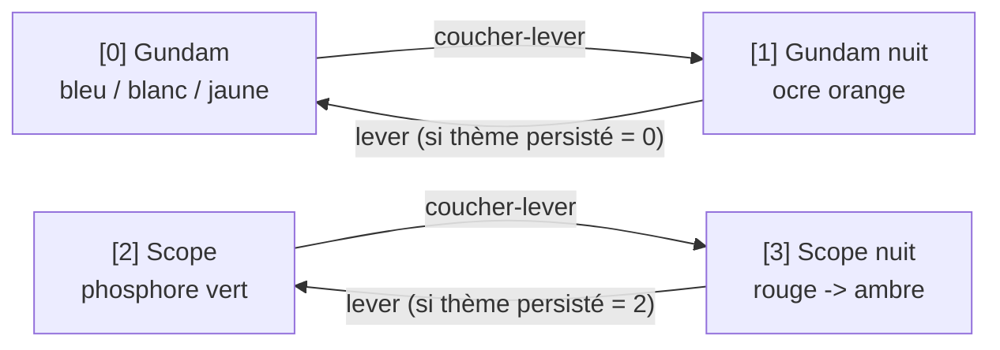
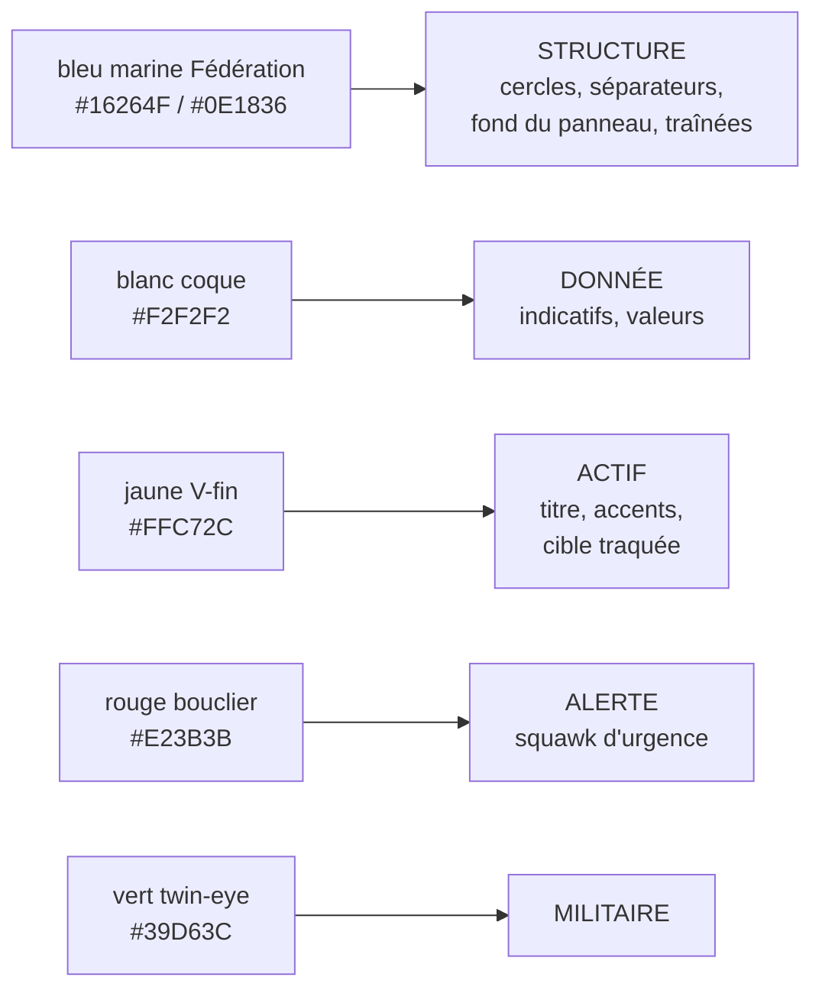

> [English](FLIGHT-RADAR.md) · **Français**

# flight-radar — radar d'avions temps réel (bin invité de référence)

Bin invité de démonstration (`firmware/flight-radar/`, env PlatformIO
`flight-radar`) : radar ADS-B temps réel autour d'un point (ou d'un
aéroport), traque de vol avec route/villes/ETA/progression, écrans de lecture
METAR / TAF / NOTAM, 4 thèmes, entièrement tactile. Il exerce TOUTE la chaîne
invité décrite dans `docs/guests/README.md` (SceGuest, arrêt distant, config
SD, WiFi partagé). La même source construit aussi une application autonome
pour M5Stack Fire, pilotée par trois boutons.

## Vue d'ensemble



- **`loop()`** : tactile et boutons, redessin (sur évènement + tick 1 s),
  **tous les accès SD** (`cfgDirty`, le fichier jeton, le cache aérodromes, la
  recherche de piste), séquencement sonore, automatismes 1 Hz, serveur HTTP de
  SceGuest.
- **`netTask`** (cœur 0, prio 1, pile 16 Ko, tick 200 ms) : recentrage
  aéroport, résolution de route sous protocole de génération, poll
  périodique/forcé, METAR/TAF, NOTAM. **Toute session TLS vit ici** — dans
  `loop()` elles affament le WebServer synchrone, et deux `WiFiClientSecure`
  concurrents épuisent le tas interne.
- Partage sous `gMtx` (mutex) plus des drapeaux volatiles 32 bits sans verrou
  (`pollNow`, `uiDirty`, `cfgDirty`, `routeReqGen`, `airportState`,
  `routeStatus`, `pollBusy`, `planesFull`, `httpStatus`, `netStop`).
- **loop() est le seul utilisateur de la SD**, et ce bin n'a pas de tâche de
  rendu : la poussée LCD et l'accès carte sont séquentiels par construction,
  donc le `renderer.pause()` d'A2.16 n'a rien à mettre en pause ici.

## La couche pure : `geo.h`

Tout ce dont l'exactitude se discute vit dans
`firmware/flight-radar/geo.h` : pas d'Arduino, pas de M5, seulement
`<math.h>` et `<string.h>`, donc compilé nativement et couvert par
`test/test_flightgeo`. Deux constantes le fondent :

```
NM_PER_DEG_LAT = 60.0      un degré de latitude = 60 milles nautiques
DEG2RAD        = 0.01745329252
```

| Fonction | Ce qu'elle calcule |
|---|---|
| `gcNm(la1,lo1,la2,lo2)` | **distance orthodromique**, haversine, en milles nautiques |
| `planarNm(la1,lo1,la2,lo2)` | **distance plane locale**, équirectangulaire |
| `bearingDeg(la1,lo1,la2,lo2)` | **cap initial**, 0-360°, 0 = Nord |
| `pickLeg(wpLat,wpLon,n,plat,plon)` | sur quel tronçon d'une route à escales se trouve l'avion |
| `legReversed(…)` | le tronçon annoncé est-il volé à l'envers |
| `cityClean(s,maxChars)` | assainit un nom de ville pour une fonte ASCII 6×8 |
| `dayNum(y,m,d)` | jours depuis le 1er janvier 1970 (renvoie vers `SunClock.h`) |
| `ddhhAbsHour(dd,hh,…)` | une lecture `DDHH` résolue en heure absolue |
| `ddhhRangeCovers(…)` / `tafGroupCovers(line,…)` | une période TAF couvre-t-elle maintenant |

**Haversine** (`gcNm`), φ en radians :

```
a = sin²(Δφ/2) + cos φ1 · cos φ2 · sin²(Δλ/2)
d = 2 · atan2(√a, √(1−a)) · 3440.065          → milles nautiques
```

3440,065 nm est le rayon moyen de la Terre. Les routes traversent des
continents entiers : l'approximation plane ne suffit pas pour elles.

**Équirectangulaire** (`planarNm`) est celle utilisée par frame, à l'échelle
du radar (≤ 500 nm), parce qu'elle coûte quatre multiplications au lieu de
quatre transcendantes :

```
dLat = (la2 − la1) · 60
dLon = (lo2 − lo1) · 60 · cos(la1)
d    = √(dLat² + dLon²)
```

**Cap initial** (`bearingDeg`), la formule d'azimut avant standard, normalisée
dans 0-360 :

```
y = sin Δλ · cos φ2
x = cos φ1 · sin φ2 − sin φ1 · cos φ2 · cos Δλ
b = atan2(y, x) en degrés, +360 si négatif
```

**`cityClean`** ne garde que l'ASCII imprimable (`0x20 ≤ c < 0x7F`) et
s'arrête à `maxChars`, en modifiant sur place : la fonte 6×8 rend l'UTF-8 en
`??`, et la colonne du panneau fait 85 px.

## Poll & fusion des avions

### Un cycle

- **≤ 250 nm** : une requête `/v2/point` sur le centre.
- **> 250 nm** (max 500) : **pavage** — le centre à 250 nm plus **6 satellites
  hexagonaux** à une distance `R − 250`, aux caps 0°, 60°, …, 300°, chacun
  demandant 250 nm, espacés de **150 ms**. Un centre de satellite vaut

  ```
  slat = lat + (d · cos b) / 60
  slon = lon + (d · sin b) / (60 · cos lat)          d = R − 250
  ```

  La passe est **écourtée et reprogrammée** si un recentrage ou une demande de
  route arrive entre-temps, ou si un reflash est imminent.
- **SafeSky n'est jamais pavé** : au-delà de son plafond de 20 km, son mode
  `viewport` couvre déjà toute la boîte en une requête.
- Période : `poll_s` secondes (5…60) multipliée par `2^pénalité`. Un poll
  **forcé** (recentrage, OK des réglages, nouvelle traque, pavage écourté) est
  honoré au plus toutes les **3 s**.
- **Recul adaptatif** : un HTTP **429** ou tout **5xx** monte la pénalité (×2
  puis ×4, plafonnée) ; un cycle réussi la remet immédiatement à ×1. Une API
  qui limite le débit demande qu'on l'interroge moins, pas plus.

### La source sélectionnée est préférée, pas exclusive

Les trois miroirs ADS-B parlent le même format v2 et couvrent le ciel
inégalement. La source configurée est interrogée **en premier, à chaque
cycle** ; elle n'est remplacée que sur un **échec au niveau transport** (pas
de HTTP 200). Un `200` portant un ciel vide est une réponse légitime, et
basculer dessus reviendrait à promener chaque heure creuse à travers les trois
serveurs.



- **Ordre de repli** : `airplanes.live` → `adsb.lol` → `adsb.fi`, en sautant la
  préférée. Celle qui répond **sert tout le cycle** — les tuiles satellites et
  la requête de traque mondiale visent toutes celle-là.
- **SafeSky n'est jamais une *cible* de repli** : elle est liée à un compte, et
  atterrir sur un service que l'utilisateur n'a pas configuré serait une
  surprise, pas un sauvetage. Elle bascule bien *depuis* elle quand elle est la
  source préférée et que le transport échoue. Les deux exceptions sont une
  **clef absente** et un **401/403** : les deux signifient que le réglage est
  faux plutôt que le service en panne, et masquer l'un ou l'autre avec un autre
  flux cacherait la mauvaise configuration indéfiniment.
- **La substitution est dite, dans les deux sens.** Un bandeau collant
  `source <nom> (repli)` reste tant que dure la substitution — c'est un *état*,
  pas un évènement qui s'efface — et le retour de la source préférée y met fin
  aussi franchement : un avertissement qui ne se lève jamais apprend à ignorer
  les avertissements.

### Analyse

Analyse ArduinoJson **filtrée** — `hex`, `flight`, `lat`, `lon`, `alt_baro`,
`gs`, `track`, `baro_rate`, `squawk`, `category`, `dbFlags`, `t` — avec le
**document en PSRAM** (`sce::psAlloc`, règle 18) : près d'un hub la réponse
dépasse le tas interne. Délai du flux HTTP/TLS **15 s** : un corps de
300-500 Ko sur un WiFi faible n'arrive pas en 8.

Un seul chemin HTTPS+JSON, `fetchJson(url, doc, timeout, filter, header,
value)`. L'en-tête optionnel est ce dont SafeSky a besoin (`x-api-key`) et ce
dans quoi voyage le porteur NOTAM.

### Fusion, vieillissement et éviction

| Règle | Valeur |
|---|---|
| Taille de la table | `MAX_PLANES` = **48** (~420 o par avion, traînée comprise) |
| Clef | l'adresse OACI 24 bits (`hex`), jamais l'indicatif |
| Traînée | **48** positions par avion, tampon circulaire, remplie localement à chaque poll |
| Purge | non vu depuis **90 s** — la table est compactée |
| Libération de traque | vol traqué muet depuis **10 min** |
| Couleur de fraîcheur | âge > **90 s** → minutes au lieu de secondes, et couleur d'alerte |

- **Nouvel avion** : un emplacement libre est pris et **remis à zéro**
  (`Plane{}`). Les purges compactent le tableau, donc un emplacement recyclé
  hériterait sinon de l'indicatif et de la traînée de l'entrée morte — et la
  traque s'accrocherait au mauvais hex.
- **Table pleine** : le **plus lointain non traqué** est la victime, et le
  nouveau ne prend sa place que s'il est **plus proche que cette pire entrée
  conservée**. Trier par âge ne discrimine rien (tous les avions fusionnés dans
  un cycle partagent le même `seenMs`), et sans la comparaison de distance les
  tuiles satellites — les plus lointaines, fusionnées en dernier — évinceraient
  le centre. La saturation n'est publiée qu'à la **fin d'un cycle réussi** et
  seulement si la table est *encore* pleine après la purge, sous la forme du
  compteur **« 48+ »**.
- **Les points de traînée sont dédoublonnés** : une nouvelle position à moins de
  `1e-4°` de la dernière en latitude *et* en longitude est écartée, pour qu'un
  avion à l'arrêt ne remplisse pas 48 cases avec le même point.
- **Le vol traqué survit à TOUTES les purges** — vieillissement 90 s, réduction
  de rayon, recentrage aéroport, éviction de table pleine. Ses lat/lon absolues
  restent projetables, et le panneau continue de dire l'âge de la donnée. La
  seule sortie est la libération à 10 minutes, sans laquelle le panneau restait
  figé pour toujours sur des données mortes.

### Cycle de vie d'un vol traqué qui atterrit

`alt_baro` passe à la chaîne `"ground"` → blip gris, `SOL`, statut
« atterri ». Quand la vitesse sol descend sous **80 kt**, les heures `~` et le
décompte `ETA` disparaissent (ils ne veulent plus rien dire) ; la barre de
progression atteint ~100 %. Quand le transpondeur s'éteint, la fraîcheur passe
en minutes et à la couleur d'alerte (« signal perdu »). Après **10 minutes sans
signal**, la traque est libérée et la sélection, la requête de traque et la
route sont effacées.

## Sources (4)

| Source | Couverture | Clef | Unités natives |
|---|---|---|---|
| `airplanes.live` *(défaut)* | ADS-B/Mode-S, la meilleure dans l'océan Indien | non | ft, kt |
| `adsb.lol` | ADS-B/Mode-S, même format v2 | non | ft, kt |
| `adsb.fi` | ADS-B/Mode-S, couverture océan Indien faible | non | ft, kt |
| `safesky` | **FLARM / advisory** en plus de l'ADS-B : planeurs, drones, parapentes qu'aucun miroir ADS-B ne voit | **oui** (essai 30 jours) | **m, m/s** |

Points d'entrée : `api.airplanes.live/v2/point/{lat}/{lon}/{nm}`,
`api.adsb.lol/v2/point/…`, `opendata.adsb.fi/api/v2/lat/{lat}/lon/{lon}/dist/{nm}`,
et `/v2/callsign/{cs}` sur les trois premières pour la recherche mondiale.

Trois choses que SafeSky impose, et comment chacune est traitée :

- **Des unités différentes, converties au point d'entrée.** Elle sert des
  mètres AMSL, des m/s de vitesse sol et des m/s de vitesse verticale ; la
  structure `Plane` est remplie en unités ADS-B et rien en aval n'apprend qu'un
  second système d'unités existe.

  ```
  altFt = altM · 3.28084          gs(kt) = gs(m/s) · 1.94384
  vrate(ft/min) = vr(m/s) · 196.85
  ```

  Sa sentinelle « altitude inconnue » à `-9999 m` (tout ce qui est ≤ −1000 m)
  s'effondre à 0, comme le chemin ADS-B traite déjà un `alt_baro` absent.
- **`rad` est plafonné à 20 000 m** (≈ 10,8 nm) alors que `radius_nm` monte à
  500. Au-delà du plafond la requête bascule en **`viewport`** — la boîte
  englobante du même cercle :

  ```
  dLat = radNm / 60
  dLon = radNm / (60 · cos lat)        cos lat planché à 0,02, dLon plafonné à 180
  ```

  Le plancher et le plafond gardent la boîte carrée près des pôles au lieu d'un
  NaN ou d'une requête couvrant plusieurs tours du globe. La boîte est plus
  large que le cercle dans les coins (sans dommage : le radar découpe de toute
  façon) et une réponse viewport est plafonnée à 300 avions par l'API, bien
  au-dessus des 48 cases gardées ici.
- **Pas de clef = pas de requête.** La puce dans les réglages **refuse** d'être
  sélectionnée et dit pourquoi ; si la source vient du yaml (ou si la clef est
  révoquée), le radar affiche `clef safesky absente (/config)` au lieu d'un
  inexplicable « 0 avion ». Aucune session TLS n'est ouverte pour récolter un
  401, ce qui accuserait le service au lieu du réglage manquant.

Deux limites acceptées : SafeSky ne publie **ni drapeau militaire ni squawk**
(donc pas d'alerte d'urgence sur cette source), et **aucun point d'entrée par
indicatif** (la traque hors portée mondiale est une fonction des miroirs
ADS-B). Son `beacon_type` est projeté sur une catégorie OACI pour que le blip
garde sa forme :

| `beacon_type` | Catégorie | Blip |
|---|---|---|
| `HELICOPTER` | `A7` | cercle + croix de rotor |
| `GLIDER` | `B1` | aile de 2 px |
| `UAV`, `PARAGLIDER`, `HANGGLIDER`, `BALLOON` | `B4` | delta creux |
| `JET` | `A3` | triangle de ligne |
| tout le reste | `A1` | petit triangle plein |

Le `beacon_type` remplit aussi le champ type de 4 caractères, dont la
troncature se lit bien : `HELICOPTER` → `HELI`, `PARAGLIDER` → `PARA`.

> ⚠ **Dette connue — authentification.** L'en-tête `x-api-key` est marqué
> DÉPRÉCIÉ par SafeSky au profit d'une signature **HMAC-SHA256** par requête
> (dérivation KID, HKDF, nonce à usage unique, horodatage à ±5 min) :
> <https://api.safesky.app/doc/authentication>. L'en-tête fonctionne encore, et
> la signature demanderait mbedTLS plus une horloge digne de confiance. Le jour
> où il sera retiré, seule cette source cessera de répondre.

## Traque & protocole de route par génération

### Le protocole

Chaque mutation de la sélection incrémente `routeReqGen`. `netTask` travaille
sur un **instantané** (indicatif, génération) et n'applique son résultat que si
la génération n'a pas bougé : un appui fait pendant qu'une requête est en vol
n'est ni perdu ni mal attribué.



`routeStatus` rapporte l'état à l'écran : 0 rien à résoudre, 1 recherche, 2
trouvée, 3 la base a répondu « inconnue », 4 le réseau est tombé.

### Routes à escales et choix du tronçon

Une route hexdb peut valoir `LFPG-FIMP-FMEE` : jusqu'à **4 waypoints** sont
extraits et chacun est résolu (cache aérodromes d'abord, réseau ensuite). Le
tronçon est choisi parmi le sous-ensemble **effectivement résolu** — un
waypoint intermédiaire non résolu ne doit pas être affiché comme extrémité.

`fr::pickLeg` garde le tronçon dont les extrémités **encadrent** le mieux la
position. Pour chaque tronçon *i* :

```
coût(i) = gcNm(wp[i], avion) + gcNm(avion, wp[i+1]) − gcNm(wp[i], wp[i+1])
```

Cet excédent est ≥ 0 et **nul quand l'avion est exactement dessus** ; le plus
petit gagne. Avec moins de trois waypoints il n'y a rien à choisir et le
tronçon 0 est renvoyé. Prendre toujours le premier donne une origine fausse,
une progression fausse et une ETA fausse à un avion déjà sur le deuxième, sans
rien à l'écran qui le laisse deviner.

Quand plus de deux waypoints ont été publiés, l'étiquette de route affichée est
réécrite comme le **tronçon choisi** (`orig-dest`) et non la chaîne entière.

### Tronçons inversés

Les bases communautaires donnent le sens **canonique** d'un numéro de vol, et
plusieurs compagnies réutilisent le même indicatif au retour. `SS636` est
annoncé `MRS-RUN` alors qu'il vole Réunion → Marseille : sans correction
l'origine, la destination, la progression **et** l'ETA sont toutes fausses, et
le décompte *grandit* à mesure que le vol avance.

`fr::legReversed` applique **deux tests indépendants, l'un ou l'autre
condamnant** :

| Test | Condition |
|---|---|
| **Route sol** | une route publiée, `gs > 150 kt`, et l'écart angulaire entre la route sol et le cap vers la destination annoncée **> 120°** |
| **Descente sur l'origine annoncée** | `alt < 10 000 ft`, `dOrig < 40 nm`, `dDest > 150 nm`, `vrate < −256 ft/min` |
| **Montée depuis la destination annoncée** | `alt < 10 000 ft`, `dDest < 40 nm`, `dOrig > 150 nm`, `vrate > +256 ft/min` |

L'écart angulaire est replié dans 0-180° avant la comparaison. Le **plancher de
150 kt ne doit pas être abaissé** : en dessous, l'avion peut être en virage
(circuit de départ, approche en circling) et une route transitoire
échangerait une route *correcte*. Ce plancher est aussi pourquoi le test de
route est aveugle précisément en approche finale, volée à 120-140 kt — d'où les
deuxième et troisième tests, qui n'ont besoin d'aucune route. Le **cas au sol
est délibérément exclu** : garé à l'origine annoncée est ambigu (vient
d'arriver sur le tronçon inversé, ou sur le point de partir sur le bon), une
descente ne l'est pas.

Cela reste une **heuristique** : un vol qui dévie fortement (déroutement,
évitement météo) peut la déclencher à tort. Quand elle se déclenche, origine et
destination sont échangées — coordonnées, villes, codes IATA, pays et
étiquette imprimée.

### Le cache de route

**4 entrées, anneau, TTL 2 h.** La réacquisition automatique après une purge et
le défilement ↑/↓ du panneau reviendraient sinon résoudre le même vol en
boucle, à 3-4 sessions TLS par retour.

- **L'expiration est essentielle** : la destination mémorisée est le tronçon
  COURANT, et le même indicatif repart sur un autre tronçon quelques heures
  plus tard.
- Une entrée expirée est **libérée** au passage, sinon l'anneau de 4 se dégrade
  en 2.
- Une entrée **à escales** enregistre aussi la position pour laquelle elle a
  été résolue, et est abandonnée dès que l'avion en est à plus de **50 nm** :
  la rejouer telle quelle annulerait la correction de tronçon dès que l'avion
  passe au suivant.
- Les pays sont copiés **avant** le test d'inversion, jamais après, pour qu'un
  hit de cache inversé ne puisse pas basculer le pays d'une sélection sur une
  autre.
- Seule une route **complète et définitive** est mise en cache. « Définitive »
  signifie soit une route complète en main, soit toute source *interrogée* a
  *répondu* (200, ou un 4xx voulant dire « pas de donnée »). Un échec réseau
  reste transitoire et est réessayé.

### Le cache d'aérodromes sur la carte

Résoudre une route, c'est une requête pour la route plus **une par waypoint** —
jusqu'à six sessions TLS pour un seul appui.
`/stackchan-companion/radar-airports.csv` retient ce qui ne change pas.

| Champ | Source |
|---|---|
| position (lat, lon) | hexdb `/api/v1/airport/{iata\|icao}/{code}` |
| ville / région, code IATA, pays | idem |
| fréquences ATIS et tour, altitude du terrain | aviationweather `/api/data/airport?ids=…` |

- **48 entrées, anneau**, indexées par code et comparées **sans tenir compte de
  la casse** — deux entrées pour un aérodrome seraient un cache qui se dilue
  lui-même.
- **Aucune expiration.** Un aérodrome ne se déplace pas. Une entrée ne part que
  lorsque l'anneau boucle.
- **Une entrée par aérodrome, pas un cache par question.** `hasPos` et `hasStn`
  disent quelles moitiés sont remplies, et chacune seule vaut une ligne à
  l'écran. Les deux moitiés arrivent de deux points d'entrée, à des minutes
  d'écart, et remplir l'une n'efface jamais l'autre.
- **Trois états, pas deux.** `hasPos` peut répondre oui, `neg` peut répondre
  non, et tout le reste retombe et demande. Un verdict doit être *énoncé* :
  déduire « inconnu » de l'absence de position ferait répondre à la moitié
  station du cache « pas d'aérodrome de ce nom » à propos du terrain même sur
  lequel le radar est centré.
- **Les réponses négatives sont retenues aussi, mais en RAM seulement**, et
  seulement pour les codes sur lesquels la base a effectivement RÉPONDU. Une
  base injoignable ne dit rien du code — `lookupAirportNet` rapporte `reached`
  séparément — et un 404 aujourd'hui peut être une fiche demain, donc ce
  verdict ne doit pas survivre à un redémarrage. Les négatifs ne sont jamais
  écrits sur la carte.
- **Les valeurs d'abord, le drapeau en dernier.** `la`/`lo` sont écrits avant
  que `hasPos` ne soit levé, parce que `loop()` peut être en train de
  sérialiser le tableau pendant que `netTask` le remplit ; la sauvegarde prend
  aussi une **copie** de chaque entrée plutôt qu'une référence.
- **Écrit par `loop()`, limité à une fois par minute**, et le fichier entier est
  réécrit plutôt qu'ajouté (l'anneau écrase sur place). Le drapeau est effacé
  **avant** l'écriture, pour qu'une entrée rangée pendant l'écriture ne soit pas
  marquée propre sans jamais atteindre le fichier.
- Sur une carte insérée **à chaud**, la RAM gagne : ce qui est détenu a été payé
  en sessions TLS cette exécution, donc la carte le reçoit plutôt que de
  l'écraser.
- Le fichier est positionnel et de forme extensible : une carte écrite avant que
  la moitié station n'existe s'arrête après six champs, et le lecteur rend des
  chaînes vides plutôt que de sortir de la ligne.

### Traque mondiale

Un indicatif **complet** (≥ 4 caractères), tapé au clavier ou posté sur
`/config`, alors que l'avion est hors portée : la route est pré-résolue
immédiatement et une requête `/v2/callsign` est lancée (monde entier) à chaque
cycle jusqu'à l'acquisition, avec un **répit de 3 cycles** après une tentative
infructueuse. Un fragment ne peut pas correspondre à ce point d'entrée à
égalité stricte, donc la requête n'est simplement pas lancée. La dette de recul
est attachée à **la requête**, pour qu'une nouvelle traque n'hérite pas du répit
de la précédente. Le résultat fusionne dans `planes[]` avec position, altitude
et vitesse réelles ; le blip est dessiné en double cercle plaqué au bord du
radar.

### ETA et heure de départ

Les deux sont **estimées** — pas d'horaires publiés sans API à clef — et
calculées à partir de distances orthodromiques prises une fois par frame :

```
dDone = gcNm(origine, avion)            dRem = gcNm(avion, destination)
progression = dDone / (dDone + dRem)
heuresRestantes = dRem / gs             arrivée = maintenant + heuresRestantes
départ = maintenant − (dDone / gs) heures
```

Elles ne sont affichées que si l'horloge est synchronisée **et** `gs > 80 kt`,
préfixées de `~`, à l'heure locale donnée par `tz_offset_h`. En dessous de
80 kt le panneau dit `ETA : vitesse basse` au lieu de diviser par une vitesse
qui ne veut rien dire.

## L'écran radar

```
┌──────────────────────────────┬───────────┐
│ MRU              maj 12s     │  PANNEAU  │
│                    12:34     │  DE DROITE│
│      ╭─── radar ───╮         │  (résumé  │
│      │ blips par   │         │   OU      │
│      │ catégorie   │         │   vol     │
│      ╰─────────────╯         │  traqué)  │
│   [état de route / alerte]   │           │
│   [indice ou bandeau]        │           │
└──────────────────────────────┴───────────┘
```

### Géométrie et projection

| Constante | Valeur |
|---|---|
| Centre du radar | `CX` = **114**, `CY` = **120** |
| Rayon du radar à l'écran | `RPX` = **100 px** |
| Bord gauche du panneau | `PANEL_X` = **228** |

Une position devient un point écran par une **projection équirectangulaire
locale autour du centre du radar**, mise à l'échelle pour que `radius_nm`
tombe sur `RPX` :

```
dLatNm = (lat − lat0) · 60
dLonNm = (lon − lon0) · 60 · cos(lat0)
x = CX + dLonNm / radiusNm · RPX
y = CY − dLatNm / radiusNm · RPX        (l'y écran croît vers le bas)
```

Le Nord est donc en haut, l'échelle est la même sur les deux axes à la
latitude du centre, et la même fonction projette le blip, sa traînée et le test
de contact tactile — donc rien d'invisible n'est jamais sélectionnable.

**Découpe** : un blip n'est dessiné que pour `6 ≤ x ≤ PANEL_X − 8` et
`10 ≤ y ≤ 232`. Hors de cette boîte il est sauté — sauf s'il s'agit du vol
traqué, qui reçoit à la place le marqueur hors cadran.

### Cercles, croix et étiquettes

Il n'y a **aucun balayage tournant** : c'est une vue en plan, pas une
animation. L'échelle est dessinée une fois par frame.

- Trois cercles centrés sur (CX, CY) : **`RPX`** en `ring1`, **2/3 RPX** et
  **1/3 RPX** en `ring2`.
- Une **croix centrale de 9 px**, tracée comme deux lignes depuis un point
  d'appel unique dans une boucle (A2.22).
- `N` au-dessus du cercle extérieur (`CY − RPX − 12`), le **rayon complet**
  étiqueté à l'intérieur du cercle extérieur et le **tiers de rayon** à côté du
  cercle intérieur, tous deux dans l'unité d'affichage (`nm` ou `km`).

### Blips

Le blip est **tourné sur la route sol de l'avion**. Avec `a = track · π/180`,
un point de forme (dx, dy) — dy vers l'avant — atterrit en :

```
sx = x + dx·cos a + dy·sin a
sy = y + dx·sin a − dy·cos a
```

| Catégorie | Forme | Géométrie |
|---|---|---|
| `A7` hélicoptère | cercle + croix de rotor | cercle r = 4, deux bras ±6 px |
| `B1` planeur | aile de 2 px + fuselage | quatre lignes, envergure ±9 |
| `B4` ULM, drone, ballon | delta **creux** | nez (0, 5), queue (±4, −4) |
| `A1` léger | petit triangle plein | nez 4, demi-largeur 3 |
| tout le reste | triangle de ligne | nez 6, demi-largeur 4 |

- **Couleur = tranche d'altitude** (`altColor`) : au sol → `altG`,
  `< 10 000 ft` → `altLow`, `< 25 000 ft` → `altMid`, au-dessus →
  `altCruise`.
- **Militaire** (`dbFlags` bit 0) : un **carré de 17 × 17 px** en `milCol`
  autour du blip, et le **type** de l'appareil imprimé sous l'indicatif.
- **Traqué** : un cercle de rayon 9 en `selCol`, et le blip lui-même dessiné en
  `selCol` plutôt que dans sa couleur d'altitude.
- **Traqué et hors cadran** : la position est projetée quand même, puis le
  vecteur depuis le centre est normalisé à `RPX`, et **deux cercles
  concentriques** (r = 5 et r = 2) sont tracés en ce point du bord. Pas de
  traînée, pas de triangle : ce n'est pas à l'échelle.
- **Le trafic au sol** est masqué sauf si `show_ground` est actif — ou s'il
  s'agit du vol traqué, qui s'affiche toujours.
- **L'indicatif** est écrit en `x + 8`, et **bascule à gauche du blip**
  (`x − 8 − largeur`) quand son dernier glyphe dépasserait `PANEL_X − 2` :
  aucune étiquette n'est jamais recouverte par le panneau.

### Le vecteur vitesse

Le segment devant le blip est la position que l'avion atteindrait à son cap et
sa vitesse actuels après un **horizon en minutes**, dessiné pour tout ce qui
vole au-dessus de **40 kt** :

```
aheadNm = gs · horizonMin / 60
longueur px = aheadNm / radiusNm · RPX        bornée à 5 … 60 px
```

Un vecteur est une *durée*, donc sa longueur à l'écran dépend du zoom.
L'horizon est donc **adaptatif et partagé par tous les blips** — des horizons
différents rendraient les longueurs incomparables. C'est le plus petit de 1, 2,
4 minutes qui donne au moins **10 px à 450 kt**, sinon 8 :

| Rayon | Horizon | Longueur à 450 kt |
|---|---|---|
| 25 nm | 1 min | 30 px |
| 50 nm | 1 min | 15 px |
| 100 nm | 2 min | 15 px |
| 250 nm | 4 min | 12 px |
| 500 nm | 8 min | 12 px |

Le plancher de 5 px existe parce que l'horizon est calibré sur 450 kt : un
hélicoptère à 90 kt retomberait sinon sous le seuil de tracé et perdrait sa
direction entièrement. L'horizon courant est nommé dans la légende
(`vecteur N min`) précisément parce qu'il varie.

### La traînée

Seul le vol **traqué** en porte une. C'est l'historique local — les API
communautaires ne servent aucun historique, la traînée se remplit pendant que
le radar regarde — rejoué en polyligne à travers `planeToXY`, donc elle se
reprojette correctement après un zoom ou un recentrage. Jusqu'à 48 points, dans
la couleur `trail` du thème.

### Le panneau de vol — la disposition 6-vers-12

Le panneau de droite (x 228…320) montre le vol traqué. Sa propre ligne de
séparation **EST** la route : **arrivée en haut, départ en bas** — on vole de
6 h vers 12 h — avec le segment parcouru **plein** du point de départ jusqu'au
triangle de l'avion et le reste **pointillé** jusqu'au point d'arrivée.

| Bande | Contenu |
|---|---|
| y 4…54 | **état** : indicatif (taille 2), niveau + vitesse, distance et fraîcheur, puis compagnie / catégorie / type / vitesse verticale — ou `SQUAWK 7500/7600/7700` en couleur d'alerte |
| y 57 | filet |
| y 62…120 | **ARRIVÉE** : IATA (ou OACI) en taille 2, pays plaqué à droite, ville, `~hh:mm` |
| y 128…168 | **zone de trajet**, encadrée par deux séparateurs pointillés |
| y 173…232 | **DÉPART** : les mêmes trois lignes, `~hh:mm` du départ estimé |

Le rail va de `RAIL_T = 64` (arrivée) à `RAIL_B = 234` (départ) sur la colonne
du séparateur elle-même, et le marqueur d'avion se place en

```
yPlane = RAIL_B − (RAIL_B − RAIL_T) · progression
```

dessiné comme un segment d'accent de 2 px de large en dessous et un triangle
pointant vers le haut à sa hauteur. Sans route complète le rail est **tout
pointillé et ne porte pas d'avion** : on n'invente pas un trajet.

La **zone de trajet** porte trois lignes :

- **haut** : le `%` de progression à gauche, la **distance restante** à droite
  — les deux courts, aucune collision possible ;
- **milieu** : la **phase** en code *plus* son libellé lisible ;
- **bas** : le **temps** restant seul, en `ETA 0h28`. Strictement, cette durée
  est l'ETE et l'heure d'horloge du bloc arrivée est l'ETA, mais l'ETA
  familière-comme-décompte est ce que tout le monde lit.

La distance parcourue n'est pas affichée : le `%` et le segment plein du rail
la disent déjà.

**Niveau et vitesse** partagent une ligne de 13 glyphes. En unités aéro une
altitude ≥ **18 000 ft** est imprimée en niveau de vol (`FL330`) ; en métrique
ce sont des mètres, et quand la paire ne tient pas l'altitude laisse tomber son
suffixe d'unité plutôt que de chevaucher la vitesse. La **vitesse verticale**
est imprimée `^` ou `v` au-delà de ±300 ft/min, en ft/min en aéro et en m/s en
métrique (`ft/min × 0,00508`).

**Les noms de ville** sont coupés à **13 glyphes** — la colonne de texte du
panneau fait 78 px d'une fonte de 6 px — et la coupe est **marquée** par un `.`
en treizième caractère. Une troncature qu'on voit vaut mieux que cinq
caractères qui disparaissent.

### Phase de vol

Un code aéronautique de 3 lettres, sans langue, sur la ligne du milieu de la
zone de trajet, avec un libellé lisible à côté sur une ligne de base partagée :

| Code | Libellé | Condition |
|---|---|---|
| `GND` | au sol | `onGround` |
| `CLB` | montée | `vrate > +300 ft/min` |
| `DES` | descente | `vrate < −300 ft/min` |
| `CRZ` | croisière | sinon, et `gs > 150 kt` |

Rien n'est dessiné en dessous de 150 kt en vol horizontal — il n'y a pas de nom
honnête pour cela. La phase est **indépendante de la route** : un avion sans
route connue monte ou descend quand même. Les seuils sont ceux avec lesquels
`fr::legReversed` raisonne.

### Le coin horaire et le résumé

**Le coin en haut à droite est le coin du TEMPS** : l'âge de la donnée
(`maj 12s`, `maj --` avant le premier poll réussi) et, en dessous, l'HORLOGE
LOCALE. Les deux sont une seule question posée deux fois, et le placement est
celui de l'en-tête du bin spatial pour que les deux bins invités se lisent
pareil. L'horloge reste **vide tant que l'horloge n'est pas synchronisée**
plutôt que d'afficher le 01:00 d'un RTC non réglé — la règle que suivent déjà
les heures `~`. Le code aéroport occupe le coin en haut à gauche.

**Résumé** (rien de traqué) : le compteur d'avions en géant (`--` jusqu'au
premier poll réussi, puis `N` ou `48+`), le rayon, la source — remplacée par
`traqué <INDICATIF>` quand une traque est armée — puis la **légende complète** :
quatre couleurs d'altitude, puis huit symboles (ligne, léger, ultra-léger,
planeur, hélicoptère, militaire, traqué, hors cadran) et l'horizon de vecteur
courant.

**Sous le radar**, centré, en couleur d'alerte : l'état du vol traqué
(`route : recherche…`, `route inconnue`, `route : réseau KO`, `pas de
callsign`, `signal perdu`, `atterri`, `heure : sync NTP…`, `ETA : vitesse
basse`, `aéroport inconnu`) ou, sans rien de traqué, celui du radar (`WiFi
déconnecté…`, `clef safesky absente (/config)`, `API en échec (HTTP n)`,
`recherche des avions…`, `connexion à l'API…`). L'API n'est mise en cause que
si le **dernier cycle a entièrement échoué** — une tuile manquée sur sept, ou
une recherche mondiale vide, ne la condamnent pas.

**La ligne du bas** porte l'indice (`toucher un avion pour traquer`, ou
`pas de microSD : reglages non enregistres` tant qu'il n'y a pas de carte) et
est reprise par le **bandeau** quand il y en a un.

Les accents sont rendus par **`fonts::efontJA_12`** (Unicode) — une SEULE fonte
accentuée : une seconde coûte ~315 Ko de flash sur un binaire de 1,77 Mo. La
6×8 `Font0` (ASCII) reste la fonte des données (métriques fixes, 6 px/car). Les
phrases sous le radar sont calibrées pour 36 caractères (largeur utile 228 px à
6 px par caractère).

## La pile de vues

Les quatre écrans forment un **anneau parcouru par le seul swipe HAUT** (ou par
`B` sur une carte à boutons). **L'ordre EST le sens** : le radar est ce qui se
passe, le METAR ce qui est mesuré, le TAF ce qui est prévu, le NOTAM ce qui est
hors service — chaque pas un cran plus loin de la vérité terrain.



L'état est un **niveau** (`viewLevel`, 0…3), pas un booléen par vue : tout le
reste — ce qui est dessiné, quels gestes s'appliquent, si le METAR est
rafraîchi — en dérive, donc l'état dérivé ne peut pas diverger.
`setViewLevel()` est le seul endroit où il change.

**Un geste, un métier.** Le swipe bas n'est **à nous à aucun étage** : il veut
toujours dire « retour au companion » et appartient à `SceGuest`. Rien de ce
que fait ce bin ne peut casser la sortie. `armSwipeExit()` survit comme point
d'appel unique dont les **modales** (clavier, réglages) se servent pour rendre
le geste après l'avoir retenu ; il n'est compilé que sur une carte tactile,
puisque rien ne suspend le geste là où il n'y a pas de tactile.

Au-dessus du radar, **un appui quelconque** ramène directement au radar : la
sortie courte d'un écran de lecture sans faire le tour de l'anneau.

**Un appui long (700 ms, doigt immobile) force un rafraîchissement** du METAR,
du TAF et du NOTAM. Tous les autres gestes sont pris — un appui repart au
radar, le haut est la vue suivante, le bas appartient à `SceGuest`,
gauche/droite paginent le paquet NOTAM — et un *double* appui ne marcherait pas
non plus, puisque le premier appui est déjà parti. Un maintien est aussi la
bonne forme : forcer une requête est un acte délibéré, pas quelque chose qu'une
manche déclenche. Il part **sur le maintien**, pas au relâchement, pour que
l'écran réponde pendant que le doigt est encore posé, et il efface
l'espacement d'échec de 60 s ainsi que les tampons de « dernier succès » — sinon
la relance qu'on vient de demander serait avalée par la garde même qui évite de
marteler un service en panne.

Les swipes verticaux **partant du panneau de droite** gardent leur métier
propre (défiler parmi les vols traqués) : le panneau n'existe que sur le radar,
donc les deux ne peuvent pas se télescoper.

### Le vocabulaire d'entrée (`input.h`)

Chaque geste est nommé d'après **ce que l'utilisateur a demandé**, jamais
d'après le geste qui l'a demandé. `firmware/flight-radar/input.h` est pur — pas
d'Arduino, pas de M5, temps injecté — et testé nativement par
`test/test_input`. Le tactile, les boutons et la minuterie du mode dock sont
trois **producteurs** de `fr::UiEvent` ; `applyEvent()` dans `main.cpp` est
l'unique **consommateur**. Ce que porte ce fichier, c'est le **vocabulaire** :
l'ensemble d'évènements, le `fr::Screen` à trois valeurs, et la correspondance
d'un bouton vers un évènement. La **mécanique** des boutons est le
`firmware/common/ButtonFsm.h` partagé (voir *Boutons* plus bas) — une
implémentation, deux bins.

| `UiEvent` | Sens |
|---|---|
| `NextView` | un pas sur l'anneau des vues |
| `Back` | retour direct au radar |
| `PagePrev` / `PageNext` | carte précédente / suivante du paquet NOTAM |
| `Refresh` | forcer une requête METAR/TAF/NOTAM maintenant, sans l'espacement |
| `NetInfo` | afficher l'IP et pointer vers `http://<ip>/config` |
| `ZoomCycle` | 50 / 100 / 250 / 500 nm, dans cet ordre |
| `TrackPrev` / `TrackNext` | avion précédent / suivant de la liste |

L'ensemble d'évènements est délibérément **plus petit** que celui des gestes
tactiles : `SelectAt` (appuyer sur un blip) et l'aperçu de pincement n'ont pas
d'équivalent bouton et restent tactiles.

`applyEvent` garde sa propre garde sur la pagination (`viewLevel ==
VIEW_NOTAM && notamCount > 0`) même si les deux producteurs la décident déjà :
c'est le seul endroit qui voit tous les producteurs, présents et futurs.

### Mode dock

Posé sur un bureau, les vues défilent toutes seules : radar → METAR → TAF →
NOTAM, **`dock_s` secondes par vue** (`/config`, 0-120, **0 = off, le défaut**
— un instrument ne doit pas bouger sous les yeux d'un lecteur sans qu'on le lui
demande). Toute action manuelle relance l'horloge de la vue courante :
`applyEvent()` l'estampille pour tous les producteurs, un appui sur un blip et
tout niveau de bouton l'estampillent chez leurs gestionnaires, et l'écran de
debug se ré-estampille tant qu'il est tenu. Les modales tactiles suspendent le
cycle par construction, puisqu'elles bloquent `loop()`. L'avance automatique
elle-même passe par `applyEvent(NextView)` comme n'importe quel producteur —
un seul consommateur, et le dock n'est que le troisième vocabulaire d'entrée
après le tactile et les boutons.

## Gestes (tactile)



Les seuils, tous dans `handleTouch()` :

| Geste | Règle |
|---|---|
| swipe (écrans de lecture et radar) | ≥ **60 px** sur l'axe dominant |
| swipe sur le panneau de droite | ≥ **40 px** verticalement |
| appui sur un blip | blip le plus proche à moins de **24 px** ; l'**indicatif** dessiné compte aussi comme cible (rectangle de texte + 4 px) |
| double appui = paliers de zoom | deux appuis en moins de **400 ms**, et **seulement si rien n'est traqué** |
| pincement | deux points, `rayon = rayon0 · d0 / d`, arrondi à 5 nm — **aperçu seulement**, persisté et purgé au retrait des doigts |
| maintien | **700 ms** avec moins de **12 px** de déplacement ; l'invite s'arme à **250 ms** |
| appuis de bord NOTAM | `x < 110` page précédente, `x > 209` page suivante, le **tiers central** repart au radar |

Un appui sur le panneau de droite ne sélectionne ni ne désélectionne : c'est
une zone de lecture. Un appui sur le radar vide met fin à la traque, efface la
requête et la route, et incrémente la génération pour qu'une résolution en vol
soit jetée.

## Seconde carte : M5Stack Fire, en autonome

> **Éteindre le Fire** : son circuit d'alimentation IP5306 n'a PAS d'extinction
> logicielle — rien de comparable au `/api/poweroff` du CoreS3, dont l'AXP2101
> peut se couper lui-même. **Débrancher l'USB d'abord** (sur alimentation USB
> l'IP5306 redémarre la carte immédiatement, ce qui se lit comme « elle ne veut
> pas s'éteindre »), puis **double-cliquer le bouton latéral rouge** en moins
> d'une seconde. Clic simple = allumage, double rapide = extinction.

La même source construit une **application autonome pour M5Stack Fire**, sans
firmware companion et sans matériel K151 :

```powershell
pio run -e flight-radar-fire
```

Ce n'est **pas un fork**. Les différences sont déclarées en *drapeaux de
capacité* dans un unique bloc `BOARD PROFILE` en tête de `main.cpp`, et posées
par environnement dans `platformio.ini` — `SCE_INPUT_TOUCH`,
`SCE_INPUT_BUTTONS`, `SCE_HAS_SERVO`, `SCE_HAS_LTR553`, `SCE_COMPANION`,
`SCE_SD_*`. Les défauts décrivent le CoreS3/K151. Les drapeaux sont nommés
d'après ce que la carte **possède**, jamais d'après un nom de carte : un
drapeau nommé `FIRE` ne survivrait pas à la carte suivante.

Les deux drapeaux d'entrée sont **orthogonaux, pas exclusifs** : `loop()`
appelle `handleTouch()` et `handleButtons()` sous leur propre `#if`, donc une
carte qui a les deux pilote les deux.

Ce qui rend l'opération peu coûteuse : le Fire est aussi en **320×240**, il a
**4 Mo de PSRAM utilisable** (la carte en porte 8, un ESP32 en projette 4) pour
un canvas de 150 Ko, et le radar **ne lit jamais l'IMU**.

### Boutons

Trois boutons momentanés, A B C, de gauche à droite, lus par `fr::ButtonFsm`
(pur, testé nativement). Le mappage dépend de l'**écran**, pas de « radar ou
pas » :

| | Radar | Paquet (NOTAM avec cartes) | Lecture (METAR, TAF, NOTAM vide) |
|---|---|---|---|
| **A** court | avion précédent | page précédente | retour au radar |
| **B** court | vue suivante | vue suivante | vue suivante |
| **C** court | avion suivant | page suivante | retour au radar |
| **A** long | afficher `http://<ip>/config` | idem | idem |
| **B** long | forcer un rafraîchissement | idem | idem |
| **C** long | faire défiler le rayon | — | — |
| **A+C** tenus | écran de debug | écran de debug | écran de debug |

`fr::Screen` a exactement ces trois valeurs, et `Deck` signifie « un paquet
avec des cartes **dedans** » : un écran NOTAM vide est `Reading`, donc la
pagination n'est jamais proposée sur du néant. **A et C valent « retour » là où
il n'y a rien à paginer**, ce qui est la règle du tactile transposée : un geste
qui ne fait rien ne doit jamais coincer. **B atteint le radar depuis partout**,
puisqu'il fait le *tour* de l'anneau.

**La banque elle-même n'est pas dans ce bin.** `input.h` garde le *vocabulaire*
du radar — quel `UiEvent` veut dire un bouton, sur quel écran — et la
*mécanique* vit dans **`firmware/common/ButtonFsm.h`**, partagée telle quelle
avec le bin space et ré-exportée ici en `fr::ButtonFsm` pour que chaque
appelant garde son nom. C'est la forme de la règle 17 appliquée aux boutons :
cette banque est née dans ce fichier, space a ensuite fait pousser son propre
automate mono-bouton à côté, et deux implémentations de « quand est-ce qu'un
appui parle » sont exactement la dérive des jumeaux assumés qu'A2.23 existe
pour interdire. `firmware/common/` est un répertoire que les deux bins incluent
déjà, donc le partage ne coûte aucune dépendance d'un bin vers l'autre, et
l'implémentation unique est testée deux fois — `test_input` la mène par le
vocabulaire du radar, `test_spaceinput` par celui de space.

`ButtonFsm` porte sept décisions à énoncer :

- `LONG_MS` = **700 ms**, le même seuil que le maintien tactile ;
  `DEBOUNCE_MS` = **25 ms**. Un changement doit tenir la fenêtre d'anti-rebond
  avant d'être cru.
- L'**appui long part sur le maintien**, pas au relâchement, pour que l'écran
  réponde pendant que le doigt est encore posé — et une fois parti, le
  relâchement qui suit ne doit **pas** compter aussi comme un appui court.
- **Au plus un évènement par appel**, et un évènement bloqué est **différé,
  jamais perdu** : une transition n'est crue que si elle peut aussi être
  rapportée, donc un relâchement qui percute l'évènement d'un autre bouton est
  reconsidéré à l'appel suivant.
- Le **premier échantillon adopte le niveau et n'annonce rien** : un bouton
  déjà tenu à la mise sous tension déclencherait sinon son action longue ~700 ms
  après le boot.
- L'appui long exige en plus que le niveau **brut** soit encore haut, pour
  qu'un relâchement échantillonné juste avant le seuil (anti-rebond en cours)
  ne ressorte pas en action longue que l'utilisateur relâchait justement pour
  l'éviter.
- `chord(a, b)` est une **interrogation**, pas un évènement — un accord veut
  dire « tant que c'est tenu » — et il **marque les deux boutons comme ayant
  parlé**, pour que le relâchement après un accord ne fasse pas aussi défiler
  la liste des avions.
- Il n'y a **pas de `reset()`** : effacer `primed` est la bonne façon d'avaler
  un appui en cours, et ce chemin existe déjà.

### Les deux modales tactiles sont remplacées, pas portées

Le clavier 8×5 et le panneau de réglages à curseurs sont **tactiles seulement**
et ne sont pas compilés sur une carte à boutons. `http://<ip>/config` fait les
deux métiers mieux — **20 réglages sur cette carte**, sur un vrai clavier
(**22 sur un CoreS3** : `servo` et `auto_bright` sont retirés à la compilation
là où le matériel est absent, parce qu'une bascule que la carte ne peut pas
honorer est pire qu'une bascule absente). `A` long met cette adresse à l'écran
pendant 8 s.

`/config` porte un champ **`track`**, le jumeau web du clavier. Il partage le
*même* chemin de validation (`applyTrackQueryLocked`) plutôt qu'une seconde
implémentation recopiée à la main.

**Vide = inchangé, `-` = arrêt, et le champ n'est jamais renvoyé en écho.**
C'est ce qui le rend sûr : un navigateur poste la valeur que la page tenait au
moment où elle a été *rendue*, et `trackQuery` est le champ le plus volatil de
ce formulaire — le firmware le réécrit depuis quatre endroits (un appui sur un
blip, le défilement A/C, un appui dans le vide, et `netTask` qui libère une
traque muette depuis dix minutes). Une valeur renvoyée en écho reposterait une
valeur périmée et détruirait la traque en cours. Un champ jamais renvoyé ne
porte aucune opinion tant qu'on n'y tape rien.

### Les défauts nomment le lieu qu'ils décrivent

`metar_icao` vaut **FMEE** par défaut et `airport` vaut **RUN** — les codes
OACI et IATA d'un même aérodrome, dont les coordonnées sont les `lat`/`lon`
intégrées et dont le fuseau est le `tz_offset_h` intégré de +4. `airport` fait
trois lettres, donc `metarStation()` (qui en veut quatre) retombe sur
`metar_icao` ; un `airport` de quatre lettres gagne. Sur une carte sans SD ces
constantes sont toute la configuration, donc elles doivent décrire un lieu
cohérent.

La **piste** reste vide exprès, et ce n'est pas le même arbitrage : elle est
lue dans la base SD ou tapée. Hériter de la piste d'un aérodrome après un
changement de station dessinerait un cap inventé sur la rose.

### Les échecs sont journalisés, et l'horloge est rapportée

Un METAR en échec imprime `metar FMEE ECHEC http=-11`, pour qu'une requête qui
a échoué et une requête jamais tentée ne se ressemblent pas.

Le battement de 10 s porte `clock:` (`17:46Z` ou `NON-SYNC`) parce qu'une carte
sans RTC ne peut pas être interrogée autrement. Le CoreS3 en a un et
`M5.begin()` le charge dans l'horloge système, donc l'heure est plausible dès
la première frame ; le **Fire n'en a pas**, et tant que SNTP n'a pas répondu
toute fonction dépendant de l'heure ne fait silencieusement rien — la barre
« en vigueur » du TAF, le thème Nuit automatique, les ETA locales. La vue TAF
le dit plutôt que d'omettre simplement la barre.

### A+C — l'écran de debug

Tenu, pas basculé : **appuyer A et C ensemble** et l'écran montre le réseau, les
sources et les ressources ; **relâcher** et le radar revient. C'est un
diagnostic, pas une destination — il ne peut pas apparaître sur l'anneau des
vues par accident, et on ne peut pas y rester coincé. Il se redessine toutes
les **250 ms** tant qu'il est tenu, et non à chaque passe de 10 ms : le seul
écran qu'on ouvre pour diagnostiquer une lenteur ne doit pas lui-même monopoliser
le bus SPI.

Quinze lignes : mode WiFi / RSSI / IP / **l'URL `/config`, écrite en toutes
lettres** / SSID / horloge UTC — puis par source l'API ADS-B avec son dernier
code HTTP et le nombre d'avions, la station METAR, le compte NOTAM, le centre
et le rayon — puis l'uptime, le tas et son plancher, la PSRAM, les deux
niveaux de pile et l'état SD. C'est ce que la version tactile lit dans l'onglet
RESEAU du panneau de réglages, sur une carte qui n'a pas de panneau de réglages.

A2.22 s'applique avec force ici : quinze lignes par **un seul** point d'appel
`drawString` dans une boucle sur une table, `noinline` pour que `check-a222.py`
puisse le compter. Un écran de diagnostic auquel manque une ligne qu'il ne
mentionne nulle part est pire que pas de diagnostic.

### Flasher le Fire

**Depuis les sources** — la voie normale, et la seule qui récupère le repli
WiFi depuis l'environnement :

```powershell
$env:SCE_WIFI_SSID="..." ; $env:SCE_WIFI_PASS="..."   # optionnel, cartes sans SD
pio run -e flight-radar-fire -t upload --upload-port (.\scripts\dev\find-port.ps1 -Board fire)
```

⚠ **Ne jamais omettre `--upload-port`** tant que le StackChan est branché : un
`-t upload` nu choisit un port tout seul et écraserait son companion.

**Depuis un `.bin` prêt, sans PlatformIO.** `esptool` suffit — utile pour
remettre un binaire à quelqu'un, ou reflasher sans la chaîne d'outils. Noter
les offsets ESP32 : le bootloader est ici en **0x1000**, pas en 0x0 comme sur
l'ESP32-S3 du CoreS3.

```powershell
# MISE A JOUR d'une carte qui fait déjà tourner ce firmware : l'application seule.
esptool.py --chip esp32 --port COM7 --baud 921600 write_flash 0x10000 firmware.bin
```

```powershell
# Carte VIERGE ou étrangère : les quatre images, une fois.
esptool.py --chip esp32 --port COM7 --baud 921600 write_flash `
  0x1000  bootloader.bin `
  0x8000  partitions.bin `
  0xe000  boot_app0.bin `
  0x10000 firmware.bin
```

Les trois premières viennent de `.pio/build/flight-radar-fire/` sauf
`boot_app0.bin`, qui appartient au cœur Arduino
(`~/.platformio/packages/framework-arduinoespressif32/tools/partitions/`).
Tailles de référence, relevées sur un vrai téléversement : 23 520 / 3 072 /
8 192 / ~2 069 000 o
(elles ont bouge avec le core Arduino 3.x : le bootloader a grossi, l'appli aussi).

**Seule l'application change entre deux constructions**, donc la mise à jour en
une ligne est le cas courant ; la forme à quatre images est pour une carte qui
n'a jamais fait tourner ce firmware, ou dont on veut réinitialiser la table de
partitions.

Il n'y a **pas de voie SD sur le Fire** dans cette configuration : le lanceur
d'invités et `/companion.bin` appartiennent au StackChan, et un Fire sans carte
n'a ni l'un ni l'autre. L'USB est la seule porte.

### Fonctionner SANS carte SD

Un Fire nu n'a pas de carte, et tout ce que la carte porte d'habitude se
dégrade en un défaut : la configuration intégrée (Réunion, 500 nm,
airplanes.live, thème Gundam), pas de base de pistes, pas de cache
d'aérodromes, pas de stockage du jeton NOTAM.

- **La carte est surveillée, dans les deux sens.** `sdOk` n'est pas un verdict
  de boot : toutes les 3 s tant qu'une carte est montée, une ouverture de
  répertoire dit si elle est toujours là ; tant qu'elle est absente, un
  remontage complet est tenté toutes les **10 s** (et, tant qu'aucune carte n'a
  *jamais* été vue durant cette exécution, en reculant de 10 à 60 s, parce qu'un
  `SD.begin()` en échec bloque `loop()` pendant des centaines de millisecondes
  et que la seule tâche de ce bin est celle qui dessine et lit les boutons). Un
  montage réussi relit la configuration pour de bon.
- **Un montage absent est distingué d'une écriture ratée.** Une écriture ratée
  est réessayée — une carte pleine ou protégée en écriture ne doit pas perdre
  le réglage en silence — mais « pas de carte du tout » n'est pas transitoire :
  le drapeau est abandonné et la série le dit **une fois**, plutôt que de
  rouvrir un fichier sur un système non monté à chaque passe.
- **Les identifiants WiFi vivent sur la carte.** Sans eux la tentative STA
  échoue et SceGuest bascule sur le point d'accès `SCE-Guest` en 192.168.4.1 —
  qui sert `/config` très bien mais n'a pas d'Internet. La construction accepte
  donc des identifiants de dernier recours :

  ```powershell
  $env:SCE_WIFI_SSID="..." ; $env:SCE_WIFI_PASS="..."
  pio run -e flight-radar-fire
  ```

  Ils voyagent par `${sysenv.…}` et ne sont **jamais écrits dans
  `platformio.ini` ni dans aucun autre fichier suivi** — la même discipline que
  `sdcard/stackchan-companion/config.yaml`. Une carte, quand elle est là, gagne
  quand même : `readSdCreds` les écrase.

Les réglages changés depuis `/config` s'appliquent immédiatement et sont perdus
au redémarrage, ce qui est le comportement honnête quand il n'y a nulle part où
les écrire.

**L'avis de boot.** Sans carte il n'y a aucune configuration, et l'écran le dit
au démarrage, en entier : tous les réglages, les identifiants WiFi, et le compte
autorouter qu'il faut retaper à chaque boot et qui émet un jeton à chaque fois
sur une allocation de vingt par semaine.

**Il attend d'être acquitté, il ne décompte pas.** Un avis de six secondes est
un avis qu'on manque, et la condition n'expire pas — la carte est toujours
absente après. Deux sorties, parce qu'il y a exactement deux choses que le
lecteur peut vouloir dire :

| | Boutons (Fire) | Tactile (CoreS3) |
|---|---|---|
| **Je viens de mettre une carte — réessayer** | `A` | moitié gauche |
| **Fonctionner sans** | `B` ou `C` | moitié droite |

Un réessai réussi relit la configuration pour de bon : `loadConfig()` et le
cache de jeton ont déjà tourné sans carte et n'ont rien chargé. Un réessai qui
ne trouve rien le dit et reste en place. Le compromis est énoncé plutôt que
caché : une coupure de courant sans personne devant la carte laisse le radar
sur cet écran jusqu'à ce que quelqu'un appuie.

Ce qui garde l'avertissement vivant **après** l'acquittement, c'est le pied de
page du radar, qui affiche `pas de microSD : reglages non enregistres` à la
place de l'indice de traque tant qu'il n'y a pas de carte — l'indice s'apprend
une fois, « rien de ce que vous tapez n'est enregistré » ne cesse jamais d'être
vrai. Cela reste un indice et non un bandeau : texte simple, pas de barre
colorée, parce que cette carte est *faite* pour tourner sans carte.

### Pas de portage sur Core Basic

Pas de PSRAM. Le canvas de 150 Ko et la règle 18 (gros JSON en PSRAM) en
dépendent tous les deux. Ce serait une refonte du chemin de rendu, pas un
drapeau.

### ⚠ Deux cartes sur un même PC

Avec un StackChan et un Fire branchés ensemble, `pio run -t upload` **sans
`--upload-port` en choisit une tout seul — et le mauvais choix écrase le
companion du StackChan**. Les numéros de COM dépendent de l'ordre de
branchement ; l'identité USB non. `scripts/dev/find-port.ps1` résout un port par
VID/PID et refuse (code 1, rien sur stdout) quand la carte est absente ou
ambiguë :

```powershell
pio run -e flight-radar-fire -t upload --upload-port (.\scripts\dev\find-port.ps1 -Board fire)
```

| Carte | VID/PID | Pont |
|---|---|---|
| CoreS3 | `VID_303A&PID_1001` | USB Espressif natif |
| Fire | `VID_10C4&PID_EA60` | CP2104 — demande le **pilote CP210x VCP** de Silicon Labs, sans lequel Windows l'énumère avec `ConfigManagerErrorCode 28` et ne crée aucun port COM |

## Panneau de réglages à l'écran (swipe →)

Huit groupes de commandes dans 240 px, répartis en **trois onglets, par
intention** — ce qu'on regarde, ce que fait le radar, ce que fait le réseau.



Quatre règles tiennent :

- **toute cible fait au moins 97 × 26 px** ; le bandeau d'onglets est de
  3 × **100 × 26** sur toute la largeur (6 + 3×100 + 2×3 = 312). Il n'y a pas de
  titre « Réglages » : trois onglets nommés disent déjà ce qu'est l'écran ;
- **les libellés sont des mots entiers** — « lum. auto » plutôt que « lum. » —
  et les unités s'annoncent avec leurs symboles (`aero (nm, kt, ft)`) ;
- **une seule table de géométrie** (`Grid` + `gHit`) est lue par le code de
  dessin ET par le test tactile, donc un appui dans une gouttière ne déclenche
  rien : `gHit` teste le rectangle **dessiné**, il ne divise pas la largeur ;
- la **source** vit sur la page RESEAU : c'est le *service* auquel on parle,
  quatre puces demandent deux rangées de 148 px (`airplanes.live` fait 14
  caractères, 84 px — une puce qui tronque son propre libellé ruine l'intérêt de
  nommer la source), et ses voisins y sont exactement ce qui dit si ce service
  répond.

Aperçu **en direct** pour le thème, les unités, la luminosité et le **volume** ;
`Annuler` restaure les quatre. Le volume est un **curseur**, pas une puce à
paliers : un volume est exactement le genre de grandeur pour laquelle une piste
existe, et l'aperçu joue un exemple **au niveau réglé** (réarmé seulement quand
rien ne joue déjà, sinon un glissement relance le motif des dizaines de fois et
on n'entend jamais au-delà de sa première note).

Loger un troisième curseur impose une **rangée compactée** : la valeur descend
sur la ligne du libellé, la piste passe de `r.y+26` à `r.y+18` et la poignée de
11 px à 9, donc une rangée coûte **30 px au lieu de 45**. La **valeur seule**
est posée en efontJA_12 face au Font0 de 8 px du libellé — `setTextSize` ne fait
que multiplier, donc le cran suivant serait 16 px et la rangée reviendrait à son
point de départ. Elle est proportionnelle, donc placée avec `textWidth` et non
un compte de glyphes.

`Annuler` / `OK` prennent **tout le bord inférieur** (151 px chacun,
y 204…236) : les deux cibles les plus touchées du panneau n'ont aucune raison
d'être les plus petites. La **marge au-dessus fait la séparation à elle seule**
— 20 px d'air séparent déjà la dernière commande des boutons.

Le rayon n'est pas ici : il se règle au **zoom** (pincement à deux doigts sur le
radar, double appui pour les paliers).

## Habillage partagé des écrans de lecture

Le METAR, le TAF et le NOTAM sont à un pas l'un de l'autre sur le **même
anneau** et décrivent la **même station** : ils se lisent donc comme une
famille. Ce n'est pas laissé à la discipline : l'en-tête est **dessiné par une
seule implémentation** (`viewHeader`) et aucun écran ne le réinvente. Ce qui
diffère entre les trois est le **corps**, et rien d'autre.

| Bande | y | Contenu |
|---|---|---|
| En-tête | 0…21 | OACI (accent, taille 2) · nom de station (`txt2`) · **libellé d'écran** optionnel (accent, à droite) |
| Filet | 22 | x 8…311 — **la largeur sur laquelle toutes les autres bandes s'alignent** |
| Corps | 26…212 | propre à l'écran, 187 px |
| Bande brute | 216…239 | jusqu'à **3 lignes** de la fonte 6×8 (24 px), pour le texte brut du réseau |

**Il n'y a pas de pied de page.** Le bas de l'écran vaut plus pour les données
que pour une légende sur la navigation.

**Le libellé est optionnel, et le METAR n'en passe pas.** La rose *est* son nom
— aucun autre écran ne lui ressemble de près ou de loin. Le TAF et le NOTAM
gardent le leur : un mur de codes et un constat d'absence ont besoin qu'on dise
lequel est lequel. Sans libellé le nom de station est **aligné à droite** sur la
fin du filet, là où l'œil attend la fermeture de l'en-tête ; avec, il commence
après le code et s'arrête avant le libellé. Dans les deux cas la place est
**mesurée** (`textWidth`), pas supposée.

**Règle de fonte, et c'est une règle.** Le texte aéronautique brut est dessiné
en **Font0** (pas fixe de 6 px — un code ne doit jamais se recomposer ni se
respacer) ; la prose que nous écrivons est dessinée en **efontJA_12**
(proportionnelle, lisible). C'est ce qui dit à l'œil, sans légende, quels mots
viennent du réseau.

Le retour à la ligne est partagé aussi (`viewWrap` / `viewWrapPage`) : couper à
l'intérieur d'un jeton est ce qui transforme `13010KT` en deux moitiés
illisibles, donc la garantie est écrite **une fois** et le `rawOb` du METAR, le
TAF et l'item E du NOTAM en profitent tous. Chaque écran est aussi son propre
corps `noinline` — `draw()` fait déjà 15 Ko, et A2.22 (GCC 8.4 Xtensa qui
supprime le second de deux appels de dessin similaires) devient d'autant plus
probable qu'ils partagent un corps. Vérifié symbole par symbole avec `objdump` :
`viewHeader` émet ses 3 `drawString` + 1 `drawFastHLine`, `drawNotam` ses 8 + 2.

### Bandeaux

Un **bandeau est une barre pleine, pas une ligne colorée** : peint dans la
couleur du message avec du **texte noir, centré**, au lieu du texte coloré sur
le fond noir que tout le reste utilise. Ces écrans sont denses et chaque valeur
y est déjà codée en couleur : une ligne colorée de plus parmi quarante se lit
comme une *donnée* plutôt que comme un *évènement* ; inverser le fond est le
seul geste qu'on ne peut pas confondre avec une légende. La couleur porte le
genre — accent pour « votre geste a été entendu », alerte pour « la météo a
tourné » — et le porte comme un **fond**. Le noir sur les huit fonds (`accent`
et `alert` × quatre thèmes) est vérifié au seuil texte WCAG AA par
`scripts/gates/check-contrast.py` ; le plus serré est le rouge pur de Scope nuit à
5,25:1, son plafond structurel.

Hiérarchie, du plus fort au plus faible : les deux messages de **maintien**
(ils répondent à un doigt posé maintenant), puis la ligne **météo dégradée**.
Sur un écran de lecture la barre fait exactement une ligne de texte de 8 px,
donc elle remplace une ligne au lieu de rogner celle du dessous ; sur le radar
elle couvre la colonne radar et ne s'élargit que pour un message plus large
qu'elle.

Les **indices** du radar restent du texte coloré simple sur la même ligne : un
indice est du mobilier permanent, et le peindre en barre pleine transformerait
une légende discrète en alarme permanente.

**Un maintien répond pendant qu'on le tient.** Deux moments, deux états : à
**250 ms** un doigt immobile obtient `maintenir pour rafraichir…`, et quand la
requête part vraiment cela devient `rafraichissement…` pendant **1,6 s**.
Délibérément pas une barre de progression : l'animer voudrait dire redessiner la
rose à 30 Hz pendant 700 ms pour bouger quelques pixels. Les deux messages
atteignent **tous** les écrans de lecture, y compris l'écran NOTAM qui n'a rien
à montrer — l'endroit où forcer un rafraîchissement compte le plus, juste après
avoir saisi `notam_user`. Un appui tenu assez longtemps pour armer l'invite mais
qui **bouge** ensuite hors de la cible ne déclenche jamais le rafraîchissement
et efface l'invite au relâchement.

## Vue METAR (niveau 1)

L'**observation officielle** de la station, depuis `aviationweather.gov`
(gratuit, sans clef, `format=json`, `taf=1`).

| Bande | Étendue |
|---|---|
| En-tête | y 0…21, filet en y 22 — l'en-tête **partagé**, **sans libellé d'écran** |
| Rose | y 24…212 — les 188 px, centrée sur **(160, 118)**, **rayon 82** |
| `rawOb` | y 216…239, brut, intact — la **bande brute** partagée, 3 lignes |

**C'est la flèche qui fixe le rayon, pas le disque** : la flèche de vent vit à
l'EXTÉRIEUR du bord (r+2 … r+12), donc ce qui doit tenir dans la bande de
188 px est l'anneau de la flèche — 82 + 12 = 94 = 188/2, exactement. Le disque
occupe alors x 78…242 et l'anneau de la flèche x 66…254, ce qui libère les deux
bandes latérales dans lesquelles les données se replient. Il n'y a pas de
colonne de données : les lignes sont de courtes paires libellé/valeur empilées,
côté température à gauche avec la puce de catégorie, côté pression à droite, au
ras des bords — les deux dans **UNE largeur de colonne partagée de 60 px**
(`COLW`), pour que les deux marges se ressemblent et que ce soit le TEXTE qui
soit abrégé, jamais la colonne qui grandisse.

```
┌─────────────────────────────────────────────┐
│ FMEE  Reunion / St Denis / Garros Arpt      │  OACI + nom, UNE ligne
├─────────────────────────────────────────────┤
│┌────┐          N        .        QNH hPa    │  axe de piste, bord à bord
││VFR │      33 .' .  .  .  .  3      1017    │
│└────┘   30   .        .        6            │  <── flèche de vent, sur le bord
│ TEMP   .    16kt  .        .    VISIB. km   │      vitesse + azimut à côté
│  27C  W    080 .-----------.     E      10+ │      (unité sur le LIBELLÉ)
│ ROSEE  .   .  | 12      30 |    .           │  barre de piste, deux numéros
│  21C    24   .`-----------'    12   HUM.    │
│ NUAGES ft  .    .   .    .   .        66%   │  le code, puis sa GLOSE
│ BKN 2500     21    .  S  .  15   AGE min    │  (unité dite une fois, au-dessus)
│ fragmente           .                    12 │
│ METAR FMEE 301130Z AUTO 08016KT BKN025 27/20│  rawOb, BRUT
│ Q1017 NOSIG                                 │  3 lignes de 50 glyphes
└─────────────────────────────────────────────┘
```

### La station, et quand redemander

`airport` est réutilisé quand il contient un code **OACI de 4 lettres** — c'est
le champ sur lequel le radar est déjà centré. Il ne peut pas toujours servir,
puisque `airport` accepte aussi un code IATA de 3 lettres (`RUN`) et que
aviationweather n'indexe que les identifiants OACI (« RUN » répond un tableau
vide, ce qui se lirait comme un muet « pas de données »). D'où le réglage
`metar_icao`, utilisé dès que `airport` est IATA ou vide ; sans ni l'un ni
l'autre, la vue nomme le réglage manquant.

**C'est l'observation qui dit quand revenir.** Le bulletin porte `obsTime`, et
cela règle d'un coup la cadence et la péremption.

- **Le cycle est appris, pas supposé** : les stations semi-horaires et horaires
  existent toutes les deux. Deux heures d'observation consécutives *différentes*
  sont une mesure du rythme de cette station, **bornée à 600…3600 s** pour qu'un
  bulletin spécial n'apprenne pas au bin à interroger toutes les minutes, ni un
  trou à dormir.
- Le prochain poll est alors dû à

  ```
  attente = (cycle + 150 s) − (maintenant − obsTime)      bornée à 300 … 900 s
  ```

  c'est-à-dire le cycle plus un délai de publication de 150 s, moins l'âge déjà
  acquis du bulletin, jamais plus vite que 5 minutes et jamais plus lent que 15.
- Tout se dégrade en **10 minutes** fixes : pas d'horloge, pas d'heure
  d'observation, ou une station qui vient de changer. Tout endroit qui invalide
  la station oublie aussi le cycle appris — un rythme mesuré sur un aérodrome ne
  dit rien du suivant.
- La comparaison `(int32_t)(millis() − metarDueMs) >= 0` est **signée**, ce qui
  fait que `metarDueMs = 0` veut dire « maintenant » quel que soit l'état de
  `millis()`.
- **L'observation est interrogée qu'on la regarde ou non.** L'alerte ci-dessous
  existe pour l'écran sur lequel on n'est PAS ; conditionner la requête à la vue
  ferait de la seule situation pour laquelle elle est faite celle où elle ne
  peut pas se produire. Un échec est retenté au plus **une fois par minute**, et
  un rafraîchissement forcé efface cet espacement.
- Le TAF voyage dans la même requête : rien de plus n'est demandé pour lui.

### La météo prévient quand elle se dégrade

La puce `fltCat` montre la catégorie COURANTE. Une transition **vers le pire** —
l'évènement le plus significatif en exploitation que cet écran puisse
rapporter — parle aussi :

- un **triolet descendant**, `SEQ_WX_DOWN` (2093 → 1568 → 1175 Hz), le miroir
  exact de l'accrochage `SEQ_LOCK` (1175 → 1568 → 2093), note pour note. Le
  vocabulaire de ce bin dit déjà « qui monte = quelque chose d'acquis », donc
  une version descendante des mêmes notes dit « quelque chose de perdu » sans
  apprendre un nouveau son à l'oreille. Il joue **une fois** et ne boucle pas :
  l'alarme d'urgence est le seul évènement autorisé à insister, et une base de
  nuages n'est pas un squawk 7700. Muet tant que `volume` vaut 0.
- une ligne dans la bande brute, `meteo degradee : VFR > IFR`, pendant **cinq
  minutes** — l'observation est rafraîchie bien avant, donc elle s'efface avant
  que ce qu'elle décrit ne soit remplacé. Elle voyage dans `viewHoldBanner`, que
  **tous** les écrans appellent, radar compris, donc elle vous atteint sur
  l'écran où vous êtes vraiment.

**Seulement une dégradation.** Une amélioration est une bonne nouvelle et une
bonne nouvelle peut attendre le prochain coup d'œil ; un son à chaque changement
apprendrait à l'oreille à ignorer le son. Les deux catégories doivent être
**connues** — une station qui omet `fltCat` déclencherait sinon l'alerte sur ses
propres trous de publication. La comparaison est rattachée à la station et
remise à zéro sur un changement de `metar_icao`, exactement comme le paquet
NOTAM et les fréquences. Les deux rangs voyagent de `netTask` à `loop()`
**empaquetés dans un seul octet volatile**, pas en chaîne formatée : un `char[]`
partagé entre ces deux tâches est une lecture déchirée qu'on finira par
reprocher à la fonte.

### L'ordre des couches EST le dessin

Chaque couche répond à celle du dessous, et l'ordre n'est pas un détail de
rendu :

| # | Couche | Pourquoi là |
|---|---|---|
| 1 | remplissage + bords de piste | le **sol**. Une bande pleine par-dessus avalerait les graduations qu'elle croise, et par construction elle les croise dès que la piste pointe sur une trentaine |
| 2 | axe pointillé | **par-dessus** le remplissage, pour que le marquage court sur la LONGUEUR de la piste ; en dessous, il s'arrêterait exactement là où la piste commence — l'inverse d'une route |
| 3 | rose (graduations + libellés) | **par-dessus** la bande : rien de l'échelle n'est jamais caché. L'échelle est un calque transparent ; mettre le terrain en dessous est ce qui permet de lire **les deux** |
| 4 | **numéros** de piste | **par-dessus** tout le reste : un numéro coupé par un marquage ou une graduation est la seule ambiguïté que cette carte ne peut pas se permettre — c'est l'identité de la piste |
| 5 | traînée + flèche de vent | **en dernier** : le vent est la mesure qu'on compare *à* la piste, il ne doit donc jamais être ce qui se fait cacher |

### La rose, dessinée

Tout ce qui est sur la rose est placé par deux fonctions qui utilisent la
convention **compas** — 0° est en haut, l'angle croît dans le sens horaire, ce
qui n'est pas le cercle trigonométrique :

```
roseX(cx, r, b) = cx + round(r · sin b)
roseY(cy, r, b) = cy − round(r · cos b)
```

- **36 graduations** tous les 10°, tracées du bord vers l'intérieur : **10 px**
  aux trentaines (en `ring1`), **5 px** ailleurs (en `ring2`). Les **douze
  libellés** se lisent en DIZAINES de degrés (`N 3 6 E 12 15 S 21 24 W 30 33`)
  et sont centrés à **r − 22**.
- **La puce de catégorie de vol** (`fltCat`), en haut de la colonne gauche,
  **toujours dessinée**, grise avec `--` quand la station n'en publie pas. **De
  jour** elle porte le code international (VFR vert `0x2FE6`, MVFR bleu
  `0x3D7F`, IFR rouge `0xF800`, LIFR magenta `0xF81F`), pris brut et non à
  travers le thème : un code couleur qui change avec l'habillage n'est plus un
  code.

  **De nuit la teinte est abandonnée**, et c'est imposé par deux mesures :
  l'accent de Scope nuit *est* `0xF800`, exactement la couleur de la puce IFR —
  la puce cesserait d'être une catégorie pour devenir l'interface ; et Gundam
  nuit tient le **bleu à zéro**, ce qui préserve l'adaptation à l'obscurité et
  est une contrainte dure de cette palette, donc MVFR (bleu) et LIFR (magenta)
  ne se contentent pas d'éblouir, ils cassent la règle sur laquelle le thème est
  bâti. Aucune palette de nuit ne possède quatre teintes distinctes. Le rang
  passe donc au **poids**, dans l'encre propre du thème :

  | Rang | Code | Rendu de nuit |
  |---|---|---|
  | 0 | `VFR` | contour seul |
  | 1 | `MVFR` | contour + remplissage sourd (`panelBg`) |
  | 2 | `IFR` | plein |
  | 3 | `LIFR` | plein + cadre intérieur |

  Cela reste monotone (plus lourd = plus contraint) et laisse les trois lettres
  faire ce qu'elles faisaient déjà. **Le coût, énoncé :** sous un thème de nuit
  le code couleur international *n'existe plus*. Qui lit par la couleur doit
  savoir qu'il ne s'applique plus, plutôt que de lire une plaque rouge comme IFR
  alors que tout est rouge.
- **La bande de piste**, demi-longueur **r + 4** et demi-largeur **11**, avec
  les **deux numéros** en taille 2. Sa **surface est dérivée du thème**, et non
  prise dans une entrée de palette : `dim565(ring1, 27, 100)` — le rapport que
  Scope valide, appliqué à chaque thème depuis sa propre couleur d'anneau, donc
  Scope est inchangé au bit près (26 × 27 / 100 = 7) et les trois autres gagnent
  la surface qui leur manquait. Une cinquième couleur dans la table de palette
  serait une cinquième chose à tenir cohérente sur quatre thèmes ; une
  dérivation ne peut pas diverger.

  **Surface et flancs vont jusqu'au bout** et quelques pixels au-delà du bord,
  comme la flèche de vent quitte le disque en r+2 : la piste et le vent sortent
  alors du cercle de la même façon et la paire se lit comme une comparaison. Il
  n'y a **pas d'embouts** : ils fermeraient la forme en rectangle, et un
  rectangle est une boîte, pas une piste.

  Les numéros ne portent **aucun cadre** — ce qui serait le remplissage de la
  plaque est la couleur du glyphe — et sont **repoussés vers le bord**, centrés
  à **r − 38** face aux libellés de degrés à r − 22, donc 4 px d'air séparent un
  numéro du libellé au-dessus. Un numéro de piste appartient à son **seuil**, pas
  au milieu de la barre, là où court l'axe.
- **L'axe de piste**, **pointillé**, de bord à bord par le centre — un marquage
  routier. Plein, ce serait une troisième ligne parallèle en concurrence avec
  les deux bords ; pointillé, il se lit comme un marquage et l'œil suit la piste
  au lieu de compter des lignes. Tracé en `ring2` (la couleur sourde des
  graduations) et **par-dessus** la barre. Le contraste est délibérément sacrifié
  : cette ligne doit être *trouvée quand on la cherche*, pas vue tout le temps,
  et elle ne porte aucune donnée propre. Elle gagne son encre deux fois : le cap
  de piste se lit directement sur les graduations, et l'axe est à côté de la
  flèche de vent en UN coup d'œil — cette comparaison est la composante de vent
  traversier, précisément ce qu'un pilote cherche sur cette carte. Elle vit dans
  son propre corps `noinline` parce que `metarRunwayBar` possède déjà une boucle
  `drawLine`, et deux boucles de la même primitive dans un corps est la forme
  que GCC 8.4 Xtensa optimise mal.
- **La flèche de vent** sur le bord, creuse, à l'azimut d'où le vent vient et
  pointant vers l'intérieur — la pointe dit où l'air va. C'est un triangle dont
  la pointe est en **r + 2**, la base en **r + 12** et la demi-largeur vaut
  **7**, construit sur le radial sortant `(sin a, −cos a)` et sa tangente
  `(cos a, sin a)`.
- **La traînée de vent** : le trajet de l'air à travers le terrain,
  **pointillé**, de bord à bord par le centre — le pendant de l'axe de piste
  pour le vent. La flèche seule marque un POINT sur le bord et laisse l'œil
  porter cet azimut à travers le disque, ce qui est précisément la comparaison
  pour laquelle cette carte existe. Pointillée plutôt que pleine **parce que la
  forme porte le sens** : la piste est un objet réel et se dessine plein, le
  vent est une mesure et reçoit une ligne de construction — deux lignes pleines
  traversant la rose se liraient comme deux pistes. En couleur **accent**,
  contrairement à l'axe de piste discret : la traînée et la flèche sont le même
  objet et doivent se lire comme un seul, et le pointillé divise déjà son poids
  par deux.

  Elle va jusqu'à **r + 4**, exactement aussi loin que la bande de piste. Des
  **points de 2 × 2 px** — un point d'1 px disparaît contre les graduations — et
  le pas est **dérivé, pas fixe** :

  ```
  lim = r + 4        n = (2·lim + 3) / 6        d_i = −lim + 2·lim · i/n
  ```

  Résoudre pour un nombre entier d'intervalles pose un point sur **les deux**
  extrémités et garde le pas à une fraction de pixel de 6 ; un `d += 6` dur
  poserait le dernier point jusqu'à 5 px trop court d'un côté et pile de
  l'autre, une asymétrie qui se lit comme une erreur sur une ligne dont tout le
  métier est d'être droite par le centre.
- **Les fréquences ATIS et tour**, au PIED de la colonne gauche. Elles viennent
  d'un SECOND point d'entrée gratuit du même hôte
  (`/api/data/airport?ids=FMEE`), qui donne aussi l'altitude du terrain, et
  elles sont **mises en cache par aérodrome sur la carte SD** à côté de la
  position : la fréquence tour d'un terrain ne change pas entre deux
  rafraîchissements météo. Dernières dans la colonne et bornées par le même
  `COLBOT` (212) que respectent les nuages, donc sur une station qui rapporte
  plusieurs couches il n'y a simplement pas la place — une fréquence est la
  ligne qui peut attendre, la météo est la raison d'être de cet écran.

  **Ce qui n'est délibérément PAS pris dans cette réponse** : son
  `runways[].alignment` est le cap **magnétique** (FMEE 12/30 y vaut 121 contre
  un vrai 102), et l'utiliser mettrait la barre de piste de travers de 19° —
  exactement l'erreur que `runways.csv` existe pour éviter.

  Le cache est **abandonné au changement de station, avant que la requête ne
  parte**, et non quand une nouvelle réussit : sinon un changement de station
  dont la nouvelle recherche expire imprimerait la fréquence tour de l'aérodrome
  précédent sous le nouvel en-tête. Une ligne de fréquence vide vaut mieux
  qu'une fausse affirmée — la même invalidation que fait le paquet NOTAM, pour
  la même raison.
- **Les chiffres du vent ne sont PAS sur la rose.** Ils sont en **haut de la
  marge droite**, en **accent** : la flèche et ses chiffres sont une seule
  lecture dite deux fois, et la couleur est ce qui les relie à travers l'espace.
  La direction voyage sur le **libellé** (`VENT 080` + `16kt`), exactement comme
  `VENT VRB` — en une seule valeur, `080 16kt` fait 8 glyphes et tomberait en
  taille 1, alors que ceci garde la vitesse grande.

  Cette ligne enfreint la règle de colonne **deux fois, et seulement ici** : le
  libellé est en **accent** plutôt qu'au gris d'indice, parce que partout
  ailleurs un libellé *nomme* un nombre alors que celui-ci en *porte* un — un
  chiffre chuchoté en gris à côté du même chiffre crié en couleur se lit comme
  deux données différentes. Et la valeur garde la **taille 2 jusqu'à 7 glyphes**
  au lieu de 5, pour que `185km/h` reste aussi grand que `1017` et `66%`.
  Déborder d'environ 24 px hors de la colonne de 60 px est sans risque ici et
  nulle part ailleurs : l'anneau de la flèche n'atteint x 254 que pour un vent
  plein est, c'est-à-dire en y 118, alors que cette ligne vit en y 28…66.

**Ce qui est délibérément laissé HORS du disque** : son centre reste vide en
dehors de la piste. Tout ce qu'on y écrirait atterrirait sur la barre ou sur
l'axe, et la lisibilité prime l'exhaustivité. Les nuages, qui n'ont pas de
place naturelle sur un compas, vont plutôt dans la marge gauche, une courte
ligne par couche.

### Ce que portent les marges

**Une largeur de colonne, 60 px, des DEUX côtés.** C'est 10 glyphes de la fonte
6×8, et exactement 5 glyphes en taille 2 — le même budget exprimé deux fois. La
marge gauche encre x 8…67, la droite x 253…312, et l'anneau de la flèche
atteint x 66 et x 254. La symétrie prime le mot complet, donc tout ce qui est
plus long est abrégé à la source et RE-BORNÉ au dessin, ce qui empêche une
chaîne d'API de courir dans la rose.

- **Gauche** (x 8, au ras) : la puce `fltCat` en haut, puis température, point
  de rosée, et les nuages. Plus une paire `VENT` dans les deux cas que la rose
  ne peut pas porter.
- **Droite** (x 312, au ras) : QNH, visibilité, humidité, et l'âge de
  l'observation.
- Une valeur est écrite en **taille 2 quand elle tient dans la colonne** (5
  glyphes ou moins), en taille 1 sinon — une règle, appliquée par le code, pour
  que `1017` et `66%` se lisent en grand pendant qu'une plus longue reste
  lisible au lieu de déborder.
- Le y courant **referme le trou** : une station sans point de rosée a
  simplement une ligne de moins, jamais un trou et jamais un zéro fabriqué. Une
  ligne n'est **construite que si sa donnée existe**, et l'analyseur enregistre
  la PRÉSENCE de `temp`, `dewp` et `altim` — 0 est une valeur légale pour les
  trois.
- Les lignes qui dépasseraient **y 212** sont abandonnées plutôt que poussées
  sur le bulletin brut, et le METAR ordonne ses couches par base CROISSANTE,
  donc ce qui tombe est toujours la plus haute, la moins significative.

**Où vit une unité — une règle.** Une unité ne varie pas avec la météo, seulement
avec `metric` : elle appartient donc au LIBELLÉ, l'autre chose de la ligne qui
nomme au lieu de rapporter.

- **Les unités-mots** (`hPa`, `ft`, `SM`, `km`, `min`) voyagent sur le libellé,
  dites une fois : `QNH hPa` + `1017`. Sur la valeur elles mangeraient le budget
  de taille 2 et rétréciraient le chiffre même pour lequel la ligne existe.
- **Les unités-symboles** (`C`, `%`) restent collées au chiffre — `27C`, `66%`.
  Un glyphe, lu comme partie du nombre.
- **Le vent est l'exception énoncée**, sur la rose (`VENT 080` + `16kt`) et dans
  la marge (`VENT VRB` + `185km/h`) : son libellé porte déjà une DONNÉE, la
  direction — et `VENT 080 km/h` fait 13 glyphes contre les 10 de la colonne.

L'unité n'est **pas** séparée du libellé par la luminosité, délibérément : le
thème Scope Nuit n'a que trois niveaux de texte par construction (le rouge pur
plafonne à 5,25:1), et une hiérarchie qui disparaît dans un thème sur quatre
n'est pas une hiérarchie. Les deux sont de l'habillage. Ce qui ne doit jamais se
brouiller, c'est l'habillage contre la **donnée**, et cette frontière est portée
par taille 2 + `txtMain` contre taille 1 + `hint`.

**Un effet de bord à conserver** : les unités hors de la ligne de valeur, aucune
valeur de taille 2 dans l'une ou l'autre marge n'atteint 5 glyphes tant qu'une
flèche existe — et 5 glyphes est exactement la largeur qui frôlait l'anneau de
la flèche de 2 px. `CALME` n'apparaît que quand le vent est variable ou calme,
c'est-à-dire précisément quand aucune flèche n'est dessinée. Le frôlement est
fermé par construction, pas par une marge.

### Le reste de la carte

- **Titre = le code OACI à GAUCHE, le nom de station à DROITE, sur UNE ligne**,
  justifié aux deux extrémités du filet en dessous, pour que le titre couvre
  exactement ce que couvre le filet quel que soit le nom de la station. La
  largeur est MESURÉE (`textWidth`), jamais calculée depuis un pas de glyphe. Le
  mot « METAR » n'apparaît nulle part où NOUS composons : la vue a son propre
  geste, et ces pixels valent mieux pour le (long) nom de station. L'API répond
  `Reunion/St Denis/Garros Arpt, , RE` — nom, état (souvent VIDE), pays : tout
  ce qui suit la PREMIÈRE virgule est jeté, les séparateurs `/` sont aérés en
  ` / ` (un `Reunion/St Denis` nu se lit comme un seul mot à 6 px) et le
  résultat est borné à 40 caractères avec un `..` final. Les octets sont de
  l'ASCII imprimable uniquement.
- **L'humidité relative est DÉRIVÉE, pas lue** : le bulletin ne porte pas ce
  champ. Formule de Magnus sur la température et le point de rosée,

  ```
  HR = 100 · exp(17,625·Td / (243,04+Td)) / exp(17,625·T / (243,04+T))
  ```

  27 °C avec un point de rosée de 20 °C donne 66 %. Rien n'est affiché si l'une
  des deux entrées manque.
- **`rawOb` est imprimé brut** en bas — **3 lignes de 50 caractères** au pas de
  8, coupées sur une espace (couper au milieu d'un groupe transforme `07016KT`
  en deux moitiés illisibles). Cette chaîne est ce qu'un pilote lit vraiment.
  Elle commence par son propre `METAR FMEE 301130Z …`, et CELUI-LÀ reste : c'est
  le texte officiel. Le tampon fait 144 octets.
- **Âge de l'observation**, en couleur d'alerte au-delà de **90 minutes** : un
  METAR est valable une heure et un METAR périmé est le piège de tout affichage
  météo. Demande une horloge synchronisée — sans elle la vue le dit au lieu de
  compter depuis 1970.
- **Les unités suivent `units:`.** L'aéro garde nœuds et pieds (bases de nuages)
  et affiche `visib` **brut** en milles terrestres ; le métrique convertit en
  km/h et, pour la visibilité, en **kilomètres**. Température et point de rosée
  restent en **°C** dans les deux (l'aviation rapporte en Celsius partout) et le
  QNH reste en **hPa**.
- **`visib` est une CHAÎNE** dans cette API (« 6+ », « 1/2 »), et son `+` final
  n'est PAS un nombre : c'est la façon dont l'API réencode le groupe METAR
  `9999`, qui veut dire « 10 km **ou plus** » — une BORNE INFÉRIEURE, pas une
  mesure. Convertir le « 6 » imprimerait `9600+ m` : une précision au mètre que
  la donnée n'a pas, et un chiffre SOUS le seuil même que le groupe énonce.
  Donc `6+` se lit **`10+`** sous un libellé `VISIB. km` en métrique, et `6+`
  sous `VISIB. SM` en aéro. Un nombre simple est converti en km avec une
  décimale sous 10 km (`3` SM → `4.8 km`), aucune au-dessus. Une fraction
  (`1/2`) serait massacrée par `strtof`, qui s'arrête au « / » et imprimerait
  1 mille au lieu d'un demi : brut. L'unité est rapportée par `metarVisib`
  plutôt que choisie par l'appelant depuis `cfg.metric`, parce que le repli non
  convertible renvoie des milles terrestres même en mode métrique.
- **Vent variable ou calme** : la rose ne porte rien — ni flèche ni chiffres.
  Une direction que personne n'a mesurée ne doit pas être dessinée comme un
  azimut, et `VRB` est une CHAÎNE dans cette API (lue comme un nombre elle
  imprimerait un 000 affirmé, c'est-à-dire le nord). Ces deux cas retombent sur
  une paire `VENT` simple dans la marge gauche : `VRB 12 kt`, ou `CALME` sous
  0,5 kt.
- **A2.22 de bout en bout** : 36 graduations, une barre de piste qui est un quad
  (= deux triangles) avec deux plaques de numéro, et une marge construite comme
  une liste plate de chaînes. Chaque forme répétée vient d'UN point d'appel dans
  une boucle, et les fonctions de la rose sont `noinline` pour que deux boucles
  de dessin similaires ne partagent jamais un corps. Les extraire en lambda rend
  l'élimination PLUS probable, pas moins. Vérifié symbole par symbole avec
  `objdump` après chaque changement. Aucune primitive anticrénelée non plus.

### Les codes de nuages reçoivent une glose en clair

`CAVOK`, `///TCU` disent tout à un pilote et rien à personne d'autre : le code
RESTE — c'est ce que porte le bulletin brut — et la glose va sur la ligne en
dessous, en couleur d'indice. Chaque glose tient en **10 glyphes**, ce qui a
dicté le vocabulaire ; la reconnaissance se fait sur le **préfixe**, puisque le
jeton peut porter un suffixe de type.

| Code | Glose | Code | Glose |
|---|---|---|---|
| `CAVOK` | degage | `OVC` | couvert (8 octas) |
| `SKC` `CLR` `NCD` | ciel clair | `VV` | invisible |
| `NSC` | non signif | `///` | non mesure |
| `FEW` | quelques (1-2 octas) | `TCU` | bourgeonne |
| `SCT` | epars (3-4 octas) | `CB` | orage |
| `BKN` | fragmente (5-7 octas) | | |

Le suffixe de type prend sa propre ligne quand la couche en porte un — `TCU` et
`CB` sont les deux seuls qui changent un vol. `///TCU` est la raison pour
laquelle `layerCov` est un `char[8]` : ce jeton fait SIX caractères. Au plus
**2 couches** sont retenues.

### Catégorie de vol

Quatre codes, et c'est la chose la plus lourde de conséquences de cet écran :
ils disent si l'aérodrome est utilisable, et par qui.

| Code | Sens | Plafond | Visibilité |
|---|---|---|---|
| `VFR` | Visual Flight Rules — vol à vue | > 3 000 ft | > 5 sm |
| `MVFR` | Marginal VFR — à vue, mais juste | 1 000 à 3 000 ft | 3 à 5 sm |
| `IFR` | Instrument Flight Rules — instruments requis | 500 à < 1 000 ft | 1 à < 3 sm |
| `LIFR` | Low IFR — la pire tranche | < 500 ft | < 1 sm |

Le **pire** des deux colonnes décide : un plafond de 300 ft sous dix milles de
visibilité est `LIFR`, pas `VFR`. Le plafond est la couche `BKN` ou `OVC` la
plus basse — `FEW` et `SCT` ne sont pas un plafond, et c'est pourquoi un ciel
plein de `SCT` peut rester `VFR`.

**Nous ne la calculons pas.** La valeur arrive dans le bulletin depuis
aviationweather.gov (NOAA), et le firmware ne fait que la *classer* — `VFR` 0 à
`LIFR` 3, `-1` quand elle n'est pas publiée — pour dessiner la puce et piloter
l'alerte de dégradation. La dériver nous-mêmes reviendrait à contredire la
source officielle sur un jugement de sécurité, pour une histoire d'arrondi.

### La piste, cherchée par dichotomie

Un METAR ne porte jamais la piste : elle est donc **cherchée sur la carte SD**,
dans la base `/stackchan-companion/runways.csv` dérivée d'
[OurAirports](https://ourairports.com/data/) — des données versées au **domaine
public** par leurs auteurs, ce qui les rend distribuables à côté d'un firmware
AGPL-3.0. On la régénère avec `python tools/generators/make-runways.py` (voir
[`../../tools/README.md`](../../tools/README.fr.md)) ; il télécharge le
`runways.csv` amont, garde les ~14 200 pistes qui ont un **cap vrai** et ne sont
pas fermées, et les écrit en **largeur fixe** de **17 octets** :

```
FMEE   12 30 102\n
|      |  |  |
|      |  |  +-- cap VRAI, 3 octets
|      |  +----- extrémité haute, 3 octets
|      +-------- extrémité basse, 3 octets
+--------------- OACI, 7 octets, aligné à gauche et complété d'espaces
```

Cette largeur constante EST le dessin : `taille du fichier / 17` = le nombre
d'enregistrements, donc le bin **cherche par dichotomie sur les offsets**.

- La recherche est une **lower_bound** : le plus petit index dont l'identifiant
  est ≥ la clef. Tomber sur *une* occurrence ne suffirait pas — un aérodrome a
  plusieurs enregistrements et c'est le PREMIER qu'on veut.
- Les enregistrements sont triés par OACI puis par **longueur décroissante**,
  donc le premier enregistrement d'un aérodrome est sa piste **principale** :
  FMEE en a deux (12/30 à 10 499 ft et 14/32 à 8 760 ft) et c'est la longue
  qu'un pilote désigne.
- **14 sondages** plus une lecture de confirmation de 17 octets couvrent
  n'importe quel aérodrome de la planète, sans cache ni index, contre un balayage
  linéaire de 4 Mo que le bin ne pourrait ni tenir ni s'offrir.
- Un fichier dont la taille n'est **pas un nombre entier d'enregistrements** est
  refusé net : ce n'est pas celui que nous avons généré, et se positionner au
  milieu d'une ligne répondrait n'importe quoi.
- La recherche tourne **une fois par changement de station**, depuis `loop()`
  seulement — la SD et le LCD partagent SPI2, et `loop()` est le seul
  utilisateur SD de ce bin, exactement comme pour la sauvegarde du yaml.

**Priorité — le réglage, puis la base, puis rien :**

| `metar_rwy` | Piste dessinée |
|---|---|
| renseigné | **le réglage gagne** — pour choisir une piste secondaire, ou couvrir un aérodrome que la base ignore |
| vide | la **piste principale de la station**, depuis `runways.csv` |
| vide, et station absente de la base (ou pas de carte, ou pas de fichier) | **ni barre ni axe** — la rose est dessinée seule, ce qui reste vrai |

La forme tapée est `numéros@cap_vrai`, p. ex. `12/30@102` pour FMEE — et les
enregistrements de la base sont reconstruits dans cette même syntaxe, donc **un
seul analyseur** lit les deux et ils ne peuvent pas diverger. Le `@` compte : un
NUMÉRO de piste N'EST PAS SON CAP — c'est le relèvement **magnétique** arrondi à
la dizaine, et le cap vrai en diffère de la déclinaison magnétique locale. Le
`12/30` de FMEE est en réalité à **102/282°**, à 18° des 120 que le numéro
suggère — assez pour mettre la barre visiblement de travers, et la raison même
pour laquelle la donnée est cherchée plutôt que déduite. La forme courte `12/30`
est acceptée et retombe sur numéro × 10, approximation valable seulement là où
la déclinaison est nulle. Le second cap est le réciproque (+180°) ; un numéro
seul (`12`) voit son extrémité réciproque dérivée aussi.

## Vue TAF (niveau 2) — la prévision, gratuite

La **prévision** de la station, et elle ne coûte **aucune connexion
supplémentaire** : `taf=1` sur la requête que le METAR fait déjà renvoie
`rawTaf` dans le même objet. Même station, même session TLS. Le tampon fait
**512 octets**, ce qui couvre les prévisions réellement servies — et la vue ne
peut de toute façon afficher que 50 × 19 glyphes en taille 1, donc rien au-delà
de ~950 caractères ne pourrait être montré quel que soit le tampon.

### La validité, décodée

`3106/0112` est jour-heure / jour-heure en UTC, et c'est le seul champ qui dit
si ce bulletin s'applique encore. Il est trouvé **par la forme, pas en comptant
les jetons** (les bulletins `AMD` / `COR` / `CNL` décalent les champs) :
l'analyseur cherche `%2d%2d/%2d%2d` autour du premier `/`. L'**heure d'émission**
voyage avec lui (`310500Z`, reconnue comme exactement six caractères suivis d'un
`Z`), parce que sauter le préfixe jetterait sinon le seul champ qui dit quel ÂGE
a cette prévision, et un TAF périmé lu comme courant est le piège de tout
affichage météo.

La ligne décodée se lit `310500Z  valide 31/06h -> 01/12h Z`, se place entre le
filet d'en-tête et un filet à elle, et le préfixe qu'elle décode est ensuite
**sauté dans le corps** : l'en-tête nomme déjà la station et cette ligne donne
déjà la période. Si la forme ne correspond pas, rien n'est décodé et le bulletin
entier est montré brut — dégradation, pas devinette.

### Le groupe en vigueur est marqué

Un TAF est une liste de périodes en jour-du-mois + heure UTC, et trouver
laquelle s'applique maintenant est une arithmétique que l'écran peut faire — la
seule chose qu'il puisse ajouter à une prévision brute sans l'interpréter. La
ligne dont la période couvre l'instant courant porte une **barre dans la marge
gauche** (x 2…4 ; le texte commence à 8).

Une barre et non une couleur, délibérément : le thème Scope Nuit a trois niveaux
de texte par construction et `accent` y vaut déjà `txtMain`, donc une quatrième
nuance n'existerait simplement pas. La position fonctionne dans les quatre
thèmes.

L'arithmétique est `fr::tafGroupCovers`, **pure et testée nativement**, parce
que trois choses du format sont faciles à rater et qu'aucune ne devrait être
jugée à l'œil sur cet écran :

- **l'heure 24 est légale** et signifie minuit *finissant* ce jour-là, pas
  `00:00` le commençant. Elle est lue comme jour + 1, heure 0 ;
- **le mois boucle** — un TAF émis le 31 court jusqu'au jour 01, et une
  comparaison naïve de jour place cela trente jours dans le passé.
  `ddhhAbsHour` essaie le même mois, le suivant et le précédent et garde la
  lecture qui tombe **dans les quinze jours** autour de maintenant ; un TAF dure
  au plus ~30 h, donc le choix n'est jamais ambigu ;
- **la fin est exclusive** (`maintenant ≥ début && maintenant < fin`), sinon deux
  groupes consécutifs s'allument tous les deux.

Tout ce qui n'est pas exactement `DDHH/DDHH` ne marque rien : le scanner exige
quatre chiffres, `/`, quatre chiffres, sans chiffre de part et d'autre de la
suite. Pas de devinette.

**La barre couvre le bulletin, pas seulement ses groupes de changement.** La
ligne des conditions dominantes ne porte pas de `DDHH/DDHH` propre — la
validité vit dans l'en-tête, et le corps la saute délibérément — et pourtant
c'est elle qui est en vigueur dès qu'aucun groupe de changement ne couvre
l'instant, c'est-à-dire la plupart du temps. La validité d'en-tête est donc
conservée et les lignes dominantes sont marquées depuis elle, jusqu'au premier
`BECMG` / `TEMPO` / `PROB` / `FM`. Un `TEMPO` est un **calque**, donc deux
barres peuvent s'afficher en même temps — ce qui est correct.

La comparaison de plage vit dans `fr::ddhhRangeCovers`, partagée avec
`tafGroupCovers` plutôt que recopiée : le bouclage de mois, l'heure 24 et la fin
exclusive ne sont pas une arithmétique à écrire deux fois.

### Les groupes de changement

| Code | Sens |
|---|---|
| `BECMG` | becoming — un changement progressif et permanent sur la période |
| `TEMPO` | temporaire — de brèves occurrences, moins de la moitié de la période ; un CALQUE sur les conditions dominantes, qui restent en vigueur |
| `PROBnn` | probabilité nn % (30 ou 40) que le groupe survienne |
| `FMddhhmm` | from — un changement net à cette heure exacte, remplaçant ce qui précède |

**Tout le reste est montré brut, et c'est une décision.** Un TAF est une suite
de groupes conditionnels dont les périodes de validité se recouvrent ; les
gloser en prose revient à choisir quelle condition énoncer — prévoir à la place
du pilote. La vue METAR peut gloser parce qu'une observation a exactement un
sens. Les groupes sont donc **mis en page** à la place : une nouvelle ligne
commence à chaque `BECMG` / `TEMPO` / `PROB` / `FM`, ce qui transforme un mur de
codes en chronologie, et tout le reste passe à la ligne sur une espace.
`PROB40 TEMPO 3106/3109` est gardé **entier** : la probabilité qualifie le
changement qui la suit, et couper entre les deux transforme un conditionnel en
ce qui ressemble à deux. Les **groupes de changement portent l'accent** pendant
que les conditions restent en couleur de lecture, pour que l'œil trouve *quand
ça change* sans avoir à lire *en quoi ça change*.

### Taille et troncature

**La taille du texte est dérivée, pas choisie** : 25 glyphes × 11 lignes en
taille 2, et la taille 1 (50 × 19) seulement si la prévision ne tient pas en
taille 2. Un TAF se lit à bout de bras et le 6×8 est petit pour le seul écran
ici entièrement fait de texte — mais un TAF n'a pas de longueur maximale, et
choisir la grande taille sans condition ferait silencieusement tomber la queue,
c'est-à-dire la partie la plus lointaine dans le futur, c'est-à-dire celle pour
laquelle on est venu. Rien n'est jamais coupé pour garder les lettres grandes.

**Et quand c'est coupé quand même, c'est dit.** Deux choses peuvent encore
tronquer une prévision — le tampon réseau de 512 octets, ou un TAF qui déborde
même 19 lignes en taille 1 — et l'une comme l'autre finirait la carte au milieu
d'un groupe, ce qui se lit exactement comme une prévision qui s'arrête. La
dernière ligne porte alors `[...] TAF tronque` en couleur d'alerte à la place du
texte qu'elle aurait montré : cette ligne est de toute façon le point de coupe,
elle ne peut rien recouvrir (cette vue occupe toute la hauteur, il n'y a pas de
bande brute libre en dessous), et l'écrire *dans le tampon de ligne* plutôt que
la dessiner à part conserve le point d'appel `drawString` unique qu'exige A2.22.

Le corps occupe **toute la hauteur** (filet jusqu'au bord bas) : le TAF est le
seul écran ici avec assez de texte pour remplir la carte.

**Trois états, pas deux**, quand il n'y a rien à montrer : `aucune station :
réglez metar_icao dans /config`, `Cette station ne publie pas de TAF` (environ
un aérodrome sur cinq seulement en émet — un état permanent), et `METAR
indisponible : pas de TAF non plus` (une attente). Dire « METAR indisponible »
alors que rien n'a jamais été demandé envoie chercher du côté du réseau, le seul
endroit où le problème n'est pas.

## Vue NOTAM (niveau 3) — autorouter / EUROCONTROL EAD

Dernier étage de l'anneau. L'analyseur est écrit contre une **vraie réponse
capturée** (`tools/probes/autorouter-notam.py`), la même méthode qui a produit la vue
METAR : écrire un analyseur contre une réponse que personne n'a vue livre un
écran qui *a l'air* informé et qui devine — le seul mode de défaillance qui
compte sur un affichage aéronautique.

### La source, et ce qu'elle coûte

[autorouter.aero](https://www.autorouter.aero/wiki/api/notams/), dont la base
NOTAM est **EUROCONTROL EAD** — celle qui fait autorité. Tous les NOTAM ne sont
pas marqués pour diffusion internationale, ce qui explique qu'une requête EAD et
une requête FAA sur le même aérodrome renvoient légitimement des listes
*différentes*.

C'est gratuit mais **pas anonyme** : OAuth 2.0 `client_credentials`, et il n'y a
**pas de clef d'API** — l'octroi réutilise l'**e-mail et le mot de passe** du
compte. Cette paire ouvre tout le compte (il peut déposer des plans de vol), ce
qui explique que `notam_pass` soit un `Secret` que le formulaire ne renvoie
jamais, que les identifiants soient encodés en pourcents dans le corps du
formulaire (un vrai mot de passe contient `@ # ^ &`, dont chacun change le sens
de ce corps), et que l'outil de capture ne les lise que dans l'environnement,
jamais sur une ligne de commande.

⚠ **Un compte activé ne suffit pas.** L'accès API est une permission distincte,
accordée sur ticket de support. Sans elle la demande de jeton renvoie
`403 {"error":"privileges"}` — ce qui ressemble exactement à un mot de passe
faux et n'en est pas un. La vue nomme cet état explicitement.

La requête est un seul GET :

```
GET https://api.autorouter.aero/v1.0/notam?itemas=["FMEE","FMMM"]&offset=0&limit=100
Authorization: Bearer <jeton>
```

Le fait qu'`itemas` soit un **tableau** JSON est ce qui rend la FIR gratuite :
même requête, même session TLS, même jeton.

### Le cycle de vie du jeton

Un jeton autorouter vit **sept jours** (`expires_in: 604800`) et un compte peut
en détenir **20 actifs**. C'est le jeton, pas la requête, qui est la ressource
rare : le persister dès qu'il est obtenu et le réutiliser de façon optimiste,
parce qu'en émettre un par démarrage peut verrouiller les NOTAM pour une
semaine.



| Situation | Ce qui se passe | Jetons dépensés |
|---|---|---|
| cache valide | la requête réussit | **0** |
| cache périmé / révoqué | `401`/`403` → renouvellement → rejeu, réussit | 1 |
| accès API non accordé | `401`/`403` → renouvellement → refusé encore → **arrêt**, et l'écran le nomme | 1 |
| déjà un jeton neuf | refusé → **pas de renouvellement** : ce n'est pas l'âge du jeton | 0 |

- **Le serveur fait autorité sur la validité.** Le jeton en cache est présenté
  quoi que notre horloge pense de son âge : le juger localement émet un jeton
  neuf chaque fois que l'horloge diverge du serveur, ce qui est l'inverse du but.
  Un jeton périmé coûte une requête rejetée et une réauthentification ; une
  émission inutile coûte un des vingt pour une semaine.
- **Le rejeu est immédiat, dans la même passe.** Effacer le jeton pour le cycle
  SUIVANT mettrait l'espacement d'échec de 60 s entre l'utilisateur et un écran
  qui marche.
- **Cela n'arrive qu'une fois, et seulement depuis le cache.** Refusé avec un
  jeton tout neuf, insister brûlerait l'allocation de vingt sur une requête qui
  ne marchera pas.
- **Une heure de marge**, pas une minute, sur la vie enregistrée : le but est de
  survivre aux redémarrages, et un jeton qui meurt entre la vérification et la
  requête en coûte un de plus sur les vingt.
- **Un jeton émis avant l'arrivée de l'horloge est conservé.** Son échéance
  absolue ne peut pas encore être calculée : sa vie restante est donc mesurée
  sur l'horloge **monotone** et l'estampille absolue est écrite dès que NTP
  arrive (`notamTokStamp`). Un bin qui émet avant que son horloge n'arrive est
  un bin qui vient de redémarrer — précisément le cas que le stockage existe
  pour survivre. Tout chemin qui jette le jeton jette ce reliquat avec lui,
  pour qu'une estampille ne puisse jamais atterrir sur le mauvais jeton.
- **`loop()` seul écrit le fichier.** Qui change le jeton lève `notamTokDirty` ;
  deux tâches tronquant et réécrivant le même fichier pourraient apparier un
  nouveau jeton avec l'échéance de l'ancien.

| Carte | Stockage |
|---|---|
| Avec carte SD | `/stackchan-companion/notam-token.txt` — deux lignes, le jeton puis l'échéance UTC absolue |
| Sans carte | **rien n'est stocké** — et l'écran le dit au démarrage |

Il n'y a **pas de repli NVS** pour une carte sans SD, et c'est délibéré :
`notam_user` et `notam_pass` sont des réglages, les réglages vivent dans le
yaml, et il n'y a pas de yaml sans carte — donc après un redémarrage ils sont
vides et `fetchNotam` renvoie `HTTP_NO_KEY` *avant* même de regarder le porteur.
Un jeton stocké que rien ne peut présenter n'est pas un cache ; c'est un
identifiant qui dort en flash pour personne. La réponse honnête à une carte sans
SD est l'avis de démarrage.

Le stockage n'est **pas dans le yaml** sur l'une ou l'autre carte, et c'est
délibéré aussi : `saveConfigSd()` réécrit ce fichier en entier et perd ses
commentaires, le jeton est un identifiant porteur d'un compte capable de déposer
des plans de vol (le yaml est ce qu'on colle dans un ticket de support), et les
deux changent à des rythmes sans rapport — les réglages quand on le décide, le
jeton une fois par semaine tout seul.

**Un 403 a deux causes aux remèdes opposés**, donc le code seul ne décide jamais
du message : `privileges` est un ticket de support, `toomanytokens` n'est à
demander à personne. Le corps est lu pour les distinguer, et `toomanytokens`
devient le code local `-1005` ; l'écran dit `Trop de jetons actifs (max 20)`.

`tools/probes/autorouter-notam.py` suit la même politique, et dit quel jeton il a
utilisé (`du CACHE` / `NEUF`).

### La FIR, à côté de l'aérodrome

Chaque NOTAM porte un item A qui nomme ce à quoi il s'applique, et ils ne se
recouvrent **pas** : à la Réunion les 27 messages d'aérodrome sont tous
`[FMEE]` et les 19 messages de zone tous `[FMMM]`. Demander l'aérodrome seul
cache donc toute la FIR — la zone réglementée temporaire pour drones, la mise à
niveau de la surveillance TMA, le groupe d'obstacles du parc éolien — soit
exactement la classe d'item qu'un radar qui regarde le trafic alentour devrait
connaître.

`notam_fir` (vide = aérodrome seul) l'ajoute **sans coût**, et elle n'est pas
dérivable du code d'aérodrome — `FMEE → FMMM` est une consultation, pas une
règle — d'où un réglage. Le paquet **appartient à la requête** (`OACI` ou
`OACI/FIR`) : changer l'un ou l'autre libère les cartes et remet le compte à
zéro avant que la nouvelle requête ne parte, pour que les avis de l'aérodrome
précédent ne puissent jamais se retrouver sous le nouvel en-tête.

### Ce que le paquet ne contient PAS, dit à l'écran

Trois bornes s'appliquent avant qu'un NOTAM n'atteigne une carte, et chacune est
énoncée là où elle s'applique — mais **aucune ne fait un briefing**, ce qui est
pourquoi l'écran vide porte, en couleur d'alerte :

> **PAS une source de briefing - volez sur le PIB officiel.**

C'est à l'écran et pas seulement ici parce que la personne qui a besoin de le
lire est celle qui n'ouvre jamais la documentation.

| Borne | Ce qu'elle écarte | Visible comment |
|---|---|---|
| **Validité** | tout ce qui n'est pas en vigueur à cet instant (`startvalidity ≤ maintenant ≤ endvalidity`). Appliquée **seulement si l'horloge est digne de confiance** — sans NTP rien n'est filtré, plutôt que de cacher des items sur la foi d'une horloge qui affiche 1970 | le paquet ne contient que ce qui est courant |
| **Checklist** (`Q) KKKK`) | la liste de contrôle mensuelle des numéros de NOTAM en vigueur (`CHECKLIST YEAR=2026 0103 0104 …`). Écartée NET : elles se rapprochent, ne se lisent jamais, et ne disent rien de l'aérodrome | jamais comptée, jamais montrée |
| **Filtre briefing** (`notam_brief`, actif) | le rang `M`, « divers, non normalement briefé ». À FMEE c'est 7 sur 16 en vigueur — **dont six grues balisées et éclairées** autour du terrain. Filtré à la COLLECTE, pas au dessin : le plafond garde les 40 meilleurs, et retenir quarante items de rang M pour ensuite les cacher chasserait hors du paquet ceux qui méritent le briefing | `1/9 sur 16` |
| **Plafond du paquet** (`NOTAM_MAX`, **40**) | les moins bien classés au-delà du 40e | `1/40 sur 57` |

Le suffixe **« sur N » est tout l'intérêt** : `inForce` est compté **avant** le
filtre briefing, donc l'écran ne peut jamais afficher `1/9` en en écartant
silencieusement sept — ce qui est précisément la façon dont un lecteur finit par
se demander si neuf est vraiment tout.

Le tableau est **tenu trié au fur et à mesure**, pour que le plafond tombe sur
l'item le moins bien classé et non sur celui qui est arrivé en dernier. Une fois
plein, un avis entrant ne gagne sa place qu'en battant la dernière entrée :
**le rang le plus bas gagne, et à rang égal le plus récemment commencé**. Chaque
entrée acceptée remonte à sa position — au plus 40 cases, donc c'est moins cher
qu'il n'y paraît et cela garde le tableau trié pour le test de plafond suivant.

Chaque nombre utilisé par les filtres est journalisé dans l'ordre, pour qu'un
abandon soit attribuable d'un coup d'œil :

```
[radar] notam FMEE: 27 recus, 16 en vigueur, 9 gardes (brief:1 clock:1)
```

### Chaque champ OACI, et où il atterrit

Un NOTAM est un formulaire à lettres. L'écran est décrit ici dans les termes du
formulaire, pour qu'un lecteur qui connaît le papier retrouve chaque item sans
apprendre notre vocabulaire — et pour que ce qui manque soit *visiblement*
manquant.

| Item OACI | Ce que c'est | Où il atterrit |
|---|---|---|
| **Q)** | qualificatif : FIR, code sujet/condition, trafic, objet, portée, limites, rayon | **en entier, sur sa propre ligne**, reconstruit dans l'ordre imprimé : `Q)FMMM/QWLLW/IV/NBO/AW/000/999/10NM`. Le code de 4 lettres est aussi la vedette de la ligne d'identité, et l'objet est le mot de rang à côté |
| **A)** | aérodrome ou FIR concerné | l'**en-tête** porte la station interrogée ; l'item A lui-même est ajouté à la ligne Q **seulement s'il diffère** — normalement c'est le même mot, et quand ils diffèrent c'est la chose qu'il faut voir. Il arrive en TABLEAU, et le premier élément est pris |
| **B)** | début de validité | à gauche de la ligne de validité, en **UTC** |
| **C)** | fin de validité | même ligne, après la flèche, en **UTC**, suivie du **temps restant** |
| **D)** | horaire | à droite de la ligne de validité, quand l'avis en porte un |
| **E)** | le texte | le corps, brut, **avec les retours à la ligne de l'auteur** |
| **F)** | limite inférieure | `F)SFC G)UNL` sur la ligne d'identité, dans l'espace que laisse le compteur — **mesuré** contre lui, et pas dessiné du tout s'il ne tient pas vraiment |
| **G)** | limite supérieure | même bande. Ils sont **absents de 40 des 46** avis capturés : la tranche verticale vit normalement dans Q) sous la forme `000/999`, et F/G sont la forme lisible que seuls les avertissements de navigation portent — d'où une ligne Q qui la porte de toute façon |

**La ligne Q est reconstruite, pas devinée.** La réponse capturée porte chaque
sous-champ séparément (`fir`, `code23`, `code45`, `traffic`, `purpose`,
`scope`, `lower`, `upper`, `radius`, `itema`), donc la ligne peut être comparée
caractère par caractère avec le NOTAM sur papier. `purpose` et `scope` arrivent
complétés d'espaces et sont rognés, puisqu'une espace finale dans une ligne
jointe par des barres obliques se lit comme une valeur manquante. Cela coûte
**une ligne d'item E**, ce qui est le bon échange : E est paginé et ne perd
rien, alors qu'une ligne Q qu'on ne voit pas n'a pas d'autre domicile.

**L'item E garde sa mise en forme.** Le retour à la ligne coupe **dur** sur un
saut de ligne et **doux** sur les espaces, donc une longue ligne passe encore à
la ligne et une courte s'arrête là où son auteur l'a arrêtée. Aplatir les sauts
de ligne en espaces transformerait les listes de coordonnées, les tableaux de
pistes et les énumérations de fréquences en phrases, ce qu'elles ne sont
précisément pas. `\r\n` se replie **par paires** et un `\r` isolé devient `\n`,
donc CRLF ne compte jamais deux fois — et **les lignes vides survivent**, parce
qu'une ligne vide est la façon dont E sépare deux blocs.

### L'écran, champ par champ

240 lignes, et un NOTAM a plus à dire que ce qui y tient. La mise en page est
donc un ensemble de décisions sur **ce qui mérite de la place verticale**, pas
un formulaire.

```
 y   0.. 21   EN-TETE     OACI (taille 2) - nom de station - "NOTAM"
 y  23.. 25   BANDE PAQUET un segment par carte, coloré par rang - il REMPLACE
                          le filet d'en-tête au lieu de faire la queue dessous
 y  26.. 29   (air)       la bande se lit comme un objet, et un objet veut de l'air
 y  30.. 37   IDENTITE    A0944/26  URGENT  Q)WLLW  F)SFC G)UNL     3/13
 y  42.. 49   Q) A)       Q)FMMM/QWLLW/IV/NBO/AW/000/999/10NM   (A) s'il diffère)
 y  54.. 61   B) C) D)    03/08 12:00 -> 05/08 18:00 Z  6h   LUN-VEN 0200-1300
 y      65    filet       DEMI-POIDS : la bande au-dessus sépare déjà fort
 y  72..211   E)          brut, sauts de ligne GARDES, 50 glyphes x 14, paginé
 y 216..239   PARTAGE     bande de pages `<  * * o o o  >`, et le bandeau
                          quand il y en a un - jamais voulus en même temps
```

La dernière bande est **une** ligne à deux fonctions, pas deux bandes : un
bandeau répond à un geste fait il y a une seconde ou signale que la météo a
tourné — il dure 1,6 s ou cinq minutes — alors que la bande de pages est du
mobilier permanent que personne ne consulte pendant qu'un message est affiché.
Le bandeau est dessiné en dernier et la recouvre simplement, ce qui est pourquoi
les chevrons sont à l'intérieur des filets plutôt qu'aux bords de l'écran : pour
que la couverture soit complète. Ces vingt-quatre pixels achètent au texte une
quatorzième ligne.

**La bande de paquet** (3 px) occupe la ligne que le filet d'en-tête aurait, et
le remplace. Le filet fait UN métier — dire que l'en-tête s'arrête — et la
bande fait ce métier tout en portant de l'information : combien de NOTAM sont en
vigueur, lequel on lit, et par la couleur **combien d'urgents restent derrière**.
Elle pave toute la portée, donc elle se lit encore comme un filet pour qui ne
cherche pas les couleurs. Des segments de moins de 3 px ne sont pas dessinés et
la ligne retombe sur un filet simple : une bande qui ne peut pas montrer une
carte par segment mentirait sur le compte, et le compteur à côté porte déjà le
nombre.

**La ligne d'identité** est le nom propre de la carte (`A0944/26`), son **rang
PIB** en clair, et son **code Q brut**. Le rang est la raison pour laquelle
cette carte arrive en premier : `NBO` devient URGENT, `BO` OPS, `B` BRIEF, tout
le reste INFO — le sens propre des codes, pas une paraphrase. Le code Q reste
**brut et non glosé** : rendre `OB` en « obstacle » de mémoire se lirait comme
faisant autorité et serait une supposition, la seule chose qu'un affichage
aéronautique ne doit jamais faire.

**Le compteur** dit `3/13`, et `3/13 sur 21` quand le classement a dû écarter
des cartes — parce que `13/13` se lit « c'est tout » et ce ne le serait pas. Il
ajoute `p2/3` quand la carte fait plus d'une page, et seulement alors, puisqu'un
`p1/1` sur chaque NOTAM court serait du bruit qui se prétend information.

**La ligne de validité** porte les deux dates en **UTC**, toujours : un NOTAM
est émis en UTC et le lire en heure locale est la façon d'arriver le mauvais
jour. À côté, le **temps restant** — en heures sous deux jours, en jours au-delà.
Grossier exprès : un décompte à la minute sur un avis émis à l'heure serait une
fausse précision. Toute la ligne passe au rouge quand le NOTAM se termine dans
la journée. Le côté droit appartient à l'item **D**, l'horaire, quand le NOTAM
en porte un.

**Le champ E** est le texte, brut, en Font0 — la cellule fixe de 6 px que tout
texte réseau de ce bin utilise. Il est **paginé, jamais tronqué** : un NOTAM
qu'on ne peut pas finir est un NOTAM dont il faut se méfier. Le swipe horizontal
qui pagine le paquet pagine aussi la carte, donc un long NOTAM est simplement
plusieurs cartes — pas de nouveau geste, pas d'ascenseur, pas un caractère
perdu. La seule troncature restante est le plafond de source (`NOTAM_TXT`,
**1800 octets** d'E, contre un maximum mesuré de 1673), et elle le dit toujours
à l'écran.

**La bande de pages** porte les chevrons au pied de l'écran plutôt qu'à
mi-hauteur dans le bloc de texte. Ce sont de pures affordances — la pagination
est un swipe, un appui de bord ou un bouton, et aucun test de contact n'a jamais
dépendu de leur position — donc les mettre là donne au texte toute la largeur
des filets : **50 glyphes**.

Le paquet vit en **PSRAM** : `NOTAM_MAX` cases allouées par `ps_malloc` (et non
par `sce::psAlloc`, dont le budget de tas interne est remis à zéro avant chaque
analyse et cesserait donc de comptabiliser un bloc permanent), plus un
`ps_malloc` par item E.

### Comment ça se lit

**Appuyer sur le bord gauche ou droit tourne une page** — c'est le geste vers
lequel un lecteur va en premier, un appui étant moins cher qu'un swipe, et le
paquet est la seule chose sur cet écran qui mérite qu'on la bouge. Le **tiers
central repart au radar**, donc l'échappatoire que tout autre écran de lecture
offre est rétrécie, pas supprimée : des tiers et non des moitiés, précisément
pour que partir reste possible sans viser. Deux chevrons marquent les zones,
parce qu'une cible tactile invisible n'est pas une interaction, c'est un secret.
L'appui est décidé **au relâchement** et seulement pour un appui plus court que
l'appui long, pour que la pagination et le rafraîchissement forcé ne puissent
pas partir du même geste.

**Les swipes horizontaux paginent le paquet** aussi — même chemin de code
(`notamStep`), parce que deux copies de cette arithmétique divergeraient dès la
première correction de l'une : le paquet boucle en deux dimensions (carte, puis
page). L'axe est libre précisément parce que le vertical est pris deux fois
(haut = vue suivante, bas = le companion) et qu'un appui ramène au radar.
Ailleurs un swipe horizontal veut toujours dire « retour au radar », donc un
geste qui ne fait rien ne coince jamais.

Le paquet a sa propre période : **30 minutes**, requise seulement quand sa vue
est ouverte, avec le même espacement d'échec de 60 s que le METAR pour qu'un 403
ne martèle pas autorouter tant qu'on reste là.

### Quand il n'y a rien à montrer

Trois états qui ne doivent jamais se ressembler, parce qu'ils ont trois remèdes
différents : **aucun compte configuré**, **403 / 401** (une affaire de compte),
et **aucun NOTAM en vigueur** — qui est une bonne nouvelle, et est donc dite en
couleur neutre plutôt qu'en couleur d'alerte.

## La contrainte qui tranche : GRATUIT, et accessible à tous

Ce bin part chez qui le flashe. Une source qui coûte un abonnement mensuel à
son utilisateur n'est pas une fonction de ce firmware, c'est une facture qui lui
est attachée — donc **les sources payantes sont hors périmètre**, quel que soit
leur mérite technique. Reste admissible : gratuit, et une clef **que n'importe
qui peut obtenir**.

#### Candidates gratuites

| Source | Verdict |
|---|---|
| **[autorouter](https://www.autorouter.aero/wiki/index.php/NOTAMs) `GET api.autorouter.aero/v1.0/notam?itemas=["FMEE"]&offset=0&limit=10`** | **la meilleure, et celle en service.** Service gratuit, compte gratuit, REST + JSON simple, indexée par OACI ou FIR. Sa source est **EUROCONTROL EAD** — celle qui fait autorité : tous les NOTAM ne sont pas marqués pour diffusion internationale, donc une requête EAD et une requête FAA sur le même aérodrome européen renvoient légitimement des listes *différentes*. Coûts : OAuth 2.0 (un jeton à obtenir et renouveler, persisté sur la carte SD). |
| **[FAA NOTAM API](https://api.faa.gov/) `GET external-api.faa.gov/notamapi/v1/notams?icaoLocation=FMEE`** | **le repli simple.** Gratuite, inscription ouverte à tous, et l'authentification la plus légère du lot — deux en-têtes, pas de danse de jeton, ce qui sur un ESP32 vaut de l'argent en code. Localisations OACI mondiales. Sa faiblesse est celle qu'autorouter nomme : pour les aérodromes hors États-Unis elle ne voit que ce qui a été marqué pour diffusion internationale, donc sa liste peut être légitimement **plus courte** que celle d'EAD. Renvoie 401 sans clef. |

**autorouter est pour le NOTAM et rien d'autre.** Elle sert aussi METAR/TAF
(`GET /v1.0/met/metartaf/<icao>`), et unifier toutes les requêtes sur un hôte
est tentant — mais cela échoue deux fois. Elle n'a **aucun trafic** : son entité
`Aircraft` est votre propre flotte (modèle de performances, masse et centrage),
pas des positions temps réel, donc le bin parle à au moins deux hôtes quoi qu'on
fasse. Et sa météo est **deux chaînes brutes**, là où aviationweather.gov renvoie
`wdir`, `wspd`, `temp`, `dewp`, `clouds`, `fltCat` et `obsTime` — toute la carte
est bâtie là-dessus : la flèche ne pointe que parce que `wdir` arrive en degrés,
l'âge vient d'`obsTime`, les gloses de nuages de `clouds`. Basculer voudrait
dire écrire un décodeur METAR complet pour retrouver ce que nous recevons déjà
analysé, sur un affichage dont la règle constante est de mettre en page ce que
la source dit et de ne jamais l'interpréter nous-mêmes.

**Les deux renvoient du texte NOTAM BRUT**, et c'est très bien — c'est ce que la
vue TAF a tranché. Les groupes sont **mis en page**, pas glosés : le champ E
d'un NOTAM est ce qu'un pilote lit, et interpréter nous-mêmes les codes Q
reviendrait à prévoir à la place du lecteur sur un affichage aéronautique.

#### Écartées : payantes

| Source | Pourquoi elle sort |
|---|---|
| [Notamify](https://notamify.com/notam-api) | 24,90 $/mois de base + crédits. Techniquement la mieux adaptée à un petit écran — elle livre `interpretation.excerpt`, un résumé en clair — mais un abonnement par utilisateur est exactement ce que ce bin ne doit pas exiger. |
| [Laminar Data / Cirium](https://developer.laminardata.aero/documentation/notamdata/v2) | Clef d'*essai* gratuite, puis commercial, prix non public. GeoJSON propre, mondial, indexé OACI. Même disqualification. |
| DroneKeeper | Données temporaires (NOTAM, SUP AIP, AZBA) réservées aux offres payantes — et mises à jour **à la main chaque matin**, donc périmées par construction pour cet usage même en payant. |

#### Écartées : pas une API

| Source | Pourquoi elle sort |
|---|---|
| SOFIA-Briefing (SIA français, `sofia-briefing.aviation-civile.gouv.fr`) | **Joignable** d'ici (200), contrairement à NotamWeb/Olivia — c'est le canal français vivant qui les a remplacés. Mais c'est une **application web à session** : tout passe par un unique `POST /sofia` générique derrière une authentification. La consommer revient à se faire passer pour un navigateur contre un service de briefing gouvernemental — fragile par construction, et une question pour leurs conditions d'utilisation, pas seulement pour le code. |
| XML e-shop du SIA (XML-SIA / AIXM) | **Mauvais produit.** Ce canal porte l'**AIP statique** par cycle AIRAC (aérodromes, espaces, obstacles). Les NOTAM sont la couche dynamique et n'y passent pas. |

## Configuration depuis un navigateur

`http://<ip>/config` (lié depuis la page d'accueil du bin) expose TOUS les
réglages : aéroport, station METAR, piste METAR, indicatif traqué, rayon,
période de rafraîchissement, source, clef SafeSky, filtre briefing NOTAM, délai
du dock, FIR NOTAM, compte et mot de passe NOTAM, thème, unités, luminosité et
les bascules — **22 champs sur un CoreS3, 20 sur un Fire** (`servo` et
`auto_bright` sont retirés à la compilation là où le matériel est absent). Le
formulaire est rendu par `SceGuest` (voir `docs/guests/README.md`) — le radar ne
fait que déclarer ses champs et fournir deux accesseurs.

La **clef SafeSky** et le **mot de passe autorouter** sont des `Secret` : le
formulaire ne les renvoie jamais (une soumission vide veut dire « inchangé », la
sentinelle `-` révoque), et le journal série ne les rapporte jamais que présents
ou absents.

L'enregistrement s'applique **exactement comme les gestes**, et toute divergence
entre les deux chemins a des conséquences :

- changer l'**aéroport** arme la résolution du nouveau centre (sinon l'étiquette
  affiche le nouveau code pendant que le radar reste sur les anciennes
  coordonnées, et le yaml persiste la paire incohérente) ;
- changer le **rayon** purge les avions hors portée (comme le zoom) ;
- régler la **luminosité** à la main désactive le mode automatique (comme au
  doigt) — sinon les deux se disputeraient l'écran ;
- activer les **servos** diffère l'init vers `loop()` : elle bloque ~1,8 s et
  rouvre un bus I2C, interdit dans un gestionnaire HTTP ;
- le champ **track** valide par `applyTrackQueryLocked`, le chemin même
  qu'utilise le clavier à l'écran ;
- toute la soumission est tenue dans **un seul verrou** (`onSettingsBegin`),
  sinon `netTask` pourrait attraper un nouveau rayon avec l'ancienne source ;
- un échec d'écriture SD est **signalé** et le drapeau de persistance n'est pas
  consommé : le réglage est réessayé au lieu d'être perdu en silence.

## Thèmes (persistés `theme: 0|1|2|3`)

| # | Nom | Style |
|---|---|---|
| 0 | Gundam *(défaut)* | le tricolore Fédération du RX-78-2 : bleu marine pour la structure, blanc pour la donnée, jaune V-fin pour ce qui est actif, rouge d'alerte, vert « twin-eye » pour le militaire |
| 1 | Gundam nuit | **orange saturé** apaisant, bleu à zéro |
| 2 | Scope | scope de contrôle : phosphore vert gradué, cible traquée en **blanc** (bloc de données), ambre/jaune = basses altitudes |
| 3 | Scope nuit | **mode astro** : fond noir, rouge monochrome pur, à la manière de Stellarium / SkySafari |

Gundam est le défaut parce que cela compte le plus là où c'est le moins
visible : une carte sans SD ne lit jamais de yaml, donc cette constante est le
seul thème qu'elle aura jamais — et avec `auto_night` actif, également par
défaut, la paire réellement livrée est Gundam / Gundam nuit.

Un marqueur `theme_v: 1` voyage dans le yaml. Un fichier qui ne le porte pas est
lu sous l'ancienne numérotation et traduit une fois (`0 → 0`, `1 → 2`,
`2 → 3`), puis réécrit avec le marqueur. La migration ne tourne que contre un
yaml réellement **ouvert** : une carte qui n'a jamais lu de fichier a un défaut
compilé, pas une valeur héritée, et le traduire changerait un thème que personne
n'a choisi. Le verrou est effacé en tête de chaque lecture, pour qu'une carte
insérée plus tard reçoive quand même sa migration.

`struct Theme` (20 couleurs) couvre le radar, le panneau, la légende et les
modales (clavier + réglages). Le militaire ≠ les couleurs d'altitude dans tous
les thèmes (magenta pour Scope, vert pour Gundam, rose pour les thèmes de nuit).
Aperçu **en direct** quand on touche une pastille, restauré si on annule.

### Les thèmes vont par paires jour/nuit

Les quatre sont **sélectionnables** ; ils sont appariés par parité d'indice :
**pair = jour, impair = sa nuit**. `auto_night` bascule donc sur `theme | 1` et
revient au thème persisté le matin. Un thème de nuit choisi **à la main** reste
en place — l'utilisateur l'a demandé — puisque `1 | 1 == 1`.



La nuit est la **vraie** nuit : `sce::isNight(lat, lon, now)`
(`firmware/common/SunClock.h`, position solaire NOAA, testée nativement) répond
depuis la latitude et la longitude propres du radar — celles déjà configurées
pour le balayage — donc elle est juste là où ce bin tourne réellement. Elle
travaille en **UTC** exprès : le soleil ne se soucie pas des fuseaux, et le RTC
tient l'UTC. Sans horloge synchronisée, ou avec `auto_night` désactivé, il n'y a
pas de nuit dont parler et rien n'est changé sur une supposition. Le thème
persisté n'est jamais modifié par l'automatisme : l'habillage est temporaire.

**Gundam nuit — orange saturé.** Le bleu est tenu à **zéro**, ce qui garde la
teinte franchement orange (~30°) au lieu de dériver vers le jaune ou le sable
tout en préservant la vision nocturne. La gradation vient donc d'un glissement
rouge-orangé → orange, le seul degré de liberté restant quand le bleu est nul.

**Scope nuit — mode astro.** Fond **noir** et rouge **pur** (V = B = 0)
partout : texte, cercles, indicatifs, cible traquée, militaire. C'est cette
monochromie qui préserve l'adaptation à l'obscurité, comme dans les logiciels
d'astronomie.

Deux conséquences à connaître :

- le rouge pur plafonne à **5,25:1** et il faut R ≥ 235 pour tenir 4,5:1. Il
  n'existe donc que **trois** niveaux de texte conformes (r5 = 29, 30, 31),
  visuellement très proches — la hiérarchie se lit par la **taille et la
  position**, pas par la luminosité. Libellés secondaires et indices partagent la
  même valeur ;
- le militaire n'est pas distingué par la couleur ici : il l'est par sa
  **forme** (carré + type), comme dans une symbologie tactique monochrome.

Une seule entorse à la monochromie : la **rampe d'altitude** glisse du rouge
profond vers l'ambre. C'est le seul endroit où la couleur porte une information
que rien d'autre ne porte, et l'intervalle 3:1 – 5,25:1 ne suffit pas à séparer
quatre tranches. L'ambre (~590 nm) reste une grande longueur d'onde, donc il ne
nuit pas à la vision nocturne.

### Le thème Gundam en détail

Le principe est d'assigner un **rôle** à chaque couleur du kit plutôt que de les
répandre au hasard — c'est ce qui le rend immédiatement lisible.



La rampe d'altitude reste lisible parce qu'elle va du **chaud au froid** : rouge
sous 10 000 ft, jaune sous 25 000, bleu Fédération en croisière, gris au sol. Le
militaire est vert précisément pour rester **hors** de cette rampe — la règle
tient dans les quatre thèmes.

### Contrastes : ce qui est vérifié, et comment

```bash
python scripts/gates/check-contrast.py       # -v pour le détail canal par canal
```

Le script lit la table `THEMES[]` **dans la source** et sort en erreur si un
seuil casse — il ne recopie pas les valeurs, ce qui divergerait à la première
retouche. Deux précautions sans lesquelles le verdict est faux :

- les couleurs sont évaluées **après quantification RGB565** et décodage par
  réplication de bits, exactement comme l'écran les affiche. Une palette réglée
  en RGB888 ne dit pas la vérité sur cet écran ;
- la luminance suit la courbe sRGB **par morceaux** de WCAG, pas un `^2.2`
  approché — la différence suffit à laisser passer un canal défaillant.

Seuils appliqués (WCAG 2.1 AA) : **4,5:1** pour le texte (1.4.3), **3:1** pour
un objet graphique qui **porte du sens** (1.4.11). Les éléments purement
décoratifs — subdivisions de cercles, traînées, filets de séparation — sont
**exemptés par 1.4.11 lui-même**, leur information étant portée ailleurs
(étiquettes de distance, blip, disposition).

| Thème | Verdict | Canal non décoratif le plus faible |
|---|---|---|
| Gundam | conforme | `altG` 3,18:1 |
| Gundam nuit | conforme | `altG` 3,63:1 |
| Scope | conforme | `ring1` 3,02:1 |
| Scope nuit | conforme | `altG` 3,40:1 |

**Une réserve honnête sur 1.4.1 « Utilisation de la couleur ».** Pour un blip
**non traqué**, la tranche d'altitude est signalée par la couleur seule, et les
écarts dans la rampe descendent à 1,58:1 (Gundam) — deux tranches voisines
peuvent se confondre en vision dichromatique. Trois choses limitent l'impact :
la catégorie de l'appareil passe par la **forme**, pas par la couleur ; la
légende donne la correspondance ; et l'altitude exacte est affichée dans le
panneau dès qu'un vol est traqué. Lever entièrement la réserve demanderait un
second canal (remplissage, taille) — non fait.

### Motifs sonores (`volume`, muet par défaut)

Le son suit la même identité : de courtes séquences de HUD de cockpit plutôt
qu'un bip isolé.

**Le son est un niveau, pas un interrupteur.** `volume` va de 0 à 100 % et **0
est le seul « off » qui existe** — un drapeau marche/arrêt à côté d'un niveau
donne deux façons d'être silencieux et un état où le réglage affiche 60 et où
rien ne sort. Il vaut 0 par défaut : un bin invité ne doit pas faire de bruit
sans qu'on le lui demande. Le niveau met à l'échelle **toute l'enveloppe**
plutôt que de la remplacer, donc une alarme douce reste la même alarme — le
ducking et la décroissance restent en proportion. L'ancienne clef `sound: 0|1`
est encore lue, mais seulement pour migrer une carte écrite avant le niveau.

**Divisé par deux la nuit**, sur la même notion de nuit qui échange le thème
(avec `auto_night` désactivé, ou avant la synchronisation de l'horloge, il n'y a
pas de nuit dont parler et rien n'est atténué sur une supposition). Un chirp
juste dans une pièce éclairée est un sursaut à 23 h, et la machine sait déjà
quelle heure il est.

Sur l'appareil c'est un **curseur** sur l'onglet RADAR du panneau de réglages,
par pas de 5 %, qui joue un exemple **au niveau réglé** — un volume qu'on
n'entend pas en le réglant est un volume qu'on règle deux fois.

| Évènement | Motif | Intention |
|---|---|---|
| Vol acquis | 1175 → 1568 → 2093 Hz | un accrochage **monte** et se referme |
| Sélection au doigt | 1568 → 2349 Hz | deux notes, discrètes |
| Météo dégradée | 2093 → 1568 → 1175 Hz | le miroir exact : quelque chose de perdu |
| Squawk d'urgence | **alarme de cockpit** — voir ci-dessous | insistante, elle doit interrompre |

L'alarme n'est pas composée à l'oreille : elle est **mesurée** depuis
`docs/assets/gundam-warning-alarm.mp3` (décodage PCM, FFT, enveloppe).

| Grandeur mesurée | Valeur | Implémentation |
|---|---|---|
| Fondamentale | **1757 Hz**, 2e harmonique à 3515, aucune autre composante | 1760 Hz (La6) — 3 Hz d'écart, inaudible |
| Modulation | **10,5 Hz**, période de 95 ms | 45 ms haut + 50 ms bas |
| Profondeur | la phase basse **ne coupe pas** : elle retombe à 20-30 % | deux notes de volume par période |
| Décroissance | 175 → 76 (facteur 0,43), surtout sur le dernier tiers | reproduite, volume par période |
| Longueur d'un cycle | 18 périodes, ~1,71 s | 36 notes + 2 s de silence |

Trois choses que la mesure a corrigées par rapport à une composition à
l'oreille :

- ce n'est **pas un gating** mais un *ducking* — la phase basse reste audible à
  20-30 %. Couper jusqu'au silence donne un bip mécanique au lieu d'une alarme
  qui « respire » ;
- la **décroissance fait partie du motif**, ce n'est pas la fin de
  l'enregistrement. Elle est donc reproduite, et le cycle entier la rejoue ;
- le motif **se recycle** avec **2 s de respiration** entre deux passes : c'est
  cet intervalle qui le fait entendre comme un cycle et non comme un bruit
  continu.

Le cycle complet dure donc 3,7 s, et l'alarme en joue **quatre** (~15 s) avant
de se taire. Un squawk d'urgence peut durer des heures : une alarme qui ne
s'arrête jamais cesse d'être un signal. Un *changement* de squawk la réarme (le
dernier squawk ayant sonné est remis à zéro à chaque changement de sélection,
donc l'alarme est réarmée pour la cible suivante), et la disparition de
l'urgence la coupe immédiatement.

Deux limites acceptées. Le haut-parleur est un **générateur de tonalité
monophonique** : il restitue la fréquence, le rythme et l'enveloppe, pas le
timbre ni la saturation de l'original. Et le séquenceur avance depuis `loop()`,
dont le pas est de 10 à 15 ms — la cadence réelle tourne autour de 9-10 Hz au
lieu de 10,5.

Comme le motif est lié au **squawk d'urgence**, qui est rare, monter le volume
dans les réglages **joue un exemple immédiatement** : sans cela il serait
impossible de le juger sans attendre un vrai cas.

Les motifs sont joués **pas à pas depuis `loop()`** : `tone()` ne bloque pas,
mais enchaîner des notes demande une cadence, et le déclenchement peut venir de
`netTask`. Seuls des pointeurs statiques voyagent — la même discipline que les
danses du companion.

## Unités (aéro ⇄ métrique)

Une **bascule globale de l'interface** : distances (nm/km), vitesses (kt/km-h),
altitudes (ft/m), vitesse verticale (ft-min / m-s), cercles du radar, rayon. Le
stockage, les calculs et **les requêtes API restent en unités aéronautiques** —
celles des services ADS-B — donc aucun arrondi d'affichage n'atteint jamais le
réseau.

```
km    = nm · 1,852        km/h = kt · 1,852
m     = ft · 0,3048       m/s  = (ft/min) · 0,00508
```

Le sélecteur est la **valeur du rayon** dans les réglages, transformée en puce
tactile : l'unité se règle là où elle se lit, sans une ligne de plus dans un
panneau déjà dense. Persisté (`units:`).

En mode aéro, les altitudes ≥ 18 000 ft s'affichent en niveau de vol (`FL330`) ;
en métrique, toujours en mètres.

## Options du robot

Des bascules dans les réglages. La règle : **les automatismes non intrusifs sont
actifs par défaut, les intrusifs non.**

| Option | Défaut | Effet |
|---|---|---|
| `servo` | **off** | la tête pointe vers le vol traqué |
| `volume` | **0** | chirp quand un vol est acquis, chirp d'alerte sur squawk 7500/7600/7700, chirp de dégradation météo |
| lum. auto | on | luminosité automatique (LTR-553). Plancher 60 : le capteur est presque occulté par la coque K151, sans plancher l'écran devenait noir dans une pièce éclairée. Hystérésis de 6 pour ne pas marteler le PMIC (A2.2) |
| nuit auto | on | thème Nuit du coucher au lever du soleil, à la latitude/longitude propres du radar. **Habillage temporaire** : le thème choisi n'est pas écrasé |
| au sol | on | afficher le trafic au sol |
| suivi | off | traquer automatiquement l'avion le plus proche (n'écrase jamais un choix manuel, et n'intervient jamais tant qu'une requête de traque est armée) |

**Comment la tête est pointée.** Le cap depuis le centre du radar vers l'avion
traqué est `fr::bearingDeg`, replié dans −180…+180 et **borné à ±130°** :

```
rel   = cap, −360 si > 180
rel   = borne(rel, −130, +130)
cible = 166 + rel                    166° = le centre de lacet du K151
```

La borne vient du chemin de commande, `writeDeg` limité à 0-300° autour d'un
centre de 166 (une enveloppe de +134/−166) ; M5Stack indique qu'aucune
restriction d'angle ne s'applique à l'axe X. La valeur est **recopiée à la
main** depuis `Units.h::YAW_RANGE` parce qu'un bin invité ne peut pas inclure
les en-têtes du firmware, et `scripts/gates/check-mirrors.py` vérifie que les deux
concordent. Un mouvement n'est émis que si la cible diffère de plus de 1°, et il
est **non bloquant** (`WritePos` avec un trajet de 900 ms, jamais le `moveXY`
bloquant de la bibliothèque).

**Le couple est relâché 1,5 s après le mouvement** : au repos les SCS0009 tirent
du courant et chauffent pour rien, et la tête redevient mobile à la main ; il se
réengage tout seul au mouvement suivant, et est relâché immédiatement si
l'option est désactivée.

Servos et son demandent le matériel StackChan : le bin invité parle directement
au PY32 (VM_EN sur `Wire1`) et au bus SCS0009, sans les HAL du companion. Les
deux sont derrière `SCE_HAS_SERVO`.

## Configuration SD (`/stackchan-companion/flightradar.yaml`)

| Clef | Défaut | Rôle |
|---|---|---|
| `lat` / `lon` | −20,8871 / 55,5103 (Réunion) | centre du radar |
| `radius_nm` | 500 | rayon 10..500 (pavage > 250) |
| `poll_s` | 10 | période API 5..60 s |
| `api` | airplanes.live | source préférée (adsb.lol / adsb.fi / safesky) |
| `safesky_key` | *(vide)* | clef API SafeSky — exigée par cette source, entre guillemets dans le yaml, mieux saisie depuis `/config` |
| `notam_user` | *(vide)* | e-mail du compte autorouter — la source NOTAM |
| `notam_pass` | *(vide)* | mot de passe autorouter (`Secret`, `-` révoque). Il n'y a **pas de clef d'API** : l'octroi OAuth réutilise le compte, donc cette paire ouvre tout le compte — à saisir depuis `/config` |
| `notam_fir` | *(vide)* | FIR interrogée à côté de l'aérodrome (`FMMM`) ; ne coûte aucune requête de plus |
| `notam_brief` | 1 | écarter le rang PIB `M` du paquet |
| `metar_icao` | `FMEE` | station METAR (OACI 4 lettres) ; un `airport` de 4 lettres gagne |
| `metar_rwy` | *(vide)* | piste dessinée dans la rose METAR, `numéros@cap_vrai` (`12/30@102`) ; PRIME sur la base SD `runways.csv`, vide = piste principale de la station |
| `airport` | `RUN` | recentrage au démarrage (IATA/OACI, prime sur `lat`/`lon`) |
| `tz_offset_h` | 4 | fuseau des heures affichées ; absent, la valeur du companion est héritée |
| `brightness` | 60 | rétroéclairage 10..255 |
| `theme` | 0 | 0 Gundam, 1 Gundam nuit, 2 Scope, 3 Scope nuit |
| `theme_v` | 1 | marqueur de numérotation (voir *Thèmes*) |
| `units` | aero | `aero` (nm/kt/ft) ou `metrique` (km/km-h/m) |
| `servo` | 0 | tête pointée vers le vol traqué (**OFF**) |
| `volume` | 0 | volume des chirps en % — **0 = muet**, divisé par deux la nuit |
| `dock_s` | 0 | secondes par vue en mode dock, 0..120, **0 = off** |
| `auto_bright` | 1 | luminosité automatique (LTR-553), plancher 60 |
| `auto_night` | 1 | thème Nuit automatique du vrai coucher au vrai lever du soleil, calculé depuis `lat`/`lon` (`firmware/common/SunClock.h`) |
| `show_ground` | 1 | afficher le trafic au sol |
| `follow` | 0 | traquer automatiquement l'avion le plus proche |

La **langue** de l'interface n'est pas ici : `lang:` est au niveau supérieur de
`/stackchan-companion/config.yaml` et est la source unique lue par la console, l'API
et tous les bins invités — un robot, une langue. Une copie dans ce fichier
serait une seconde chose à tenir à jour. Absente ou illisible : anglais.

`radius_nm` n'a pas de curseur : il se règle au **zoom** (pincement à deux
doigts sur le radar ; double appui = paliers 50/100/250/500 nm, avec un repli si
le contrôleur tactile ne rapporte qu'un point).

Réécrit par le bin à chaque OK des réglages (les commentaires ne sont pas
préservés) ; éditable depuis la console du companion (catégorie « guest »).

Les autres fichiers que ce bin possède sur la carte :

| Fichier | Écrit par | Contenu |
|---|---|---|
| `/stackchan-companion/runways.csv` | `tools/generators/make-runways.py` (PC) | base de pistes en largeur fixe de 17 octets, lue par dichotomie |
| `/stackchan-companion/radar-airports.csv` | le bin, ≤ une fois par minute | cache de 48 aérodromes, sans expiration |
| `/stackchan-companion/notam-token.txt` | le bin | deux lignes : jeton porteur, échéance UTC absolue |

## Diagnostic

- **Sous le radar** (couleur d'alerte, centré) — état du VOL TRAQUÉ :
  `route : recherche...`, `route inconnue`, `route : réseau KO`, `pas de
  callsign`, `heure : sync NTP...`. État du RADAR : `WiFi déconnecté...`,
  `connexion à l'API...`, `recherche des avions...`, `API en échec (HTTP n)` —
  ce dernier UNIQUEMENT si le dernier cycle a entièrement échoué (une tuile
  manquée sur 7, ou une recherche mondiale vide, ne condamnent pas l'API).
- **Onglet RESEAU des réglages** (swipe →, troisième onglet), ou **A+C** sur un
  Fire : IP, signal, mémoire libre/min, PSRAM, piles loop/net, SD / HTTP —
  rafraîchis toutes les secondes tant que l'onglet est ouvert.
- **Série 115200** : `[radar] poll/route/centre/metar/notam/piste/stats ...`
  (battement de stats toutes les 10 s, portant l'uptime, le tas et son plancher,
  la PSRAM, les deux niveaux de pile, le RSSI, le nombre d'avions et l'horloge).
  Les secrets sont journalisés présents/absents, jamais imprimés.
- `HTTP -1` = connexion impossible, `-2` = échec d'envoi d'en-tête (les deux
  propres à HTTPClient), sinon le code HTTP de la première erreur du cycle. Les
  codes locaux commencent à −1000 pour ne se confondre avec ni l'un ni l'autre :

  | Code | Sens |
  |---|---|
  | `-1000` | impossible d'ouvrir la connexion |
  | `-1001` | corps illisible (analyse JSON échouée) |
  | `-1002` | reflash imminent : rien n'a été ouvert |
  | `-1003` | pas de station METAR de 4 lettres à interroger |
  | `-1004` | clef SafeSky absente |
  | `-1005` | autorouter : trop de jetons actifs (max 20) |

## Glossaire — tous les codes affichés par cet écran

Délibérément limité à ce que **cette application rend vraiment** : un lexique
général d'aviation serait plus long et moins utile, et inviterait à chercher des
codes que le radar n'affiche jamais.

### Radar — les aéronefs

| Terme | Sens |
|---|---|
| **hex** | adresse OACI 24 bits, l'identité permanente de l'appareil (`3944ed`). Contrairement à l'indicatif elle ne change jamais, d'où la traque indexée dessus |
| **callsign** | identifiant de vol diffusé par l'équipage (`AFR470`). Absent sur certains appareils, d'où un blip parfois sans étiquette |
| **squawk** | code transpondeur à 4 chiffres. Trois sont des urgences que le panneau lève : `7500` détournement, `7600` panne radio, `7700` détresse |
| **GS** | vitesse sol, en nœuds — vitesse par rapport au sol, pas à l'air |
| **track** | direction de déplacement par rapport au sol, en degrés vrais |
| **baro rate** | vitesse verticale en ft/min : positive en montée, négative en descente |
| **ADS-B** | l'appareil diffuse sa propre position ; les stations au sol qui la reçoivent alimentent les sources gratuites que ce bin interroge |
| **CLB / CRZ / DES / GND** | phase de vol, depuis la vitesse verticale et la vitesse sol |

Les **catégories OACI** décident de la FORME du blip, qui est le vocabulaire du
radar :

| Code | Appareil | Forme |
|---|---|---|
| `A1` | léger | petit triangle plein |
| `A3` | ligne | triangle |
| `A7` | hélicoptère | cercle + croix de rotor |
| `B1` | planeur | aile de 2 px |
| `B4` | drone, parapente, ballon | delta creux |

### METAR — l'observation

| Code | Sens |
|---|---|
| `AUTO` | station entièrement automatique, sans contrôle humain |
| `CAVOK` | plafond et visibilité OK — rien de significatif sous 5 000 ft, visibilité ≥ 10 km |
| `9999` | visibilité de 10 km ou plus |
| `dddffKT` | vent : direction (vraie) puis vitesse en nœuds — `12012KT` = du 120°, 12 kt |
| `G` | rafale — `12012G25KT` pointe à 25 kt |
| `VRB` | direction variable, typiquement par vent faible |
| `M` | moins, devant une température — `M02/M05` |
| `Q` / `A` | pression QNH, en hPa (`Q1013`) ou en pouces de mercure (`A2992`) |
| `NOSIG` | aucun changement significatif attendu dans les deux heures |

Une intensité préfixe un phénomène : `-` faible, rien = modéré, `+` fort, `VC`
au voisinage. Phénomènes courants : `RA` pluie, `SH` averses, `TS` orage, `DZ`
bruine, `BR` brume, `FG` brouillard, `HZ` brume sèche. Ils se combinent —
`SHRA` = averses de pluie, `+TSRA` = orage avec forte pluie.

### NOTAM — avis aux navigants

| Terme | Sens |
|---|---|
| **série / numéro / année** | l'identifiant qu'imprime un briefing, `P0825/17` |
| **code Q** | deux paires de lettres classant le sujet et la condition. `KKKK` marque une checklist, que ce bin écarte net |
| **item D** | quand cela s'applique, si ce n'est pas permanent |
| **item E** | le texte lui-même — ce que le paquet montre |
| **validité** | début et fin ; l'écran ne compte que ce qui est en vigueur MAINTENANT |

Le **rang PIB** (`purpose`) décide de ce qu'un briefing imprimerait, et pilote
le filtre `notam_brief` :

| Rang | Mot à l'écran | Sens | Gardé par le filtre |
|---|---|---|---|
| `NBO` | URGENT | briefing avant vol, exploitation et aérodrome | oui |
| `BO` | OPS | briefing et exploitation | oui |
| `B` | BRIEF | briefing | oui |
| `M`, tout le reste | INFO | divers, non normalement briefé | **non** |

À FMEE, sept des treize items en vigueur sont de rang `M` — plus de la moitié du
paquet serait des pages qu'on saute, d'où le filtre actif par défaut.

## Tests natifs

`firmware/flight-radar/geo.h` isole les fonctions **pures** qui portent
l'exactitude (`gcNm`, `planarNm`, `bearingDeg`, `pickLeg`, `legReversed`,
`cityClean`, `ddhhRangeCovers`, `tafGroupCovers`) : aucune dépendance
Arduino/M5, donc testables sur PC exactement comme `engine/` et `behavior/` du
companion.

```powershell
.\scripts\gates\test-native.ps1        # toutes les suites (check-all.ps1 lance TOUT)
```

`test/test_flightgeo/` couvre les distances de référence, les caps cardinaux, le
nettoyage des noms de ville, **le scénario à escales** (un avion entre Maurice
et la Réunion sur une route partie de Paris → doit renvoyer le tronçon 1, pas le
0), les deux tests de tronçon inversé, et l'arithmétique de période TAF — dont
un bulletin FMEE réel (`0218/0324`) : faux à 17Z, vrai à 18Z, faux à 04Z le
lendemain.

`firmware/flight-radar/input.h` est pur pour la même raison, et le
`firmware/common/ButtonFsm.h` partagé qu'il ré-exporte l'est aussi.
`test/test_input/` couvre le backend boutons : appui court contre long,
anti-rebond, fenêtre d'armement, l'accord (y compris le cas où il n'est jamais
interrogé, pour qu'un appelant qui ne s'en sert pas ne soit pas silencieusement
modifié), la table de correspondance elle-même — et surtout qu'un **appui long
n'émette pas aussi un appui court au relâchement**, ce qui transformerait
« forcer un rafraîchissement » en « rafraîchir, puis partir sur un autre
écran », et qu'un **évènement bloqué soit différé plutôt que perdu**. Sur la
cible, cette classe de bogue est indiscernable d'un contact capricieux.

## Notes d'implémentation (pièges à connaître)

- **Contrat de verrou** : tout ce qui est partagé (`planes[]`, `cfg`, sélection,
  route, villes/pays, l'enregistrement METAR, le paquet NOTAM) est lu et écrit
  sous `gMtx`. Délibérément **sans verrou** (aligné 32 bits, un seul
  écrivain) : `routeReqGen`, `airportState`, `pollNow`, `uiDirty`, `cfgDirty`,
  `routeStatus`, `pollBusy`, `planesFull`, `httpStatus`, `netStop`.
- **Instantané avant usage** : tout tampon que la tâche du serveur web peut
  réécrire (la clef SafeSky, les identifiants autorouter, le nom de source, la
  FIR) est copié sous le mutex avant qu'une requête ne soit construite. Une
  lecture déchirée authentifie avec un mot de passe différent et tronqué, et
  renvoie un 401 déroutant.
- **Vestibule de démarrage** : `SceGuest::applyLobbyTheme("flight-radar")` avant
  `checkSDUpdater()` — l'écran d'attente BtnA reprend le thème du lanceur du
  companion (voir `docs/guests/README.md`).
- **Arrêt avant reflash** : `netStop` (coopératif) et **jamais**
  `vTaskSuspend()` — suspendre `netTask` pendant qu'il tient `gMtx` fige l'UI
  pour toujours si le flash échoue. `netParked` est l'acquittement, attendu au
  plus 3 s, et l'ensemble se répare seul au bout de 15 s.
- **Politique de redessin** : sur évènement (`uiDirty`) plus un tick de 1 s pour
  les compteurs de fraîcheur. Un redessin complet permanent à 8 fps gaspille
  ~25 % de la boucle dans le `pushSprite` PSRAM. Un bandeau transitoire garde la
  frame sale pour expirer tout seul, et possède sa propre date d'effacement pour
  qu'un bandeau collant parte à la milliseconde.
- **A2.22 (GCC 8.4 Xtensa)** : plusieurs symboles utilisent deux appels de dessin
  similaires dans le même corps (le double cercle hors cadran, l'aile de 2 px du
  planeur, la croix de rotor, les poignées de curseur). Le rendu est **vérifié
  sur cible** ; si un jour un symbole perd la moitié de lui-même après un
  changement de chaîne d'outils ou de drapeaux, C'EST ce piège (voir ROADMAP
  A2.22) — le remède est la boucle alternée à point d'appel unique.
- **Coût en flash des accents** : une fonte efont ≈ 310 Ko. Une SEULE est
  livrée (`efontJA_12`, ~1,47 Mo au total) ; une seconde gonfle le binaire de
  300 Ko et rend le téléversement par SD sur WiFi faible pratiquement
  impossible.
- **`setInsecure()` est une faiblesse assumée**, pas neutre : une clef voyage
  dans un en-tête, donc un attaquant se faisant passer pour l'API sur le réseau
  local pourrait la récolter. L'épinglage voudrait dire livrer un paquet de
  racines qui expire et reflasher le bin le jour venu, pour une clef donnant un
  accès en lecture seule à du trafic public ; la révocation est à un champ de
  distance.
- **id SafeSky → `hex`** : le champ fait 7 caractères + NUL (une adresse OACI en
  fait 6) et un id SafeSky peut être plus long, donc c'est sa **queue** qui est
  gardée — la tête est un préfixe constant par type de transpondeur, et deux ids
  qui collisionneraient ici FUSIONNERAIENT deux appareils en un seul blip.
- **Lectures de fichier bornées partout** (A2.23) : `readBytesUntil` dans un
  tampon de pile avec le reste de la ligne jeté, pour le yaml, le fichier jeton
  et le cache d'aérodromes. Tester la longueur *après* un `readStringUntil` ne
  protège rien — la String a déjà grossi.

## Limites connues

- Routes/villes = bases communautaires (hexdb + adsbdb) : beaucoup de vols
  régionaux de l'océan Indien leur sont inconnus → « route inconnue ».
- La catégorie OACI est souvent absente (petits appareils qui n'émettent pas
  `category`) → triangle par défaut ; pour le militaire, le **type** (`t`) est
  le vrai discriminant.
- 48 avions affichés au maximum (les plus proches) — compteur « 48+ » au-delà.
- adsb.fi couvre mal l'océan Indien ; garder airplanes.live dans cette zone.
- `safesky` demande une clef payante après l'essai de 30 jours, ne publie ni
  drapeau militaire ni squawk, n'a pas de point d'entrée par indicatif (pas de
  traque hors portée), et son authentification `x-api-key` est dépréciée (voir
  *Sources*). **Jamais exercée contre le service réel** — aucune clef n'était
  disponible au moment de l'écriture.
- METAR : une station à la fois, et la carte des nuages montre au plus **2
  couches**.
- La correction de tronçon inversé est une heuristique : un vol qui dévie
  fortement (déroutement, évitement météo) peut la déclencher à tort.
