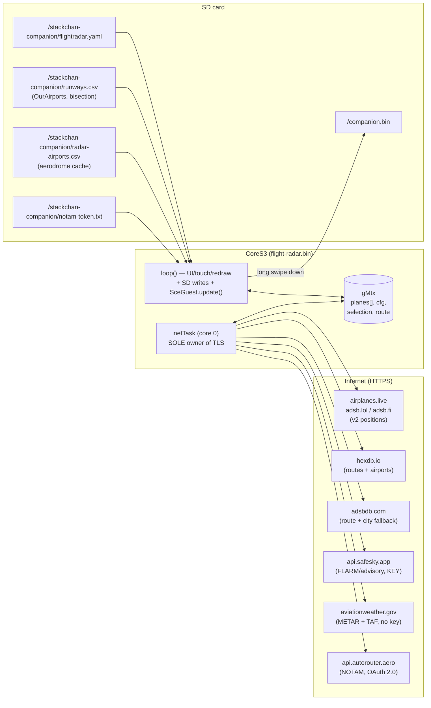
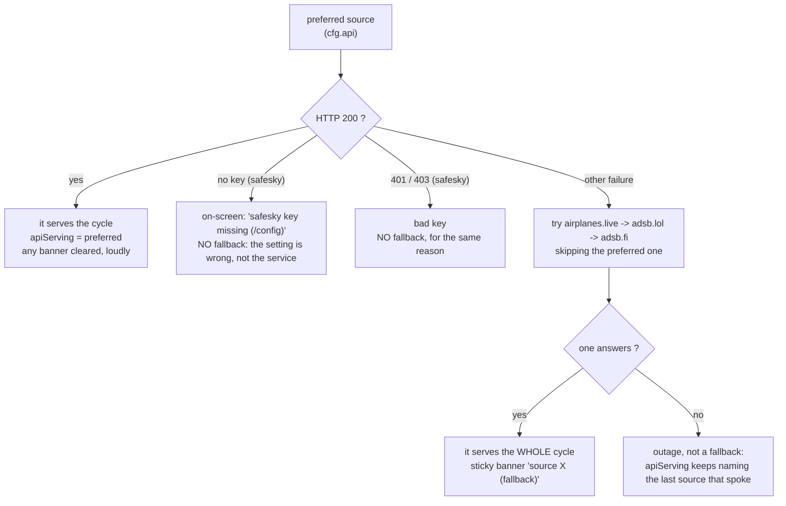
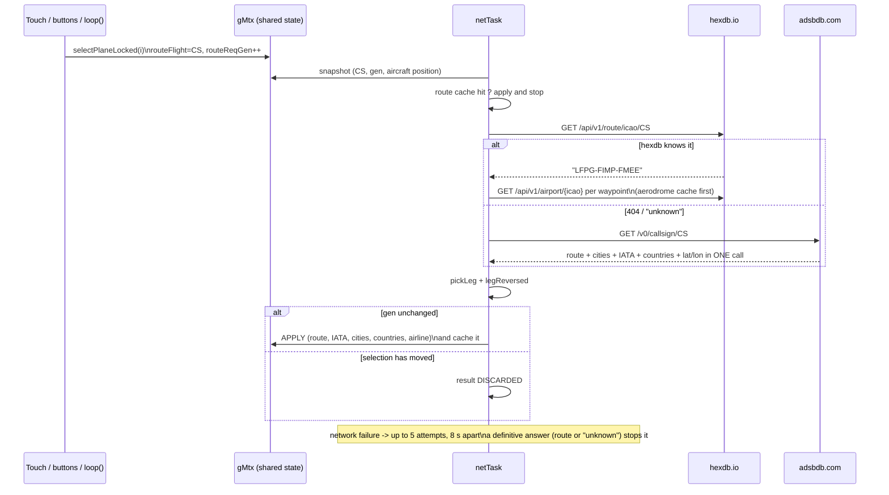
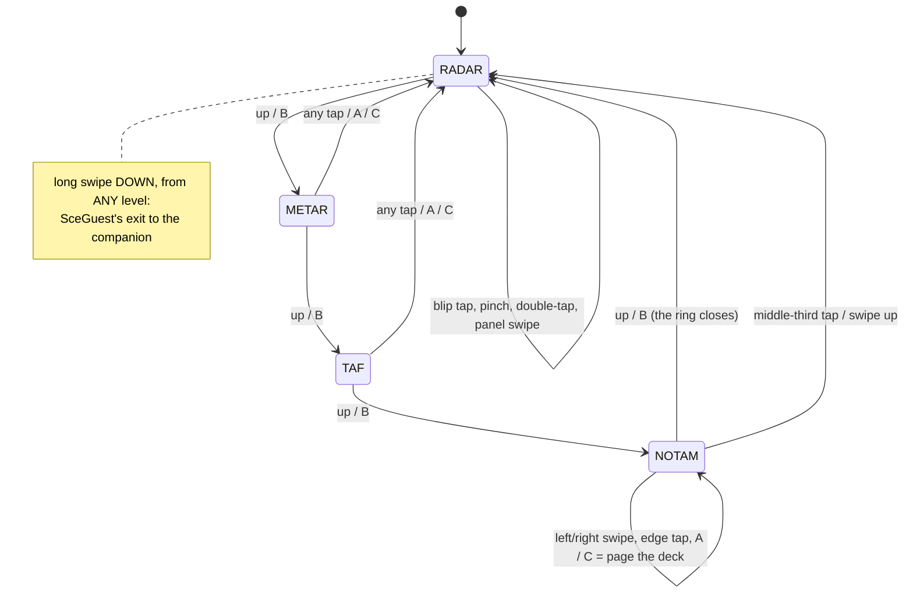
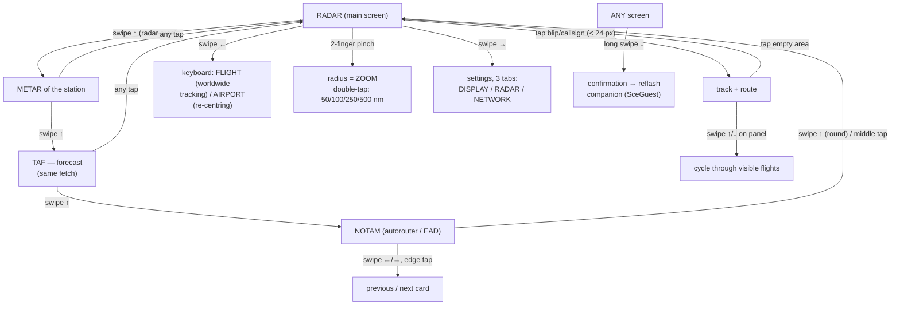
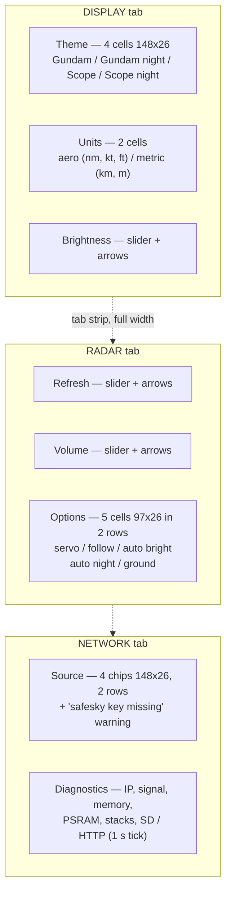
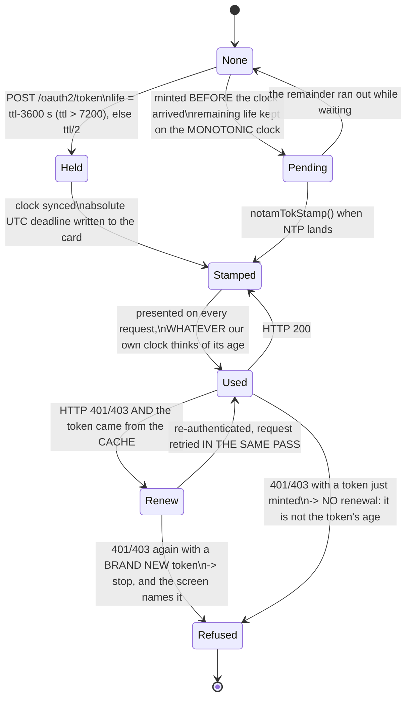
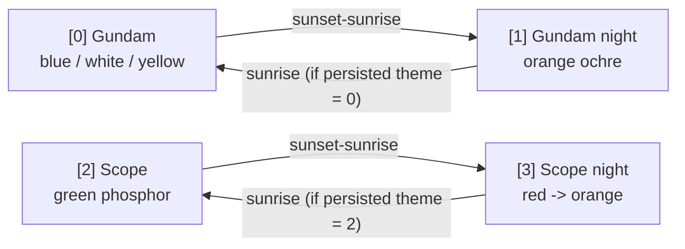
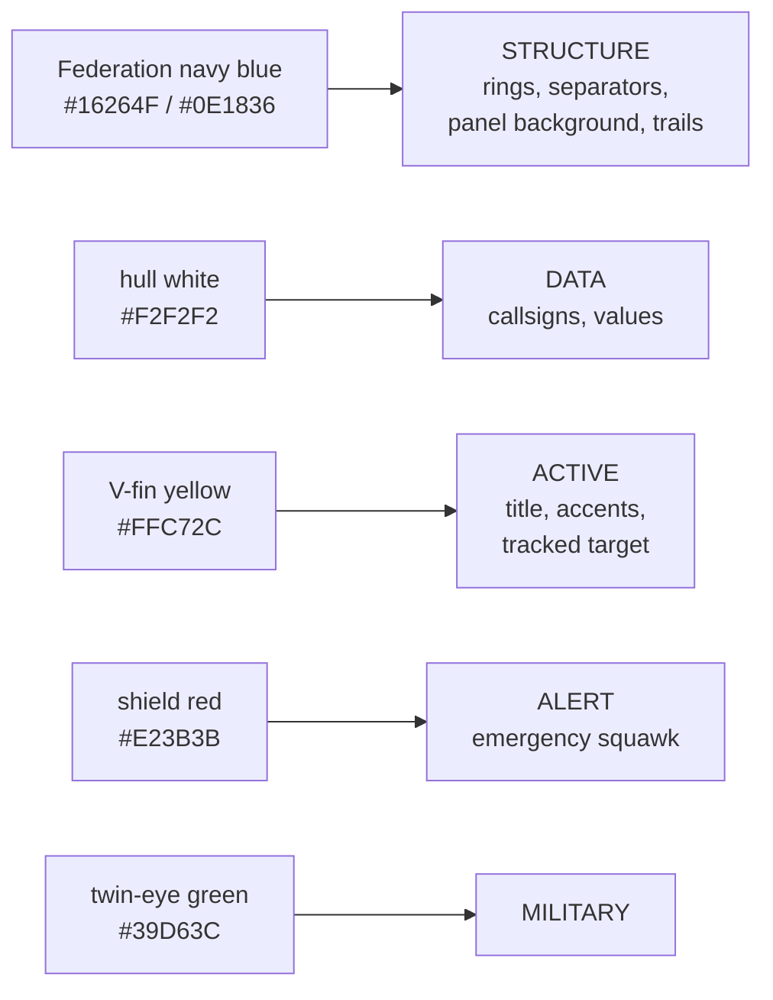

> **English** · [Français](FLIGHT-RADAR.fr.md)

# flight-radar — real-time aircraft radar (reference guest bin)

Demonstration guest bin (`firmware/flight-radar/`, PlatformIO env
`flight-radar`): real-time ADS-B radar around a point (or an airport),
flight tracking with route/cities/ETA/progress, METAR / TAF / NOTAM reading
screens, 4 themes, fully touch-driven. It exercises the WHOLE guest chain
described in `docs/guests/README.md` (SceGuest, remote stop, SD config,
shared WiFi). The same source also builds a standalone application for an
M5Stack Fire, driven by three buttons.

## Overview



- **`loop()`**: touch and buttons, redraw (on event + a 1 s tick), **every SD
  access** (`cfgDirty`, the token file, the aerodrome cache, the runway
  lookup), sound sequencing, the 1 Hz automations, SceGuest's HTTP server.
- **`netTask`** (core 0, prio 1, 16 KB stack, 200 ms tick): airport
  re-centring, route resolution under the generation protocol,
  periodic/forced polling, METAR/TAF, NOTAM. **Every TLS session lives
  here** — in `loop()` they starve the synchronous WebServer, and two
  concurrent `WiFiClientSecure` exhaust the internal heap.
- Sharing under `gMtx` (mutex) plus 32-bit lock-free volatile flags
  (`pollNow`, `uiDirty`, `cfgDirty`, `routeReqGen`, `airportState`,
  `routeStatus`, `pollBusy`, `planesFull`, `httpStatus`, `netStop`).
- **loop() is the sole SD user**, and this bin has no renderer task: the LCD
  push and the card access are sequential by construction, so A2.16's
  `renderer.pause()` has nothing to pause here.

## The pure layer: `geo.h`

Everything whose correctness can be argued about lives in
`firmware/flight-radar/geo.h`: no Arduino, no M5, only `<math.h>` and
`<string.h>`, so it compiles natively and is covered by
`test/test_flightgeo`. Two constants underpin it:

```
NM_PER_DEG_LAT = 60.0      one degree of latitude = 60 nautical miles
DEG2RAD        = 0.01745329252
```

| Function | What it computes |
|---|---|
| `gcNm(la1,lo1,la2,lo2)` | **great-circle distance**, haversine, in nautical miles |
| `planarNm(la1,lo1,la2,lo2)` | **local flat distance**, equirectangular |
| `bearingDeg(la1,lo1,la2,lo2)` | **initial bearing**, 0-360°, 0 = North |
| `pickLeg(wpLat,wpLon,n,plat,plon)` | which leg of a multi-stop route the aircraft is on |
| `legReversed(…)` | is the announced leg being flown backwards |
| `cityClean(s,maxChars)` | sanitises a city name for a 6×8 ASCII font |
| `dayNum(y,m,d)` | days since 1970-01-01 (forwards to `SunClock.h`) |
| `ddhhAbsHour(dd,hh,…)` | a `DDHH` reading resolved to an absolute hour |
| `ddhhRangeCovers(…)` / `tafGroupCovers(line,…)` | does a TAF period cover now |

**Haversine** (`gcNm`), with φ in radians:

```
a = sin²(Δφ/2) + cos φ1 · cos φ2 · sin²(Δλ/2)
d = 2 · atan2(√a, √(1−a)) · 3440.065          → nautical miles
```

3440.065 nm is the Earth's mean radius. Routes span whole continents, so the
flat approximation is not good enough for them.

**Equirectangular** (`planarNm`) is the one used per frame, at radar scale
(≤ 500 nm), because it costs four multiplications instead of four
transcendentals:

```
dLat = (la2 − la1) · 60
dLon = (lo2 − lo1) · 60 · cos(la1)
d    = √(dLat² + dLon²)
```

**Initial bearing** (`bearingDeg`), the standard forward-azimuth formula,
normalised into 0-360:

```
y = sin Δλ · cos φ2
x = cos φ1 · sin φ2 − sin φ1 · cos φ2 · cos Δλ
b = atan2(y, x) in degrees, +360 if negative
```

**`cityClean`** keeps only printable ASCII (`0x20 ≤ c < 0x7F`) and stops at
`maxChars`, editing in place: the 6×8 font renders UTF-8 as `??`, and the
panel column is 85 px wide.

## Polling & the aircraft merge

### One cycle

- **≤ 250 nm**: one `/v2/point` request on the centre.
- **> 250 nm** (max 500): **tiling** — the centre at 250 nm plus **6
  hexagonal satellites** at a distance `R − 250`, on bearings 0°, 60°, …,
  300°, each asking for 250 nm, spaced **150 ms** apart. A satellite centre is

  ```
  slat = lat + (d · cos b) / 60
  slon = lon + (d · sin b) / (60 · cos lat)          d = R − 250
  ```

  The pass is **cut short and rescheduled** if a re-centring or a route
  request arrives meanwhile, or if a reflash is imminent.
- **SafeSky is never tiled**: past its 20 km cap its `viewport` mode already
  covers the whole box in one request.
- Period: `poll_s` seconds (5…60) multiplied by `2^penalty`. A **forced**
  poll (re-centring, settings OK, a new track, a cut-short tiling pass) is
  honoured at most every **3 s**.
- **Adaptive back-off**: an HTTP **429** or any **5xx** raises the penalty
  (×2 then ×4, capped); a successful cycle puts it straight back to ×1. A
  rate-limited API is asking to be asked less, not more.

### The selected source is preferred, not exclusive

The three ADS-B mirrors speak the same v2 format and cover the sky unevenly.
The configured source is asked **first, every cycle**; it is replaced only on
a **transport-level failure** (no HTTP 200). A `200` carrying an empty sky is
a legitimate answer, and failing over on it would chase every quiet hour
through all three servers.



- **Fallback order**: `airplanes.live` → `adsb.lol` → `adsb.fi`, skipping the
  preferred one. Whichever answers **serves the whole cycle** — the satellite
  tiles and the worldwide-track request all aim at it.
- **SafeSky is never a fallback *target***: it is account-bound, and landing
  on a service the user has not configured would be a surprise, not a rescue.
  It does fall back *from* when it is the preferred source and the transport
  fails. The two exceptions are a **missing key** and a **401/403**: both mean
  the setting is wrong rather than the service down, and papering over either
  with another feed would hide the misconfiguration indefinitely.
- **The substitution is stated, both ways.** A sticky banner
  `source <name> (fallback)` stands for as long as the substitution lasts —
  it is a *state*, not an event that fades — and the return of the preferred
  source ends it as loudly: a warning that never clears teaches people to
  ignore warnings.

### Parsing

**Filtered** ArduinoJson parse — `hex`, `flight`, `lat`, `lon`, `alt_baro`,
`gs`, `track`, `baro_rate`, `squawk`, `category`, `dbFlags`, `t` — with the
**document in PSRAM** (`sce::psAlloc`, rule 18): near a hub the response
exceeds the internal heap. HTTP/TLS stream timeout **15 s**: a 300-500 KB
body over weak WiFi does not arrive in 8.

One single HTTPS+JSON path, `fetchJson(url, doc, timeout, filter, header,
value)`. The optional header is what SafeSky needs (`x-api-key`) and what the
NOTAM bearer travels in.

### Merge, ageing and eviction

| Rule | Value |
|---|---|
| Table size | `MAX_PLANES` = **48** (~420 B per aircraft, trail included) |
| Key | the 24-bit ICAO address (`hex`), never the callsign |
| Trail | **48** positions per aircraft, ring buffer, filled locally at every poll |
| Purge | not seen for **90 s** — the table is compacted |
| Track release | tracked flight silent for **10 min** |
| Freshness colour | age > **90 s** → minutes instead of seconds, and the alert colour |

- **New aircraft**: a free slot is taken and **zeroed** (`Plane{}`). Purges
  compact the array, so a recycled slot would otherwise inherit the dead
  entry's callsign and trail — and the track would latch onto the wrong hex.
- **Table full**: the **farthest untracked** aircraft is the victim, and the
  newcomer only takes its place if it is **closer than that worst kept
  entry**. Sorting by age discriminates nothing (every aircraft merged in one
  cycle shares the same `seenMs`), and without the distance comparison the
  satellite tiles — the farthest, merged last — would evict the centre.
  Saturation is published only at the **end of a successful cycle** and only
  if the table is *still* full after the purge, as the counter **"48+"**.
- **Trail points are deduplicated**: a new position within `1e-4°` of the last
  one in latitude *and* longitude is dropped, so a parked aircraft does not
  fill 48 slots with the same point.
- **The tracked flight survives ALL purges** — 90 s ageing, radius reduction,
  airport re-centring, full-table eviction. Its absolute lat/lon stay
  projectable, and the panel keeps saying how old the data is. The one exit is
  the 10-minute release, without which the panel froze forever on dead data.

### Life cycle of a tracked flight that lands

`alt_baro` switches to the string `"ground"` → grey blip, `GND`, status
"landed". As ground speed drops below **80 kt** the `~` times and the `ETA`
countdown disappear (they no longer mean anything); the progress bar reaches
~100 %. When the transponder goes off, freshness switches to minutes and to
the alert colour ("signal lost"). After **10 minutes without a signal**,
tracking is released and the selection, the track query and the route are all
cleared.

## Sources (4)

| Source | Coverage | Key | Native units |
|---|---|---|---|
| `airplanes.live` *(default)* | ADS-B/Mode-S, best in the Indian Ocean | no | ft, kt |
| `adsb.lol` | ADS-B/Mode-S, same v2 format | no | ft, kt |
| `adsb.fi` | ADS-B/Mode-S, poor Indian Ocean coverage | no | ft, kt |
| `safesky` | **FLARM / advisory** on top of ADS-B: gliders, UAVs, paragliders that no ADS-B mirror sees | **yes** (30-day trial) | **m, m/s** |

Endpoints: `api.airplanes.live/v2/point/{lat}/{lon}/{nm}`,
`api.adsb.lol/v2/point/…`, `opendata.adsb.fi/api/v2/lat/{lat}/lon/{lon}/dist/{nm}`,
and `/v2/callsign/{cs}` on the first three for the worldwide lookup.

Three things SafeSky forces, and how each is handled:

- **Different units, converted at the entry point.** It serves metres AMSL,
  m/s of ground speed and m/s of vertical rate; the `Plane` structure is
  filled in ADS-B units and nothing downstream learns that a second unit
  system exists.

  ```
  altFt = altM · 3.28084          gs(kt) = gs(m/s) · 1.94384
  vrate(ft/min) = vr(m/s) · 196.85
  ```

  Its `-9999 m` "altitude unknown" sentinel (anything ≤ −1000 m) collapses to
  0, the way the ADS-B path already treats a missing `alt_baro`.
- **`rad` is capped at 20 000 m** (≈ 10.8 nm) while `radius_nm` goes to 500.
  Beyond the cap the request switches to **`viewport`** — the bounding box of
  the same circle:

  ```
  dLat = radNm / 60
  dLon = radNm / (60 · cos lat)        cos lat floored at 0.02, dLon capped at 180
  ```

  The floor and the cap keep the box a box near the poles instead of a NaN or
  a request spanning several turns of the globe. The box is wider than the
  circle at the corners (harmless: the radar clips it anyway) and a viewport
  answer is capped at 300 aircraft by the API, far above the 48 slots kept
  here.
- **No key = no request.** The chip in the settings **refuses** to be selected
  and says why; if the source comes from the yaml (or the key is revoked), the
  radar shows `safesky key missing (/config)` instead of an inexplicable "0
  aircraft". No TLS session is opened to collect a 401, which would accuse the
  service instead of the missing setting.

Two limits accepted: SafeSky publishes **no military flag and no squawk** (so
no emergency alert on that source), and **no callsign endpoint** (the
worldwide out-of-range tracking is an ADS-B mirror feature). Its
`beacon_type` is mapped onto an ICAO category so the blip keeps its shape:

| `beacon_type` | Category | Blip |
|---|---|---|
| `HELICOPTER` | `A7` | circle + rotor cross |
| `GLIDER` | `B1` | 2 px wing |
| `UAV`, `PARAGLIDER`, `HANGGLIDER`, `BALLOON` | `B4` | hollow delta |
| `JET` | `A3` | airliner triangle |
| anything else | `A1` | small solid triangle |

The `beacon_type` also fills the 4-character type field, whose truncation
happens to read well: `HELICOPTER` → `HELI`, `PARAGLIDER` → `PARA`.

> ⚠ **Known debt — authentication.** The `x-api-key` header is marked
> DEPRECATED by SafeSky in favour of a per-request **HMAC-SHA256** signature
> (KID derivation, HKDF, single-use nonce, timestamp within ±5 min):
> <https://api.safesky.app/doc/authentication>. The header still works, and
> the signature would need mbedTLS plus a trustworthy clock. The day it is
> retired, only this source stops answering.

## Tracking & the generation-based route protocol

### The protocol

Every mutation of the selection increments `routeReqGen`. `netTask` works on
a **snapshot** of (callsign, generation) and only applies its result if the
generation has not moved: a tap made while a fetch is in flight is neither
lost nor misattributed.



`routeStatus` reports the state to the screen: 0 nothing to resolve, 1
searching, 2 found, 3 the database answered "unknown", 4 the network is down.

### Multi-leg routes and the leg picker

An hexdb route can read `LFPG-FIMP-FMEE`: up to **4 waypoints** are split out
and each is resolved (aerodrome cache first, network second). The leg is
chosen among the subset that **actually resolved** — an unresolved
intermediate waypoint must not be displayed as an endpoint.

`fr::pickLeg` keeps the leg whose endpoints **bracket** the position best.
For each leg *i*:

```
cost(i) = gcNm(wp[i], aircraft) + gcNm(aircraft, wp[i+1]) − gcNm(wp[i], wp[i+1])
```

That excess is ≥ 0 and **zero when the aircraft sits exactly on the leg**; the
smallest one wins. With fewer than three waypoints there is nothing to choose
and leg 0 is returned. Always taking the first leg gives a wrong origin, a
wrong progress bar and a wrong ETA to an aircraft already flying the second
one, with nothing on screen hinting at it.

When more than two waypoints were published, the displayed route label is
rewritten as the **chosen leg** (`orig-dest`) rather than the whole chain.

### Reversed legs

The community databases give the **canonical** direction of a flight number,
and several airlines reuse the same callsign on the return trip. `SS636` is
announced `MRS-RUN` while flying Réunion → Marseille: without a correction
the origin, the destination, the progress **and** the ETA are all wrong, and
the countdown *grows* as the flight goes on.

`fr::legReversed` runs **two independent tests, either one convicting**:

| Test | Condition |
|---|---|
| **Track** | a published track, `gs > 150 kt`, and the angular gap between the ground track and the bearing to the announced destination **> 120°** |
| **Descent onto the announced origin** | `alt < 10 000 ft`, `dOrig < 40 nm`, `dDest > 150 nm`, `vrate < −256 ft/min` |
| **Climb out of the announced destination** | `alt < 10 000 ft`, `dDest < 40 nm`, `dOrig > 150 nm`, `vrate > +256 ft/min` |

The angular gap is folded into 0-180° before the comparison. The **150 kt
floor must not be lowered**: below it an aircraft may be turning (departure
pattern, circling approach) and a transient track would swap a *correct*
route. That floor is also why the track test is blind exactly on final
approach, which flies at 120-140 kt — hence the second and third tests, which
need no track at all. The **ground case is deliberately excluded**: parked at
the announced origin is ambiguous (just arrived on the reversed leg, or about
to depart the correct one), a descent is not.

It remains a **heuristic**: a flight deviating heavily (diversion, weather
avoidance) can trigger it wrongly. When it fires, origin and destination are
swapped — coordinates, cities, IATA codes, countries and the printed label.

### The route cache

**4 entries, ring, TTL 2 h.** Automatic re-acquisition after a purge and the
↑/↓ cycling of the panel would otherwise re-resolve the same flight in a
loop, at 3-4 TLS sessions per return.

- **Expiry is essential**: the destination that was memorised is the CURRENT
  leg, and the same callsign leaves on another leg a few hours later.
- An expired entry is **freed** on the way past, or the ring of 4 decays to 2.
- A **multi-leg** entry also records the position it was resolved for, and is
  dropped once the aircraft is more than **50 nm** away from it: replaying it
  as-is would cancel the leg correction the moment the aircraft moved on.
- The countries are copied **before** the reversal test, never after, so a
  reversed cache hit cannot swap one selection's country onto another's.
- Only a **complete and definitive** route is cached. "Definitive" means
  either a complete route in hand, or every source that was *asked* did
  *answer* (200, or a 4xx meaning "no data"). A network failure stays
  transient and is retried.

### The aerodrome cache on the card

Resolving a route is one request for the route plus **one per waypoint** — up
to six TLS sessions for a single tap. `/stackchan-companion/radar-airports.csv`
holds what does not change.

| Field | Source |
|---|---|
| position (lat, lon) | hexdb `/api/v1/airport/{iata\|icao}/{code}` |
| city / region, IATA code, country | same |
| ATIS and tower frequencies, field elevation | aviationweather `/api/data/airport?ids=…` |

- **48 entries, ring**, keyed by code and compared **case-insensitively** —
  two entries for one aerodrome would be a cache that dilutes itself.
- **No expiry.** An aerodrome does not move. An entry leaves only when the
  ring wraps.
- **One entry per aerodrome, not one cache per question.** `hasPos` and
  `hasStn` say which halves are filled, and either alone is worth a line on
  the screen. The two halves arrive from two endpoints, minutes apart, and
  filling one never clears the other.
- **Three states, not two.** `hasPos` may answer yes, `neg` may answer no, and
  anything else falls through and asks. A verdict must be *stated*: inferring
  "unknown" from the absence of a position would make the station half of the
  cache answer "no such aerodrome" about the very field the radar is centred
  on.
- **Negative answers are remembered too, but only in RAM**, and only for codes
  the database actually ANSWERED about. An unreached database says nothing
  about the code — `lookupAirportNet` reports `reached` separately — and a 404
  today may be a record tomorrow, so that verdict must not survive a reboot.
  Negatives are never written to the card.
- **Values first, flag last.** `la`/`lo` are written before `hasPos` is
  raised, because `loop()` may be serialising the array while `netTask` fills
  it; the save also takes a **copy** of each entry rather than a reference.
- **Written by `loop()`, throttled to once a minute**, and the whole file is
  rewritten rather than appended (the ring overwrites in place). The dirty
  flag is cleared **before** the write, so an entry stored during the write is
  not marked clean without ever reaching the file.
- On a card inserted **hot**, RAM wins: what is held was paid for with TLS
  sessions this run, so the card receives it rather than overwriting it.
- The file is positional and append-only in shape: a card written before the
  station half existed simply stops after six fields, and the reader hands
  back empty strings instead of walking off the end.

### Worldwide tracking

A **complete** callsign (≥ 4 characters), typed on the keyboard or posted to
`/config`, while the aircraft is out of range: the route is pre-resolved
immediately and a `/v2/callsign` request is fired (whole world) on each cycle
until acquisition, with a **3-cycle reprieve** after an unsuccessful attempt.
A fragment cannot match that exact-match endpoint, so the request is simply
not fired. The backoff debt is attached to **the query**, so a new track does
not inherit the previous one's reprieve. The result merges into `planes[]`
with real position, altitude and speed; the blip is drawn as a double circle
clamped to the radar edge.

### ETA and departure time

Both are **estimated** — no published schedules without a keyed API — and
computed from great-circle distances taken once per frame:

```
dDone = gcNm(origin, aircraft)          dRem = gcNm(aircraft, destination)
progress  = dDone / (dDone + dRem)
hoursLeft = dRem / gs                   arrival = now + hoursLeft
departure = now − (dDone / gs) hours
```

They are shown only when the clock is synchronised **and** `gs > 80 kt`,
prefixed with `~`, in the local time given by `tz_offset_h`. Below 80 kt the
panel says `ETA: low speed` instead of dividing by a speed that means
nothing.

## The radar screen

```
┌──────────────────────────────┬───────────┐
│ MRU              upd 12s     │   RIGHT   │
│                    12:34     │   panel   │
│      ╭─── radar ───╮         │ (summary  │
│      │  blips by   │         │  OR       │
│      │  category   │         │  tracked  │
│      ╰─────────────╯         │  flight)  │
│   [route status / alert]     │           │
│   [hint or banner]           │           │
└──────────────────────────────┴───────────┘
```

### Geometry and the projection

| Constant | Value |
|---|---|
| Radar centre | `CX` = **114**, `CY` = **120** |
| Radar radius on screen | `RPX` = **100 px** |
| Panel left edge | `PANEL_X` = **228** |

A position becomes a screen point through a **local equirectangular
projection about the radar centre**, scaled so that `radius_nm` maps onto
`RPX`:

```
dLatNm = (lat − lat0) · 60
dLonNm = (lon − lon0) · 60 · cos(lat0)
x = CX + dLonNm / radiusNm · RPX
y = CY − dLatNm / radiusNm · RPX        (screen y grows downwards)
```

North is therefore up, the scale is the same on both axes at the centre
latitude, and the same function projects the blip, its trail and the tap
hit-test — so nothing invisible is ever selectable.

**Clip**: a blip is drawn only for `6 ≤ x ≤ PANEL_X − 8` and `10 ≤ y ≤ 232`.
Outside that box it is skipped — unless it is the tracked flight, which gets
the off-scope marker instead.

### Rings, cross and labels

There is **no rotating sweep**: this is a plan display, not an animation. The
scale is drawn once per frame.

- Three circles centred on (CX, CY): **`RPX`** in `ring1`, **2/3 RPX** and
  **1/3 RPX** in `ring2`.
- A **9 px centre cross**, drawn as two lines from a single call site in a
  loop (A2.22).
- `N` above the outer ring (`CY − RPX − 12`), the **full radius** labelled
  inside the outer ring and the **third radius** beside the inner one, both in
  the display unit (`nm` or `km`).

### Blips

The blip is **rotated onto the aircraft's ground track**. With
`a = track · π/180`, a shape point (dx, dy) — dy pointing forward — lands at:

```
sx = x + dx·cos a + dy·sin a
sy = y + dx·sin a − dy·cos a
```

| Category | Shape | Geometry |
|---|---|---|
| `A7` helicopter | circle + rotor cross | circle r = 4, two arms ±6 px |
| `B1` glider | 2 px wing + fuselage | four lines, span ±9 |
| `B4` microlight, UAV, balloon | **hollow** delta | nose (0, 5), tail (±4, −4) |
| `A1` light | small solid triangle | nose 4, half-width 3 |
| anything else | airliner triangle | nose 6, half-width 4 |

- **Colour = altitude band** (`altColor`): ground → `altG`, `< 10 000 ft` →
  `altLow`, `< 25 000 ft` → `altMid`, above → `altCruise`.
- **Military** (`dbFlags` bit 0): a **17 × 17 px square** in `milCol` around
  the blip, and the aircraft **type** printed under the callsign.
- **Tracked**: a circle of radius 9 in `selCol`, and the blip itself is drawn
  in `selCol` rather than its altitude colour.
- **Tracked and off-scope**: the position is projected anyway, then the vector
  from the centre is normalised to `RPX`, and **two concentric circles**
  (r = 5 and r = 2) are drawn at that point on the rim. No trail, no triangle:
  it is not to scale.
- **Ground traffic** is hidden unless `show_ground` is on — or unless it is
  the tracked flight, which always shows.
- **The callsign** is written at `x + 8`, and **flips to the left of the blip**
  (`x − 8 − width`) when its last glyph would reach past `PANEL_X − 2`, so no
  label is ever painted over by the panel.

### The speed vector

The segment ahead of the blip is the position the aircraft would reach at its
current heading and speed after a **horizon in minutes**, drawn for anything
airborne above **40 kt**:

```
aheadNm = gs · horizonMin / 60
len px  = aheadNm / radiusNm · RPX        clamped to 5 … 60 px
```

A vector is a *duration*, so its on-screen length depends on the zoom. The
horizon is therefore **adaptive and shared by every blip** — different
horizons would make the lengths incomparable. It is the smallest of 1, 2, 4
minutes that gives at least **10 px at 450 kt**, else 8:

| Radius | Horizon | Length at 450 kt |
|---|---|---|
| 25 nm | 1 min | 30 px |
| 50 nm | 1 min | 15 px |
| 100 nm | 2 min | 15 px |
| 250 nm | 4 min | 12 px |
| 500 nm | 8 min | 12 px |

The 5 px floor exists because the horizon is calibrated on 450 kt: a
helicopter at 90 kt would otherwise fall back under the drawing threshold and
lose its direction entirely. The current horizon is named in the legend
(`vector N min`) precisely because it varies.

### The trail

Only the **tracked** flight carries one. It is the local history — the
community APIs serve no track history, so the trail fills up while the radar
watches — replayed as a polyline through `planeToXY`, so it re-projects
correctly after a zoom or a re-centring. Up to 48 points, in the `trail`
colour of the theme.

### The flight panel — the 6-to-12 layout

The right panel (x 228…320) shows the tracked flight. Its own separator line
**is** the route: **arrival at the top, departure at the bottom** — you fly
from 6 o'clock to 12 — with the travelled segment **solid** from the
departure dot up to the aircraft triangle and the remainder **dotted** up to
the arrival dot.

| Band | Content |
|---|---|
| y 4…54 | **state**: callsign (size 2), level + speed, distance and freshness, then airline / category / type / vertical rate — or `SQUAWK 7500/7600/7700` in the alert colour |
| y 57 | rule |
| y 62…120 | **ARRIVAL**: IATA (or ICAO) in size 2, country pinned right, city, `~hh:mm` |
| y 128…168 | **trip zone**, framed by two dotted separators |
| y 173…232 | **DEPARTURE**: same three rows, `~hh:mm` of the estimated departure |

The rail runs from `RAIL_T = 64` (arrival) to `RAIL_B = 234` (departure) on
the separator column itself, and the aircraft marker sits at

```
yPlane = RAIL_B − (RAIL_B − RAIL_T) · progress
```

drawn as a 2 px-wide accent segment below it and an upward triangle at it.
With no complete route the rail is **all dots and carries no aircraft**: a
path is not invented.

The **trip zone** carries three rows:

- **top**: the progress `%` on the left, the **remaining distance** on the
  right — both short, no collision possible;
- **middle**: the **phase** as a code *plus* its readable label;
- **bottom**: the remaining **time** alone, as `ETA 0h28`. Strictly that
  duration is the ETE and the clock time in the arrival block is the ETA, but
  the colloquial ETA-as-countdown is what everyone reads.

The flown distance is not shown: the `%` and the rail's solid segment already
say it.

**Level and speed** share one row of 13 glyphs. In aero units an altitude at
or above **18 000 ft** is printed as a flight level (`FL330`); in metric it is
metres, and when the pair does not fit the altitude drops its unit suffix
rather than overlapping the speed. **Vertical rate** is printed as `^` or `v`
beyond ±300 ft/min, in ft/min in aero and in m/s in metric (`ft/min ×
0.00508`).

**City names** are cut to **13 glyphs** — the panel's text column is 78 px of
a 6 px font — and the cut is **marked** with a `.` as the thirteenth
character. A truncation you can see beats five characters that vanish.

### Phase of flight

A 3-letter aviation code, language-free, in the middle row of the trip zone,
with a readable label beside it on a shared baseline:

| Code | Label | Condition |
|---|---|---|
| `GND` | ground | `onGround` |
| `CLB` | climb | `vrate > +300 ft/min` |
| `DES` | descent | `vrate < −300 ft/min` |
| `CRZ` | cruise | otherwise, and `gs > 150 kt` |

Nothing is drawn below 150 kt in level flight — there is no honest name for
it. The phase is **independent of the route**: an aircraft with no known
route still climbs or descends. The thresholds are the same ones
`fr::legReversed` reasons with.

### The time corner and the summary

**The top-right corner is the TIME corner**: how old the data is
(`upd 12s`, `upd --` before the first successful poll) and, under it, the
LOCAL CLOCK. The two are one question asked twice, and the placement matches
the space bin's header so the two guest bins read alike. The clock is **blank
until the clock is synchronised** rather than showing an unset RTC's 01:00 —
the same rule the `~` times follow. The airport code sits in the top-left
corner.

**Summary** (nothing tracked): the giant aircraft counter (`--` until the
first successful poll, then `N` or `48+`), the radius, the source — replaced
by `track <CALLSIGN>` when a track is armed — then the **full legend**: four
altitude colours, then eight symbols (airliner, light, microlight, glider,
helicopter, military, tracked, off scope) and the current vector horizon.

**Under the radar**, centred, in the alert colour: the tracked flight's state
(`route: searching…`, `route unknown`, `route: network down`, `no callsign`,
`signal lost`, `landed`, `clock: NTP sync…`, `ETA: low speed`, `airport
unknown`) or, with nothing tracked, the radar's own (`WiFi disconnected…`,
`safesky key missing (/config)`, `API failed (HTTP n)`, `searching for
aircraft…`, `connecting to the API…`). The API is only blamed when the **last
cycle failed entirely** — one missed tile out of seven, or an empty worldwide
lookup, does not indict it.

**The bottom line** carries the hint (`touch an aircraft to track`, or
`no microSD: settings are not saved` for as long as there is no card) and is
taken over by the **banner** when there is one.

Accents are rendered through **`fonts::efontJA_12`** (Unicode) — a SINGLE
accented font: a second one costs ~315 KB of flash on a 1.77 MB binary. The
6×8 `Font0` (ASCII) remains the font for data (fixed metrics, 6 px/char). The
sentences under the radar are calibrated for 36 characters (usable width
228 px at 6 px per character).

## The view stack

The four screens form a **ring travelled by the swipe UP alone** (or by `B` on
a button board). **The order is the meaning**: the radar is what is
happening, the METAR what is measured, the TAF what is forecast, the NOTAM
what is out of service — each step one remove further from the ground truth.



The state is a **level** (`viewLevel`, 0…3), not one boolean per view:
everything else — what is drawn, which gestures apply, whether the METAR is
refreshed — is derived from that one number, so the derived state cannot
drift. `setViewLevel()` is the single place it changes.

**One gesture, one job.** The swipe down is **not ours at any step**: it
always means "back to the companion" and belongs to `SceGuest`. Nothing this
bin does can break the way out of it. `armSwipeExit()` survives as the single
call site the **modals** (keyboard, settings) use to give the gesture back
after holding it; it is compiled only on a touch board, since nothing
suspends the gesture where there is no touch.

Above the radar, **any tap** jumps straight back to the radar: the short way
out of a reading screen without going round the ring.

**A long press (700 ms, finger still) forces a refresh** of the METAR, the
TAF and the NOTAM. Every other gesture is taken — a tap leaves for the radar,
up is the next view, down belongs to `SceGuest`, left/right page the NOTAM
deck — and a *double* tap cannot work either, since the first tap has already
left. A hold is also the right shape: forcing a fetch is a deliberate act, not
something a sleeve should trigger. It fires **on the hold**, not on release,
so the screen answers while the finger is still down, and it clears the 60 s
failure spacing as well as the "last success" stamps — otherwise the retry you
just asked for would be swallowed by the very guard that stops a failing
service being hammered.

Vertical swipes **starting on the right panel** keep their own job (cycling
through the tracked flights): the panel only exists on the radar, so the two
cannot collide.

### The input vocabulary (`input.h`)

Every gesture is named after **what the user asked for**, never after the
gesture that asked for it. `firmware/flight-radar/input.h` is pure — no
Arduino, no M5, time injected — and natively tested by `test/test_input`.
Touch, buttons and the dock timer are three **producers** of `fr::UiEvent`;
`applyEvent()` in `main.cpp` is the single **consumer**. What this file holds
is the **vocabulary**: the event set, the three-way `fr::Screen`, and the
mapping from a button to an event. The button **mechanics** are the shared
`firmware/common/ButtonFsm.h` (see *Buttons* below) — one implementation, two
bins.

| `UiEvent` | Meaning |
|---|---|
| `NextView` | one step on the view ring |
| `Back` | straight back to the radar |
| `PagePrev` / `PageNext` | previous / next card of the NOTAM deck |
| `Refresh` | force a METAR/TAF/NOTAM fetch now, ignoring the spacing |
| `NetInfo` | show the IP and point at `http://<ip>/config` |
| `ZoomCycle` | 50 / 100 / 250 / 500 nm, in that order |
| `TrackPrev` / `TrackNext` | previous / next aircraft in the list |

The event set is deliberately **smaller** than the touch gesture set:
`SelectAt` (tapping a blip) and the pinch-to-zoom preview have no button
equivalent and stay touch-only.

`applyEvent` keeps its own guard on paging (`viewLevel == VIEW_NOTAM &&
notamCount > 0`) even though both producers already decide it: it is the one
place that sees every producer, present and future.

### Dock mode

Parked on a desk, the views cycle by themselves: radar → METAR → TAF →
NOTAM, **`dock_s` seconds per view** (`/config`, 0-120, **0 = off, the
default** — an instrument must not move under a reader's eyes unless asked
to). Every manual action restarts the current view's clock: `applyEvent()`
stamps it for every producer, a blip tap and any button level stamp it at
their handlers, and the debug overlay re-stamps while held. The touch modals
suspend the cycle by construction, since they block `loop()`. The
auto-advance itself goes through `applyEvent(NextView)` like any other
producer — one consumer, and the dock is simply the third input vocabulary
after touch and buttons.

## Gestures (touch)



Thresholds, all in `handleTouch()`:

| Gesture | Rule |
|---|---|
| swipe (reading screens and radar) | ≥ **60 px** on the dominant axis |
| swipe on the right panel | ≥ **40 px** vertically |
| blip tap | nearest blip within **24 px**; the drawn **callsign** counts as a target too (text rect + 4 px) |
| double-tap = zoom steps | two taps within **400 ms**, and **only when nothing is tracked** |
| pinch | two touch points, `radius = radius0 · d0 / d`, rounded to 5 nm — **preview only**, persisted and purged when the fingers leave |
| hold | **700 ms** with less than **12 px** of movement; the prompt arms at **250 ms** |
| NOTAM edge taps | `x < 110` previous page, `x > 209` next page, the **middle third** leaves for the radar |

A tap on the right panel neither selects nor deselects: it is a reading zone.
A tap on empty radar ends the track, clears the query and the route, and bumps
the generation so an in-flight resolution is dropped.

## Second board: M5Stack Fire, standalone

> **Powering the Fire OFF**: its IP5306 power IC has NO software off — nothing
> like the CoreS3's `/api/poweroff`, whose AXP2101 can cut itself. **Unplug
> USB first** (on USB power the IP5306 restarts the board immediately, which
> reads as "it will not turn off"), then **double-click the red side button**
> within a second. Single click = on, quick double = off.

The same source builds a **standalone application for the M5Stack Fire**,
with no companion firmware and no K151 hardware:

```powershell
pio run -e flight-radar-fire
```

It is **not a fork**. The differences are declared as *capability flags* in a
single `BOARD PROFILE` block at the top of `main.cpp`, and set per
environment in `platformio.ini` — `SCE_INPUT_TOUCH`, `SCE_INPUT_BUTTONS`,
`SCE_HAS_SERVO`, `SCE_HAS_LTR553`, `SCE_COMPANION`, `SCE_SD_*`. Defaults
describe the CoreS3/K151. The flags are named after what the board **has**,
never after a board name: a flag called `FIRE` would not survive the next
board.

The two input flags are **orthogonal, not exclusive**: `loop()` calls
`handleTouch()` and `handleButtons()` under their own `#if`, so a board with
both drives both.

What makes this cheap: the Fire is also **320×240**, it has **4 MB of usable
PSRAM** (the board carries 8, an ESP32 can map 4) for a 150 KB canvas, and the
radar **never reads the IMU**.

### Buttons

Three momentary buttons, A B C, left to right, read through `fr::ButtonFsm`
(pure, natively tested). The mapping depends on the **screen**, not on "radar
or not":

| | Radar | Deck (NOTAM with cards) | Reading (METAR, TAF, empty NOTAM) |
|---|---|---|---|
| **A** short | previous aircraft | previous page | back to the radar |
| **B** short | next view | next view | next view |
| **C** short | next aircraft | next page | back to the radar |
| **A** long | show `http://<ip>/config` | idem | idem |
| **B** long | force a refresh | force a refresh | force a refresh |
| **C** long | cycle the radius | — | — |
| **A+C** held | debug overlay | debug overlay | debug overlay |

`fr::Screen` has exactly those three values, and `Deck` means "a deck with
cards **in** it": an empty NOTAM screen is `Reading`, so paging is never
offered over nothing. **A and C mean "back" where there is nothing to page**,
which is the touch path's own rule brought over: a gesture that does nothing
can never leave you stuck. **B still reaches the radar from anywhere**, since
it cycles *through* the ring.

**The bank itself is not in this bin.** `input.h` keeps the radar's
*vocabulary* — which `UiEvent` a button means, on which screen — and the
*mechanics* live in **`firmware/common/ButtonFsm.h`**, shared verbatim with the
space bin and re-exported here as `fr::ButtonFsm` so every caller keeps its
name. That is rule 17's shape applied to buttons: this bank was born in this
file, space then grew its own single-button machine beside it, and two
implementations of "when does a press speak" is exactly the assumed-twin drift
A2.23 exists to forbid. `firmware/common/` is a directory both bins already
include, so sharing costs no dependency from one bin into the other, and the
one implementation is tested twice over — `test_input` drives it through the
radar's vocabulary, `test_spaceinput` through space's.

`ButtonFsm` holds seven decisions worth stating:

- `LONG_MS` = **700 ms**, the same threshold as the touch hold;
  `DEBOUNCE_MS` = **25 ms**. A change must hold for the debounce window before
  it is believed.
- The **long press fires on the hold**, not on release, so the screen answers
  while the finger is still down — and having fired, the release that follows
  must **not** also count as a short press.
- **At most one event per call**, and a blocked event is **deferred, never
  dropped**: a transition is believed only when it can also be reported, so a
  release that collides with another button's event is reconsidered on the
  next call.
- The **first sample adopts the level and announces nothing**: a button
  already held at power-on would otherwise fire its long action ~700 ms into
  boot.
- The long press additionally requires the **raw** level to still be high, so
  a release sampled just before the threshold (debounce still running) cannot
  come out as the long action the user released to avoid.
- `chord(a, b)` is a **query**, not an event — a chord means "while held" —
  and it **marks both buttons as having spoken**, so releasing after a chord
  does not also page the aircraft list.
- There is **no `reset()`**: clearing `primed` is the correct way to swallow a
  press in progress, and that path already exists.

### The two touch modals are replaced, not ported

The 8×5 keyboard and the slider settings panel are **touch-only** and are not
compiled on a button board. `http://<ip>/config` does both jobs better — **20
settings on this board**, on a real keyboard (**22 on a CoreS3**: `servo` and
`auto_bright` are compiled out where the hardware is absent, because a toggle
the board cannot honour is worse than a missing one). `A` long puts that
address on screen for 8 s.

`/config` carries a **`track`** field, the web twin of the keyboard. It shares
the *same* commit path (`applyTrackQueryLocked`) rather than a hand-copied
second implementation.

**Empty = unchanged, `-` = stop, and the field is never echoed back.** That is
what makes it safe: a browser posts the value the page held when it was
*rendered*, and `trackQuery` is the most volatile field on this form — the
firmware rewrites it from four places (a blip tap, A/C cycling, a tap on empty
space, and `netTask` releasing a track gone silent for ten minutes). An echoed
value would post back stale and destroy the live track. A field that is never
echoed carries no opinion unless you type in it.

### Defaults name the place they describe

`metar_icao` defaults to **FMEE** and `airport` to **RUN** — the ICAO and IATA
codes of one aerodrome, whose coordinates are the built-in `lat`/`lon` and
whose time zone is the built-in `tz_offset_h` of +4. `airport` is three
letters, so `metarStation()` (which needs four) falls through to `metar_icao`;
a four-letter `airport` wins. On a board with no card those constants are the
entire configuration, so they have to describe a coherent place.

The **runway** stays empty on purpose, and that is not the same call: it is
read from the SD database or typed in. Inheriting one aerodrome's runway after
a change of station would draw an invented heading on the compass.

### Failures are logged, and the clock is reported

A failing METAR prints `metar FMEE ECHEC http=-11`, so a fetch that failed and
a fetch that was never attempted do not look alike.

The 10 s heartbeat carries `clock:` (`17:46Z` or `NON-SYNC`) because a board
with no RTC cannot be asked any other way. The CoreS3 has one and `M5.begin()`
loads it into the system clock, so time is plausible from the first frame; the
**Fire has none**, and until SNTP answers every clock-dependent feature
silently does nothing — the TAF's in-force bar, the automatic Night theme, the
local ETAs. The TAF view says so rather than just omitting the bar.

### A+C — the debug overlay

Held, not toggled: **press A and C together** and the screen shows the
network, the sources and the resources; **let go** and the radar is back. It
is a diagnostic, not a destination — it cannot appear on the view ring by
accident, and you cannot get stranded in it. It redraws at **250 ms** while
held, not on every 10 ms pass: the one screen opened to diagnose slowness must
not itself pin the SPI bus.

Fifteen rows: WiFi mode / RSSI / IP / **the `/config` URL, spelled out** /
SSID / UTC clock — then per source the ADS-B API with its last HTTP code and
the aircraft count, the METAR station, the NOTAM account, the centre and
radius — then uptime, heap and its floor, PSRAM, the two stack watermarks and
the SD state. It is what the touch build reads in the settings panel's NETWORK
tab, on a board that has no settings panel.

A2.22 applies with force here: fifteen rows through **one** `drawString` call
site in one loop over a table, `noinline` so `check-a222.py` can count it. A
diagnostic screen missing a line it never mentions is worse than no
diagnostic.

### Flashing the Fire

**From the sources** — the normal route, and the only one that picks up the
WiFi fallback from the environment:

```powershell
$env:SCE_WIFI_SSID="..." ; $env:SCE_WIFI_PASS="..."   # optional, no-SD boards
pio run -e flight-radar-fire -t upload --upload-port (.\scripts\dev\find-port.ps1 -Board fire)
```

⚠ **Never omit `--upload-port`** while the StackChan is plugged in: a bare
`-t upload` picks a port on its own and would overwrite its companion.

**From a prebuilt `.bin`, without PlatformIO.** `esptool` is enough — useful
to hand someone a binary, or to reflash without the toolchain. Note the ESP32
offsets: the bootloader sits at **0x1000** here, not at 0x0 as on the ESP32-S3
of the CoreS3.

```powershell
# UPDATE of a board already running this firmware: the application alone.
esptool.py --chip esp32 --port COM7 --baud 921600 write_flash 0x10000 firmware.bin
```

```powershell
# BLANK or foreign board: the four images, once.
esptool.py --chip esp32 --port COM7 --baud 921600 write_flash `
  0x1000  bootloader.bin `
  0x8000  partitions.bin `
  0xe000  boot_app0.bin `
  0x10000 firmware.bin
```

The first three come from `.pio/build/flight-radar-fire/` except
`boot_app0.bin`, which belongs to the Arduino core
(`~/.platformio/packages/framework-arduinoespressif32/tools/partitions/`).
Sizes for reference, from a real upload: 23 520 / 3 072 / 8 192 / ~2 069 000 B
(they moved with the Arduino 3.x core: the bootloader grew, and so did the app).

**Only the application changes between two builds**, so the one-line update is
the usual case; the four-image form is for a board that has never run this
firmware, or whose partition table you want to reset.

There is **no SD route on the Fire** in this setup: the guest launcher and
`/companion.bin` belong to the StackChan, and a Fire with no card has neither.
USB is the only door.

### Running with NO SD card

A bare Fire has no card, and everything the card normally carries degrades to
a default: the built-in configuration (Réunion, 500 nm, airplanes.live,
Gundam theme), no runway database, no aerodrome cache, no NOTAM token store.

- **The card is watched, both ways.** `sdOk` is not a boot verdict: every
  3 s while a card is mounted, one directory open says whether it is still
  there; while it is absent, a full remount is attempted every **10 s** (and,
  while no card has *ever* been seen this run, backing off 10 → 60 s, because
  a failed `SD.begin()` blocks `loop()` for hundreds of milliseconds and this
  bin's only task is the one drawing and reading the buttons). A successful
  mount re-reads the configuration for real.
- **A missing mount is told apart from a failed write.** A failed write is
  retried — a full or write-protected card must not lose the setting
  silently — but "no card at all" is not transient: the flag is dropped and
  the serial says so **once**, rather than reopening a file on an unmounted
  filesystem on every pass.
- **WiFi credentials live on the card.** Without them the STA attempt fails
  and SceGuest falls back to the `SCE-Guest` access point on 192.168.4.1 —
  which serves `/config` fine but has no internet. So the build accepts
  credentials of last resort:

  ```powershell
  $env:SCE_WIFI_SSID="..." ; $env:SCE_WIFI_PASS="..."
  pio run -e flight-radar-fire
  ```

  They travel through `${sysenv.…}` and are **never written into
  `platformio.ini` or any other tracked file** — the same discipline as
  `sdcard/stackchan-companion/config.yaml`. A card, when present, still wins:
  `readSdCreds` overwrites them.

Settings changed from `/config` apply immediately and are lost at reboot,
which is the honest behaviour when there is nowhere to write them.

**The boot notice.** Without a card there is no configuration at all, and the
screen says so at boot, in full: every setting, the WiFi credentials, and the
autorouter account which has to be re-typed at each boot and mints a token
each time out of an allowance of twenty a week.

**It waits to be dismissed, it does not count down.** A six-second notice is a
notice that gets missed, and the condition does not expire — the card is still
absent afterwards. Two ways out, because there are exactly two things the
reader can mean:

| | Buttons (Fire) | Touch (CoreS3) |
|---|---|---|
| **I have just put a card in — retry** | `A` | left half |
| **Run without one** | `B` or `C` | right half |

A successful retry re-reads the configuration for real: `loadConfig()` and the
token cache already ran against no card and loaded nothing. A retry that finds
nothing says so and stays put. The trade-off is stated rather than hidden: a
power cycle with nobody in front of the board leaves the radar on this screen
until someone presses.

What keeps the warning alive **after** the dismissal is the radar footer,
which reads `no microSD: settings are not saved` in place of the tracking hint
for as long as there is no card — the hint is learnt once, "nothing you type
is being saved" never stops being true. It stays a hint and not a banner:
plain text, no coloured bar, because this board is *meant* to run without a
card.

### Not ported to the Core Basic

No PSRAM. The 150 KB canvas and rule 18 (large JSON in PSRAM) both depend on
it. That would be a redesign of the render path, not a flag.

### ⚠ Two boards on one PC

With a StackChan and a Fire plugged in together, `pio run -t upload` **without
`--upload-port` picks one on its own — and the wrong pick overwrites the
StackChan's companion**. COM numbers depend on plug order; the USB identity
does not. `scripts/dev/find-port.ps1` resolves a port by VID/PID and refuses
(exit 1, nothing on stdout) when the board is absent or ambiguous:

```powershell
pio run -e flight-radar-fire -t upload --upload-port (.\scripts\dev\find-port.ps1 -Board fire)
```

| Board | VID/PID | Bridge |
|---|---|---|
| CoreS3 | `VID_303A&PID_1001` | native Espressif USB |
| Fire | `VID_10C4&PID_EA60` | CP2104 — needs the Silicon Labs **CP210x VCP driver**, without which Windows enumerates it with `ConfigManagerErrorCode 28` and creates no COM port at all |

## On-screen settings panel (swipe →)

Eight groups of controls in 240 px, split into **three tabs, by intent** —
what you look at, what the radar does, what the network does.



Four rules hold:

- **every target is at least 97 × 26 px**; the tab strip is 3 × **100 × 26**
  across the whole width (6 + 3×100 + 2×3 = 312). There is no "Settings"
  title: three named tabs already say what the screen is;
- **labels are whole words** — "auto bright" rather than "bright." — and the
  units announce themselves with their symbols (`aero (nm, kt, ft)`);
- **a single geometry table** (`Grid` + `gHit`) is read by the drawing code
  AND by the touch test, so a tap in a gutter triggers nothing: `gHit` tests
  the rectangle that was **drawn**, it does not divide the width;
- the **source** lives on the NETWORK page: it is the *service* we talk to,
  four chips need two rows of 148 px (`airplanes.live` is 14 characters,
  84 px — a chip that truncates its own label defeats the point of naming the
  source), and its neighbours there are exactly what tells you whether that
  service answers.

**Live** preview for the theme, the units, the brightness and the **volume**;
`Cancel` restores all four. The volume is a **slider**, not a stepped chip: a
volume is exactly the kind of quantity a track is for, and the preview plays
an example **at the level being set** (re-armed only when nothing is already
playing, or a drag restarts the pattern dozens of times and you never hear past
its first note).

Fitting a third slider means a **compacted row**: the value comes down onto
the label's own line, the track sits at `r.y+18` instead of `r.y+26` and the
grip is 9 px instead of 11, so a row costs **30 px instead of 45**. The
**value alone** is set in efontJA_12 against the label's 8 px Font0 —
`setTextSize` only multiplies, so the next step up would be 16 px and the row
would be back where it started. It is proportional, so it is placed with
`textWidth`, not a glyph count.

`Cancel` / `OK` take the **whole bottom edge** (151 px each, y 204…236): the
two most-tapped targets of the panel have no reason to be the smallest. The
**margin above them does the separating on its own** — 20 px of air already
stand between the last control and the buttons.

The radius is not here: it is set by **zoom** (two-finger pinch on the radar,
double-tap for the steps).

## Shared chrome of the reading screens

The METAR, the TAF and the NOTAM sit one step apart on the **same ring** and
describe the **same station**, so they read as one family. That is not left to
discipline: the header is **drawn by one shared implementation**
(`viewHeader`) and no screen re-invents it. What differs between the three is
the **body**, and nothing else.

| Band | y | Content |
|---|---|---|
| Header | 0…21 | ICAO (accent, size 2) · station name (`txt2`) · optional **screen label** (accent, right) |
| Rule | 22 | x 8…311 — **the width every other band aligns on** |
| Body | 26…212 | the screen's own, 187 px |
| Raw band | 216…239 | up to **3 lines** of the 6×8 font (24 px), for verbatim wire text |

**There is no footer.** The bottom of the screen is worth more to the data
than to a legend about the navigation.

**The label is optional, and the METAR passes none.** The rose *is* its name —
no other screen looks remotely like it. The TAF and the NOTAM keep theirs: a
wall of codes and a statement of absence do need saying which is which. With
no label the station name is **right-aligned** on the rule's end, where the
eye expects the header to close; with one, it starts after the code and stops
before the label. Either way the room is **measured** (`textWidth`), not
assumed.

**Font rule, and it is a rule.** Verbatim aeronautical text is drawn in
**Font0** (fixed 6 px pitch — a code must never re-flow or re-space); prose
written by us is drawn in **efontJA_12** (proportional, readable). That is
what tells the eye, with no legend, which words came off the wire.

Wrapping is shared too (`viewWrap` / `viewWrapPage`): breaking inside a token
is what turns `13010KT` into two unreadable halves, so the guarantee is
written **once** and the METAR's `rawOb`, the TAF and the NOTAM's item E all
get it. Each screen is also its own `noinline` body — `draw()` is already
15 KB, and A2.22 (GCC 8.4 Xtensa dropping the second of two similar drawing
calls) gets likelier the more of them share one body. Verified per symbol with
`objdump`: `viewHeader` emits its 3 `drawString` + 1 `drawFastHLine`,
`drawNotam` its 8 + 2.

### Banners

A **banner is a filled bar, not a coloured line**: painted in the message's
own colour with **black text, centred**, instead of coloured text on the black
ground everything else uses. These screens are dense and every value on them
is already colour-coded, so one more coloured line among forty reads as *data*
rather than as an *event*; inverting the ground is the one move that cannot be
mistaken for a caption. The colour carries the kind — accent for "your gesture
was heard", alert for "the weather turned" — as a **ground**. Black on all
eight backgrounds (`accent` and `alert` × four themes) is checked at the WCAG
AA text threshold by `scripts/gates/check-contrast.py`; the tightest is Scope
night's pure red at 5.25:1, its structural ceiling.

Ranking, highest first: the two **hold** messages (they answer a finger on the
glass right now), then the **weather-worsened** line. On a reading screen the
bar is exactly one 8 px text line, so it replaces a line instead of clipping
the one below; on the radar it covers the radar column and grows only for a
message wider than it.

The radar's **hints** stay plain coloured text on the same line: a hint is
permanent screen furniture, and painting it as a full colour bar would turn a
discreet caption into a standing alarm.

**A hold answers while you hold it.** Two moments, two states: at **250 ms** a
still finger gets `hold to refresh…`, and when the request actually leaves it
becomes `refreshing…` for **1.6 s**. Deliberately not a progress bar:
animating one would mean redrawing the rose at 30 Hz for 700 ms to move a few
pixels. Both messages reach **every** reading screen, including the NOTAM
screen that has nothing to show — the place where forcing a refresh matters
most, just after entering `notam_user`. A press held long enough to arm the
prompt but which then **moves** off the target never fires the refresh and
clears the prompt on release.

## METAR view (level 1)

The station's **official observation**, from `aviationweather.gov` (free, no
key, `format=json`, `taf=1`).

| Band | Extent |
|---|---|
| Header | y 0…21, rule at y 22 — the **shared** header, **no screen label** |
| Rose | y 24…212 — all 188 px, centred on **(160, 118)**, **radius 82** |
| `rawOb` | y 216…239, verbatim, untouched — the shared **raw band**, 3 lines |

**The radius is set by the arrow, not by the disc**: the wind arrow lives
OUTSIDE the rim (r+2 … r+12), so what has to fit the 188 px band is the arrow
ring — 82 + 12 = 94 = 188/2, exactly. The disc then spans x 78…242 and the
arrow ring x 66…254, which frees the two side bands the data folds into.
There is no data column: the rows are short stacked label/value pairs,
temperature side on the left with the category chip, pressure side on the
right, flush to the edges — both in **ONE shared column width of 60 px**
(`COLW`), so the two margins look identical and it is the TEXT that gets
abbreviated, never the column that grows.

```
┌─────────────────────────────────────────────┐
│ FMEE  Reunion / St Denis / Garros Arpt      │  ICAO + name, ONE line
├─────────────────────────────────────────────┤
│┌────┐          N        .        QNH hPa    │  runway axis, rim to rim
││VFR │      33 .' .  .  .  .  3      1017    │
│└────┘   30   .        .        6            │  <── wind arrow, on the rim
│ TEMP   .    16kt  .        .    VISIB. km   │      speed + bearing beside it
│  27C  W    080 .-----------.     E      10+ │      (unit on the LABEL)
│ DEW    .   .  | 12      30 |    .           │  runway bar, both numbers
│  21C    24   .`-----------'    12   HUM.    │
│ CLOUD  ft  .    .   .    .   .        66%   │  code, then its GLOSS
│ BKN 2500     21    .  S  .  15   AGE min    │  (unit stated once, above)
│ broken              .                    12 │
│ METAR FMEE 301130Z AUTO 08016KT BKN025 27/20│  rawOb, VERBATIM
│ Q1017 NOSIG                                 │  3 lines of 50 glyphs
└─────────────────────────────────────────────┘
```

### The station, and when to ask again

`airport` is reused when it holds a **4-letter ICAO** code — it is the field
the radar is already centred on. It cannot always serve, since `airport` also
accepts a 3-letter IATA code (`RUN`) and aviationweather indexes ICAO ids only
("RUN" answers an empty array, which would read as a mute "no data"). Hence
the `metar_icao` setting, used whenever `airport` is IATA or empty; with
neither, the view names the missing setting.

**The observation says when to come back.** The report carries `obsTime`, and
that fixes both the cadence and the staleness at once.

- **The cycle is learned, not assumed**: half-hourly and hourly stations both
  exist. Two consecutive *different* observation times are one measurement of
  this station's rhythm, **clamped to 600…3600 s** so a special report cannot
  teach the bin to poll every minute nor a gap teach it to sleep.
- The next poll is then due at

  ```
  wait = (cycle + 150 s) − (now − obsTime)      clamped to 300 … 900 s
  ```

  i.e. the cycle plus a 150 s publication grace, minus how old the report
  already is, never faster than 5 minutes and never slower than 15.
- Everything degrades to a flat **10 minutes**: no clock, no observation time,
  or a station that just changed. Every place that invalidates the station
  also forgets the learned cycle — a rhythm measured at one aerodrome says
  nothing about the next.
- The comparison `(int32_t)(millis() − metarDueMs) >= 0` is **signed**, which
  is what lets `metarDueMs = 0` mean "now" whatever `millis()` has reached.
- **The observation is polled whether or not you are looking at it.** The
  alert below exists for the screen you are NOT on; gating the fetch on the
  view would make the one situation it is built for the one where it cannot
  happen. A failure is re-attempted at most **once a minute**, and a forced
  refresh clears that spacing.
- The TAF rides in the same request, so nothing extra is fetched for it.

### The weather warns you when it gets worse

The `fltCat` chip shows the CURRENT category. A **worsening** transition
— the most operationally significant event this screen can report — also
speaks:

- a **falling three-note chirp**, `SEQ_WX_DOWN` (2093 → 1568 → 1175 Hz), the
  exact mirror of the lock-on `SEQ_LOCK` (1175 → 1568 → 2093), note for note.
  This bin's vocabulary already says "rising = something acquired", so a
  falling version of the same notes says "something lost" without teaching the
  ear a new sound. It plays **once** and does not loop: the emergency alarm is
  the only event allowed to insist, and a cloud base is not a squawk 7700.
  Silent unless `volume` > 0.
- a line in the raw band, `weather worse: VFR > IFR`, for **five minutes** —
  the observation is refreshed well within that, so it fades before what it
  describes is superseded. It rides in `viewHoldBanner`, which **every**
  screen calls, radar included, so it reaches you on the screen you are
  actually on.

**Only a worsening.** An improvement is good news and good news can wait for
the next glance; a sound for every change would teach the ear to ignore the
sound. Both categories must be **known** — a station that omits `fltCat` would
otherwise fire the alert on its own reporting gaps. The comparison is scoped
to the station and reset on a `metar_icao` change, exactly like the NOTAM deck
and the frequencies. The two ranks travel from `netTask` to `loop()` **packed
in one volatile byte**, not as a formatted string: a `char[]` shared across
those two tasks is a torn read waiting to be blamed on the font.

### The order of the layers is the design

Each layer answers the one under it, and the order is not a rendering detail:

| # | Layer | Why there |
|---|---|---|
| 1 | runway fill + edges | the **ground**. A filled strip on top would swallow whichever degree labels it crosses, and by construction it crosses them whenever the runway points at a thirty |
| 2 | dashed centreline | **over** the fill, so the marking runs the LENGTH of the runway; under it, the marking would stop exactly where the runway begins — the opposite of a road |
| 3 | rose (graduations + labels) | **over** the strip: nothing of the scale is ever hidden. The scale is a transparent overlay; putting the terrain below it is what lets **both** be read |
| 4 | runway **numbers** | **over** everything so far: a number cut by a marking or a graduation is the one ambiguity this card cannot afford — it is the runway's identity |
| 5 | wind trail + arrow | **last**: the wind is the measurement being compared *to* the runway, so it must never be the thing that gets hidden |

### The rose, drawn

Everything on the rose is placed by two helpers that use the **compass**
convention — 0° is up, the angle grows clockwise, which is not the
trigonometric circle:

```
roseX(cx, r, b) = cx + round(r · sin b)
roseY(cy, r, b) = cy − round(r · cos b)
```

- **36 graduations** every 10°, drawn from the rim inwards: **10 px** at the
  thirties (in `ring1`), **5 px** elsewhere (in `ring2`). The **twelve
  labels** read as TENS of degrees (`N 3 6 E 12 15 S 21 24 W 30 33`) and are
  centred at **r − 22**.
- **The flight-category chip** (`fltCat`), top of the left column, **always
  drawn**, grey with `--` when the station publishes none. **By day** it
  carries the international code (VFR green `0x2FE6`, MVFR blue `0x3D7F`, IFR
  red `0xF800`, LIFR magenta `0xF81F`), taken raw and not through the theme:
  a colour code that changes with the skin is no longer a code.

  **By night the hue is abandoned**, and that is forced by two measurements:
  Scope night's accent *is* `0xF800`, the exact colour of the IFR chip — the
  chip would stop being a category and become the interface; and Gundam night
  holds **blue at zero**, which is what preserves dark adaptation and is a
  hard constraint on that palette, so MVFR (blue) and LIFR (magenta) do not
  merely glare, they break the rule the theme is built on. Neither night
  palette owns four distinct hues. The rank therefore moves to **weight**, in
  the theme's own ink:

  | Rank | Code | Night rendering |
  |---|---|---|
  | 0 | `VFR` | outline only |
  | 1 | `MVFR` | outline + dim fill (`panelBg`) |
  | 2 | `IFR` | solid |
  | 3 | `LIFR` | solid + inner frame |

  It stays monotonic (heavier = more constrained) and leaves the three letters
  doing what they already did. **The cost, stated:** under a night theme the
  international colour code is *gone*. Someone who reads by colour must know
  it no longer applies, rather than read a red plate as IFR when everything is
  red.
- **The runway strip**, half-length **r + 4** and half-width **11**, with
  **both numbers** in size 2. Its **surface is derived from the theme**, not
  taken from a palette entry: `dim565(ring1, 27, 100)` — the ratio Scope
  proves right, applied to every theme from that theme's own ring colour, so
  Scope is unchanged to the bit (26 × 27 / 100 = 7) and the other three gain
  the surface they were missing. A fifth colour in the palette table would be
  a fifth thing to keep consistent across four themes; a derivation cannot
  drift.

  **Surface and sides run the whole way** and a few pixels past the rim, the
  way the wind arrow leaves the disc at r+2: the runway and the wind then exit
  the circle the same way and the pair reads as one comparison. There are **no
  end caps**: they would close the shape into a rectangle, and a rectangle is
  a box, not a runway.

  The numbers carry **no box** — what would be the plate's fill is the glyph
  colour — and sit **out at the rim**, centred at **r − 38** against degree
  labels at r − 22, so 4 px of air separates a number from the label above it.
  A runway number belongs at its **threshold**, not in the middle of the bar,
  which is where the centreline runs.
- **The runway centreline**, **dashed**, rim to rim through the centre —
  road markings. Solid, it would be a third parallel line competing with the
  two edges; dashed, it reads as a marking and the eye follows the runway
  instead of counting lines. Drawn in `ring2` (the dim graduation colour) and
  **over** the bar. Contrast is deliberately traded away: this line has to be
  *found when looked for*, not seen all the time, and it carries no datum of
  its own. It earns its ink twice: the runway heading can be read straight off
  the graduations, and the axis sits beside the wind arrow in ONE glance —
  that comparison is the crosswind component, the very thing a pilot looks for
  on this card. It lives in its own `noinline` body because `metarRunwayBar`
  already owns a `drawLine` loop, and two loops of the same primitive in one
  body is the shape GCC 8.4 Xtensa mis-optimises.
- **The wind arrow** on the rim, hollow, at the azimuth the wind comes FROM
  and pointing inwards — the tip shows where the air goes. It is a triangle
  with its tip at **r + 2**, its base at **r + 12** and a half-width of **7**,
  built on the outward radial `(sin a, −cos a)` and its tangential
  `(cos a, sin a)`.
- **The wind trail**: the air's path across the field, **dotted**, rim to rim
  through the centre — the wind's counterpart to the runway axis. The arrow
  alone marks a POINT on the rim and leaves the eye to carry that azimuth
  across the disc, which is precisely the comparison this card exists for.
  Dotted rather than solid **because the shape carries the meaning**: the
  runway is a real object and is drawn solid, the wind is a measurement and
  gets a construction line — two solid lines crossing the rose would read as
  two runways. In the **accent** colour, unlike the discreet runway axis: the
  trail and the arrow are the same object and must read as one, and being
  dotted already halves its weight.

  It runs out to **r + 4**, exactly as far as the runway strip. **2 × 2 px
  dots** — a 1 px dot vanishes against the graduations — and the pitch is
  **derived, not fixed**:

  ```
  lim = r + 4        n = (2·lim + 3) / 6        d_i = −lim + 2·lim · i/n
  ```

  Solving for a whole number of gaps puts a dot on **both** extremities and
  keeps the pitch within a fraction of a pixel of 6; a hard `d += 6` would
  land the last dot up to 5 px short at one end and exactly on the other, an
  asymmetry that reads as a mistake on a line whose whole job is to be
  straight through the centre.
- **The ATIS and tower frequencies**, at the FOOT of the left column. They
  come from a SECOND free endpoint of the same host
  (`/api/data/airport?ids=FMEE`), which also yields the field elevation, and
  they are **cached per aerodrome on the SD card** alongside the position: a
  field's tower frequency does not change between two weather refreshes.
  Last in the column and bounded by the same `COLBOT` (212) the clouds obey,
  so on a station reporting several layers there is simply no room — a
  frequency is the row that can wait, the weather is why this screen exists.

  **What is deliberately NOT taken from that response**: its
  `runways[].alignment` is the MAGNETIC bearing (FMEE 12/30 reads 121 there
  against a true 102), and using it would put the runway bar 19° askew — the
  exact error `runways.csv` exists to prevent.

  The cache is **dropped when the station changes, before the request goes
  out** and not when a new one succeeds: otherwise a station change whose new
  lookup times out would print the previous aerodrome's tower frequency under
  the new header. An empty frequency row beats a confident wrong one — the
  same invalidation the NOTAM deck does, for the same reason.
- **The wind figures are NOT on the rose.** They sit at the **top of the right
  margin**, in the **accent**: the arrow and its figures are one reading said
  twice, and the colour is what ties them across the gap. The direction rides
  on the **label** (`WIND 080` + `16kt`), exactly as `WIND VRB` does — as one
  value, `080 16kt` is 8 glyphs and would drop to size 1, while this keeps the
  speed large.

  This row breaks the column rule **twice, and only here**: the label is in
  the **accent** rather than the hint grey, because everywhere else a label
  *names* a number while this one *carries* one — a figure whispered in grey
  beside the same figure shouted in colour reads as two different data. And
  the value keeps **size 2 up to 7 glyphs** instead of 5, so `185km/h` stays
  as large as `1017` and `66%`. Spilling ~24 px past the 60 px column is safe
  here and nowhere else: the arrow ring only reaches x 254 for a wind from due
  east, i.e. at y 118, while this row lives at y 28…66.

**What is deliberately left OUT of the disc**: its centre stays empty apart
from the runway. Anything written there would land on the bar or on the axis,
and readability beats exhaustiveness. The clouds, which have no natural place
on a compass, go to the left margin instead, one short line per layer.

### What the margins carry

**One column width, 60 px, on BOTH sides.** It is 10 glyphs of the 6×8 font,
and exactly 5 glyphs at size 2 — the same budget expressed twice. The left
margin inks x 8…67, the right x 253…312, and the arrow ring reaches x 66 and
x 254. Symmetry outranks a complete word, so anything longer is abbreviated at
the source and CLAMPED again at draw time, which is what stops an API string
running into the rose.

- **Left** (x 8, flush left): the `fltCat` chip at the top, then temperature,
  dew point, and the clouds. Plus a `WIND` pair in the two cases the rose
  cannot carry.
- **Right** (x 312, flush right): QNH, visibility, humidity, and the age of
  the observation.
- A value is written in **size 2 when it fits the column** (5 glyphs or
  fewer), size 1 otherwise — one rule, applied by the code, so `1017` and
  `66%` read large while a longer one stays legible instead of overflowing.
- The running y **closes the gap**: a station without a dew point simply has
  one row fewer, never a hole and never a fabricated zero. A row is only
  **built when its datum exists**, and the parser records the PRESENCE of
  `temp`, `dewp` and `altim` — 0 is a legal value for all three.
- Rows that would pass **y 212** are dropped rather than pushed onto the raw
  report, and METAR orders its layers by INCREASING base, so what falls off is
  always the highest, least significant one.

**Where a unit lives — one rule.** A unit does not vary with the weather, only
with `metric`, so it belongs with the LABEL, the other thing on the row that
names rather than reports.

- **Word units** (`hPa`, `ft`, `SM`, `km`, `min`) ride on the label, stated
  once: `QNH hPa` + `1017`. On the value they would eat the size-2 budget and
  shrink the very figure the row exists for.
- **Symbol units** (`C`, `%`) stay glued to the figure — `27C`, `66%`. One
  glyph, read as part of the number.
- **The wind is the stated exception**, on the rose (`WIND 080` + `16kt`) and
  in the margin (`WIND VRB` + `185km/h`): its label already carries a DATUM,
  the direction — and `WIND 080 km/h` is 13 glyphs against the column's 10.

The unit is **not** separated from the label by brightness, deliberately: the
Scope Night theme has only three text levels by construction (pure red tops
out at 5.25:1), and a hierarchy that vanishes in one theme of four is not a
hierarchy. Both are chrome. What must never blur is chrome against **datum**,
and that line is carried by size 2 + `txtMain` against size 1 + `hint`.

**A side effect worth keeping**: with the units off the value line, no size-2
value in either margin reaches 5 glyphs while an arrow exists — and 5 glyphs
is exactly the width that grazes the arrow ring by 2 px. `CALM` appears only
when the wind is variable or calm, i.e. precisely when no arrow is drawn. The
graze is closed by construction, not by margin.

### The rest of the card

- **Title = the ICAO code LEFT, the station name RIGHT, on ONE line**,
  justified to the two ends of the rule below it, so the title spans exactly
  what the rule spans whatever the station is called. The width is MEASURED
  (`textWidth`), never computed from a glyph pitch. The word "METAR" appears
  nowhere WE compose: the view has its own gesture, and those pixels are
  better spent on the (long) station name. The API answers
  `Reunion/St Denis/Garros Arpt, , RE` — name, state (often EMPTY), country:
  everything from the FIRST comma is dropped, the `/` separators are aired out
  into ` / ` (a bare `Reunion/St Denis` reads as one word at 6 px) and the
  result is clamped to 40 characters with a trailing `..`. The bytes are
  printable ASCII only.
- **Relative humidity is DERIVED, not read**: the report carries no such
  field. Magnus formula over temperature and dew point,

  ```
  RH = 100 · exp(17.625·Td / (243.04+Td)) / exp(17.625·T / (243.04+T))
  ```

  27 °C with a 20 °C dew point gives 66 %. Nothing is shown when either input
  is missing.
- **`rawOb` is printed verbatim** at the bottom — **3 lines of 50 characters**
  at a pitch of 8, wrapped on a space (cutting mid-group turns `07016KT` into
  two unreadable halves). That string is what a pilot actually reads. It
  starts with its own `METAR FMEE 301130Z …`, and THAT one stays: it is the
  official text. The buffer holds 144 bytes.
- **Age of the observation**, in the alert colour past **90 minutes**: a METAR
  is valid for an hour and a stale one is the trap of every weather display.
  Needs a synchronised clock — without it the view says so instead of counting
  from 1970.
- **Units follow `units:`.** Aero keeps knots and feet (cloud bases) and shows
  `visib` **verbatim** in statute miles; metric converts to km/h and, for
  visibility, to **kilometres**. Temperature and dew point stay in **°C** in
  both (aviation reports Celsius the world over) and the QNH stays in **hPa**.
- **`visib` is a STRING** in this API ("6+", "1/2"), and its trailing `+` is
  NOT a number: it is how the API re-encodes the METAR group `9999`, which
  means "10 km **or more**" — a LOWER BOUND, not a measurement. Converting the
  "6" would print `9600+ m`: a metre-level precision the datum does not have,
  and a figure BELOW the very threshold the group states. So `6+` reads
  **`10+`** under a `VISIB. km` label in metric, and `6+` under `VISIB. SM` in
  aero. A plain number is converted to km with one decimal below 10 km (`3` SM
  → `4.8 km`), none above. A fraction (`1/2`) would be mangled by `strtof`,
  which stops at the "/" and would print 1 mile instead of a half: verbatim.
  The unit is reported by `metarVisib` rather than chosen by the caller from
  `cfg.metric`, because the non-convertible fallback returns statute miles
  even in metric mode.
- **Variable or calm wind**: the rose carries nothing — no arrow, no figures.
  A direction that nobody measured must not be drawn as an azimuth, and `VRB`
  is a STRING in this API (read as a number it would print a confident 000,
  i.e. north). Those two cases fall back to a plain `WIND` pair in the left
  margin: `VRB 12 kt`, or `CALM` below 0.5 kt.
- **A2.22 all the way through**: 36 graduations, a runway bar that is a quad
  (= two triangles) with two number plates, and a margin built as a flat list
  of strings. Every repeated shape comes from ONE call site inside a loop, and
  the rose helpers are `noinline` so that no two similar drawing loops ever
  share a body. Extracting them into a lambda makes the elimination MORE
  likely, not less. Verified per symbol with `objdump` after every change. No
  anti-aliased primitive either.

### Cloud codes get a plain-language gloss

`CAVOK`, `///TCU` say everything to a pilot and nothing to anyone else, so the
code STAYS — it is what the raw report carries — and the gloss goes on the
line under it, in the hint colour. Every gloss fits **10 glyphs**, which is
what dictated the wording; the match is on the **prefix**, since the token may
carry a type suffix.

| Code | Gloss | Code | Gloss |
|---|---|---|---|
| `CAVOK` | clear | `OVC` | overcast (8 octas) |
| `SKC` `CLR` `NCD` | sky clear | `VV` | obscured |
| `NSC` | no signif | `///` | not measured |
| `FEW` | few (1-2 octas) | `TCU` | towering |
| `SCT` | scattered (3-4 octas) | `CB` | storm |
| `BKN` | broken (5-7 octas) | | |

The type suffix gets its own line when the layer carries one — `TCU` and `CB`
are the only two that change a flight. `///TCU` is why `layerCov` is
`char[8]`: that token is SIX characters. At most **2 layers** are kept.

### Flight category

Four codes, and they are the single most consequential thing on this screen:
they say whether the aerodrome is usable, and by whom.

| Code | Meaning | Ceiling | Visibility |
|---|---|---|---|
| `VFR` | Visual Flight Rules — visual flight | > 3 000 ft | > 5 sm |
| `MVFR` | Marginal VFR — visual, but tight | 1 000 to 3 000 ft | 3 to 5 sm |
| `IFR` | Instrument Flight Rules — instruments required | 500 to < 1 000 ft | 1 to < 3 sm |
| `LIFR` | Low IFR — the worst bracket | < 500 ft | < 1 sm |

The **worst** of the two columns decides: a 300 ft ceiling under ten miles of
visibility is `LIFR`, not `VFR`. Ceiling means the lowest `BKN` or `OVC` layer
— `FEW` and `SCT` are not a ceiling, which is why a sky full of `SCT` can
still be `VFR`.

**We do not compute it.** The value arrives in the report from
aviationweather.gov (NOAA), and the firmware only *ranks* it — `VFR` 0 to
`LIFR` 3, `-1` when unpublished — to draw the chip and to drive the
weather-worsened alert. Deriving the category ourselves would mean disagreeing
with the official source on a safety-relevant call, over rounding.

### The runway, looked up by bisection

A METAR never carries the runway, so it is **looked up on the SD card**, in
the database `/stackchan-companion/runways.csv` derived from
[OurAirports](https://ourairports.com/data/) — data released into the **public
domain** by its authors, which is what makes it shippable next to an AGPL-3.0
firmware. Regenerate it with `python tools/generators/make-runways.py` (see
[`../../tools/README.md`](../../tools/README.md)); it downloads the upstream
`runways.csv`, keeps the ~14 200 runways that have a **true heading** and are
not closed, and writes them in a **fixed-width** form of **17 bytes**:

```
FMEE   12 30 102\n
|      |  |  |
|      |  |  +-- TRUE heading, 3 bytes
|      |  +----- high end, 3 bytes
|      +-------- low end, 3 bytes
+--------------- ICAO, 7 bytes, left-aligned and space padded
```

That constant width is the whole design: `file size / 17` = the record count,
so the bin **binary-searches on offsets**.

- The search is a **lower_bound**: the smallest index whose ident is ≥ the
  key. Landing on *an* occurrence would not do — an aerodrome has several
  records and we want the FIRST.
- The records are sorted by ICAO then by **decreasing length**, so the first
  record of an aerodrome is its **main** runway: FMEE has two (12/30 at
  10 499 ft and 14/32 at 8 760 ft) and the long one is the one a pilot means.
- **14 probes** plus one confirming read of 17 bytes covers any aerodrome on
  Earth, with no cache and no index, against a 4 MB linear scan the bin could
  neither hold nor afford.
- A file whose size is **not a whole number of records** is refused outright:
  it is not the one we generated, and seeking into the middle of a line would
  answer nonsense.
- The lookup runs **once per station change**, from `loop()` only — SD and the
  LCD share SPI2, and `loop()` is this bin's sole SD user, exactly like the
  yaml save.

**Priority — setting, then base, then nothing:**

| `metar_rwy` | Runway drawn |
|---|---|
| filled in | **the setting wins** — to pick a secondary runway, or cover an aerodrome the base ignores |
| empty | the **main runway of the station**, from `runways.csv` |
| empty, and station absent from the base (or no card, or no file) | **neither bar nor axis** — the rose is drawn alone, which is still true |

The typed form is `numbers@true_heading`, e.g. `12/30@102` for FMEE — and the
base records are rebuilt into that same syntax, so **one parser** reads both
and they cannot drift apart. The `@` matters: a runway NUMBER IS NOT ITS
HEADING — it is the **magnetic** bearing rounded to the ten, and the true
heading differs by the local magnetic declination. FMEE's `12/30` really lies
**102/282°**, 18° away from the 120 the number suggests — enough to put the
bar visibly askew, and the very reason the data is fetched rather than
deduced. The short form `12/30` is accepted and falls back to number × 10, an
approximation good only where the declination is nil. The second heading is
the reciprocal (+180°); a single number (`12`) gets its reciprocal end derived
too.

## TAF view (level 2) — the forecast, free

The station's **forecast**, and it costs **no extra connection**: `taf=1` on
the request the METAR already makes returns `rawTaf` in the same object. Same
station, same TLS session. The buffer holds **512 bytes**, which covers the
forecasts actually served — and the view can only display 50 × 19 glyphs at
size 1 anyway, so anything past ~950 characters could not be shown whatever
the buffer.

### The validity, decoded

`3106/0112` is day-hour / day-hour in UTC, and it is the one field that says
whether the bulletin still applies. It is found **by shape, not by counting
tokens** (`AMD` / `COR` / `CNL` bulletins shift the fields): the parser looks
for `%2d%2d/%2d%2d` around the first `/`. The **issue time** travels with it
(`310500Z`, recognised as exactly six characters followed by `Z`), because
skipping the prefix would otherwise throw away how OLD the forecast is, and a
stale TAF read as current is the trap of every weather display.

The decoded line reads `310500Z  valid 31/06h -> 01/12h Z`, sits between the
header rule and a rule of its own, and the prefix it decodes is then
**skipped in the body**: the header already names the station and this line
already gives the period. If the shape does not match, nothing is decoded and
the whole bulletin is shown raw — degradation, not guesswork.

### Which group is in force is marked

A TAF is a list of periods in day-of-month + hour UTC, and working out which
one applies right now is arithmetic the screen can do — the one thing it can
add to a verbatim forecast without interpreting it. The line whose period
covers the current instant carries a **bar in the left margin** (x 2…4; the
text starts at 8).

A bar and not a colour, deliberately: the Scope Night theme has three text
levels by construction and `accent` already equals `txtMain` there, so a
fourth shade would simply not exist. Position works in all four themes.

The arithmetic is `fr::tafGroupCovers`, **pure and natively tested**, because
three things about the format are easy to get wrong and none of them should be
eyeballed on this screen:

- **hour 24 is legal** and means midnight *ending* that day, not `00:00`
  starting it. It is read as day + 1, hour 0;
- **the month wraps** — a TAF issued on the 31st runs into day 01, and a naive
  day comparison puts that thirty days in the past. `ddhhAbsHour` tries the
  same, the next and the previous month and keeps the reading that lands
  **within a fortnight** of now; a TAF is at most ~30 h long, so the choice is
  never ambiguous;
- **the end is exclusive** (`now ≥ start && now < end`), or two consecutive
  groups both light up.

Anything that is not exactly `DDHH/DDHH` marks nothing: the scanner demands
four digits, `/`, four digits, with no digit either side of the run. No
guessing.

**The bar covers the bulletin, not only its change groups.** The
prevailing-conditions line carries no `DDHH/DDHH` of its own — the validity
lives in the header, and the body deliberately skips it — yet it is what is in
force whenever no change group covers the moment, which is most of the time.
The header validity is therefore kept and the prevailing lines are marked from
it, up to the first `BECMG` / `TEMPO` / `PROB` / `FM`. A `TEMPO` is an
**overlay**, so two bars can show at once — which is correct.

The range comparison lives in `fr::ddhhRangeCovers`, shared with
`tafGroupCovers` rather than copied: month wrap, hour 24 and the exclusive end
are not arithmetic to write twice.

### The change groups

| Code | Meaning |
|---|---|
| `BECMG` | becoming — a gradual, permanent change over the period |
| `TEMPO` | temporary — brief spells, less than half the period; an OVERLAY on the prevailing conditions, which stay in force |
| `PROBnn` | probability nn % (30 or 40) that the group occurs |
| `FMddhhmm` | from — a clean-cut change at that exact time, replacing what precedes |

**Everything else is shown raw, and that is a decision.** A TAF is a sequence
of conditional groups whose validity periods overlap; glossing them into prose
means choosing which condition to state — forecasting on the pilot's behalf.
The METAR view can gloss because an observation has exactly one meaning. So
the groups are **laid out** instead: a new line starts at each `BECMG` /
`TEMPO` / `PROB` / `FM`, which turns a wall of codes into a timeline, and
everything else wraps on a space. `PROB40 TEMPO 3106/3109` is kept **whole**:
the probability qualifies the change that follows it, and breaking between the
two turns one conditional into what looks like two. The **change groups carry
the accent** while the conditions stay in the reading colour, so the eye finds
*when it changes* without having to read *what it changes to*.

### Size and truncation

**The text size is derived, not chosen**: 25 glyphs × 11 lines at size 2, and
size 1 (50 × 19) only if the forecast does not fit at size 2. A TAF is read at
arm's length and 6×8 is small for the one screen here made entirely of text —
but a TAF has no maximum length, and picking the large size unconditionally
would silently drop the tail, i.e. the part furthest into the future, i.e. the
part you came for. Nothing is ever cut to keep the letters large.

**And when it is cut anyway, it says so.** Two things can still truncate a
forecast — the 512-byte wire buffer, or a TAF that overflows even 19 rows of
size 1 — and either would end the card mid-group, which reads exactly like a
forecast that simply ended. The last row then carries `[...] TAF truncated` in
the alert colour instead of the text it would have shown: that row is the cut
point in any case, it cannot overlap anything (this view uses the full height,
there is no free raw band below it), and writing it *into the line buffer*
rather than drawing it separately keeps the single `drawString` call site
A2.22 requires.

The body runs the **whole height** (rule to bottom edge): the TAF is the one
screen here with enough text to fill the card.

**Three states, not two**, when there is nothing to show: `no station: set
metar_icao in /config`, `This station issues no TAF` (only about one aerodrome
in five issues one — a permanent state), and `METAR unavailable: no TAF
either` (a wait). Saying "METAR unavailable" when nothing was ever requested
sends you looking at the network, which is the one place the problem is not.

## NOTAM view (level 3) — autorouter / EUROCONTROL EAD

Top step of the ring. The parser is written against a **real captured
response** (`tools/probes/autorouter-notam.py`), the same method that produced the
METAR view: writing a parser against a response nobody has seen ships a screen
that *looks* informed and is guessing — the one failure mode that matters on
an aeronautical display.

### The source, and what it costs

[autorouter.aero](https://www.autorouter.aero/wiki/api/notams/), whose NOTAM
database is **EUROCONTROL EAD** — the authoritative one. Not every NOTAM is
flagged for international dissemination, which is why an EAD query and an FAA
query on the same aerodrome legitimately return *different* lists.

It is free but **not anonymous**: OAuth 2.0 `client_credentials`, and there is
**no API key** — the grant reuses the account **e-mail and password**. That
pair opens the whole account (it can file flight plans), which is why
`notam_pass` is a `Secret` the form never echoes back, why the credentials are
percent-encoded into the form body (a real password holds `@ # ^ &`, every one
of which changes the meaning of that body), and why the capture tool reads
them from the environment only, never from a command line.

⚠ **An activated account is not enough.** API access is a separate permission,
granted on a support ticket. Without it the token request returns
`403 {"error":"privileges"}` — which looks exactly like a wrong password and is
not one. The view names that state explicitly.

The request is one GET:

```
GET https://api.autorouter.aero/v1.0/notam?itemas=["FMEE","FMMM"]&offset=0&limit=100
Authorization: Bearer <token>
```

`itemas` being a JSON **array** is what makes the FIR free: same request, same
TLS session, same token.

### The token lifecycle

An autorouter token lives **seven days** (`expires_in: 604800`) and an account
may hold **20 active** ones. The token, not the request, is the scarce
resource: persist it as soon as it is obtained and reuse it optimistically,
because minting one per boot can lock NOTAMs out for a week.



| Situation | What happens | Tokens spent |
|---|---|---|
| cache valid | request succeeds | **0** |
| cache stale / revoked | `401`/`403` → renew → retry, succeeds | 1 |
| API access not granted | `401`/`403` → renew → refused again → **stop**, and the screen names it | 1 |
| already a fresh token | refused → **no renewal**: it is not the token's age | 0 |

- **The server is the authority on validity.** The cached token is presented
  whatever our own clock thinks of its age: judging it locally mints a fresh
  token every time the clock disagrees with the server, which is the opposite
  of the goal. A stale token costs one rejected request and one
  re-authentication; a needless mint costs one of twenty for a week.
- **The retry is immediate, in the same pass.** Clearing the token for the
  NEXT cycle would put the 60 s failure spacing between the user and a working
  screen.
- **It happens only once, and only from the cache.** Refused with a brand new
  token, insisting would burn the allowance of twenty on a request that is not
  going to work.
- **An hour of margin**, not a minute, on the recorded life: the point is to
  survive reboots, and a token that dies between the check and the request
  costs one more out of the twenty.
- **A token minted before the clock arrived is kept.** Its absolute deadline
  cannot be computed yet, so its remaining life is measured on the
  **monotonic** clock and the absolute stamp is written the moment NTP lands
  (`notamTokStamp`). A bin that mints before its clock arrives is a bin that
  just rebooted — precisely the case the store exists to survive. Every path
  that throws the token away throws that pending remainder away with it, so a
  stamp can never land on the wrong token.
- **`loop()` alone writes the file.** Whoever changes the token raises
  `notamTokDirty`; two tasks truncating and rewriting the same file could pair
  a new token with the old one's deadline.

| Board | Store |
|---|---|
| With an SD card | `/stackchan-companion/notam-token.txt` — two lines, token then absolute UTC deadline |
| No card | **nothing is stored** — and the screen says so at boot |

There is **no NVS fallback** for a card-less board, and that is deliberate:
`notam_user` and `notam_pass` are settings, settings live in the yaml, and
there is no yaml without a card — so after a reboot they are empty and
`fetchNotam` returns `HTTP_NO_KEY` *before* it ever looks at the bearer. A
stored token that nothing can present is not a cache; it is a credential
sitting in flash for no one. The honest answer to a card-less board is the
boot notice.

The store is **not in the yaml** on either board, and that is deliberate too:
`saveConfigSd()` rewrites that file whole and drops its comments, the token is
a bearer credential for an account that can file flight plans (the yaml is
what you paste into a support ticket), and the two change on unrelated
rhythms — settings when you decide, the token once a week on its own.

**A 403 has two causes and opposite remedies**, so the code alone never
decides the message: `privileges` is a support ticket, `toomanytokens` is
nothing to ask anyone. The body is read to tell them apart, and
`toomanytokens` becomes the local code `-1005`; the screen says `Too many
active tokens (max 20)`.

`tools/probes/autorouter-notam.py` follows the same policy, and says which token it
used (`du CACHE` / `NEUF`).

### The FIR, alongside the aerodrome

Every NOTAM carries an item A naming what it applies to, and they do **not**
overlap: at Réunion the 27 aerodrome messages are all `[FMEE]` and the 19 area
ones all `[FMMM]`. Asking for the aerodrome alone therefore hides the whole
FIR — the temporary restricted area for UAV, the TMA surveillance upgrade, the
wind-farm obstacle group — which is the class of item a radar watching the
surrounding traffic should know about.

`notam_fir` (empty = aerodrome only) adds it **at no cost**, and it is not
derivable from the aerodrome code — `FMEE → FMMM` is a lookup, not a rule —
hence a setting. The deck **belongs to the query** (`ICAO` or `ICAO/FIR`):
changing either frees the cards and resets the count before the new request
goes out, so the previous aerodrome's notices can never sit under the new
one's header.

### What the deck does NOT contain, said on the screen

Three bounds apply before a NOTAM reaches a card, and each is stated where it
applies — but **none of them adds up to a briefing**, which is why the empty
screen carries, in the alert colour:

> **NOT a briefing source - fly on the official PIB.**

It is on the screen and not only here because the person who needs to read it
is the one who never opens the documentation.

| Bound | What it drops | Visible how |
|---|---|---|
| **Validity** | anything not in force at this instant (`startvalidity ≤ now ≤ endvalidity`). Applied **only when the clock is trustworthy** — without NTP nothing is filtered, rather than hiding items on the strength of a clock reading 1970 | the deck simply holds what is current |
| **Checklist** (`Q) KKKK`) | the monthly bookkeeping list of NOTAM numbers in force (`CHECKLIST YEAR=2026 0103 0104 …`). Dropped OUTRIGHT: they are reconciled, never read, and they say nothing about the aerodrome | never counted, never shown |
| **Briefing filter** (`notam_brief`, on) | rank `M`, "miscellaneous, not normally briefed". At FMEE that is 7 of 16 in force — **six of them balise-and-lit cranes** around the field. Filtered at COLLECTION time, not at draw time: the cap keeps the best 40, and holding forty M-rank items only to hide them would push the briefing-worthy ones out of the deck entirely | `1/9 of 16` |
| **Deck cap** (`NOTAM_MAX`, **40**) | the lowest-ranked beyond the 40th | `1/40 of 57` |

The **"of N" suffix is the whole point**: `inForce` is counted **before** the
briefing filter, so the screen can never read `1/9` while silently dropping
seven — which is exactly how a reader ends up asking whether nine is really
all there is.

The array is **kept sorted as it fills**, so the cap falls on the
lowest-ranked item and not on whatever arrived last. Once full, an incoming
notice only earns a place by beating the last entry: **lower rank wins, and at
equal rank the more recently started**. Each accepted entry is bubbled up to
its position — at most 40 slots, so this is cheaper than it looks and it keeps
the array sorted for the next cap test.

Every number the filters use is logged in order, so a drop is attributable at
a glance:

```
[radar] notam FMEE: 27 recus, 16 en vigueur, 9 gardes (brief:1 clock:1)
```

### Every ICAO field, and where it lands

A NOTAM is a lettered form. The screen is described here in the form's own
terms, so a reader who knows the paper can find each item without learning our
vocabulary — and so that anything missing is *visible* as missing.

| ICAO item | What it is | Where it lands |
|---|---|---|
| **Q)** | qualifier: FIR, subject/condition code, traffic, purpose, scope, limits, radius | **in full, on its own row**, rebuilt in the printed order: `Q)FMMM/QWLLW/IV/NBO/AW/000/999/10NM`. The 4-letter code is also the headline on the identity line, and the purpose is the rank word beside it |
| **A)** | aerodrome or FIR concerned | the **header** carries the station you queried; item A itself is appended to the Q row **only when it differs** — normally they are the same word, and when they differ it is the one thing you must see. It arrives as an ARRAY, and the first element is taken |
| **B)** | start of validity | left of the validity line, in **UTC** |
| **C)** | end of validity | same line, after the arrow, in **UTC**, followed by the **time left** |
| **D)** | schedule | right of the validity line, when the notice carries one |
| **E)** | the text | the body, verbatim, **with the author's own line breaks** |
| **F)** | lower limit | `F)SFC G)UNL` on the identity line, in the gap the counter leaves — **measured** against it, and not drawn at all if it does not genuinely fit |
| **G)** | upper limit | same band. They are **absent from 40 of the 46** captured notices: the vertical band normally lives inside Q) as `000/999`, and F/G are the human-readable form only navigation warnings carry — so the Q row carries it regardless |

**The Q line is rebuilt, not guessed.** The captured response carries every
sub-field separately (`fir`, `code23`, `code45`, `traffic`, `purpose`,
`scope`, `lower`, `upper`, `radius`, `itema`), so the line can be compared
character for character with the NOTAM on paper. `purpose` and `scope` arrive
space-padded and are trimmed, since a trailing space inside a slash-joined
line reads as a missing value. It costs **one row of item E**, which is the
right trade: E is paged and loses nothing, while a Q line you cannot see has
no other home.

**Item E keeps its formatting.** The wrapper breaks **hard** on a newline and
**soft** on spaces, so a long line still wraps and a short one ends where its
author ended it. Flattening newlines to spaces would turn coordinate lists,
runway tables and enumerations of frequencies into sentences, which is exactly
what they are not. `\r\n` collapses **pairwise** and a lone `\r` becomes `\n`,
so CRLF never counts twice — and **blank rows survive**, because a blank row
is how E separates two blocks.

### The screen, field by field

240 rows, and a NOTAM has more to say than fits in them. The layout is
therefore a set of decisions about **what earns vertical space**, not a form.

```
 y   0.. 21   HEADER      ICAO (size 2) - station name - "NOTAM"
 y  23.. 25   DECK STRIP  one segment per card, coloured by rank - it REPLACES
                          the header rule instead of queueing under it
 y  26.. 29   (air)       the strip reads as an object, and an object wants air
 y  30.. 37   IDENTITY    A0944/26  URGENT  Q)WLLW  F)SFC G)UNL     3/13
 y  42.. 49   Q) A)       Q)FMMM/QWLLW/IV/NBO/AW/000/999/10NM   (A) if it differs)
 y  54.. 61   B) C) D)    03/08 12:00 -> 05/08 18:00 Z  6h   MON-FRI 0200-1300
 y      65    rule        HALF-WEIGHT: the strip above already separates loudly
 y  72..211   E)          verbatim, line breaks KEPT, 50 glyphs x 14, paged
 y 216..239   SHARED      page strip `<  * * o o o  >`, and the banner when
                          there is one - they are never both wanted at once
```

The last band is **one** row of two functions, not two bands: a banner answers
a gesture you made a second ago or reports the weather turning — it lasts 1.6 s
or five minutes — while the page strip is permanent furniture nobody consults
while a message is up. The banner is drawn last and simply covers it, which is
why the chevrons sit inside the rules rather than at the screen edges: so the
covering is complete. Those twenty-four pixels buy the text a fourteenth row.

**The deck strip** (3 px) sits on the row the header rule would own, and
replaces it. The rule does ONE job — say that the header stopped — and the
strip does that job while also carrying information: how many NOTAM are in
force, which one you are reading, and, through the colour, **how many urgent
ones are still behind you**. It tiles the whole span, so it still reads as a
rule to anyone not looking for the colours. Segments narrower than 3 px are
not drawn and the row falls back to a plain rule: a strip that cannot show one
card per segment would be lying about the count, and the counter beside it
already carries the number.

**The identity line** is the card's own name (`A0944/26`), its **PIB rank** in
plain words, and its **Q-code raw**. The rank is the reason this card came
first: `NBO` becomes URGENT, `BO` OPS, `B` BRIEF, anything else INFO — the
codes' own meaning, not a paraphrase. The Q-code stays **raw and unglossed**:
rendering `OB` as "obstacle" from memory would read as authoritative and would
be a guess, which is the one thing an aeronautical display must never do.

**The counter** says `3/13`, and `3/13 of 21` when the ranking had to drop
cards — because `13/13` reads as "that is all of them" and it would not be. It
adds `p2/3` when the card runs to more than one page, and only then, since
`p1/1` on every short NOTAM would be noise claiming to be information.

**The validity line** carries the two dates in **UTC**, always: a NOTAM is
issued in UTC and reading it in local time is how you arrive on the wrong day.
Beside them, the **time left** — hours under two days, days beyond. Coarse on
purpose: a minute count on a notice issued to the hour would be false
precision. The whole line turns red when the NOTAM ends within the day. The
right-hand side belongs to item **D**, the schedule, when the NOTAM carries
one.

**Field E** is the text, verbatim, in Font0 — the fixed 6 px cell every piece
of wire text on this bin uses. It is **paged, never truncated**: a NOTAM you
cannot finish is a NOTAM you have to distrust. The horizontal swipe that pages
the deck pages the card too, so a long NOTAM is simply several cards — no new
gesture, no scrollbar, no lost character. The only truncation left is the
source cap (`NOTAM_TXT`, **1800 bytes** of E, against a longest-measured
1673), and it still says so on screen.

**The page strip** carries the chevrons at the foot of the screen rather than
at mid-height inside the text block. They are pure affordances — paging is a
swipe, an edge tap or a button, and no hit test ever depended on where they
were drawn — so putting them there gives the text the full width of the rules:
**50 glyphs**.

The deck lives in **PSRAM**: `NOTAM_MAX` slots allocated with `ps_malloc`
(not through `sce::psAlloc`, whose internal-heap budget is reset before every
parse and would stop accounting for a permanent block), and one `ps_malloc`
per item E.

### Reading it

**Tap the left or right edge to turn a page** — that is the gesture a reader
reaches for first, a tap being cheaper than a swipe, and the deck is the only
thing on this screen worth moving. The **middle third still leaves for the
radar**, so the escape every other reading screen offers is narrowed, not
taken away: thirds and not halves, precisely so that leaving stays possible
without aiming. Two chevrons mark the zones, because an invisible tap target
is not an interaction, it is a secret. The tap is decided **on release** and
only for a press shorter than the long press, so paging and forcing a refresh
cannot both fire from one gesture.

**Horizontal swipes page through the deck** as well — same code path
(`notamStep`), because two copies of that arithmetic would drift the first
time one of them was fixed: the deck wraps in two dimensions (card, then
page). The axis is free precisely because the vertical one is spoken for twice
(up = next view, down = the companion) and a tap returns to the radar.
Elsewhere a horizontal swipe still means "back to the radar", so a gesture
that does nothing never leaves you stuck.

The deck has its own period: **30 minutes**, fetched only while its view is
open, with the same 60 s failure spacing as the METAR so a 403 does not hammer
autorouter for as long as you stand there.

### When there is nothing to show

Three states that must never look alike, because they have three different
remedies: **no account configured**, **403 / 401** (an account matter), and
**no NOTAM in force** — which is good news, and is therefore said in the
neutral colour rather than the alert one.

## The constraint that decides: FREE, and open to anyone

This bin ships to whoever flashes it. A source that costs its user a monthly
subscription is not a feature of this firmware, it is a bill attached to it —
so **paid sources are out of scope**, whatever their technical merit. What
remains admissible: no charge, and a key **anyone can obtain**.

#### Free candidates

| Source | Verdict |
|---|---|
| **[autorouter](https://www.autorouter.aero/wiki/index.php/NOTAMs) `GET api.autorouter.aero/v1.0/notam?itemas=["FMEE"]&offset=0&limit=10`** | **best fit, and the one in use.** Free service, free account, plain REST + JSON, keyed by ICAO or FIR. Its source is **EUROCONTROL EAD** — the authoritative one: not every NOTAM is flagged for international dissemination, so an EAD query and an FAA query on the same European aerodrome legitimately return *different* lists. Costs: OAuth 2.0 (a token to obtain and refresh, persisted on the SD card). |
| **[FAA NOTAM API](https://api.faa.gov/) `GET external-api.faa.gov/notamapi/v1/notams?icaoLocation=FMEE`** | **the simple fallback.** Free, registration open to anyone, and the lightest authentication of the lot — two headers, no token dance, which on an ESP32 is worth real money in code. Worldwide ICAO locations. Its weakness is the one autorouter names: for non-US aerodromes it only sees what was marked for international dissemination, so its list can be legitimately **shorter** than EAD's. Returns 401 without a key. |

**autorouter is for the NOTAM and nothing else.** It also serves METAR/TAF
(`GET /v1.0/met/metartaf/<icao>`), and unifying every request on one host is
tempting — but it fails twice. It has **no traffic** at all: its `Aircraft`
entity is your own fleet (performance model, mass and balance), not live
positions, so the bin talks to at least two hosts whatever we do. And its
weather is **two raw strings**, where aviationweather.gov returns `wdir`,
`wspd`, `temp`, `dewp`, `clouds`, `fltCat` and `obsTime` — the whole card is
built on those: the arrow only points because `wdir` arrives in degrees, the
age comes from `obsTime`, the cloud glosses from `clouds`. Switching would
mean writing a full METAR decoder to recover what we already receive parsed,
on a display whose standing rule is to lay out what the source says and never
interpret it ourselves.

**Both return RAW NOTAM text**, and that is fine — it is what the TAF view
settles. The groups get **laid out**, not glossed: a NOTAM's E field is what a
pilot reads, and interpreting Q-codes ourselves would be forecasting on the
reader's behalf on an aeronautical display.

#### Excluded: paid

| Source | Why it is out |
|---|---|
| [Notamify](https://notamify.com/notam-api) | $24.90/month base + credits. Technically the nicest fit for a small screen — it ships `interpretation.excerpt`, a plain-language summary — but a subscription per user is exactly what this bin must not require. |
| [Laminar Data / Cirium](https://developer.laminardata.aero/documentation/notamdata/v2) | Free *trial* key, then commercial, price not public. Clean GeoJSON, global, ICAO-keyed. Same disqualification. |
| DroneKeeper | Temporary data (NOTAM, SUP AIP, AZBA) reserved to paid tiers — and updated **by hand each morning**, so stale by construction for this use even if bought. |

#### Excluded: not an API

| Source | Why it is out |
|---|---|
| SOFIA-Briefing (French SIA, `sofia-briefing.aviation-civile.gouv.fr`) | **Reachable** from here (200), unlike NotamWeb/Olivia — it is the live French channel that replaced them. But it is a **session-bound web app**: everything goes through one generic `POST /sofia` behind a login. Consuming it means impersonating a browser against a government briefing service — fragile by construction, and a question for their terms of use, not just for the code. |
| SIA e-shop XML (XML-SIA / AIXM) | **Wrong product.** That channel carries the **static AIP** per AIRAC cycle (aerodromes, airspaces, obstacles). NOTAMs are the dynamic layer and do not pass through it. |

## Configuration from a browser

`http://<ip>/config` (linked from the bin's home page) exposes ALL the
settings: airport, METAR station, METAR runway, tracked callsign, radius,
refresh period, source, SafeSky key, NOTAM briefing filter, dock delay, NOTAM
FIR, NOTAM account and password, theme, units, brightness and the toggles —
**22 fields on a CoreS3, 20 on a Fire** (`servo` and `auto_bright` are
compiled out where the hardware is absent). The form is rendered by `SceGuest`
(see `docs/guests/README.md`) — the radar only declares its fields and
provides two accessors.

The **SafeSky key** and the **autorouter password** are `Secret`s: the form
never echoes them back (an empty submission means "unchanged", the sentinel
`-` revokes), and the serial log only ever reports them as present or absent.

Saving applies **exactly like the gestures**, and every divergence between the
two paths has consequences:

- changing the **airport** arms the resolution of the new centre (otherwise
  the label shows the new code while the radar stays on the old coordinates,
  and the yaml persists the inconsistent pair);
- changing the **radius** purges out-of-range aircraft (like zooming);
- setting the **brightness** by hand disables the automatic mode (like doing
  it by finger) — the two would otherwise fight over the screen;
- enabling the **servos** defers the init to `loop()`: it blocks for ~1.8 s
  and reopens an I2C bus, forbidden inside an HTTP handler;
- the **track** field commits through `applyTrackQueryLocked`, the same path
  the on-screen keyboard uses;
- the whole submission is held in **a single lock** (`onSettingsBegin`),
  otherwise `netTask` could latch a new radius with the old source;
- an SD write failure is **reported** and the persistence flag is not
  consumed: the setting is retried instead of being lost silently.

## Themes (persisted as `theme: 0|1|2|3`)

| # | Name | Style |
|---|---|---|
| 0 | Gundam *(default)* | the RX-78-2's Federation tricolour: navy blue structure, white data, V-fin yellow for what is active, alert red, "twin-eye" green for military |
| 1 | Gundam night | soothing **saturated orange**, blue at zero |
| 2 | Scope | ATC scope: graded green phosphor, tracked target **white** (data block), amber/yellow = low altitudes |
| 3 | Scope night | **astro mode**: black background, pure monochrome red, in the manner of Stellarium / SkySafari |

Gundam is the default because it matters most exactly where it is least
visible: a board with no card never reads a yaml, so that constant is the only
theme it will ever have — and with `auto_night` on, also a default, the pair
actually shipped is Gundam / Gundam night.

A `theme_v: 1` marker travels in the yaml. A file without it is read under the
older numbering and translated once (`0 → 0`, `1 → 2`, `2 → 3`), then
rewritten with the marker. The migration only runs against a yaml that was
actually **opened**: a board that never read a file has a compiled default,
not a legacy value, and translating it would change a theme nobody chose. The
latch is cleared at the top of every read, so a card inserted later still gets
its migration.

`struct Theme` (20 colours) covers the radar, the panel, the legend and the
modals (keyboard + settings). Military ≠ altitude colours in every theme
(magenta for Scope, green for Gundam, pink for the night themes). **Live**
preview when tapping a swatch, restored if you cancel.

### Themes come in day/night pairs

All four are **selectable**; they are paired by index parity: **even = day,
odd = its night**. `auto_night` switches to `theme | 1` and returns to the
persisted theme in the morning. A night theme chosen **by hand** stays put —
the user asked for it — since `1 | 1 == 1`.



Night is the **real** night: `sce::isNight(lat, lon, now)`
(`firmware/common/SunClock.h`, NOAA solar position, unit-tested natively)
answers from the radar's own latitude and longitude — the ones already
configured for the sweep — so it is right for wherever this bin is running. It
works in **UTC** on purpose: the sun does not care about time zones, and the
RTC holds UTC. Without a synchronised clock, or with `auto_night` off, there
is no night to speak of and nothing is changed on a guess. The persisted theme
is never modified by the automation: the skin is temporary.

**Gundam night — saturated orange.** Blue is held at **zero**, which is what
keeps the hue frankly orange (~30°) instead of drifting to yellow or sand
while preserving night vision. The gradation therefore comes from a
red-orange → orange slide, the only degree of freedom left when blue is null.

**Scope night — astro mode.** **Black** background and **pure** red
(G = B = 0) everywhere: text, rings, callsigns, tracked target, military. It
is that monochromy which preserves dark adaptation, as in astronomy software.

Two consequences to be aware of:

- pure red caps out at **5.25:1** and you need R ≥ 235 to hold 4.5:1. So only
  **three** compliant text levels exist (r5 = 29, 30, 31), visually very close
  to each other — the hierarchy reads through **size and position**, not
  brightness. Secondary labels and hints share the same value;
- military is not distinguished by colour here: it is distinguished by its
  **shape** (square + type), as in a monochrome tactical symbology.

Only one breach of the monochromy: the **altitude ramp** slides from deep red
towards amber. It is the only place where colour carries information nothing
else carries, and the 3:1 – 5.25:1 interval is not enough to separate four
bands. Amber (~590 nm) is still a long wavelength, so it does no harm to night
vision.

### The Gundam theme in detail

The principle is to assign a **role** to each colour of the kit rather than
spreading them at random — that is what makes it immediately readable.



The altitude ramp stays readable because it goes from **warm to cool**: red
below 10,000 ft, yellow below 25,000, Federation blue in cruise, grey on the
ground. Military is green precisely so it stays **outside** that ramp — the
rule holds in all four themes.

### Contrast: what is checked, and how

```bash
python scripts/gates/check-contrast.py       # -v for the channel-by-channel detail
```

The script reads the `THEMES[]` table **in the source** and exits with an
error if a threshold breaks — it does not copy the values, which would diverge
at the first edit. Two precautions without which the verdict is false:

- colours are evaluated **after RGB565 quantisation** and bit-replication
  decoding, exactly as the panel displays them. A palette tuned in RGB888 does
  not tell the truth about this screen;
- luminance follows WCAG's **piecewise** sRGB curve, not an approximate
  `^2.2` — the difference is enough to let a failing channel pass.

Thresholds applied (WCAG 2.1 AA): **4.5:1** for text (1.4.3), **3:1** for a
graphical object that **carries meaning** (1.4.11). Purely decorative elements
— ring subdivisions, blip trails, separator hairlines — are **exempted by
1.4.11 itself**, their information being carried elsewhere (distance labels,
blip, layout).

| Theme | Verdict | Weakest non-decorative channel |
|---|---|---|
| Gundam | compliant | `altG` 3.18:1 |
| Gundam night | compliant | `altG` 3.63:1 |
| Scope | compliant | `ring1` 3.02:1 |
| Scope night | compliant | `altG` 3.40:1 |

**An honest reservation about 1.4.1 "Use of Colour".** For an **untracked**
blip, the altitude band is signalled by colour alone, and the differences
inside the ramp go down to 1.58:1 (Gundam) — two neighbouring bands can blend
together in dichromatic vision. Three things limit the impact: the aircraft
category goes through **shape**, not colour; the legend gives the mapping; and
the exact altitude is shown in the panel as soon as a flight is tracked.
Lifting the reservation entirely would require a second channel (fill, size) —
not done.

### Sound patterns (`volume`, silent by default)

Sound follows the same identity: short cockpit-HUD sequences rather than an
isolated beep.

**The sound is a level, not a switch.** `volume` runs 0…100 % and **0 is the
only "off" there is** — a separate on/off flag beside a level gives two ways
to be quiet and a state where the setting reads 60 and nothing comes out. It
is 0 by default: a guest bin must not make noise unless asked. The level
scales the **whole envelope** rather than replacing it, so a quiet alarm is
still the same alarm — the ducking and the decay stay in proportion. The
legacy `sound: 0|1` key is still read, but only to migrate a card written
before the level existed.

**Halved at night**, on the same notion of night that swaps the theme (with
`auto_night` off, or before the clock is synchronised, there is no night to
speak of and nothing is attenuated on a guess). A chirp that is right in a lit
room is a startle at 23:00, and the machine already knows what time it is.

On the device it is a **slider** on the RADAR tab of the settings panel, in
5 % steps, which plays an example **at the level being set** — a volume you
cannot hear while setting it is a volume you set twice.

| Event | Pattern | Intent |
|---|---|---|
| Flight acquired | 1175 → 1568 → 2093 Hz | a lock **rises** and closes |
| Selection by finger | 1568 → 2349 Hz | two notes, discreet |
| Weather worsened | 2093 → 1568 → 1175 Hz | the exact mirror: something lost |
| Emergency squawk | **cockpit alarm** — see below | insistent, it has to interrupt |

The alarm is not composed by ear: it is **measured** from
`docs/assets/gundam-warning-alarm.mp3` (PCM decoding, FFT, envelope).

| Quantity measured | Value | Implementation |
|---|---|---|
| Fundamental | **1757 Hz**, 2nd harmonic at 3515, no other component | 1760 Hz (A6) — 3 Hz off, inaudible |
| Modulation | **10.5 Hz**, 95 ms period | 45 ms high + 50 ms low |
| Depth | the low phase **does not cut off**: it falls back to 20-30 % | two volume notes per period |
| Decay | 175 → 76 (factor 0.43), mostly over the last third | reproduced, volume per period |
| Length of one cycle | 18 periods, ~1.71 s | 36 notes + 2 s of silence |

Three things the measurement corrected compared with composing by ear:

- it is **not gating** but *ducking* — the low phase stays audible at 20-30 %.
  Gating all the way to silence gives a mechanical beep instead of an alarm
  that "breathes";
- the **decay is part of the pattern**, it is not the end of the recording. So
  it is reproduced, and the whole cycle replays it;
- the pattern **recycles** with **2 s of breathing** between two passes: it is
  that interval which makes you hear it as a cycle and not as continuous
  noise.

The complete cycle therefore lasts 3.7 s, and the alarm plays **four** of them
(~15 s) before going quiet. An emergency squawk can last for hours: an alarm
that never stops stops being a signal. A *change* of squawk re-arms it (the
last squawk that sounded is reset on every selection change, so the alarm is
armed again for the next target), and the disappearance of the emergency cuts
it immediately.

Two limits accepted. The speaker is a **monophonic tone generator**: it
renders the frequency, the rhythm and the envelope, not the timbre nor the
saturation of the original. And the sequencer advances from `loop()`, whose
step is 10 to 15 ms — the real cadence hovers around 9-10 Hz instead of 10.5.

Since the pattern is tied to the **emergency squawk**, which is rare, raising
the volume in the settings **plays an example immediately**: without that it
would be impossible to judge it without waiting for a real case.

The patterns are played **step by step from `loop()`**: `tone()` does not
block, but chaining notes requires a cadence, and the trigger can come from
`netTask`. Only static pointers travel — the same discipline as the
companion's dances.

## Units (aero ⇄ metric)

A **global UI toggle**: distances (nm/km), speeds (kt/km-h), altitudes (ft/m),
vertical rate (ft-min / m-s), radar rings, radius. Storage, computations and
**API requests stay in aeronautical units** — those of the ADS-B services — so
no display rounding ever reaches the network.

```
km    = nm · 1.852        km/h = kt · 1.852
m     = ft · 0.3048       m/s  = (ft/min) · 0.00508
```

The selector is the **radius value** in the settings, turned into a tappable
chip: the unit is set where it is read, without an extra row in an already
dense panel. Persisted (`units:`).

In aero mode, altitudes ≥ 18,000 ft are shown as a flight level (`FL330`); in
metric, always in metres.

## Robot options

Toggles in the settings. The rule: **non-intrusive automations are on by
default, intrusive ones are not.**

| Option | Default | Effect |
|---|---|---|
| `servo` | **off** | the head points at the tracked flight. The robot is assumed to **face north**: this bin has no facing setting, unlike space's `servo_az`. The pose comes from `firmware/common/headtrack.h`, shared with space, whose direction was checked on the robot |
| `volume` | **0** | chirp when a flight is acquired, alert chirp on squawk 7500/7600/7700, weather-worsened chirp |
| auto bright | on | auto brightness (LTR-553). Floor 60: the sensor is almost occluded by the K151 case, without a floor the screen went black in a lit room. Hysteresis of 6 so the PMIC is not hammered (A2.2) |
| auto night | on | Night theme from sunset to sunrise, at the radar's own latitude/longitude. **Temporary skin**: the chosen theme is not overwritten |
| ground | on | show ground traffic |
| follow | off | automatically track the nearest aircraft (never overrides a manual choice, and never steps in while a track query is armed) |

**How the head is pointed.** The bearing from the radar centre to the tracked
aircraft is `fr::bearingDeg`, folded into −180…+180 and **clamped to ±130°**:

```
rel    = bearing, −360 if > 180
rel    = clamp(rel, −130, +130)
target = 166 + rel                    166° = the K151 yaw centre
```

The bound is the command path, `writeDeg` limited to 0-300° around a centre of
166 (an envelope of +134/−166); M5Stack state that no angle restriction
applies to the X-axis. The value is **hand-copied** from `Units.h::YAW_RANGE`
because a guest bin cannot include the firmware's headers, and
`scripts/gates/check-mirrors.py` checks the two agree. A move is only issued when
the target differs by more than 1°, and it is **non-blocking** (`WritePos`
with a 900 ms travel, never the library's blocking `moveXY`).

**Torque is released 1.5 s after the movement**: at rest the SCS0009 draw
current and heat up for nothing, and the head becomes movable by hand again;
it re-engages by itself on the next movement, and is released immediately if
the option is turned off.

Servos and sound require the StackChan hardware: the guest bin talks directly
to the PY32 (VM_EN on `Wire1`) and to the SCS0009 bus, without the companion's
HALs. Both are behind `SCE_HAS_SERVO`.

## SD configuration (`/stackchan-companion/flightradar.yaml`)

| Key | Default | Role |
|---|---|---|
| `lat` / `lon` | −20.8871 / 55.5103 (Réunion) | radar centre |
| `radius_nm` | 500 | radius 10..500 (tiling > 250) |
| `poll_s` | 10 | API period 5..60 s |
| `api` | airplanes.live | preferred source (adsb.lol / adsb.fi / safesky) |
| `safesky_key` | *(empty)* | SafeSky API key — required by that source, quoted in the yaml, better entered from `/config` |
| `notam_user` | *(empty)* | autorouter account e-mail — the NOTAM source |
| `notam_pass` | *(empty)* | autorouter password (`Secret`, `-` revokes). There is **no API key**: the OAuth grant reuses the account, so this pair opens the whole account — enter it from `/config` |
| `notam_fir` | *(empty)* | FIR queried alongside the aerodrome (`FMMM`); costs no extra request |
| `notam_brief` | 1 | drop PIB rank `M` from the deck |
| `metar_icao` | `FMEE` | METAR station (4-letter ICAO); a 4-letter `airport` wins |
| `metar_rwy` | *(empty)* | runway drawn in the METAR rose, `numbers@true_heading` (`12/30@102`); OVERRIDES the SD base `runways.csv`, empty = main runway of the station |
| `airport` | `RUN` | re-centring at boot (IATA/ICAO, takes priority over `lat`/`lon`) |
| `tz_offset_h` | 4 | time zone of the displayed times; absent, the companion's own value is inherited |
| `brightness` | 60 | backlight 10..255 |
| `theme` | 0 | 0 Gundam, 1 Gundam night, 2 Scope, 3 Scope night |
| `theme_v` | 1 | numbering marker (see *Themes*) |
| `units` | aero | `aero` (nm/kt/ft) or `metrique` (km/km-h/m) |
| `servo` | 0 | head pointed at the tracked flight (**OFF**) |
| `volume` | 0 | chirp volume in % — **0 = silent**, halved at night |
| `dock_s` | 0 | seconds per view in dock mode, 0..120, **0 = off** |
| `auto_bright` | 1 | auto brightness (LTR-553), floor 60 |
| `auto_night` | 1 | automatic Night theme from real sunset to real sunrise, computed from `lat`/`lon` (`firmware/common/SunClock.h`) |
| `show_ground` | 1 | show ground traffic |
| `follow` | 0 | automatically track the nearest aircraft |

The UI **language** is not here: `lang:` sits at the top level of
`/stackchan-companion/config.yaml` and is the single source read by the console,
the API and every guest bin — one robot, one language. A copy in this file
would be a second thing to keep in step. Absent or unreadable: English.

`radius_nm` has no slider: it is set by **zoom** (two-finger pinch on the
radar; double-tap = steps 50/100/250/500 nm, with a fallback if the touch
controller only reports one point).

Rewritten by the bin on every settings OK (comments are not preserved);
editable from the companion console (category "guest").

Other files this bin owns on the card:

| File | Written by | Contents |
|---|---|---|
| `/stackchan-companion/runways.csv` | `tools/generators/make-runways.py` (PC) | 17-byte fixed-width runway base, read by bisection |
| `/stackchan-companion/radar-airports.csv` | the bin, ≤ once a minute | 48-entry aerodrome cache, no expiry |
| `/stackchan-companion/notam-token.txt` | the bin | two lines: bearer token, absolute UTC deadline |

## Diagnostics

- **Under the radar** (alert colour, centred) — state of the TRACKED FLIGHT:
  `route: searching...`, `route unknown`, `route: network down`, `no
  callsign`, `clock: NTP sync...`. State of the RADAR: `WiFi
  disconnected...`, `connecting to the API...`, `searching for aircraft...`,
  `API failed (HTTP n)` — that last one ONLY if the last cycle failed entirely
  (one missed tile out of 7, or an empty worldwide lookup, do not indict the
  API).
- **NETWORK settings tab** (swipe →, third tab), or **A+C** on a Fire: IP,
  signal, memory free/min, PSRAM, loop/net stacks, SD / HTTP — refreshed every
  second while the tab is open.
- **Serial 115200**: `[radar] poll/route/centre/metar/notam/piste/stats ...`
  (stats heartbeat every 10 s, carrying uptime, heap and its floor, PSRAM, the
  two stack watermarks, RSSI, the aircraft count and the clock). Secrets are
  logged as present/absent, never printed.
- `HTTP -1` = connection impossible, `-2` = send-header failure (both
  HTTPClient's own), otherwise the HTTP code of the cycle's first error. Local
  codes start at −1000 so they cannot be confused with either:

  | Code | Meaning |
  |---|---|
  | `-1000` | cannot open the connection |
  | `-1001` | unreadable body (JSON parse failed) |
  | `-1002` | reflash imminent: nothing was opened |
  | `-1003` | no 4-letter METAR station to ask about |
  | `-1004` | SafeSky key missing |
  | `-1005` | autorouter: too many active tokens (max 20) |

## Glossary — every code this screen shows

Deliberately limited to what **this application actually renders**: a general
aviation lexicon would be longer and less useful, and would invite you to look
for codes the radar never displays.

### Radar — aircraft

| Term | Meaning |
|---|---|
| **hex** | 24-bit ICAO address, the aircraft's permanent identity (`3944ed`). Unlike the callsign it never changes, which is why the track is keyed on it |
| **callsign** | flight identifier broadcast by the crew (`AFR470`). Absent on some aircraft, which is why a blip may carry no label |
| **squawk** | 4-digit transponder code. Three are emergencies and the panel raises them: `7500` hijack, `7600` radio failure, `7700` distress |
| **GS** | ground speed, in knots — speed over the ground, not through the air |
| **track** | direction of travel over the ground, degrees true |
| **baro rate** | vertical speed in ft/min: positive climbing, negative descending |
| **ADS-B** | the aircraft broadcasts its own position; the ground stations that receive it feed the free sources this bin queries |
| **CLB / CRZ / DES / GND** | phase of flight, from the vertical rate and the ground speed |

**ICAO categories** decide the blip SHAPE, which is the radar's vocabulary:

| Code | Aircraft | Shape |
|---|---|---|
| `A1` | light | small solid triangle |
| `A3` | airliner | triangle |
| `A7` | helicopter | circle + rotor cross |
| `B1` | glider | 2 px wing |
| `B4` | UAV, paraglider, balloon | hollow delta |

### METAR — the observation

| Code | Meaning |
|---|---|
| `AUTO` | fully automatic station, no human check |
| `CAVOK` | ceiling and visibility OK — nothing significant below 5 000 ft, visibility ≥ 10 km |
| `9999` | visibility 10 km or more |
| `dddffKT` | wind: direction (true) then speed in knots — `12012KT` = from 120°, 12 kt |
| `G` | gust — `12012G25KT` peaks at 25 kt |
| `VRB` | variable direction, typically light wind |
| `M` | minus, before a temperature — `M02/M05` |
| `Q` / `A` | pressure QNH, hPa (`Q1013`) or inches of mercury (`A2992`) |
| `NOSIG` | no significant change expected in the next two hours |

Intensity prefixes a phenomenon: `-` light, none moderate, `+` heavy, `VC` in
the vicinity. Common phenomena: `RA` rain, `SH` showers, `TS` thunderstorm,
`DZ` drizzle, `BR` mist, `FG` fog, `HZ` haze. They combine — `SHRA` = rain
showers, `+TSRA` = thunderstorm with heavy rain.

### NOTAM — notices to airmen

| Term | Meaning |
|---|---|
| **series / number / year** | the identifier a briefing prints, `P0825/17` |
| **Q-code** | two pairs of letters classifying the subject and the condition. `KKKK` marks a checklist, which this bin drops outright |
| **item D** | when it applies, if it is not permanent |
| **item E** | the text itself — what the deck shows |
| **validity** | start and end; the screen counts only what is in force NOW |

**PIB rank** (`purpose`) decides what a briefing would print, and drives the
`notam_brief` filter:

| Rank | Word on screen | Meaning | Kept by the filter |
|---|---|---|---|
| `NBO` | URGENT | pre-flight briefing, operations and aerodrome | yes |
| `BO` | OPS | briefing and operations | yes |
| `B` | BRIEF | briefing | yes |
| `M`, anything else | INFO | miscellaneous, not normally briefed | **no** |

On FMEE, seven of the thirteen items in force are rank `M` — more than half the
deck would be pages you page past, which is why the filter is on by default.

## Native tests

`firmware/flight-radar/geo.h` isolates the **pure** functions that carry
correctness (`gcNm`, `planarNm`, `bearingDeg`, `pickLeg`, `legReversed`,
`cityClean`, `ddhhRangeCovers`, `tafGroupCovers`): no Arduino/M5 dependency,
so testable on a PC just like the companion's `engine/` and `behavior/`.

```powershell
.\scripts\gates\test-native.ps1        # all suites (check-all.ps1 runs EVERYTHING)
```

`test/test_flightgeo/` covers the reference distances, the cardinal headings,
the cleanup of city names, **the multi-leg scenario** (an aircraft between
Mauritius and Réunion on a route that started in Paris → must return leg 1,
not leg 0), the two reversed-leg tests, and the TAF period arithmetic —
including a live FMEE bulletin (`0218/0324`): false at 17Z, true at 18Z, false
at 04Z the next day.

`firmware/flight-radar/input.h` is pure for the same reason, and so is the
shared `firmware/common/ButtonFsm.h` it re-exports.
`test/test_input/` covers the button backend: short vs long press, debounce,
the arming window, the chord (including the case where it is never polled, so
a caller that does not use it is not silently changed), the mapping table
itself — and above all that a **long press does not also emit a short one on
release**, which would turn "force a refresh" into "refresh, then leave for
another screen", and that a **blocked event is deferred rather than dropped**.
On target that class of bug is indistinguishable from a flaky switch.

## Implementation notes (traps worth knowing)

- **Lock contract**: everything shared (`planes[]`, `cfg`, selection, route,
  cities/countries, the METAR record, the NOTAM deck) is read and written
  under `gMtx`. Deliberately **lock-free** (32-bit aligned, a single writer):
  `routeReqGen`, `airportState`, `pollNow`, `uiDirty`, `cfgDirty`,
  `routeStatus`, `pollBusy`, `planesFull`, `httpStatus`, `netStop`.
- **Snapshot before use**: any buffer the web-server task can rewrite (the
  SafeSky key, the autorouter credentials, the source name, the FIR) is copied
  under the mutex before a request is built. A torn read authenticates as a
  different, truncated password and returns a puzzling 401.
- **Boot lobby**: `SceGuest::applyLobbyTheme("flight-radar")` before
  `checkSDUpdater()` — the BtnA waiting screen picks up the companion
  launcher's theme (see `docs/guests/README.md`).
- **Stop before reflash**: `netStop` (cooperative) and **never**
  `vTaskSuspend()` — suspending `netTask` while it holds `gMtx` freezes the UI
  forever if the flash fails. `netParked` is the acknowledgement, waited on for
  at most 3 s, and the whole thing self-heals after 15 s.
- **Redraw policy**: on event (`uiDirty`) plus a 1 s tick for the freshness
  counters. A permanent 8 fps full redraw wastes ~25 % of the loop in the
  PSRAM `pushSprite`. A transient banner keeps the frame dirty so it expires
  by itself, and has its own wipe date so a sticky one leaves on the
  millisecond.
- **A2.22 (GCC 8.4 Xtensa)**: several symbols use two similar drawing calls in
  the same body (the off-scope double circle, the glider's 2 px wing, the
  rotor cross, the slider knobs). Rendering is **verified on target**; if one
  day a symbol loses half of itself after a toolchain/flags change, THIS is
  the trap (see ROADMAP A2.22) — the cure is the alternating loop with a
  single call site.
- **Flash cost of accents**: an efont font ≈ 310 KB. Only ONE is shipped
  (`efontJA_12`, ~1.47 MB in total); a second one inflates the binary by
  300 KB and makes uploading over SD via weak WiFi practically impossible.
- **`setInsecure()` is an assumed weakness**, not a neutral one: a key travels
  in a header, so an attacker impersonating the API on the local network could
  harvest it. Pinning would mean shipping a root bundle that expires and
  reflashing the bin when it does, for a key granting read-only access to
  public traffic; revocation is one field away.
- **SafeSky id → `hex`**: the field is 7 characters + NUL (an ICAO address is
  6) and a SafeSky id can be longer, so its **tail** is kept — the head is a
  constant prefix per transponder type, and two ids colliding here would MERGE
  two aircraft into one blip.
- **Bounded file reads everywhere** (A2.23): `readBytesUntil` into a stack
  buffer with the rest of the line thrown away, for the yaml, the token file
  and the aerodrome cache. Testing the length *after* a `readStringUntil`
  protects nothing — the String has already grown.

## Known limitations

- Routes/cities = community databases (hexdb + adsbdb): many Indian Ocean
  regional flights are unknown to them → "route unknown".
- The ICAO category is often absent (small aircraft that do not emit
  `category`) → default triangle; for military, the **type** (`t`) is the real
  discriminator.
- 48 aircraft shown at most (the nearest ones) — counter "48+" beyond that.
- adsb.fi covers the Indian Ocean poorly; keep airplanes.live in that area.
- `safesky` needs a paid key after the 30-day trial, publishes neither
  military flag nor squawk, has no callsign endpoint (no out-of-range
  tracking), and its `x-api-key` authentication is deprecated (see *Sources*).
  **Never exercised against the live service** — no key was available when it
  was written.
- METAR: one station at a time, and the cloud card shows at most **2 layers**.
- The reversed-leg correction is a heuristic: a flight deviating heavily
  (diversion, weather avoidance) can trigger it wrongly.
