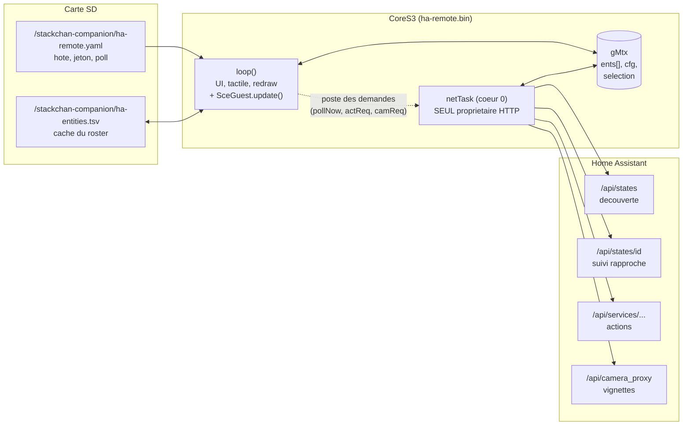
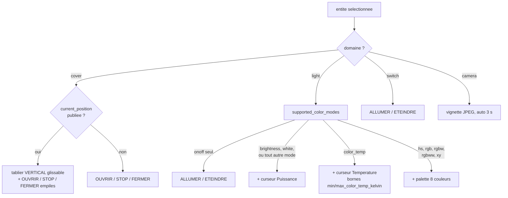
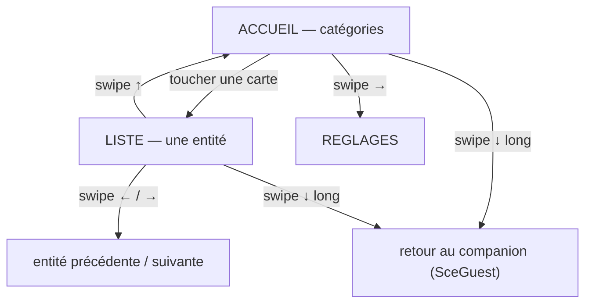
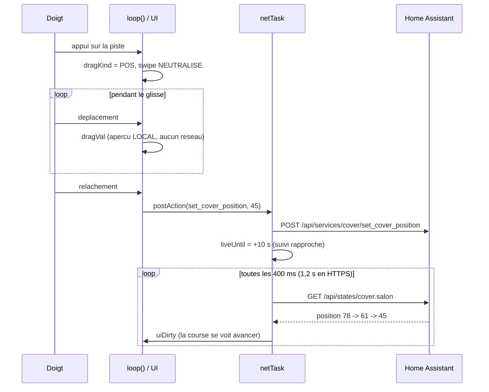
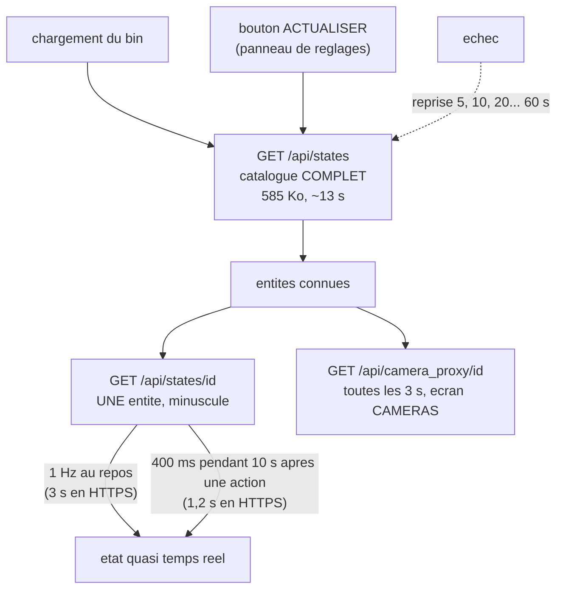
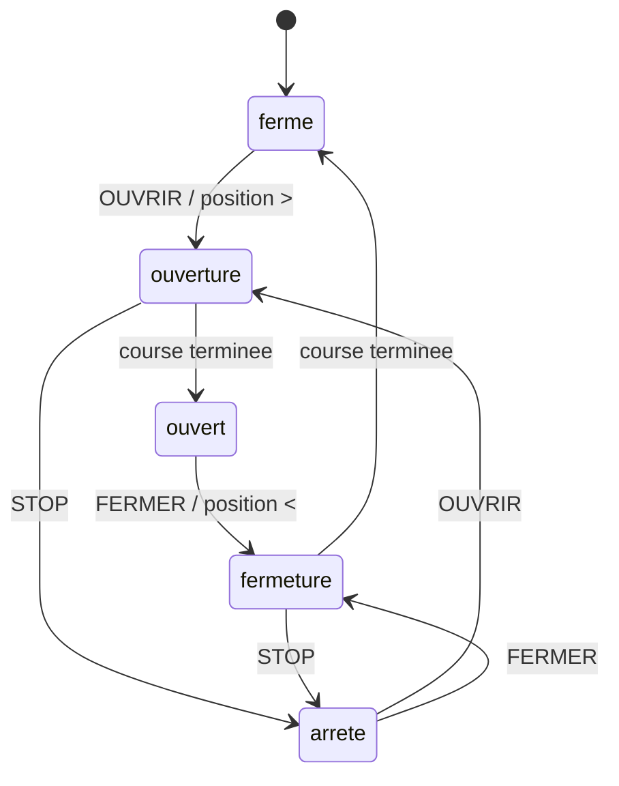

> [English](HA-REMOTE.md) · **Français** — l'anglais est la version de référence.
> Ce fichier peut être en retard d'une mise à jour : en cas de divergence, l'anglais fait foi.

# ha-remote — télécommande Home Assistant (bin invité)

> ⚠ **Ne pas confondre avec [`docs/integrations/HOMEASSISTANT.md`](../integrations/HOMEASSISTANT.fr.md)**,
> qui décrit l'inverse : le firmware *companion* **exposé à** Home Assistant
> (HA pilote le robot). Ici le robot est le **client** — il lit les entités
> de HA et appelle ses services.

Bin invité (`firmware/ha-remote/`, env PlatformIO `ha-remote`) : une
télécommande domotique tenant dans l'écran du StackChan. Volets, lumières,
prises, caméras — sélection au doigt, action immédiate.

## Vue d'ensemble



`loop()` ne fait **jamais** d'HTTP : une requête bloque plusieurs
secondes et affamerait le serveur web de SceGuest et le tactile. Il pose
des drapeaux que netTask consomme — même contrat que `flight-radar`
(cf. [`../architecture/WORKFLOWS.md`](../architecture/WORKFLOWS.fr.md) pour
les mécanismes FreeRTOS communs).

## Ce qu'il fait

L'écran parle la langue que choisit la clé `lang`, comme tous les autres bins ;
les libellés cités ci-dessous sont ceux du français.

- **Écran d'accueil** : quatre cartes, chacune avec son **icône** tracée en
  primitives (volet à lames, ampoule, symbole marche/arrêt, boîtier caméra),
  son nom et un compteur **actifs / total** — `3/6` volets ouverts, lampes
  allumées, prises en marche. Un effectif seul ne dit rien de l'état de la
  maison, alors que c'est la question qu'on se pose en arrivant. Un mot seul
  oblige à lire ; une forme se reconnaît. Sous les cartes, l'**état de la
  liaison** avant les gestes : c'est la première chose qu'on veut savoir
  quand une commande ne part pas.
- **Écran de liste** : **une entité à la fois** (nom, état en clair,
  pastille de couleur), swipe **←/→** pour passer à la suivante, rail de
  pastilles indiquant la position dans la catégorie.
- **Volets** : commande calquée sur le **mouvement réel** — voir ci-dessous.
- **Caméras** : vignette JPEG rafraîchie automatiquement, nom dans l'en-tête.
- **Lumières** : `ALLUMER` / `ÉTEINDRE`, plus **puissance**,
  **température de blanc** et **couleur** (palette de 8 teintes) selon ce
  que la lampe sait faire.
- **Prises** : `ALLUMER` / `ÉTEINDRE`.

> **Pas d'action « tout fermer » côté robot** : Home Assistant a déjà la
> notion de **groupe** — une entité `cover.*` qui pilote les autres.
> Elle apparaît naturellement dans la liste et se manipule comme un
> volet. Dupliquer ce mécanisme ignorerait votre configuration.


### Le volet se commande comme il bouge

Un volet monte et descend. Sa position se lit et se règle donc
**verticalement**, et les trois commandes s'empilent dans l'ordre du geste :
un curseur horizontal obligerait à traduire mentalement le mouvement.

```
   Volet séjour
   ● ouvert
   ┌────────┐            ┌──────────────┐
   │▓▓▓▓▓▓▓▓│            │  ▲  OUVRIR   │
   │▓▓▓▓▓▓▓▓│            ├──────────────┤
   ├────────┤   75 %     │  ■  STOP     │
   │        │  glisser   ├──────────────┤
   │        │            │  ▼  FERMER   │
   └────────┘            └──────────────┘
```

Les trois commandes sont **jointives**, séparées d'un simple trait, et la
pile occupe toute la hauteur utile (76 → 220 px) : un écart entre boutons
n'apporte rien et rétrécit des cibles qu'on vise au doigt.
Le rail d'entités disparaît sur cet écran : l'en-tête affiche déjà le rang.

Le bloc de gauche est une **fenêtre vue de face** : le tablier descend
depuis le haut, lames comprises, et un trait marque son bord courant.
100 % = ouvert (rien ne masque), 0 % = fermé. On le **glisse verticalement**
pour viser une mi-course ; comme pour les lampes, la valeur suit le doigt en
local et le service n'est appelé qu'au relâchement.

Les flèches donnent le sens **avant même** qu'on lise le mot — c'est ce qui
permet d'agir sans lire.

### La lampe s'adapte à ce qu'elle sait faire

Une lampe simple, une variable et une RVB n'ont pas les mêmes commandes, si
bien que des positions figées laisseraient de grands vides sur les premières
et tasseraient les dernières. Les blocs **s'empilent** donc selon les capacités
(`lightRows()`), et cette table est lue par le dessin **et** par le test
tactile — seule façon qu'ils ne divergent pas.

Les pastilles de couleur font **34×30** : une cible de 22 px se rate au doigt.
Le repère de sélection est un cercle **intérieur**, un liseré extérieur se
perdant contre les pastilles voisines.

**Un seul bouton** d'alimentation, qui propose la seule action utile :
`ÉTEINDRE` si la lampe est allumée, `ALLUMER` sinon. Offrir « allumer » à
une lampe déjà allumée n'est que du bruit, et la pleine largeur double la
surface à viser. Sa position, elle, ne bouge pas d'une lampe à l'autre —
c'est le geste le plus fréquent.

### Les contrôles suivent les CAPACITÉS, pas les valeurs

L'écran n'affiche que ce que l'entité **sait faire**, et cette question se
lit dans `supported_color_modes`, jamais dans la présence d'une valeur.
La différence n'est pas théorique : une lampe éteinte cesse de publier sa
luminosité. Déduire la capacité de la valeur fait donc disparaître le
curseur au moment précis où l'on veut rallumer en douceur — et, dans
l'autre sens, offre une palette à une lampe monochrome, dont Home
Assistant rejette ensuite le service.



Un volet reste le cas à part : `cover` n'a pas d'équivalent de
`supported_color_modes`, donc la présence de `current_position` fait
office de déclaration de capacité.

## Gestes



## Panneau de réglages (swipe →)

Depuis l'**accueil**, un glissé vers la droite ouvre les réglages — **même
geste et même seuil (60 px) que `flight-radar`**. Un bin invité ne réinvente
pas sa gestuelle, sinon chacun s'apprend séparément.

| Réglage | Forme |
|---|---|
| Luminosité | curseur 10-255, aperçu **live** |
| Re-découverte automatique | curseur 0-3600 s, `0` affiché « jamais » |
| **ACTUALISER (n)** | bouton — relit le catalogue MAINTENANT, affiche le nombre d'entités connues, passe à « LECTURE... » pendant la relecture |
| Liaison | bascule HTTP simple / HTTPS |

`ACTUALISER` est le pendant **manuel** de la re-découverte automatique : les
deux sont voisins parce qu'ils font la même chose, l'un sur demande, l'autre
au temps. C'est une **commande**, pas une valeur : elle part tout de suite,
sans attendre `OK`. Le reste du panneau, lui, n'écrit que les champs
réellement modifiés : écrire les trois systématiquement annulerait une saisie
faite entre-temps sur `/config`.

L'**hôte** et le **jeton** n'y sont pas : un jeton Home Assistant fait
environ 180 caractères, il ne se saisit pas au doigt. Le panneau **affiche
donc l'adresse de la page web** plutôt que de prétendre les proposer.

Deux points d'implémentation qui ne sont pas des détails :

- le panneau est **bloquant** (boucle modale), donc il ne peut pas être
  ouvert depuis le gestionnaire tactile — celui-ci tient `gMtx`, et la
  modale gèlerait `netTask` jusqu'à 90 s. Le geste pose un drapeau,
  `loop()` ouvre le panneau **hors verrou** ;
- il prend le geste de sortie à SceGuest le temps de son affichage
  (`setSwipeExit(false)`), comme le fait `flight-radar`.

Le **swipe bas** reste réservé à `SceGuest` (retour au companion) sur tous
les écrans : c'est une sortie que l'app ne doit jamais capturer.

## Cycle d'une action

Le point délicat : un curseur suit le doigt, mais **n'appelle le service
qu'au relâchement**. Un appel par frame saturerait l'installation.



## Rythme de rafraichissement

Le principe : **le catalogue complet ne sert qu'à la découverte**, l'état
courant se lit entité par entité.



Le sondage complet du catalogue ne part **qu'à la demande** : il dure une
quinzaine de secondes sur une installation réelle et `netTask` possède les
sockets, donc un sondage périodique bloquerait commandes et relectures d'état
pendant toute cette fenêtre — gros décalage entre l'appui et l'action, position
figée après une fermeture, commandes perdues.

Trois règles en découlent :

- **pas de sondage complet après une action** : seul le suivi rapproché de
  l'entité affichée est armé (400 ms pendant 10 s) ;
- **file d'actions de 8 places** plutôt qu'un emplacement unique : avec une
  seule place, chaque nouvel appui écrase le précédent quand `netTask` est
  occupée ;
- **l'appui préempte la découverte** : si une action est en attente, le
  téléchargement du catalogue est abandonné en cours et repris plus tard.
  L'utilisateur passe avant le travail de fond.

**Le suivi rapproché est ralenti en HTTPS** (1,2 s au lieu de 400 ms, 3 s au
lieu d'une seconde au repos) : chaque requête refait une poignée de main TLS,
qui coûte une quarantaine de kilo-octets de tas interne et plusieurs centaines
de millisecondes. À 2,5 Hz ce tas s'effondre et la découverte complète échoue à
son tour — la fluidité ne vaut pas la stabilité de la liaison.

`poll_s` est l'intervalle de **re-découverte automatique**, `0` par défaut =
jamais. Une découverte qui échoue est malgré tout **reprise** avec un recul
croissant (5, 10, 20… 60 s) : sans périodicité sur laquelle se rattraper, un
premier essai raté sur un WiFi faible laisserait le bin à zéro entité
indéfiniment.

### Le roster survit au redemarrage

La decouverte coute une quinzaine de secondes et des centaines de kilo-octets,
et tant qu'elle n'a pas abouti l'ecran d'accueil compte **zero de tout** — a
chaque demarrage, sur un appareil dont tout l'interet est d'etre attrape et
presse.

Or ce qu'elle decouvre ne bouge presque pas : identifiants, noms conviviaux,
categories et capacites changent quand on ajoute une lampe, pas entre deux
matins. Cette moitie durable est donc ecrite dans
`/stackchan-companion/ha-entities.tsv` et relue au demarrage. Le tableau est a
l'ecran en une seconde.

**Les etats sont volontairement laisses vides.** Un `on` d'hier presente comme
courant serait le seul mensonge que ce bin ne doit pas dire — c'est aussi ce sur
quoi l'utilisateur agit. Le sondage par entite les remplit dans la seconde, et
la decouverte complete tourne quand meme derriere et remplace le tableau en
entier : une entite reellement disparue se corrige dans les quinze secondes
habituelles.

Separe par tabulations, parce qu'un nom convivial est du texte libre saisi par
l'utilisateur et peut fort bien contenir un point-virgule ou une virgule. Les
identifiants sont revalides contre la table de domaines courante au chargement
plutot que crus : une carte venue d'une version qui gere d'autres domaines ne
doit pas asseoir une entite que rien ici ne sait commander.

## Plus d'entités que de places

La table tient **64 entités**, toutes catégories confondues (~5,5 Ko), et une
installation réelle en sert plusieurs centaines. Lesquelles restent est une
**décision**, pas la conséquence d'un ordre d'arrivée. Remplir jusqu'à ras bord
perd ce que `/api/states` sert en dernier : une installation qui sert quatre
cents `light.*` avant son premier `cover.*` afficherait **zéro volet**, et
l'accueil annonce ce zéro avec exactement l'aplomb qu'il met à annoncer un
vrai zéro.

Le critère vit dans `firmware/ha-remote/entsel.h` — pur, sans Arduino, sans
JSON, et testé nativement par `test/test_entsel` (22 cas). Il n'utilise que ce
que le bin sait déjà au moment de la découverte : aucune requête de plus, aucun
champ de plus.

| Rang | Règle | Pourquoi |
|---|---|---|
| 1 | **Épinglée** : nommée dans `entities:`, **et l'entité affichée à l'écran** | le choix de l'utilisateur prime sur toute heuristique, et ce qui est sous le doigt ne doit pas disparaître parce qu'un sondage est arrivé |
| 2 | **Répondante avant indisponible** | une entité `unavailable` / `unknown` ne peut être ni affichée (pas d'état) ni commandée (l'appel de service échoue). Elle reste listée tant qu'il y a de la place, et cède sa place la première |
| 3 | **Part égale par catégorie**, restes redistribués | l'accueil, ce sont quatre cartes avec quatre compteurs ; une catégorie vidée par la troncature transforme ces compteurs en affirmations fausses. Quatre volets parmi neuf cents lumières survivent |
| 4 | À l'intérieur d'un couple (catégorie, rang), **l'ordre de Home Assistant** | il est stable d'un sondage à l'autre, donc les mêmes entités reviennent aux mêmes rangs et l'entité affichée est retrouvée |

### Ce que l'on voit quand ça tronque

Jamais un « 64 entités » sec — cette phrase est vraie de la liste et fausse de
la maison. Le manque est énoncé à cinq endroits, pour être rencontré là où la
question se pose :

- **en-tête de l'accueil** : `64 sur 213` au lieu de `64 entites` ;
- **sur chaque carte de l'accueil** : un `+9` rouge dans le coin haut droit — le
  compte dessiné en dessous est celui qu'on lirait sinon comme « combien de
  volets je possède » ;
- **en-tête de liste** : `3/12 +9`, parce que glisser jusqu'à la dernière carte
  est exactement le moment où l'on conclut « voilà, c'est tout » ;
- **une catégorie vide** : `9 non chargees - liste trop longue (reglages)` et
  non « aucune entité dans cette catégorie », qui est la seule phrase que la
  troncature ne doit jamais faire dire à l'écran ;
- **panneau de réglages** (swipe →) : le bouton indique `ACTUALISER (64/213)` et
  `9 ecartees` s'affiche à côté, dans le panneau qu'on ouvre justement pour
  demander si la liste est complète.

Le port série ajoute le détail par catégorie, qui ne tient pas à l'écran :

```
[ha] TRONQUE : 149 entites ecartees (volets:0 lumieres:149 prises:0 cameras:0)
     - epingler celles qui comptent avec la cle 'entities'
```

### Épingler ce qui compte

`entities:` prend des identifiants séparés par des **virgules ou des
points-virgules**, espaces tolérés. Un jeton correspond en **préfixe**,
délibérément : `light.` épingle un domaine entier et `cover.salon` épingle
`cover.salon` en même temps que `cover.salon_2` — exiger des identifiants exacts
voudrait dire en taper quarante pour dire « mes volets comptent ». La
comparaison ignore la casse.

```yaml
entities: "cover., light.cuisine, camera.portail"
```

La clé s'édite depuis la page web du bin (`http://<ip>/config`), là où l'on
arrive juste après que l'écran a dit combien d'entités ont été écartées. Plus
d'entités épinglées que de places n'est pas une erreur : elles se partagent les
64 entre elles, équitablement par catégorie, et rien d'autre n'entre — les
compteurs disent toujours combien il en manque.

## Configuration

`/stackchan-companion/ha-remote.yaml` — éditable depuis la console du companion
(gestionnaire de fichiers, catégorie « guest ») **ou depuis la page web du
bin** (`http://<ip>/config`, formulaire rendu par SceGuest).

| Clé | Défaut | Rôle |
|---|---|---|
| `host` | — | IP ou nom d'hôte de Home Assistant |
| `port` | 8123 | port HTTP |
| `ssl` | 0 | 1 = https (**certificat non vérifié** : usage LAN) |
| `token` | — | jeton d'accès **longue durée** |
| `poll_s` | 0 | re-découverte automatique en secondes, **0 = jamais** (démarrage + bouton ACTUALISER des réglages) ; plage 0..3600 |
| `brightness` | 100 | rétroéclairage (10..255). Le bouger, c'est reprendre la main : cela désactive `auto_bright` |
| `auto_bright` | 0 | suit la lumière ambiante (LTR-553), même courbe que les deux autres bins. **À 0 là où ils sont à 1** — c'est nouveau ici, sur un écran tenu en main, et une télécommande qui se met à baisser toute seule le jour d'une mise à jour est un changement que personne n'a demandé. Le capteur est SONDÉ au démarrage : sur une carte qui n'en a pas, l'option ne peut pas ne rien faire en silence |
| `entities` | — | entités **gardées en premier** quand il y en a plus de 64 (§ *Plus d'entités que de places*) : séparées par des virgules, correspondance en **préfixe** (`cover.` = le domaine entier), casse ignorée, 191 caractères |

### Obtenir le jeton

Dans Home Assistant : **votre profil** → onglet *Sécurité* → bas de page,
**« Jetons d'accès de longue durée »** → *Créer*. Copiez-le
immédiatement, HA ne le réaffiche jamais.

Le jeton est **quoté** dans le yaml (il contient des points, des tirets et
parfois un `=` final) : le parseur ne coupe au `#` que hors guillemets.

> Ce jeton donne un accès complet à votre domotique. Il vit sur la carte SD
> et transite en clair si `ssl: 0` — n'utilisez ce bin que sur votre réseau
> local, et pensez à protéger la page `/config` (elle reprend le mot de
> passe de la console du companion, cf. `docs/guests/README.md § Authentification`).

Dans le formulaire web, le jeton est déclaré en **`Secret`** : la page ne
le réaffiche jamais, le champ part vide et un envoi vide signifie
« inchangé ». Il faut donc le recoller pour le changer — c'est le prix à
payer pour qu'un simple affichage de la page ne le divulgue pas à qui la
charge. Pour le **révoquer**, saisir un tiret seul (`-`). Si aucun mot de
passe ne protège la page, elle le signale en tête.

## Architecture

La même ossature que celle de `flight-radar` :

- **`netTask`** (cœur 0, pile 20 Ko — l'analyse JSON est récursive et le
  lecteur tamponné ajoute son propre kilo-octet) est le **seul** à ouvrir des
  sockets. Une requête HTTP bloque plusieurs secondes ; dans `loop()` elle
  affamerait le WebServer synchrone de SceGuest et le tactile.
- **`loop()`** fait l'UI, le tactile, le redraw et les écritures SD. Il ne
  fait **jamais** d'HTTP : il *poste* des demandes (`pollNow`, `actReq`,
  `camReq`) que netTask consomme.
- Partage sous `gMtx`, drapeaux volatiles pour les demandes. Le verrou est
  **récursif** : un geste tactile se déroule d'un bout à l'autre sous
  verrou tout en appelant `postAction()`, qui le prend aussi. Sans cela,
  netTask peut réécrire `ents[]` entre le moment où le doigt désigne une
  entité et celui où l'ordre part — appuyer sur `FERMER` pour le volet du
  salon fermerait celui de la chambre.
- Un glissé mémorise l'**identifiant** de l'entité saisie et l'abandonne si
  elle n'est plus sous le doigt au relâchement : sinon un glissé interrompu
  s'applique à l'entité suivante.
- La configuration est **recopiée sous verrou** avant chaque requête. La
  lire champ par champ expose netTask à un hôte neuf avec un jeton à
  moitié copié — c'est-à-dire à envoyer un identifiant tronqué à une
  machine inattendue.
- Les documents JSON sont alloués en **PSRAM**, y compris pour le suivi
  d'une seule entité. Le heap interne est partagé avec WiFi et TLS : y
  allouer des dizaines de kilo-octets plusieurs fois par seconde le
  fragmente jusqu'au `NoMemory`, et l'entité cesse alors de se rafraîchir
  sans rien signaler. Un **filtre ArduinoJson commun aux deux sondages** ne
  retient que les champs utiles — sans lui, l'`effect_list` d'une lampe
  WLED ou la liste des membres d'un groupe passe dans le tas toutes les
  400 ms.
- **64 entités** au maximum, toutes catégories confondues (~5,5 Ko). Au-delà,
  LESQUELLES restent est décidé par `entsel.h` et ce qui a été écarté est dit à
  l'écran (§ *Plus d'entités que de places*). La découverte parcourt le document
  analysé **deux fois** — une fois pour la demande, une fois pour l'admission —
  parce que les quotas ont besoin des totaux et que les totaux ne sont connus
  qu'à la fin du premier parcours ; re-parcourir un document déjà en PSRAM
  n'alloue rien.
- Les vignettes caméra sont téléchargées en PSRAM (150 Ko max) puis
  rendues par `drawJpg`.

### netTask se gare avant le retour du companion

Revenir au companion, c'est le reflasher, et un reflash qui se dispute le tas
interne avec une session TLS vivante peut perdre la **seule** route de retour.
`netTask` est donc arrêtée **coopérativement** — jamais suspendue, ce qui
gèlerait quiconque attend `gMtx` si le flash venait à échouer — par le
`sce::CoopStop` commun du contrat invité (cf. [`README.fr.md`](README.fr.md),
§ *Intégration dans votre projet*) : `shouldPark()` en tête de la boucle de la
tâche, `stopping()` dans chaque aide HTTP *et* dans la boucle d'attente du
lecteur de corps, pour qu'une chaîne de requêtes déjà lancée s'arrête au lieu de
survivre à la demande qui l'a ouverte.

La fenêtre d'acquittement est de **20 s**, taillée sur la plus longue requête
unitaire de ce bin : 3 s pour se connecter plus 8 s de lecture. La borne de
lecture est un délai **par lecture**, pas un budget de requête — un corps qui
arrive au compte-gouttes sur un WiFi faible la ré-arme à chaque bloc, et c'est
pourquoi la fenêtre est généreuse plutôt qu'égale à la somme des deux. Attendre
vingt secondes ne coûte rien à côté d'un reflash manqué. SceGuest lève l'arrêt
avant `updateFromFS` et appelle `release()` si le reflash échoue, de sorte que
la télécommande repart au lieu de rester à moitié morte.

## États d'un volet



Les états intermédiaires (`ouverture…`, `fermeture…`) durent plusieurs
secondes : c'est exactement la fenêtre que le suivi rapproché rend
visible, avec la position qui défile.

## Limites connues

- Les `scene`, `script` et `climate` ne sont pas listés — seuls les
  quatre domaines ci-dessus. Les **groupes** apparaissent, eux, comme des
  entités ordinaires de leur domaine.
- La palette propose 8 teintes fixes ; il n'y a pas de roue chromatique
  ni de saisie de teinte libre.
- Les curseurs envoient leur valeur **au relâchement** : le retour visuel
  suit le doigt, l'appareil bouge une fois le doigt levé.
- Les états affichés datent du dernier sondage (`poll_s`) ; une action
  déclenche un re-sondage immédiat, mais un volet met plusieurs secondes à
  atteindre sa position finale et passera par `ouverture…` / `fermeture…`.
- Le certificat n'est pas vérifié en `ssl: 1` : cela protège de l'écoute
  passive, pas d'un intermédiaire actif. Réservez à un réseau de confiance.
