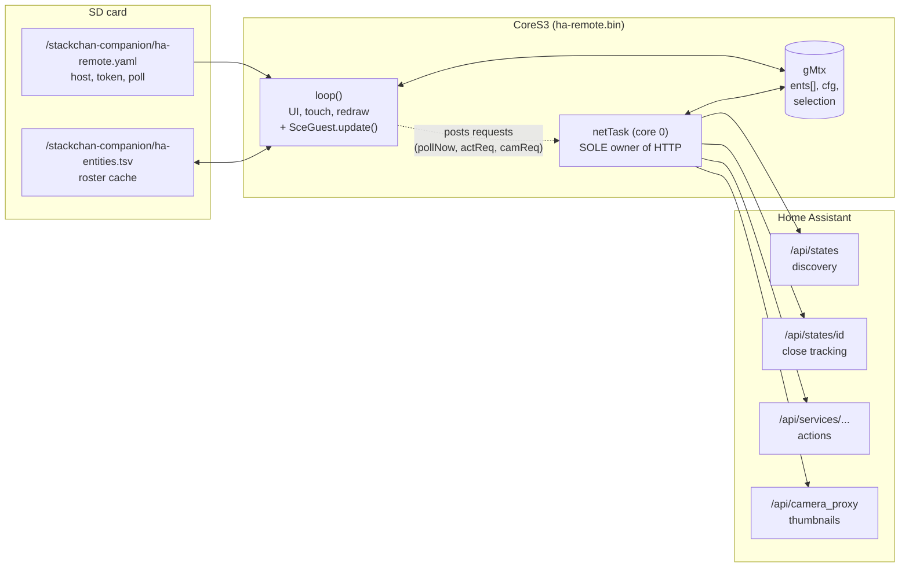
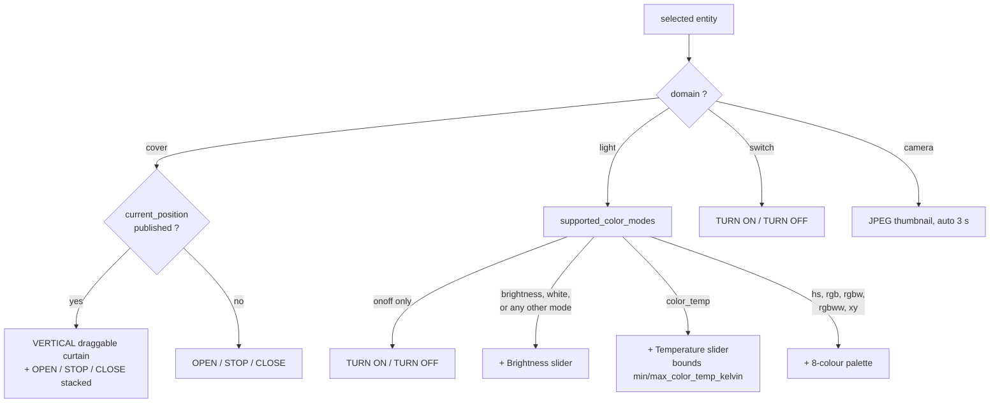
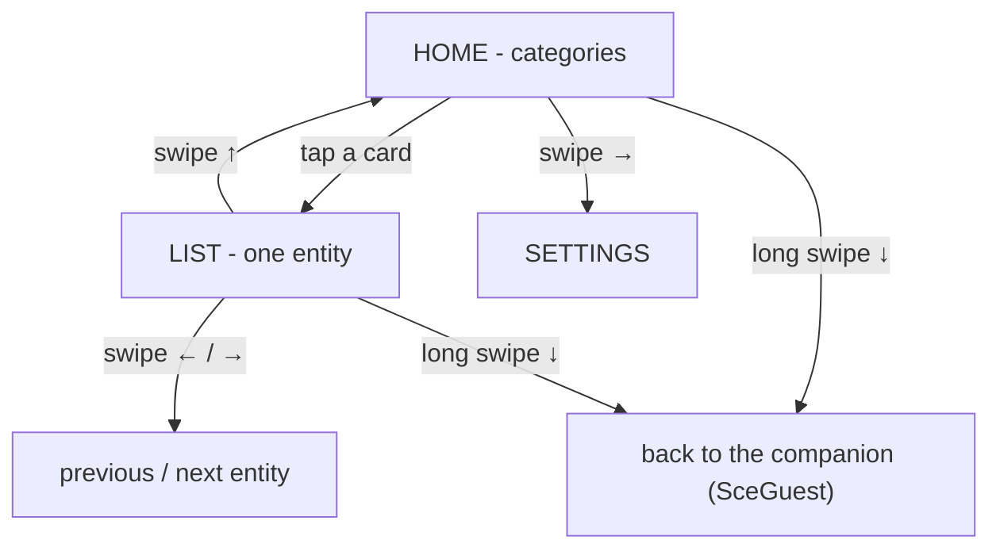
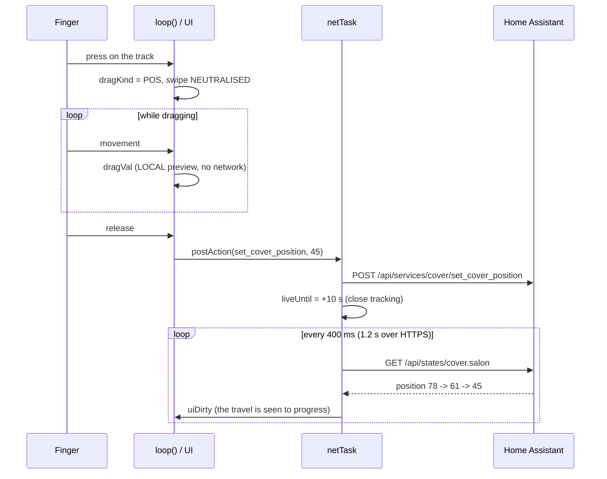
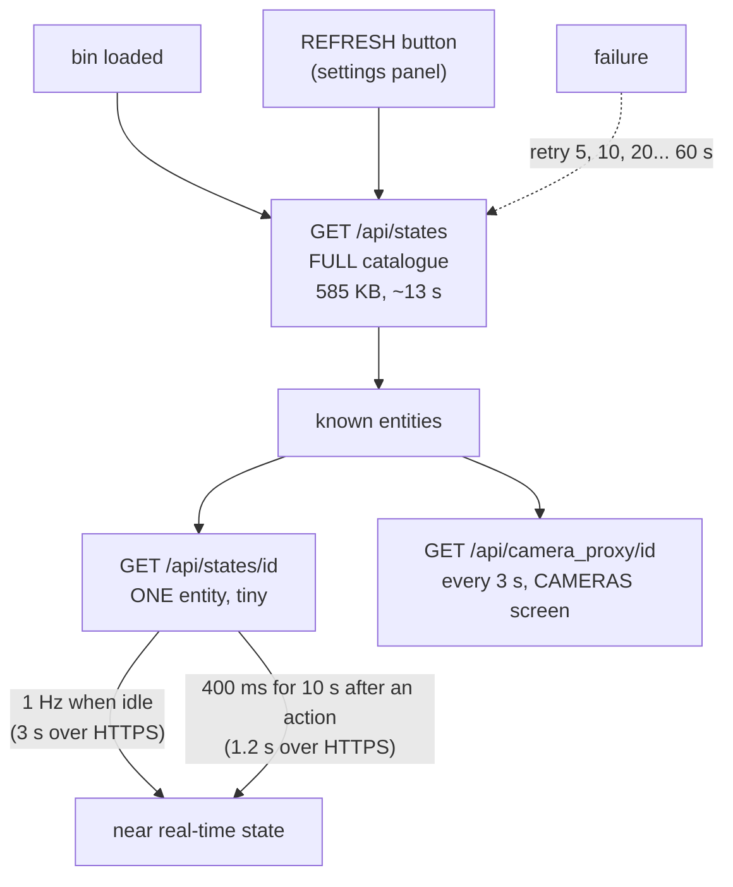
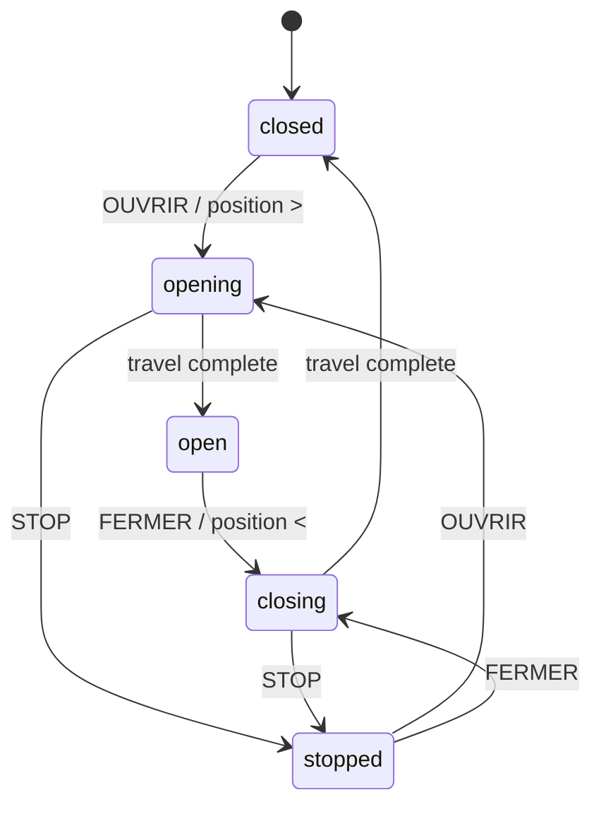

> **English** · [Français](HA-REMOTE.fr.md)

# ha-remote — Home Assistant remote control (guest bin)

> ⚠ **Do not confuse this with [`docs/integrations/HOMEASSISTANT.md`](../integrations/HOMEASSISTANT.md)**,
> which describes the opposite direction: the *companion* firmware **exposed to**
> Home Assistant (HA drives the robot). Here the robot is the **client** — it reads
> HA's entities and calls its services.

Guest bin (`firmware/ha-remote/`, PlatformIO env `ha-remote`): a home-automation
remote control that fits in the StackChan's screen. Covers, lights, switches,
cameras — pick with a finger, act immediately.

## Overview



`loop()` **never** does HTTP: one request blocks for several seconds and would
starve SceGuest's web server and the touch input. It raises flags that netTask
consumes — the same contract as `flight-radar`
(see [`../architecture/WORKFLOWS.md`](../architecture/WORKFLOWS.md) for the
shared FreeRTOS mechanisms).

## What it does

The screen speaks the language the `lang` key selects, like every other bin;
the labels quoted below are the English ones.

- **Home screen**: four cards, each with its **icon** drawn in primitives
  (slatted cover, light bulb, on/off symbol, camera body), its name and an
  **active / total** counter — `3/6` covers open, lamps lit, switches on.
  A raw count says nothing about the state of the house, yet that is exactly the
  question you ask when you walk in. A word alone forces you to read; a shape is
  recognised. Below the cards, the **link status** comes before the gestures:
  it is the first thing you want to know when a command fails to go out.
- **List screen**: **one entity at a time** (name, plain-language state,
  coloured dot), swipe **←/→** to move to the next one, a rail of dots showing
  your position within the category.
- **Covers**: the control mirrors the **real movement** — see below.
- **Cameras**: JPEG thumbnail refreshed automatically, name in the header.
- **Lights**: `TURN ON` / `TURN OFF`, plus **brightness**, **white temperature**
  and **colour** (palette of 8 hues) depending on what the lamp can actually do.
- **Switches**: `TURN ON` / `TURN OFF`.

> **No "close everything" action on the robot side**: Home Assistant already has
> the notion of a **group** — a `cover.*` entity that drives the others. It shows
> up naturally in the list and is handled like any cover. Duplicating that
> mechanism would ignore your configuration.


### A cover is controlled the way it moves

A cover goes up and down. Its position is therefore read and set
**vertically**, and the three commands stack in the order of the gesture: a
horizontal slider would force you to mentally translate the movement.

```
   Living-room cover
   ● open
   ┌────────┐            ┌──────────────┐
   │▓▓▓▓▓▓▓▓│            │  ▲  OPEN     │
   │▓▓▓▓▓▓▓▓│            ├──────────────┤
   ├────────┤   75 %     │  ■  STOP     │
   │        │    drag    ├──────────────┤
   │        │            │  ▼  CLOSE    │
   └────────┘            └──────────────┘
```

The three commands are **contiguous**, separated by a single rule, and the stack
takes the whole usable height (76 → 220 px): gaps between buttons buy nothing
and shrink targets you aim at with a fingertip.
The entity rail disappears on this screen: the header already shows the rank.

The block on the left is a **window seen from the front**: the curtain comes down
from the top, slats included, and a line marks its current edge.
100 % = open (nothing masked), 0 % = closed. You **drag it vertically** to aim
for a mid-travel position; as with lamps, the value follows the finger locally
and the service is only called on release.

The arrows give the direction **before** you even read the word — that is what
lets you act without reading.

### The lamp adapts to what it can do

A plain lamp, a dimmable one and an RGB one do not have the same controls, so
fixed positions leave large gaps on the first kind and cram the last. The
blocks therefore **stack** according to the capabilities (`lightRows()`), and
that table is read by the drawing code **and** by the touch hit-test — the only
way they cannot drift apart.

The colour swatches are **34×30**: a 22 px target gets missed by a finger. The
selection marker is an **inner** circle, an outer outline being lost against
the neighbouring swatches.

**A single** power button, offering the only useful action: `TURN OFF` if the
lamp is on, `TURN ON` otherwise. Offering "turn on" to a lamp that is already on
is nothing but noise, and full width doubles the surface to aim at. Its position,
though, does not move from one lamp to the next — it is the most frequent gesture.

### Controls follow CAPABILITIES, not values

The screen only shows what the entity **can do**, and that question is answered
by `supported_color_modes`, never by the presence of a value.
The difference is not theoretical: a lamp that is off stops publishing its
brightness. Deriving the capability from the value therefore makes the slider
vanish at the exact moment you want to fade back on — and, the other way round,
offers a palette to a monochrome lamp, whose service Home Assistant then
rejects.



Covers remain the odd case out: `cover` has no equivalent of
`supported_color_modes`, so the presence of `current_position` acts as the
capability declaration.

## Gestures



## Settings panel (swipe →)

From the **home screen**, a swipe to the right opens the settings — **same
gesture and same threshold (60 px) as `flight-radar`**. A guest bin does not
reinvent its gestures, otherwise each one has to be learned separately.

| Setting | Form |
|---|---|
| Brightness | slider 10-255, **live** preview |
| Automatic re-discovery | slider 0-3600 s, `0` displayed as "jamais" (never) |
| **REFRESH (n)** | button — re-reads the catalogue NOW, shows the number of known entities, switches to `READING...` while re-reading |
| Link | toggle plain HTTP / HTTPS |

`REFRESH` is the **manual** counterpart of automatic re-discovery: the two sit
next to each other because they do the same thing, one on demand, the other on a
timer. It is a **command**, not a value: it goes out immediately, without waiting
for `OK`. The rest of the panel, on the other hand, writes only the fields that
were actually modified: writing all three systematically would cancel an entry
made meanwhile on `/config`.

The **host** and the **token** are not there: a Home Assistant token is about
180 characters long, it cannot be typed with a fingertip. The panel therefore
**displays the address of the web page** instead of pretending to offer them.

Two implementation points that are not details:

- the panel is **blocking** (modal loop), so it cannot be opened from the touch
  handler — that handler holds `gMtx`, and the modal would freeze `netTask` for
  up to 90 s. The gesture raises a flag, `loop()` opens the panel **outside the
  lock**;
- it takes the exit gesture away from SceGuest for as long as it is displayed
  (`setSwipeExit(false)`), just as `flight-radar` does.

The **downward swipe** stays reserved for `SceGuest` (back to the companion) on
every screen: that is an exit the app must never capture.

## Life cycle of an action

The delicate point: a slider follows the finger, but **only calls the service on
release**. One call per frame would saturate the installation.



## Refresh cadence

The principle: **the full catalogue is only for discovery**, the current state is
read entity by entity.



The full entity poll runs **on demand only**: it takes ~15 s on a real
installation and `netTask` owns the sockets, so a periodic poll would block
commands and state reads for that whole window — a large lag between the press
and the action, a position frozen after a close, and lost commands.

Three rules follow from that:

- **no full poll after an action**: only close tracking of the displayed entity
  is armed (400 ms for 10 s);
- **an 8-slot action queue** rather than a single slot: with one slot, each new
  press overwrites the previous one whenever `netTask` is busy;
- **a press pre-empts discovery**: if an action is pending, the catalogue
  download is abandoned mid-flight and resumed later. The user comes before
  background work.

**Close tracking is slowed down under HTTPS** (1.2 s instead of 400 ms, 3 s
instead of 1 s at rest): every request redoes a TLS handshake, which costs some
forty kilobytes of internal heap and several hundred milliseconds. At 2.5 Hz
that heap collapses and the full discovery fails in turn — smoothness is not
worth the stability of the link.

`poll_s` is the **automatic re-discovery** interval, `0` by default = never.
A discovery that fails is nevertheless **retried** with a growing backoff
(5, 10, 20… 60 s): with no periodicity to fall back on, a first attempt failing
on a weak WiFi would leave the bin at zero entities indefinitely.

### The roster survives the reboot

Discovery costs about fifteen seconds and hundreds of kilobytes, and until it
lands the home screen counts **zero of everything** — every boot, on a device
whose whole point is to be picked up and pressed.

Yet what it discovers barely moves: identifiers, friendly names, categories and
capabilities change when you add a lamp, not between two mornings. So that
durable half is written to `/stackchan-companion/ha-entities.tsv` and read back at
boot. The table is on screen in a second.

**The states are deliberately left blank.** A remembered `on` from yesterday,
shown as current, would be the one lie this bin must not tell — it is also the
thing a user acts on. The per-entity polling fills them within the second, and
the full discovery still runs behind it and replaces the table wholesale, so an
entity that has genuinely disappeared corrects itself within the usual fifteen
seconds.

Tab-separated, because a friendly name is free text a user typed and may well
contain a semicolon or a comma. Identifiers are re-validated against the current
domain table on load rather than trusted: a card carried over from a build
handling other domains must not seat an entity nothing here can command.

## More entities than seats

The table holds **64 entities**, all categories combined (~5.5 KB), and a real
installation serves several hundred. Which 64 stay is a **decision**, not the
side effect of an arrival order. Filling until full loses whatever
`/api/states` happens to serve last: an installation that serves four hundred
`light.*` before its first `cover.*` would show **zero covers**, and the home
screen announces that zero with exactly the confidence it announces a real one.

The criterion lives in `firmware/ha-remote/entsel.h` — pure, no Arduino, no
JSON, and tested natively by `test/test_entsel` (22 cases). It uses only what
the bin already knows at discovery time: no extra request, no extra field.

| Rank | Rule | Why |
|---|---|---|
| 1 | **Pinned**: named in `entities:`, **plus the entity currently on screen** | the user's own choice outranks every heuristic, and what is under the finger must not vanish because a poll landed |
| 2 | **Answering before unavailable** | an `unavailable` / `unknown` entity can neither be shown (no state) nor commanded (the service call fails). It stays listed while there is room, and is the first to yield its seat |
| 3 | **Equal share per category**, leftovers redistributed | the home screen is four cards with four counters; a category emptied by the truncation turns those counters into false statements. Four covers among nine hundred lights survive |
| 4 | Inside one (category, rank), **Home Assistant's own order** | it is stable from one poll to the next, so the same entities come back at the same ranks and the on-screen entity is found again |

### What you see when it truncates

Never a bare "64 entities" — that sentence is true about the list and false
about the house. The shortfall is stated in five places, so that it is met
wherever the question is asked:

- **home header**: `64 of 213` instead of `64 entities`;
- **each home card**: a red `+9` in its top-right corner — the count drawn
  underneath is the one that would otherwise be read as "how many covers I own";
- **list header**: `3/12 +9`, because swiping to the last card is exactly the
  moment one concludes "that is all of them";
- **an empty category**: `9 not loaded - list too long (see settings)` and not
  "no entity in this category", which is the one sentence the cap must never
  make the screen say;
- **settings panel** (swipe →): the button reads `REFRESH (64/213)` and
  `9 dropped` sits next to it, in the panel one opens precisely to ask whether
  the list is complete.

The serial port adds the breakdown, which does not fit on screen:

```
[ha] TRONQUE : 149 entites ecartees (volets:0 lumieres:149 prises:0 cameras:0)
     - epingler celles qui comptent avec la cle 'entities'
```

### Pinning what matters

`entities:` takes identifiers separated by **commas or semicolons**, spaces
tolerated. A token matches as a **prefix**, deliberately: `light.` pins a whole
domain and `cover.salon` pins `cover.salon` along with `cover.salon_2` —
requiring exact identifiers would mean typing forty of them to say "my covers
matter". The comparison is case-insensitive.

```yaml
entities: "cover., light.cuisine, camera.portail"
```

It is editable from the bin's web page (`http://<ip>/config`), which is where
one lands right after the screen has said how many entities were dropped. More
pinned entities than seats is not an error: they share the 64 among themselves,
fairly by category, and nothing else gets in — the counters still say how many
are missing.

## Configuration

`/stackchan-companion/ha-remote.yaml` — editable from the companion's console
(file manager, "guest" category) **or from the bin's own web page**
(`http://<ip>/config`, form rendered by SceGuest).

| Key | Default | Role |
|---|---|---|
| `host` | — | Home Assistant IP or hostname |
| `port` | 8123 | HTTP port |
| `ssl` | 0 | 1 = https (**certificate not verified**: LAN use) |
| `token` | — | **long-lived** access token |
| `poll_s` | 0 | automatic re-discovery in seconds, **0 = never** (startup + ACTUALISER button in the settings); range 0..3600 |
| `brightness` | 100 | backlight (10..255). Moving it takes the backlight back by hand: it turns `auto_bright` off |
| `auto_bright` | 0 | follow the ambient light (LTR-553), same curve as the other two bins. **OFF where they default it ON** — it is new here, on a screen held in the hand, and a remote that starts dimming by itself the day it is updated is a change nobody asked for. The sensor is PROBED at boot, so on a board without one the option cannot silently do nothing |
| `entities` | — | entities **kept first** when there are more than 64 (§ *More entities than seats*): comma-separated, **prefix** match (`cover.` = the whole domain), case-insensitive, 191 characters |

### Getting the token

In Home Assistant: **your profile** → *Security* tab → bottom of the page,
**"Long-lived access tokens"** → *Create*. Copy it immediately, HA never shows
it again.

The token is **quoted** in the yaml (it contains dots, dashes and sometimes a
trailing `=`): the parser only cuts at `#` outside quotes.

> This token grants full access to your home automation. It lives on the SD card
> and travels in the clear if `ssl: 0` — only use this bin on your local network,
> and remember to protect the `/config` page (it reuses the companion console's
> password, see `docs/guests/README.md § Authentication`).

In the web form the token is declared as a **`Secret`**: the page never displays
it again, the field arrives empty and an empty submission means "unchanged".
You therefore have to paste it again to change it — that is the price of making
sure that merely loading the page does not disclose it to whoever loads it.
To **revoke** it, enter a single dash (`-`). If no password protects the page,
it says so at the top.

## Architecture

The same skeleton as `flight-radar`'s:

- **`netTask`** (core 0, 20 KB stack — JSON parsing is recursive and the
  buffered reader adds a kilobyte of its own) is the **only** one to open
  sockets. An HTTP request blocks for several seconds; in `loop()` it would
  starve SceGuest's synchronous WebServer and the touch input.
- **`loop()`** handles the UI, the touch, the redraw and the SD writes. It
  **never** does HTTP: it *posts* requests (`pollNow`, `actReq`, `camReq`) that
  netTask consumes.
- Sharing under `gMtx`, volatile flags for the requests. The lock is
  **recursive**: a touch gesture runs end to end under the lock while also
  calling `postAction()`, which takes it too. Without that, netTask can rewrite
  `ents[]` between the moment the finger designates an entity and the moment the
  order goes out — pressing `FERMER` for the living-room cover would close the
  bedroom one.
- A drag remembers the **identifier** of the entity it grabbed and abandons it if
  that entity is no longer under the finger on release: otherwise an interrupted
  drag applies to the next entity.
- The configuration is **copied under the lock** before every request. Reading it
  field by field exposes netTask to a fresh host with a half-copied token — that
  is, to sending a truncated credential to an unexpected machine.
- The JSON documents are allocated in **PSRAM**, including for tracking a single
  entity. The internal heap is shared with WiFi and TLS: allocating tens of
  kilobytes there several times per second fragments it until `NoMemory`, and the
  entity then stops refreshing without saying anything. An **ArduinoJson filter
  shared by both polls** keeps only the useful fields — without it, a WLED lamp's
  `effect_list` or a group's member list goes through the heap every 400 ms.
- **64 entities** maximum, all categories combined (~5.5 KB). Beyond that, WHICH
  ones stay is decided by `entsel.h` and what was left out is stated on screen
  (§ *More entities than seats*). The discovery walks the parsed document
  **twice** — once for the demand, once for the admission — because the quotas
  need the totals and the totals are only known at the end of the first walk;
  re-iterating a document already in PSRAM allocates nothing.
- Camera thumbnails are downloaded into PSRAM (150 KB max) and then rendered by
  `drawJpg`.

### netTask parks before the companion comes back

Returning to the companion means reflashing it, and a reflash competing with a
live TLS session for the internal heap can lose the **only** road back. So
`netTask` is stopped **cooperatively** — never suspended, which would freeze
whoever waits on `gMtx` if the flash then failed — through the shared
`sce::CoopStop` of the guest contract (see
[`README.md`](README.md#coopstop-parking-a-background-task)): `shouldPark()` at
the head of the task loop, `stopping()` in every HTTP helper *and* inside the
body reader's wait loop, so a request chain already under way stops instead of
outliving the request that opened it.

The ACK window is **20 s**, sized on this bin's longest single request: 3 s to
connect plus 8 s of read. The read bound is a **per-read** delay, not a request
budget — a body arriving in dribbles over a weak WiFi rearms it on every block,
which is why the window is generous rather than the sum of the two. Waiting
twenty seconds costs nothing next to missing the reflash. SceGuest raises the
stop before `updateFromFS` and calls `release()` if the reflash fails, so the
remote resumes instead of staying half-dead.

## Cover states



The intermediate states (shown on screen as `ouverture…`, `fermeture…`) last
several seconds: that is exactly the window that close tracking makes visible,
with the position ticking by.

## Known limitations

- `scene`, `script` and `climate` are not listed — only the four domains above.
  **Groups**, on the other hand, appear as ordinary entities of their domain.
- The palette offers 8 fixed hues; there is no colour wheel and no free hue entry.
- Sliders send their value **on release**: the visual feedback follows the finger,
  the device moves once the finger is lifted.
- The states shown date from the last poll (`poll_s`); an action triggers an
  immediate re-poll, but a cover takes several seconds to reach its final
  position and will pass through `ouverture…` / `fermeture…`.
- The certificate is not verified with `ssl: 1`: that protects against passive
  eavesdropping, not against an active man in the middle. Keep it to a trusted
  network.
