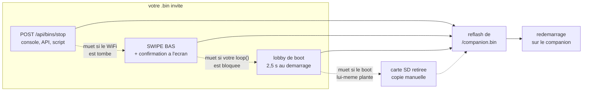
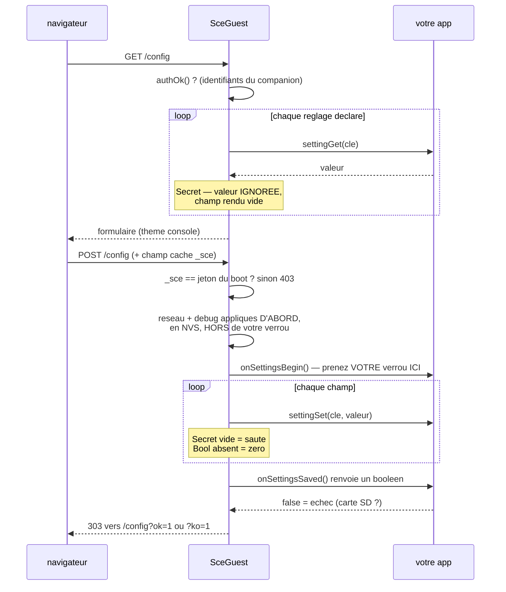
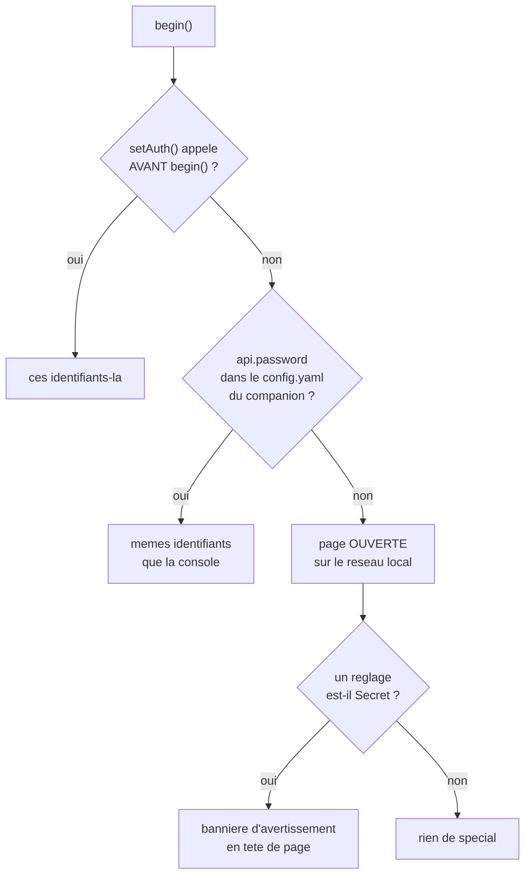

> [English](README.md) · **Français** — l'anglais est la version de référence.
> Ce fichier peut être en retard d'une mise à jour : en cas de divergence, l'anglais fait foi.

# Le contrat `SceGuest` — rendre un `.bin` tiers arrêtable à distance

`src/guest/SceGuest.h` n'est **pas compilé dans le firmware companion**.
C'est un header à copier dans le projet de votre propre `.bin` — celui que
vous lancez depuis le launcher SD (swipe bas) ou l'API `/api/bins/launch`.

## Le problème qu'il résout

Le launcher StackChan-Companion s'appuie sur
[M5Stack-SD-Updater](https://github.com/tobozo/M5Stack-SD-Updater) : il
flashe votre `.bin` depuis `/bins/*.bin` et redémarre. Une fois votre
programme lancé, le comportement standard de SD-Updater pour **revenir** au
firmware précédent est d'agir au boot suivant — il faut donc un accès
physique au robot.

`SceGuest` ajoute deux sorties qui n'en demandent pas : un endpoint HTTP
et un geste tactile. Le boot en garde une troisième, le **lobby**, qui
reste le seul recours quand votre app plante avant de pouvoir servir les
deux autres (§ Le lobby).

`SceGuest` ajoute un mini-serveur HTTP à VOTRE `.bin` dont l'endpoint porteur
ne fait qu'une chose : « reflashe `/companion.bin` et redémarre ». Ça permet
de piloter l'arrêt depuis la console web, l'API, ou n'importe quel autre agent
— sans toucher le robot. Une page d'accueil et une page de réglages
l'accompagnent.

### Les quatre chemins de retour, du plus commode au plus robuste

Chacun tombe en panne dans un cas où le suivant tient encore. C'est
l'intérêt d'en avoir quatre plutôt qu'un bon.



## Intégration dans votre projet

Dépendances PlatformIO/Arduino de votre `.bin` invité :

```ini
lib_deps =
    m5stack/M5Unified
    tobozo/M5Stack-SD-Updater
```

(`WebServer.h` et `SD.h` sont fournis par le core Arduino-ESP32, pas besoin
de les ajouter.)

```cpp
#include "SceGuest.h"

sce::SceGuest guest;

void setup() {
    M5.begin();
    // CoreS3 : broches SPI2 partagé LCD/SD À CONFIGURER avant SD.begin
    // (SCK=36, MISO=35, MOSI=37, CS=4) — sans ce SPI.begin le montage
    // échoue en silence, donc config.yaml n'est jamais lu. L'absence de
    // credentials ne donne ni connexion STA ni erreur : l'invité se
    // rabat sur son point d'accès.
    SPI.begin(36, 35, 37, 4);
    SD.begin(4, SPI, 15000000);
    // ... le reste de votre application ...

    String ip = guest.begin();
    // ip vide seulement si ni STA ni AP de secours n'ont démarré
}

void loop() {
    guest.update();             // traite les requêtes HTTP — non bloquant
    // ... le reste de votre boucle ...
}
```

**Si votre bin crée la MOINDRE tâche de fond, `sce::CoopStop` est
obligatoire.** `/api/bins/stop` (et le geste de sortie) reflashe
`/companion.bin` en ligne : pendant qu'`updateFromFS` lit la carte SD et écrit
la flash, tout ce qui tourne encore chez vous lui dispute le bus SD/SPI et le
tas. Un reflash d'environ 9 secondes devient des minutes de contention, HTTP
muet tout du long — et vu du réseau, un reflash qui dure des minutes est
indiscernable d'un plantage. `SceGuest` fournit l'implémentation unique ;
trois lignes suffisent :

```cpp
static sce::CoopStop netGuard;            // à côté des globaux de votre tâche

// en tête de boucle de la tâche — gare la tâche, ACK et cadence inclus :
if (netGuard.shouldPark()) continue;

// dans votre assistant HTTP — refuser d'OUVRIR quoi que ce soit pendant :
if (netGuard.stopping()) return false;

// setup() — fenêtre = votre PLUS longue requête isolée (connexion + lecture) :
netGuard.windowMs = 25000;
guest.netGuard = &netGuard;
```

| Membre | Contrat |
|---|---|
| `shouldPark()` | première instruction de la boucle de tâche. `true` = `continue` : l'ACK est publié et une cadence de 50 ms a déjà été servie. `false` = passage normal, et efface un ACK périmé |
| `stopping()` | en lecture seule, pour les assistants HTTP : refuser d'OUVRIR quoi que ce soit |
| `windowMs` | l'attente de l'ACK, **15000 ms par défaut**. Dimensionnez-la sur la PLUS longue requête isolée de votre bin (délais de connexion + lecture), pas sur une moyenne |
| `guest.netGuard` | le pointeur par lequel SceGuest appelle ; sans lui la garde n'est jamais armée |

`SceGuest` gare la tâche avant le reflash et **la libère si le reflash
échoue**, pour que votre invité reprenne vie au lieu de rester à moitié mort.
Le test `stopping()` dans l'assistant est ce qui empêche une *chaîne* de
requêtes de survivre à la fenêtre : `shouldPark()` seul borne une itération,
pas les trois requêtes que cette itération allait lancer. Si l'ACK ne vient
jamais, le reflash part quand même — la pression sur le tas est un risque,
perdre la seule route vers le companion en est un pire. Coopératif par
construction : jamais de `vTaskSuspend` sur une tâche qui peut tenir un mutex,
car un flash qui échoue ensuite laisse gelé pour de bon quiconque attend ce
mutex. `onBeforeStop` demeure pour tout ce que votre application doit *par
ailleurs* mettre au repos ; il s'exécute après que la garde a garé la tâche.

**Si votre bin monte la carte SD, surveillez-la avec `sce::SdWatch` plutôt
que de faire confiance à la réponse du démarrage pour toute la session.** Une
carte est une chose qu'un humain retire et remet : sans surveillance, une
carte insérée après le démarrage n'est jamais vue — vos réglages cessent
silencieusement de persister pour le reste de la session pendant que
`/config` continue de proposer de les sauvegarder — et une carte retirée
n'est pas remarquée non plus. Contrairement à `CoopStop`, elle n'est **pas**
vendorée dans `SceGuest.h` — copiez `firmware/common/SdWatch.h` à côté (il ne
dépend que de `<SD.h>` / `<SPI.h>`, aucun autre en-tête du projet).

```cpp
static sce::SdWatch sdWatch;

void setup() {
    // ... SPI.begin / SD.begin comme ci-dessus ...
    sdWatch.begin(sdOk, monBrochageCsSd, monHzSd);   // lui donner la réponse du boot
}

void loop() {
    if (sdWatch.update([] { /* relire ce qui a besoin de la carte */ })) {
        sdOk = sdWatch.mounted();
        // mettez à jour votre UI/pied de page ici — l'état vient de changer
    }
}
```

`update()` sonde à 3 s tant que la carte est présente (une simple ouverture de
répertoire, presque gratuite) et retente le montage à 10 s après un retrait,
avec un recul jusqu'à 60 s tant qu'aucune carte n'a jamais été vue durant
cette exécution — remonter bloque `loop()` dans un `SD.begin()` en échec
pendant des centaines de millisecondes, donc ce coût n'est payé que quand il
peut résoudre quelque chose. Le rappel optionnel s'exécute une fois, sur un
montage frais, la carte étant connue bonne : le moment de relire ce qui n'a
pas pu l'être au démarrage.

**WiFi** : `begin()` résout le réseau depuis quatre sources, la première qui
répond l'emporte.

| Rang | Source | Pourquoi elle est là |
|---|---|---|
| 1 | **NVS** — ce que quelqu'un a saisi sur `/config` | un acte délibéré sur CE robot l'emporte sur une carte qui peut nommer l'ancien réseau |
| 2 | `wifi.client_ssid` / `client_password` de `/stackchan-companion/config.yaml` | provisionnement : même fichier et même carte que le companion, écrire une fois et cloner |
| 3 | les arguments de `begin("MonSSID", "MonMotDePasse")` | le défaut compilé, pour une carte sans SD du tout |
| 4 | le point d'accès | le chemin de retour quand rien au-dessus n'a connecté |

Le point d'accès lui-même vient de `wifi.ap_ssid`/`ap_password` si la carte les
porte, sinon de l'AP de secours codé en dur **`SCE-Guest` / `goodlife`** sur
`192.168.4.1`, avec portail captif. Les paires STA et AP sont lues
indépendamment : une carte peut fournir l'une sans l'autre.

Le portail tient en deux mécanismes et lui faut les deux : un `DNSServer` qui
répond `192.168.4.1` à tout nom, et un `onNotFound` qui répond une **302 vers
`/config`**. C'est le second qui fait s'ouvrir une page toute seule — chaque
système sonde une URL qui lui est propre (`/generate_204`,
`/hotspot-detect.html`, `/connecttest.txt`, `/canonical.html`), aucune n'étant
une route ici, et un simple 404 laissait Apple afficher « Not found » dans sa
feuille de portail. Le gestionnaire n'est posé qu'**en mode AP** : sur un réseau
rejoint, une route absente reste absente au lieu de rediriger en silence.

Le rang 1 est celui qu'il faut lire deux fois, et il a sa propre section plus
bas ([Pas de carte](#pas-de-carte--nosdnotice) en est l'autre moitié) : **la NVS
survit à une carte absente et à un reflash**, et c'est ce qui permet d'apprendre
un réseau à un bin autonome. Comme le firmware companion, votre invité reste
ainsi toujours joignable.

## Endpoints exposés par l'invité

| Méthode | Route | Effet |
|---|---|---|
| `GET` | `/` | Page d'info avec un bouton « Retour au companion » — **redirige (302) vers `/config` quand il n'y a pas de companion vers lequel revenir** |
| `POST` | `/api/bins/stop` | Reflashe `/companion.bin` (doit exister sur la SD) puis `ESP.restart()` |
| `GET` `POST` | `/config` | Page de réglages — toujours présente, voir § Page de configuration web |

`/api/bins/stop` est strictement plus destructeur que le formulaire de
réglages, donc il est protégé lui aussi — mais **pas** par le jeton de
formulaire : la console, les scripts et les autres agents l'appellent et aucun
ne peut connaître un secret tiré au boot ; l'exiger casserait le pilotage à
distance qui est la raison d'être de cet en-tête. Il filtre sur l'en-tête
**`Origin`**. Un navigateur en envoie toujours un sur un POST cross-origin, un
client d'API n'en envoie aucun : absent signifie « ce n'est pas une page
piégée » et passe, présent et étranger vaut 403. Un `/companion.bin` absent ou
invalide répond 404 plutôt que d'entamer un reflash qui ne peut pas aboutir.

`/` n'existe que pour proposer UNE action : reflasher le companion. Sans
`/companion.bin` valide, ce bouton ne peut pas fonctionner, et le texte de la
page (« un invité tourne à la place du firmware companion ») décrit une
situation qui n'existe pas — trompeur plutôt qu'inutile. D'où la 302 : le
visiteur arrive sur la page qui, elle, peut encore agir. Le test est fait à
l'EXÉCUTION (`companionImageOk()`), pas sur un drapeau de compilation : un
CoreS3 dont la carte SD manque ou est morte est exactement dans la même
situation qu'une carte qui n'en a jamais eu.

### À quoi ressemble un retour, vu du dehors

`stopToCompanion()` répond `{"ok":true}` et ne se met au travail qu'*ensuite* :
la réponse HTTP prouve que l'ordre a été accepté, jamais que le reflash a
réussi. Suit une fenêtre pendant laquelle **le serveur web de l'invité est mort
alors que la pile réseau est toujours vivante** : `SceGuest` utilise le
`WebServer` *synchrone* du cœur Arduino, et `updateFromFS` occupe précisément
la boucle qui servirait une requête. lwIP continue de répondre au ping et les
SYN TCP restent sans réponse — la signature exacte d'un plantage, produite par
un bin qui fonctionne correctement. Attendre est la bonne conduite.

La console série à 115200 est le seul narrateur de cette fenêtre, aussi
`stopToCompanion()` imprime un jalon par étape :

| Étape | Ligne série |
|---|---|
| mise au garage des tâches | `[guest] retour companion : arret des taches...` |
| garée (ou pas) | `[dbg][task] garde reseau: garee en <n> ms` — et, si l'ACK n'est jamais venu, `[guest] ATTENTION : tache reseau non garee, reflash risque` |
| début du reflash | `[guest] taches arretees en <n> ms ; reflash de /companion.bin (<n> octets) - HTTP muet jusqu'au redemarrage` |
| échec seulement | `[guest] ECHEC updateFromFS apres <n> ms` |

Lisez-les comme un budget. Le temps de garage, c'est votre `windowMs` qui se
comporte (ou non), et le nombre d'octets annoncé est ce qui rend un silence
interprétable : une image de 1,7 Mo représente quelques secondes de travail, et
une durée très supérieure signifie que quelque chose dispute encore le bus SD.
Le succès n'a pas de ligne de clôture — la puce redémarre sur le companion à la
place. Une ligne `ECHEC` signifie que le flash a échoué, que la garde est
libérée, que l'invité continue de tourner, et que l'écran le dit.

### `appName` — nommez votre application

```cpp
guest.appName = "flight-radar";   // AVANT begin()
```

Nomme l'onglet du navigateur et la carte d'accueil. Donnez-lui le **nom du
bin** — le même que celui du launcher et de la carte SD. « StackChan » désigne
l'HÔTE et non ce que l'on configure : avec deux bins invités installés, deux
onglets et deux favoris seraient indiscernables.

Laissé vide, les pages retombent sur « StackChan » (`shownName()`). Ce défaut
est volontaire : ce header se copie SEUL dans des projets tiers, et ajouter un
champ ne doit pas changer ce qu'une copie existante affiche.

## Geste de sortie universel : SWIPE BAS (actif par défaut)

`guest.update()` détecte aussi un **swipe vers le bas** (haut→bas, ≥ 100 px,
vertical dominant) → carte de confirmation à l'écran ([Non]/[Oui], timeout
8 s) → reflash `/companion.bin`. Symétrique du companion (où swipe bas =
launcher) : **tout bin invité se quitte au doigt**, sans réseau ni BtnA.

- Prérequis : l'app appelle `M5.update()` dans sa `loop()` (standard M5) —
  sinon le geste est simplement inerte.
- **Désactivable par les devs communautaires** si votre app veut garder tous
  les swipes pour elle :

```cpp
guest.setSwipeExit(false);   // actif par défaut — à appeler après begin()
```

- La détection est passive (un swipe n'est pas un `wasClicked`) : vos taps
  et boutons ne sont pas affectés.

Choix technique : `WebServer` synchrone du core Arduino (pas
`ESPAsyncWebServer`, contrairement au firmware companion) — zéro dépendance
supplémentaire pour seulement 2 endpoints, et pas besoin de gérer la
CommandQueue puisqu'il n'y a pas de Brain/Renderer à protéger côté invité.

## Le lobby : le filet de sécurité du boot

### À quoi il sert

Le lobby est une **fenêtre de quelques secondes au démarrage de votre
`.bin`**, AVANT que votre `setup()` ne prenne la main, pendant laquelle
l'utilisateur peut choisir de revenir au companion.

C'est la seule des trois sorties qui ne dépende **ni de votre code, ni du
réseau** :

| Sortie | Dépend de | Ne marche plus si… |
|---|---|---|
| `POST /api/bins/stop` | WiFi + `guest.update()` dans votre `loop()` | pas de réseau, ou votre app boucle sans appeler `update()` |
| Swipe bas long | `M5.update()` dans votre `loop()` + écran vivant | votre app plante, fige l'écran ou monopolise le tactile |
| **Lobby** | **rien — il tourne avant votre code** | la carte SD est absente |

D'où son intérêt : un invité qui plante dans son `setup()`, qui part en
boucle infinie, qui laisse le WiFi en échec ou qui casse le tactile
**reste récupérable sans USB**. Sans lui, le robot redémarrerait
indéfiniment dans un binaire mort et il faudrait le rebrancher.

C'est aussi ce qui rend honnête la promesse affichée par le launcher au
moment de lancer un `.bin` (« Retour : stop distant ou BtnA au boot »).

### Ce qu'il affiche

- **`[Companion]`** — reflashe `/companion.bin` et redémarre.
- **`[Continuer]`** — lance tout de suite votre app sans attendre.
- **Sans action** — votre app démarre à la fin du décompte (barre de
  progression sous la carte).

Pas de bouton « sauver le firmware » : dans un invité, l'action
correspondante de SD-Updater est inerte (`binFileName` est nul) — et si
elle ne l'était pas, elle écraserait `/companion.bin` avec le binaire
invité, c'est-à-dire l'unique filet de retour.

### Mise en place

```cpp
sce::SceGuest::applyLobbyTheme("mon-bin");   // AVANT checkSDUpdater()
if (sdOk) checkSDUpdater(SD, String("/companion.bin"), 2500, 4);
```

Sans cet appel, SD-Updater dessine SON habillage : sur CoreS3 il prend le
chemin *tactile*, dont les boutons occupent le milieu de l'écran et ne
passent pas par le callback de dessin, si bien qu'un thème partiel se pose
par-dessus. `applyLobbyTheme` remplace donc **l'écran d'attente entier**
(`setWaitForActionCb`) et pose les libellés, alignés sur le launcher du
companion : même fond noir, même titre cyan à filet dégradé, même carte de
verre, mêmes boutons arrondis.

2,5 s est un compromis : assez pour viser un bouton, assez court pour ne
pas peser sur chaque démarrage. La palette est **dupliquée** de
`src/app/Launcher.h` (synchro à la main) — `SceGuest.h` doit rester
copiable tel quel dans un projet tiers.

## Page de configuration web (optionnelle)

Régler une app au doigt sur 320 px est pénible, et sans cela chaque bin
invité écrit son propre serveur et son propre HTML. `SceGuest` rend le
formulaire : votre app **déclare** ses réglages et fournit deux
accesseurs — elle garde la propriété de son stockage.

```cpp
guest.addSetting("radius_nm", "Rayon (nm)", sce::SceGuest::Num, 10, 500);
guest.addSetting("api", "Source", sce::SceGuest::Choice, 0, 0,
                 "airplanes.live|adsb.lol|adsb.fi");
guest.addSetting("servo", "Tete pointee vers le vol", sce::SceGuest::Bool);

guest.settingGet = [](const char* k) -> String { /* lire votre config */ };
guest.settingSet = [](const char* k, const String& v) { /* l'écrire */ };
guest.onSettingsSaved = []() { /* persister, ré-appliquer */ };
```

- Types : `Num` (avec bornes), `Bool` (case à cocher), `Text`, `Choice`
  (liste `a|b|c`), `Secret`. 24 réglages maximum (au-delà : ignoré **avec
  un log** — flight-radar en déclare 16 à lui seul).
- **`Secret` pour tout identifiant** (jeton d'API, mot de passe). Sa valeur
  n'est **jamais réaffichée** : le champ part vide, et un envoi vide veut
  dire « inchangé ». Un `Text` réaffiche sa valeur dans l'attribut HTML —
  acceptable pour un rayon en milles nautiques, pas pour un jeton Home
  Assistant, qui ouvre toute l'installation à qui charge la page. Si votre
  app déclare un `Secret` alors qu'aucun mot de passe ne protège la page,
  celle-ci le dit en tête, en jaune, plutôt que de se bloquer : c'est aussi
  le seul chemin commode pour *saisir* le secret la première fois.

Le formulaire, de l'affichage à la persistance :


- La page vit sur `GET /config` (lien depuis l'accueil), au thème de la
  console ; `POST /config` applique puis appelle `onSettingsSaved`.
- **La page existe toujours**, même dans un bin qui ne déclare pas un seul
  réglage : son bloc Réseau, son interrupteur Debug et son pied de page
  d'identité appartiennent au cadre, et un bin autonome en a besoin précisément
  quand il n'a rien d'autre. Ce que `settingGet` conditionne, c'est uniquement
  VOTRE section — des réglages déclarés sans accesseur pour les lire ne sont
  pas rendus.
- **Les champs réseau et debug sont enregistrés AVANT la prise de votre
  verrou**, et en NVS plutôt que sur la carte. Ce ne sont pas vos réglages, et
  ils doivent survivre à un bin dont l'enregistrement échoue : quelqu'un qui
  vient de saisir un réseau sur un robot échoué ne doit pas le perdre parce
  qu'une écriture sans rapport sur une carte absente a rendu `false`.
- **Ce que `false` promet, et ce qu'il ne promet pas.** Les trois bins de ce
  dépôt répondent différemment, à dessein, et l'écart se voit côté utilisateur :
  `space` rend le résultat *synchrone* de son propre `saveConfig()`, donc une
  carte pleine produit réellement `?ko=1` ; `flight-radar` et `ha-remote` rendent
  `true` et confient l'écriture à `loop()`, parce que leur sauvegarde doit
  relâcher un verrou et ne doit pas bloquer un gestionnaire HTTP derrière du
  travail servo ou réseau. Ces deux-là annoncent donc un succès même si la carte
  refuse ensuite, à chaque fois, en silence.

  Aucune des deux formes n'est fausse — mais choisissez la vôtre délibérément.
  Si vous différez, dites-le sur la page ou assumez que « Enregistré » veut dire
  « accepté », et rappelez-vous qu'un réessai différé demande un **backoff** :
  `loop()` tourne toutes les quelques millisecondes et la SD partage le SPI2 avec
  l'écran, donc un réessai sans limite martèle le bus dont le renderer a besoin.

- `onSettingsBegin` / `onSettingsSaved` encadrent l'envoi : prenez-y
  **votre verrou une seule fois** plutôt qu'à chaque champ, sinon une
  tâche concurrente peut lire une config à moitié appliquée.
- `onSettingsSaved` retourne un **booléen** : `false` affiche « ÉCHEC de
  l'enregistrement » au lieu d'un « Enregistré » mensonger.

### Pièges HTML pris en charge pour vous

- Une case **décochée** n'est pas envoyée par le navigateur : SceGuest
  écrit `"0"` pour tout booléen absent.
- Une case **cochée** est envoyée `on` (et non `1`) : SceGuest pose un
  `value='1'` explicite, mais acceptez aussi `"on"` côté app — un `toInt()`
  naïf lit `"on"` comme 0 et applique « désactivé » à la bascule qu'on
  vient justement d'activer.
- Échapper toute valeur avant de l'interpoler dans la page de réglages : un
  réglage persisté contenant une apostrophe sortirait sinon de son attribut,
  et comme il est persisté il est rejoué à chaque affichage.
- Le formulaire de réglages porte un champ caché `_sce` et un POST qui ne
  l'a pas est rejeté : un corps vide se lirait sinon comme « toutes les
  cases décochées » (voir le premier point) et remettrait tous les booléens
  à zéro d'un coup.
- Un champ `Secret` **vide** ne vaut pas « efface » : comme la page ne
  réaffiche jamais sa valeur, enregistrer n'importe quel autre réglage
  effacerait sinon le jeton. Pour le **révoquer**, saisir un tiret seul
  (`-`) — c'est cette sentinelle qui rend la révocation possible sans
  démonter la carte SD.
- Ce champ caché est un **jeton anti-CSRF tiré au boot**, pas une constante.
  Une constante est reproductible : n'importe quelle page web ouverte par
  l'utilisateur pourrait l'envoyer en cross-origin et, en réécrivant `host`,
  faire partir le jeton domotique vers un serveur choisi par l'attaquant —
  sans même le connaître, puisqu'un `Secret` non fourni reste inchangé.
  Conséquence pratique : un formulaire laissé ouvert à travers un
  redémarrage du robot est refusé, il faut recharger `/config`.
- Déclarer `onSettingsBegin` **sans** `onSettingsSaved` est **refusé**
  (erreur 500 + log). Le verrou pris par la première n'a qu'un seul point
  de libération, la seconde ; une paire incomplète gèle le robot au premier
  enregistrement, sans autre recours qu'un redémarrage.

### Authentification

`begin()` reprend **automatiquement les identifiants de la console du
companion** — la section `api:` du même `config.yaml` que les credentials
WiFi. Le robot n'a qu'un seul mot de passe, celui que vous avez déjà posé
sur sa console ; l'invité ne durcit pas ce que le companion laisse
ouvert, et ne s'ouvre pas quand le companion protège.

```yaml
api:
  username: admin
  password: "monmotdepasse"   # vide = ouvert (defaut companion)
```

Pour imposer d'autres identifiants (bin distribué seul, sans companion) :

```cpp
guest.setAuth("admin", "autre");   // AVANT begin()
```

Sans mot de passe des deux côtés, la page reste **ouverte sur le réseau
local**. Posez-en un si vos réglages actionnent le matériel — ceux du
radar allument les servos — et **à plus forte raison si un réglage est un
`Secret`** : le jeton d'une installation domotique vaut bien plus que le
robot qui le détient.



### Réseau : la seule section que vous ne déclarez jamais

La page de réglages porte toujours un bloc **Réseau**, que votre bin déclare ou
non le moindre réglage à lui. Ce n'est pas un confort : un bin autonome — sur
une carte sans companion, souvent sans carte SD qu'il vaille la peine d'éditer —
n'a sinon aucun moyen d'apprendre quel réseau rejoindre, et un robot qui ne
peut pas joindre le réseau ne peut pas être joint pour qu'on le lui dise.

Les identifiants saisis là vont en **NVS**, pas sur la carte. Les deux supports
n'ont pas la même durée de vie, et c'est tout l'intérêt : la NVS survit à un
reflash de l'application, pas une carte SD ; une carte s'écrit une fois et se
clone sur dix robots, pas la NVS.

| Source | Rôle | L'emporte quand |
|---|---|---|
| **NVS** (cette page) | ce que quelqu'un a saisi sur CE robot | son SSID est non vide |
| `wifi:` de `/stackchan-companion/config.yaml` | provisionnement — écrire une fois, flasher souvent | pas de SSID en NVS |
| arguments de `begin("ssid", "pass")` | le défaut compilé | la carte ne porte rien |
| Point d'accès | le chemin de retour | rien au-dessus n'a connecté |

Un acte délibéré sur l'appareil l'emporte sur la carte. L'inverse — la carte
d'abord — signifie que le champ ne fait silencieusement rien sur tout robot dont
le `config.yaml` nomme encore l'ancien réseau, c'est-à-dire précisément le robot
devant lequel quelqu'un se tient. **L'oublier** efface la surcharge et rend la
main à la carte.

Le mot de passe suit la règle `Secret` (jamais réaffiché, vide = inchangé) avec
un ajout : **vide face à un SSID différent l'efface**. Reporter l'ancien mot de
passe sur un nouveau réseau garantit un échec qui ressemble à une faute de
frappe dans le nom.

Quand la connexion STA échoue, le point d'accès sert aussi un **portail
captif** : tout nom résout vers le bin, donc rejoindre le réseau ouvre la page
tout seul au lieu d'exiger une adresse que rien n'a affichée. `isAp()` et
`apSsid()` permettent à votre bin de dire à l'écran quel réseau rejoindre.

Un changement de réseau prend effet **au redémarrage suivant**. Se
réassocier à chaud couperait la connexion HTTP qui porte la requête : la page ne
pourrait jamais vous dire si cela a marché.

### Debug : la seconde section que vous ne déclarez jamais

Sous Réseau, la page de chaque invité porte une case **Debug** : la trace
série (`sce::trace`, `firmware/common/Trace.h`). Activée, le bin raconte
chaque étape sur le port série à 115200 — connexions réseau, lectures de
config, chaque tentative HTTP avec code et durée, écritures SD, mise au garage
des tâches. Elle s'applique **immédiatement** et persiste en **NVS**, pour la
même raison que l'override réseau : les moments qui exigent une trace sont ceux
où un reflash est indisponible ou détruirait la preuve. À l'exécution et non
par drapeau de compilation, pour la même raison.

Votre propre code rejoint la narration en appelant
`sce::trace::log("tag", ...)` — style printf, déjà conditionné (éteinte, le
coût est un test booléen par site d'appel).

| | |
|---|---|
| Étiquettes | `net`, `cfg`, `http`, `sd`, `ui`, `task` — une par sous-système, pour qu'une capture se grep proprement |
| Ligne | `[dbg][tag] +<uptime_ms> <texte>`, une ligne par évènement, en uptime plutôt qu'en heure murale car un invité peut n'avoir jamais vu NTP |
| Budget | 160 octets par ligne ; au-delà le texte est tronqué, il ne plante pas |

**Jamais de secret dans une ligne de trace.** La règle appartient à l'auteur, et
les bins livrés la tiennent par construction : une URL est journalisée coupée à
sa chaîne de requête, et un identifiant est rapporté présent ou absent, jamais
par sa valeur. Une trace est faite pour être collée dans un rapport de bug.

⚠ Les clés commençant par `_` sont **réservées** aux champs de formulaire du
cadre — `_sce` (le jeton anti-CSRF), `_wifi_ssid` / `_wifi_pass` /
`_wifi_forget`, `_dbg` et son marqueur de présence `_dbg_p`. `addSetting()`
refuse **toute** clé dont le premier caractère est `_`, pas seulement
celles-là, et le dit sur la liaison série : un réglage d'application entrant en
collision avec le formulaire réseau se manifesterait par un robot qui change de
réseau quand on enregistre une option sans rapport.

### Le pied de page d'identité : quel binaire répond

Le bas de `/config` porte une ligne — **nom de l'application · `sha` · slot OTA
· cause du démarrage**. Ce n'est pas décoratif. Cette page est à un bouton de
`/api/bins/stop`, qui reflashe `/companion.bin` par-dessus le firmware installé
en dernier, et un téléversement USB écrit UN slot OTA sans toucher l'`otadata`
qui décide du slot démarré. « Le flash a réussi » et « c'est ce qui tourne »
sont deux affirmations différentes ; seule cette ligne répond à la seconde.

| Champ | Ce qu'il dit | Comment le vérifier |
|---|---|---|
| nom | `appName`, à défaut `StackChan` | le bin que vous vouliez lancer |
| `sha` | les 8 premiers hex du SHA-256 de l'ELF | `sha256sum .pio/build/<env>/firmware.elf` — **reproductible**, donc soit il correspond à votre build, soit vous regardez un autre |
| slot | la partition OTA réellement démarrée (`app0`/`app1`) | distingue un téléversement USB tout neuf d'un slot déjà en place |
| démarrage | cause du reset : `poweron`, `sw`, `panic`, `task_wdt`, `brownout`… | `panic`, `task_wdt` et `brownout` signifient que la carte a planté, quoi qu'affiche l'écran maintenant |

Les quatre mêmes valeurs alimentent le `GET /api/firmware` du companion. Il n'y
a pas de date de compilation : la seule que l'exécution puisse offrir vient des
bibliothèques Arduino précompilées, elle répond donc une date antérieure de
plusieurs années au firmware — un champ qui a l'air de faire autorité et qui
est faux vaut moins que pas de champ.

## Pas de carte : `noSdNotice`

Un bin invité sans carte fonctionne quand même, et c'est bien le problème — il
fonctionne *autrement*, en silence. Les réglages saisis sur `/config`
s'appliquent puis disparaissent au redémarrage ; les caches sont perdus ; et ce
que le bin lit dans son yaml retombe sur un défaut compilé qui peut être faux
d'une façon que l'écran ne montre pas.

```cpp
if (!sdOk) {
    guest.noSdNotice([] { SD.end(); sdOk = SD.begin(CS, SPI, 15000000); return sdOk; });
}
```

Cet appel seul donne un écran complet. **Les conséquences sont optionnelles**, et
un nouveau bin devrait commencer sans elles : ce que disent les lignes génériques
est vrai de tout bin qui inclut l'en-tête.

| | |
|---|---|
| SceGuest possède | la mise en page, la boucle de réessai, l'aiguillage des entrées, le point d'appel `drawString` unique (A2.22), et tout ce qui est vrai de tous les bins |
| Le bin possède | ses propres conséquences (**5** lignes max — dix lignes tiennent, cinq sont fixes ; l'alerte de réessai raté est un **bandeau** rouge, pas une ligne) et le **remontage** : l'en-tête ne doit pas apprendre le brochage SD de qui que ce soit |
| Entrées | demandé à la dalle à l'exécution (`M5.Touch.isEnabled()`), pas à un drapeau de build : moitiés tactiles sur CoreS3, A/B/C sur Fire, même binaire |
| Retourne | `true` si une carte a été montée au **réessai** — relisez tout ce que vous aviez lu, car tout cela tournait sans carte |

Ajoutez vos lignes quand vous avez quelque chose que l'écran générique ne peut
pas savoir :

```cpp
const char* why[] = {
    sce::T("The observer stays at the COMPILED position:",
           "L'observateur reste a la position COMPILEE :"),
    pos,        // formate depuis la config VIVANTE, jamais ecrit en dur
};
guest.noSdNotice(remount, why, 2);
```

Formatez une telle ligne depuis la configuration en cours plutôt que de
l'écrire : un « Paris » codé continuera d'annoncer Paris le jour où le défaut
compilé change, et cet écran n'existe que pour être cru.

⚠ Une carte trouvée au réessai signifie que **tout ce qui a été lu avant n'a
rien lu**. Relisez-y votre configuration, sinon le réessai est un mensonge :
l'utilisateur a inséré une carte, l'écran a dit merci, et le bin tourne toujours
sur les défauts jusqu'au prochain redémarrage.

## Utiliser l'IMU : c'est vous qui la rafraîchissez

`M5.Imu.getImuData()` ne lit **pas** le capteur. Elle convertit le tampon brut du
pilote, et c'est `M5.Imu.update()` qui remplit ce tampon. Un invité qui n'appelle
que `getImuData()` obtient éternellement les mêmes chiffres figés — et la panne
est silencieuse de la pire façon : pas d'erreur, pas de structure à zéro, juste
un robot qui n'a plus l'air de bouger. Elle a coûté une session à `led-fluid`
(le fluide flottait comme vu de dessus, et incliner le robot ne faisait rien).

```cpp
M5.Imu.update();                  // lit le capteur
m5::imu_data_t d;
M5.Imu.getImuData(&d);            // convertit ce qui a été lu
```

Le companion ne rencontre jamais ce cas : son Brain appelle `update()` à chaque
tick. Un invité n'a pas de Brain. `getAccel()`/`getGyro()` rafraîchissent bien
implicitement, et c'est précisément pour cela que le projet les interdit : elles
déclenchent une lecture I2C qui leur est propre, hors du contrôle de l'appelant,
sur le bus partagé avec le tactile de l'écran et le PY32.

## Lire son propre YAML : `yamlForEach`

Un bin invité range ses réglages dans `/stackchan-companion/<bin>.yaml`. Le
décodage de ce fichier est fourni — n'en réécrivez pas un.

```cpp
sce::SceGuest::yamlForEach("/stackchan-companion/mon-bin.yaml", /*sectioned=*/false,
    [](void*, const char*, const char* key, const char* val) {
        const String k(key), v(val);
        if      (k == "hote")   strlcpy(cfg.hote, v.c_str(), sizeof(cfg.hote));
        else if (k == "rayon")  cfg.rayon = v.toInt();
    }, nullptr);
```

| Point | Ce qu'il faut savoir |
|---|---|
| `sectioned` | `false` pour un fichier **plat** (le cas d'un bin), `true` pour un fichier à sections comme le `config.yaml` du companion. **Déclaré, jamais deviné** : un `hote:` vide — cas normal d'un bin pas encore configuré — serait pris pour une section par n'importe quelle heuristique |
| Guillemets | `token: "abc#def"` rend `abc#def`. Le `#` n'est traité comme un commentaire **qu'en dehors** des guillemets, et `""` vaut la chaîne vide, pas deux caractères |
| Rappel | pointeur de fonction + contexte, pas `std::function` : un seul exemplaire du code, zéro allocation. Une lambda **sans capture** s'y convertit toute seule |
| Lignes longues | au-delà de 512 octets une ligne est ignorée (filet contre une carte abîmée) |

Utilisez le décodeur partagé `firmware/common/Yaml.h` pour tout scalaire YAML
(`yamlForEach` en est le point d'entrée côté invité) : une ré-implémentation
privée qui conserve les guillemets rend un SSID faux — la STA échoue,
l'invité se rabat sur son AP sans un mot — ou un nom d'API non reconnu qui
bascule le bin en silence sur une autre source.

## Prérequis

`/companion.bin` doit être présent à la racine de la carte SD — c'est le
binaire de restauration standard, généré automatiquement par
`[SauverFW]` dans le launcher tactile (swipe bas), ou copié manuellement
depuis `.pio/build/companion/firmware.bin`.

## Exemples fournis

Quatre bins invités complets vivent dans ce dépôt :

| Bin | Rôle | Doc |
|---|---|---|
| `flight-radar` | radar d'avions ADS-B temps réel | [`docs/guests/FLIGHT-RADAR.md`](FLIGHT-RADAR.fr.md) |
| `ha-remote` | télécommande Home Assistant | [`docs/guests/HA-REMOTE.md`](HA-REMOTE.fr.md) |
| `space` | instrument spatial de bureau : ISS, passages, Lune, planètes, lancements | [`docs/guests/SPACE.md`](SPACE.fr.md) |
| `led-fluid` | du liquide dans une boîte : un fluide à particules incliné par la carte elle-même | [`docs/guests/LED-FLUID.md`](LED-FLUID.fr.md) |

Les trois premiers partagent une ossature : `netTask` propriétaire du réseau,
lobby de boot, page de configuration web, arrêt distant. **`led-fluid` est celui
qui ne la partage pas**, et il vaut le détour pour cela : sa tâche de fond ne
porte aucun réseau, seulement de l'arithmétique, donc la garde qu'il câble dans
`SceGuest` protège une simulation plutôt qu'une chaîne de requêtes — et sa
fenêtre se compte en secondes au lieu de dizaines de secondes.

## Exemple détaillé : `flight-radar`

`firmware/flight-radar/` est un invité de DÉMONSTRATION prêt à l'emploi —
un radar d'avions temps réel (données ADS-B communautaires) qui montre
toute la chaîne : build dédié, lancement par le Launcher/API, config SD
propre au bin, arrêt à distance via SceGuest.

```powershell
# Build → .pio/build/flight-radar/firmware.bin (~1,2 Mo)
& "$env:USERPROFILE\.platformio\penv\Scripts\pio.exe" run -e flight-radar
# Déploiement sans toucher la SD (robot allumé sous companion) :
# ⚠ MULTIPART (-F) et non --data-binary : sur WiFi faible, l'envoi en
# corps brut d'une image de ~1,5 Mo se coupe et bloque le serveur ;
# la voie multipart passe.
curl -X POST "http://<ip>/api/bins" -F "file=@.pio/build/flight-radar/firmware.bin;filename=flight-radar.bin"
curl -X POST "http://<ip>/api/sd/put?path=/stackchan-companion/flightradar.yaml" -F "file=@sdcard/stackchan-companion/flightradar.yaml"
# Lancement / arrêt :
curl -X POST "http://<ip>/api/bins/launch?name=flight-radar.bin"
curl -X POST "http://<ip>/api/bins/stop"      # une fois l'invité démarré
```

- **Config** : `/stackchan-companion/flightradar.yaml` (position lat/lon OU
  `airport:` IATA/ICAO, rayon 10-500 nm — >250 = pavage centre + 6
  satellites dédupliqués par hex —, période de poll, source API,
  `tz_offset_h`) — éditable depuis la console (gestionnaire de fichiers,
  catégorie « guest »), sans recompiler.
- **Documentation détaillée : `docs/guests/FLIGHT-RADAR.md`** (architecture
  des tâches, protocole de route par génération, thèmes, gestes —
  schémas mermaid).
- **Sources** : `airplanes.live` (défaut — meilleure couverture mesurée sur
  l'océan Indien), `adsb.lol`, `adsb.fi` (même format v2, sans clé),
  plus `safesky` (FLARM/advisory : planeurs et UAV — CLÉ API exigée, mètres
  et m/s convertis à l'entrée).
- **Écran** : vue radar (anneaux de distance, blips orientés au cap,
  couleur par tranche d'altitude, callsigns) + bandeau d'état.
- **Tap sur un avion** : le CIBLE — traîne de trajectoire (historique des
  positions accumulé localement à chaque poll), altitude/vitesse/cap/
  distance, et route origine→destination (hexdb.io, repli adsbdb.com —
  bases communautaires différentes, certains vols régionaux restent
  inconnus des deux) quand elle est connue,
  et DÉPART~/ARRIVÉE~ ESTIMÉS (grand-cercle / vitesse sol, heure locale
  NTP + `tz_offset_h` — pas d'horaires publiés sans API à clé, le « ~ »
  assume l'estimation). Tap dans le vide : désélection.
- **Swipe HAUT** : **METAR** de la station (aviationweather.gov, libre, sans
  clé) — catégorie de vol codée couleur, vent, température/point de rosée,
  visibilité, QNH, nuages et le bulletin brut ; tout toucher revient. Le
  récap porte la LÉGENDE complète ; les diagnostics de ressources vivent
  dans l'onglet RESEAU des réglages.
- **Swipe GAUCHE** : clavier tactile — [VOL] : saisir un callsign ICAO
  (`AFR470`) ou un fragment (`470`) à TRAQUER : ciblé immédiatement s'il
  est visible ; sinon, pour un callsign COMPLET, une **requête mondiale**
  `/v2/callsign` le ramène où qu'il soit (marqueur clampé au bord du
  radar, panneau complet) — un fragment attend son apparition locale.
  OK sur champ vide = fin de traque ; [AEROPORT ici] : saisir un code IATA (`RUN`) ou ICAO (`FMEE`)
  pour RECENTRER le radar sur cet aéroport (résolution hexdb.io, persisté).
  La clé `airport:` du yaml fait pareil au boot (prioritaire sur lat/lon,
  repli silencieux hors-ligne).
- **Pincée à deux doigts** sur le radar : **zoom** — c'est ainsi que se règle
  le rayon, il n'a pas de réglette. Double-tap = paliers 50/100/250/500 nm,
  repli garanti si le contrôleur tactile ne remonte qu'un point.
- **Swipe DROITE** : panneau de réglages — sliders rafraîchissement et
  luminosité (flèches d'ajustement fin), pastilles **source ADS-B** et
  **thème**, **unités** aéro ⇄ métrique dans la barre de titre, et une
  rangée de **6 options** : servo (tête pointée vers le vol), son
  (chirps), luminosité auto, thème Nuit auto, trafic au sol, suivi
  automatique du plus proche. Les automatismes non intrusifs sont actifs
  par défaut, les intrusifs (servo/son) ne le sont pas. La géométrie des
  lignes est décrite par une table UNIQUE que lisent le dessin ET le test
  tactile.
- **Swipe ↑/↓ sur le PANNEAU droit** : cycle la traque parmi les vols
  visibles (le panneau agit comme une liste) — 3 blocs : état du vol,
  DÉPART (code/ville/heure~), séparateur pointillé + temps restant,
  ARRIVÉE. Quand la route manque, le panneau dit POURQUOI (« route:
  recherche », « route inconnue », « route: reseau KO », « pas de
  callsign », « heure: sync NTP ») — un échec réseau hexdb est retenté
  jusqu'à 5 fois (backoff 8 s), et un blip ciblé AVANT l'arrivée de son
  callsign arme la route dès que le callsign apparaît au poll suivant.
- **Swipe BAS long sur la zone RADAR** : retour au companion (geste
  SceGuest — `swipeExitMaxX` réserve le panneau aux swipes de l'app).
- **WiFi** : credentials du companion réutilisés (`config.yaml`, même SD —
  parseur SceGuest **quote-aware** : le companion sérialise les credentials
  entre guillemets).
- **Réseau sur tâche dédiée** (cœur 0) : les requêtes TLS bloquent
  plusieurs secondes — jamais dans loop(), sinon le WebServer synchrone
  de SceGuest devient injoignable (ERR_CONNECTION_TIMED_OUT).
- **`/companion.bin` gérable à distance** : whitelist d'import SD du
  companion (`POST /api/sd/put?path=/companion.bin`) — le filet de
  sécurité du stop se déploie sans passage physique par [SauverFW].
- La couverture dépend des récepteurs ADS-B communautaires locaux : en
  zone peu couverte (océan, île), préférer un rayon large et les heures
  de trafic.
