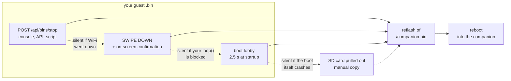
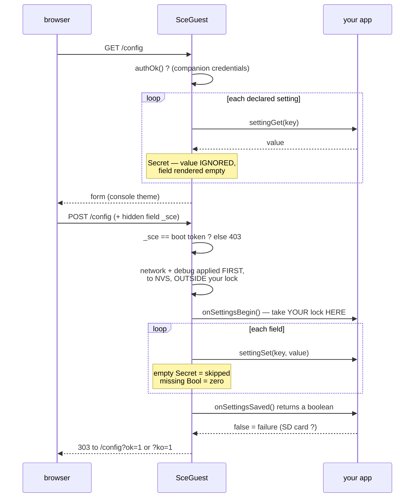
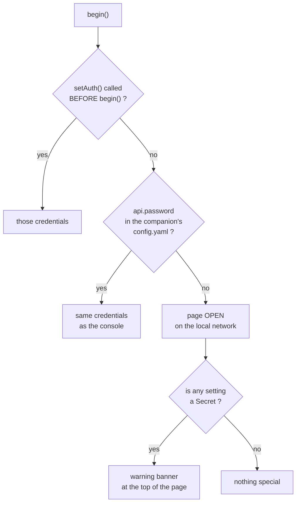

> **English** · [Français](README.fr.md)

# The `SceGuest` contract — making a third-party `.bin` stoppable remotely

`src/guest/SceGuest.h` is **not compiled into the companion firmware**.
It is a header meant to be copied into the project of your own `.bin` — the
one you start from the SD launcher (swipe down) or from the `/api/bins/launch`
API.

## The problem it solves

The StackChan-Companion launcher builds on
[M5Stack-SD-Updater](https://github.com/tobozo/M5Stack-SD-Updater): it
flashes your `.bin` from `/bins/*.bin` and reboots. Once your program is
running, SD-Updater's standard way of **getting back** to the previous
firmware acts at the next boot — which means you need physical access to the
robot.

`SceGuest` adds two exits that do not: an HTTP endpoint and a touch gesture.
Boot keeps a third one, the **lobby**, which remains the only recourse when
your app crashes before it can serve the other two (§ The lobby).

`SceGuest` adds a tiny HTTP server to YOUR `.bin` whose load-bearing endpoint
does one thing: "reflash `/companion.bin` and reboot". That lets the stop be
driven from the web console, from the API, or from any other agent — without
touching the robot. A home page and a settings page come with it.

### The four ways back, from the most convenient to the most robust

Each one fails in a case where the next one still holds. That is the point of
having four rather than one good one.



## Integrating it into your project

PlatformIO/Arduino dependencies of your guest `.bin`:

```ini
lib_deps =
    m5stack/M5Unified
    tobozo/M5Stack-SD-Updater
```

(`WebServer.h` and `SD.h` come with the Arduino-ESP32 core, no need to add
them.)

```cpp
#include "SceGuest.h"

sce::SceGuest guest;

void setup() {
    M5.begin();
    // CoreS3: shared LCD/SD SPI2 pins MUST BE CONFIGURED before SD.begin
    // (SCK=36, MISO=35, MOSI=37, CS=4) — without this SPI.begin the mount
    // fails silently, so config.yaml is never read. Missing credentials
    // produce no STA connection and no error; the guest falls back to its
    // access point.
    SPI.begin(36, 35, 37, 4);
    SD.begin(4, SPI, 15000000);
    // ... the rest of your application ...

    String ip = guest.begin();
    // ip is empty only if neither STA nor the fallback AP came up
}

void loop() {
    guest.update();             // serves HTTP requests — non-blocking
    // ... the rest of your loop ...
}
```

**If your bin creates ANY background task, `sce::CoopStop` is mandatory.**
`/api/bins/stop` (and the exit gesture) reflashes `/companion.bin` inline:
while `updateFromFS` reads the SD card and writes flash, anything of yours
still running fights it for the SD/SPI bus and the heap. A ~9-second reflash
becomes minutes of contention with HTTP dark the whole way — and from the
network, a reflash that takes minutes is indistinguishable from a crash.
`SceGuest` ships the one implementation; wire it in three lines:

```cpp
static sce::CoopStop netGuard;            // next to your task's globals

// task loop head — parks the task, ACK and pacing included:
if (netGuard.shouldPark()) continue;

// your HTTP helper — refuse to OPEN anything new during a stop:
if (netGuard.stopping()) return false;

// setup() — window sized on your LONGEST single request (connect + read):
netGuard.windowMs = 25000;
guest.netGuard = &netGuard;
```

| Member | Contract |
|---|---|
| `shouldPark()` | first statement of the task loop. `true` = `continue`: the ACK is published and a 50 ms pacing delay has already been served. `false` = normal pass, and it clears a stale ACK |
| `stopping()` | read-only, for HTTP helpers: refuse to OPEN anything new |
| `windowMs` | the ACK wait, **15000 ms by default**. Size it on your bin's LONGEST single request (connect + read timeouts), not on an average |
| `guest.netGuard` | the pointer SceGuest calls through; without it the guard is never armed |

`SceGuest` parks the task before the reflash and **releases it if the reflash
fails**, so your guest resumes instead of staying half-dead. The `stopping()`
check in the helper is what keeps a fetch *chain* from outliving the window:
`shouldPark()` alone bounds one iteration, not the three requests that
iteration was about to start. If the ACK never comes, the reflash proceeds
anyway — heap pressure is a risk, losing the only road back to the companion
is worse. It is cooperative by design: never `vTaskSuspend` a task that may
hold a mutex, since a flash that then fails leaves whoever waits on that mutex
frozen for good. `onBeforeStop` still exists for anything *else* your app must
quiesce; it runs after the guard has parked the task.

**If your bin mounts the SD card, watch it with `sce::SdWatch` rather than
trusting the boot answer for the whole run.** A card is a thing a human pulls
out and puts back: without a watcher, one inserted after boot is never seen —
your settings silently stop persisting for the rest of the session while
`/config` keeps offering to save them — and one pulled out is never noticed
either. Unlike `CoopStop`, it is **not** vendored inside `SceGuest.h` — copy
`firmware/common/SdWatch.h` alongside it (it depends only on `<SD.h>` /
`<SPI.h>`, no other project header).

```cpp
static sce::SdWatch sdWatch;

void setup() {
    // ... SPI.begin / SD.begin as above ...
    sdWatch.begin(sdOk, mySdCsPin, mySdHz);   // hand it the boot answer
}

void loop() {
    if (sdWatch.update([] { /* re-read whatever needs the card */ })) {
        sdOk = sdWatch.mounted();
        // update your UI/footer here — the state just changed
    }
}
```

`update()` probes at 3 s while the card is present (one cheap directory open)
and retries the mount at 10 s after a removal, backing off to 60 s while no
card has ever been seen this run — re-mounting blocks `loop()` inside a
failing `SD.begin()` for hundreds of milliseconds, so that cost is paid only
while it might resolve something. The optional callback runs once, on a fresh
mount, with the card known good: the moment to re-read whatever you could not
read at boot.

**WiFi**: `begin()` resolves the network from four sources, first match wins.

| Rank | Source | Why it is there |
|---|---|---|
| 1 | **NVS** — what somebody typed on `/config` | a deliberate act on THIS robot outranks a card that may name the old network |
| 2 | `wifi.client_ssid` / `client_password` in `/stackchan-companion/config.yaml` | provisioning: same file and same card as the companion, write once and clone |
| 3 | the arguments to `begin("MySSID", "MyPassword")` | the compiled-in default, for a board with no card at all |
| 4 | the AP | the way back when nothing above connected |

The AP itself comes from `wifi.ap_ssid`/`ap_password` if the card carries them,
otherwise the hard-coded rescue AP **`SCE-Guest` / `goodlife`** on
`192.168.4.1`, with a captive portal. The STA and AP pairs are read
independently: a card can supply one without the other.

The portal is two mechanisms and needs both: a `DNSServer` answering every name
with `192.168.4.1`, and an `onNotFound` that answers a **302 to `/config`**. The
second is the one that makes a page open by itself — each operating system
probes a URL of its own (`/generate_204`, `/hotspot-detect.html`,
`/connecttest.txt`, `/canonical.html`), none of them a route here, and a plain
404 left Apple showing the words "Not found" in its portal sheet. The handler is
registered **only in AP mode**, so on a joined network a missing route stays a
missing route rather than silently redirecting.

Rank 1 is the part to read twice, and it has its own section below
([No card](#no-card-nosdnotice) is the other half of the story): **NVS survives
a missing card and a reflash**, which is what lets a standalone bin be told
about a network at all. Just like the companion firmware, your guest therefore
always stays reachable.

## Endpoints exposed by the guest

| Method | Route | Effect |
|---|---|---|
| `GET` | `/` | Info page with a "back to companion" button — **redirects (302) to `/config` when there is no companion to go back to** |
| `POST` | `/api/bins/stop` | Reflashes `/companion.bin` (which must exist on the SD card) then `ESP.restart()` |
| `GET` `POST` | `/config` | Settings page — always present, see § Web configuration page |

`/api/bins/stop` is strictly more destructive than the settings form, so it is
protected too — but **not** by the form token: the console, scripts and other
agents call it and none of them can know a per-boot secret; requiring it would
break the remote control this header exists for. It filters on the **`Origin`
header** instead. A browser always sends one on a cross-origin POST, an API
client sends none: absent means "not a booby-trapped page" and passes, present
and foreign means 403. A missing or invalid `/companion.bin` answers 404 rather
than starting a reflash that cannot finish.

`/` exists to offer ONE action: reflash the companion. Without a valid
`/companion.bin` that button cannot work, and the page's text ("a guest is
running in place of the companion firmware") describes a situation that does
not exist — misleading rather than merely useless. Hence the 302: the visitor
lands on the page that can still do something. The test is at RUNTIME
(`companionImageOk()`), not on a build flag: a CoreS3 whose SD card is missing
or dead is in exactly the same position as a board that never had one.

### What a return looks like from the outside

`stopToCompanion()` answers `{"ok":true}` and only *then* starts working, so
the HTTP reply proves the order was accepted — never that the reflash
succeeded. What follows is a window during which **the guest's web server is
dead while the network stack is still alive**: `SceGuest` runs the Arduino
core's *synchronous* `WebServer`, and `updateFromFS` occupies the very loop
that would serve a request. lwIP keeps answering ping and TCP SYNs go
unanswered — the exact signature of a crash, from a bin that is working
correctly. Waiting is the right move.

The serial console at 115200 is the only narrator that window has, so
`stopToCompanion()` prints one breadcrumb per stage:

| Stage | Serial line |
|---|---|
| tasks being parked | `[guest] retour companion : arret des taches...` |
| parked (or not) | `[dbg][task] garde reseau: garee en <n> ms` — and, if the ACK never came, `[guest] ATTENTION : tache reseau non garee, reflash risque` |
| reflash starting | `[guest] taches arretees en <n> ms ; reflash de /companion.bin (<n> octets) - HTTP muet jusqu'au redemarrage` |
| failure only | `[guest] ECHEC updateFromFS apres <n> ms` |

Read them as a budget. The parking time is your `windowMs` behaving (or not),
and the announced byte count is what makes a silence interpretable: a 1.7 MB
image is seconds of work, and a stretch far longer than that means something
is still fighting for the SD bus. Success has no closing line — the chip
reboots into the companion instead. A `ECHEC` line means the flash failed,
the guard is released, the guest keeps running, and the screen says so.

### `appName` — name your application

```cpp
guest.appName = "flight-radar";   // BEFORE begin()
```

Sets the browser tab and the home card. Give it the **bin name** — the same one
the launcher and the SD card use. "StackChan" names the HOST and not the thing
being configured: with two guest bins installed, two tabs and two bookmarks
would be indistinguishable.

Left empty, the pages fall back to "StackChan" (`shownName()`). That default is
deliberate: this header is copied STANDALONE into third-party projects, and
adding a field must not change what an existing copy renders.

## Universal exit gesture: SWIPE DOWN (on by default)

`guest.update()` also detects a **downward swipe** (top→bottom, ≥ 100 px,
vertically dominant) → on-screen confirmation card ([Non]/[Oui], 8 s timeout)
→ reflash of `/companion.bin`. Symmetrical with the companion (where swipe
down = launcher): **every guest bin can be left with a finger**, with no
network and no BtnA.

- Prerequisite: the app calls `M5.update()` in its `loop()` (standard M5) —
  otherwise the gesture is simply inert.
- **Community devs can turn it off** if your app wants to keep every swipe
  for itself:

```cpp
guest.setSwipeExit(false);   // on by default — call after begin()
```

- Detection is passive (a swipe is not a `wasClicked`): your taps and buttons
  are unaffected.

Technical choice: the Arduino core's synchronous `WebServer` (not
`ESPAsyncWebServer`, unlike the companion firmware) — zero extra dependency
for only 2 endpoints, and no need to deal with the CommandQueue since there
is no Brain/Renderer to protect on the guest side.

## The lobby: the boot-time safety net

### What it is for

The lobby is a **window of a few seconds at the startup of your `.bin`**,
BEFORE your `setup()` takes over, during which the user can choose to go back
to the companion.

It is the only one of the three exits that depends on **neither your code nor
the network**:

| Exit | Depends on | Stops working if… |
|---|---|---|
| `POST /api/bins/stop` | WiFi + `guest.update()` in your `loop()` | there is no network, or your app loops without ever calling `update()` |
| Long swipe down | `M5.update()` in your `loop()` + a live screen | your app crashes, freezes the screen or monopolizes the touchscreen |
| **Lobby** | **nothing — it runs before your code** | the SD card is missing |

Hence its value: a guest that crashes in its `setup()`, that spins in an
infinite loop, that leaves WiFi failing or that breaks the touchscreen
**stays recoverable without USB**. Without it, the robot would reboot
forever into a dead binary and you would have to plug it back in.

It is also what makes honest the promise the launcher displays when starting
a `.bin` ("Retour : stop distant ou BtnA au boot").

### What it shows

- **`[Companion]`** — reflashes `/companion.bin` and reboots.
- **`[Continuer]`** — starts your app right away without waiting.
- **No action** — your app starts at the end of the countdown (progress bar
  under the card).

There is no "save the firmware" button: in a guest, SD-Updater's
corresponding action is inert (`binFileName` is null) — and if it were not,
it would overwrite `/companion.bin` with the guest binary, that is to say the
one and only safety net back.

### Wiring it up

```cpp
sce::SceGuest::applyLobbyTheme("mon-bin");   // BEFORE checkSDUpdater()
if (sdOk) checkSDUpdater(SD, String("/companion.bin"), 2500, 4);
```

Without that call, SD-Updater draws ITS own chrome: on CoreS3 it takes the
*touch* path, whose buttons sit in the middle of the screen and never go
through the draw callback, so a partial theme lands on top of them.
`applyLobbyTheme` therefore replaces **the whole waiting screen**
(`setWaitForActionCb`) and installs the labels, aligned with the companion
launcher: same black background, same cyan title with a gradient rule, same
glass card, same rounded buttons.

2.5 s is a compromise: long enough to aim at a button, short enough not to
weigh on every startup. The palette is **duplicated** from
`src/app/Launcher.h` (synced by hand) — `SceGuest.h` must stay copyable
as-is into a third-party project.

## Web configuration page (optional)

Tuning an app with a finger on 320 px is painful, and without this every guest
bin writes its own server and its own HTML. `SceGuest` renders the form: your
app **declares** its settings and provides two accessors — it keeps ownership
of its storage.

```cpp
guest.addSetting("radius_nm", "Rayon (nm)", sce::SceGuest::Num, 10, 500);
guest.addSetting("api", "Source", sce::SceGuest::Choice, 0, 0,
                 "airplanes.live|adsb.lol|adsb.fi");
guest.addSetting("servo", "Tete pointee vers le vol", sce::SceGuest::Bool);

guest.settingGet = [](const char* k) -> String { /* read your config */ };
guest.settingSet = [](const char* k, const String& v) { /* write it */ };
guest.onSettingsSaved = []() { /* persist, re-apply */ };
```

- Kinds: `Num` (with bounds), `Bool` (checkbox), `Text`, `Choice` (`a|b|c`
  list), `Secret`. 24 settings maximum (beyond that: ignored **with a log** —
  flight-radar alone declares 16).
- **`Secret` for every credential** (API token, password). Its value is
  **never echoed back**: the field starts empty, and submitting it empty
  means "unchanged". A `Text` echoes its value inside the HTML attribute —
  acceptable for a radius in nautical miles, not for a Home Assistant token,
  which opens the whole installation to whoever loads the page. If your app
  declares a `Secret` while no password protects the page, the page says so
  at the top, in yellow, rather than blocking itself: it is also the only
  convenient path to *enter* the secret in the first place.

The form, from display to persistence:


- The page lives at `GET /config` (linked from the home page), themed like the
  console; `POST /config` applies the values then calls `onSettingsSaved`.
- **The page always exists**, even in a bin that declares not one setting: its
  Network block, its Debug switch and its build footer belong to the framework,
  and a standalone bin needs them precisely when it has nothing else. What
  `settingGet` gates is only YOUR section — declared settings with no getter to
  read them are not rendered.
- **The network and debug fields are saved BEFORE your lock is taken**, and to
  NVS rather than to the card. They are not your settings, and they must
  survive a bin whose own save fails: somebody who has just typed a network
  into a stranded robot must not lose it because an unrelated write to a
  missing card returned `false`.
- **What `false` promises, and what it does not.** The three bins in this repo
  answer differently, on purpose, and the difference is visible to the user:
  `space` returns the *synchronous* result of its own `saveConfig()`, so a full
  card really does produce `?ko=1`; `flight-radar` and `ha-remote` return `true`
  and hand the write to `loop()`, because their save has to release a lock and
  must not block an HTTP handler behind servo or network work. Those two
  therefore report success even if the card later refuses, every time, in
  silence.

  Neither shape is wrong — but pick yours deliberately. If you defer, say so on
  the page or accept that "Saved" means "accepted", and remember that a deferred
  retry needs a **backoff**: `loop()` runs every few milliseconds and the SD
  shares SPI2 with the display, so an unthrottled retry on a full card hammers
  the bus the renderer needs.

- `onSettingsBegin` / `onSettingsSaved` bracket the submission: take **your
  lock there once** rather than on every field, otherwise a concurrent task
  can read a half-applied config.
- `onSettingsSaved` returns a **boolean**: `false` shows "ÉCHEC de
  l'enregistrement" instead of a lying "Enregistré".

### HTML traps handled for you

- An **unchecked** box is not sent by the browser: SceGuest writes `"0"` for
  every missing boolean.
- A **checked** box is sent as `on` (not `1`): SceGuest sets an explicit
  `value='1'`, but accept `"on"` on the app side too — a naive `toInt()` reads
  `"on"` as 0 and applies "disabled" to the toggle that was just enabled.
- Escape every value before interpolating it into the settings page: a
  persisted setting containing an apostrophe would otherwise break out of its
  attribute, and being persisted it is replayed on every display.
- The settings form carries a hidden `_sce` field and a POST without it is
  rejected: an empty body would otherwise read as "every checkbox unchecked"
  (see the first point) and zero every boolean at once.
- An **empty** `Secret` field does not mean "erase": since the page never
  echoes its value back, saving any other setting would otherwise wipe the
  token. To **revoke** it, enter a lone dash (`-`) — that sentinel is what
  makes revocation possible without pulling the SD card out.
- That hidden field is an **anti-CSRF token drawn at boot**, not a constant.
  A constant is reproducible: any web page the user has open could submit it
  cross-origin, and by rewriting `host` have the home-automation token sent to
  a server of the attacker's choice — without even knowing the token, since a
  `Secret` that is not supplied stays unchanged. Practical consequence: a form
  left open across a reboot of the robot is rejected, reload `/config`.
- Declaring `onSettingsBegin` **without** `onSettingsSaved` is **refused**
  (error 500 + log). The lock taken by the first has exactly one release
  point, the second; an incomplete pair freezes the robot on the first save,
  with no recourse other than a reboot.

### Authentication

`begin()` **automatically picks up the companion console's credentials** —
the `api:` section of the same `config.yaml` as the WiFi credentials. The
robot has a single password, the one you already set on its console; the
guest does not harden what the companion leaves open, and does not open up
when the companion protects.

```yaml
api:
  username: admin
  password: "monmotdepasse"   # vide = ouvert (defaut companion)
```

To force different credentials (bin distributed on its own, without a
companion):

```cpp
guest.setAuth("admin", "autre");   // BEFORE begin()
```

With no password on either side, the page stays **open on the local
network**. Set one if your settings actuate the hardware — the radar's turn
the servos on — and **all the more so if one setting is a `Secret`**: the
token of a home-automation installation is worth far more than the robot
holding it.



### Network: the one section you never declare

The settings page always carries a **Network** block, whether or not your bin
declares a single setting of its own. That is not a convenience: a bin running
standalone — on a board with no companion, often with no card worth editing —
has otherwise no way of being told which network to join, and a robot that
cannot reach the network cannot be reached to be told about it.

Credentials typed there are stored in **NVS**, not on the card. The two media
have different lifetimes, and the difference is the point: NVS survives a
reflash of the application, an SD card does not; a card can be written once and
cloned to ten robots, NVS cannot.

| Source | Role | Wins when |
|---|---|---|
| **NVS** (this page) | what somebody typed on THIS robot | its SSID is non-empty |
| `wifi:` in `/stackchan-companion/config.yaml` | provisioning — write once, flash many | no SSID in NVS |
| `begin("ssid", "pass")` build arguments | the compiled-in default | the card carries nothing |
| Access point | the way back | nothing above connected |

A deliberate act on the device outranks the card. The alternative — card first —
means the field silently does nothing on any robot whose `config.yaml` still
names the old network, which is exactly the robot somebody is standing in front
of. **Forget it** clears the override and hands control back to the card.

The passphrase follows the `Secret` rule (never displayed back, empty means
unchanged) with one addition: **empty against a different SSID clears it**.
Carrying the old passphrase over to a new network guarantees a failure that
looks like a typo in the name.

When the STA connection fails, the access point also runs a **captive portal**:
every name resolves to the bin, so joining the network opens the page by itself
instead of requiring an address nothing has displayed. `isAp()` and `apSsid()`
let your bin say on screen which network to join.

A network change takes effect **on the next restart**. Re-associating live would
drop the HTTP connection carrying the request, so the page could never tell you
whether it worked.

### Debug: the second section you never declare

Below Network, every guest's page carries a **Debug** checkbox: the serial
trace (`sce::trace`, `firmware/common/Trace.h`). On, the bin narrates every
step on serial at 115200 — network joins, config reads, each HTTP attempt with
its status and duration, SD writes, task parking. It applies **at once** and
persists in **NVS** for the same reason the network override does: the moments
that need a trace are the moments a reflash is unavailable or would destroy
the evidence. Runtime and not a build flag, for the same reason.

Your own code joins the narration by calling `sce::trace::log("tag", ...)` —
printf-style, already gated (off, it costs one boolean test per call site).

| | |
|---|---|
| Tags | `net`, `cfg`, `http`, `sd`, `ui`, `task` — one per subsystem, so a capture greps clean |
| Line | `[dbg][tag] +<uptime_ms> <text>`, one line per event, uptime rather than a wall clock because a guest may never have seen NTP |
| Budget | 160 bytes per line; longer text truncates, it does not crash |

**Never put a secret in a trace line.** The rule is the author's to keep, and
the shipped bins keep it by construction: a URL is logged cut at its query
string, and a credential is reported as present or absent, never as its value.
A trace is meant to be pasted into a bug report.

⚠ Keys beginning with `_` are **reserved** for the framework's own form fields
— `_sce` (the anti-CSRF token), `_wifi_ssid` / `_wifi_pass` / `_wifi_forget`,
`_dbg` and its `_dbg_p` presence marker. `addSetting()` refuses **any** key
whose first character is `_`, not just those, and says so on the serial line:
an app setting colliding with the network form would show up as a robot that
changes network when you save an unrelated option.

### The build footer: which binary is answering

The bottom of `/config` carries one line — **application name · `sha` · OTA
slot · start cause**. It is not decoration. This page is one button away from
`/api/bins/stop`, which reflashes `/companion.bin` over whatever firmware was
last installed, and a USB upload writes one OTA slot without touching the
`otadata` that decides which slot boots. "The flash succeeded" and "that is
what is running" are two different claims; only this line answers the second.

| Field | What it says | How to check it |
|---|---|---|
| name | `appName`, falling back to `StackChan` | the bin you meant to launch |
| `sha` | first 8 hex of the SHA-256 of the ELF | `sha256sum .pio/build/<env>/firmware.elf` — **reproducible**, so it either matches your build or you are looking at another one |
| slot | the OTA partition actually booted (`app0`/`app1`) | tells a fresh USB upload apart from a slot that was already there |
| start | reset cause: `poweron`, `sw`, `panic`, `task_wdt`, `brownout`… | `panic`, `task_wdt` and `brownout` mean the board crashed, whatever the screen shows now |

The same four values back the companion's `GET /api/firmware`. There is no
build date: the only one the runtime can offer comes from the precompiled
Arduino libraries, so it answers with a date years older than the firmware —
a field that looks authoritative and is wrong is worth less than no field.

## No card: `noSdNotice`

A guest bin without a card still runs, and that is exactly the problem — it runs
*differently*, silently. Settings entered on `/config` apply and vanish at the
next boot; caches are gone; and whatever the bin reads from its yaml falls back
to a compiled default that may be wrong in a way the screen cannot show.

```cpp
if (!sdOk) {
    guest.noSdNotice([] { SD.end(); sdOk = SD.begin(CS, SPI, 15000000); return sdOk; });
}
```

That call alone gives a complete screen. **The consequences are optional**, and
a new bin should start without them: what the generic rows say is true of every
bin that includes the header.

| | |
|---|---|
| SceGuest owns | the layout, the retry loop, the input routing, the single `drawString` call site (A2.22), and everything true of every bin |
| The bin owns | its own consequences (up to **5** lines — ten rows fit, five are fixed; the failed-retry alert is a red **banner**, not a row) and the **remount**: the header must not learn anybody's SD pins |
| Input | asks the panel at runtime (`M5.Touch.isEnabled()`), not a build flag: touch halves on a CoreS3, A/B/C on a Fire, same binary |
| Returns | `true` if a card was mounted on a **retry** — re-read whatever you read before, because all of it ran against no card |

Add your own lines when you have something the generic screen cannot know:

```cpp
const char* why[] = {
    sce::T("The observer stays at the COMPILED position:",
           "L'observateur reste a la position COMPILEE :"),
    pos,        // formatted from the LIVE config, never written out as text
};
guest.noSdNotice(remount, why, 2);
```

Format such a line from the running configuration rather than spelling it out:
a hard-coded "Paris" keeps claiming Paris the day the compiled default changes,
and this screen exists to be believed.

⚠ A card found on the retry means **everything read before it read nothing**.
Re-read your configuration there, or the retry is a lie: the user inserted a
card, the screen said thank you, and the bin still runs on defaults until the
next reboot.

## Using the IMU: you refresh it yourself

`M5.Imu.getImuData()` does **not** read the sensor. It converts the driver's raw
buffer, and `M5.Imu.update()` is what fills that buffer. A guest that only calls
`getImuData()` gets the same frozen numbers for ever — and the failure is quiet
in the worst way: no error, no zeroed struct, just a robot that never seems to
move. It cost `led-fluid` a session (the fluid floated as if seen from above,
and tilting the robot did nothing).

```cpp
M5.Imu.update();                  // reads the sensor
m5::imu_data_t d;
M5.Imu.getImuData(&d);            // converts what was read
```

The companion never meets this because its Brain calls `update()` on every tick.
A guest has no Brain. `getAccel()`/`getGyro()` do refresh implicitly, which is
exactly why this project forbids them: they fire an I2C read of their own,
outside the caller's control, on the bus shared with the display's touch panel
and the PY32.

## Reading your own YAML: `yamlForEach`

A guest bin stores its settings in `/stackchan-companion/<bin>.yaml`. Decoding
that file is provided for you — do not write another one.

```cpp
sce::SceGuest::yamlForEach("/stackchan-companion/mon-bin.yaml", /*sectioned=*/false,
    [](void*, const char*, const char* key, const char* val) {
        const String k(key), v(val);
        if      (k == "hote")   strlcpy(cfg.hote, v.c_str(), sizeof(cfg.hote));
        else if (k == "rayon")  cfg.rayon = v.toInt();
    }, nullptr);
```

| Point | What you need to know |
|---|---|
| `sectioned` | `false` for a **flat** file (the case of a bin), `true` for a sectioned file like the companion's `config.yaml`. **Declared, never guessed**: an empty `hote:` — the normal case of a bin not yet configured — would be taken for a section by any heuristic |
| Quotes | `token: "abc#def"` yields `abc#def`. The `#` is treated as a comment **only outside** quotes, and `""` is the empty string, not two characters |
| Callback | function pointer + context, not `std::function`: a single copy of the code, zero allocation. A lambda **without capture** converts to it on its own |
| Long lines | beyond 512 bytes a line is ignored (a net against a damaged card) |

Use the shared `firmware/common/Yaml.h` decoder for every YAML scalar
(`yamlForEach` is its guest-side entry point): a private re-implementation that
keeps surrounding quotes produces a wrong SSID — STA fails, the guest falls
back to its AP without a word — or an unrecognised API name that silently
switches the bin over to another source.

## Prerequisites

`/companion.bin` must be present at the root of the SD card — it is the
standard restore binary, generated automatically by `[SauverFW]` in the touch
launcher (swipe down), or copied by hand from
`.pio/build/companion/firmware.bin`.

## Bundled examples

Four complete guest bins live in this repository:

| Bin | Role | Doc |
|---|---|---|
| `flight-radar` | real-time ADS-B aircraft radar | [`docs/guests/FLIGHT-RADAR.md`](FLIGHT-RADAR.md) |
| `ha-remote` | Home Assistant remote control | [`docs/guests/HA-REMOTE.md`](HA-REMOTE.md) |
| `space` | desk space instrument: ISS, passes, Moon, planets, launches | [`docs/guests/SPACE.md`](SPACE.md) |
| `led-fluid` | liquid in a box: a particle fluid tilted by the board itself | [`docs/guests/LED-FLUID.md`](LED-FLUID.md) |

The first three share a skeleton: a `netTask` owning the network, a boot lobby,
a web configuration page, remote stop. **`led-fluid` is the one that does not**,
and it is worth reading for that: its background task carries no network at all,
only arithmetic, so the guard it wires into `SceGuest` protects a simulation
rather than a fetch chain — and its window is measured in seconds instead of
tens of them.

## Detailed example: `flight-radar`

`firmware/flight-radar/` is a ready-to-use DEMONSTRATION guest — a real-time
aircraft radar (community ADS-B data) that shows the whole chain: dedicated
build, launch from the Launcher/API, bin-specific SD config, remote stop via
SceGuest.

```powershell
# Build → .pio/build/flight-radar/firmware.bin (~1.2 MB)
& "$env:USERPROFILE\.platformio\penv\Scripts\pio.exe" run -e flight-radar
# Deploy without touching the SD card (robot powered up under the companion):
# ⚠ MULTIPART (-F) and not --data-binary: on weak WiFi, sending a ~1.5 MB
# image as a raw body gets cut off and hangs the server; the multipart
# route goes through.
curl -X POST "http://<ip>/api/bins" -F "file=@.pio/build/flight-radar/firmware.bin;filename=flight-radar.bin"
curl -X POST "http://<ip>/api/sd/put?path=/stackchan-companion/flightradar.yaml" -F "file=@sdcard/stackchan-companion/flightradar.yaml"
# Launch / stop:
curl -X POST "http://<ip>/api/bins/launch?name=flight-radar.bin"
curl -X POST "http://<ip>/api/bins/stop"      # once the guest has started
```

- **Config**: `/stackchan-companion/flightradar.yaml` (lat/lon position OR
  `airport:` IATA/ICAO, radius 10-500 nm — >250 = center tiling + 6
  satellites deduplicated by hex —, poll period, API source,
  `tz_offset_h`) — editable from the console (file manager, "guest"
  category), without recompiling.
- **Detailed documentation: `docs/guests/FLIGHT-RADAR.md`** (task
  architecture, per-generation route protocol, themes, gestures — mermaid
  diagrams).
- **Sources**: `airplanes.live` (default — best measured Indian Ocean
  coverage), `adsb.lol`, `adsb.fi` (same v2 format, no key), plus
  `safesky` (FLARM/advisory: gliders and UAVs — API KEY required, metres and
  m/s converted on entry).
- **Screen**: radar view (distance rings, blips oriented on heading, colour
  by altitude band, callsigns) + status bar.
- **Tap on an aircraft**: TARGETS it — trajectory trail (position history
  accumulated locally at every poll), altitude/speed/heading/distance, and
  origin→destination route (hexdb.io, adsbdb.com fallback — different
  community databases, some regional flights remain unknown to both) when it
  is known, plus ESTIMATED DÉPART~/ARRIVÉE~ (great circle / ground speed,
  local time from NTP + `tz_offset_h` — no published schedules without a
  keyed API, the "~" owns up to the estimate). Tap on empty space:
  deselection.
- **Swipe UP**: **METAR** of the station (aviationweather.gov, free, no key)
  — flight category colour-coded, wind, temperature/dew point, visibility,
  QNH, clouds and the raw report; any touch goes back. The recap carries the
  full LEGEND; the resource diagnostics live in the RESEAU settings tab.
- **Swipe LEFT**: touch keyboard — [VOL]: enter an ICAO callsign (`AFR470`)
  or a fragment (`470`) to TRACK: targeted immediately if it is visible;
  otherwise, for a COMPLETE callsign, a **worldwide query** `/v2/callsign`
  brings it back wherever it is (marker clamped to the radar edge, full
  panel) — a fragment waits for it to show up locally. OK on an empty field
  = end of tracking; [AEROPORT ici]: enter an IATA (`RUN`) or ICAO (`FMEE`)
  code to RECENTER the radar on that airport (hexdb.io resolution,
  persisted). The yaml's `airport:` key does the same at boot (takes
  precedence over lat/lon, silent fallback when offline).
- **Two-finger pinch** on the radar: **zoom** — that is how the radius is set,
  there is no slider for it. Double-tap = 50/100/250/500 nm steps, guaranteed
  fallback if the touch controller only reports one point.
- **Swipe RIGHT**: settings panel — refresh-rate and brightness sliders
  (fine-adjustment arrows), **ADS-B source** and **theme** chips, aero ⇄
  metric **units** in the title bar, and a row of **6 options**: servo (head
  pointed at the flight), sound (chirps), auto brightness, auto Night theme,
  ground traffic, automatic tracking of the nearest. The non-intrusive
  automations are on by default, the intrusive ones (servo/sound) are not.
  The geometry of the rows is described by a SINGLE table read by both the
  drawing and the touch hit-test.
- **Swipe ↑/↓ on the RIGHT PANEL**: cycles tracking among the visible flights
  (the panel acts as a list) — 3 blocks: flight status, DÉPART
  (code/city/time~), dotted separator + remaining time, ARRIVÉE. When the
  route is missing, the panel says WHY ("route: recherche", "route inconnue",
  "route: reseau KO", "pas de callsign", "heure: sync NTP") — a hexdb network
  failure is retried up to 5 times (8 s backoff), and a blip targeted BEFORE
  its callsign arrives arms the route as soon as the callsign shows up at the
  next poll.
- **Long swipe DOWN on the RADAR area**: back to the companion (SceGuest
  gesture — `swipeExitMaxX` reserves the panel for the app's own swipes).
- **WiFi**: the companion's credentials are reused (`config.yaml`, same SD
  card — **quote-aware** SceGuest parser: the companion serializes
  credentials between quotes).
- **Network on a dedicated task** (core 0): TLS requests block for several
  seconds — never in loop(), otherwise SceGuest's synchronous WebServer
  becomes unreachable (ERR_CONNECTION_TIMED_OUT).
- **`/companion.bin` manageable remotely**: the companion's SD import
  whitelist (`POST /api/sd/put?path=/companion.bin`) — the stop's safety net
  gets deployed without a physical trip through [SauverFW].
- Coverage depends on local community ADS-B receivers: in a poorly covered
  area (ocean, island), prefer a wide radius and busy traffic hours.
