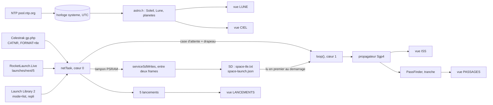
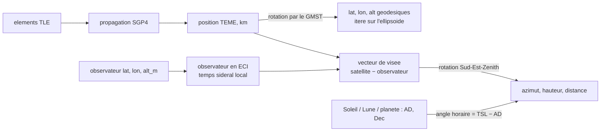
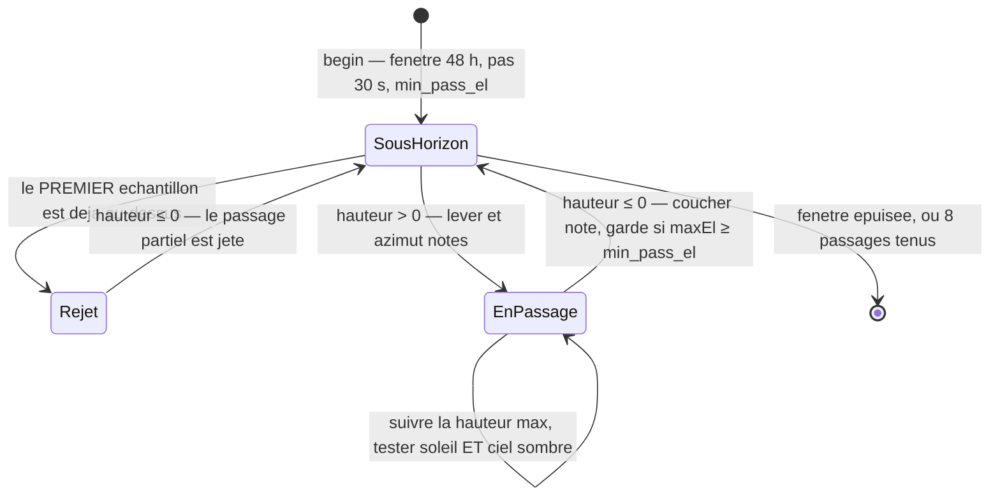
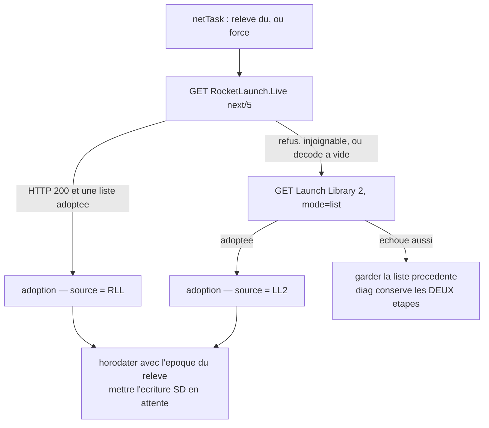

> [English](SPACE.md) · **Français**

# space — l'instrument spatial de bureau

`.bin` invité pour StackChan-Companion (M5Stack CoreS3). Cinq vues sur un anneau :
où est l'**ISS** en ce moment, quand elle repassera au-dessus de **votre**
ciel, la **Lune**, les **planètes** à l'œil nu, et les prochains
**lancements**. Lancé depuis le launcher SD ou l'API, quitté par un swipe bas
comme tout bin invité (`README.fr.md` — le contrat SceGuest).

Sources : `firmware/space/`. Les pièges que le code cite par numéro sont
listés dans [Les dix pièges](#les-dix-pièges).

---

## Ce qui est calculé à bord, et ce qui est relevé

Le radar **reçoit** ses avions : sans réseau il n'a rien à montrer. Ce bin
**calcule**. Un jeu d'éléments (un TLE, deux lignes de 69 caractères) relevé au
plus une fois par jour suffit à placer l'ISS au kilomètre près et à prédire ses
passages sur deux jours — sur le microcontrôleur, sans appeler aucun service.
Coupez le WiFi : tout continue de fonctionner sauf la liste des lancements.

| Grandeur | D'où elle vient |
|---|---|
| Position, vitesse, trace au sol, soleil/éclipse de l'ISS | calculé — `sgp4.h` à partir d'un TLE |
| Heures de passage, azimuts, élévation maximale, visibilité | calculé — `astro.h::PassFinder` |
| Position du Soleil, crépuscule, terminateur jour/nuit | calculé — Meeus basse précision |
| Position, phase, illumination, lever/coucher de la Lune | calculé — série abrégée de Meeus |
| Positions des planètes, élongation, azimut/hauteur | calculé — éléments simplifiés de Schlyter |
| Le jeu d'éléments lui-même (138 caractères) | relevé — Celestrak, au plus une fois par jour |
| La liste des lancements | relevé — RocketLaunch.Live, Launch Library 2 en repli |
| UTC | relevé — NTP, et chaque vue y est conditionnée |

L'astronomie vit dans deux en-têtes **purs**, avec leurs tests natifs à côté :
pas d'Arduino, pas de M5, aucune allocation, `<math.h>` et `<string.h>`
seulement.

| Fichier | Contenu | Verrouillé par |
|---|---|---|
| `firmware/space/sgp4.h` | analyse TLE, propagateur SGP4 proche-Terre | `test_sgp4` (7 cas) — dont le **vecteur de vérification canonique** du Spacetrack Report No 3 (satellite 88888, t = 0 et t = 360 min), à 1 km près |
| `firmware/space/astro.h` | GMST, Soleil, Lune, planètes, géodésie, angles de vue, ombre terrestre, **éclipses ombrales**, lever/coucher, recherche de passages | `test_astro` (20 cas) — des événements réels et datés : la pleine lune du 25/01/2024, les équinoxes, les bornes d'élongation de Mercure et Vénus, la **latitude écliptique de la Lune contre Meeus 47.a**, et quatre éclipses classées — **totales 07/09/2025 et 03/03/2026, partielle profonde 28/08/2026, partielle rasante 28/10/2023, toutes épinglées contre la pleine lune du 07/10/2025 qui passe à côté de l'ombre** |
| `firmware/space/input.h` | le vocabulaire `UiEvent` — la **mécanique** des boutons est le `firmware/common/ButtonFsm.h` partagé | `test_spaceinput` (11 cas) |

37 cas natifs au total. Aucun n'a été écrit à partir de ce que le code
renvoyait : un test rédigé d'après la sortie de l'implémentation ne prouve que
son déterminisme.



---

## L'anneau, et les gestes

```
ISS         ↑ haut : PASSAGES     ↓ bas (long) : retour au companion
PASSAGES    ↑ haut : LUNE         ↓ bas (long) : retour au companion
LUNE        ↑ haut : CIEL         ↓ bas (long) : retour au companion
CIEL        ↑ haut : LANCEMENTS   ↓ bas (long) : retour au companion
LANCEMENTS  ↑ haut : retour ISS   ↓ bas (long) : retour au companion
```

**L'ordre porte le sens**, comme sur le radar : l'objet le plus proche d'abord
(une station à 400 km), puis quand elle revient, puis le ciel qui ne demande
aucun instrument, puis ce qui n'a pas encore décollé — du plus immédiat à
l'intention la plus lointaine.

| Geste | Effet |
|---|---|
| swipe **haut** | vue suivante sur l'anneau |
| swipe **gauche / droite** | élément précédent / suivant (un passage, un lancement, une planète) |
| **tap** sur une ligne de passage | sa carte polaire du ciel (modale — un tap n'importe où en sort) |
| **tap** sur CIEL | une planète, le Soleil (cycle les étiquettes), la grille de balayage, ou le panneau (ouvre la carte du ciel) |
| **appui long** 700 ms, doigt immobile | rafraîchissement forcé de la source de la vue |
| swipe **bas** | retour au companion — **à SceGuest, jamais à nous**, sur toutes les vues |

**Mode dock** (`dock_s`, 0-120 s, 0 = coupé) : posé sur un bureau, les vues
défilent seules. Toute action manuelle réarme le délai ; une modale suspend le
cycle tant qu'elle est ouverte.

### Le vocabulaire d'entrée

`input.h` est pur et testé, et il existe pour que le tactile, les boutons
physiques d'une carte qui en a, et le minuteur du mode dock soient trois
**producteurs** des mêmes événements sémantiques, avec `applyEvent()` dans
`main.cpp` pour unique **consommateur**.

- `UiEvent` : `None`, `NextView`, `PrevItem`, `NextItem`, `Back`, `Refresh`,
  `Settings`, `Select`.
- `swipeEvent(dx, dy)` — un **mappage**, pas un classificateur. La
  classification est celle de `sce::gesture` (`firmware/common/Gesture.h`),
  partagée avec flight-radar et ha-remote : **60 px** sur l'un ou l'autre axe,
  `|dy| ≥ |dx|` va au vertical (l'égalité va à la navigation principale). Ce
  bin utilisait 40 sans raison écrite, pendant qu'un autre affirmait en
  commentaire qu'un invité ne choisit pas le sien — il existait cinq seuils
  pour quatre firmwares. Ce qui reste ici, c'est le SENS des directions.
- `isSwipe(dx, dy)` — la MÊME classification, posée autrement. `swipeEvent`
  répond `None` aussi bien pour « le doigt n'a pas bougé » que pour « une
  direction dont ce bin ne fait rien » ; un appelant qui lit l'une pour
  l'autre résout un vrai glissement en **appui à l'origine du doigt**. C'était
  un vrai bug : un glissement bas de 60 à 99 px — au-delà du seuil du bin, en
  deçà de la sortie SceGuest à 100 px — ouvrait un passage ou sélectionnait
  une planète.
- Une modale ne change pas le sens d'un swipe. Feuilleter les planètes dans la
  modale orbitale, c'est la même intention que feuilleter les passages sur la
  liste derrière ; sortir d'une modale est un **tap**.
- `ButtonFsm` n'appartient **pas** à ce fichier : la banque vit dans
  `firmware/common/ButtonFsm.h` et est partagée avec flight-radar, ré-exportée
  ici en `spa::ButtonFsm` pour que les appelants gardent un seul nom.
  `DEBOUNCE_MS` = 25 ms, `LONG_MS` = 700 ms — le même seuil que le maintien
  tactile. L'appui long part **sur le seuil**, donc il se sent au lieu de
  s'attendre, et le relâchement qui suit est avalé. Une seule banque pour les
  trois boutons, au plus un évènement par appel, un évènement bloqué **différé
  plutôt que perdu**, le premier échantillon adopté sans rien annoncer (un
  bouton tenu à la mise sous tension ne doit pas déclencher son action longue
  700 ms après le boot), et `chord(a, b)` — une interrogation, pas un
  évènement — qui marque les deux boutons comme ayant parlé. C'est cette
  dernière qui fait de **A+C** un overlay debug plutôt qu'un overlay debug
  suivi de deux pas de liste parasites.
- `buttonEvent(bouton, long)` est une fonction pure, et elle ne dépend **pas**
  de la vue — la même règle que suivent les swipes. A/B/C court donne
  `PrevItem` / `NextView` / `NextItem` ; A/B/C long donne `Settings` /
  `Refresh` / `Select`. Sur une vue sans liste (ISS, LUNE) A et C ne font
  simplement rien : un bouton inerte est honnête, un bouton qui veut dire
  autre chose en silence ne l'est pas. Quitter une modale ne demande pas de
  bouton à soi, puisque B la ferme.

Le gestionnaire tactile de `main.cpp` fournit les pixels : l'appui note
l'origine et la milliseconde, un doigt immobile au-delà de 700 ms (dérive sous
12 px, le `LONG_SLOP_PX` partagé — ce bin en tolérait 20, ce qui est un
autre geste sous le même nom) déclenche `Refresh`, et le relâchement est classé
par `swipeEvent`. Un
mouvement sous le seuil est un tap, routé selon la vue.

---

## Lire un TLE

Les colonnes d'un TLE sont **numérotées à partir de 1 et de largeur fixe**, les
champs peuvent être complétés par des blancs, et deux d'entre eux portent une
virgule *implicite*. `parseTle` travaille sur une ligne de longueur fixe et
refuse tout ce qui est plus court plutôt que de lire au-delà — une ligne
tronquée sur une carte SD capricieuse est une entrée réaliste.

| Ligne | Colonnes | Champ | Conversion |
|---|---|---|---|
| 1 | 3-7 | numéro de catalogue | doit correspondre à celui de la ligne 2 |
| 1 | 19-20 | année d'époque | pivot ci-dessous |
| 1 | 21-32 | jour de l'année, fractionnaire | `jd = JD(année‑01‑01 00:00) + (doy − 1)` |
| 1 | 54-61 | terme de traînée B\* | virgule implicite |
| 2 | 9-16 | inclinaison, degrés | × π/180 |
| 2 | 18-25 | ascension droite du nœud ascendant, degrés | × π/180 |
| 2 | 27-33 | excentricité | × 1e‑7 (le `0.` de tête est implicite) |
| 2 | 35-42 | argument du périgée, degrés | × π/180 |
| 2 | 44-51 | anomalie moyenne, degrés | × π/180 |
| 2 | 53-63 | moyen mouvement, tours/jour | × 2π / 1440 → rad/min |
| les deux | 69 | somme de contrôle | voir plus bas |

**La virgule implicite.** `-11606-4` vaut −0,11606 × 10⁻⁴ et ` 66816-4` vaut
0,66816 × 10⁻⁴ : la mantisse porte cinq décimales implicites, et le signe de
l'exposant est logé dans les deux derniers caractères. `sliceExp` coupe au
dernier signe qui n'est pas celui de tête, multiplie la mantisse par 1e‑5 et
applique la puissance de dix. Une mantisse **sans aucun chiffre** — un terme de
traînée réellement nul — vaut 0, et non 1e‑4.

**La somme de contrôle**, modulo 10 sur les 68 premiers caractères : un chiffre
ajoute sa valeur, `-` ajoute 1, le reste rien ; le résultat doit égaler le
caractère 69. Elle est vérifiée **par ligne, pas par paire** : une ligne 2
tronquée par une coupure de courant ne doit pas désactiver la vérification de
la ligne 1, où vivent justement l'époque et le terme de traînée.

**68 caractères sont l'exigence de données**, le 69ᵉ est la somme de contrôle.
Celestrak en envoie toujours 69, mais le cas de test canonique du Spacetrack
Report No 3 imprime ses deux lignes *sans* le chiffre de contrôle — refuser 68
reviendrait à refuser le seul vecteur qui prouve le propagateur juste.

**Le pivot d'année d'époque** : 57-99 valent 1957-1999, 00-56 valent
2000-2056. Spoutnik est la charnière, et 57 signifiera 1957 jusqu'en 2057.

**Les refus se font ici**, et non trois couches plus haut où la cause est
invisible : des lignes qui ne commencent pas par `1` et `2`, un numéro de
catalogue différent entre les deux lignes (un fichier de cache entrelaçant deux
objets propagerait sinon une chimère), un moyen mouvement non positif, une
excentricité hors de [0, 1).

Les dates juliennes emploient la forme grégorienne valide de 1901 à 2099, ce
qui couvre toute époque de TLE que ce bin peut rencontrer :

```
si (mois <= 2) { année -= 1; mois += 12; }
A = année / 100;  B = 2 - A + A/4
JD = floor(365.25*(année+4716)) + floor(30.6001*(mois+1)) + fracJour + B - 1524.5
```

---

## SGP4, le propagateur proche-Terre

Le modèle **proche-Terre seulement** (période orbitale < 225 min). Cela couvre
l'ISS (92 min) et tout satellite en orbite basse que ce bin traquera jamais.
L'espace profond — SDP4, ses résonances lunaires et solaires, ses orbites de
12 h et géostationnaires — est délibérément absent : `Tle::isDeepSpace()`
signale `2π/n ≥ 225 min` et l'appelant **refuse** au lieu de dessiner
n'importe quoi. C'est toute la raison pour laquelle la configuration annonce
qu'une orbite haute n'est pas gérée plutôt que de l'approximer en silence.

**WGS-72, parce que c'est le modèle sur lequel les jeux d'éléments sont
ajustés.** Employer ici les nombres du WGS-84 est une erreur silencieuse
classique : « améliorer » les constantes dégrade le résultat.

| Constante | Valeur | Ce que c'est |
|---|---|---|
| `XKMPER` | 6378.135 | rayon équatorial terrestre, km |
| `XKE` | 0.0743669161 | √GM, en rayons terrestres^1,5 par minute |
| `CK2` | 5.413080e‑4 | ½ J₂ aE² |
| `CK4` | 0.62098875e‑6 | −⅜ J₄ aE⁴ |
| `QOMS2T` | 1.88027916e‑9 | (q₀ − s)⁴, rayons terrestres⁴ |
| `S_CONST` | 1.01222928 | s = aE + 78/XKMPER |
| `XJ3` | −0.253881e‑5 | harmonique zonale J₃ |

Référence : Hoots & Roehrich, *Models for Propagation of NORAD Element Sets*
(Spacetrack Report No 3, 1980).

### Ce que fait `init()`, une fois par jeu d'éléments

1. **Dé-Kozaïser le moyen mouvement.** Le *n* du TLE est une valeur moyenne de
   Brouwer ; utilisé tel quel il décale le satellite de plusieurs kilomètres. À
   partir de `a₁ = (XKE/n)^(2/3)` et `δ₁ = 1,5·CK2·(3cos²i−1) / (a₁²β³)`, le
   couple récupéré est `n₀'' = n/(1+δ₀)` et `a₀'' = a₀/(1−δ₀)`.
2. **Ajuster la traînée atmosphérique.** Sous 156 km de périgée, les `s` et
   `(q₀−s)⁴` standards sont réajustés d'après la hauteur réelle du périgée, et
   sous 98 km ils sont bornés. Un satellite si bas est à quelques jours de la
   rentrée, mais la branche doit exister sinon les puissances plus bas passent
   au négatif et produisent des NaN. Un périgée sous 220 km lève par ailleurs
   le **drapeau simplifié** `isimp`, qui supprime les termes de traînée
   supérieurs.
3. **Construire les coefficients de traînée** C1…C5, `η`, et les coefficients
   de longue période `xlcof`/`aycof` issus du terme J₃.
4. **Calculer les taux séculaires** de l'anomalie moyenne, de l'argument du
   périgée et du nœud, à partir de J₂, J₂² et J₄ :
   `Ṁ = n₀'' + ½·temp1·β·(3cos²i−1) + …`,
   `ω̇ = −½·temp1·(1−5cos²i) + …`,
   `Ω̇ = −temp1·cos i + …`.
5. Hors cas simplifié, construire les termes `d2`/`d3`/`d4` et
   `t3cof`…`t5cof` du polynôme de traînée.

### Ce que fait `propagate(tsince)`, à chaque appel

`tsince` est en **minutes depuis l'époque du jeu d'éléments**, et le négatif est
légal — la trace au sol remonte 50 minutes en arrière avec le même appel.

- **Mise à jour séculaire** : anomalie moyenne, argument du périgée et nœud
  avancent linéairement ; la traînée rétrécit le demi-grand axe (`tempa`),
  ronge l'excentricité (`tempe`) et s'ajoute à la longitude moyenne (`templ`),
  avec les puissances supérieures du temps seulement hors cas simplifié.
- **L'échec est signalé, pas caché** : un jeu d'éléments périmé pousse `e` hors
  domaine, et `e < 1e‑6`, `e ≥ 1` ou `a < 1` rayon terrestre renvoient
  `ok = false` plutôt qu'une position NaN qui se dessine en un point au pôle.
- **Périodiques de longue période** issues de J₃ : `axn`, `ayn` et la longitude
  moyenne corrigée.
- **L'équation de Kepler** par Newton-Raphson, 10 itérations au plus,
  convergence à |f| < 1e‑12, avec le pas **borné à ±0,95**. La forme non bornée
  oscille pour les corrections quasi paraboliques ; c'est la borne qui la fait
  converger en cinq passes environ.
- **Périodiques de courte période** : rayon, argument de latitude, nœud et
  inclinaison sont corrigés par les termes J₂ — les `rk`, `uk`, `xnodek`,
  `xinck` de l'implémentation de référence.
- **Vecteurs d'orientation** : (rayon, argument de latitude, nœud, inclinaison)
  deviennent une position et une vitesse ; la position est mise à l'échelle par
  `XKMPER` en kilomètres, la vitesse par `XKMPER/60` en km/s.

Le repère de sortie est le **TEME de la date** (vrai équateur, équinoxe moyen)
— celui dans lequel SGP4 travaille nativement. Ne donnez pas ces coordonnées à
une routine J2000 sans conversion.

**Le `double` est émulé logiciellement sur l'ESP32-S3** (son FPU n'est que
simple précision) et SGP4 a réellement besoin de la mantisse. Chaque appelant
propage donc **à la demande** — 1 Hz pour la vue en direct, par tranches pour la
recherche de passages, une trace au sol en cache — jamais une fois par frame,
ce qui ferait exploser le budget de 33 ms.

---

## D'un vecteur d'état à une place dans le ciel



**Le temps sidéral moyen de Greenwich** est la charnière de toute conversion
liée à la Terre ; une erreur ici fait tourner le monde entier sous le
satellite. Avec `d = JD − 2451545,0` et `T = d/36525` :

```
GMST° = 280,46061837 + 360,98564736629·d + 0,000387933·T² − T³/38710000
```

**ECI → géodésique** est itératif parce que la Terre est un ellipsoïde (WGS‑84
ici : `a = 6378,137 km`, `f = 1/298,257223563`, `e² = f(2−f)`). La latitude
sphérique du premier passage est fausse de jusqu'à 0,19°, soit 20 km de trace
au sol. Huit itérations de `lat = atan2(z + a·C·e²·sin lat, √(x²+y²))`
convergent en quatre environ. La longitude vaut `atan2(y, x) − GMST`.
L'altitude emploie `r/cos(lat) − a·C`, sauf au-delà de |lat| = 89,5° où le
cosinus s'annule et où la forme polaire `|z| − a(1−f)` prend le relais — le
satellite traverse bel et bien les hautes latitudes.

**Observateur → ECI** emploie l'angle sidéral local `θ = GMST + longitude` et le
même ellipsoïde : `rc = (a·C + alt)·cos(lat)` dans le plan équatorial,
`(a·S + alt)·sin(lat)` le long de l'axe, avec `S = C(1−e²)`.

**Les angles de vue** font tourner le vecteur de visée dans le repère classique
**Sud-Est-Zénith**, puis

```
distance = |r|,  hauteur = asin(z_SEZ / distance)
azimut   = wrap360(atan2(−e_SEZ, s_SEZ) + 180°)      // 0 = Nord, 90 = Est
```

**Les objets lointains** (Soleil, Lune, planètes) passent plutôt par leur
ascension droite et leur déclinaison : angle horaire `H = TSL − AD`, puis les
formules standard

```
hauteur = asin(sin φ sin δ + cos φ cos δ cos H)
azimut  = wrap360(atan2(−sin H cos δ, cos φ sin δ − sin φ cos δ cos H))
```

La parallaxe y est ignorée, ce qui est exact pour tout sauf la Lune, dont la
parallaxe d'environ 1° reste sous la résolution d'affichage de ce bin.

**Une note de repère, écrite pour que personne n'améliore le mauvais terme.**
SGP4 renvoie du TEME ; les routines Soleil/Lune/planètes renvoient des
coordonnées équatoriales *de la date*. Les deux diffèrent de l'équation des
équinoxes — au plus ~1,1 seconde d'arc en ascension droite. Tout consommateur
ici affiche des degrés (une pastille d'azimut, un point de 3 px sur une carte
de 320, une heure de lever à la minute) : ils sont donc traités comme le même
repère et l'erreur reste quatre ordres de grandeur sous le plus petit objet
dessiné. Ne reportez pas ce raccourci sur quoi que ce soit qui pointe une
lunette.

**Le budget de précision**, pour la même raison :

| Routine | Erreur | Modèle |
|---|---|---|
| Soleil | ~0,01° | Meeus basse précision |
| Lune, longitude et distance | ~0,05° | Meeus abrégé, 7 termes en longitude |
| Lune, latitude | ~0,002° | Meeus abrégé, 8 termes — l'éclipse en dépend |
| Planètes | ~0,05° | éléments képlériens simplifiés de Schlyter |

Une heure de lever de passage est donc bonne à quelques secondes près, et un
pourcentage de phase lunaire à bien moins d'un point. C'est la résolution de
l'écran.

---

## Le Soleil, la Lune, les planètes

### Soleil

Meeus basse précision, avec `n = JD − J2000` :

```
L = 280,460 + 0,9856474·n            (longitude moyenne)
g = 357,528 + 0,9856003·n            (anomalie moyenne)
λ = L + 1,915·sin g + 0,020·sin 2g   (longitude écliptique)
ε = 23,439 − 0,0000004·n             (obliquité)
AD  = atan2(cos ε · sin λ, cos λ)
Dec = asin(sin ε · sin λ)
R   = 1,00014 − 0,01671·cos g − 0,00014·cos 2g   (ua)
```

`sunAltDeg` est cette position passée dans la routine d'angles de vue. Le seuil
qui compte partout dans ce bin est **−6°, le crépuscule civil** : au-dessus, le
ciel est trop clair pour qu'un passage de satellite soit visible, et la vue
CIEL qualifie ses planètes de « de jour ».

### Le satellite est-il au soleil ?

Un test d'**ombre terrestre cylindrique** — un produit scalaire et une norme au
lieu d'une géométrie conique. Avec **u** le vecteur unitaire vers le Soleil et
**s** la position du satellite, `proj = s·u`. Si `proj > 0`, le satellite est
sur l'hémisphère éclairé et donc au soleil. Sinon il n'est éclairé que si sa
distance à l'axe Soleil-Terre, `|s − proj·u|`, dépasse le rayon terrestre. La
pénombre ainsi ignorée dure quelques secondes d'un passage, largement dans la
marge d'un verdict VISIBLE/radio.

### Lune

Meeus chapitre 47, abrégé — mais **pas uniformément** : les sept plus grands
termes en longitude, **huit** en latitude, quatre en distance. Avec
`T = (JD − J2000)/36525` et les cinq arguments

```
L' = 218,316 + 481267,8813·T    (longitude moyenne)
M  = 357,529 + 35999,0503·T     (anomalie du Soleil)
M' = 134,963 + 477198,8676·T    (anomalie de la Lune)
D  = 297,850 + 445267,1115·T    (élongation)
F  =  93,272 + 483202,0175·T    (argument de latitude)

λ = L' + 6,289 sin M' + 1,274 sin(2D−M') + 0,658 sin 2D
       + 0,214 sin 2M' − 0,186 sin M − 0,114 sin 2F
β = 5,128122 sin F        + 0,280602 sin(M'+F)
  + 0,277693 sin(M'−F)     + 0,173237 sin(2D−F)
  + 0,055413 sin(2D−M'+F)  + 0,046271 sin(2D−M'−F)
  + 0,032573 sin(2D+F)     + 0,017198 sin(2M'+F)
Δ = 385001 − 20905 cos M' − 3699 cos(2D−M') − 2956 cos 2D − 570 cos 2M'   km
```

convertis en ascension droite et déclinaison par la même obliquité.

**Pourquoi la série en latitude est deux fois plus longue que les autres.** La
longitude et la distance ne servent qu'à placer le disque et nommer la phase,
où un vingtième de degré est trois ordres de grandeur sous le cercle de 140 px
qu'on dessine. La latitude décide en plus si la Lune entre dans l'ombre de la
Terre, et ce verdict se joue sur environ un quart de degré — le même abrègement
qui est généreux pour le dessin est donc disqualifiant pour l'éclipse. Quatre
termes portaient une erreur de **0,12°**, mesurée contre l'exemple résolu 47.a
de Meeus lui-même (12/04/1992 0h TD, β = −3,229126°), et le terme `2D−F`
portait le signe opposé à celui de la table 47.B. Jugée contre le canon NASA,
cette série se trompait sur **cinq des huit éclipses par l'ombre de
2023-2028** ; avec ces huit termes, les huit sont justes. `test_astro` épingle
la latitude directement contre cette référence, pour que le défaut ait un
témoin là où il vit et pas seulement dans les verdicts en aval.

**L'élongation par rapport au Soleil pilote à la fois le nom de la phase et le
terminateur** : `elong = λ − λ☉`, croissante sous 180°, et l'âge vaut
`elong/360 × 29,530588853` jours (le mois synodique moyen).

**L'illumination vient du vrai angle de phase**, pas directement de
l'élongation : au quartier les deux diffèrent d'environ 0,2°, soit un dixième
de point visible sur l'affichage. Avec `ψ = acos(cos β · cos(λ − λ☉))`
l'élongation géocentrique et `R` la distance du Soleil en km,

```
angle de phase i = atan2(R·sin ψ, Δ − R·cos ψ)
fraction éclairée k = (1 + cos i) / 2
```

**Les noms de phase** sont huit tranches de 45° centrées sur les phases
nommées, si bien que « premier quartier » couvre 90° ± 22,5°, comme le dirait
un observateur.

### Planètes

Éléments képlériens simplifiés de Schlyter, de Mercure à Neptune. Le numéro de
jour est **`d = JD − 2451543,5`**, compté depuis le 31/12/1999 00:00 TU et
*non* depuis midi J2000 ; mélanger les deux époques fait une erreur d'une
demi-journée, c'est-à-dire une planète à un demi-degré près, donc la constante
vit à un seul endroit.

La table des éléments tient dans **une** fonction, `planetElements`, lue par la
routine géocentrique comme par l'héliocentrique — deux copies des constantes de
Schlyter seraient exactement la divergence que la discipline d'analyseur unique
du projet (A2.23) existe pour supprimer. Les cinq premières entrées ont un
demi-grand axe constant ; **Uranus et Neptune ont un `a` qui dérive avec
l'époque** (`19,18171 − 1,55e‑8·d` et `30,05826 + 3,313e‑8·d`), et supprimer ce
terme pour faire comme les autres coûte des milliers de kilomètres par
décennie.

Par planète : l'équation de Kepler est résolue **en degrés** (convention de
Schlyter) par itération de Newton, 12 passes au plus, convergence à 1e‑9. De
l'anomalie excentrique viennent les coordonnées dans le plan orbital, l'anomalie
vraie et le rayon, puis les coordonnées rectangulaires héliocentriques via le
nœud, l'inclinaison et l'argument du périhélie.

**La position de la Terre vient de celle du Soleil** : c'est le même vecteur au
signe près, donc aucun second jeu d'éléments n'est nécessaire. `earthHelio`
renvoie la longitude et le rayon héliocentriques de la Terre ;
`planetPosition` les relit, retranche 180° pour retrouver la longitude
géocentrique du Soleil, et ajoute ce vecteur pour convertir héliocentrique →
géocentrique en une étape. Le résultat est tourné par l'obliquité
`23,4393 − 3,563e‑7·d` en coordonnées équatoriales.

`planetHelio` renvoie ce dont un orrery vu de dessus a besoin : longitude et
rayon **projetés sur le plan de l'écliptique**. La plus grande inclinaison de ce
jeu est celle de Mercure, 7°, soit moins d'un pixel à l'échelle dessinée.

**`planetAid`** dit ce qu'il faut pour voir réellement une planète : 0 = œil nu,
1 = jumelles (Uranus, magnitude ~5,7), 2 = lunette (Neptune, ~7,8). Fixé par
planète plutôt que déduit d'une magnitude calculée : Uranus varie d'un dixième
de magnitude sur son orbite et ne passe jamais à portée de l'œil nu depuis un
vrai ciel, donc une valeur calculée ajouterait de l'arithmétique sans changer
une seule réponse. Cacher les deux extérieures serait un mensonge ; les lister
comme si c'était Jupiter en serait un autre.

### Lever et coucher d'un objet lent

`findRiseSet` est volontairement générique et bête : **balayage puis
dichotomie** sur une fenêtre bornée. Le balayage avance de 20 minutes — ces
objets se déplacent de moins d'un degré par heure, un passage à l'horizon ne
peut donc pas être manqué — et tout changement de signe de `hauteur − h0`
encadre une traversée, que 14 dichotomies résolvent au dixième de seconde près.
`h0` est la hauteur d'horizon : 0 pour une source ponctuelle, **−0,833°** pour
un corps dont le limbe et la réfraction comptent. La recherche s'arrête dès
qu'elle tient un lever et un coucher.

---

## Trouver les passages

Une recherche de 48 heures au pas de 30 secondes, ce sont des milliers d'appels
SGP4 en `double` logiciel — des centaines de millisecondes, qui d'un seul tenant
feraient exploser le budget de frame et affameraient le polling tactile.
`PassFinder` est donc un **automate en tranches** : `loop()` appelle `step(40)`
et demande `done()`. Rien dedans n'alloue ni ne bloque, et `progress()` alimente
une barre plutôt qu'un « calcul en cours » figé.



**La garde du premier échantillon est le point subtil.** Si le satellite est
déjà levé au tout premier échantillon, ce n'est pas un lever : c'est le milieu
d'un passage rejoint en retard. Noter l'instant de départ comme heure de lever
publierait « se lève maintenant, dans la direction où il se trouve » comme un
fait, que le tableau imprime et dont la carte polaire trace un arc. Ce passage
partiel est ignoré jusqu'à ce que le satellite repasse sous l'horizon.

**`VISIBLE` exige trois choses au même instant échantillonné** : une hauteur
au-dessus de `min_pass_el`, un satellite **au soleil** (le test d'ombre
cylindrique), et le Soleil de l'observateur sous **−6°**. Tout le reste est
`radio` : l'ISS est au-dessus de votre horizon, mais vous ne pouvez pas la
voir. Ce sont deux événements différents, et une liste qui les confondrait vous
ferait sortir pour rien.

Au plus `MAX_PASSES = 8` sont retenus ; un passage dont la hauteur maximale
n'atteint jamais `min_pass_el` est écarté.

C'est `loop()` qui décide quand une recherche tourne : `startPassSearch` part
quand il n'y a pas encore de résultat, quand la dernière recherche a plus de
**6 heures**, quand la liste est épuisée (`firstUpcomingPass` ne trouve plus
rien dans le futur), quand un nouveau jeu d'éléments est adopté, et à
l'enregistrement des réglages — l'observateur a peut-être déménagé. **Une liste
d'événements à venir ne doit jamais contenir le passé** : la vue ISS ne lit
donc jamais l'indice 0 mais le premier passage dont le coucher est encore
devant.

---

## Les cinq vues

### ISS — le planisphère

Projection équirectangulaire (plate carrée), **bord à bord** : `MAP_X = 0`,
`MAP_Y = 18`, 320 × 160, donc la carte court de juste sous le bandeau jusqu'aux
rangées de données, en y = 178. Le mappage tient en une ligne dans chaque sens
et doit correspondre exactement à celui du générateur :

```
x = (lon + 180) / 360 × 320        y = (90 − lat) / 180 × 160
```

**Le terminateur jour/nuit est recalculé à chaque frame, colonne par colonne.**
Le point subsolaire est la déclinaison du Soleil et `wrap180(AD − GMST)`. Le
terminateur est le grand cercle à 90° de ce point, donc à une longitude donnée
il se trouve à

```
lat_term = atan( −cos(lon − lon_sub) / tan(lat_sub) )
```

Quel côté est sombre découle du seul hémisphère du Soleil : Soleil au nord, la
moitié éclairée est la nord et la nuit s'étend au sud du terminateur, et
inversement. Aux équinoxes `tan(lat_sub) → 0` et le terminateur *est* un
méridien : cette branche est testée explicitement (`|tan| < 1e‑4`) et une
colonne est alors entièrement jour ou entièrement nuit, car diviser là donnerait
une latitude infinie. Chaque colonne est vidée en au plus deux segments
verticaux à travers un unique point d'appel `drawFastVLine`.

**Le trait de côte** est blitté depuis le masque 1 bit généré. Les octets
entièrement vides sont sautés, donc les 51 200 pixels coûtent 6 400 lectures et
environ 3 200 tracés — le littoral fait environ 6 % de la carte. Chaque pixel
encré prend l'encre de nuit ou celle de jour selon le côté du terminateur où
tombe sa rangée. Le fond dit exactement UNE chose (où est le Soleil) et le trait
dit l'autre (où sont les côtes) ; un continent rempli obligerait l'œil à séparer
« terre ou mer » de « éclairé ou sombre » dans le même bloc de couleur.

Un graticule volontairement discret ne marque que l'équateur et le méridien
d'origine — les deux lignes qu'un littoral ne dit pas déjà.

**La trace au sol est mise en cache.** 101 échantillons espacés d'une minute, de
−50 à +50 minutes, chacun une propagation SGP4 *et* une conversion géodésique
itérative en `double` logiciel. Recalculer cela à chaque frame dans le même
corps qui remplit aussi 320 colonnes est précisément ce que l'en-tête du
propagateur interdit. Elle est reconstruite quand le cache a plus de
**20 secondes** — l'ISS parcourt un demi-pixel en 500 ms, donc 20 s font une
vingtaine de pixels, une reconstruction pour quarante frames — et redessinée
depuis le cache entre-temps. Le **marqueur**, lui, bouge à chaque frame ; il
coûte la seule propagation dont la vue a vraiment besoin en direct.

Deux détails font marcher la polyligne là où des points échouaient :

- **la ligne de changement de date.** Deux échantillons consécutifs à cheval sur
  ±180° sont voisins sur le globe et aux bords opposés de l'écran. Un saut
  horizontal supérieur à la moitié de la carte est un enroulement, et le segment
  est sauté au lieu d'être tracé en barre à travers tout le monde.
- **le passé contre le futur.** Le même tracé en deux valeurs : là où la station
  est passée c'est éteint, là où elle va c'est la couleur d'accent, pour que le
  sens de marche se lise d'un coup d'œil.

**La station** est un carré de 5 × 5 dans un anneau de 9 × 9 — rempli en couleur
d'accent quand elle est **au soleil**, en couleur secondaire quand elle est en
**éclipse**. **L'observateur** est une petite croix à vos `lat`/`lon`.

Sous la carte, une donnée par rangée : nom et point subsatellite ; altitude,
vitesse (la norme du vecteur vitesse) et soleil/éclipse ; puis le prochain
passage avec le délai restant, ou l'avancement de la recherche tant qu'elle
tourne.

**Au-delà de 14 jours, le jeu d'éléments est grisé, pas caché** : la trace et le
marqueur passent à l'encre éteinte et le pied de vue affiche
`jeu d'elements PERIME` avec l'âge. À ce stade SGP4 a dérivé de dizaines de
kilomètres. Refuser de dessiner serait aussi faux que dessiner avec assurance.

### PASSAGES — quand sortir

Jusqu'à six lignes de la liste : date, heure et azimut de lever, élévation
maximale, heure de coucher — puis, sur une seconde ligne, la pastille et la
durée avec le point cardinal de coucher. En-tête et valeurs partagent **une
seule** série d'origines de colonnes (8, 92, 134, 172, 206), donc rien ne peut
dériver.

La pastille de gauche est la raison d'être de la vue : **`VISIBLE`** en couleur
d'accent, `radio` en éteint, selon la règle donnée plus haut.

**Le profil de passage** occupe les 64 px que le tableau laisse à droite de
chaque ligne. Une colonne affichant « 42 » donne l'élévation maximale ; un arc
tracé à 42/90 de la hauteur du dôme la donne d'un coup d'œil *et* la compare à
la ligne du dessus sans lire ni l'une ni l'autre. Il est échantillonné comme une
parabole passant par (lever, horizon), (max, sommet), (coucher, horizon) —

```
y = base − 4 · sommet · u · (1 − u),  u de 0 à 1 sur la durée du passage
```

— parce que la vraie courbe est un grand cercle vu en élévation et qu'à 64 px de
large la différence est sous le pixel. L'arc reprend la couleur VISIBLE/radio,
si bien que les deux faits qui décident si l'on sort ne font qu'une seule forme.

**Un tap sur une ligne ouvre sa carte polaire** (modale, centre 160/128, rayon
92) : nord en haut, **est à DROITE** — c'est le ciel vu par quelqu'un qui *lève
les yeux*, donc le miroir d'une carte au sol, et la façon la plus courante de
rater une carte polaire. Des cercles marquent 30° et 60° de hauteur. Le passage
est échantillonné en 61 points entre lever et coucher, et projeté par

```
r = R · (90 − hauteur) / 90
x = cx + r·sin(azimut)      y = cy − r·cos(azimut)
```

Lever, maximum et coucher sont marqués plus gros, et la légende donne les
heures, l'élévation maximale et les deux points cardinaux.

Les passages sous `min_pass_el` (10° par défaut) ne sont pas listés : en
dessous, le satellite est dans la ligne des toits.

### LUNE

**Le schéma Soleil–Terre–Lune** occupe les deux tiers gauches de l'écran : un
demi-Soleil collé au bord gauche, un arc de l'orbite terrestre, la Terre en
disque sur cet arc, et la Lune sur sa propre orbite à sa **vraie élongation**.
Faire déborder le Soleil du cadre est la seule chose vraie qu'un schéma à cette
échelle puisse en dire — un disque entier avec une marge affirmerait que c'est
un objet proche de cette taille. Rien n'est à l'échelle et rien n'a besoin de
l'être : l'**angle** est la seule affirmation, et l'angle est exact.

Une élongation de 0 (nouvelle lune) place la Lune entre nous et le Soleil, donc
à **gauche** de la Terre ; 180 (pleine lune) la place derrière nous, à droite —
d'où le signe sur le cosinus quand la Lune est posée à `MORB_R` du centre de la
Terre.

Deux routines dessinent un corps éclairé, et chacune répond à une question
différente :

- **`drawLitBody`** — un corps éclairé sur l'hémisphère qui fait face au Soleil,
  utilisé **pour la Terre comme pour la Lune** du schéma. La séparation est la
  droite perpendiculaire à la direction du Soleil passant par le centre,
  résolue par ligne de balayage en `x = −(dy·u_y)/u_x` puis bornée au disque ;
  quand le Soleil est presque à la verticale, `u_x` s'annule et toute la ligne
  tombe du même côté. Elle **s'incline** avec la géométrie — une séparation
  verticale fixe ne serait juste qu'aux quartiers. Vue de dessus, la Lune est
  *toujours* exactement à moitié éclairée, et un schéma dont la seule
  affirmation est l'angle ne peut pas prendre de liberté avec l'éclairage que
  cet angle impose ; la phase vue de la Terre garde ses deux foyers, la
  pellicule en bas et le grand pourcentage.
- **`drawMoonDisc`** — la phase en disque simple, employée par les huit
  vignettes et par la Lune de la carte du ciel. Le terminateur est l'ellipse
  `x = s·c` avec `s = 1 − 2k` en croissance et `2k − 1` en décroissance ; ce
  seul nombre signé couvre le croissant (s > 0) comme la gibbeuse (s < 0), ce
  qui fait qu'une lune gibbeuse a l'air gibbeuse au lieu d'avoir l'air mordue.
  Les deux segments sont dérivés de la **même** demi-largeur, calculée avec une
  racine arrondie et non tronquée, si bien qu'un liseré clair d'un pixel sur le
  limbe sombre est arithmétiquement impossible plutôt que simplement
  improbable.

**Les éclipses ombrales se dessinent quand elles ont lieu.** `moonInfo` publie
deux champs pour ça : `betaDeg`, la **latitude écliptique** de la Lune, et
`eclipse`, qui vaut 0, 1 ou 2. Le test tient en une séparation angulaire au
**point anti-solaire** — l'hypoténuse, aux petits angles, du « dépassement de
la pleine lune » et de cette latitude — mesurée contre l'ombre de la Terre :

```
sep   = √( (elong − 180)² + β² )
umbra = 1,02 · (π_lune − sd_soleil + π_soleil)     Meeus, chap. 54
sep < umbra − sd_lune  →  2, totale     (le disque entier tient dedans)
sep < umbra + sd_lune  →  1, partielle  (le disque ne fait que mordre)
```

**`β` est tout l'intérêt.** Sans elle, chaque opposition serait une éclipse, et
c'est exactement pourquoi les pleines lunes ratent d'ordinaire l'ombre :
l'orbite de la Lune est inclinée, et la plupart des pleines lunes passent
au-dessus ou en dessous de l'ombre plutôt qu'au travers. Le facteur 1,02 est la
marge standard pour l'atmosphère terrestre.

**Seule l'ombre est modélisée.** Une éclipse par la pénombre assombrit la Lune
d'une quantité que personne ne remarque sans photographie ; la signaler
dépenserait l'attention du lecteur sur un fait que ses yeux ne peuvent pas
vérifier.

Pendant une éclipse **totale**, la Lune du schéma passe **cuivre** (la couleur
de lumière réfractée d'une lune de sang, volontairement indépendante du thème —
c'est de la physique, pas de la décoration, et ça doit se lire « ce n'est pas la
Lune normale » sous tous les thèmes) ; pendant une **partielle**, la géométrie
est laissée telle quelle et c'est l'anneau autour de la Lune qui porte le
cuivre. Dans les deux cas une ligne `eclipse` — *totale* ou *partielle* —
**ouvre** la colonne des faits tant que ça dure : pour les quelques heures qui
viennent, elle prime sur tout le reste de la page.

**Les éclipses solaires ne sont volontairement pas signalées.** C'est un
couloir étroit au sol, et une figure géocentrique qui en revendiquerait une pour
*cet* observateur se tromperait le plus souvent.

La règle est verrouillée nativement (`test_astro`) : les éclipses totales du
07/09/2025 et du 03/03/2026 ressortent ombrales, et la pleine lune du
07/10/2025 — éclairée à plus de 98 %, passant quelque 2,5° au-dessus de
l'ombre — ressort indemne. Ce dernier cas est le discriminant : tout ce qui
signale une pleine lune comme une éclipse y échoue.

**Les chiffres** descendent la colonne de droite, qui remplit désormais tout
son cadre de 124 × 162 : le nom de la phase, le pourcentage éclairé en taille
**triple** — le seul nombre pour lequel on est venu — une courte barre
cyan→indigo dans la rampe propre au companion, puis **la prochaine échéance** :
*pleine lune ~ 3 j*, ou *nouvelle lune* quand elle décroît — celle qui vient
réellement ensuite, et *cette nuit* sous un jour. Cette ligne est la question
qu'on pose à un écran de lune et à laquelle la colonne ne répondait pas ; elle
coûte une multiplication (`moonDaysToElong`, taux synodique moyen — l'exact
demanderait une recherche de racine sur la série complète pour un chiffre lu en
jours entiers, testé nativement). Dessous, les rangées étiquette/valeur pour
l'âge, la distance, le lever-coucher pour votre position, et où est la Lune en
ce moment (point cardinal et hauteur, ou « couchée »). Les rangées sont
**collectées et mesurées avant d'en placer une seule**, pour que le bloc puisse
être centré dans la colonne : une Lune qui ne se lève pas aujourd'hui, c'est une
rangée de moins, et une mise en page à origine fixe ne peut pas le savoir.

Lever et coucher sont calculés **une fois par jour local**, pas une fois par
frame : `findRiseSet` évalue la série lunaire complète environ 75 fois pour le
balayage plus 28 par traversée dichotomisée, et les deux heures produites
changent de moins d'une heure par jour. La clé du cache est le jour local, donc
la réponse change exactement quand la rangée qu'elle alimente devrait changer.

**La pellicule de phases** en bas, c'est le *et après* : huit vignettes espacées
de 45° d'élongation, la courante cerclée. L'illumination de chacune est calculée
par `(1 − cos e)/2` plutôt que tabulée, et elles sont dessinées par la **même
routine** que la Lune ailleurs dans le bin — deux implémentations
divergeraient, et le rôle de la pellicule est justement de dire « la vraie est
ICI ». Le cerclage vient en dernier, sinon une vignette suivante peindrait
par-dessus.

### CIEL — un orrery

Une carte du système solaire vue de dessus : le Soleil au centre, un anneau par
planète, chaque planète un point à sa vraie longitude héliocentrique, **la Terre
parmi elles** — parce que la géométrie que cette vue existe pour expliquer
(pourquoi Vénus n'est jamais qu'une étoile du matin ou du soir, pourquoi Mars
est brillante certaines années) est illisible sans notre propre position dedans.
La longitude 0 est à droite et croît dans le sens antihoraire : la vue depuis le
nord de l'écliptique, comme se dessine tout schéma du système solaire depuis
Copernic.

**L'échelle radiale est logarithmique**, et c'est la vraie décision :

```
anneau(a) = 16 + (97 − 16) · log(a/a_Mercure) / log(a_Neptune/a_Mercure)
```

En linéaire, les 30 ua de Neptune écraseraient Mercure, Vénus, la Terre et Mars
en quatre pixels autour du Soleil — exactement la région que la vue existe pour
expliquer. Le prix est que les distances ne se comparent plus à l'œil, d'où les
chiffres imprimés dans le panneau. Les rayons des anneaux viennent des
demi-grands axes pris à J2000, pour qu'ils ne respirent pas d'une frame à
l'autre : ce sont une **échelle**, et c'est le point qui porte la position
vivante.

**Une seule fonction donne la position d'un corps**, utilisée par le dessin *et*
par le test de tap — un test de collision calculé à part du rendu, c'est ainsi
qu'une carte finit avec des points qu'on ne peut pas presser. Le rayon de tap
est de 12 px, plus large que le marqueur de 4 px, parce qu'un doigt n'est pas un
curseur et que les planètes extérieures sont serrées sur une échelle
logarithmique.

**Le champ d'étoiles est déterministe** : un générateur congruentiel à graine
fixe (graine `0x5EED1234`, multiplicateur 1664525, incrément 1013904223), 70
points, recalculés à l'identique à chaque frame pour que le ciel ne scintille
pas — des étoiles aléatoires à 2 Hz clignoteraient et se liraient comme une
panne. Les points tombant dans le disque sont écartés, là où un point égaré
serait pris pour un objet.

**Les symboles astronomiques sont du pixel art**, en cellules de 7 × 11, et ils
doivent l'être : la petite fonte est purement ASCII et la seule fonte Unicode du
binaire est une fonte japonaise dont rien ne garantit qu'elle porte
U+263F..U+2646. Un glyphe manquant s'affiche en blanc ou en tofu, ce qui, sur
une carte à légende symbolique, signifie que la légende cesse silencieusement de
fonctionner. Dessinés par nous, ils ne peuvent pas disparaître. L'ordre suit
`spc::Planet`, la Terre en plus.

- **Tap sur une planète** — le panneau de droite la détaille : symbole, nom,
  état, point cardinal et hauteur, distance au Soleil et à nous, élongation par
  rapport au Soleil, et ce qu'il faut pour la voir. L'élongation est ce qui
  *explique* une planète intérieure : Vénus ne peut jamais s'écarter de plus de
  47° environ du Soleil, d'où le fait qu'elle ne soit qu'une étoile du matin ou
  du soir.
- **Tap sur le Soleil** — cycle les étiquettes : rien → noms → symboles → les
  deux. C'est une façon de regarder, changée dans l'instant : de l'état d'IHM,
  pas un réglage persisté.
- **Tap sur la grille de balayage**, ou swipe gauche/droite — sélectionne une
  planète.
- **Tap sur le panneau** — ouvre la carte du ciel.

**La grille de balayage** aligne sept symboles en 4 + 3 en haut du panneau,
teintés selon **ce qu'il faudrait pour voir chacun maintenant** : clair = vos
yeux (levée, ciel sombre, sans instrument), moyen = levée mais il faut un
instrument ou un ciel plus sombre, sombre = sous l'horizon. Sombre et non
absent, pour que la grille garde son ordre. Trois valeurs exprès : une pastille
à deux états dirait Jupiter « levée » à midi. La carte ne peut pas faire ce
travail — deux planètes peuvent occuper la même longitude sans rien dire de leur
hauteur.

Le pied de vue compte combien de planètes sont levées dans un ciel sombre (les
deux à lunette comprises : la question est « y a-t-il quelque chose à
pointer »), ou nomme le régime quand il ne fait pas sombre — `jour` avec la
hauteur du Soleil au-dessus de l'horizon, ou `crépuscule` avec sa profondeur
en dessous.

**La carte du ciel** est l'écran secondaire (centre 128/122, rayon 96), la même
convention de dôme que la carte polaire des passages, et délibérément — une
seule convention dans le bin, apprise une fois. Nord en haut, **est à droite**,
le centre au zénith, le bord à l'horizon, des cercles à 30° et 60° de hauteur.
L'azimut se mesure depuis le nord dans le sens horaire vers l'est, donc l'est
tombe à droite avec `+sin` pour x et `−cos` pour y. Tout ce qui est au-dessus de
l'horizon y figure, teinté par la même règle à trois valeurs, avec la Lune
dessinée à sa **vraie phase** parce que c'est le seul objet identifiable sans
carte — elle sert donc aussi de repère. La légende donne le point cardinal,
l'azimut et la hauteur de la planète sélectionnée, et cette hauteur en
**poings** : un poing à bout de bras vaut environ 10°, et c'est la seule mesure
dont on dispose dehors.

### LANCEMENTS

Une **silhouette de fusée** sur son pas de tir le long du bord gauche — une
silhouette est haute, pas large, donc elle reçoit de la hauteur plutôt qu'une
boîte étalée — et tout le texte dans une colonne de 212 px à côté.

- **En haut** : le lanceur en titre, en taille double, sa pastille d'état à
  l'extrême droite de la même ligne.
- **La colonne** : `T MOINS`, les jours en taille triple, l'horloge (hh:mm:ss)
  en dessous, puis une donnée par rangée — date et heure locales avec la
  **météo du pas de tir** alignée à droite sur la même rangée, mission,
  opérateur avec soit l'orbite visée soit le numéro de série du propulseur, pas
  de tir.
- **En bas, pleine largeur** : l'**horizon**. Cinq lancements placés sur un axe
  de temps en `log10(1 + heures)` avec les repères MAINT / 1j / 1sem / 1M —
  logarithmique parce qu'en linéaire quatre marqueurs sur cinq tiennent dans le
  premier centimètre. La position porte la date, un lanceur dessiné porte ce qui
  vole, et une pastille de 7x3 porte le fait que ce soit confirmé. Une passe
  anti-collision écarte les marqueurs d'au moins 18 px puis ramène la série dans
  le cadre.
- **Le parcourir** : glissez à gauche/droite, ou **tapez à gauche ou à droite du
  marqueur sélectionné**. Cela fait un PAS plutôt que de viser : les marqueurs
  sont placés par les données, donc ils se groupent, et en choisir un
  demanderait de regarder d'abord puis d'atteindre une silhouette de 10 px. Une
  zone morte autour de la sélection empêche un appui dessus de bouger quoi que
  ce soit. Le pied de page le dit, puisque rien dans une rangée de silhouettes
  ne le suggère.

Le compte à rebours **s'égrène localement** entre deux relevés, ce qui permet au
relevé d'être aussi lent que l'API l'exige sans que l'écran paraisse figé. Un
écart négatif s'affiche avec un `+` en tête.

Les traits horizontaux disent où une question s'arrête et où la suivante
commence : l'identité au-dessus, le lancement sélectionné au milieu, tout ce qui
vient ensuite en dessous.

**La silhouette est une forme, pas une image**, et c'est délibéré : des bitmaps
voudraient dire un fichier par lanceur, embarqué ou téléchargé, périmé le jour
où une nouvelle fusée vole. `rocketFamily()` met la chaîne du lanceur en
minuscules et la confronte à dix profils, **dans un ordre qui compte** parce que
« falcon heavy » contient « falcon » :

| Profil | Reconnu sur | Dessiné en |
|---|---|---|
| `3x core` | `heavy` | trois corps côte à côte |
| `2 fat stages` | `starship`, `super heavy` | deux étages larges égaux, volets avant et arrière, sans coiffe |
| `wide body` | `new glenn` | corps large, coiffe dans la continuité du fuselage |
| `4 strap-on` | `soyuz` | propulseurs coniques s'affinant en pointe vers la mi-hauteur |
| `crew stack` | `sls`, `space launch system` | propulseurs presque aussi hauts, tour de sauvetage et capsule au lieu d'une coiffe |
| `6 strap-on` | `pslv` | six petits propulseurs solides groupés bas, lus comme une jupe |
| `4 boosters` | Longue Marche 2F/3B/3C/5/7/6A, `gslv`, `angara a5`, `proton` | deux propulseurs devant, deux plus étroits derrière en couleur d'ombre |
| `light` | `electron`, `alpha`, `vega`, `epsilon`, `sslv`, et d'autres | corps 15:1, petite coiffe ogivale, sans pieds |
| `2 boosters` | `ariane`, `atlas`, `vulcan`, `h3`, `h-iia`, `lvm3`, `delta`, Longue Marche 8 | corps plus deux propulseurs fins montant aux deux tiers |
| `single core` | tout le reste | silhouette Falcon 9 : grilles-ailerons et pieds d'atterrissage |
| `not announced` | `unconfirmed`, `unknown`, `tbd`, ou un véhicule vide — **reconnu EN PREMIER** | **pas une silhouette** : un contour pointillé. RocketLaunch.Live rend « Unconfirmed Vehicle » pour un lancement dont le lanceur n'est pas nommé — courant chez CASC, où la variante Longue Marche se décide quelques jours avant. Retomber sur `single core` dessinerait une fusée aussi sûrement que la Falcon 9 d'à côté, pour quelque chose que personne n'a annoncé |

La reconnaissance se fait sur la **configuration du lanceur** et non sur le nom
de la mission, puisque « Starlink Group 10-4 » ne dit rien du véhicule ; le nom
de mission n'est que le repli quand aucune chaîne de lanceur n'est arrivée.

Les proportions viennent de dimensions publiées, arrondies à ce qu'une
silhouette de 96 px peut exprimer. La largeur du corps est une fraction de la
hauteur, directement issue de l'élancement réel : h/15 pour le profil léger,
h/12 par défaut, h/8 pour le corps large, h/6 pour les deux étages larges. La
coiffe est dessinée **plus large que le corps** sur la plupart des profils
(Falcon 9 : 5,2 m contre 3,7) — la dessiner à ras est la façon la plus courante
de rater un croquis de fusée. Le nombre de tuyères est celui du vrai véhicule.
Le nom de la famille est imprimé sous le dessin : une silhouette n'apprend rien
si l'on ne peut pas nommer ce qu'on regarde. Une tour de service à côté donne le
sol et l'échelle, pour qu'un Starship trapu et un Electron mince se lisent comme
des tailles différentes et non comme des dessins différents.

**Les couleurs d'état** suivent le vocabulaire `abbrev` de Launch Library : `Go`,
`Success` et `In Flight` en accent, `Hold` en ambre, `TBC`/`TBD` et tout
inconnu en éteint — un lancement non confirmé ne doit pas ressembler à un
lancement confirmé. RocketLaunch.Live ne publie pas ce champ : ses entrées sont
notées d'après ce qu'elle dit *effectivement* — un `est_date` portant une année
signifie que la date est une estimation (`TBD`), quelle que soit l'allure du
`t0` d'à côté ; sinon un `t0` exact vaut `Go` et un `win_open` seul vaut `TBC`.

**La météo du pas de tir** n'est publiée que par RocketLaunch.Live, donc la
rangée porte simplement moins quand c'est le repli qui a servi. Condition,
température et vent sont analysés indépendamment et l'un des trois suffit à
dessiner le groupe. Elle arrive en unités impériales — la source est américaine
— et se convertit à l'**affichage**, comme toute unité ici, si bien que la
valeur stockée reste celle qu'a publiée l'API. La couleur dépend de la chaîne de
condition : « clear » est un feu vert, pluie, orage, neige, tonnerre et
brouillard prennent la couleur d'alerte, le reste est neutre.

Passée une heure, le pied de vue indique **`au hh:mm`**. Un T‑0 glisse ; un
compte à rebours périmé présenté comme direct est le seul mensonge que cette vue
pourrait dire. L'autre pied, à droite, **nomme la source qui a servi** — exigé
par les conditions de RocketLaunch.Live, et l'étiquette honnête qu'un
basculement doit à son lecteur.

### Pourquoi le code de dessin a cette allure

Deux règles du projet façonnent chaque vue, et les lire explique ce qui
passerait autrement pour un style bizarre.

**A2.22 — un seul point d'appel de dessin par forme.** GCC 8.4 Xtensa a le droit
de supprimer le second de deux appels de dessin similaires dans un même corps de
fonction, et une fusée qui perd silencieusement un propulseur ou un tableau qui
perd une colonne sont infalsifiables à l'œil. Le texte est donc collecté dans
une table de cellules partagée et vidé par un unique `drawString` dans
`CellText::flush` ; rectangles et triangles sont collectés dans des tableaux
locaux et vidés par un `fillRect` et un `fillTriangle` ; les colonnes du
terminateur passent par un seul `drawFastVLine`. Là où un second point d'appel
est réellement nécessaire, il part dans sa propre fonction — marquée
`__attribute__((noinline))`, sinon GCC la replie aussitôt et la séparation
existe dans la source mais pas dans le binaire. `scripts/gates/check-a222.py` le
vérifie **dans le binaire compilé**.

**Le budget de frame de 33 ms.** Tout ce qui coûte est sur un minuteur plutôt
que par frame : la trace au sol (20 s), le lever et le coucher de la Lune (une
fois par jour local), la recherche de passages (40 échantillons par passe de
`loop()`), la lecture de lumière ambiante (1 s), le test de thème nuit (60 s).
La frame elle-même tourne à **2 Hz** — l'ISS parcourt 15 km en une demi-seconde,
soit un demi-pixel sur la carte, et le compte à rebours a besoin de la seconde.
Rien ici ne justifie 30 images par seconde.

---

## Le planisphère, et comment il est généré

`firmware/space/worldmap.h` est **généré**, et c'est le générateur qui est
versionné, pas seulement sa sortie : 5,7 Ko d'hexadécimal sans structure lisible
survivent à tous ceux qui les comprenaient, et sans le script personne ne peut
changer la résolution ni expliquer d'où vient la forme.

```
curl -O https://raw.githubusercontent.com/nvkelso/natural-earth-vector/master/geojson/ne_110m_land.geojson
python tools/generators/gen-worldmap.py ne_110m_land.geojson firmware/space/worldmap.h
```

**Source** : les polygones de terres Natural Earth 110m (domaine public), la
plus grossière des trois échelles Natural Earth — et c'est la bonne ici : à
320 px pour 360° de longitude, un pixel vaut 1,1°, soit environ 130 km à
l'équateur. Une source plus fine serait perdue au rééchantillonnage.

**Projection** : plate carrée, lon −180..180 de gauche à droite, lat +90..−90 de
haut en bas — le même mappage que `mapLonX`/`mapLatY` dans `main.cpp`. Les deux
DOIVENT concorder, et c'est pourquoi les constantes sont imprimées dans
l'en-tête généré.

**Rastérisation** : remplissage par lignes de balayage en règle pair-impair.
Chaque rangée de sortie est une latitude, **échantillonnée au centre du pixel**
(`lat = 90 − (py + 0,5)·180/H`) — échantillonner au bord pose l'équateur
exactement sur une frontière et fait osciller le remplissage d'une rangée.
Chaque arête de polygone traversant cette latitude fournit une abscisse de
croisement ; les croisements sont triés et remplis par paires. Le test
d'encadrement est **semi-ouvert** (`lat1 ≤ lat` contre `lat2 ≤ lat`), donc un
sommet tombant pile sur la ligne est compté une fois et la parité reste juste.
Le pair-impair gère gratuitement les trous — la Caspienne, le lac Victoria —
là où une règle d'enroulement exigerait des polygones orientés de façon
cohérente, ce que Natural Earth ne garantit pas.

**Contour** : un pixel de terre ayant au moins un voisin de mer dans le
4-voisinage est gardé, les pixels intérieurs sont jetés, et le **bord de la
carte compte comme la mer** pour qu'un continent qui sort par le côté ait quand
même sa côte.

**Deux garde-fous, et ils attrapent des classes entières de panne plutôt que des
bugs isolés.** La Terre est à 29 % de terres, donc la carte *remplie* doit
sortir entre 20 % et 45 % — un rastériseur qui a perdu sa parité donne 0 % ou
90 %. Le contour doit ensuite se situer entre 1 % et 12 % : zéro signifie que le
détecteur de bord s'est inversé, un tiers qu'il n'a rien fait. En 320 × 160, le
masque livré porte **3163 pixels sur 51 200, soit 6,2 %**.

**Format de sortie** : 1 bit par pixel, ordre des rangées, bit de poids fort en
premier dans chaque octet, 40 octets par rangée, 6400 octets en PROGMEM.
L'en-tête émet aussi `worldIsLand(px, py)`, avec vérification des bornes parce
que l'appelant boucle sur le rectangle de la carte et qu'un décalage d'un
lirait au-delà du tableau.

---

## D'où viennent les données, et ce qu'elles coûtent

| Source | Quoi | Coût | La règle qu'on suit |
|---|---|---|---|
| **Celestrak** | un TLE, `gp.php?CATNR=<norad>&FORMAT=tle` | gratuit, sans clé | **au plus une fois par jour**, mis en cache dans `/stackchan-companion/space-tle.txt`. Leur étiquette est explicite et ils bannissent les abuseurs. Le cache est lu au démarrage, le réseau n'est touché que s'il est périmé |
| **RocketLaunch.Live** | 5 prochains lancements — **primaire**, `/json/launches/next/5` | gratuit, **sans clé**, aucune limite publiée | **crédit exigé et affiché** : « Data by RocketLaunch.Live ». Chaque donnée a sa propre clé — `vehicle.name`, `provider.name`, `pad.name` + `pad.location.name` — donc le lanceur, dont dépend le choix de la silhouette, n'est jamais récupéré en découpant une chaîne d'affichage. Elle seule porte la **météo du pas de tir** |
| **Launch Library 2** | 5 prochains lancements — **repli**, `/2.2.0/launch/upcoming/` | gratuit, **limité à 15 requêtes/heure** | plancher de relevé **15 min**, défaut 30. `mode=list` fait passer le corps de ~300 Ko à ~15 Ko. Elle empaquette lanceur et mission dans un seul `name` séparé par une barre verticale, donc le lanceur doit en être extrait ; elle seule porte l'**orbite** visée |
| **NTP** | UTC (`pool.ntp.org`, décalage 0) | — | chaque vue est conditionnée à une horloge synchronisée. Un affichage astronomique à l'heure fausse n'est pas dégradé, il est **faux** |

Tout le reste — position, trace au sol, passages, Lune, planètes — est calculé à
bord et ne coûte que de l'arithmétique.

### Un seul assistant de relevé

`httpGet` sert les deux sources : 8 s de délai de connexion, **15 s de délai de
flux** (un corps lent sur un WiFi faible tronqué à 8 s se signale comme une
erreur d'analyse, ce qui envoie tout le monde regarder l'analyseur), un
`User-Agent` déclaré, un plafond de taille comparé au `Content-Length` avant
toute lecture, et le corps écrit via **`writeToStream`**.

`writeToStream` est le point clé. `HTTPClient` ne **dé-segmente** que par lui ;
`getStream()` rend la socket brute, lignes de taille de segment comprises.
Launch Library répond en `Transfer-Encoding: chunked`, donc le corps brut
commence par `13ea\r\n{...`, qu'un analyseur JSON lit comme le nombre 13, sur
quoi il s'arrête et renvoie un succès sur un document sans résultats — une liste
vide sans la moindre erreur nulle part. Le collecteur écrit en PSRAM (règle 18
du projet : un gros JSON ne prend jamais le tas interne dont WiFi et AsyncTCP
ont besoin) et signale lui-même son débordement.

### Le basculement de source des lancements



Le repli n'est **pas** tenté après une bonne réponse, donc le cycle normal
coûte une requête. `launchTry` ne renvoie vrai que si une liste a réellement été
**adoptée** : un HTTP 200 qui se décode à vide doit passer la main, pas laisser
l'écran vide avec un feu vert. La chaîne de diagnostic **s'ajoute** en chemin
vers la seconde source au lieu d'écraser — l'effacer détruirait la seule preuve
à distance que la première a cessé de servir, ce qui est précisément la
situation qu'un basculement crée. Elle se lit depuis `/config` sous `diag`, et
elle porte la taille du corps telle quelle : le robot et un PC n'obtiennent pas
forcément la même réponse d'un CDN.

Les deux sources se distinguent **par la forme de la réponse**, pas par un
drapeau rangé à côté : Launch Library imbrique sous `results`,
RocketLaunch.Live sous `result`. C'est ce qui permet au cache SD de rester une
copie verbatim du corps qui a fonctionné — un cache réclamant son propre champ
de format serait une troisième chose à tenir en phase — et un seul décodeur sert
le chemin réseau comme le chemin cache. `"results"` est testé **en premier** :
`"result"` en est un préfixe, et RocketLaunch.Live emploie aussi une clé
`result` par entrée pour l'issue du vol.

L'analyse des dates accepte un **champ de secondes manquant** :
RocketLaunch.Live écrit `2026-08-05T02:35Z`, donc un balayage exigeant six
champs échouerait et poserait tous les T‑0 à zéro. Cinq champs suffisent. Le
`sort_date` de RocketLaunch.Live — une époque Unix, remplie même quand la date
est une estimation — est ce sur quoi repose le compte à rebours ; `t0` et
`win_open` ne sont lus que pour juger de la fermeté de cette heure.

### Les caches, et leurs règles de fraîcheur

Les deux vivent dans `/stackchan-companion/`, à côté du `config.yaml` du companion et
du yaml du radar : un seul répertoire, un seul endroit où chercher.

- **`space-tle.txt`** contient les trois lignes telles que Celestrak les a
  servies. Il est lu au démarrage et affiché aussitôt, et il est **indexé sur le
  satellite** : un cache dont le numéro de catalogue n'est pas le `norad`
  configuré est ignoré, sans quoi changer d'objet traqué laisserait le précédent
  se propager sous le nouveau numéro. Son horodatage de fraîcheur est l'**époque
  du jeu d'éléments** — ce que nous savons réellement de lui — de sorte qu'un
  bin démarré depuis la carte sait que le jeu est vieux et relève quand même. Un
  relevé réseau est dû quand il n'y a aucun jeu d'éléments, ou que l'horodatage
  a plus d'**un jour**, et au plus une fois par heure ; un rafraîchissement
  forcé est autorisé une fois par minute.
- **`space-launch.json`** contient le corps qui a marché, précédé d'une ligne
  portant l'**époque du relevé en décimal**. Cette ligne coûte onze octets et
  bouche deux trous : le pied « au hh:mm » est conditionné à l'heure de relevé,
  donc une liste lue depuis la carte serait sinon affichée comme directe quel
  que soit son âge ; et le relevé est dû **selon l'âge des données**, pas selon
  l'âge du démarrage, si bien que relancer le bin ne coûte pas une requête. Le
  cache est refusé au-delà de 96 Ko.

Cadence de rafraîchissement : `netTask` se réveille toutes les 2 s, ne fait rien
sans horloge synchronisée ni connexion, et applique les règles ci-dessus. Un
appui long force un rafraîchissement — borné à un par minute pour le TLE et un
par quart d'heure pour les lancements, pour que le geste ne puisse pas
matraquer l'une ou l'autre API.

### Le modèle de threads, et pourquoi les écritures SD sont différées

`netTask` est épinglée au **cœur 0** avec 16 Ko de pile (une session TLS plus
ArduinoJson débordent les 8 Ko de la tâche loop Arduino) ; le dessin tourne sur
le **cœur 1**. Ils sont réellement parallèles, donc :

- **Le jeu d'éléments vivant appartient à `loop()`, et à lui seul.** `netTask`
  analyse dans une **case d'attente** et lève un drapeau ; `loop()` le bascule
  entre deux frames. L'affecter directement serait une copie membre à membre
  d'environ 350 octets de `double` en course avec le code de dessin — pas de
  plantage, puisque le propagateur rejette les cas divergents, mais une trace au
  sol dans le mauvais océan et, pire, une recherche de passages qui garde un
  pointeur dessus et le fait avancer pendant des secondes mélangerait deux
  orbites dans une liste de 48 h affichée comme un fait. À l'adoption d'un
  nouveau jeu, le cache de trace au sol et la liste des passages sont invalidés
  et une carte polaire ouverte est fermée — le passage qu'elle dessinait est sur
  le point de cesser d'exister.
- **Les écritures SD sont différées vers `loop()`.** La SD et l'écran partagent
  SPI2, ce qui est toute la raison de la règle de pause du companion autour des
  accès SD. `netTask` gare le corps en PSRAM et `loop()` l'écrit entre deux
  frames, le seul moment où rien n'est sur le bus. Deux cases, une par cache ;
  une case qu'on remplit libère le tampon précédent, et une allocation ratée
  saute simplement le cache au lieu de bloquer.
- **La ligne d'état est protégée comme le reste.** Elle est écrite depuis les
  deux cœurs et lue par la frame, elle est **copiée sous le verrou** pour que la
  frame dessine un message entier ou aucun, et elle **expire** : un message
  transitoire vit dix secondes, une erreur deux minutes — assez pour être lue,
  assez peu pour que la vue récupère son propre pied.

### TLS

**Les certificats ne sont pas vérifiés** (`setInsecure`) : il n'y a pas de
magasin d'autorités sur la carte, ni d'horloge au moment du premier relevé. Le
risque accepté est qu'un attaquant du réseau local serve un faux jeu
d'éléments, dont l'effet est un point au mauvais endroit sur un afficheur de
loisir. Ne reportez pas ce compromis sur quoi que ce soit qui authentifie.

---

## Configuration

`/stackchan-companion/space.yaml` sur la carte — fichier plat, analyseur canonique du
projet (`firmware/common/Yaml.h`, règle A2.23). Modifiable aussi sur
`http://<ip>/config`, où vivent les réglages : ce bin n'a **pas de panneau de
réglages tactile**, délibérément. Les bornes sont appliquées à l'entrée, pour
qu'aucun autre code n'ait à se poser la question.

| Clé | Défaut | Plage | Sens |
|---|---|---|---|
| `lat` / `lon` | 48.8566 / 2.3522 | ±90 / ±180 | l'observateur. **Ce bin lit SON yaml**, jamais celui du companion |
| `alt_m` | 35 | 0-5000 | altitude de l'observateur, en mètres (utilisée dans les angles de vue) |
| `tz_offset_h` | 0 | ±14 | décalage d'affichage par rapport à UTC en HEURES DÉCIMALES (Réunion 4, Inde 5,5, Népal 5,75, Chatham 12,75). Tout l'interne est en UTC ; le décalage est appliqué à l'affichage exactement une fois |
| `norad` | 25544 | 1-99999 | satellite traqué. **Tout objet proche-Terre convient** — Hubble 20580, Tiangong 48274. En changer jette le jeu d'éléments, la liste des passages et l'horodatage du cache, et force un relevé |
| `min_pass_el` | 10 | 0-60 | un passage dont l'élévation maximale reste en dessous n'est pas listé |
| `launch_poll_min` | 30 | 15-240 | période de relevé des lancements. Le plancher est la limite publiée de la source **la plus lente** : régler 1 ferait limiter le bin dès le basculement, et une liste vide ressemble à un bug d'analyseur. L'ancien nom `ll2_poll_min` reste accepté |
| `dock_s` | 0 | 0-120 | secondes par vue en cycle auto, 0 = coupé |
| `bright` | 110 | 10-255 | luminosité de l'écran. La régler **à la main coupe `auto_bright`**, sinon le capteur écraserait le curseur dans la seconde |
| `theme` | 0 | 0/1 | 0 = Profond, 1 = Nuit (ambre) |
| `auto_night` | 1 | 0/1 | bascule en Nuit à votre vrai crépuscule (le test NOAA partagé du projet, à −0,833°), pas à une heure fixe. Un thème Nuit choisi à la main survit au jour |
| `auto_bright` | 1 | 0/1 | luminosité de l'écran depuis le capteur LTR-553, lu une fois par seconde avec hystérésis. `diag` indique `ltr=ok/-` : sur une carte sans le composant, la bascule ne fait légitimement rien, et elle le dit |
| `metric` | 1 | 0/1 | unités métriques. Distances, vitesses et la météo impériale du pas de tir sont converties ; les angles et les unités astronomiques ne le sont pas |
| `diag` | — | lecture seule | `tle=` / `ltr=` / nombre de lancements / le dernier relevé, étape par étape |

Les booléens acceptent ce qu'un formulaire web peut réellement envoyer — `1`,
`on`, `true`, `yes` — et pas seulement `"1"`.

**La langue est celle du companion**, lue dans la clé `lang:` de premier niveau
de `/stackchan-companion/config.yaml`. Ce n'est délibérément pas un réglage par bin :
deux réglages de langue qui peuvent se contredire ne sont pas un réglage. **Le
fuseau horaire** marche à l'inverse — la clé de ce bin gagne quand elle existe,
et le companion ne comble que le vide, si bien qu'une carte qui n'a jamais parlé
du décalage hérite de celui du robot au lieu de rester sur UTC.

Un `norad` d'**espace profond** (orbite géostationnaire ou de 12 h) est refusé
plutôt qu'approximé : SGP4 seul n'y est pas valide, et la vue le dit.

---

## Seconde carte : M5Stack Fire, autonome

Le même instrument, en **application à part entière** sur un M5Stack Fire : pas
de StackChan, pas de companion, pas de K151. Pas un fork — la même source, avec
les différences matérielles déclarées en **drapeaux de capacité** dans le bloc
`BOARD PROFILE` en tête de `main.cpp`. Un drapeau est nommé d'après ce que la
carte **possède**, jamais d'après une carte.

| Drapeau | Défaut (CoreS3) | Fire | Ce qu'il change |
|---|---|---|---|
| `SCE_INPUT_BUTTONS` | `0` | `1` | trois boutons physiques au lieu de la dalle tactile |
| `SCE_COMPANION` | `1` | `0` | hall de démarrage, retour au lanceur, geste de sortie |
| `SCE_SD_SCK/MISO/MOSI/CS` | `36/35/37/4` | `18/19/23/4` | la SD est sur VSPI, brochage M5Stack classique |
| `SCE_WIFI_SSID/PASS` | *(vide)* | depuis l'environnement du shell | réseau de dernier recours pour un Fire sans carte |

**Il n'y a pas de `SCE_HAS_LTR553`**, contrairement au radar, et c'est une
décision et non un oubli : le capteur de lumière ambiante est **sondé** au boot
et le résultat est publié dans le champ `diag` de `/config`. La sonde couvre
déjà la carte qui n'a pas le capteur — et en prime celle dont le capteur est
mort, ce qu'un drapeau de compilation ne ferait jamais. Deux mécanismes pour
une même question, c'est ainsi qu'ils finissent par se contredire.

### Ce qui passe tel quel

| | |
|---|---|
| Écran | 320×240, la même résolution — chaque coordonnée du code de dessin est reprise telle quelle |
| PSRAM | le sprite 320×240×16 pèse 150 Ko, et le JSON part en PSRAM comme partout ailleurs |
| Astronomie | `sgp4.h`, `astro.h`, `worldmap.h`, `geo` — purs, sans Arduino ni M5 |
| SD-Updater | le M5Stack classique est sa cible d'origine |

### Les boutons

La dalle tactile et les boutons sont deux **producteurs** du même vocabulaire
`UiEvent`, et `applyEvent()` en est l'unique consommateur : le Fire n'ajoute
donc aucune branche dans le moindre gestionnaire de geste — il ajoute un
producteur.

Les trois boutons sont lus par **une seule banque**, `sce::ButtonFsm` du
`firmware/common/ButtonFsm.h` partagé, et non par trois automates mono-bouton
indépendants. La distinction est toute la raison pour laquelle l'accord
ci-dessous fonctionne : trois automates ignorent que les deux autres sont
tenus, donc A+C déclenchait **deux** actions longues (`Settings` *et* `Select`)
et il n'y avait nulle part où loger un accord. La banque partagée apporte aussi
l'amorçage au boot qui manquait à ce bin — un bouton tenu à la mise sous
tension est adopté sans rien annoncer, au lieu de déclencher son action longue
700 ms après le démarrage.

| | Court | Long |
|---|---|---|
| **A** | élément précédent | afficher l'URL des réglages |
| **B** | vue suivante sur l'anneau (et ferme une modale) | forcer un rafraîchissement |
| **C** | élément suivant | ouvrir le détail de l'élément |
| **A+C tenus** | — | **overlay debug** tant que tenu |

La cartographie ne dépend **pas** de la vue, délibérément : un contrôle dont le
sens change avec l'écran est un contrôle qu'il faut apprendre. Sur ISS et LUNE,
qui n'ont pas de liste, A et C ne font rien.

### A+C — l'overlay debug

Tenir **A et C ensemble** remplace l'écran par une page de diagnostic tant que
l'accord est tenu (le même mécanisme que sur flight-radar, et le même accord de
la `sce::ButtonFsm` partagée qui avale les actions individuelles des deux
boutons — les relâcher ne pagine rien). Tenu, pas basculé : l'overlay ne peut
pas apparaître par accident sur l'anneau des vues et on ne peut pas y rester
coincé — le pied de page dit `relacher A+C pour revenir`, et relâcher est la
seule sortie.

**Treize lignes**, en trois blocs, les en-têtes dans l'encre d'accent :

| Bloc | Lignes |
|---|---|
| réseau | mode (`STA`/`AP`) avec le RSSI · IP · **l'URL `/config`, écrite en toutes lettres** · SSID · l'horloge UTC, ou `NON SYNC` |
| `SOURCES` | le nom du TLE, son âge en jours et son origine (`net` ou `cache`), ou un simple `-` quand il n'y en a pas · le nombre de lancements avec le diagnostic de leur relevé · les passages trouvés · le capteur de lumière ambiante (`ok` / `absent`) |
| `RESSOURCES` | l'uptime · le tas et son plancher · l'**identité du build**, `sha` et slot OTA — les mêmes empreintes que sert `GET /api/firmware` côté companion |

Elle **se redessine toutes les 250 ms** tant qu'elle est tenue, et non à chaque
passe : le seul écran qu'on ouvre pour diagnostiquer une lenteur ne doit pas
lui-même monopoliser le bus SPI avec un `pushSprite` plein écran. A2.22
s'applique avec force — treize lignes par **un seul** `drawString` dans une
boucle sur une table, `noinline` pour que `check-a222.py` puisse le compter
dans le binaire.

Elle n'est compilée **que là où il y a des boutons**, donc elle n'existe pas du
tout sur la version CoreS3 ; là-bas, les mêmes faits sont le champ `diag` en
lecture seule de `/config`. C'est la moitié écran du debug ; la moitié série
est la case **Debug** de `/config` (voir le contrat invité).

### Se configurer sans dalle tactile

Tout est sur **`http://<ip>/config`**, là où vivent déjà les réglages sur
CoreS3 — rien n'a eu à être porté. Un Fire qui n'a jamais vu de réseau sert son
propre point d'accès avec un **portail captif** : le rejoindre ouvre la page, et
le bloc Réseau est l'endroit où l'on saisit un vrai réseau (voir
[le contrat invité](README.fr.md)). `A` maintenu affiche l'URL à l'écran.

### Construire et flasher

⚠ **Jamais sans `--upload-port`.** Deux cartes branchées, et un mauvais choix
écrase le companion du StackChan. Le numéro de COM dépend de l'ordre de
branchement, l'identifiant USB non.

```powershell
.\scripts\dev\find-port.ps1 -List        # cores3 = VID_303A&PID_1001, fire = VID_10C4&PID_EA60
pio run -e space-fire -t upload --upload-port (.\scripts\dev\find-port.ps1 -Board fire)
```

Contrairement à la version CoreS3, celle-ci **se** flashe bien par USB : il n'y
a pas de companion sur la carte à écraser.

---

## Déploiement

Comme tout bin invité : **jamais `-t upload`**, qui écraserait le companion.

```powershell
& "$env:USERPROFILE\.platformio\penv\Scripts\pio.exe" run -e space
curl -X POST "http://<ip>/api/sd/put?path=/bins/space.bin" `
     -F "file=@.pio/build/space/firmware.bin;filename=space.bin"
# vérifier, PUIS lancer
curl "http://<ip>/api/bins"          # comparer la taille
curl -X POST "http://<ip>/api/bins/launch?name=space.bin"
```

Attendre que `/api/status` du companion réponde avant de copier, et comparer la
taille (ou le MD5 via `/api/sd/get`) avant de lancer : un lancement qui réussit
ne prouve pas que la copie est partie.

---

## Sans carte

La carte n'est pas obligatoire — le bin va chercher un TLE et dessine un ciel
sans elle. Elle est **lourde de conséquences**, et elle l'était en silence, ce
qui est pire que fatal : l'observateur retombe sur la **position compilée**, et
un ciel dessiné pour le mauvais endroit ressemble exactement à un ciel dessiné
pour le bon. Les passages sont alors faux de plusieurs heures, et la Lune est
éclairée du mauvais côté au sud de l'équateur.

Une carte absente est donc **dite**, au démarrage, avant tout dessin :

| | |
|---|---|
| Ce qui est perdu | `space.yaml` (position, fuseau, satellite, thème), le cache TLE, le cache des lancements, et tout réglage enregistré depuis `/config` |
| Ce qui marche encore | le relevé réseau, tous les calculs, tout l'affichage |
| La position affichée | formatée depuis la config vivante, jamais écrite en dur — un « Paris » codé continuerait d'annoncer Paris le jour où le défaut compilé change |
| Tactile | moitié GAUCHE = j'ai inséré une carte, réessayer · moitié DROITE = continuer sans |
| Boutons (Fire) | A = réessayer · B ou C = continuer |

Une carte trouvée au **réessai** fait relire la configuration. Tout ce qui a été
lu avant tournait sans carte et n'a rien chargé : sa position, son fuseau et sa
langue resteraient sinon aux défauts jusqu'au prochain démarrage — ce qui ferait
du réessai un mensonge.

---

## Les dix pièges

Numérotés pour que le code puisse les citer (`SPACE.md trap N`). Chacun a
coûté, ou aurait coûté, une réponse fausse à l'écran.

1. **`double` est logiciel sur l'ESP32-S3** (son FPU est simple précision), et
   SGP4 comme Meeus ont besoin du double. Propager à la demande (1 Hz pour la
   vue en direct, par lots pour la recherche de passages), jamais par frame :
   le budget de frame A2.22 s'applique aussi à un invité.
2. **La recherche de passages est lourde** : 24-48 h par pas de 30-60 s, ce
   sont des milliers d'appels SGP4. Elle tourne découpée depuis `loop()`,
   jamais dans un callback tactile, est mise en cache, et recalculée à un
   rafraîchissement de TLE ou toutes les 12 h ; lever et coucher sont affinés
   par dichotomie. Voir [Trouver les passages](#trouver-les-passages).
3. **Un TLE vieillit** : l'erreur SGP4 croît de plusieurs kilomètres par jour.
   L'âge de l'époque est affiché, et au-delà de 14 jours les vues ISS et
   passages sont grisées plutôt que fausses.
4. **ECI vers latitude/longitude demande le GMST** et un repli dans ±180°. La
   suite native l'épingle sur une position connue de l'ISS, parce que le signe
   des longitudes est est la glissade classique.
5. **Un passage est visible** seulement si le satellite est éclairé (ombre
   cylindrique de la Terre) ET l'observateur dans le crépuscule ou la nuit
   (Soleil sous −6°), au même instant. Voir
   [Le satellite est-il au soleil ?](#le-satellite-est-il-au-soleil-).
6. **Le T-0 d'un lancement dérive** entre deux relevés : au-delà d'une heure la
   vue affiche `as of hh:mm`.
7. **Les deux sources sont en HTTPS** : un seul assistant de relevé, un délai de
   flux de 15 s (un WiFi faible tronque), le corps en PSRAM. Voir
   [Un seul assistant de relevé](#un-seul-assistant-de-relevé).
8. **Le terminateur lunaire** est un disque, un demi-plan et une ellipse, un
   seul point d'appel par forme (A2.22 : GCC supprime le second appel
   similaire), redessiné au changement de phase, jamais par frame.
9. **Le servo reste dehors** : suivre l'ISS avec la tête n'est pas livré, donc
   le bin n'embarque pas du tout la bibliothèque servo (voir Limites connues).
10. **Les accents viennent de `efontJA_12` seule**, une police Unicode unique
    (une seconde a coûté 315 Ko sur le radar) ; les colonnes de données
    utilisent Font0 6×8.

## Limites connues

- **Pas de suivi de tête.** Pointer la tête du robot vers l'ISS pendant un
  passage visible est au backlog, pas livré — c'est pourquoi ce bin ne tire pas
  du tout la bibliothèque de servos.
- **Un seul satellite à la fois.** Pas de navigation dans un catalogue :
  `norad` est un réglage, pas un menu.
- **Orbites proche-Terre seulement.** Une période de 225 minutes ou plus est
  refusée, pas approximée.
- **Lancements à venir seulement** — pas d'historique.
- **Le lever/coucher de la Lune** est calculé pour une source ponctuelle à
  −0,833° ; la parallaxe lunaire (~1°) n'est pas appliquée. Sur un afficheur qui
  montre des minutes, cela reste sous la minute d'erreur, largement dans la
  rangée où c'est imprimé.
- **L'orrery est plat.** Les positions planétaires sont projetées sur le plan de
  l'écliptique ; la plus grande inclinaison du jeu est celle de Mercure, 7°,
  sous le pixel à l'échelle dessinée.
