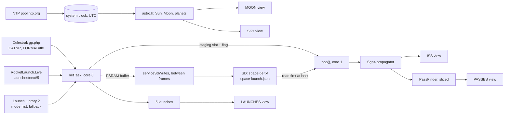
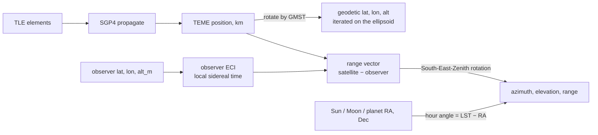
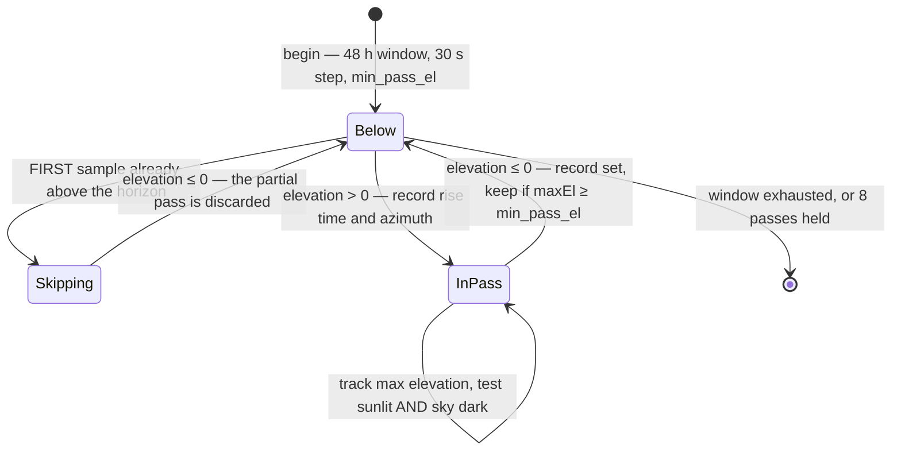
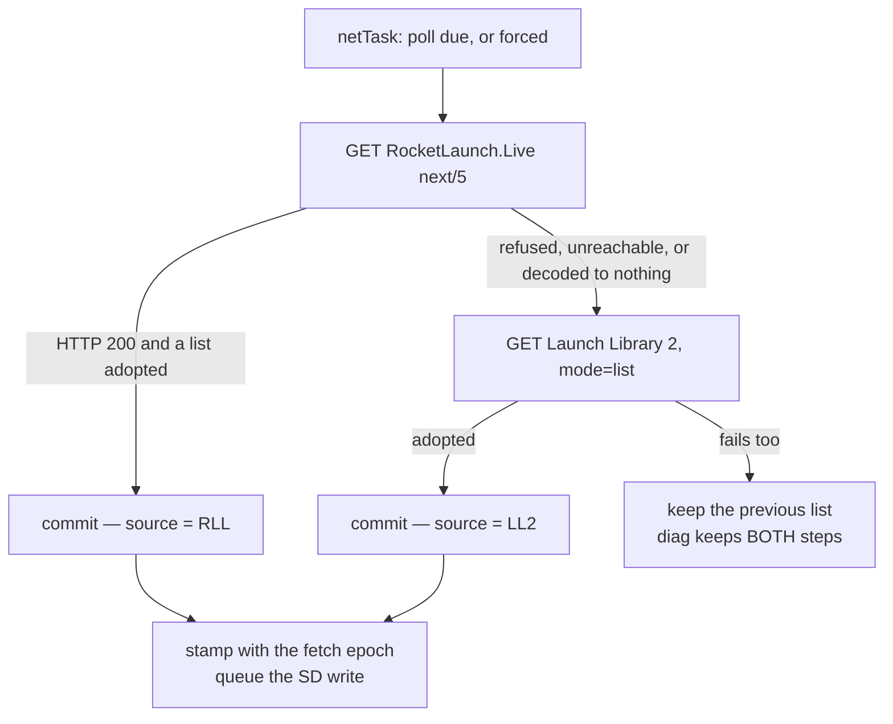

> **English** · [Français](SPACE.fr.md)

# space — the desk space instrument

Guest `.bin` for StackChan-Companion (M5Stack CoreS3). Five views on one ring: where
the **ISS** is right now, when it next crosses **your** sky, the **Moon**, the
naked-eye **planets**, and the next **rocket launches**. Launched from the SD
launcher or the API, left with a swipe down like every guest bin
(`README.md` — the SceGuest contract).

Source: `firmware/space/`. The traps the code cites by number are listed in
[The ten traps](#the-ten-traps).

---

## What is computed on board, and what is fetched

The radar **receives** its aircraft: without a network there is nothing to
show. This bin **computes**. One element set (a TLE, two 69-character lines)
fetched at most once a day is enough to place the ISS to within a kilometre and
to predict its passes for the next two days — on the microcontroller, with no
service to call. Cut the WiFi and everything except the launch list keeps
working.

| Quantity | Where it comes from |
|---|---|
| ISS position, velocity, ground track, sunlit/eclipse | computed — `sgp4.h` from one TLE |
| Pass times, azimuths, maximum elevation, visibility | computed — `astro.h::PassFinder` |
| Sun position, twilight, day/night terminator | computed — Meeus low precision |
| Moon position, phase, illumination, rise/set | computed — Meeus abridged series |
| Planet positions, elongation, az/el | computed — Schlyter's simplified elements |
| The element set itself (138 characters) | fetched — Celestrak, at most once a day |
| The launch list | fetched — RocketLaunch.Live, Launch Library 2 as fallback |
| UTC | fetched — NTP, and every view is gated on it |

The astronomy lives in two **pure** headers with native tests beside them: no
Arduino, no M5, no allocation, `<math.h>` and `<string.h>` only.

| File | What is in it | Pinned by |
|---|---|---|
| `firmware/space/sgp4.h` | TLE parsing, SGP4 near-Earth propagator | `test_sgp4` (7 cases) — including the **canonical verification vector** of Spacetrack Report No. 3 (satellite 88888, t = 0 and t = 360 min), to within 1 km |
| `firmware/space/astro.h` | GMST, Sun, Moon, planets, geodesy, look angles, Earth shadow, **umbral eclipses**, rise/set, pass search | `test_astro` (20 cases) — real dated events: the full Moon of 2024‑01‑25, the equinoxes, the elongation bounds of Mercury and Venus, the Moon's **ecliptic latitude against Meeus 47.a**, and four graded eclipses — **total 2025‑09‑07 and 2026‑03‑03, deep partial 2026‑08‑28, shallow partial 2023‑10‑28, all pinned against the full moon of 2025‑10‑07 which passes clear of the shadow** |
| `firmware/space/input.h` | the `UiEvent` vocabulary — the button **mechanics** are the shared `firmware/common/ButtonFsm.h` | `test_spaceinput` (11 cases) |

37 native cases in total. None of them was written from what the code returned:
a test written from the implementation's own output proves only that it is
deterministic.



---

## The ring, and the gestures

```
ISS       ↑ up: PASSES        ↓ down (long): back to the companion
PASSES    ↑ up: MOON          ↓ down (long): back to the companion
MOON      ↑ up: SKY           ↓ down (long): back to the companion
SKY       ↑ up: LAUNCHES      ↓ down (long): back to the companion
LAUNCHES  ↑ up: round to ISS  ↓ down (long): back to the companion
```

**The order carries the meaning**, as on the radar: the nearest object first
(a station 400 km up), then when it comes back, then the sky that needs no
instrument, then what has not left the ground yet — from the most immediate to
the most distant intent.

| Gesture | Effect |
|---|---|
| swipe **up** | next view on the ring |
| swipe **left / right** | previous / next item (a pass, a launch, a planet) |
| **tap** a pass row | its polar sky chart (modal — tap anywhere to leave) |
| **tap** on SKY | a planet, the Sun (cycles labels), the scan grid, or the panel (opens the sky map) |
| **long press** 700 ms, finger still | force a refresh of the current view's source |
| swipe **down** | back to the companion — **SceGuest's, never ours**, on every view |

**Dock mode** (`dock_s`, 0–120 s, 0 = off): parked on a desk, the views cycle
by themselves. Every manual action re-arms the delay; a modal suspends the
cycle while it is open.

### The input vocabulary

`input.h` is pure and tested, and it exists so that the touch panel, the
physical buttons of a board that has them, and the dock timer are three
**producers** of the same semantic events, with `applyEvent()` in `main.cpp`
as the single **consumer**.

- `UiEvent`: `None`, `NextView`, `PrevItem`, `NextItem`, `Back`, `Refresh`,
  `Settings`, `Select`.
- `swipeEvent(dx, dy)` — a **mapping**, not a classifier. The classification
  is `sce::gesture` (`firmware/common/Gesture.h`), shared with flight-radar and
  ha-remote: **60 px** on either axis, `|dy| ≥ |dx|` goes to the vertical axis
  (ties go to the primary navigation). This bin used 40, with no stated
  reason, while another bin's comment claimed guests do not choose their own —
  five thresholds existed across four firmwares. What stays here is the
  meaning: up is `NextView`; **down returns `None` on purpose**, because it
  belongs to SceGuest; left is `NextItem`, right is `PrevItem`.
- `isSwipe(dx, dy)` — the SAME classification, asked as a different question.
  `swipeEvent` answers `None` both for "the finger barely moved" and for "a
  direction this bin does nothing with", and a caller that reads the one as
  the other resolves a real drag as a **tap at the finger's origin**. That was
  a live bug: a downward drag of 60..99 px — past this bin's threshold, below
  SceGuest's 100 px exit — opened a pass detail or picked a planet.
- A modal does not change what a swipe means. Paging through planets inside the
  orbital modal is the same intent as paging through passes on the list behind
  it; leaving a modal is a **tap**.
- `ButtonFsm` is **not this file's**: the bank lives in
  `firmware/common/ButtonFsm.h` and is shared with flight-radar, re-exported
  here as `spa::ButtonFsm` so the callers keep saying one name. `DEBOUNCE_MS` =
  25 ms, `LONG_MS` = 700 ms — the same threshold as the touch hold. The long
  press fires **on the threshold**, so it is felt rather than waited out, and
  the release that follows is swallowed. One bank for all three buttons, at
  most one event per call, a blocked event **deferred rather than dropped**,
  the first sample adopted and announced to nobody (a button held at power-on
  must not fire its long action 700 ms into boot), and `chord(a, b)` — a query,
  not an event — which marks both buttons as having spoken. That last one is
  what makes **A+C** a debug overlay instead of a debug overlay followed by two
  stray list steps.
- `buttonEvent(button, longPress)` is a pure mapping, and it does **not**
  depend on the view — the same rule the swipes follow. Short A/B/C is
  `PrevItem` / `NextView` / `NextItem`; long A/B/C is `Settings` / `Refresh` /
  `Select`. On a view with no list (ISS, MOON) A and C simply do nothing: an
  inert button is honest, a button that silently means something else is not.
  Leaving a modal needs no button of its own, because B closes it.

The touch handler in `main.cpp` supplies the pixels: press records the origin
and the millisecond, a still finger past 700 ms (drift under 12 px, the
shared `LONG_SLOP_PX` — this bin allowed 20, which is a different gesture
wearing the same name) fires
`Refresh`, and the release is classified by `swipeEvent`. A movement under
threshold is a tap, routed by view.

---

## Reading a TLE

TLE columns are **1-indexed and fixed width**, fields may be blank-padded, and
two of them carry an *assumed* decimal point. `parseTle` works on a fixed line
and refuses anything shorter rather than reading past the end — a truncated
line off a flaky SD card is a realistic input.

| Line | Columns | Field | Conversion |
|---|---|---|---|
| 1 | 3–7 | catalogue number | must match line 2's |
| 1 | 19–20 | epoch year | pivot below |
| 1 | 21–32 | epoch day of year, fractional | `jd = JD(year‑01‑01 00:00) + (doy − 1)` |
| 1 | 54–61 | B\* drag term | assumed decimal point |
| 2 | 9–16 | inclination, degrees | × π/180 |
| 2 | 18–25 | right ascension of the ascending node, degrees | × π/180 |
| 2 | 27–33 | eccentricity | × 1e‑7 (leading `0.` assumed) |
| 2 | 35–42 | argument of perigee, degrees | × π/180 |
| 2 | 44–51 | mean anomaly, degrees | × π/180 |
| 2 | 53–63 | mean motion, revolutions/day | × 2π / 1440 → rad/min |
| both | 69 | checksum | see below |

**The assumed decimal point.** `-11606-4` means −0.11606 × 10⁻⁴ and ` 66816-4`
means 0.66816 × 10⁻⁴: the mantissa carries five implied decimals, and the
exponent's sign is embedded in the last two characters. `sliceExp` splits at
the last sign that is not the leading one, multiplies the mantissa by 1e‑5 and
applies the power of ten. A mantissa with **no digit at all** — a genuinely
zero drag term — reads 0, not 1e‑4.

**The checksum**, modulo 10 over the first 68 characters: a digit adds its
value, `-` adds 1, everything else adds nothing; the result must equal
character 69. It is verified **per line, not per pair**: a line 2 truncated by
a power cut must not disable verification on line 1, which is where the epoch
and the drag term live.

**68 characters are the data requirement**, 69 the checksum. Celestrak always
sends 69, but the canonical Spacetrack Report No. 3 test case prints its two
lines *without* the checksum digit — refusing 68 would mean refusing the one
vector that proves the propagator right.

**The epoch year pivot**: 57–99 are 1957–1999, 00–56 are 2000–2056. Sputnik is
the hinge, and 57 will mean 1957 until 2057.

**Refusals happen here**, not three layers up where the cause is invisible:
lines that do not start with `1` and `2`, a catalogue number that differs
between the two lines (a cache file interleaving two objects would otherwise
propagate a chimera), a non-positive mean motion, an eccentricity outside
[0, 1).

Julian dates use the Gregorian form valid 1901–2099, which covers every TLE
epoch this bin can meet:

```
if (month <= 2) { year -= 1; month += 12; }
A = year / 100;  B = 2 - A + A/4
JD = floor(365.25*(year+4716)) + floor(30.6001*(month+1)) + dayFrac + B - 1524.5
```

---

## SGP4, the near-Earth propagator

The **near-Earth model only** (orbital period < 225 min). That covers the ISS
(92 min) and every LEO satellite this bin will ever track. Deep-space — SDP4,
with its lunar and solar resonances and its 12-hour and geostationary orbits —
is deliberately absent: `Tle::isDeepSpace()` reports `2π/n ≥ 225 min` and the
caller **refuses** rather than drawing nonsense. That is the whole reason the
configuration says a high orbit is unsupported instead of quietly approximating
it.

**WGS-72, because that is the model the element sets are fitted to.** Using
WGS-84 numbers here is a classic silent error: "improving" the constants
degrades the result.

| Constant | Value | What it is |
|---|---|---|
| `XKMPER` | 6378.135 | Earth equatorial radius, km |
| `XKE` | 0.0743669161 | √GM, earth-radii^1.5 per minute |
| `CK2` | 5.413080e‑4 | ½ J₂ aE² |
| `CK4` | 0.62098875e‑6 | −⅜ J₄ aE⁴ |
| `QOMS2T` | 1.88027916e‑9 | (q₀ − s)⁴, earth-radii⁴ |
| `S_CONST` | 1.01222928 | s = aE + 78/XKMPER |
| `XJ3` | −0.253881e‑5 | J₃ zonal harmonic |

Reference: Hoots & Roehrich, *Models for Propagation of NORAD Element Sets*
(Spacetrack Report No. 3, 1980).

### What `init()` does, once per element set

1. **Un-Kozai the mean motion.** The TLE's *n* is a Brouwer mean value; used
   directly it puts the satellite kilometres off track. From
   `a₁ = (XKE/n)^(2/3)` and `δ₁ = 1.5·CK2·(3cos²i−1) / (a₁²β³)`, the recovered
   pair is `n₀'' = n/(1+δ₀)` and `a₀'' = a₀/(1−δ₀)`.
2. **Fit the atmospheric drag.** Below 156 km of perigee the standard `s` and
   `(q₀−s)⁴` are re-fitted from the actual perigee height, and below 98 km they
   are clamped. Satellites that low are days from re-entry, but the branch must
   exist or the powers below go negative and produce NaN. A perigee under
   220 km also sets the **simplified flag** `isimp`, which drops the higher
   drag terms.
3. **Build the drag coefficients** C1…C5, `η`, and the long-period coefficients
   `xlcof`/`aycof` from the J₃ term.
4. **Compute the secular rates** of mean anomaly, argument of perigee and node
   from J₂, J₂² and J₄:
   `Ṁ = n₀'' + ½·temp1·β·(3cos²i−1) + …`,
   `ω̇ = −½·temp1·(1−5cos²i) + …`,
   `Ω̇ = −temp1·cos i + …`.
5. When not simplified, build the `d2`/`d3`/`d4` and `t3cof`…`t5cof` drag
   polynomial terms.

### What `propagate(tsince)` does, per call

`tsince` is **minutes from the element-set epoch**, and negative is legal — the
ground track propagates 50 minutes backwards with the same call.

- **Secular update**: mean anomaly, argument of perigee and node advance
  linearly; drag shrinks the semi-major axis (`tempa`), bleeds eccentricity
  (`tempe`) and adds to the mean longitude (`templ`), with the higher powers of
  time only when the orbit is not the simplified case.
- **Failure is reported, not hidden**: a decayed element set drives `e` out of
  range, and `e < 1e‑6`, `e ≥ 1` or `a < 1` earth radius returns `ok = false`
  rather than a NaN position that renders as a dot at the pole.
- **Long-period periodics** from J₃ give `axn`, `ayn` and the corrected mean
  longitude.
- **Kepler's equation** by Newton–Raphson, at most 10 iterations, converged
  at |f| < 1e‑12, with the step **clamped to ±0.95**. The unbounded form
  oscillates for near-parabolic corrections; the clamp is what makes it
  converge in about five passes.
- **Short-period periodics** correct radius, argument of latitude, node and
  inclination by the J₂ terms — the `rk`, `uk`, `xnodek`, `xinck` of the
  reference implementation.
- **Orientation vectors** turn (radius, argument of latitude, node,
  inclination) into a position and a velocity; the position is scaled by
  `XKMPER` to kilometres and the velocity by `XKMPER/60` to km/s.

The output frame is **TEME of date** (True Equator, Mean Equinox) — the frame
SGP4 natively works in. Do not feed those coordinates to a J2000 routine
without converting.

**`double` is software-emulated on the ESP32-S3** (its FPU is single-precision
only) and SGP4 genuinely needs the mantissa. So every caller propagates **on
demand** — 1 Hz for the live view, sliced batches for the pass search, a cached
ground track — and never once per frame, which would blow the 33 ms budget.

---

## From a state vector to a place in the sky



**Greenwich Mean Sidereal Time** is the hinge of every Earth-fixed conversion;
an error here rotates the whole world under the satellite. With `d = JD −
2451545.0` and `T = d/36525`:

```
GMST° = 280.46061837 + 360.98564736629·d + 0.000387933·T² − T³/38710000
```

**ECI → geodetic** is iterative because the Earth is an ellipsoid (WGS‑84 here:
`a = 6378.137 km`, `f = 1/298.257223563`, `e² = f(2−f)`). The first-pass
spherical latitude is off by up to 0.19°, which is 20 km of ground track. Eight
iterations of `lat = atan2(z + a·C·e²·sin lat, √(x²+y²))` converge in about
four. Longitude is `atan2(y, x) − GMST`. Altitude uses `r/cos(lat) − a·C`,
except past |lat| = 89.5° where the cosine vanishes and the polar form
`|z| − a(1−f)` is used instead — the satellite does cross high latitudes.

**Observer → ECI** uses the local sidereal angle `θ = GMST + longitude` and the
same ellipsoid: `rc = (a·C + alt)·cos(lat)` in the equatorial plane,
`(a·S + alt)·sin(lat)` along the axis, with `S = C(1−e²)`.

**Look angles** rotate the range vector into the classic **South-East-Zenith**
frame, then

```
range = |r|,  elevation = asin(z_SEZ / range)
azimuth = wrap360(atan2(−e_SEZ, s_SEZ) + 180°)      // 0 = North, 90 = East
```

**Distant objects** (Sun, Moon, planets) go through their right ascension and
declination instead: hour angle `H = LST − RA`, then the standard

```
elevation = asin(sin φ sin δ + cos φ cos δ cos H)
azimuth   = wrap360(atan2(−sin H cos δ, cos φ sin δ − sin φ cos δ cos H))
```

Parallax is ignored there, which is exact for everything but the Moon, whose
~1° parallax is below this bin's display resolution.

**One frame note, stated so nobody improves the wrong term.** SGP4 returns
TEME; the Sun/Moon/planet routines return equatorial coordinates *of date*. The
two differ by the equation of the equinoxes — at most ~1.1 arcsecond of right
ascension. Every consumer here displays degrees (an azimuth chip, a 3 px dot on
a 320 px map, a rise time to the minute), so they are treated as the same frame
and the error stays four orders of magnitude below the smallest thing drawn.
Do not carry that shortcut into anything that points a telescope.

**The precision budget**, for the same reason:

| Routine | Error | Model |
|---|---|---|
| Sun | ~0.01° | Meeus low precision |
| Moon, longitude and distance | ~0.05° | Meeus abridged, 7 longitude terms |
| Moon, latitude | ~0.002° | Meeus abridged, 8 terms — the eclipse depends on it |
| Planets | ~0.05° | Schlyter's simplified Keplerian elements |

A pass rise time is therefore good to a few seconds, and a Moon phase
percentage to well under one point. That is the resolution of the screen.

---

## The Sun, the Moon, the planets

### Sun

Meeus low precision, with `n = JD − J2000`:

```
L = 280.460 + 0.9856474·n            (mean longitude)
g = 357.528 + 0.9856003·n            (mean anomaly)
λ = L + 1.915·sin g + 0.020·sin 2g   (ecliptic longitude)
ε = 23.439 − 0.0000004·n             (obliquity)
RA  = atan2(cos ε · sin λ, cos λ)
Dec = asin(sin ε · sin λ)
R   = 1.00014 − 0.01671·cos g − 0.00014·cos 2g   (AU)
```

`sunAltDeg` is that position run through the look-angle routine. The threshold
that matters throughout the bin is **−6°, civil twilight**: above it the sky is
too bright for a satellite pass to be visible, and the SKY view calls its
planets "daylight".

### Is the satellite in sunlight?

A **cylindrical Earth-shadow** test — one dot product and one norm instead of a
cone geometry. With **u** the unit vector to the Sun and **s** the satellite
position, `proj = s·u`. If `proj > 0` the satellite is on the sunward
hemisphere and lit. Otherwise it is lit only when its distance from the
Sun–Earth axis, `|s − proj·u|`, exceeds the Earth's radius. The penumbra this
ignores is a few seconds of a pass, which is well inside a VISIBLE/radio
verdict.

### Moon

Meeus chapter 47, abridged — but **not uniformly**: the seven largest
longitude terms, **eight** in latitude, four in distance. With
`T = (JD − J2000)/36525` and the five arguments

```
L' = 218.316 + 481267.8813·T    (mean longitude)
M  = 357.529 + 35999.0503·T     (Sun's anomaly)
M' = 134.963 + 477198.8676·T    (Moon's anomaly)
D  = 297.850 + 445267.1115·T    (elongation)
F  =  93.272 + 483202.0175·T    (argument of latitude)

λ = L' + 6.289 sin M' + 1.274 sin(2D−M') + 0.658 sin 2D
       + 0.214 sin 2M' − 0.186 sin M − 0.114 sin 2F
β = 5.128122 sin F        + 0.280602 sin(M'+F)
  + 0.277693 sin(M'−F)     + 0.173237 sin(2D−F)
  + 0.055413 sin(2D−M'+F)  + 0.046271 sin(2D−M'−F)
  + 0.032573 sin(2D+F)     + 0.017198 sin(2M'+F)
Δ = 385001 − 20905 cos M' − 3699 cos(2D−M') − 2956 cos 2D − 570 cos 2M'   km
```

converted to right ascension and declination through the same obliquity.

**Why the latitude series is twice as long as the others.** Longitude and
distance only ever place the disc and name the phase, where a twentieth of a
degree is three orders of magnitude below the 140 px circle being drawn.
Latitude also decides whether the Moon enters the Earth's shadow, and that
verdict turns on about a quarter of a degree — so the same abridgement that is
generous for the drawing is disqualifying for the eclipse. Four terms carried
an error of **0.12°**, measured against Meeus's own worked example 47.a
(1992 April 12.0 TD, β = −3.229126°), and the `2D−F` term carried the sign
opposite to table 47.B. Graded against the NASA canon, that series called
**five of the eight umbral eclipses of 2023–2028 wrong**; with these eight
terms, all eight are right. `test_astro` pins the latitude directly against
that reference, so the defect has a witness where it lives rather than only in
the verdicts downstream.

**Elongation from the Sun drives both the phase name and the terminator**:
`elong = λ − λ☉`, waxing below 180°, and the age is `elong/360 × 29.530588853`
days (the mean synodic month).

**Illumination comes from the true phase angle**, not from the elongation
directly: at quarter the two differ by ~0.2°, a visible tenth of a percent on
the readout. With `ψ = acos(cos β · cos(λ − λ☉))` the geocentric elongation and
`R` the Sun's distance in km,

```
phase angle i = atan2(R·sin ψ, Δ − R·cos ψ)
lit fraction  k = (1 + cos i) / 2
```

**Phase names** are eight bins of 45° centred on the named phases, so "first
quarter" covers 90° ± 22.5° as an observer would say it.

### Planets

Schlyter's simplified Keplerian elements, Mercury through Neptune. The day
number is **`d = JD − 2451543.5`**, counted from 1999‑12‑31 00:00 UT and *not*
from J2000 noon; mixing the two epochs is a half-day error, i.e. a planet half
a degree off, so the constant lives in one place.

The element table is in **one** function, `planetElements`, read by both the
geocentric and the heliocentric routine — two copies of Schlyter's constants
would be exactly the divergence the project's shared-parser discipline (A2.23)
exists to end. The five inner entries have a constant semi-major axis; **Uranus
and Neptune have an `a` that drifts with the epoch** (`19.18171 − 1.55e‑8·d`
and `30.05826 + 3.313e‑8·d`), and dropping that term to match the others costs
thousands of kilometres a decade.

Per planet: Kepler's equation is solved in **degrees** (Schlyter's convention)
by Newton iteration, at most 12 passes, converged at 1e‑9. From the eccentric
anomaly come the orbital-plane coordinates, the true anomaly and the radius,
then the heliocentric rectangular coordinates through the node, inclination and
argument of perihelion.

**Earth's own position comes from the Sun's**: they are the same vector with
opposite signs, so no second element set is needed. `earthHelio` returns
Earth's heliocentric longitude and radius; `planetPosition` reads it back,
subtracts 180° to recover the Sun's geocentric longitude, and adds that vector
to convert heliocentric → geocentric in one step. The result is rotated by the
obliquity `23.4393 − 3.563e‑7·d` into equatorial coordinates.

`planetHelio` returns what a top-down orrery needs: longitude and radius
**projected onto the ecliptic plane**. The largest inclination in this set is
Mercury's 7°, under a pixel at the scale the screen draws.

**`planetAid`** says what it takes to actually see a planet: 0 = naked eye,
1 = binoculars (Uranus, magnitude ~5.7), 2 = telescope (Neptune, ~7.8). Fixed
per planet rather than derived from a live magnitude: Uranus varies by a tenth
of a magnitude over its orbit and never crosses into naked-eye territory from a
real sky, so a computed value would add arithmetic without changing a single
answer. Hiding the outer two would be one kind of lie; listing them as if they
were Jupiter would be another.

### Rise and set of a slow object

`findRiseSet` is deliberately generic and dumb: **scan then bisect** over a
bounded window. The scan steps 20 minutes — these objects move less than a
degree an hour, so a crossing cannot be missed — and any sign change of
`altitude − h0` brackets a crossing, which 14 bisections resolve to about a
tenth of a second. `h0` is the horizon altitude: 0 for a point source, **−0.833°**
for a body whose limb and refraction matter. It stops as soon as it holds both
a rise and a set.

---

## Finding the passes

A 48-hour search at a 30-second step is thousands of SGP4 calls in software
`double` — hundreds of milliseconds, which run in one go would blow the frame
budget and starve touch polling. So `PassFinder` is a **sliced state machine**:
`loop()` calls `step(40)` and asks `done()`. Nothing in it allocates or blocks,
and `progress()` drives a bar rather than a frozen "computing".



**The first-sample guard is the subtle part.** If the satellite is already up on
the very first sample, this is not a rise — it is the middle of a pass joined
late. Recording the start instant as the rise time would publish "rises now,
bearing wherever it happens to be" as fact, which the table prints and the
polar chart draws an arc from. That partial pass is skipped until the satellite
next goes below the horizon.

**`VISIBLE` requires three things at the same sampled instant**: elevation above
`min_pass_el`, the satellite **sunlit** (the cylindrical shadow test), and the
observer's Sun below **−6°**. Anything else is `radio`: the ISS is above your
horizon, but you cannot see it. Those are two different events, and a list that
conflated them would send you outside for nothing.

At most `MAX_PASSES = 8` are held; a pass whose maximum elevation never reaches
`min_pass_el` is dropped.

`loop()` owns when a search runs: `startPassSearch` fires when there is no
result yet, when the last search is more than **6 hours** old, when the list has
been spent (`firstUpcomingPass` finds nothing in the future), when a new
element set is adopted, and when the settings are saved — the observer may have
moved. **A list of future events must never contain the past**, so the ISS view
never reads index 0 but the first pass whose set time is still ahead.

---

## The five views

### ISS — the world map

Equirectangular (plate carrée) projection, **edge to edge**: `MAP_X = 0`,
`MAP_Y = 18`, 320 × 160, so the map runs from just under the header to the data
rows at y = 178. The mapping is one line each way and it must match the
generator's exactly:

```
x = (lon + 180) / 360 × 320        y = (90 − lat) / 180 × 160
```

**The day/night terminator is recomputed every frame, column by column.** The
subsolar point is the Sun's declination and `wrap180(RA − GMST)`. The
terminator is the great circle 90° from it, so at a given longitude it sits at

```
lat_term = atan( −cos(lon − lon_sub) / tan(lat_sub) )
```

Which side is dark follows from the Sun's hemisphere alone — with the Sun north
the lit half is the northern one and night lies south of the terminator, and
vice versa. At the equinoxes `tan(lat_sub) → 0` and the terminator *is* a
meridian: that branch is tested explicitly (`|tan| < 1e‑4`) and a column is then
entirely day or entirely night, because dividing there would give an infinite
latitude. Each column is emptied as at most two vertical runs through a single
`drawFastVLine` call site.

**The coastline** is blitted from the generated 1-bit mask. Whole empty bytes
are skipped, so the 51 200 pixels cost 6 400 reads and about 3 200 plots — the
shoreline is about 6 % of the map. Each inked pixel takes the night ink or the
day ink depending on which side of the terminator its row falls. The fill says
exactly ONE thing (where the Sun is) and the outline says the other (where the
coasts are); a filled continent would make the eye separate "land or sea" from
"lit or dark" inside the same block of colour.

A deliberately faint graticule marks only the equator and the prime meridian —
the two lines a shoreline does not already say.

**The ground track is cached.** 101 samples at one-minute spacing, −50 to +50
minutes, each one an SGP4 propagation *and* an iterative geodetic conversion in
software `double`. Recomputing that every frame inside the same body that also
fills 320 columns is exactly what the propagator's own header forbids. It is
rebuilt when the cache is older than **20 seconds** — the ISS moves half a pixel
in 500 ms, so 20 s is about twenty pixels, one rebuild for forty frames — and
redrawn from the cache in between. The **marker** still moves every frame; it
costs the one propagation the view genuinely needs live.

Two details make the polyline work where dots did not:

- **the date line.** Consecutive samples straddling ±180° are adjacent on the
  globe and at opposite edges of the screen. A horizontal jump wider than half
  the map is a wrap, and the segment is skipped rather than drawn as a bar
  across the whole world.
- **past versus future.** The same path in two weights: where the station has
  been is faint, where it is going is the accent colour, so the direction of
  travel reads at a glance.

**The station** is a 5 × 5 square inside a 9 × 9 ring — filled in the accent
colour when **sunlit**, in the secondary colour when in **eclipse**. **The
observer** is a small cross at your `lat`/`lon`.

Under the map, one datum per row: name and sub-satellite point; altitude, speed
(the norm of the velocity vector) and sunlit/eclipse; then the next pass with
the time remaining, or the search progress while one is running.

**Past 14 days the element set is greyed, not hidden**: the track and the marker
drop to the dim ink and the footer says `STALE element set` with the age. By
then SGP4 has drifted by tens of kilometres. Refusing to draw would be as wrong
as drawing confidently.

### PASSES — when to go outside

Up to six rows of the pass list: date, rise time and azimuth, maximum
elevation, set time — then, on a second line, the chip and the duration with
the setting compass point. Header and values share **one** set of column
origins (8, 92, 134, 172, 206), so nothing can drift.

The chip on the left is the point of the whole view: **`VISIBLE`** in the accent
colour, `radio` in the dim one, on the rule given above.

**The pass profile** occupies the 64 px the table leaves at the right of each
row. A column reading "42" tells you the maximum elevation; an arc drawn to
42/90 of the dome's height tells you it at a glance *and* compares it with the
row above without reading either. It is sampled as a parabola through (rise,
horizon), (max, peak), (set, horizon) —

```
y = base − 4 · peak · u · (1 − u),  u from 0 to 1 across the pass
```

— because the real curve is a great circle seen in elevation and at 64 px wide
the difference is under a pixel. The arc repeats the VISIBLE/radio colour, so
the two facts that decide whether you go outside are one shape.

**Tap a row for its polar chart** (modal, centre 160/128, radius 92): north up,
**east on the RIGHT** — this is the sky seen by someone *looking up*, which is
the mirror of a ground map and the single most common way to get a polar chart
wrong. Rings mark 30° and 60° of altitude. The pass is sampled at 61 points
between rise and set and projected with

```
r = R · (90 − elevation) / 90
x = cx + r·sin(azimuth)      y = cy − r·cos(azimuth)
```

Rise, maximum and set are marked larger, and the caption gives the times, the
maximum elevation and the two compass points.

Passes below `min_pass_el` (default 10°) are not listed: below that the
satellite is in the roof line.

### MOON

**The Sun–Earth–Moon diagram** takes the left two-thirds of the screen: half a
Sun flush against the left edge, an arc of Earth's orbit, Earth as a disc on
that arc, and the Moon on its own orbit at its **true elongation**. Running the
Sun off the frame is the one true thing a diagram at this scale can say about
it — a whole disc with a margin would claim it is a nearby object of that size.
Nothing is to scale and nothing needs to be: the **angle** is the only claim,
and the angle is exact.

Elongation 0 (new) puts the Moon between us and the Sun, so on the **left** of
Earth; 180 (full) puts it behind us, on the right — hence the sign on the
cosine when the Moon is placed at `MORB_R` from Earth's centre.

Two routines draw a lit body, and each answers a different question:

- **`drawLitBody`** — a body lit on the hemisphere facing the Sun, used for
  **Earth and the Moon alike** in the diagram. The split is the line
  perpendicular to the Sun direction through the centre, solved per scanline
  as `x = −(dy·u_y)/u_x` and clamped to the disc; when the Sun is almost
  straight above or below, `u_x` vanishes and the whole row falls on one
  side. It **tilts** as the geometry does — a fixed vertical split would be
  right only at the quarters. Seen from above, the Moon is *always* exactly
  half lit, and a diagram whose one claim is the angle cannot take liberties
  with the lighting that angle causes; the phase as seen from Earth keeps its
  two homes, the strip below and the big percentage.
- **`drawMoonDisc`** — the phase as a plain disc, used by the eight thumbnails
  and by the Moon on the sky map. The terminator is the ellipse `x = s·c` with
  `s = 1 − 2k` waxing and `2k − 1` waning; that single signed number covers
  crescent (s > 0) and gibbous (s < 0) alike, which is what makes a gibbous
  moon look gibbous instead of bitten. Both spans are derived from the **same**
  half-width, computed with a rounded rather than truncated square root, so a
  bright one-pixel rim on the dark limb is arithmetically impossible rather
  than merely unlikely.

**Umbral eclipses render as they happen.** `moonInfo` publishes two fields for
it: `betaDeg`, the Moon's **ecliptic latitude**, and `eclipse`, which is 0, 1
or 2. The test is one angular separation at the **anti-solar point** — the
small-angle hypotenuse of "how far past full" and that latitude — measured
against the Earth's umbra:

```
sep   = √( (elong − 180)² + β² )
umbra = 1.02 · (π_moon − sd_sun + π_sun)          Meeus, ch. 54
sep < umbra − sd_moon  →  2, total      (the whole disc fits inside)
sep < umbra + sd_moon  →  1, partial    (the disc merely overlaps)
```

**`β` is the whole point.** Without it every opposition would be an eclipse,
which is exactly why full moons usually miss: the Moon's orbit is tilted, and
most full moons pass above or below the shadow rather than through it. The
1.02 factor is the standard allowance for the Earth's atmosphere.

**Only the umbra is modelled.** A penumbral eclipse dims the Moon by an amount
nobody notices without a photograph, so reporting one would spend the reader's
attention on a fact their eyes cannot check.

During a **total** eclipse the diagram Moon goes **copper** (the refracted-light
colour of a blood moon, deliberately theme-independent — this is the physics,
not the chrome, and it has to read as "not the normal Moon" under every theme);
during a **partial** one the geometry is left alone and the ring around the Moon
carries the copper instead. Either way an `eclipse` row — *total* or *partial* —
**leads** the fact column while it lasts: for the next few hours it outranks
everything else on the page.

**Solar eclipses are deliberately not flagged.** They are a narrow ground track,
and a geocentric figure claiming one for *this* observer would usually be wrong.

The rule is pinned natively (`test_astro`): the total eclipses of 2025‑09‑07 and
2026‑03‑03 come out umbral, and the full moon of 2025‑10‑07 — over 98 % lit,
passing some 2.5° above the shadow — comes out clear. That last case is the
discriminant: anything that flags a full moon as an eclipse fails it.

**The figures** run down the right column, which fills its whole 124 × 162
frame: the phase name, the lit percentage at **triple** size — the one number
anyone came for — a short cyan→indigo bar in the companion's own ramp, then
**the next milestone**: *full moon ~ 3 d*, or *new moon* when the Moon is
waning — whichever actually comes next, and *tonight* under a day. That line is
the question a moon page is asked and the column never answered; it costs one
multiplication (`moonDaysToElong`, mean synodic rate — exact would need a root
search over the full series for a figure read in whole days, natively tested).
Below it, label/value rows for age, distance, rise–set for your position, and
where the Moon is right now (compass point and elevation, or "below"). The rows
are **collected and measured before any of them is placed**, so the block can
be centred in the column: a Moon that does not rise today is one row fewer, and
a layout with a fixed origin cannot know that.

Rise and set are computed **once per local day**, not once per frame:
`findRiseSet` evaluates the full lunar series about 75 times for the scan plus
28 per bisected crossing, and the two times it produces change by under an hour
a day. The cache key is the local day, so the answer changes exactly when the
row it feeds should.

**The phase strip** along the bottom is the *what next*: eight thumbnails 45° of
elongation apart, the current one ringed. The illumination of each is computed
from `(1 − cos e)/2` rather than tabulated, and they are drawn by the **same
routine** as the Moon elsewhere in the bin — two implementations would drift,
and the strip's whole job is to say "the real one is HERE". The ring is drawn
last, or a later thumbnail would paint over it.

### SKY — an orrery

A top-down map of the solar system: the Sun at the centre, one ring per planet,
each planet a dot at its true heliocentric longitude, **Earth among them** —
because the geometry this view exists to explain (why Venus is only ever a
morning or evening object, why Mars is bright some years) is unreadable without
our own position in it. Longitude 0 is to the right and increases
anticlockwise: the view from ecliptic north, the way every solar system diagram
since Copernicus is drawn.

**The radial scale is logarithmic**, and that is the real decision:

```
ring(a) = 16 + (97 − 16) · log(a/a_Mercury) / log(a_Neptune/a_Mercury)
```

Linear, Neptune's 30 AU would crush Mercury, Venus, Earth and Mars into four
pixels around the Sun — the exact region the view exists to explain. The price
is that distances can no longer be compared by eye, which is why the real ones
are printed as figures in the panel. The ring radii are taken from the
semi-major axes at J2000 so they do not breathe from frame to frame: they are a
**scale**, and the dot is what carries the live position.

**One function gives a body's position**, used by the drawing *and* by the tap
test — a hit test computed separately from the render is how a chart ends up
with dots you cannot press. Tap radius is 12 px, wider than the 4 px marker,
because a finger is not a cursor and the outer planets sit close together on a
log scale.

**The starfield is deterministic**: a fixed-seed LCG (seed `0x5EED1234`,
multiplier 1664525, increment 1013904223), 70 points, recomputed identically
every frame so the sky does not shimmer — fresh random stars at 2 Hz would
flicker and read as a fault. Points falling inside the disc are dropped, where
a stray one would be taken for an object.

**The astronomical symbols are pixel art**, 7 × 11 cells each, and they have to
be: the small font is pure ASCII and the one Unicode face in the binary is a
Japanese font with no guarantee of carrying U+263F..U+2646. A missing glyph
renders as a blank or a tofu box, which on a symbol-keyed chart means the
legend silently stops working. Drawn ourselves, they cannot go missing. The
order matches `spc::Planet`, with Earth appended.

- **Tap a planet** — the panel on the right details it: symbol, name, state,
  compass point and elevation, distance from the Sun and from us, elongation
  from the Sun, and what it takes to see it. Elongation is what *explains* an
  inner planet: Venus can never be more than about 47° from the Sun, which is
  why it is only ever a morning or evening star.
- **Tap the Sun** — cycles the chart labels: clean → names → symbols → both.
  This is a way of looking, changed in the moment, so it is UI state and not a
  persisted setting.
- **Tap the scan grid**, or swipe left/right — selects a planet.
- **Tap the panel** — opens the sky map.

**The scan grid** is seven symbols in a 4 + 3 block at the top of the panel,
tinted by **what it would take to see each one right now**: bright = your eyes
(up, sky dark, no instrument), mid = up but it needs either an instrument or a
darker sky, dim = below the horizon. Dim and not absent, so the grid keeps its
order. Three values on purpose: a two-state chip would call Jupiter "up" at
noon. The chart cannot do this job — two planets can sit at the same longitude
and tell you nothing about their altitude.

The footer counts how many planets are up in a dark sky (telescope ones
included: the question is "is there anything to point at"), or names the regime
when it is not dark — `daylight` with the Sun's height above the horizon, or
`twilight` with its depth below it.

**The sky map** is the secondary screen (centre 128/122, radius 96), the same
dome convention as the passes' polar chart and deliberately so — one convention
in the bin, learned once. North up, **east on the right**, the centre the
zenith, the rim the horizon, rings at 30° and 60° of altitude. Azimuth is
measured from north clockwise through east, so east lands on the right with
`+sin` for x and `−cos` for y. Everything above the horizon is on it, tinted by
the same three-way rule, with the Moon drawn as its **actual phase** because it
is the one object you can identify without a chart — so it doubles as your
bearing. The caption gives the selected planet's compass point, azimuth,
altitude, and that altitude in **fists**: a fist at arm's length is about 10°,
and it is the only measure you have outdoors.

### LAUNCHES

A **rocket silhouette** on its pad down the left edge — a silhouette is tall,
not wide, so it gets height rather than a wide box — and everything written in
one 212 px column beside it.

- **Across the top**: the vehicle as the headline at double size, its status
  chip at the far right of the same line.
- **The column**: `T MINUS`, the days at triple size, the clock (hh:mm:ss)
  under them, then one datum per row — local date and time with the **pad
  weather** right-aligned on the same row, mission, provider with either the
  target orbit or the booster serial, pad.
- **Along the bottom, full width**: the **horizon**. Five launches placed on a
  `log10(1 + hours)` time axis with NOW / 1d / 1w / 1M ticks — logarithmic
  because on a linear axis four markers out of five fall inside the first
  centimetre. Position carries the date, a drawn launcher carries what is
  flying, and a 7x3 pip carries whether it is confirmed. A collision pass
  pushes markers apart by at least 18 px and shifts the run back inside the
  frame.
- **Stepping through it**: swipe left/right, or **tap to the left or right of
  the selected marker**. It steps rather than aiming: the markers are placed by
  data, so they cluster, and picking one would mean looking first and then
  hitting a 10 px silhouette. A dead zone around the selection keeps a tap on
  it from stepping anywhere. The footer says so, since nothing about a row of
  silhouettes suggests it.

The countdown **ticks locally** between polls, which is why the poll can be as
slow as the API demands without the screen looking frozen. A negative delta is
shown with a leading `+`.

The horizontal rules say where one question stops and the next begins: identity
above, the launch you selected in the middle, everything else coming below.

**The silhouette is a shape, not a picture**, and that is deliberate: bitmaps
would mean one asset per vehicle, embedded or fetched, stale the day a new
rocket flies. `rocketFamily()` lowercases the vehicle string and matches it
against ten profiles, **order-sensitive** because "falcon heavy" contains
"falcon":

| Profile | Matched on | Drawn as |
|---|---|---|
| `3x core` | `heavy` | three cores side by side |
| `2 fat stages` | `starship`, `super heavy` | two equal fat stages, forward and aft flaps, no fairing |
| `wide body` | `new glenn` | fat core, fairing continuous with the body |
| `4 strap-on` | `soyuz` | conical boosters tapering to points at about half height |
| `crew stack` | `sls`, `space launch system` | tall boosters, abort tower and capsule instead of a fairing |
| `6 strap-on` | `pslv` | six short solids clustered low, reading as a skirt |
| `4 boosters` | Long March 2F/3B/3C/5/7/6A, `gslv`, `angara a5`, `proton` | two boosters in front, two narrower behind in the shadow colour |
| `light` | `electron`, `alpha`, `vega`, `epsilon`, `sslv`, and others | 15:1 body, small ogive fairing, no legs |
| `2 boosters` | `ariane`, `atlas`, `vulcan`, `h3`, `h-iia`, `lvm3`, `delta`, Long March 8 | core plus two slim boosters two-thirds of the way up |
| `single core` | everything else | Falcon 9 shape: grid fins and landing legs |
| `not announced` | `unconfirmed`, `unknown`, `tbd`, or an empty vehicle — **matched FIRST** | **not a silhouette**: a dashed outline. RocketLaunch.Live returns "Unconfirmed Vehicle" for a launch whose vehicle has not been named — common for CASC missions, where the Long March variant is settled days ahead. Falling through to `single core` would draw a rocket as confidently as the Falcon 9 beside it, for something nobody has announced |

The match is made on the **rocket configuration** rather than the mission name,
since "Starlink Group 10-4" says nothing about the vehicle; the mission name is
only the fallback when no vehicle string arrived.

The proportions come from published dimensions, rounded to what a 96 px
silhouette can express. Core width is a fraction of height, straight from each
vehicle's fineness ratio: h/15 for the light profile, h/12 by default, h/8 for
the wide body, h/6 for the two fat stages. The fairing is drawn **wider than
the core** on most profiles (Falcon 9 is 5.2 m over 3.7) — drawing it flush is
the commonest way a rocket sketch looks wrong. Engine bell count is the
vehicle's real one. The family name is printed under the drawing: a silhouette
teaches nothing if you cannot say what you are looking at. A service tower
beside it gives the ground and the scale, so a stubby Starship and a slim
Electron read as different sizes rather than different drawings.

**Status colours** follow Launch Library's `abbrev` vocabulary: `Go`,
`Success` and `In Flight` in the accent colour, `Hold` in amber, `TBC`/`TBD`
and anything unrecognised dimmed — a launch that is not confirmed should not
look like one that is. RocketLaunch.Live publishes no such field, so its entries
are graded from what it *does* say: an `est_date` carrying a year means the
date is an estimate (`TBD`) whatever the `t0` beside it looks like; otherwise an
exact `t0` is `Go` and a `win_open` alone is `TBC`.

**Pad weather** is published by RocketLaunch.Live only, so the row simply
carries less when the fallback served. Condition, temperature and wind are
parsed independently and any one of them is enough to draw the group. It
arrives imperial — the source is American — and is converted at **display** time
like every other unit here, so the stored value stays the one the API
published. Colour keys on the condition string: clear is a go, rain, storm,
snow, thunder and fog are the alert colour, everything else neutral.

Past an hour, the footer says **`as of hh:mm`**. A T‑0 slips; a stale countdown
presented as live is the one lie this view could tell. The other footer, at the
right, **names the source that served** — required by RocketLaunch.Live's terms,
and the honest label a failover owes the reader.

### Why the drawing code looks the way it does

Two project rules shape every view, and reading them explains what would
otherwise look like odd style.

**A2.22 — one draw call site per shape.** GCC 8.4 Xtensa is entitled to delete
the second of two similar draw calls in one function body, and a rocket that
silently loses a booster or a table that loses a column is unfalsifiable by
eye. So text is collected into a shared cell table and emptied through a single
`drawString` in `CellText::flush`; rectangles and triangles are collected into
local arrays and emptied through one `fillRect` and one `fillTriangle`; the
terminator columns go through one `drawFastVLine`. Where a second call site is
genuinely needed, it moves into its own function — and that function is marked
`__attribute__((noinline))`, because otherwise GCC folds it straight back in and
the split exists in the source but not in the binary. `scripts/gates/check-a222.py`
verifies this **in the compiled binary**.

**The 33 ms frame budget.** Everything expensive is on a timer rather than per
frame: the ground track (20 s), the Moon's rise and set (once per local day),
the pass search (40 samples per `loop()` pass), the ambient-light read (1 s),
the night-theme test (60 s). The frame itself runs at **2 Hz** — the ISS moves
15 km in half a second, which is half a pixel on the map, and the launch
countdown needs a second's resolution. Nothing here justifies 30 fps.

---

## The world map, and how it is generated

`firmware/space/worldmap.h` is **generated**, and the generator is versioned
rather than only its output: 5.7 KB of hex with no readable structure outlives
everyone who understood it, and without the script nobody can change the
resolution or explain where the shape came from.

```
curl -O https://raw.githubusercontent.com/nvkelso/natural-earth-vector/master/geojson/ne_110m_land.geojson
python tools/generators/gen-worldmap.py ne_110m_land.geojson firmware/space/worldmap.h
```

**Source**: Natural Earth 110m land polygons (public domain), the coarsest of
the three Natural Earth scales — which is the right one here: at 320 px for
360° of longitude, one pixel is 1.1° or roughly 130 km at the equator. A finer
source would be resampled away.

**Projection**: plate carrée, lon −180..180 left to right, lat +90..−90 top to
bottom — the same mapping `mapLonX`/`mapLatY` use in `main.cpp`. The two must
agree, which is why the constants are printed into the generated header.

**Rasterisation**: even-odd scanline fill. Each output row is one latitude,
**sampled at the pixel centre** (`lat = 90 − (py + 0.5)·180/H`) — sampling at
the edge puts the equator exactly on a boundary and makes the fill flip-flop by
one row. Every polygon edge crossing that latitude contributes an x-crossing;
the crossings are sorted and filled in pairs. The bracket test is **half-open**
(`lat1 ≤ lat` versus `lat2 ≤ lat`), so a vertex landing exactly on the scanline
is counted once and the parity stays right. Even-odd handles holes — the
Caspian, Lake Victoria — for free, where a winding rule would need the polygons
consistently oriented and Natural Earth does not guarantee that.

**Outline**: a land pixel with at least one sea neighbour in the
four-neighbourhood is kept, interior pixels are dropped, and the map **edge
counts as sea** so a continent running off the side still gets its coast drawn.

**Two sanity gates, and they catch whole classes of failure rather than
individual bugs.** Earth is 29 % land, so the *filled* map must come out
between 20 % and 45 % — a rasteriser that lost its parity gives 0 % or 90 %.
The outline must then be between 1 % and 12 %: zero means the edge detector
inverted, a third means it did nothing. At 320 × 160 the shipped mask carries
**3163 of 51 200 pixels, 6.2 %**.

**Output format**: 1 bit per pixel, row-major, MSB first inside each byte, 40
bytes per row, 6400 bytes in PROGMEM. The header also emits
`worldIsLand(px, py)`, bounds-checked because the caller loops over the map
rectangle and an off-by-one there would read past the array.

---

## Where the data comes from, and what it costs

| Source | What | Cost | The rule we follow |
|---|---|---|---|
| **Celestrak** | one TLE, `gp.php?CATNR=<norad>&FORMAT=tle` | free, no key | **at most once a day**, cached to `/stackchan-companion/space-tle.txt`. Their etiquette is explicit and they ban abusers. The cache is read at boot, the network only touched when it is stale |
| **RocketLaunch.Live** | next 5 launches — **primary**, `/json/launches/next/5` | free, **no key**, no published limit | **credit required and displayed**: "Data by RocketLaunch.Live". Every field is its own key — `vehicle.name`, `provider.name`, `pad.name` + `pad.location.name` — so the vehicle the silhouette is chosen from is never recovered by splitting a display string. It alone carries **pad weather** |
| **Launch Library 2** | next 5 launches — **fallback**, `/2.2.0/launch/upcoming/` | free, **throttled to 15 requests/hour** | poll floor **15 min**, default 30. `mode=list` shrinks the body from ~300 KB to ~15 KB. It packs vehicle and mission into one `name` field joined by a space-bar-space separator, so the vehicle has to be split back out; it alone carries the target **orbit** |
| **NTP** | UTC (`pool.ntp.org`, offset 0) | — | every view is gated on a synchronised clock. An astronomy display with a wrong clock is not degraded, it is **wrong** |

Everything else — position, ground track, passes, Moon, planets — is computed
on board and costs nothing but arithmetic.

### One fetch helper

`httpGet` serves both sources: 8 s connect timeout, **15 s stream timeout** (a
slow body over weak WiFi truncated at 8 s reports as a parse error, which sends
everyone looking at the parser), a declared `User-Agent`, a size cap checked
against `Content-Length` before anything is read, and the body written through
**`writeToStream`**.

`writeToStream` is the point. `HTTPClient` only **de-chunks** through it;
`getStream()` hands back the raw socket, chunk-size lines and all. Launch
Library answers `Transfer-Encoding: chunked`, so the raw body starts
`13ea\r\n{...`, which a JSON parser reads as the number 13, stops, and returns
success on a document with no results — a blank list with no error anywhere.
The sink writes into PSRAM (project rule 18: large JSON never takes the
internal heap that WiFi and AsyncTCP need) and reports its own overflow.

### The launch failover



The fallback is **not** tried after a good answer, so the normal cycle is one
request. `launchTry` returns true only when a list was actually **adopted**: an
HTTP 200 that decodes to nothing must fall through, not leave the screen empty
with a green light. The diagnostic string **appends** on the way to the second
source rather than overwriting — wiping it would destroy the only remote
evidence that the first one stopped serving, which is precisely the situation a
failover creates. It is readable from `/config` as `diag`, and it carries the
body size verbatim: the robot and a PC do not necessarily get the same answer
from a CDN.

The two sources are told apart **by the shape of the answer**, not by a flag
stored beside it: Launch Library nests under `results`, RocketLaunch.Live under
`result`. That is what lets the SD cache stay a verbatim copy of whichever body
worked — a cache needing its own format field would be a third thing to keep in
step, and one decoder serves the network path and the cache path alike.
`"results"` is tested **first**: `"result"` is a prefix of it, and
RocketLaunch.Live also uses a per-entry `result` key for the flight outcome.

Time parsing accepts a **missing seconds field**: RocketLaunch.Live writes
`2026-08-05T02:35Z`, so a scan demanding six fields would fail and land every
T‑0 at zero. Five fields are enough. RocketLaunch.Live's `sort_date` — a unix
epoch, filled even when the date is an estimate — is what the countdown stands
on; `t0` and `win_open` are read only to judge how firm that time is.

### The caches, and their freshness rules

Both live in `/stackchan-companion/` beside the companion's `config.yaml` and the
radar's yaml: one directory, one place to look.

- **`space-tle.txt`** is the three lines as Celestrak served them. It is read at
  boot and shown at once, and it is **keyed to the satellite**: a cache whose
  catalogue number is not the configured `norad` is ignored, or changing the
  tracked object would leave the previous one propagating under the new number.
  Its freshness stamp is the **element-set epoch** — what we actually know about
  it — so a bin that booted from the card still knows the set is old and still
  fetches. A network refresh is due when there is no element set at all, or the
  stamp is more than **one day** old, and at most once an hour; a forced refresh
  is allowed once a minute.
- **`space-launch.json`** is the body that worked, prefixed by a line carrying
  the **fetch epoch in decimal**. That line costs eleven bytes and closes two
  holes: the "as of hh:mm" footer is gated on the fetch time, so a list read
  from the card would otherwise be shown as live however old it was; and the
  poll is due **by the age of the data**, not by the age of the boot, so
  restarting the bin does not cost a request. The cache is refused above 96 KB.

Refresh cadence: `netTask` wakes every 2 s, does nothing without a synchronised
clock and a connection, and applies the rules above. A long press forces a
refresh — bounded to one a minute for the TLE and one per 15 minutes for the
launches, so the gesture cannot be used to hammer either API.

### The thread model, and why SD writes are deferred

`netTask` is pinned to **core 0** with a 16 KB stack (one TLS session plus
ArduinoJson overflows the 8 KB of the Arduino loop task); the drawing runs on
**core 1**. They are genuinely parallel, so:

- **The live element set is `loop()`'s, and only `loop()`'s.** `netTask` parses
  into a **staging slot** and raises a flag; `loop()` swaps it in between
  frames. Assigning it directly would be a ~350-byte memberwise copy of doubles
  racing the drawing code — no crash, because the propagator rejects divergent
  cases, but a ground track in the wrong ocean, and worse, a pass search that
  caches a pointer to it and steps it for seconds would mix two orbits into a
  48-hour list displayed as fact. When a new set is adopted, the ground-track
  cache and the pass list are invalidated and an open polar chart is closed —
  the pass it was drawing is about to stop existing.
- **SD writes are deferred to `loop()`.** SD and the LCD share SPI2, which is
  the whole reason the companion has a pause rule around SD access. `netTask`
  parks the body in PSRAM and `loop()` writes it between frames, which is the
  one moment nothing is on the bus. Two slots, one for each cache; a slot being
  refilled frees the previous buffer, and a failed allocation simply skips the
  cache rather than stalling.
- **The status line is guarded like everything else.** It is written from both
  cores and read by the frame, it is **copied out under the lock** so the frame
  draws a whole message or none, and it **expires**: a transient hint lives ten
  seconds, an error two minutes — long enough to be read, short enough that the
  view gets its own footer back.

### TLS

**Certificates are not verified** (`setInsecure`): there is no CA bundle on the
card and no clock at the moment of the first fetch. The threat this accepts is
a local network attacker feeding a false element set, whose effect is a dot in
the wrong place on a hobby display. Do not copy that trade-off into anything
that authenticates.

---

## Configuration

`/stackchan-companion/space.yaml` on the card — flat file, the project's canonical
parser (`firmware/common/Yaml.h`, rule A2.23). Also editable at
`http://<ip>/config`, which is where the settings live: this bin has **no touch
settings panel**, deliberately. Bounds are applied at the point of entry, so no
other code has to wonder.

| Key | Default | Range | Meaning |
|---|---|---|---|
| `lat` / `lon` | 48.8566 / 2.3522 | ±90 / ±180 | the observer. **This bin reads its own yaml**, never the companion's |
| `alt_m` | 35 | 0–5000 | observer altitude, metres (used in the look angles) |
| `tz_offset_h` | 0 | ±14 | display offset from UTC in DECIMAL HOURS (Réunion 4, India 5.5, Nepal 5.75, Chatham 12.75). Everything internal is UTC; the offset is applied at display time exactly once |
| `norad` | 25544 | 1–99999 | tracked satellite. **Any near-Earth object works** — Hubble is 20580, Tiangong 48274. Changing it drops the element set, the pass list and the cache stamp, and forces a fetch |
| `min_pass_el` | 10 | 0–60 | a pass whose maximum elevation stays below this is not listed |
| `launch_poll_min` | 30 | 15–240 | launch poll period. The floor is the **slowest source's** published throttle: setting 1 would get the bin rate-limited the moment the primary failed over, and an empty list looks like a parser bug. The old name `ll2_poll_min` is still accepted |
| `dock_s` | 0 | 0–120 | auto-cycle seconds per view, 0 = off |
| `bright` | 110 | 10–255 | screen brightness. Setting it **by hand turns `auto_bright` off**, or the sensor would overwrite the slider within the second |
| `theme` | 0 | 0/1 | 0 = Deep, 1 = Night (amber) |
| `auto_night` | 1 | 0/1 | switch to Night at your real dusk (the project's shared NOAA test at −0.833°), not a fixed hour. A manually chosen Night theme survives daylight |
| `auto_bright` | 1 | 0/1 | screen brightness from the LTR-553 ambient sensor, read once a second with hysteresis. `diag` reports `ltr=ok/-`: on a board without the part the toggle legitimately does nothing, and it says so |
| `metric` | 1 | 0/1 | metric units. Distances, speeds and the imperial pad weather convert; angles and astronomical units do not |
| `servo` | **0** | 0/1 | the head **follows the satellite** while it is above the horizon, and goes home when it sets. Off by default, like every automation of the guest bins that moves something. StackChan only: absent from the Fire, which has no servos |
| `servo_az` | 0 | 0–359 | the compass bearing the robot's **face** points at when the head is centred (0 = north, 90 = east). Without it an azimuth means nothing to the servo |
| `diag` | — | read-only | `tle=` / `ltr=` / launch count / the last fetch, step by step |

Booleans accept what a web form can actually send — `1`, `on`, `true`, `yes` —
not only `"1"`.

**The language is the companion's**, read from the top-level `lang:` key of
`/stackchan-companion/config.yaml`. It is deliberately not a per-bin setting: two
language settings that can disagree are not a setting. **The time zone** is the
other way round — this bin's own key wins when it has one, and the companion
fills the gap only when it does not, so a card that never mentioned the offset
inherits the robot's instead of sitting on UTC.

A **deep-space** `norad` (a geostationary or 12-hour orbit) is refused rather
than approximated: SGP4 alone is not valid there, and the view says so.

### The head follows the satellite

With `servo` on, once a second the bin propagates the satellite, computes its
azimuth and elevation, and points the head at it. The pose comes from
`firmware/common/headtrack.h`, pure and pinned by `test_astro`:

- **Yaw** is the azimuth relative to `servo_az`. The servo convention is
  viewer-centric (A2.9): a yaw below the centre turns the head to the robot's
  own right, so an object clockwise of where the robot faces lowers the yaw.
  Past ±130° the head stops at the end of its range and looks *towards* the
  object rather than at it.
- **Pitch** is one servo degree per degree of elevation, raised from the level
  pose. The head cannot rise past its highest safe pose, so above about 74° of
  elevation it holds there instead of stalling against the stop.
- **Below the horizon**, with an element set older than 14 days (trap 3) or
  with no clock, the head goes home and its torque is released 1.5 s later.
  Turning the option off sends it home as well.

Both headers are shared with flight-radar: `headtrack.h` for the pose, and
`HeadServo.h` for the servo code itself, which powers the neck through the PY32
and writes the SCS bus without blocking. The direction was checked on the robot
(PLAYBOOK 4j.2). Turning the option on from `/config` starts the servos from
`loop()`, never from the HTTP handler, because it blocks for about 1.8 s.

To check the direction without waiting for a pass, set `norad` to a satellite
that is up now (the SKY or PASSES view says which): the head should turn
towards it. If it turns the opposite way, the robot's facing is wrong, not the
sign: set `servo_az` to where its face actually points.

---

## Second board: M5Stack Fire, standalone

The same instrument, as an **application in its own right** on an M5Stack Fire:
no StackChan, no companion, no K151. Not a fork — the same source, with the
hardware differences declared as **capability flags** in the `BOARD PROFILE`
block at the top of `main.cpp`. A flag is named after what the board **has**,
never after a board.

| Flag | Default (CoreS3) | Fire | What it changes |
|---|---|---|---|
| `SCE_INPUT_BUTTONS` | `0` | `1` | three physical buttons instead of the touch panel |
| `SCE_COMPANION` | `1` | `0` | boot lobby, return to the launcher, exit gesture |
| `SCE_SD_SCK/MISO/MOSI/CS` | `36/35/37/4` | `18/19/23/4` | the SD is on VSPI, the classic M5Stack wiring |
| `SCE_WIFI_SSID/PASS` | *(empty)* | from the shell's environment | last-resort network for a Fire with no card |

**There is no `SCE_HAS_LTR553`**, unlike the radar, and that is a decision
rather than an omission: the ambient light sensor is **probed** at boot and the
result is published in the `diag` field of `/config`. The probe already covers a
board that has no sensor — and also a board whose sensor has died, which a build
flag never would. Two mechanisms answering one question is how they come to
disagree.

### What carries over untouched

| | |
|---|---|
| Screen | 320×240, the same resolution — every coordinate in the drawing code is reused as it stands |
| PSRAM | the 320×240×16 sprite is 150 KB, and the JSON goes to PSRAM as everywhere else |
| Astronomy | `sgp4.h`, `astro.h`, `worldmap.h`, `geo` — pure, no Arduino, no M5 |
| SD-Updater | the classic M5Stack is its original target |

### The buttons

The touch panel and the buttons are two **producers** of the same `UiEvent`
vocabulary, and `applyEvent()` is the single consumer, so the Fire adds no
branch to any gesture handler — it adds a producer.

The three buttons are read by **one bank**, `sce::ButtonFsm` from the shared
`firmware/common/ButtonFsm.h`, and not by three independent single-button
machines. The distinction is the whole reason the chord below works: three
machines have no idea the other two are held, so A+C fired **two** long actions
(`Settings` *and* `Select`) and there was nowhere to put a chord at all. The
shared bank also brings the boot priming this bin lacked — a button held while
the board powers up is adopted and announced to nobody, instead of firing its
long action 700 ms into boot.

| | Short | Long |
|---|---|---|
| **A** | previous item | show the settings URL |
| **B** | next view on the ring (and closes a modal) | force a refresh |
| **C** | next item | open the item's detail |
| **A+C held** | — | **debug overlay** while held |

The mapping does **not** depend on the view, deliberately: a control whose
meaning changes with the screen is a control you have to think about. On ISS and
MOON, which have no list, A and C do nothing.

### A+C — the debug overlay

Holding **A and C together** replaces the screen with a diagnostic page for as
long as the chord is held (the same mechanism as flight-radar's, and the same
shared `sce::ButtonFsm` chord that swallows both buttons' individual actions
so releasing it pages nothing). Held, not toggled: it cannot appear on the view
ring by accident and you cannot get stranded in it — the footer says
`release A+C to go back`, and releasing is the only way out.

**Thirteen rows**, in three blocks, the headings in the accent ink:

| Block | Rows |
|---|---|
| network | mode (`STA`/`AP`) with RSSI · IP · **the `/config` URL, spelled out** · SSID · the UTC clock, or `NO SYNC` |
| `SOURCES` | the TLE's name, age in days and origin (`net` or `cache`), or a bare `-` when there is none · the launch count with the fetch diagnostic · passes found · the ambient light sensor (`ok` / `absent`) |
| `RESOURCES` | uptime · heap and its low-water mark · the **build identity**, `sha` and OTA slot — the same fingerprints `GET /api/firmware` serves on the companion |

It **redraws every 250 ms** while held rather than on every pass: the one screen
you open to diagnose a slowdown must not itself pin the SPI bus with a
full-screen `pushSprite`. A2.22 applies with force — thirteen rows through
**one** `drawString` in one loop over a table, `noinline` so `check-a222.py` can
count it in the binary.

It is compiled **only where there are buttons**, so it does not exist on the
CoreS3 build at all; there, the same facts are the read-only `diag` field of
`/config`. This is the on-screen half of debugging; the serial half is the
**Debug** trace checkbox on `/config` (see the guest contract).

### Configuration without a touch panel

Everything is on **`http://<ip>/config`**, which is where the settings live on
the CoreS3 too — so nothing had to be ported. A Fire that has never seen a
network serves its own access point with a **captive portal**: joining it opens
the page, and the Network block is where a real network gets entered (see
[the guest contract](README.md)). `A` held down shows the URL on screen.

### Building and flashing

⚠ **Never without `--upload-port`.** Two boards attached means a wrong guess
overwrites the StackChan's companion. The COM number depends on the plug order;
the USB identifier does not.

```powershell
.\scripts\dev\find-port.ps1 -List        # cores3 = VID_303A&PID_1001, fire = VID_10C4&PID_EA60
pio run -e space-fire -t upload --upload-port (.\scripts\dev\find-port.ps1 -Board fire)
```

Unlike the CoreS3 build this one **is** flashed over USB: there is no companion
on the board to overwrite.

---

## Deployment

Like every guest bin: **never `-t upload`**, which would overwrite the
companion.

```powershell
& "$env:USERPROFILE\.platformio\penv\Scripts\pio.exe" run -e space
curl -X POST "http://<ip>/api/sd/put?path=/bins/space.bin" `
     -F "file=@.pio/build/space/firmware.bin;filename=space.bin"
# verify, THEN launch
curl "http://<ip>/api/bins"          # compare the size
curl -X POST "http://<ip>/api/bins/launch?name=space.bin"
```

Wait for the companion's `/api/status` to answer before copying, and compare
the size (or the MD5 via `/api/sd/get`) before launching: a launch that
succeeds does not prove the copy went through.

---

## Without a card

The card is not required — the bin fetches a TLE and draws a sky without one.
It is **consequential**, and it used to be silently so, which is worse than
fatal: the observer falls back to the **compiled position**, and a sky drawn
for the wrong place looks exactly like a sky drawn for the right one. Passes are
then wrong by hours, and the Moon is lit on the wrong side south of the equator.

So a missing card is **said**, at boot, before anything is drawn:

| | |
|---|---|
| What is lost | `space.yaml` (position, timezone, satellite, theme), the TLE cache, the launch cache, and any setting saved from `/config` |
| What still works | the network fetch, every calculation, the whole display |
| The position shown | formatted from the live config, never written out as text — a hard-coded "Paris" would keep claiming Paris the day the compiled default changes |
| Touch | LEFT half = I inserted a card, retry · RIGHT half = continue without one |
| Buttons (Fire) | A = retry · B or C = continue |

A card found on a **retry** re-reads the configuration. Everything read before
ran against no card and loaded nothing, so its position, timezone and language
would otherwise stay at the defaults until the next boot — which would make the
retry a lie.

---

## The ten traps

Numbered so the code can cite them (`SPACE.md trap N`). Each one cost, or would
have cost, a wrong answer on screen.

1. **`double` is software on the ESP32-S3** (its FPU is single-precision), and
   SGP4 and Meeus need double. Propagate on demand (1 Hz for the live view,
   batches for the pass search), never per frame: the A2.22 frame budget
   applies to a guest too.
2. **The pass search is heavy**: 24-48 h at 30-60 s steps is thousands of SGP4
   calls. It runs sliced from `loop()`, never in a touch callback, is cached,
   and is recomputed on a TLE refresh or every 12 h; rise and set are refined
   by bisection. See [Finding the passes](#finding-the-passes).
3. **A TLE ages**: SGP4 error grows by kilometres a day. The epoch age is
   shown, and past 14 days the ISS and pass views are greyed out rather than
   wrong.
4. **ECI to latitude/longitude needs GMST** and a wrap into ±180°. The native
   suite pins it with a known ISS fix, because the sign of east longitudes is
   the classic slip.
5. **A pass is visible** only when the satellite is sunlit (cylindrical Earth
   shadow) AND the observer is in twilight or dark (Sun below −6°), both at
   the same instant. See [Is the satellite in sunlight?](#is-the-satellite-in-sunlight).
6. **A launch T-0 drifts** between polls: past an hour the view says
   `as of hh:mm`.
7. **Both sources are HTTPS**: one fetch helper, a 15 s stream timeout (weak
   WiFi truncates), the body in PSRAM. See [One fetch helper](#one-fetch-helper).
8. **The Moon terminator** is a disc, a half-plane and an ellipse, one call site
   per shape (A2.22: GCC drops the second similar call), redrawn on a phase
   change, never per frame.
9. **The head moves only on request**: `servo` is off by default, the neck
   is powered only once it is on, and a Fire build (`SCE_HAS_SERVO=0`) does not
   link the servo library at all. See [The head follows the satellite](#the-head-follows-the-satellite).
10. **Accents come from `efontJA_12` only**, a single Unicode font (a second one
    cost 315 KB on the radar); data columns use Font0 6×8.

## Known limits

- **The head looks, it does not aim.** Yaw is clamped at ±130° and pitch at
  about 74° of elevation, and nothing corrects for the head's own offset from
  the observer: good enough to say where to look, not to point a camera.
- **One satellite at a time.** No catalogue browsing: `norad` is a setting, not
  a menu.
- **Near-Earth orbits only.** A period of 225 minutes or more is refused, not
  approximated.
- **Upcoming launches only** — no history.
- **Rise/set of the Moon** is computed for a point source at −0.833°; the
  Moon's parallax (~1°) is not applied. On a display that shows minutes this is
  under a minute of error, well inside the row it is printed in.
- **The orrery is flat.** Planet positions are projected onto the ecliptic
  plane; the largest inclination in the set is Mercury's 7°, under a pixel at
  the scale drawn.
