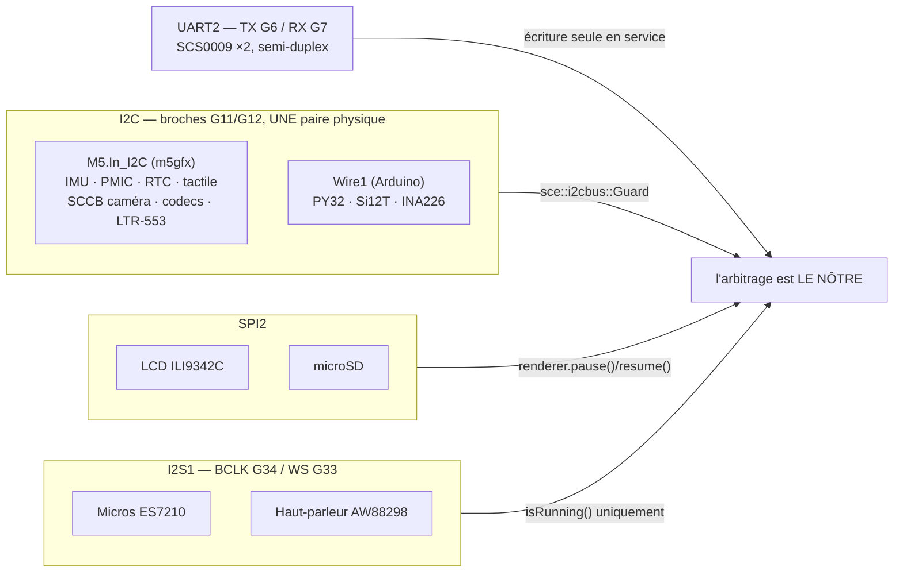

> [English](BUSES.md) · **Français** — l'anglais est la version de référence.
> Ce fichier peut être en retard d'une mise à jour : en cas de divergence, l'anglais fait foi.

# Les quatre bus — et ce que coûte leur partage

Presque toutes les règles matérielles de ce projet découlent d'un seul fait :
**rien ici n'a de bus pour soi**. Quatre bus portent dix-sept pièces, et trois
des quatre sont partagés entre des sous-systèmes écrits indépendamment, qui
n'ont aucune idée de l'existence de l'autre.



## 1. I2C sur G11/G12 — deux piles, une paire de fils

Sur le CoreS3 du K151, le bus **interne** `M5.In_I2C` et le bus **corps**
`Wire1` sont câblés sur les *mêmes broches physiques*, G11 (SCL) et G12 (SDA).
C'est la topologie officielle M5Stack, pas une erreur du kit.

| Pile | Périphériques |
|---|---|
| `M5.In_I2C` (`m5gfx::i2c`, **non thread-safe**) | IMU BMI270 + BMM150, AXP2101, RTC BM8563, tactile écran FT6336, SCCB caméra GC0308 (`0x21`), codecs ES7210/AW88298, LTR-553 (`0x23`) |
| `Wire1` (Arduino, `Wire1.begin(12, 11)`) | LED PY32 (`0x6F`), tactile tête Si12T (`0x68`), jauge INA226 (`0x41`) |

Deux piles de pilotes, un bus à deux fils, **aucun arbitrage matériel**. Les
transactions entrelacées entre le Brain (cœur 1, IMU à 100 Hz) et la boucle
Arduino (cœur 0 : tactile, batterie, LED, SCCB caméra) se corrompent
mutuellement. Les symptômes n'évoquent pas un problème de bus, et c'est ce qui
rend l'affaire coûteuse : images caméra plates ou noires, échantillon gyro
corrompu produisant un raté du VOR, ou réflexe `Scared` intempestif pour une
secousse qui n'a jamais eu lieu.

**Toute transaction passe par `sce::i2cbus::Guard`** (`hal/I2cBus.h`) — un
court mutex récursif FreeRTOS avec héritage de priorité, pris **par
transaction** :

```cpp
{ sce::i2cbus::Guard g; M5.Imu.update(); }   // la portée EST la transaction
```

L'objectif de conception était de *garder le VOR utilisable*. Une ancienne
barrière consultative laissait le Brain **sauter** sa lecture IMU quand le bus
était occupé, et l'allumage de la caméra figeait le VOR ~1,5 s. Avec le verrou,
le Brain **bloque** à la place — le temps d'une transaction, soit environ 0,3 à
2 ms — et ne perd jamais d'échantillon.

**Deux règles, et elles sont absolues :**

- Ne jamais tenir le verrou à travers un `delay()` ni aucune attente bloquante.
- Garder une section critique à une seule transaction.

### L'unique exception, et pourquoi elle est nommée

L'init caméra tient le verrou **exclusivement** sur la rafale de configuration
SCCB (`esp_camera_init` plus une table d'environ 300 registres), figeant le VOR
pendant ~0,5 s. C'est délibéré : une rafale qui relâche le verrou entre les
écritures laisse un autre maître s'intercaler, et le capteur se retrouve avec
une **configuration corrompue** — les images cessent d'arriver. Le verrou
par-transaction a été essayé ici et a régressé exactement ainsi.

Le power-cycle ALDO3 qui la précède (~650 ms de `delay()`) se fait **hors**
verrou, si bien que le VOR reste vivant pendant la partie lente. La fenêtre
exclusive est bornée et n'arrive qu'une fois par transition `camera=0→1`.

## 2. SPI2 — l'écran et la carte SD

Le LCD et la microSD partagent SPI2, arbitrés par le `spi_bus_lock` de
l'ESP-IDF. Deux nombres comptent, et aucun n'est celui auquel on s'attend.

| Réglage | Valeur | Pourquoi pas l'autre valeur |
|---|---|---|
| Horloge d'écriture LCD | **40 MHz** | 80 MHz mesuré à ×1,9 de débit, mais produit des artefacts visibles sur cette dalle : image fantôme décalée et scintillement |
| Horloge SD | **15 MHz** | à 25 MHz, les écritures multi-blocs perdaient des jetons (`no token received`, `Card Failed cmd 0x18`) → des reprises diskio qui tenaient le bus |

**L'horloge SD n'est pas le correctif du gel qu'on lui attribue.** Passer de 25
à 15 MHz a supprimé les erreurs de jeton, mais le gel du renderer d'environ
0,7 s venait de la **contention de bus**, pas de l'horloge. Le vrai correctif
est d'encadrer tout accès SD différé par `renderer.pause()` / `renderer.resume()`.
15 MHz reste parce que cela garde de la marge de signal sur la nappe du K151 —
pas parce que cela a résolu le gel. Le débit est largement suffisant : le
launcher lit les bins à ~1,5 Mo/s.

`renderer.pause()` est **compté par référence sous spinlock**, parce qu'il y a
des pauseurs concurrents — l'accès SD côté boucle et la tâche caméra. Toujours
apparier `pause()` et `resume()` ; un `resume()` orphelin déséquilibre le
compte et la pause suivante ne fait rien.

Contrainte d'ordre : **fixer la fréquence du bus LCD avant `SD.begin()`.**
Reconfigurer le `Bus_SPI` de lgfx après l'attachement de la carte fige le
`spi_bus_lock` et bloque le démarrage.

## 3. I2S1 — les microphones et le haut-parleur

Les deux microphones ES7210 et l'ampli AW88298 partagent I2S1 (BCLK G34,
WS G33). Un seul peut posséder le bus à la fois, et M5Unified n'arbitrera pas
pour vous.

- **Ne jamais appeler `M5.Mic.begin()` explicitement avant `record()`.**
  `record()` fait l'init lui-même au bon taux d'échantillonnage. Appeler
  `begin()` d'abord produit un cycle interne end/begin qui panique dans
  `i2s_read` — une boucle de démarrage, pas un code d'erreur.
- **Arbitrer avec `isRunning()` uniquement.** `isEnabled()` rapporte la
  *configuration des broches* et est toujours vrai : il ne peut donc jamais
  dire si l'autre côté possède actuellement le bus. Le chemin haut-parleur fait
  `if (M5.Mic.isRunning()) M5.Mic.end();` avant de le prendre.
- **Les tampons de capture doivent être persistants.** La capture est
  asynchrone ; un tampon sur la pile a disparu quand le DMA y écrit.
- **L'activation du micro est retardée à 20 s d'uptime.** C'est une garde
  anti-brick : si activer le micro plante la carte, l'API est déjà debout et
  répond, donc `mic_enable=0` peut être posté avant le plantage — sinon un
  drapeau persisté fait boucler le robot au démarrage sans aucune porte
  d'entrée.

Le visualiseur sonore échantillonne à **16 kHz**. À noter que l'ordre des
canaux n'est pas l'évident sur cette carte : l'échantillon `2i` n'est pas le
canal qu'on croirait, et `SoundViz` documente lequel est lequel à l'endroit où
cela compte.

## 4. UART2 — les servos de nuque

Deux SCS0009 sur Serial2 : **TX = G6**, **RX = G7**, ID **1** (lacet) et **2**
(tangage). Les étiquettes du K151 sont le miroir des nôtres — le `Servo_TX` du
kit est notre RX.

Le bus est **semi-duplex, et en écriture seule en service.** Lire la position
d'un servo dessus corrompt les commandes `WritePos` qui suivent : les servos
deviennent muets, et les yeux tremblent parce que la copie d'efférence du VOR
lit n'importe quoi. Cela a été essayé et annulé. Rien dans le chemin de
commande ne doit lire.

Il y a exactement **une** exception, et c'est elle qui rend la capture de pose
possible : quand `tuning.servos = 0`, la tâche de mouvement n'émet aucun
`WritePos`, le bus est au repos, et une lecture ponctuelle n'a rien à
corrompre. C'est le seul moyen d'apprendre où la tête est **réellement** — le
firmware rapporte sinon la pose *commandée* et ne peut jamais confirmer que le
servo est arrivé. Elle est appelée depuis la tâche servo elle-même ; deux
tâches ne peuvent pas partager un bus semi-duplex en convenant toutes deux
d'être prudentes.

Le `moveXY` de la bibliothèque est **bloquant**, donc inutilisé :
`behavior/ServoMotion.h` émet un `WritePos` brut par tick à 50 Hz à la place.

## Ce qui reste libre

| Broches | État |
|---|---|
| G2 | Grove Port A — **inutilisé** (c'est la broche XCLK nominale de la caméra, mais le GC0308 tourne sur un quartz externe de 20 MHz) |
| G5 / G10 | émission / réception IR — câblées sur le K151, **aucun pilote implémenté** |
| Bloc DVP (15/16/38/39/40/41/42/45/46/47/48) | bus de données caméra, utilisé seulement caméra allumée |

Les broches DVP de la caméra évitent délibérément le bloc SD (35/36/37/4), les
broches servo (6/7) et les broches I2S (33/34) — il n'y a là aucun conflit à
arbitrer, et c'est pourquoi le seul problème de bus de la caméra est le chemin
de contrôle SCCB décrit au §1.
