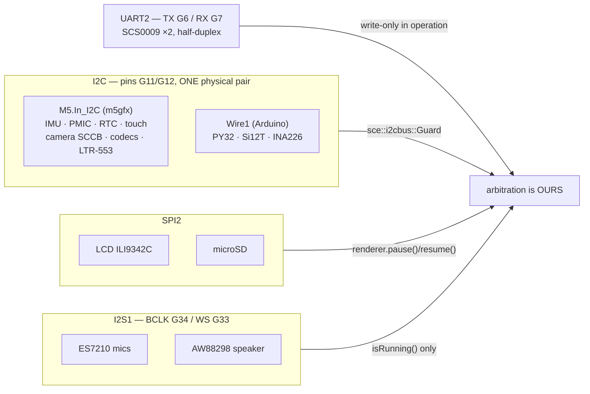

> **English** · [Français](BUSES.fr.md)

# The four buses — and what sharing them costs

Almost every hardware rule in this project comes from one fact: **nothing here
has a bus to itself**. Four buses carry seventeen parts, and three of the four
are shared between subsystems that were written independently and have no idea
the other exists.



## 1. I2C on G11/G12 — two stacks, one pair of wires

On the K151's CoreS3 the **internal** bus `M5.In_I2C` and the **body** bus
`Wire1` are wired to the *same physical pins*, G11 (SCL) and G12 (SDA). This
is the official M5Stack topology, not a mistake in the kit.

| Stack | Peripherals |
|---|---|
| `M5.In_I2C` (`m5gfx::i2c`, **not thread-safe**) | BMI270 + BMM150 IMU, AXP2101, RTC BM8563, FT6336 screen touch, GC0308 camera SCCB (`0x21`), ES7210/AW88298 codecs, LTR-553 (`0x23`) |
| `Wire1` (Arduino, `Wire1.begin(12, 11)`) | PY32 LEDs (`0x6F`), Si12T head touch (`0x68`), INA226 gauge (`0x41`) |

Two driver stacks, one 2-wire bus, **no hardware arbitration**. Transactions
interleaved between the Brain (core 1, IMU at 100 Hz) and the Arduino loop
(core 0: touch, battery, LEDs, camera SCCB) corrupt each other. The symptoms
are not obviously bus-related, which is what makes this expensive: flat or
black camera frames, a corrupted gyro sample producing a VOR glitch, or a
spurious `Scared` reflex from a shake that never happened.

**Every transaction goes through `sce::i2cbus::Guard`** (`hal/I2cBus.h`) — a
short FreeRTOS recursive mutex with priority inheritance, taken **per
transaction**:

```cpp
{ sce::i2cbus::Guard g; M5.Imu.update(); }   // the scope is the transaction
```

The design goal was *keeping the VOR usable*. An earlier advisory gate let the
Brain **skip** its IMU read when the bus was busy, and powering the camera up
froze the VOR for ~1.5 s. With the lock the Brain **blocks** instead — for the
length of one transaction, roughly 0.3 to 2 ms — and never loses a sample.

**Two rules, and they are absolute:**

- Never hold the lock across a `delay()` or any blocking wait.
- Keep a critical section down to a single transaction.

### The one exception, and why it is named

Camera init holds the lock **exclusively** across the SCCB configuration burst
(`esp_camera_init` plus a ~300-register table), freezing the VOR for about
0.5 s. This is deliberate: a burst that releases the lock between writes lets
another master interleave, and the sensor ends up with a **corrupted
configuration** — frames stop arriving. Per-transaction locking was tried here
and regressed exactly that way.

The ALDO3 power cycle that precedes it (~650 ms of `delay()`) happens
**outside** the lock, so the VOR stays alive through the slow part. The
exclusive window is bounded and happens once per `camera=0→1` transition.

## 2. SPI2 — the display and the SD card

The LCD and the microSD share SPI2, arbitrated by the ESP-IDF `spi_bus_lock`.
Two numbers matter, and neither is the one people expect.

| Setting | Value | Why not the other value |
|---|---|---|
| LCD write clock | **40 MHz** | 80 MHz measured ×1.9 throughput but produces visible artifacts on this panel: an offset ghost image and flicker |
| SD clock | **15 MHz** | at 25 MHz, multi-block **writes** lost tokens (`no token received`, `Card Failed cmd 0x18`) → diskio retries that held the bus |

**The SD clock is not the fix for the freeze it is remembered for.** Dropping
25 → 15 MHz removed the token errors, but the ~0.7 s renderer freeze came from
**bus contention**, not from the clock. The actual fix is bracketing every
deferred SD access with `renderer.pause()` / `renderer.resume()`. 15 MHz stays
because it keeps signal margin on the K151's ribbon — not because it solved
the freeze. Throughput is still ample: the launcher reads bins at ~1.5 MB/s.

`renderer.pause()` is **reference-counted under a spinlock**, because there are
concurrent pausers — the loop-side SD access and the camera task. Always pair
`pause()` with `resume()`; an orphan `resume()` unbalances the count and the
next pause does nothing.

Ordering constraint: **set the LCD bus frequency before `SD.begin()`.**
Reconfiguring the lgfx `Bus_SPI` after the card is attached freezes the
`spi_bus_lock` and hangs the boot.

## 3. I2S1 — the microphones and the speaker

The two ES7210 microphones and the AW88298 amplifier share I2S1 (BCLK G34,
WS G33). Only one of them can own the bus at a time, and M5Unified will not
arbitrate for you.

- **Never call `M5.Mic.begin()` explicitly before `record()`.** `record()`
  performs the init at the correct sample rate itself. Calling `begin()` first
  produces an internal end/begin cycle that panics inside `i2s_read` — a boot
  loop, not an error return.
- **Arbitrate with `isRunning()` only.** `isEnabled()` reports the *pin
  configuration* and is always true, so it can never tell you whether the other
  side currently owns the bus. The speaker path does
  `if (M5.Mic.isRunning()) M5.Mic.end();` before taking it.
- **Record buffers must be persistent.** Capture is asynchronous; a buffer on
  the stack is gone by the time the DMA writes into it.
- **Microphone activation is delayed to 20 s of uptime.** This is an anti-brick
  guard: if enabling the microphone crashes the board, the API is already up
  and answering, so `mic_enable=0` can be posted before the crash — otherwise a
  persisted flag reboot-loops the robot with no way in.

The sound visualiser samples at **16 kHz**. Note that the channel order is not
the obvious one on this board: sample `2i` is not the channel you would guess,
and `SoundViz` documents which is which at the point where it matters.

## 4. UART2 — the neck servos

Two SCS0009 servos on Serial2: **TX = G6**, **RX = G7**, IDs **1** (yaw) and
**2** (pitch). The K151 labels are the mirror of ours — the kit's `Servo_TX` is
our RX.

The bus is **half-duplex, and write-only in operation.** Reading a servo's
position over it corrupts the `WritePos` commands that follow: the servos go
mute, and the eyes jitter because the VOR efference copy reads garbage. This
was tried and reverted. Nothing in the control path may read.

There is exactly **one** exception, and it is what makes pose capture possible:
when `tuning.servos = 0` the motion task issues no `WritePos` at all, the bus
is idle, and a one-shot read has nothing to corrupt. That is the only way to
learn where the head **actually** is — the firmware otherwise reports the
*commanded* pose and can never confirm the servo arrived. It is called from the
servo task itself; two tasks cannot share a half-duplex bus by both agreeing to
be careful.

The library's `moveXY` is **blocking**, so it is not used: `behavior/
ServoMotion.h` issues a raw `WritePos` per tick at 50 Hz instead.

## What is left free

| Pins | Status |
|---|---|
| G2 | Grove Port A — **unused** (it is the camera's nominal XCLK pin, but the GC0308 runs off an external 20 MHz crystal) |
| G5 / G10 | IR send / receive — wired on the K151, **no driver implemented** |
| DVP block (15/16/38/39/40/41/42/45/46/47/48) | camera data bus, in use only while the camera is on |

The camera's DVP pins deliberately avoid the SD block (35/36/37/4), the servo
pins (6/7) and the I2S pins (33/34) — there is no conflict to arbitrate there,
which is why the camera's only bus problem is the SCCB control path described
in §1.
