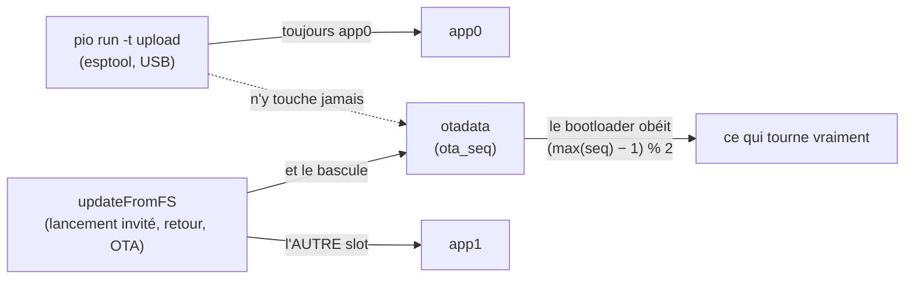

> [English](LIMITS.md) · **Français** — l'anglais est la version de référence.
> Ce fichier peut être en retard d'une mise à jour : en cas de divergence, l'anglais fait foi.

# Budgets, plafonds et impasses

Ce que la carte donne et ce qu'elle ne donnera pas. La dernière section est la
plus utile à lire avant de proposer une fonctionnalité : elle liste ce qui a
déjà été tenté sur ce matériel et a **échoué**, avec la mesure qui a clos le
dossier.

## Flash : 16 Mo, deux slots applicatifs

La table `default_16MB` d'origine, relue depuis la puce par
`esptool read_flash 0x8000 0x1000` + `gen_esp32part.py` :

| Nom | Type | Offset | Taille |
|---|---|---|---|
| `nvs` | data | `0x9000` | 20 K |
| `otadata` | data | `0xe000` | 8 K |
| `app0` | app, ota_0 | `0x10000` | 6400 K |
| `app1` | app, ota_1 | `0x650000` | 6400 K |
| `spiffs` | data | `0xc90000` | 3456 K |
| `coredump` | data | `0xff0000` | 64 K |

```
0x000000  ┌──────────────────────────────┐
          │ bootloader + table partitions│
0x009000  ├──────────────────────────────┤  nvs      20 K   surcharges WiFi/NVS
0x00e000  ├──────────────────────────────┤  otadata   8 K   ← LE POINTEUR
0x010000  ├──────────────────────────────┤
          │                              │
          │   app0  (ota_0)   6400 K     │  ← `pio -t upload` écrit TOUJOURS ici
          │                              │
0x650000  ├──────────────────────────────┤
          │                              │
          │   app1  (ota_1)   6400 K     │  ← `updateFromFS` écrit l'AUTRE
          │                              │
0xc90000  ├──────────────────────────────┤
          │   spiffs          3456 K     │  INUTILISÉE — la carte SD porte tout
0xff0000  ├──────────────────────────────┤  coredump 64 K
0x1000000 └──────────────────────────────┘  16 Mo
```

Les deux slots applicatifs représentent **78 % de la puce**, et un firmware
fait environ 1,4 Mo — chaque slot est donc à peu près quatre fois plus grand
que nécessaire. Cette marge n'est pas du gaspillage : c'est elle qui permet à
un bin invité de 1,7 Mo d'atterrir dans l'un ou l'autre sans que personne ait à
y penser.

`otadata` est la partie qu'il faut regarder. C'est **8 ko de pointeur**, et
toute la confusion ci-dessous vient de ce que les deux écrivains ne visent pas
le même endroit :



`spiffs` est **inutilisée** : la carte SD porte tout ce que le firmware
persiste.

### Le slot qui tourne n'est pas déduit du dernier flash

C'est le malentendu le plus coûteux disponible sur cette carte, alors autant le
dire platement :

- `pio run -t upload` écrit **`app0`** et **ne touche jamais `otadata`**.
- `updateFromFS()` — lancer un invité, un invité qui rend la main, une OTA par
  `/api/update` — écrit l'**autre** slot
  (`esp_ota_get_next_update_partition`) et pointe `otadata` dessus.

Le slot de démarrage est donc celui qu'`otadata` a désigné en dernier, et un
flash USB n'a pas voix au chapitre. Un companion restauré depuis la carte SD
atterrit dans un slot ; le flash USB suivant écrit `app0` ; les deux n'ont
aucune raison d'être au même endroit. **Tous les signaux extérieurs disent
quand même succès** — esptool vérifie son propre hash contre ce qu'il a écrit,
et le robot revient sur le WiFi — alors qu'il exécute l'autre image.

D'où `GET /api/firmware`, qui publie `slot`, `sha`, `console` et `reset` ; les
bins invités publient la même chose en pied de leur page `/config`. `otadata`
est aussi lisible directement : deux entrées de 32 octets espacées d'une page,
`ota_seq` en premier, et le bootloader choisit `(max(seq) − 1) % 2`. Comme
**esptool n'écrit jamais `ota_seq`**, un numéro de séquence qui a bougé prouve
qu'une *OTA* a écrit ce slot.

⚠ **Après toute modification du companion, rafraîchir `/companion.bin` sur la
carte SD.** Sinon le prochain retour d'invité reflashe le robot depuis une
copie périmée, défaisant en silence le flash USB que vous venez de vérifier.

## Mémoire : 8 Mo de PSRAM, et un tas interne qui mérite protection

Le tas interne est là où vivent le WiFi et AsyncTCP. L'épuiser ne tue pas ce
qui a pris la mémoire — cela tue la pile réseau, loin de la cause, et
généralement bien plus tard.

Donc **le gros JSON part en PSRAM** via `sce::psAlloc`
(`firmware/common/PsJson.h`). Le repli sur le tas interne est **borné et
tracé** : un gros bloc est *refusé* plutôt qu'accordé. Une analyse ratée se
rejoue ; un tas interne épuisé ne se diagnostique pas.

Le même raisonnement façonne plusieurs chemins de lecture : lectures bornées
avec un tampon de pile (`readBytesUntil` + `MAX_LINE`, reste jeté) plutôt que
`readStringUntil`, parce que tester la longueur d'une `String` *après coup* ne
protège rien — elle a déjà grossi.

Ordres de grandeur pour se repérer : le canvas de la zone des yeux est en SRAM
8 bits ; le sprite plein écran 16 bits d'un bin invité fait 320×240×2 = 150 Ko
en PSRAM, avec des pics réels entre 0,4 et 0,8 Mo.

## La frame : 33 ms, et un point d'appel de dessin par forme

Le renderer vise **30 fps**, donc une frame a **33 ms**. Mesuré sur cible :
**21,5 ms nu, 27,8 ms avec l'effet CRT** — dans le budget, validé sur une nuit
entière d'endurance avec le CRT actif.

Deux règles dures en découlent, et les deux ont été payées :

**Aucune primitive anti-aliasée dans le chemin par frame.** `drawWideLine` pour
la croix de `Dead` mesurait ~57 ms, ce qui affamait le polling tactile de
`loop()` sur le même cœur. Utiliser `fillTriangle` et compagnie.

**Un point d'appel de dessin par forme.** GCC 8.4 Xtensa a le droit de
supprimer le *second* de deux appels de dessin similaires dans un même corps de
fonction, et il le fait. Le contournement est une boucle alternée à point
d'appel unique. Ce n'est pas une règle de style : c'est invisible dans la
source et visible seulement dans le binaire lié, et c'est pourquoi
`scripts/gates/check-a222.py` compte les appels **dans l'ELF** — 111 points
épinglés sur les sept firmwares.

## Latence I2C

Toute transaction sur G11/G12 prend le verrou partagé. Les nombres à retenir :

| Opération | Coût |
|---|---|
| une transaction verrouillée | ~0,3–2 ms |
| lecture IMU du Brain | 100 Hz, bloque au lieu de sauter |
| rafale de config SCCB caméra | ~0,5 s, **exclusive**, une fois par `camera=0→1` |
| power-cycle ALDO3 | ~650 ms, **hors** verrou |

## Énergie

L'AXP2101 donne le niveau de batterie ; l'INA226 donne une tension de bus
indépendante. Ni l'un ni l'autre n'est une jauge à coulomb au sens strict — le
registre de courant de l'INA226 exige un étalonnage de shunt qui n'est pas
configuré, si bien que seuls le *signe et l'ordre de grandeur relatif* du
courant de charge/décharge sont disponibles.

Contraintes pratiques qui découlent des rails plutôt que du logiciel :

- Le rail servo (VM_EN) est commutable, et le couper est la **seule**
  libération qui survive à un redémarrage.
- Le couple servo laissé engagé tient la tête contre la gravité et consomme en
  continu ; `servo_idle_release_ms` le relâche après une période d'inactivité,
  et le couple se réengage automatiquement au mouvement suivant.
- Le rétroéclairage est l'autre gros consommateur : `screen_bright` pilote la
  dalle, `eye_color_dim` ne fait qu'assombrir la palette des yeux et
  n'économise rien.

## Impasses — tentées sur ce matériel, et closes

| Tentative | Verdict | Ce qui l'a close |
|---|---|---|
| **BLE (NimBLE)** | ❌ annulé | `NimBLEDevice::init` plante en coexistence avec le WiFi — boucle de démarrage, récupération par un flash manuel en mode download. Conception conservée dans `reference/PLUGINS.fr.md` ; demande une session dédiée avec accès physique |
| **Magnétomètre fusionné dans le VOR** | ❌ | 370 µT de dépendance au lacet de tête pour 80°, irreproductible à pose identique. Voir [`PERIPHERALS.fr.md`](PERIPHERALS.fr.md) |
| **Bus LCD à 80 MHz** | ❌ | ×1,9 de débit, mais image fantôme et scintillement visibles sur cette dalle |
| **JPEG matériel sur la caméra** | ❌ par construction | le GC0308 ne sort que du RGB565/YUV ; l'encodage est logiciel |
| **Lire la position servo en service** | ❌ annulé | corrompt le flux `WritePos` sur le bus semi-duplex : servos muets, yeux qui tremblent |
| **SD à 25 MHz** | ❌ | les écritures multi-blocs perdaient des jetons ; les reprises tenaient le bus |
| **Verrou par transaction sur la rafale SCCB caméra** | ❌ régression | des maîtres entrelacés corrompent la configuration du capteur — les images cessent d'arriver |

Le motif qui traverse ce tableau mérite d'être nommé : **chacune d'elles a
semblé fonctionner au début.** La build BLE se liait, la dalle à 80 MHz
dessinait, la lecture servo rendait un nombre plausible, le protocole de LED
deviné était acquitté. Ce qui a tranché chaque cas, c'est une mesure sur le
robot — ce que [`validation/VALIDATION.fr.md`](../validation/VALIDATION.fr.md)
existe pour consigner.

## Où regarder quand quelque chose cloche

| Symptôme | Premier suspect |
|---|---|
| Images caméra noires ou plates | entrelacement I2C — une transaction hors `sce::i2cbus::Guard` |
| VOR muet en rotation | lacet mappé sur `gyro.z` (c'est le roulis) |
| Le renderer se fige ~0,7 s | accès SD non encadré par `renderer.pause()`/`resume()` |
| Servos silencieux | VM_EN non affirmé, ou une lecture émise sur le bus servo |
| Une forme à moitié dessinée | A2.22 — deux appels de dessin similaires dans un corps |
| Réglages non persistés | pas de carte : vérifier `sce::SdWatch`, pas le montage du boot |
| `Wire Error 263` dans le log | timeout Si12T bénin, bruit connu |
| Le robot se tamise en plein jour | lecture LTR-553 échouée prise pour 0 au lieu de −1 |
