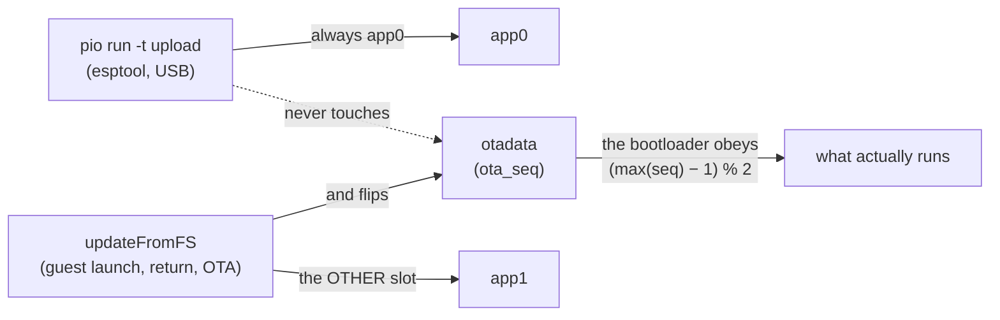

> **English** · [Français](LIMITS.fr.md)

# Budgets, ceilings and dead ends

What the board will and will not give you. The last section is the most useful
one to read before proposing a feature: it lists what has already been tried on
this hardware and **failed**, with the measurement that closed it.

## Flash: 16 MB, two app slots

The stock `default_16MB` table, read back from the chip with
`esptool read_flash 0x8000 0x1000` + `gen_esp32part.py`:

| Name | Type | Offset | Size |
|---|---|---|---|
| `nvs` | data | `0x9000` | 20 K |
| `otadata` | data | `0xe000` | 8 K |
| `app0` | app, ota_0 | `0x10000` | 6400 K |
| `app1` | app, ota_1 | `0x650000` | 6400 K |
| `spiffs` | data | `0xc90000` | 3456 K |
| `coredump` | data | `0xff0000` | 64 K |

```
0x000000  ┌──────────────────────────────┐
          │ bootloader + partition table │
0x009000  ├──────────────────────────────┤  nvs      20 K   WiFi/NVS overrides
0x00e000  ├──────────────────────────────┤  otadata   8 K   ← THE POINTER
0x010000  ├──────────────────────────────┤
          │                              │
          │   app0  (ota_0)   6400 K     │  ← `pio -t upload` ALWAYS writes here
          │                              │
0x650000  ├──────────────────────────────┤
          │                              │
          │   app1  (ota_1)   6400 K     │  ← `updateFromFS` writes the OTHER one
          │                              │
0xc90000  ├──────────────────────────────┤
          │   spiffs          3456 K     │  UNUSED — the SD card holds everything
0xff0000  ├──────────────────────────────┤  coredump 64 K
0x1000000 └──────────────────────────────┘  16 MB
```

The two app slots are **78 % of the chip**, and a firmware is about 1.4 MB — so
each slot is roughly four times the size it needs to be. That headroom is not
waste: it is what lets a 1.7 MB guest bin land in either slot without anyone
having to think about it.

`otadata` is the part worth staring at. It is **8 kB of pointer**, and the
whole confusion below comes from the fact that the two writers do not aim at
the same place:



`spiffs` is **unused**: the SD card holds everything the firmware persists.

### The running slot is not implied by the last flash

This is the single most expensive misunderstanding available on this board, so
it is worth stating flatly:

- `pio run -t upload` writes **`app0`** and **never touches `otadata`**.
- `updateFromFS()` — launching a guest, a guest handing the robot back, an OTA
  through `/api/update` — writes the **other** slot
  (`esp_ota_get_next_update_partition`) and points `otadata` at it.

So the boot slot is whatever `otadata` last said, and a USB flash does not get
a vote. A companion restored from the SD card lands in one slot; the next USB
flash writes `app0`; the two need not be the same place. **Every outward signal
still says success** — esptool verifies its own hash against what it wrote, and
the robot comes back on WiFi — while running the other image.

Hence `GET /api/firmware`, which publishes `slot`, `sha`, `console` and
`reset`; the guest bins publish the same at the bottom of their `/config` page.
`otadata` is also readable directly: two 32-byte entries a page apart, `ota_seq`
first, and the bootloader picks `(max(seq) − 1) % 2`. Because **esptool never
writes `ota_seq`**, a sequence number that moved is proof an *OTA* wrote that
slot.

⚠ **After any companion change, refresh `/companion.bin` on the SD card.**
Otherwise the next guest return reflashes the robot from a stale copy, quietly
undoing the USB flash you just verified.

## Memory: 8 MB PSRAM, and an internal heap worth protecting

The internal heap is what WiFi and AsyncTCP live in. Exhausting it does not
kill the thing that took the memory — it kills the network stack, far from the
cause, and usually much later.

So **large JSON goes to PSRAM** through `sce::psAlloc`
(`firmware/common/PsJson.h`). The fallback onto the internal heap is **bounded
and traced**: a large block is *refused* rather than granted. A failed parse
can be retried; an exhausted internal heap cannot be diagnosed.

The same reasoning shapes several reading paths: bounded reads with a
stack buffer (`readBytesUntil` + `MAX_LINE`, remainder discarded) rather than
`readStringUntil`, because testing a `String`'s length *after* the fact
protects nothing — it has already grown.

Rough figures for orientation: the eye-zone canvas is 8-bit SRAM; a guest bin's
full-screen 16-bit sprite is 320×240×2 = 150 KB in PSRAM, with real peaks
between 0.4 and 0.8 MB.

## The frame: 33 ms, and one draw call site per shape

The renderer targets **30 fps**, so a frame has **33 ms**. Measured on target:
**21.5 ms bare, 27.8 ms with the CRT effect** — inside budget, validated over a
full-night endurance run with CRT on.

Two hard rules come out of that, and both were paid for:

**No anti-aliased primitive in the per-frame path.** `drawWideLine` for the
`Dead` cross measured ~57 ms, which starved the touch polling in `loop()` on
the same core. Use `fillTriangle` and friends.

**One draw call site per shape.** GCC 8.4 Xtensa is entitled to delete the
*second* of two similar drawing calls in the same function body, and it does.
The workaround is an alternating loop with a single call site. This is not a
style rule: it is invisible in the source and only visible in the linked
binary, which is why `scripts/gates/check-a222.py` counts the calls **in the
ELF** — 111 pinned points across the seven firmwares.

## I2C latency

Every transaction on G11/G12 takes the shared lock. The numbers worth carrying:

| Operation | Cost |
|---|---|
| one locked transaction | ~0.3–2 ms |
| Brain IMU read | 100 Hz, blocks rather than skips |
| camera SCCB config burst | ~0.5 s, **exclusive**, once per `camera=0→1` |
| ALDO3 power cycle | ~650 ms, **outside** the lock |

## Power

The AXP2101 gives the battery level; the INA226 gives an independent bus
voltage. Neither is a fuel gauge in the strict sense — the INA226's current
register needs a shunt calibration that is not configured, so only the
*sign and relative magnitude* of the charge/discharge current are available.

Practical constraints that follow from the rails rather than from software:

- The servo rail (VM_EN) is switchable, and switching it off is the **only**
  release that survives a reboot.
- Servo torque left engaged holds the head against gravity and draws current
  continuously; `servo_idle_release_ms` releases it after an idle period, and
  the torque re-engages automatically on the next move.
- The screen backlight is the other big consumer: `screen_bright` drives the
  panel, `eye_color_dim` only darkens the eye palette and saves nothing.

## Dead ends — tried on this hardware, and closed

| Attempt | Verdict | What closed it |
|---|---|---|
| **BLE (NimBLE)** | ❌ reverted | `NimBLEDevice::init` crashes in coexistence with WiFi — boot loop, recovery needed a manual download-mode flash. Design kept in `reference/PLUGINS.md`; needs a dedicated session with physical access |
| **Magnetometer fused into the VOR** | ❌ | 370 µT of head-yaw dependence per 80°, irreproducible at an identical pose. See [`PERIPHERALS.md`](PERIPHERALS.md) |
| **LCD bus at 80 MHz** | ❌ | ×1.9 throughput, but visible ghosting and flicker on this panel |
| **Hardware JPEG on the camera** | ❌ by construction | the GC0308 outputs RGB565/YUV only; encoding is software |
| **Reading servo position during operation** | ❌ reverted | corrupts the `WritePos` stream on the half-duplex bus: servos go mute, eyes jitter |
| **SD at 25 MHz** | ❌ | multi-block writes lost tokens; retries held the bus |
| **Per-transaction lock on the camera SCCB burst** | ❌ regressed | interleaved masters corrupt the sensor configuration — frames stop arriving |

The pattern across that table is worth naming: **every one of them looked like
it worked at first.** The BLE build linked, the 80 MHz panel drew, the servo
read returned a plausible number, the guessed LED protocol was ACKed. What
settled each case was a measurement on the robot, which is what
[`validation/VALIDATION.md`](../validation/VALIDATION.md) exists to record.

## Where to look when something is off

| Symptom | First suspect |
|---|---|
| Black or flat camera frames | I2C interleaving — a transaction outside `sce::i2cbus::Guard` |
| VOR mute on rotation | yaw mapped onto `gyro.z` (that is roll) |
| Renderer freezes ~0.7 s | SD access not bracketed by `renderer.pause()`/`resume()` |
| Servos silent | VM_EN not asserted, or a read issued on the servo bus |
| A shape half-drawn | A2.22 — two similar draw calls in one body |
| Settings not persisting | no card: check `sce::SdWatch`, not the boot mount |
| `Wire Error 263` in the log | benign Si12T timeout, known noise |
| Robot dims in broad daylight | LTR-553 failed read taken as 0 instead of −1 |
