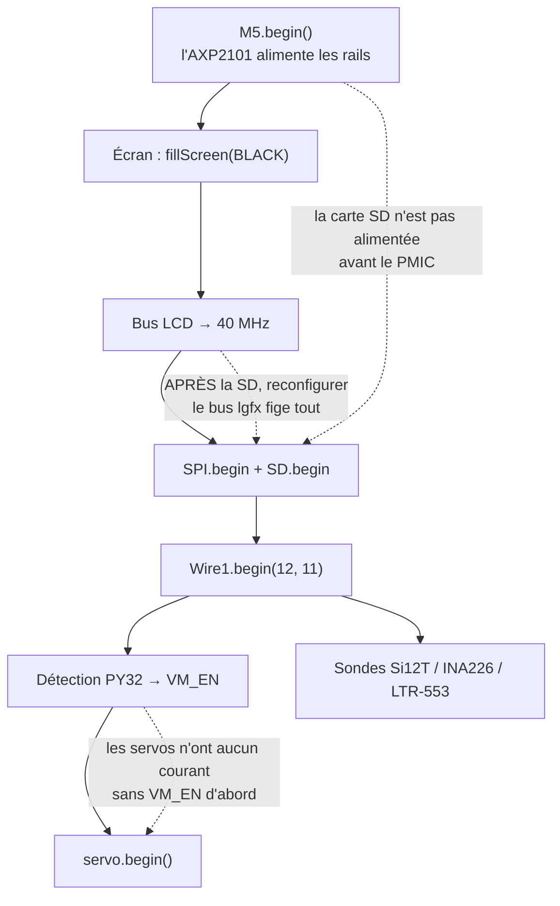

> [English](README.md) · **Français** — l'anglais est la version de référence.
> Ce fichier peut être en retard d'une mise à jour : en cas de divergence, l'anglais fait foi.

# Le matériel — ce que le firmware pilote réellement

Cette rubrique décrit la **machine** : ce qu'il y a dessus, à quoi c'est câblé,
ce que coûte le fait de lui parler, et où elle refuse d'aller. Elle existe
parce que l'essentiel du savoir durement acquis sur ce projet ne porte pas sur
le code — il porte sur une carte où deux bus logiques partagent une seule paire
de fils, où une butée de servo détruit le servo, et où le capteur de lumière
ambiante est derrière un mur.

Commencez ici si l'on vient de vous mettre le robot entre les mains. Si vous
cherchez un mécanisme plutôt qu'une pièce, allez plutôt voir
[`architecture/WORKFLOWS.fr.md`](../architecture/WORKFLOWS.fr.md).

## Les quatre documents

| Document | Répond à |
|---|---|
| **`README.fr.md`** (ce fichier) | ce qu'est la machine, l'inventaire complet, l'ordre de démarrage, les deux profils de carte |
| [`BUSES.fr.md`](BUSES.fr.md) | les quatre bus et ce que coûte leur partage : I2C 11/12, SPI2, I2S1, l'UART servo |
| [`PERIPHERALS.fr.md`](PERIPHERALS.fr.md) | chaque pièce une par une : adresse, pilote, étalonnage, mode de panne |
| [`LIMITS.fr.md`](LIMITS.fr.md) | budgets et impasses : carte de la flash, mémoire, la frame de 33 ms, ce qui a été tenté et a échoué |

## La machine en un paragraphe

Un **M5Stack CoreS3** (ESP32-S3, double cœur à 240 MHz, 16 Mo de flash, 8 Mo de
PSRAM, dalle tactile capacitive 320×240) posé dans un kit **M5Stack StackChan
K151**, qui ajoute les servos de tête et de nuque, un expandeur d'E/S pilotant
douze LED, une bande tactile capacitive sur le dessus de la tête, et une jauge
de batterie. Le CoreS3 est tout l'ordinateur ; le K151 est un corps enroulé
autour de lui.

Tout ce qui suit vient soit du CoreS3, soit du K151, et la distinction compte
en permanence : les deux moitiés se parlent sur **les deux mêmes fils I2C**,
sans le moindre arbitrage matériel entre elles.

## Inventaire complet

La colonne **Bus** est la première à lire — c'est de là que viennent les
contraintes. `In_I2C` et `Wire1` sont deux piles logicielles sur **un seul bus
physique** (voir [`BUSES.fr.md`](BUSES.fr.md)).

| Pièce | Rôle | Bus | Adresse / broches | Pilote |
|---|---|---|---|---|
| ESP32-S3 | l'ordinateur | — | — | cœur Arduino-ESP32 |
| ILI9342C 320×240 | affichage | SPI2 | partagé avec la SD | M5GFX (`M5.Display`) |
| FT6336 | tactile écran | `In_I2C` | — | M5Unified (`M5.Touch`) |
| microSD | cartes, bins, config | SPI2 | SCK 36, MISO 35, MOSI 37, CS 4 | `SD.h` + `firmware/common/SdPins.h` |
| AXP2101 | PMIC, batterie, rails | `In_I2C` | — | M5Unified (`M5.Power`) |
| BMI270 | IMU 6 axes (VOR, réflexes) | `In_I2C` | — | M5Unified (`M5.Imu`) + `hal/ImuReader.h` |
| BMM150 | magnétomètre (cap) | `In_I2C` | — | M5Unified (`imu_data_t.mag`) |
| BM8563 | RTC (volume nuit, horloge solaire) | `In_I2C` | — | M5Unified (`M5.Rtc`) |
| LTR-553ALS | lumière ambiante | `In_I2C` | `0x23` | `firmware/common/Ltr553.h` |
| GC0308 | caméra VGA | `In_I2C` (SCCB) + DVP | `0x21` + broches DVP | `hal/Camera.h` |
| ES7210 ×2 | microphones stéréo | I2S1 | BCLK 34, WS 33 | M5Unified (`M5.Mic`) |
| AW88298 | ampli haut-parleur | I2S1 | partagé avec les micros | M5Unified (`M5.Speaker`) |
| PY32 | expandeur : rail servo + LED | `Wire1` | `0x6F` | `hal/Py32Expander.h` |
| WS2812C ×12 | LED du corps, deux barres de six | via PY32 | PY32 GPIO 13 | `hal/Py32Expander.h` |
| Si12T | tactile tête, 3 zones | `Wire1` | `0x68` | `hal/Si12T.h` |
| INA226 | jauge batterie (bus + shunt) | `Wire1` | `0x41` | `hal/Ina226.h` |
| SCS0009 ×2 | servos de nuque, lacet + tangage | UART2 | TX G6, RX G7, ID 1 et 2 | `behavior/ServoMotion.h` |
| ST25R3916 | NFC | `In_I2C` | `0x50` | **non implémenté** |
| IRM56384 | infrarouge réception/émission | GPIO | RX G10, TX G5 | **non implémenté** |

## L'ordre de démarrage, et pourquoi c'en est un

`hal/Board.h` détient cette séquence. Ce n'est pas une préférence de style :
chaque étape dépend de la *fin* de la précédente, et trois des flèches
ci-dessous ont été payées par un démarrage qui se fige ou un périphérique qui
ne fait silencieusement rien.

Trois de ces contraintes méritent d'être dites en toutes lettres, parce
qu'elles échouent *en silence* plutôt que bruyamment :

- **Le PMIC alimente la carte SD.** Un `SD.begin()` avant `M5.begin()` ne monte
  rien, donc pas de `config.yaml`, donc pas d'identifiants WiFi, donc pas de
  réseau — et aucun de ces trois-là ne signale d'erreur.
- **La fréquence du bus LCD doit être fixée avant `SD.begin()`.** Reconfigurer
  le `Bus_SPI` de lgfx une fois la carte SD attachée au même SPI2 fige le
  `spi_bus_lock` de l'ESP-IDF. Celle-là fige carrément le démarrage.
- **VM_EN avant les servos.** Le GPIO 0 du PY32 est le rail d'alimentation des
  servos. Appeler `servo.begin()` d'abord donne un bus servo qui ne répond à
  rien, faute de courant. Le PY32 démarre lentement (~200 ms), donc la
  détection réessaie jusqu'à 1,2 s avant d'abandonner.

## Deux profils de carte

Les mêmes sources compilent pour une seconde carte. Les bins invités
`flight-radar` et `space` ont chacun une variante `-fire` qui tourne en
autonome sur un **M5Stack Fire** — sans K151, sans firmware companion, sans
dalle tactile.

| | CoreS3 + K151 | M5Stack Fire |
|---|---|---|
| Écran | 320×240, **tactile capacitif** | 320×240, **trois boutons** |
| PSRAM | 8 Mo | 8 Mo |
| Câblage SD | SCK 36 / MISO 35 / MOSI 37 / CS 4 | VSPI : 18 / 19 / 23 / CS 4 |
| Servos | SCS0009 ×2 | aucun |
| Capteur de lumière | LTR-553 | aucun (sondé, rapporté absent) |
| Anneau WS2812 | 12, derrière le PY32 sur Wire1 | aucun (**déclaré**, pas sondé — voir plus bas) |
| Firmware companion | oui — hall, chemin de retour | aucun : le bin *est* le firmware |

Les différences s'expriment en **drapeaux de capacité** dans un bloc `BOARD
PROFILE` en tête du `main.cpp` concerné — `SCE_INPUT_BUTTONS`, `SCE_HAS_SERVO`,
`SCE_HAS_LTR553`, `SCE_HAS_PY32`, `SCE_COMPANION`, `SCE_SD_*` — jamais en
forkant la source. Ils sont nommés d'après **ce que la carte POSSÈDE**, jamais
d'après un nom de carte, si bien qu'une troisième carte est un nouveau jeu de
valeurs et non une nouvelle famille de `#ifdef`.

**Déclaré ou sondé est déjà une décision.** Le capteur de lumière est *sondé* au
démarrage et la réponse publiée, ce qui couvre une carte qui n'en a jamais eu
et, en prime, une carte dont le capteur est mort — un drapeau de compilation ne
couvrirait jamais que le premier cas. L'anneau WS2812, lui, est *déclaré*
(`SCE_HAS_PY32`) parce que le sonder n'est pas gratuit : atteindre l'expandeur
impose d'appeler `Wire1.begin(12, 11)` d'abord, or sur un ESP32 classique comme
le Fire, **les GPIO 6-11 sont la flash SPI** — la broche 11 n'y est pas une
broche libre, c'est celle depuis laquelle le programme est lu. Une capacité
qu'on ne peut pas interroger sans danger se déclare.

⚠ **Avec les deux cartes branchées, toujours passer `--upload-port`.** Un `pio
run -t upload` sans lui choisit un port tout seul et peut écraser le companion
du StackChan avec le binaire du Fire. Les numéros de COM dépendent de l'ordre
de branchement ; l'identifiant USB non — `scripts/dev/find-port.ps1 -Board
fire` le résout par VID/PID et refuse si la carte est absente ou ambiguë.

## Références

| Source | Utile pour |
|---|---|
| [docs.m5stack.com/en/core/CoreS3](https://docs.m5stack.com/en/core/CoreS3) | brochage du CoreS3, la carte I2C interne, les rails du PMIC |
| [docs.m5stack.com/en/StackChan](https://docs.m5stack.com/en/StackChan) | le kit K151 : broches du bus corps, **les limites d'angle des servos** |
| [github.com/m5stack/StackChan](https://github.com/m5stack/StackChan) | le firmware ESP-IDF du fabricant — la source des protocoles de registres PY32 et Si12T |
| [`hal/`](../../src/hal/) | les pilotes eux-mêmes ; chaque en-tête s'ouvre sur ce que fait la pièce et sur ce qui casse |
| [`validation/VALIDATION.fr.md`](../validation/VALIDATION.fr.md) | lesquels de ces comportements sont **prouvés sur le robot** et non simplement codés |

Le firmware du fabricant mérite une note à part : le protocole des LED du PY32
et la séquence de registres du Si12T ne sont **publiés dans aucune fiche
technique**. Ils ont été lus dans ce dépôt, et les commentaires de
`hal/Py32Expander.h` et `hal/Si12T.h` nomment les fichiers sources. Un
protocole de LED deviné plus tôt était acquitté en I2C et n'allumait rien — sur
un bus qui acquitte une écriture, « ça n'a pas planté » ne prouve pas que ça a
marché.
