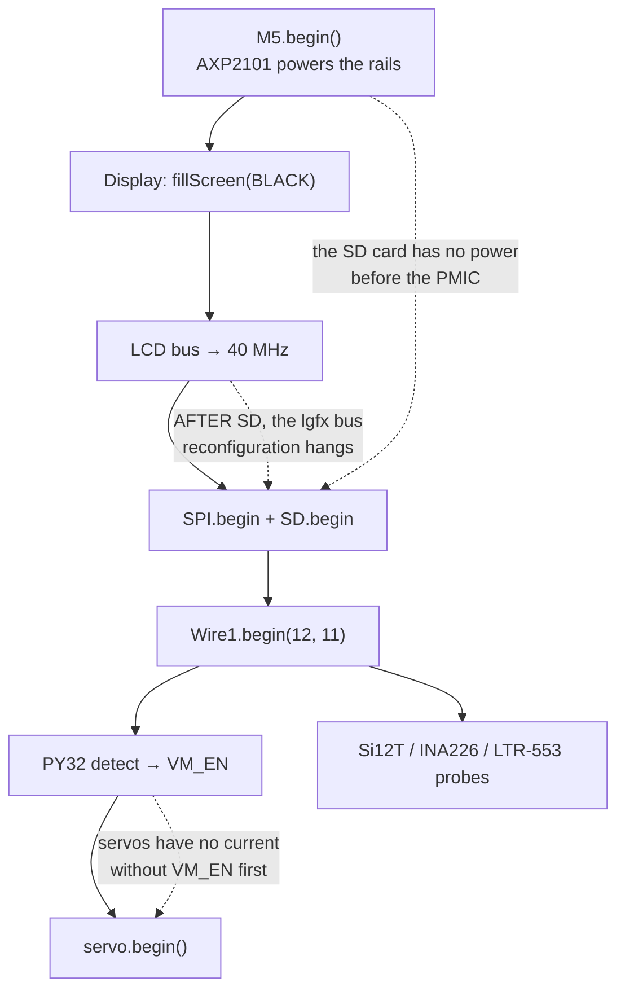

> **English** · [Français](README.fr.md)

# The hardware — what the firmware actually drives

This rubric describes the **machine**: what is on it, what it is wired to, what
it costs to talk to, and where it refuses to go. It exists because most of the
hard-won knowledge in this project is not about code — it is about a board
where two logical buses share one physical pair of wires, where a servo end
stop destroys the servo, and where the ambient light sensor is behind a wall.

Start here if you have just been handed the robot. If you are looking for a
mechanism rather than a part, go to
[`architecture/WORKFLOWS.md`](../architecture/WORKFLOWS.md) instead.

## The four documents

| Document | Answers |
|---|---|
| **`README.md`** (this file) | what the machine is, the full parts inventory, the boot order, the two board profiles |
| [`BUSES.md`](BUSES.md) | the four buses and what sharing them costs: I2C 11/12, SPI2, I2S1, the servo UART |
| [`PERIPHERALS.md`](PERIPHERALS.md) | every part one by one: address, driver, calibration, failure mode |
| [`LIMITS.md`](LIMITS.md) | budgets and dead ends: flash map, memory, the 33 ms frame, what was tried and failed |

## The machine in one paragraph

An **M5Stack CoreS3** (ESP32-S3, dual core at 240 MHz, 16 MB flash, 8 MB PSRAM,
320×240 capacitive touch panel) sitting in an **M5Stack StackChan K151** kit,
which adds the head/neck servos, an IO expander driving twelve LEDs, a
capacitive touch strip on top of the head, and a battery gauge. The CoreS3 is
the whole computer; the K151 is a body wrapped around it.

Everything below either comes with the CoreS3 or comes with the K151, and the
difference matters constantly: the two halves talk over **the same two I2C
wires** with no hardware arbitration between them.

## Full inventory

The **Bus** column is the thing to read first — it is where the constraints
come from. `In_I2C` and `Wire1` are two software stacks on **one physical
bus** (see [`BUSES.md`](BUSES.md)).

| Part | Role | Bus | Address / pins | Driver |
|---|---|---|---|---|
| ESP32-S3 | the computer | — | — | Arduino-ESP32 core |
| ILI9342C 320×240 | display | SPI2 | shared with SD | M5GFX (`M5.Display`) |
| FT6336 | screen touch | `In_I2C` | — | M5Unified (`M5.Touch`) |
| microSD | cards, bins, config | SPI2 | SCK 36, MISO 35, MOSI 37, CS 4 | `SD.h` + `firmware/common/SdPins.h` |
| AXP2101 | PMIC, battery, power rails | `In_I2C` | — | M5Unified (`M5.Power`) |
| BMI270 | 6-axis IMU (VOR, reflexes) | `In_I2C` | — | M5Unified (`M5.Imu`) + `hal/ImuReader.h` |
| BMM150 | magnetometer (heading) | `In_I2C` | — | M5Unified (`imu_data_t.mag`) |
| BM8563 | RTC (night volume, sun clock) | `In_I2C` | — | M5Unified (`M5.Rtc`) |
| LTR-553ALS | ambient light | `In_I2C` | `0x23` | `firmware/common/Ltr553.h` |
| GC0308 | VGA camera | `In_I2C` (SCCB) + DVP | `0x21` + DVP pins | `hal/Camera.h` |
| ES7210 ×2 | stereo microphones | I2S1 | BCLK 34, WS 33 | M5Unified (`M5.Mic`) |
| AW88298 | speaker amplifier | I2S1 | shared with the mics | M5Unified (`M5.Speaker`) |
| PY32 | IO expander: servo rail + LEDs | `Wire1` | `0x6F` | `hal/Py32Expander.h` |
| WS2812C ×12 | body LEDs, two bars of six | via PY32 | PY32 GPIO 13 | `hal/Py32Expander.h` |
| Si12T | head touch, 3 zones | `Wire1` | `0x68` | `hal/Si12T.h` |
| INA226 | battery gauge (bus + shunt) | `Wire1` | `0x41` | `hal/Ina226.h` |
| SCS0009 ×2 | neck servos, yaw + pitch | UART2 | TX G6, RX G7, IDs 1 and 2 | `behavior/ServoMotion.h` |
| ST25R3916 | NFC | `In_I2C` | `0x50` | **not implemented** |
| IRM56384 | infrared receive/send | GPIO | RX G10, TX G5 | **not implemented** |

## Boot order, and why it is an order

`hal/Board.h` owns this sequence. It is not a style preference: each step
depends on the previous one having *finished*, and three of the arrows below
were paid for with a boot that hung or a peripheral that silently did nothing.

Three of those constraints are worth stating in words, because they fail
*silently* rather than loudly:

- **The PMIC powers the SD card.** `SD.begin()` before `M5.begin()` mounts
  nothing, so no `config.yaml`, so no WiFi credentials, so no network — and
  none of those three report an error.
- **The LCD bus frequency must be set before `SD.begin()`.** Reconfiguring the
  lgfx `Bus_SPI` once the SD card is attached to the same SPI2 freezes the
  ESP-IDF `spi_bus_lock`. That one hangs the boot outright.
- **VM_EN before the servos.** The PY32 GPIO 0 is the servo power rail. Calling
  `servo.begin()` first gets you a servo bus that answers nothing, because the
  servos have no current. The PY32 also boots slowly (~200 ms), so detection
  retries for up to 1.2 s before giving up.

## Two board profiles

The same sources build for a second board. The guest bins `flight-radar` and
`space` each have a `-fire` variant that runs standalone on an **M5Stack Fire**
— no K151, no companion firmware, no touch panel.

| | CoreS3 + K151 | M5Stack Fire |
|---|---|---|
| Screen | 320×240, **capacitive touch** | 320×240, **three buttons** |
| PSRAM | 8 MB | 8 MB |
| SD wiring | SCK 36 / MISO 35 / MOSI 37 / CS 4 | VSPI: 18 / 19 / 23 / CS 4 |
| Servos | SCS0009 ×2 | none |
| Light sensor | LTR-553 | none (probed, reported absent) |
| WS2812 ring | 12, behind the PY32 on Wire1 | none (**declared**, not probed — see below) |
| Companion firmware | yes — lobby, return path | none: the bin *is* the firmware |

The differences are expressed as **capability flags** in a `BOARD PROFILE`
block at the top of the relevant `main.cpp` — `SCE_INPUT_BUTTONS`,
`SCE_HAS_SERVO`, `SCE_HAS_LTR553`, `SCE_HAS_PY32`, `SCE_COMPANION`,
`SCE_SD_*` — never as a fork of the source. They are named after **what the
board has**, never after a board name, so a third board is a new set of values
and not a new `#ifdef` family.

**Declared or probed is itself a decision.** The light sensor is *probed* at
boot and the answer published, which covers a board that never had one and, in
the bargain, a board whose sensor is dead — a build flag could only ever cover
the first. The WS2812 ring is *declared* (`SCE_HAS_PY32`) because probing it is
not free: reaching the expander means calling `Wire1.begin(12, 11)` first, and
on a classic ESP32 such as the Fire, **GPIO 6-11 are the SPI flash** — pin 11
is not a spare pin there, it is the one the program is being read from. A
capability that cannot be asked about safely has to be declared.

⚠ **With both boards plugged in, always pass `--upload-port`.** A `pio run -t
upload` without it picks a port on its own and can overwrite the StackChan's
companion with the Fire's binary. COM numbers depend on plug order; the USB
identity does not — `scripts/dev/find-port.ps1 -Board fire` resolves it by
VID/PID and refuses when the board is absent or ambiguous.

## References

| Source | What it is good for |
|---|---|
| [docs.m5stack.com/en/core/CoreS3](https://docs.m5stack.com/en/core/CoreS3) | CoreS3 pinout, the internal I2C map, the PMIC rails |
| [docs.m5stack.com/en/StackChan](https://docs.m5stack.com/en/StackChan) | the K151 kit: body bus pins, **the servo angle limits** |
| [github.com/m5stack/StackChan](https://github.com/m5stack/StackChan) | the vendor ESP-IDF firmware — the source of the PY32 and Si12T register protocols |
| [`hal/`](../../src/hal/) | the drivers themselves; every header opens with what the part does and what breaks |
| [`validation/VALIDATION.md`](../validation/VALIDATION.md) | which of these behaviours are **proven on the robot** rather than merely coded |

The vendor firmware deserves a specific note: the PY32 LED protocol and the
Si12T register sequence are **not published as datasheets**. They were read out
of that repository, and the comments in `hal/Py32Expander.h` and `hal/Si12T.h`
name the source files. An earlier guessed LED protocol ACKed on I2C and lit
nothing — on a bus that acknowledges a write, "it did not crash" is not
evidence that it worked.
