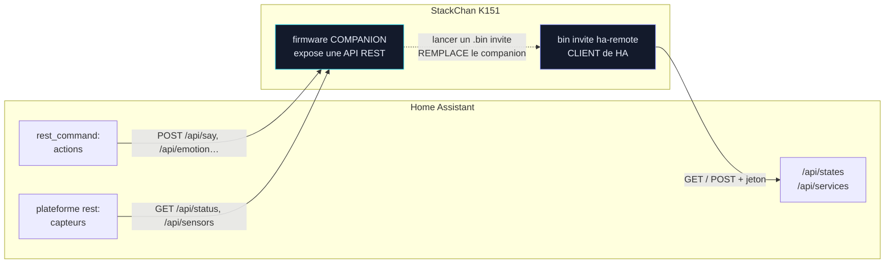

> [English](HOMEASSISTANT.md) · **Français** — l'anglais est la version de référence.
> Ce fichier peut être en retard d'une mise à jour : en cas de divergence, l'anglais fait foi.

# HOMEASSISTANT.md — intégrer StackChan à Home Assistant

> **Sens de la relation** : ce document décrit HA qui **pilote le robot**
> (le companion expose une API REST). Pour l'inverse — le robot qui
> **pilote votre domotique** (volets, lumières, prises, caméras depuis
> l'écran) — voir le bin invité [`docs/guests/HA-REMOTE.md`](../guests/HA-REMOTE.fr.md).

> Aucun ESPHome, aucun reflash : le firmware companion expose déjà une API
> REST classique (`docs/reference/CONFIG.md`, `WebApi.h`). Home Assistant sait parler
> REST nativement via `rest_command:` (actions) et la plateforme `rest`
> (capteurs) — c'est tout ce qu'il faut.

## Pourquoi pas ESPHome

ESPHome est un firmware à part entière, pas une brique qu'on ajoute par-dessus
un firmware existant : le flasher sur le StackChan REMPLACERAIT tout le
firmware companion (yeux, VOR, danses, etc.). Home Assistant n'a pas besoin
d'ESPHome pour parler à un appareil REST — `rest_command`/`rest` suffisent.

Contrepartie : pas d'auto-découverte façon ESPHome, les entités se déclarent
à la main dans la config YAML de HA (ci-dessous).

Les deux sens de la relation, à ne pas confondre. Ils sont **indépendants**
et peuvent coexister : le companion répond à HA, et le bin invité
`ha-remote` interroge HA — mais jamais en même temps, puisque lancer un
`.bin` invité remplace le companion en mémoire.



Ce document couvre la flèche du haut. La flèche du bas est décrite dans
[`guests/HA-REMOTE.md`](../guests/HA-REMOTE.fr.md).

## 0. Sécuriser l'accès (recommandé si exposé au-delà du LAN)

Par défaut l'API est **ouverte** (aucune authentification). Pour la protéger :

1. Console StackChan `http://<ip>/` → section **« Sécurité API »** → renseigner
   utilisateur/mot de passe → Enregistrer (appliqué immédiatement, persisté
   sur la carte SD, aucun redémarrage requis).
2. Ou directement dans `config.yaml` (carte SD) — voir `docs/reference/CONFIG.md` §`api:`.
3. Ou à chaud : `POST /api/security?username=admin&password=...` (password
   vide désactive la protection).

Chaque exemple `rest_command`/`rest` ci-dessous a une variante avec/sans
`username`/`password` — ajoute-les seulement si tu as activé la protection.

Il existe un **second** interrupteur d'exposition, sans rapport avec Home
Assistant mais bon à connaître tant qu'on est dans cette section : la clé de
tuning `cors` (défaut `0`). Elle existe pour qu'une page locale — l'éditeur de
chorégraphies, par exemple — puisse parler au robot depuis `file://`, et tant
qu'elle est active, n'importe quelle page affichée par le navigateur peut en
faire autant. HA interroge depuis le serveur et n'en a jamais besoin. Elle est
lue **une fois au boot**, donc la basculer demande un redémarrage : la liste
d'en-têtes est globale au serveur et en ajout seul.

## 1. Actions — `rest_command:` (configuration.yaml de HA)

```yaml
rest_command:
  stackchan_emotion:
    url: "http://<ip-stackchan>/api/emotion?name={{ name }}&ms={{ ms | default(0) }}"
    method: POST
    # username: !secret stackchan_api_login
    # password: !secret stackchan_api_password

  stackchan_dance:
    url: "http://<ip-stackchan>/api/dance?name={{ name }}"
    method: POST

  stackchan_dance_stop:
    url: "http://<ip-stackchan>/api/dance?name=stop"
    method: POST

  stackchan_tuning:
    # ex: {{ key: "leds", value: 1 }} pour activer les LEDs d'emphase
    url: "http://<ip-stackchan>/api/tuning?{{ key }}={{ value }}"
    method: POST

  stackchan_servo:
    # déplacement relatif, ex: {{ dyaw: -10, dpitch: 0, ms: 400 }}
    url: "http://<ip-stackchan>/api/servo?dyaw={{ dyaw | default(0) }}&dpitch={{ dpitch | default(0) }}&ms={{ ms | default(400) }}"
    method: POST

  stackchan_say:
    # une notification SUR le robot : le texte de HA sur le bandeau d'état
    url: "http://<ip-stackchan>/api/say?text={{ text }}&ms={{ ms | default(4000) }}"
    method: POST

  stackchan_field:
    # écrit un champ du tableau noir — c'est ainsi que HA nourrit les jauges
    url: "http://<ip-stackchan>/api/field?{{ key }}={{ value }}"
    method: POST

  stackchan_statusbar:
    # 0 défaut · 2 son · 3 jauges · 4 minuteur · 5 pomodoro
    url: "http://<ip-stackchan>/api/statusbar?mode={{ mode }}"
    method: POST

  stackchan_timer:
    # action=set (+ m, s, start) | tap | reset
    url: "http://<ip-stackchan>/api/timer?action={{ action }}&m={{ m | default(0) }}&s={{ s | default(0) }}&start={{ start | default(1) }}"
    method: POST

  stackchan_reboot:
    url: "http://<ip-stackchan>/api/reboot"
    method: POST

  stackchan_poweroff:
    url: "http://<ip-stackchan>/api/poweroff"
    method: POST
```

`say` et `field` sont les deux qui font du robot une SORTIE de la domotique et
non plus seulement une chose qu'on allume : le premier pose une phrase sur son
bandeau, le second alimente les jauges décrites dans
[`../reference/STATUSBAR.fr.md`](../reference/STATUSBAR.fr.md) §5 — un quota,
un cycle de lave-linge ou la charge d'une voiture peuvent ainsi vivre sur le
visage du robot sans une ligne de firmware.

Appel depuis une automatisation/script :

```yaml
action: rest_command.stackchan_emotion
data:
  name: Happy
  ms: 4000
```

Émotions valides — les 30 noms de `engine/Emotions.h`, reconnus **sans tenir
compte de la casse**, donc `happy` marche aussi bien que `Happy` :

`Normal` `Angry` `Glee` `Happy` `Sad` `Worried` `Focused` `Annoyed`
`Surprised` `Skeptic` `Frustrated` `Unimpressed` `Sleepy` `Suspicious`
`Nervous` `Furious` `Scared` `Awe` `Excited` `Questioning` `Frozen` `Scary`
`Curious` `Doubt` `Contempt` `Disgust` `Smug` `Dead` `Blush` `Squint`.

Elles sont écrites ici parce que, contrairement aux danses, elles n'ont
**aucun endpoint de liste** : `GET /api/dances` renvoie les danses courantes
(intégrées plus chorégraphies SD) justement parce que cet ensemble change avec
la carte, là où les émotions sont compilées et se recopient une fois pour
toutes.

## 2. États — plateforme `rest` (capteurs)

Un seul appel `GET /api/status` fournit tout ; HA peut en extraire plusieurs
capteurs avec `value_template` (un seul poll réseau, plusieurs entités) :

```yaml
rest:
  - resource: "http://<ip-stackchan>/api/status"
    scan_interval: 15
    # username: admin
    # password: !secret stackchan_api_password
    sensor:
      - name: "StackChan Emotion"
        value_template: "{{ value_json.emotion }}"
      - name: "StackChan Batterie"
        unit_of_measurement: "%"
        device_class: battery
        value_template: "{{ value_json.batt }}"
      - name: "StackChan RSSI"
        unit_of_measurement: "dBm"
        value_template: "{{ value_json.rssi }}"
      - name: "StackChan Charge CPU coeur1"
        unit_of_measurement: "%"
        value_template: "{{ value_json.load1 }}"
    binary_sensor:
      - name: "StackChan En charge"
        device_class: battery_charging
        value_template: "{{ value_json.chg == 1 }}"
      - name: "StackChan CRT actif"
        value_template: "{{ value_json.crt == 1 }}"
```

Champs disponibles dans `/api/status` (détail : `docs/reference/CONFIG.md`,
`OPENAPI_JSON` sur `/swagger`) : `emotion`, `uptimeS`, `heap`, `frameAvgUs`,
`frameMaxUs`, `rssi`, `mode`, `ip`, `crt`, `sd`, `yaw`, `pitch`, `mic` (état
micro : `off`/`warmup`/`standby`/`active`), `micWait` (secondes restantes avant
que le micro ait le droit de démarrer), `micL`/`micR`/`micAmb`/`micEvt`,
`load0`/`load1`, `batt`, `chg`, `inaV`, `light`, `heading`, `cam`, `camErr`,
`statusbar` (le mode de bandeau courant), `clock` (epoch UTC — **`0` signifie
que NTP n'a jamais répondu**), `night` (0/1), `authOn`, `authUser`. Un matériel
absent rapporte `-1` plutôt que de disparaître, si bien qu'un template n'a
jamais à tester l'existence de la clé.

Deux d'entre eux font de bonnes entités à eux seuls : `night` est un
`binary_sensor` tout fait (le robot calcule le vrai coucher/lever du soleil
depuis `lat`/`lon`, il s'accorde donc avec la maison sans second calcul), et
`clock == 0` est la façon honnête de dire que le robot n'a pas encore l'heure
plutôt que d'afficher 1970.

## 2bis. Quel firmware tourne — `GET /api/firmware`

Quatre champs, et les seuls qui répondent « qu'y a-t-il réellement sur cette
carte » :

```json
{"slot":"app0","sha":"1a2b3c4d","console":"9f8e7d6c","reset":"sw"}
```

| Champ | Ce qu'il tranche |
|---|---|
| `slot` | la partition OTA qui a démarré (`app0` / `app1`). Un upload USB écrit toujours `app0` et ne touche jamais `otadata` ; le retour d'un bin invité écrit l'autre slot et bascule `otadata` |
| `sha` | les 8 premiers hex du sha256 de l'ELF applicatif, reproductibles sur la machine de développement par `sha256sum .pio/build/companion/firmware.elf`. Deux builds de la même branche sont sinon indiscernables de l'extérieur |
| `console` | empreinte de la source de la console embarquée — celle qu'imprime `python scripts/build/gen_console_gz.py --check` |
| `reset` | pourquoi la carte a démarré la dernière fois : `poweron`, `ext`, `sw`, `panic`, `int_wdt`, `task_wdt`, `wdt`, `deepsleep`, `brownout`, `sdio`, `unknown` |

`reset` est le champ que veut une automatisation. `poweron` et `sw` sont
ordinaires — une prise, un `POST /api/reboot`. `panic`, `task_wdt`, `int_wdt`
et `brownout` ne le sont pas : ils disent que le robot est tombé. Un robot qui
tombe en boucle ne s'annonce sinon que par un uptime qui ne grandit jamais,
ce sur quoi rien n'alerte.

```yaml
rest:
  - resource: "http://<ip-stackchan>/api/firmware"
    scan_interval: 300
    sensor:
      - name: "StackChan Firmware"
        value_template: "{{ value_json.sha }}"
        json_attributes: [slot, console, reset]
      - name: "StackChan Dernier reset"
        value_template: "{{ value_json.reset }}"
```

Attraper un cycle de redémarrages ne coûte alors qu'une automatisation :

```yaml
automation:
  - alias: "StackChan a planté"
    trigger:
      - platform: state
        entity_id: sensor.stackchan_dernier_reset
        to: ["panic", "task_wdt", "int_wdt", "brownout"]
    action:
      - action: notify.mobile_app
        data:
          message: >-
            StackChan a redémarré après {{ states('sensor.stackchan_dernier_reset') }}
            (slot {{ state_attr('sensor.stackchan_firmware', 'slot') }},
            build {{ states('sensor.stackchan_firmware') }})
```

Séparer `brownout` du reste vaut le déclencheur supplémentaire : il désigne
l'alimentation, pas le logiciel — servos et LEDs qui tirent ensemble sur une
batterie fatiguée — et le correctif est un câble, pas un build.

Le capteur `sha` sert aussi de contrôle de déploiement, puisqu'il change quand,
et seulement quand, on flashe. Un `sha` qui REVIENT à une valeur plus ancienne
après le lancement puis le retour d'un bin invité signifie que le
`/companion.bin` de la carte est périmé et a écrasé la flash — une panne
qu'aucun autre signal ne rapporte, puisque le flash a réussi et que le robot
est bien revenu sur le réseau.

Il n'y a délibérément **aucune date de build** ici. Le champ a existé et a été
retiré : sa seule source disponible est la date des bibliothèques Arduino
précompilées, si bien qu'il répondait `Mar 5 2024` pour un firmware compilé
cinq minutes plus tôt. Un champ qui a l'air de faire autorité et qui est faux
vaut moins que pas de champ.

## 3. Exemples d'automatisations

**Notifier une batterie faible** (le firmware affiche déjà une alerte à
l'écran à 15 % ou moins et hors charge — ceci ajoute une notif HA) :

```yaml
automation:
  - alias: "StackChan batterie faible"
    trigger:
      - platform: numeric_state
        entity_id: sensor.stackchan_batterie
        below: 15
    condition:
      - condition: state
        entity_id: binary_sensor.stackchan_en_charge
        state: "off"
    action:
      - action: notify.mobile_app
        data:
          message: "StackChan à {{ states('sensor.stackchan_batterie') }} %"
```

**Réagir à un capteur de présence** (ex. Happy quand quelqu'un rentre) :

```yaml
automation:
  - alias: "StackChan accueil"
    trigger:
      - platform: state
        entity_id: binary_sensor.presence_entree
        to: "on"
    action:
      - action: rest_command.stackchan_emotion
        data: { name: Happy, ms: 5000 }
```

## 3bis. Caméra (GC0308) → Home Assistant / Frigate

Le CoreS3 embarque une caméra **GC0308 (VGA 640×480)**. Le firmware l'expose
en JPEG, **désactivée par défaut** (`tuning camera`, init à la demande, éteinte
au repos — aucune ressource consommée tant qu'on ne l'active pas). **Le VOR /
les yeux restent actifs pendant le streaming** (le SCCB passe par le même i2c
que l'IMU, sérialisé).

Activer : console → Options → **Caméra** (bouton « 📷 Voir la caméra » pour un
aperçu live), ou `POST /api/tuning?camera=1`.

Endpoints :
- `GET /api/camera/still.jpg` — dernière frame **live** (compressée
  `cam_stream_quality`, 320×240 si `cam_stream_qvga=1` — défaut). Home
  Assistant « generic camera ».
- `GET /api/camera/still.jpg?full=1` — instantané **VGA pleine qualité**
  (`cam_quality`) capturé à la demande : répond `503` tant que le cliché
  frais n'est pas prêt (~1 s) — retenter toutes les ~300 ms.
- `GET /api/camera/stream` — flux **MJPEG** (`multipart/x-mixed-replace`) pour
  Frigate ou la plateforme `mjpeg` de HA (même qualité/taille que le live).

Caméra éteinte, l'instantané et le flux répondent **403** en texte brut plutôt
qu'une image vide : une intégration qui reçoit un 403 a quelque chose à montrer
à son utilisateur, là où une frame blanche ressemblerait à une caméra en panne.

Réglages (à chaud, console → Tuning → **Caméra**, persistés SD) : `cam_fps`
(plafond 1-15), `cam_quality` (1-63, **bas = meilleure image** — s'applique à
l'instantané `?full=1`), `cam_stream_quality` (1-63, qualité du flux/vue live —
**haut = plus compressé**, commandes plus réactives), `cam_stream_qvga` (1 =
flux/vue 320×240, ~4× moins d'octets radio — 0 = VGA), `cam_brightness`/
`cam_contrast`/`cam_saturation` (-2..+2), `cam_lowlight` (0/1 : gain/exposition
AEC déplafonnés), `cam_vflip`/`cam_hmirror`, `cam_colorbar` (mire de test). ⚠ Le
GC0308 est un capteur bon marché **peu sensible** : en faible lumière l'image
est sombre/bruitée (`cam_lowlight: 1` aide, mais rien ne remplace un éclairage
correct).

**Télémétrie capteurs** : `GET /api/sensors` renvoie batterie (`batt_pct`,
`charging`), jauge INA226 (`ina_v`, `ina_shunt_mv`), lumière ambiante
(`light_pct` et le compte brut `light_raw`), cap magnétique BMM150 (`heading`,
-1 si absent) avec les trois axes dont il sort (`mag_x`, `mag_y`, `mag_z`, en
µT), et la notion de temps et d'obscurité propre au robot (`clock`, epoch UTC,
`0` si NTP n'a jamais répondu ; `night` 0/1) — tout cela exposable en capteurs
REST Home Assistant. Le compte brut de lumière voisine le pourcentage parce que
le pourcentage est une conversion et le compte une mesure : quand la luminosité
automatique se comporte bizarrement, les deux ensemble disent si le fautif est
le capteur ou la conversion.

**Home Assistant — flux MJPEG (recommandé)** :

```yaml
camera:
  - platform: mjpeg
    name: StackChan
    mjpeg_url: "http://<ip-stackchan>/api/camera/stream"
    still_image_url: "http://<ip-stackchan>/api/camera/still.jpg"
    # username: !secret stackchan_api_login      # si Basic Auth activé
    # password: !secret stackchan_api_password
    # authentication: basic
```

(ou `platform: generic` avec seulement `still_image_url` si on préfère le poll
d'instantanés.)

**Frigate** — entrée ffmpeg sur le flux MJPEG. Par défaut le flux est en
**320×240** (`cam_stream_qvga: 1`) ; pour du 640×480, poser
`POST /api/tuning?cam_stream_qvga=0` et adapter `detect` :

```yaml
cameras:
  stackchan:
    ffmpeg:
      inputs:
        - path: "http://<ip-stackchan>/api/camera/stream"
          # avec Basic Auth : http://admin:motdepasse@<ip>/api/camera/stream
          input_args: -avoid_negative_ts make_zero -fflags +genpts -r 10 -f mjpeg
          roles: [detect]
    detect:
      width: 320    # 640 si cam_stream_qvga=0
      height: 240   # 480 si cam_stream_qvga=0
      fps: 5
```

> **Notes d'implémentation** — quatre contraintes matérielles du GC0308 sur
> CoreS3 (référence croisée firmware officiel StackChan) :
> 1. **Bus SCCB partagé** — M5Unified pilote l'i2c interne (broches 11/12,
>    IMU/AXP/AW9523) avec sa propre implémentation registre (`m5gfx::i2c`),
>    pas le driver IDF qu'`esp32-camera` attend.
>    `firmware/companion/sccb_m5.cpp` **redéfinit** les fonctions SCCB_* pour
>    router le bus de contrôle via `M5.In_I2C` (le firmware officiel fait
>    l'équivalent avec `init_sccb=false` + `i2c_handle` partagé). Garde
>    `hal/I2cGate.h` : l'IMU est suspendu pendant les rafales SCCB (~2 s à
>    l'init SEULEMENT — le VOR reste actif pendant le streaming).
> 2. **Frames partielles** — l'arbitrage SPI-DMA écran vs GDMA caméra peut
>    faire déborder le FIFO à mi-frame ; le renderer est mis en pause pendant
>    le remplissage DMA (~40 ms/frame, imperceptible).
> 3. **Pas de JPEG matériel** — capture YUV422 (YUYV) + encodage JPEG
>    logiciel (`frame2jpg`). (XCLK = quartz externe 20 MHz, pas piloté par
>    l'ESP32.)
> 4. **Table d'init du capteur** — la **table de calibration officielle
>    Espressif** (`esp_cam_sensor` gc0308, Apache-2.0) fournit les bases
>    AWB/gamma/couleurs, en préservant les registres d'interface du driver
>    arduino ; les réglages (`cam_*`) s'appliquent en écritures registre
>    directes autour des bases calibrées.

## 4. Limites à connaître

- Pas de push : HA doit **poller** `/api/status` (`scan_interval`) — pas de
  websocket/MQTT côté StackChan actuellement.
- `rest_command` ne lit pas la réponse par défaut ; ajouter
  `payload_template`/`response_variable` (HA récent) si besoin de la
  confirmation JSON dans une automatisation.
- Basic Auth = HTTP simple (pas de TLS sur ce firmware) : suffisant sur un
  LAN de confiance, pas conçu pour une exposition Internet directe.
- Après un changement de mot de passe API, les entités `rest`/`rest_command`
  existantes de HA gardent les identifiants qu'on leur a donnés dans le YAML
  — les mettre à jour manuellement si le mot de passe change.

## Voir aussi

- `docs/reference/CONFIG.md` — schéma complet `config.yaml` (section `api:`)
- `/swagger` sur le robot — spec OpenAPI interactive, tous les endpoints
- `docs/ROADMAP.md` §A4 — carte du code si un nouvel endpoint est nécessaire
