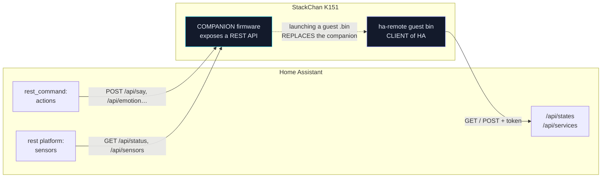

> **English** · [Français](HOMEASSISTANT.fr.md)

# HOMEASSISTANT.md — integrating StackChan with Home Assistant

> **Direction of the relationship**: this document describes HA **driving the
> robot** (the companion exposes a REST API). For the opposite direction — the
> robot **driving your home automation** (blinds, lights, plugs, cameras from
> the screen) — see the guest bin [`docs/guests/HA-REMOTE.md`](../guests/HA-REMOTE.md).

> No ESPHome, no reflash: the companion firmware already exposes a plain REST
> API (`docs/reference/CONFIG.md`, `WebApi.h`). Home Assistant speaks REST
> natively through `rest_command:` (actions) and the `rest` platform (sensors) —
> that is all it takes.

## Why not ESPHome

ESPHome is a full firmware, not a building block you add on top of an existing
firmware: flashing it onto the StackChan would REPLACE the whole companion
firmware (eyes, VOR, dances, etc.). Home Assistant does not need ESPHome to
talk to a REST device — `rest_command`/`rest` are enough.

The trade-off: no ESPHome-style auto-discovery, so entities are declared by
hand in HA's YAML config (below).

The two directions of the relationship must not be confused. They are
**independent** and can coexist: the companion answers HA, and the `ha-remote`
guest bin queries HA — but never at the same time, since launching a guest
`.bin` replaces the companion in memory.



This document covers the top arrow. The bottom arrow is described in
[`guests/HA-REMOTE.md`](../guests/HA-REMOTE.md).

## 0. Securing access (recommended if exposed beyond the LAN)

By default the API is **open** (no authentication). To protect it:

1. StackChan console `http://<ip>/` → **"Sécurité API"** section → fill in
   username/password → Save (applied immediately, persisted to the SD card, no
   reboot required).
2. Or directly in `config.yaml` (SD card) — see `docs/reference/CONFIG.md`
   §`api:`.
3. Or on the fly: `POST /api/security?username=admin&password=...` (an empty
   password disables the protection).

Every `rest_command`/`rest` example below has a variant with/without
`username`/`password` — add them only if you enabled the protection.

There is a **second** exposure switch, unrelated to Home Assistant but worth
knowing about while you are in this section: the `cors` tuning key (default
`0`). It exists so that a local page — the choreography editor, say — can talk
to the robot from `file://`, and while it is on, any page your browser happens
to display can do the same. HA polls from the server side and never needs it.
It is read **once at boot**, so flipping it takes a restart: the header list is
global to the server and add-only.

## 1. Actions — `rest_command:` (HA's configuration.yaml)

```yaml
rest_command:
  stackchan_emotion:
    url: "http://<ip-stackchan>/api/emotion?name={{ name }}&ms={{ ms | default(0) }}"
    method: POST
    # username: !secret stackchan_api_login
    # password: !secret stackchan_api_password

  stackchan_dance:
    url: "http://<ip-stackchan>/api/dance?name={{ name }}"
    method: POST

  stackchan_dance_stop:
    url: "http://<ip-stackchan>/api/dance?name=stop"
    method: POST

  stackchan_tuning:
    # e.g. {{ key: "leds", value: 1 }} to enable the emphasis LEDs
    url: "http://<ip-stackchan>/api/tuning?{{ key }}={{ value }}"
    method: POST

  stackchan_servo:
    # relative move, e.g. {{ dyaw: -10, dpitch: 0, ms: 400 }}
    url: "http://<ip-stackchan>/api/servo?dyaw={{ dyaw | default(0) }}&dpitch={{ dpitch | default(0) }}&ms={{ ms | default(400) }}"
    method: POST

  stackchan_say:
    # a notification ON the robot: HA's text on the status band
    url: "http://<ip-stackchan>/api/say?text={{ text }}&ms={{ ms | default(4000) }}"
    method: POST

  stackchan_field:
    # writes a blackboard field — how HA feeds the gauge widgets
    url: "http://<ip-stackchan>/api/field?{{ key }}={{ value }}"
    method: POST

  stackchan_statusbar:
    # 0 default · 2 sound · 3 gauges · 4 timer · 5 pomodoro
    url: "http://<ip-stackchan>/api/statusbar?mode={{ mode }}"
    method: POST

  stackchan_timer:
    # action=set (+ m, s, start) | tap | reset
    url: "http://<ip-stackchan>/api/timer?action={{ action }}&m={{ m | default(0) }}&s={{ s | default(0) }}&start={{ start | default(1) }}"
    method: POST

  stackchan_reboot:
    url: "http://<ip-stackchan>/api/reboot"
    method: POST

  stackchan_poweroff:
    url: "http://<ip-stackchan>/api/poweroff"
    method: POST
```

`say` and `field` are the two that make the robot an OUTPUT of your home
automation rather than a thing you merely switch on: the first puts a sentence
on its band, the second feeds the gauge widgets described in
[`../reference/STATUSBAR.md`](../reference/STATUSBAR.md) §5, so a quota, a
laundry cycle or a car's charge can live on the robot's face without a single
line of firmware.

Calling it from an automation/script:

```yaml
action: rest_command.stackchan_emotion
data:
  name: Happy
  ms: 4000
```

Valid emotions — the 30 names of `engine/Emotions.h`, matched
**case-insensitively**, so `happy` works as well as `Happy`:

`Normal` `Angry` `Glee` `Happy` `Sad` `Worried` `Focused` `Annoyed`
`Surprised` `Skeptic` `Frustrated` `Unimpressed` `Sleepy` `Suspicious`
`Nervous` `Furious` `Scared` `Awe` `Excited` `Questioning` `Frozen` `Scary`
`Curious` `Doubt` `Contempt` `Disgust` `Smug` `Dead` `Blush` `Squint`.

They are written out here because, unlike the dances, they have **no list
endpoint**: `GET /api/dances` returns the current dances (built-in plus SD
choreographies) precisely because that set changes with the card, while the
emotions are compiled in and can be copied once.

## 2. States — `rest` platform (sensors)

A single `GET /api/status` call provides everything; HA can extract several
sensors from it with `value_template` (one network poll, several entities):

```yaml
rest:
  - resource: "http://<ip-stackchan>/api/status"
    scan_interval: 15
    # username: admin
    # password: !secret stackchan_api_password
    sensor:
      - name: "StackChan Emotion"
        value_template: "{{ value_json.emotion }}"
      - name: "StackChan Battery"
        unit_of_measurement: "%"
        device_class: battery
        value_template: "{{ value_json.batt }}"
      - name: "StackChan RSSI"
        unit_of_measurement: "dBm"
        value_template: "{{ value_json.rssi }}"
      - name: "StackChan CPU load core1"
        unit_of_measurement: "%"
        value_template: "{{ value_json.load1 }}"
    binary_sensor:
      - name: "StackChan Charging"
        device_class: battery_charging
        value_template: "{{ value_json.chg == 1 }}"
      - name: "StackChan CRT on"
        value_template: "{{ value_json.crt == 1 }}"
```

Fields available in `/api/status` (details: `docs/reference/CONFIG.md`,
`OPENAPI_JSON` on `/swagger`): `emotion`, `uptimeS`, `heap`, `frameAvgUs`,
`frameMaxUs`, `rssi`, `mode`, `ip`, `crt`, `sd`, `yaw`, `pitch`, `mic` (mic
state: `off`/`warmup`/`standby`/`active`), `micWait` (seconds left before the
mic is allowed to start), `micL`/`micR`/`micAmb`/`micEvt`, `load0`/`load1`,
`batt`, `chg`, `inaV`, `light`, `heading`, `cam`, `camErr`, `statusbar` (the
current band mode), `clock` (UTC epoch — **`0` means NTP has never answered**),
`night` (0/1), `authOn`, `authUser`. Absent hardware reports `-1` rather than
going missing, so a template never has to test for the key's existence.

Two of them make good entities on their own: `night` is a ready-made
`binary_sensor` (the robot computes real sunset/sunrise from `lat`/`lon`, so
it agrees with the house without a second calculation), and `clock == 0` is
the honest way to tell that the robot has no time yet rather than showing
1970.

## 2bis. Which firmware is running — `GET /api/firmware`

Four fields, and the only ones that answer "what is actually on this board":

```json
{"slot":"app0","sha":"1a2b3c4d","console":"9f8e7d6c","reset":"sw"}
```

| Field | What it settles |
|---|---|
| `slot` | the OTA partition that booted (`app0` / `app1`). A USB upload always writes `app0` and never touches `otadata`; a guest bin's return writes the other slot and switches `otadata` over |
| `sha` | first 8 hex of the application ELF's sha256, reproducible on the development machine with `sha256sum .pio/build/companion/firmware.elf`. Two builds of the same branch are otherwise indistinguishable from the outside |
| `console` | fingerprint of the embedded console's source — the one `python scripts/build/gen_console_gz.py --check` prints |
| `reset` | why the board last started: `poweron`, `ext`, `sw`, `panic`, `int_wdt`, `task_wdt`, `wdt`, `deepsleep`, `brownout`, `sdio`, `unknown` |

`reset` is the field an automation wants. `poweron` and `sw` are ordinary — a
plug, a `POST /api/reboot`. `panic`, `task_wdt`, `int_wdt` and `brownout` are
not: they say the robot fell over. A robot that keeps falling over otherwise
announces itself only as an uptime that never grows, which nothing alerts on.

```yaml
rest:
  - resource: "http://<ip-stackchan>/api/firmware"
    scan_interval: 300
    sensor:
      - name: "StackChan Firmware"
        value_template: "{{ value_json.sha }}"
        json_attributes: [slot, console, reset]
      - name: "StackChan Last Reset"
        value_template: "{{ value_json.reset }}"
```

Catching a reboot loop then costs one automation:

```yaml
automation:
  - alias: "StackChan crashed"
    trigger:
      - platform: state
        entity_id: sensor.stackchan_last_reset
        to: ["panic", "task_wdt", "int_wdt", "brownout"]
    action:
      - action: notify.mobile_app
        data:
          message: >-
            StackChan restarted after {{ states('sensor.stackchan_last_reset') }}
            (slot {{ state_attr('sensor.stackchan_firmware', 'slot') }},
            build {{ states('sensor.stackchan_firmware') }})
```

Separating `brownout` from the rest is worth the extra trigger: it points at
power, not software — servos and LEDs pulling together on a tired battery — and
the fix is a cable rather than a build.

The `sha` sensor doubles as a deployment check, since it changes when, and only
when, you flash. A `sha` that goes BACK to an older value after a guest bin has
been launched and returned means the card's `/companion.bin` is stale and has
overwritten the flash — a failure no other signal reports, because the flash
itself succeeded and the robot did come back on the network.

There is deliberately **no build date** here. The field existed and was
removed: its only available source is the date of the precompiled Arduino
libraries, so it answered `Mar 5 2024` for a firmware compiled five minutes
earlier. A field that looks authoritative and is wrong is worth less than no
field.

## 3. Automation examples

**Notify on low battery** (the firmware already shows an on-screen alert at or
below 15 % while not charging — this adds an HA notification):

```yaml
automation:
  - alias: "StackChan low battery"
    trigger:
      - platform: numeric_state
        entity_id: sensor.stackchan_battery
        below: 15
    condition:
      - condition: state
        entity_id: binary_sensor.stackchan_charging
        state: "off"
    action:
      - action: notify.mobile_app
        data:
          message: "StackChan at {{ states('sensor.stackchan_battery') }} %"
```

**React to a presence sensor** (e.g. Happy when somebody comes home):

```yaml
automation:
  - alias: "StackChan welcome"
    trigger:
      - platform: state
        entity_id: binary_sensor.presence_entree
        to: "on"
    action:
      - action: rest_command.stackchan_emotion
        data: { name: Happy, ms: 5000 }
```

## 3bis. Camera (GC0308) → Home Assistant / Frigate

The CoreS3 carries a **GC0308 (VGA 640×480)** camera. The firmware exposes it
as JPEG, **disabled by default** (`tuning camera`, initialised on demand, powered
down at rest — no resource is consumed until you turn it on). **The VOR and the
eyes stay alive while streaming** (the SCCB shares the same i2c as the IMU, and
is serialised).

To enable it: console → Options → **Caméra** (the "📷 Voir la caméra" button
gives a live preview), or `POST /api/tuning?camera=1`.

Endpoints:
- `GET /api/camera/still.jpg` — latest **live** frame (compressed with
  `cam_stream_quality`, 320×240 if `cam_stream_qvga=1` — the default). Home
  Assistant "generic camera".
- `GET /api/camera/still.jpg?full=1` — **full-quality VGA** snapshot
  (`cam_quality`) captured on demand: answers `503` until the fresh shot is
  ready (~1 s) — retry every ~300 ms.
- `GET /api/camera/stream` — **MJPEG** feed (`multipart/x-mixed-replace`) for
  Frigate or HA's `mjpeg` platform (same quality/size as the live view).

With the camera off, the still and the stream answer **403** in plain text
rather than an empty image: an integration that gets a 403 has a reason to show
its user, where a blank frame would look like a broken camera.

Settings (on the fly, console → Tuning → **Caméra**, persisted to SD):
`cam_fps` (capped 1-15), `cam_quality` (1-63, **low = better image** — applies
to the `?full=1` snapshot), `cam_stream_quality` (1-63, quality of the
stream/live view — **high = more compressed**, more responsive commands),
`cam_stream_qvga` (1 = stream/view at 320×240, ~4× fewer bytes on the air — 0 =
VGA), `cam_brightness`/`cam_contrast`/`cam_saturation` (-2..+2), `cam_lowlight`
(0/1: AEC gain/exposure ceilings lifted), `cam_vflip`/`cam_hmirror`,
`cam_colorbar` (sensor test pattern). ⚠ The GC0308 is a cheap, **not very
sensitive** sensor: in low light the image is dark/noisy (`cam_lowlight: 1`
helps, but nothing replaces decent lighting).

**Sensor telemetry**: `GET /api/sensors` returns battery (`batt_pct`,
`charging`), the INA226 gauge (`ina_v`, `ina_shunt_mv`), ambient light
(`light_pct` and the raw count `light_raw`), the BMM150 magnetic heading
(`heading`, -1 if absent) with the three axes it comes from (`mag_x`, `mag_y`,
`mag_z`, in µT), and the robot's own notion of time and darkness (`clock` UTC
epoch, `0` if NTP has never answered; `night` 0/1) — all exposable as Home
Assistant REST sensors. The raw light count sits next to the percentage because
the percentage is a mapping and the count is the measurement: when auto
brightness behaves oddly, the two together say whether the sensor or the
mapping is at fault.

**Home Assistant — MJPEG feed (recommended)**:

```yaml
camera:
  - platform: mjpeg
    name: StackChan
    mjpeg_url: "http://<ip-stackchan>/api/camera/stream"
    still_image_url: "http://<ip-stackchan>/api/camera/still.jpg"
    # username: !secret stackchan_api_login      # if Basic Auth is enabled
    # password: !secret stackchan_api_password
    # authentication: basic
```

(or `platform: generic` with only `still_image_url` if you prefer polling
snapshots.)

**Frigate** — an ffmpeg input on the MJPEG feed. By default the stream is
**320×240** (`cam_stream_qvga: 1`); for 640×480, set
`POST /api/tuning?cam_stream_qvga=0` and adjust `detect`:

```yaml
cameras:
  stackchan:
    ffmpeg:
      inputs:
        - path: "http://<ip-stackchan>/api/camera/stream"
          # with Basic Auth: http://admin:password@<ip>/api/camera/stream
          input_args: -avoid_negative_ts make_zero -fflags +genpts -r 10 -f mjpeg
          roles: [detect]
    detect:
      width: 320    # 640 if cam_stream_qvga=0
      height: 240   # 480 if cam_stream_qvga=0
      fps: 5
```

> **Implementation notes** — four hardware constraints of the GC0308 on the
> CoreS3 (cross-referenced against the official StackChan firmware):
> 1. **Shared SCCB bus** — M5Unified drives the internal i2c (pins 11/12,
>    IMU/AXP/AW9523) with its own register implementation (`m5gfx::i2c`), not
>    the IDF driver `esp32-camera` expects.
>    `firmware/companion/sccb_m5.cpp` **overrides** the SCCB_* functions to
>    route the control bus through `M5.In_I2C` (the official firmware does the
>    equivalent with `init_sccb=false` + a shared `i2c_handle`). Guard
>    `hal/I2cGate.h`: the IMU is suspended during the SCCB bursts (~2 s at
>    init ONLY — the VOR stays alive while streaming).
> 2. **Partial frames** — SPI-DMA display vs camera GDMA arbitration can
>    overflow the FIFO mid-frame; the renderer is paused while the DMA fills
>    (~40 ms/frame, imperceptible).
> 3. **No hardware JPEG** — YUV422 (YUYV) capture + software JPEG encoding
>    (`frame2jpg`). (XCLK = external 20 MHz crystal, not driven by the ESP32.)
> 4. **Sensor init table** — the **official Espressif calibration table**
>    (`esp_cam_sensor` gc0308, Apache-2.0) provides the AWB/gamma/colour
>    baseline while preserving the arduino driver's interface registers; the
>    settings (`cam_*`) are applied as direct register writes around those
>    calibrated baselines.

## 4. Limits worth knowing

- No push: HA has to **poll** `/api/status` (`scan_interval`) — there is no
  websocket/MQTT on the StackChan side at the moment.
- `rest_command` does not read the response by default; add
  `payload_template`/`response_variable` (recent HA) if an automation needs
  the JSON confirmation.
- Basic Auth = plain HTTP (no TLS on this firmware): fine on a trusted LAN, not
  designed for direct exposure to the Internet.
- After an API password change, HA's existing `rest`/`rest_command` entities
  keep the credentials you gave them in the YAML — update them by hand if the
  password changes.

## See also

- `docs/reference/CONFIG.md` — full `config.yaml` schema (`api:` section)
- `/swagger` on the robot — interactive OpenAPI spec, every endpoint
- `docs/ROADMAP.md` §A4 — the code map, if a new endpoint is needed
