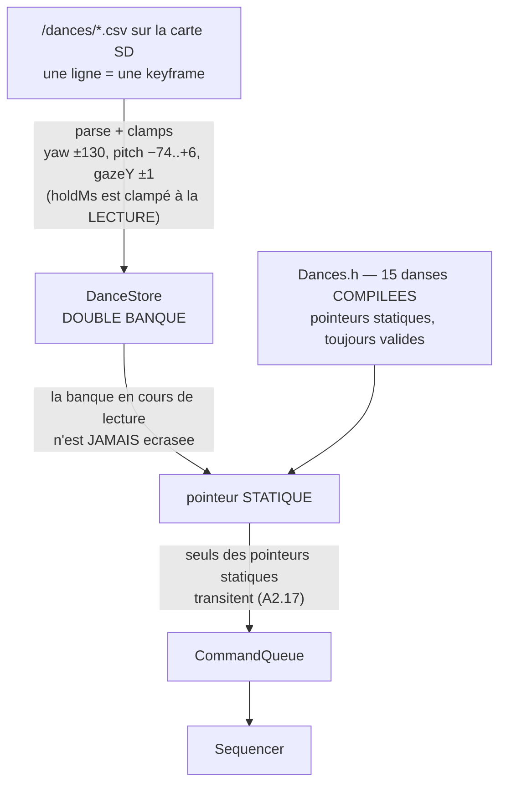

> [English](CHOREGRAPHIES.md) · **Français** — l'anglais est la version de référence.
> Ce fichier peut être en retard d'une mise à jour : en cas de divergence, l'anglais fait foi.

# CHOREGRAPHIES.md — le système de danses

Comment une danse est décrite, jouée et arbitrée, et comment en écrire une
nouvelle. Code : `src/behavior/Sequencer.h` (moteur), `src/behavior/Dances.h`
(données), câblage dans `src/behavior/Brain.h`.

> **L'écrire à la main n'est pas le chemin prévu.**
> [`tools/choregraphies/`](../../tools/choregraphies/) est un éditeur visuel
> qui **simule** la danse à mesure qu'on la compose — les yeux dessinés avec
> la géométrie du firmware et les vrais presets, un cube pour l'orientation de
> la tête —, la **joue** aux durées réelles, et écrit le CSV du §6. Il s'ouvre
> d'un double-clic : aucune installation, aucune étape de build, aucun
> serveur. Il sait aussi **capturer une pose depuis le robot** : les servos
> sont relâchés, vous posez la tête à la main, et les angles sont relus par
> `GET /api/servo/pos`. C'est la seule fonction qui touche au réseau, et elle
> exige la clé de tuning `cors` — voir
> [`tools/README.fr.md`](../../tools/README.fr.md), qui documente le protocole
> de capture et la façon dont les servos sont rendus dans les deux sens de
> sortie.

## 1. Modèle : une danse = une timeline de keyframes

Une chorégraphie est un tableau de `DanceKey` joué séquentiellement par le
`Sequencer`. Chaque keyframe décrit un état complet à atteindre.

L'**enchaînement temporel** d'une danse (rendu keyframe par keyframe,
avance du regard sur la tête, sortie propre) est illustré une fois pour
toutes dans [`architecture/WORKFLOWS.md §5`](../architecture/WORKFLOWS.fr.md) —
inutile de le redessiner ici. Ce qui suit décrit la **provenance** des
données, qui est l'autre moitié du sujet :



La double banque n'est pas un luxe : la `CommandQueue` ne transporte que
des **pointeurs**, jamais les données. Sur une banque unique, recharger un CSV
pendant qu'une danse joue laisse le `Sequencer` lire un tableau en cours de
réécriture (règle A2.17, dernier point).

```cpp
struct DanceKey {
    float    yawOff;     // ° depuis YAW_CENTER (+ = droite OBSERVATEUR)
    float    pitchOff;   // ° depuis PITCH_NEUTRAL (− = tête relevée ;
                         //   jamais > 0 utile : le servo ne descend pas
                         //   sous l'horizon — les plongées passent par gazeYBias)
    uint16_t servoMs;    // durée de la trajectoire servo vers la cible
    uint16_t holdMs;     // durée TOTALE de la keyframe (clampée ≥ servoMs)
    eEmotions emotion;   // expression posée à l'entrée (EMOTIONS_COUNT = inchangée)
    uint8_t  lidEvent;   // 0=rien 1=blink 2=wink gauche 3=wink droit
    float    gazeYBias;  // biais vertical du regard [−1..1] (NOD/SHY plongent
                         //   par les YEUX pendant que le servo reste à l'horizon)
};
```

Exemple (`PEEK`, le coup d'œil furtif Cozmo) :

```cpp
inline const DanceKey PEEK[] = {
    {  0, 0, 200, 250, Suspicious },           // l'expression s'installe
    { 30, 0, 700, 1600, EMOTIONS_COUNT },      // glisse LENTE + se fige (hold)
    { 30, 0, 100, 700, EMOTIONS_COUNT },       // micro-hold (le suspense)
    {  0, 0, 150, 250, Normal, 1 },            // recentrage SEC + blink
};
```

## 2. Le moteur (`Sequencer`) — invariants garantis

- **`holdMs ≥ servoMs`, toujours** : clamp à la volée, à la LECTURE et non au
  chargement — c'est ce qui permet aux tableaux de keyframes de rester `const`
  et de vivre en flash. Une keyframe ne peut jamais expirer avant la fin de son
  trajet servo ; un mouvement de 1000 ms dans des keyframes de 100 ms est
  impossible par construction. Le clamp se compte lui-même (`clampCount()`), et
  rien d'autre que `test_sequencer` ne lit ce compteur : le faire remonter en
  télémétrie était prévu et ne l'a jamais été.
- **`update()` rend chaque keyframe UNE fois** (au moment de l'appliquer),
  `nullptr` sinon — le Brain fait le câblage, le Sequencer reste PUR
  (Clock injecté, testé en natif — `test_sequencer`).
- **`abort()` coupe la timeline immédiatement** (contrat réflexe).

## 3. Le câblage (`Brain`) — ce qu'une keyframe déclenche

À chaque keyframe rendue par `update()` :

1. `emotion` (si ≠ EMOTIONS_COUNT) → `applyEmotion` avec la transition par
   défaut de l'émotion (STRONG/CALM/SOFT — `EmotionRoulette::transitionFor`).
2. `lidEvent` → `BlinkController` (blink/wink).
3. **« Eyes lead, head follows »** : le regard SACCADE (~80 ms, `Vec2Blender`)
   vers la CIBLE de la keyframe (`gazeFromHead(cible servo)` + `gazeYBias`)
   pendant que la tête y va en `servoMs` (300-700 ms). Les yeux mènent,
   la tête suit — le principe Cozmo.
4. Servo : `moveTo(cible, servoMs)` — trajectoire ease-in-out 50 Hz,
   clampée aux limites K151 (yaw 166±130°, pitch **19..99** = spec officielle
   M5Stack 5~85° — home 93° : `pitchOff` va de **−74** (relevé max) à
   **+6** (tête baissée). Les butées physiques 14/104 sont HORS spec : les
   tenir cale le servo et l'abîme (`Units.h`, A2.14).

**Miroir aléatoire** : les danses marquées `mirrorable` dans la table tirent
leur sens à pile ou face au lancement (`yawOff` × ±1) — le regard suit
automatiquement (il vise la cible miroitée). Imprévisibilité sans dupliquer
les données.

**Arbitrage global pendant une danse** :
- la roulette d'émotions est verrouillée (le tick reste consommé — cadence stable) ;
- le VOR reste actif (v3.1 : l'efférence servo est soustraite, il ne réagit
  qu'aux rotations EXTERNES) ; la détection de secousse est inhibée ;
- head-follow et télécommande `/api/servo` sont ignorés (la timeline possède la tête) ;
- **préemption réflexe** : secousse → Scared / soulèvement → Curious coupent
  la danse IMMÉDIATEMENT (`abort()` + retour neutre 600 ms + crossfade du regard) ;
- **interactions manuelles prioritaires** (A2.5) : swipe écran, caresse tête
  (Si12T) et émotion console/API postent `AbortDance` avant `SetEmotion` — la
  danse est coupée, sinon ses keyframes ré-appliqueraient leur émotion et
  masqueraient la réaction demandée.

## 4. Règles d'écriture (direction artistique §3.7)

1. **Dernière keyframe = `Normal` + pose neutre (0,0)** — sinon la roulette
   reste bloquée sur l'émotion résiduelle (garanti par
   `test_dances_data_integrity`).
2. **Anticipation** : micro contre-mouvement (~4°, 80 ms) avant un grand
   déplacement (voir HAPPY, LOOK_AROUND, SHAKE_NO).
3. **Slow-in/slow-out** : entrées/sorties douces (400-500 ms), mouvements
   médians secs — le contraste fait la vie.
4. **La métronomie est un CHOIX** : cadence régulière = mécanique assumée
   (ROBOT, WIGGLE) ; à réserver aux danses qui l'assument.
5. **Plongée combinée** : depuis le home 93°, `pitchOff`
   positif (≤ +6 = `PITCH_MAX` 99, le plus bas SÛR) baisse RÉELLEMENT la tête, et
   `gazeYBias < 0` plonge les yeux — NOD et SHY utilisent les deux
   (tête à la butée + regard au sol). Les yeux restent le moteur
   expressif ; la tête donne le poids.
6. Angles en OFFSETS depuis `Units.h` — jamais de degrés absolus dans les
   keyframes (recalibration centralisée).

## 5. Les 15 danses embarquées

| Nom | Signature | Miroir | Déclencheurs |
|---|---|---|---|
| `happy` | oscillations G/D + wink, anticipation | ✔ | roulette de swipe-haut, API |
| `robot` | mécanique ±40°, métronomique | ✔ | idem |
| `panic` | agitation vive ±25°, keyframes 120-140 ms | ✔ | idem |
| `nod` | « oui » — monte (-18) puis DESCEND au plus bas sûr (+6), regard en accent | ✘ | idem |
| `lookAround` | arcs yaw+pitch combinés + anticipation | ✔ | idem |
| `shakeNo` | « non » cadencé + anticipation | ✔ | idem |
| `greet` | salut : montée, wink gauche EN HAUT (tête gelée ~1,7 s), descente | ✘ | idem |
| `laugh` | 6 « ha ! » secs (cadence validée) | ✘ | idem |
| `thinking` | regard haut-latéral tenu 1,8 s | ✔ | idem |
| `shy` | détournement + tête baissée (butée) + yeux au sol + blink timide | ✔ | idem |
| `cry` | gros chagrin : la tête tombe à la butée, renifle DEUX fois (hoquets de pitch secs), puis reste ~3 s en bas, abattue — Sad tout du long | ✔ | idem |
| `shocked` | Surprised claque + recul sec + blinks tenus (~3 s) | ✘ | idem |
| `wiggle` | frétillement yaw ±8° cadencé + wink (Cozmo) | ✔ | idem |
| `peek` | glisse lente + figé suspicieux + recentrage sec | ✔ | idem |
| `furious` | cocotte-minute : spasmes croissants + tête qui monte + crescendo LED (paliers Annoyed→Furious), suspension, EXPLOSION, retombée | ✔ | idem |

API : `GET /api/dances` (liste) · `POST /api/dance?name=X` · `?name=stop` ·
swipe HAUT = tirage aléatoire. Ajouter une danse embarquée = un tableau
`DanceKey[]` + une ligne dans `dances::table()` (le test d'intégrité vérifie
la dernière keyframe et les limites servo).

## 6. Chorégraphies personnalisables (SD)

> **Éditeur visuel** : [`tools/choregraphies/`](../../tools/choregraphies/)
> compose une danse au doigt, la **simule** (yeux dessinés avec la géométrie
> du firmware et les presets réels, cube pour l'orientation de la tête), la
> **joue** aux vraies durées, et produit le CSV ci-dessous. Il s'ouvre d'un
> double-clic, sans installation ni réseau. Il sait aussi **capturer une pose
> depuis le robot** — servos relâchés, tête posée à la main, angles relus par
> `GET /api/servo/pos` — ce qui demande la clé de tuning `cors` (`tools/README.md`).


**Un fichier CSV par danse** dans `/dances/` de la carte SD — éditable au
tableur ou au bloc-notes, mappe 1:1 sur `DanceKey`. Code : `app/DanceStore.h`.

```
# /dances/salut.csv — une ligne = une keyframe
# yaw,pitch,servoMs,holdMs,emotion,lid,gazeY
0,0,200,250,Happy,0,0
20,-10,400,800,,winkG,0    # emotion vide = inchangée
0,0,450,600,Normal,blink,0
```

### Référence des colonnes (dans l'ordre du CSV)

| # | Colonne | Type / bornes | Défaut si vide | Description |
|---|---|---|---|---|
| 1 | `yaw` | nombre, **−130 … +130** (°, clampé à `YAW_RANGE`) | 0 | Rotation de la tête depuis le centre. **+ = droite de l'OBSERVATEUR**, − = gauche. Le regard vise cette cible en avance (~80 ms) sur la tête. |
| 2 | `pitch` | nombre, **−74 … +6** (°, clampé) | 0 | Inclinaison depuis le home 93°. **− = tête RELEVÉE** (−74 = plein ciel), **+ = tête BAISSÉE** (+6 = le plus bas SÛR, `PITCH_MAX` 99). La marge vers le bas est faible : pour « regarder en bas » franchement, la combiner avec `gazeY` négatif. |
| 3 | `servoMs` | entier ≥ 0 (ms) | 0 | Durée du TRAJET servo vers la cible. Court (80-150) = sec/vif ; long (400-700) = doux. |
| 4 | `holdMs` | entier (ms) | 0 | Durée TOTALE de la keyframe (trajet + tenue). **Clampé automatiquement ≥ servoMs.** La tenue (holdMs − servoMs) fait les « holds » expressifs. |
| 5 | `emotion` | nom ([`EMOTIONS.fr.md`](EMOTIONS.fr.md)) ou **vide** | vide = inchangée | Expression posée à l'ENTRÉE de la keyframe, avec sa transition par défaut (les intenses claquent, les douces glissent). |
| 6 | `lid` | `0` \| `blink` \| `winkG` \| `winkD` (ou 1/2/3) | 0 | Événement de paupières déclenché à l'entrée de la keyframe. |
| 7 | `gazeY` | nombre, −1 … +1 (clampé), **sans effet au-delà de ±0,20** | 0 | Biais VERTICAL du regard, ajouté à l'accompagnement : **négatif = yeux vers le sol** (NOD/SHY plongent ainsi), positif = yeux au ciel. Le parseur accepte toute la plage, mais le renderer sature le regard vertical à `GAZE_MAX_Y = 0,20` (`engine/Units.h`) : −1 et −0,2 dessinent la même image. L'éditeur avertit au-delà de 0,20 pour cette raison même. |

**Émotions acceptées** (colonne 5, insensible à la casse) :
les **30** noms de `engine/Emotions.h`, dans l'ordre de l'énumération —
`Normal` `Angry` `Glee` `Happy` `Sad` `Worried` `Focused` `Annoyed`
`Surprised` `Skeptic` `Frustrated` `Unimpressed` `Sleepy` `Suspicious`
`Nervous` `Furious` `Scared` `Awe` `Excited` `Questioning` `Frozen` `Scary`
`Curious` `Doubt` `Contempt` `Disgust` `Smug` `Dead` `Blush` `Squint`.
Un nom inconnu = « inchangée ». Certaines déclenchent leurs overlays
(**Blush/Glee/Smug** = joues rosies, **Excited/Awe** = ✦ étincelles,
**Scared/Worried/Frustrated** = goutte de sueur), et deux ont un rendu
SPÉCIAL qui REMPLACE la forme du preset (A2.17) : **Excited** dessine une
étoile ✦ seule, jamais sur un fond ; **Dead** ferme l'œil pendant la
transition puis pose une croix ✕. Ces deux-là suivent le regard comme le
reste du visage.

**Repères de rythme** (direction artistique §4) : mouvement sec 80-150 ms ·
geste normal 250-400 ms · glisse lente 500-700 ms · hold expressif ≥ 600 ms
de tenue · sortie douce 400-500 ms.

- Nom de danse = nom du fichier (`salut`). `#` = commentaire, coupé au PREMIER
  rencontré n'importe où dans la ligne (un commentaire de fin de ligne
  fonctionne donc, comme dans l'exemple ci-dessus), lignes vides ignorées.
  Champs manquants → défauts du tableau.
- **Validation au chargement** : clamps servo (yaw ±130°, pitch −74..+6°),
  gazeY ∈ [−1..1] ; la keyframe de sortie **Normal + neutre est AJOUTÉE si
  absente** (règle §4.1) ; fichier vide/malformé ignoré avec log.
- **Concurrence** : store DOUBLE-BANQUE statique — les lookups AsyncTCP et
  une danse en vol survivent à un reload (l'ancienne banque reste valide).
  Limites : 8 danses × **23 keyframes écrites** (`MAX_KEYS` vaut 24, la
  dernière place étant réservée à la keyframe de sortie ajoutée d'office).
- **API** :
  - `GET  /api/dances`        — liste fusionnée (embarquées + SD)
  - `GET  /api/dances/files`  — chorégraphies SD chargées `[{name,keys}]`
  - `POST /api/dance?name=X`  — joue (SD : miroir aléatoire aussi)
  - `POST /api/dances/file`   — upload CSV multipart (**même nom = modifier**)
  - `DELETE /api/dances/file?name=X` — supprimer
  - `POST /api/dances/reload` — relire `/dances/` (différé vers loop, A2.6)
- **Console** : l'onglet *Fichiers*, où tous les fichiers SD sont réunis
  (▶ jouer / ✕ supprimer / ↻ recharger, et *Import → chorégraphie (.csv)*) ;
  la section *Danses* de l'onglet *Pilotage* les joue.
- Exemple livré : `sdcard/dances/exemple.csv`.
