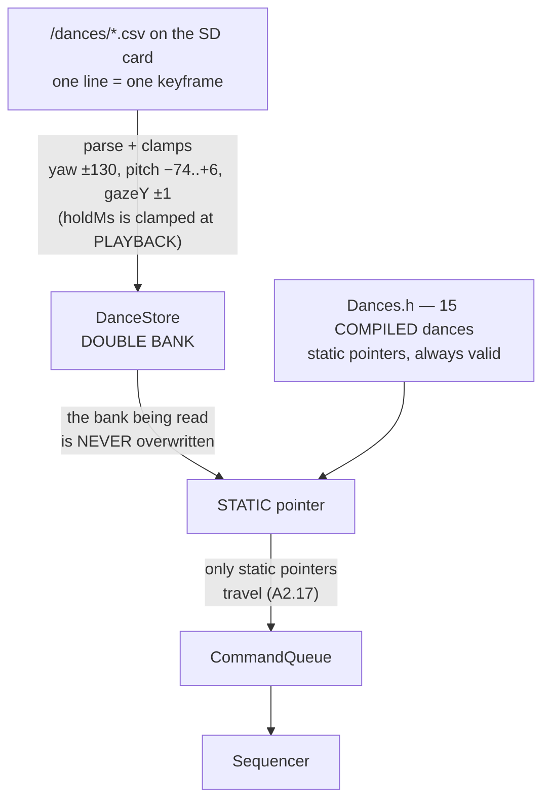

> **English** · [Français](CHOREGRAPHIES.fr.md)

# CHOREGRAPHIES.md — the dance system

How a dance is described, played and arbitrated, and how to write a new one.
Code: `src/behavior/Sequencer.h` (engine), `src/behavior/Dances.h` (data),
wiring in `src/behavior/Brain.h`.

> **Writing one by hand is not the intended path.**
> [`tools/choregraphies/`](../../tools/choregraphies/) is a visual editor that
> **simulates** the dance as it is composed — the eyes drawn with the
> firmware's own geometry and the real presets, a cube for head orientation —
> **plays** it at the true durations, and writes the CSV of §6. It opens with
> a double-click: no installation, no build step, no server. It can also
> **capture a pose from the robot**: the servos are released, you pose the
> head by hand, and the angles are read back from `GET /api/servo/pos`. That
> one feature is the only thing in it that touches the network, and it needs
> the `cors` tuning key on — see [`tools/README.md`](../../tools/README.md),
> which documents the capture protocol and how the servos are handed back on
> both ways out.

## 1. Model: a dance = a timeline of keyframes

A choreography is an array of `DanceKey` played sequentially by the
`Sequencer`. Each keyframe describes a complete state to reach.

The **temporal flow** of a dance (keyframe-by-keyframe playback, gaze leading
the head, clean exit) is drawn once and for all in
[`architecture/WORKFLOWS.md §5`](../architecture/WORKFLOWS.md) — no need to
redraw it here. What follows describes where the data **comes from**, which is
the other half of the subject:



The double bank is not a luxury: the `CommandQueue` only carries
**pointers**, never the data. On a single bank, reloading a CSV while a dance
is playing leaves the `Sequencer` reading an array being rewritten underneath
it (rule A2.17, last bullet).

```cpp
struct DanceKey {
    float    yawOff;     // ° from YAW_CENTER (+ = VIEWER's right)
    float    pitchOff;   // ° from PITCH_NEUTRAL (− = head raised;
                         //   never usefully > 0: the servo does not go
                         //   below the horizon — dives go through gazeYBias)
    uint16_t servoMs;    // duration of the servo trajectory to the target
    uint16_t holdMs;     // TOTAL duration of the keyframe (clamped ≥ servoMs)
    eEmotions emotion;   // expression set on entry (EMOTIONS_COUNT = unchanged)
    uint8_t  lidEvent;   // 0=nothing 1=blink 2=wink left 3=wink right
    float    gazeYBias;  // vertical gaze bias [−1..1] (NOD/SHY dive
                         //   with the EYES while the servo stays at the horizon)
};
```

Example (`PEEK`, the furtive Cozmo glance):

```cpp
inline const DanceKey PEEK[] = {
    {  0, 0, 200, 250, Suspicious },           // the expression settles in
    { 30, 0, 700, 1600, EMOTIONS_COUNT },      // SLOW slide + freeze (hold)
    { 30, 0, 100, 700, EMOTIONS_COUNT },       // micro-hold (the suspense)
    {  0, 0, 150, 250, Normal, 1 },            // SNAPPY recentering + blink
};
```

## 2. The engine (`Sequencer`) — guaranteed invariants

- **`holdMs ≥ servoMs`, always**: clamped on the fly, at PLAYBACK and not at
  load — which is what lets keyframe tables stay `const` and live in flash. A
  keyframe can never expire before its servo travel ends; a 1000 ms move inside
  100 ms keyframes is impossible by construction. The clamp counts itself
  (`clampCount()`), and nothing but `test_sequencer` reads that counter:
  surfacing it in telemetry was intended and never done.
- **`update()` returns each keyframe ONCE** (at the moment it is applied),
  `nullptr` otherwise — the Brain does the wiring, the Sequencer stays PURE
  (injected Clock, tested natively — `test_sequencer`).
- **`abort()` cuts the timeline immediately** (reflex contract).

## 3. The wiring (`Brain`) — what a keyframe triggers

For each keyframe returned by `update()`:

1. `emotion` (if ≠ EMOTIONS_COUNT) → `applyEmotion` with the emotion's default
   transition (STRONG/CALM/SOFT — `EmotionRoulette::transitionFor`).
2. `lidEvent` → `BlinkController` (blink/wink).
3. **"Eyes lead, head follows"**: the gaze SACCADES (~80 ms, `Vec2Blender`)
   toward the keyframe's TARGET (`gazeFromHead(servo target)` + `gazeYBias`)
   while the head gets there in `servoMs` (300-700 ms). The eyes lead, the head
   follows — the Cozmo principle.
4. Servo: `moveTo(target, servoMs)` — 50 Hz ease-in-out trajectory, clamped to
   the K151 limits (yaw 166±130°, pitch **19..99** = official M5Stack spec
   5~85° — home 93°: `pitchOff` ranges from **−74** (max raised) to **+6**
   (head lowered). The physical end stops 14/104 are OUT of spec: holding them
   stalls the servo and damages it (`Units.h`, A2.14).

**Random mirroring**: dances flagged `mirrorable` in the table draw their
direction on a coin flip at launch (`yawOff` × ±1) — the gaze follows
automatically (it aims at the mirrored target). Unpredictability without
duplicating the data.

**Global arbitration during a dance**:
- the emotion roulette is locked (the tick is still consumed — stable cadence);
- the VOR stays active (v3.1: the servo efference is subtracted, so it only
  reacts to EXTERNAL rotations); shake detection is inhibited;
- head-follow and the `/api/servo` remote are ignored (the timeline owns the head);
- **reflex preemption**: shake → Scared / lift → Curious cut the dance
  IMMEDIATELY (`abort()` + 600 ms return to neutral + gaze crossfade);
- **manual interactions take priority** (A2.5): screen swipe, head stroke
  (Si12T) and a console/API emotion post `AbortDance` before `SetEmotion` — the
  dance is cut, otherwise its keyframes would re-apply their own emotion and
  mask the requested reaction.

## 4. Writing rules (artistic direction §3.7)

1. **Last keyframe = `Normal` + neutral pose (0,0)** — otherwise the roulette
   stays stuck on the leftover emotion (guaranteed by
   `test_dances_data_integrity`).
2. **Anticipation**: a micro counter-movement (~4°, 80 ms) before a large
   displacement (see HAPPY, LOOK_AROUND, SHAKE_NO).
3. **Slow-in/slow-out**: soft entries and exits (400-500 ms), snappy movements
   in between — the contrast is what makes it alive.
4. **Metronomic timing is a CHOICE**: a regular cadence reads as deliberately
   mechanical (ROBOT, WIGGLE); reserve it for the dances that own it.
5. **Combined dive**: from the 93° home, a positive `pitchOff`
   (≤ +6 = `PITCH_MAX` 99, the lowest SAFE value) REALLY lowers the head, and
   `gazeYBias < 0` dives the eyes — NOD and SHY use both (head at the limit +
   gaze on the floor). The eyes remain the expressive engine; the head gives
   the weight.
6. Angles as OFFSETS from `Units.h` — never absolute degrees in the keyframes
   (recalibration stays centralized).

## 5. The 15 built-in dances

| Name | Signature | Mirror | Triggers |
|---|---|---|---|
| `happy` | left/right oscillations + wink, anticipation | ✔ | swipe-up roulette, API |
| `robot` | mechanical ±40°, metronomic | ✔ | same |
| `panic` | brisk agitation ±25°, 120-140 ms keyframes | ✔ | same |
| `nod` | "yes" — rises (-18) then GOES DOWN to the safe minimum (+6), gaze as accent | ✘ | same |
| `lookAround` | combined yaw+pitch arcs + anticipation | ✔ | same |
| `shakeNo` | cadenced "no" + anticipation | ✔ | same |
| `greet` | greeting: rise, left wink AT THE TOP (head frozen ~1.7 s), descent | ✘ | same |
| `laugh` | 6 snappy "ha!" (cadence validated) | ✘ | same |
| `thinking` | upper-lateral gaze held 1.8 s | ✔ | same |
| `shy` | look away + lowered head (limit) + eyes on the floor + shy blink | ✔ | same |
| `cry` | full grief: the head drops to the limit, sniffles TWICE (snappy pitch hiccups), then stays ~3 s down, dejected — Sad throughout | ✔ | same |
| `shocked` | Surprised snaps in + snappy recoil + held blinks (~3 s) | ✘ | same |
| `wiggle` | cadenced yaw wiggle ±8° + wink (Cozmo) | ✔ | same |
| `peek` | slow slide + suspicious freeze + snappy recentering | ✔ | same |
| `furious` | pressure cooker: growing spasms + head rising + LED crescendo (Annoyed→Furious steps), suspension, EXPLOSION, collapse | ✔ | same |

API: `GET /api/dances` (list) · `POST /api/dance?name=X` · `?name=stop` ·
swipe UP = random draw. Adding a built-in dance = one `DanceKey[]` array plus
one line in `dances::table()` (the integrity test checks the last keyframe and
the servo limits).

## 6. Custom choreographies (SD)

> **Visual editor**: [`tools/choregraphies/`](../../tools/choregraphies/)
> composes a dance by hand, **simulates** it (eyes drawn with the firmware's
> geometry and the real presets, a cube for head orientation), **plays** it at
> the real durations, and produces the CSV below. It opens with a
> double-click, no installation and no network. It can also **capture a pose
> from the robot** — servos released, head posed by hand, angles read back from
> `GET /api/servo/pos` — which needs the `cors` tuning key on (`tools/README.md`).


**One CSV file per dance** in `/dances/` on the SD card — editable in a
spreadsheet or a text editor, maps 1:1 onto `DanceKey`. Code:
`app/DanceStore.h`.

```
# /dances/salut.csv — one line = one keyframe
# yaw,pitch,servoMs,holdMs,emotion,lid,gazeY
0,0,200,250,Happy,0,0
20,-10,400,800,,winkG,0    # empty emotion = unchanged
0,0,450,600,Normal,blink,0
```

### Column reference (in CSV order)

| # | Column | Type / bounds | Default if empty | Description |
|---|---|---|---|---|
| 1 | `yaw` | number, **−130 … +130** (°, clamped to `YAW_RANGE`) | 0 | Head rotation from center. **+ = to the VIEWER's right**, − = to the left. The gaze aims at this target ahead of the head (~80 ms). |
| 2 | `pitch` | number, **−74 … +6** (°, clamped) | 0 | Tilt from the 93° home. **− = head RAISED** (−74 = straight up), **+ = head LOWERED** (+6 = the lowest SAFE value, `PITCH_MAX` 99). The downward margin is small: to really "look down", combine it with a negative `gazeY`. |
| 3 | `servoMs` | integer ≥ 0 (ms) | 0 | Duration of the servo TRAVEL to the target. Short (80-150) = snappy/brisk; long (400-700) = smooth. |
| 4 | `holdMs` | integer (ms) | 0 | TOTAL duration of the keyframe (travel + hold). **Automatically clamped ≥ servoMs.** The hold (holdMs − servoMs) is what makes the expressive "holds". |
| 5 | `emotion` | name ([`EMOTIONS.md`](EMOTIONS.md)) or **empty** | empty = unchanged | Expression set at the keyframe's ENTRY, with its default transition (the intense ones snap, the gentle ones glide). |
| 6 | `lid` | `0` \| `blink` \| `winkG` \| `winkD` (or 1/2/3) | 0 | Eyelid event fired at the keyframe's entry. |
| 7 | `gazeY` | number, −1 … +1 (clamped), **effective past ±0.20** | 0 | VERTICAL gaze bias, added on top of the head accompaniment: **negative = eyes toward the floor** (this is how NOD/SHY dive), positive = eyes to the sky. The parser accepts the full range, but the renderer saturates the vertical gaze at `GAZE_MAX_Y = 0.20` (`engine/Units.h`), so −1 and −0.2 draw the same frame. The editor warns past 0.20 for exactly that reason. |

**Accepted emotions** (column 5, case-insensitive): the **30** names from
`engine/Emotions.h`, in enum order —
`Normal` `Angry` `Glee` `Happy` `Sad` `Worried` `Focused` `Annoyed`
`Surprised` `Skeptic` `Frustrated` `Unimpressed` `Sleepy` `Suspicious`
`Nervous` `Furious` `Scared` `Awe` `Excited` `Questioning` `Frozen` `Scary`
`Curious` `Doubt` `Contempt` `Disgust` `Smug` `Dead` `Blush` `Squint`.
An unknown name = "unchanged". Some of them trigger their overlays
(**Blush/Glee/Smug** = flushed cheeks, **Excited/Awe** = ✦ sparkles,
**Scared/Worried/Frustrated** = sweat drop), and two have a SPECIAL rendering
that REPLACES the preset's shape (A2.17): **Excited** draws a lone ✦ star,
never on top of a background; **Dead** closes the eye during the transition
then sets a ✕ cross. Those two follow the gaze like the rest of the face.

**Rhythm landmarks** (artistic direction §4): snappy move 80-150 ms · normal
gesture 250-400 ms · slow slide 500-700 ms · expressive hold ≥ 600 ms of hold ·
soft exit 400-500 ms.

- Dance name = file name (`salut`). `#` = comment, cut at the FIRST one anywhere in the line (so a trailing comment works, as in the example above), empty lines ignored.
  Missing fields → the table's defaults.
- **Validation on load**: servo clamps (yaw ±130°, pitch −74..+6°),
  gazeY ∈ [−1..1]; the exit keyframe **Normal + neutral is ADDED if missing**
  (rule §4.1); empty/malformed file ignored with a log line.
- **Concurrency**: static DOUBLE-BANK store — AsyncTCP lookups and a dance in
  flight both survive a reload (the old bank stays valid). Limits: 8 dances ×
  **23 written keyframes** (`MAX_KEYS` is 24, the last slot being reserved for
  the exit keyframe added automatically).
- **API**:
  - `GET  /api/dances`        — merged list (built-in + SD)
  - `GET  /api/dances/files`  — loaded SD choreographies `[{name,keys}]`
  - `POST /api/dance?name=X`  — play (SD: random mirroring too)
  - `POST /api/dances/file`   — multipart CSV upload (**same name = edit**)
  - `DELETE /api/dances/file?name=X` — delete
  - `POST /api/dances/reload` — re-read `/dances/` (deferred to loop, A2.6)
- **Console**: the *Files* tab, where every SD file is gathered (▶ play / ✕
  delete / ↻ reload, and *Import → choreography (.csv)*); the *Dances* section
  of the *Pilot* tab plays them.
- Shipped example: `sdcard/dances/exemple.csv`.
