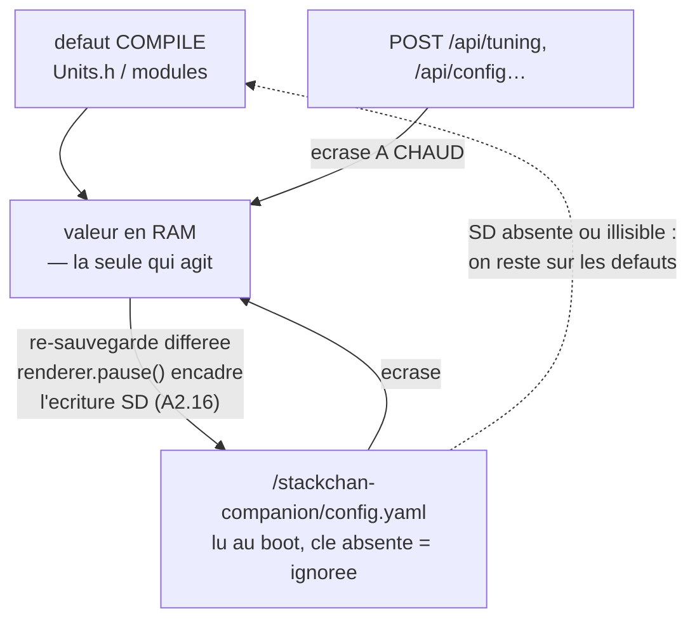

> [English](CONFIG.md) · **Français** — l'anglais est la version de référence.
> Ce fichier peut être en retard d'une mise à jour : en cas de divergence, l'anglais fait foi.

# CONFIG — schéma `/stackchan-companion/config.yaml` (SD)

> Le schéma est **figé** : ni le parseur ni une carte SD déjà en service ne
> doivent casser entre deux versions.
> Parseur : YAML minimal « clé: valeur + sections » (pas de listes
> imbriquées — toute structure plus riche passe par l'API, pas par le YAML).

Principes :
- **Tout est optionnel** — l'absence de SD ou d'une clé = valeur par défaut
  compilée (les défauts vivent dans `Units.h` / les modules, pas dans le parseur).
- `POST /api/config` et `POST /api/tuning` écrivent les mêmes clés et
  re-sauvegardent le fichier : **le YAML est la persistance de l'API**, pas une
  source concurrente.

Ce dernier point est la clé de lecture du fichier. Il n'y a **pas deux
autorités** qui se disputeraient une valeur : le défaut compilé sert de
socle, le YAML l'écrase au boot, l'API l'écrase à chaud — et se
re-persiste dans le même YAML. La valeur vivante est toujours en RAM.



Différer les écritures SD vers `loop()` et les encadrer de
`renderer.pause()` / `resume()` : le bus SPI2 est partagé avec le LCD, donc une
écriture émise depuis un callback réseau gèle l'affichage le temps des retries
de la carte (cf.
[`architecture/WORKFLOWS.md §8`](../architecture/WORKFLOWS.fr.md)).

```yaml
# =============================================================================
# /stackchan-companion/config.yaml — StackChan-Companion
# Tout est optionnel. Les commentaires documentent défaut + plage.
# =============================================================================

# =============================================================================
# CE QUI EST REELLEMENT LU, et ce n'est pas tout ce qui suit.
# `SdConfig::load` ne dispatche QUE quatre choses : le `lang` de premier
# niveau, et les sections `wifi:`, `api:` et `tuning:`. Tous les autres blocs
# de ce fichier — `display:`, `sound:`, `leds:`, `servo:`, `behavior:`,
# `launcher:`, `debug:` — sont une SPEC, pas un cablage : editer ces clefs ne
# change rien, en silence.
# Ils sont conserves parce qu'ils decrivent une intention, et signales parce
# qu'un fichier de configuration qui ignore la moitie de ce qu'il documente
# vaut moins qu'un fichier qui en documente moins. L'orthographe VIVANTE des
# memes reglages est sous `tuning:` plus bas (sound_volume_night,
# leds_brightness, servos, ...) — c'est celle-la qu'il faut editer.
#
# Le meme silence vaut A L'INTERIEUR d'une section analysee : `wifi:` lit
# exactement les cinq clefs ci-dessous et rien d'autre. Une clef inconnue y est
# jetee comme un bloc inconnu, et `SdConfig::save()` ne la reecrit pas — elle
# disparait donc aussi de la carte au premier enregistrement venu.
# =============================================================================

# Langue de TOUTE l'interface : console, API, bins invités, launcher.
lang: en                     # "en" | "fr". ABSENTE = ANGLAIS

wifi:
  client_ssid: ""            # vide = AP direct
  client_password: ""        # TOUT caractère imprimable est admis, ce que
                             # permet WPA-PSK (8-63 ASCII imprimables). Entre
                             # guillemets doubles, `"` et `\` s'écrivent
                             # ÉCHAPPÉS — `pass: "a\"b\\c"` vaut `a"b\c`. Les
                             # guillemets simples ne prennent pas
                             # d'échappement : `'a\b'` vaut littéralement
                             # `a\b`. Le reste (`#`, `:`, espaces, accents) ne
                             # demande rien de plus que les guillemets.
  ap_ssid: "StackChan-AP"
  ap_password: "goodlife"
  hostname: "stackchan"      # mDNS → http://stackchan.local/

# ⚠ Un mot de passe vide laisse TOUT ouvert sur le LAN — la carte SD en lecture
# ET en écriture, le flash, la caméra. Ce que cela expose réellement, et ce que
# ça vaut sur votre réseau, est dans [`SECURITY.fr.md`](SECURITY.fr.md).
api:
  username: "admin"          # nom d'utilisateur Basic Auth
  password: ""               # vide (défaut) = API + console OUVERTES,
                             # aucune authentification. Non vide = protège
                             # TOUT (console `/`, `/swagger`, `/api/*`) via
                             # HTTP Basic Auth — compatible Home Assistant
                             # (rest_command/rest avec username/password).
                             # Modifiable à chaud via POST /api/security
                             # (console : section « Sécurité API ») — cet
                             # endpoint est LUI-MÊME derrière le même
                             # Basic Auth dès qu'un mot de passe est actif
                             # (pas de bypass) ; persisté sur la SD. Les
                             # credentials sont sérialisés ENTRE GUILLEMETS
                             # (round-trip sûr : vide, espaces, '#') ; les
                             # entrées API sont nettoyées de " et \.

# NON LU par SdConfig::load - voir la note ci-dessus.
display:
  brightness: 76             # 0-255
  status_bar: false          # icône batterie
  crt: false                 # effet CRT global on/off (§3.8)
  crt_scanlines: true        # composantes individuelles (actives si crt: true)
  crt_glow: true
  crt_flicker: true
  crt_phosphor: true         # ignorée si le budget perf l'exclut

# NON LU par SdConfig::load - voir la note ci-dessus.
sound:                       # §3.9 — off par défaut
  enabled: false
  volume: 96                 # 0-255
  volume_night: 32           # volume du coucher au lever reels du soleil
                             # (NTP + reglages lat/lon, voir plus bas)
  use_sd_samples: false      # true → /sounds/*.wav remplacent les chirps

# NON LU par SdConfig::load - voir la note ci-dessus.
leds:                        # §3.9 — off par défaut
  enabled: false
  brightness: 38             # 0-255 (~15 %)

# NON LU par SdConfig::load - voir la note ci-dessus.
servo:
  start_x: 166               # position initiale yaw  (constantes K151 par défaut)
  start_y: 93                # position initiale pitch (home 93° —
                             # marge de 10° pour baisser la tête)
  idle_release_ms: 0         # 0 = jamais de relâche auto du couple

# NON LU par SdConfig::load - voir la note ci-dessus.
behavior:
  roulette_min_ms: 6000      # intervalle roulette émotions
  roulette_max_ms: 12000
  api_override_ms: 10000     # durée d'une émotion posée par l'API

# NON LU par SdConfig::load - voir la note ci-dessus.
launcher:
  enabled: true              # swipe-down actif
  timeout_s: 30              # sortie auto de l'UI

# NON LU par SdConfig::load - voir la note ci-dessus.
debug:
  serial: true               # logs série
  imu: false                 # télémétrie IMU 5 Hz
  telemetry: false           # flux série format serial-plotter

# --- Tuning (exposé via GET/POST /api/tuning, persisté ici) ------------------
# Chaque clé correspond 1:1 à une constante par défaut de module. Le YAML ne
# liste que les valeurs modifiées ; /api/tuning renvoie toujours l'ensemble.
tuning:
  # Source de vérité des clés : engine/Tuning.h (table()).
  eye_color_dim: 0.80        # assombrissement global palette
  eye_spacing: 14            # écart BORD-À-BORD des yeux en px
                             # (0 = contact, max 44)
  eye_depth_scale: 0         # effet profondeur near/far (0 = décalage pur —
                             # 1 = effet profondeur complet)
  blink_lag_ms: 30           # retard œil droit (0-150)
  crt_glow_px: 3             # dilatation halo (px)
  crt_glow_dim: 0.28         # intensité halo vs couleur yeux
  vor_gain: 0.90             # 0-1.2 : gain de contre-rotation VOR
  vor_drift_alpha: 0.02      # filtre complémentaire accel (au calme)
  vor_mag_alpha: 0.0         # correction de lacet magnétomètre PENDANT le
                             # mouvement — la dérive que le filtre accéléro ne
                             # voit pas (la gravité ne dit rien d'une rotation
                             # autour d'elle-même). LAISSER À 0 SUR UN K151 :
                             # le BMM150 interne voit surtout les aimants
                             # servo du corps (370 µT pour 80° de lacet, six
                             # fois la Terre, et non reproductible à pose
                             # identique), la correction y est donc
                             # inutilisable. La clé existe pour un montage
                             # avec magnétomètre EXTERNE loin des moteurs.
                             # Mesures : VALIDATION.md.
  saccade_ms: 80             # durée d'une saccade de rattrapage (60-120)
  saccade_recentre: 0.75     # |offset|/max déclenchant le rattrapage
  shake_gyro_thr: 35         # °/s soutenus → Scared
  gyro_yaw_axis: 1           # mapping gyro→écran, réglable à chaud
  gyro_yaw_sign: 1           # (validé HW : yaw=Y+, pitch=X+ —
  gyro_pitch_axis: 0         #  CONVENTIONS.md §3)
  gyro_pitch_sign: 1
  pickup_dev_g: 0.08         # sensibilité soulèvement (écart à 1 g)
  pickup_hold_ms: 120        # durée d'écart soutenu avant « soulevé »
  personality: 0             # QUEL CARACTERE est charge (behavior/
                             # Personalities.h) : 0 = le robot historique,
                             # 1 = Haro. Un INDEX et non un booleen :
                             # l'existant est une personnalite a part entiere,
                             # et un booleen serait a renommer le jour ou une
                             # troisieme apparait. Une personnalite possede son
                             # FICHIER DE REGLES, sa roulette (poids + cadence)
                             # et sa couleur d'identite - et RIEN d'autre :
                             # changer de personnalite ne reecrit jamais vos
                             # autres reglages. Index inconnu -> 0, re-persiste.
  roulette: 1                # 1 = humeurs aleatoires. Le robot tire une
                             # emotion toutes les quelques secondes : c'est ce
                             # qui le fait paraitre vivant quand rien ne se
                             # passe, et ce qui empeche toute expression de
                             # SIGNIFIER quelque chose, puisque le tirage
                             # suivant ecrase ce qu'une regle vient de dire.
                             # 0 = seules les regles et les reflexes parlent.
                             # PAS un gel : les emotions minutees reviennent au
                             # repos, et clignements, saccades et respiration
                             # sont pilotes ailleurs et continuent.
  fixation_min_ms: 800       # bornes des fixations idle
  fixation_max_ms: 4000
  blink_median_ms: 3500      # médiane log-uniforme autoblink
  head_follow: 1             # 1 = tête suit les fixations (ACTIF par défaut :
                             # « les yeux mènent, la tête suit » est le cœur
                             # de l'identité d'animation du projet)
  headfollow_hold_ms: 1000   # fixation excentrée tenue avant que la tête suive
  servo_idle_release_ms: 4000  # couple relâché après X ms sans mouvement
                                # (0 = jamais) — épargne la batterie et les
                                # engrenages quand la tête ne bouge pas
  servos: 1                  # 0 = servos désactivés : couple RELÂCHÉ (tête molle,
                             # manipulable) + aucun mouvement de tête ; reprise
                             # douce. Les yeux continuent. Persiste (reboot).
  leds: 0                    # 1 = emphase LED émotionnelle
  leds_brightness: 38        # 0-255
  sound: 0                   # 1 = chirps
  sound_volume: 96           # 0-255
  sound_volume_night: 32     # 0-255 : volume du COUCHER au LEVER reels du
                             # soleil (SoundFx.h + firmware/common/SunClock.h).
                             # Necessite NTP : sans horloge synchronisee, ce
                             # n'est PAS la nuit, donc le volume fort -- le
                             # defaut sur.
  lat: -20.89                # latitude du robot  (+ = nord) -- position
  lon: 55.53                 # longitude du robot (+ = est)     solaire
  mic_enable: 0              # 1 = le MICRO capte. Seul, le robot écoute et
                             # reste immobile — c'est ce qu'il faut au
                             # visualiseur son du bandeau. Retardé de 20 s
                             # d'uptime (garde anti-brick, A2.20).
  sound_track: 0             # 1 = suivi du son (tête vers le bruit, 2 micros ;
                             # sourdine pendant le mouvement servo +350 ms).
                             # IMPLIQUE `mic_enable` : un suivi sans micro est
                             # un interrupteur qui ne fait rien, donc une carte
                             # écrite avant l'existence de `mic_enable` se
                             # comporte exactement comme avant.
  soundtrack_thr: 100        # sensibilité : seuil RMS (10-8000, bas = sensible)
  soundtrack_sign: -1        # sens gauche/droite du virage. -1 est la valeur
                             # VÉRIFIÉE SUR MATÉRIEL. Ne PAS la « corriger »
                             # en +1 par le raisonnement seul : l'inversion a
                             # déjà été faite deux fois, et le robot tourne
                             # alors À L'OPPOSÉ du bruit.
  soundtrack_step_deg: 30    # distance : rotation max par pas (°, 4-40 —
                             # pas réel ∝ racine du déséquilibre G/D)
  soundtrack_move_ms: 400    # vitesse de base (ms/pas, modulée ×1.4→×0.4
                             # par l'intensité du son)
  soundtrack_shock_thr: 4000 # sursaut : RMS déclenchant la danse shocked
                             # puis le virage (0 = désactivé)
  head_home_ms: 8000         # retour au home : pause (ms) sans activité de
                             # tête ni son avant retour systématique
                             # (toutes danses/options ; 0 = jamais)
  camera: 0                  # 1 = endpoints caméra GC0308 (/api/camera/*)
                             # pour Home Assistant / Frigate. Init À LA
                             # DEMANDE, éteinte au repos (économe). Voir
                             # docs/integrations/HOMEASSISTANT.md §Caméra
  cam_fps: 10                # plafond images/s (capture + flux, 1-15)
  cam_quality: 12            # qualité JPEG de l'instantané ?full=1 (1-63, bas = mieux)
  cam_stream_quality: 45     # qualité JPEG du flux/vue live (1-63, haut = plus
                             # compressé/léger = commandes plus réactives)
  cam_stream_qvga: 1         # 1 = flux/vue sous-échantillonnés 320x240 (~4x
                             # moins d'octets radio + 4x moins de CPU jpge) ;
                             # 0 = VGA (Frigate). L'instantané ?full=1 reste VGA.
  cam_brightness: 1          # exposition/cible AEC (-2..+2 ; +1 = équilibre)
  cam_contrast: 0            # contraste (-2..+2 ; 0 = calibration)
  cam_saturation: 1          # saturation (-2..+2)
  cam_lowlight: 0            # 1 = basse lumière : gain/expo AEC déplafonnés
  cam_colorbar: 0            # 1 = la MIRE du capteur au lieu de la scène :
                             # prouve la liaison SCCB et le chemin DMA quand
                             # une image noire peut être l'un ou l'autre
  cam_vflip: 0               # miroir vertical (0/1)
  cam_hmirror: 0             # miroir horizontal (0/1)
  screen_bright: 76          # luminosité de l'ÉCRAN, 10..255 — la dalle
                             # entière. Distinct d'`eye_color_dim`, qui
                             # n'assombrit que la palette des yeux et laisse
                             # la bande de statut, le launcher et les bins
                             # invités à pleine puissance. Ignoré tant
                             # qu'`auto_brightness` est actif ; le régler
                             # depuis la console désactive celui-ci, sans quoi
                             # le capteur écraserait la valeur manuelle en
                             # deux secondes. Le plancher de 10 existe pour
                             # que le réglage ne puisse pas se cacher lui-même.
  led_swap: 0                # 1 = inverser l'ordre de l'anneau de LEDs (le
                             # ruban est câblé à l'envers sur certains kits)
  led_depth: 0               # 0-200 %, 0 = ARRÊT. Les douze LEDs sont deux
                             # barres de six montées PERPENDICULAIREMENT à
                             # l'écran : une barre porte donc une profondeur
                             # autant qu'une luminosité. Ceci est le gain sur
                             # cette seconde dimension : un lacet commandé
                             # ÉTEINT l'extrémité lointaine de chaque barre au
                             # lieu d'éclaircir la proche, si bien que la barre
                             # ne fait que perdre de la lumière et que le
                             # plafond de 255 garde son sens. 100 % dépense
                             # tout l'effet à 120 °/s. À 0 la charge utile est
                             # identique octet pour octet à celle que les
                             # barres reçoivent depuis toujours. Piloté par la
                             # vitesse servo COMMANDÉE, jamais par le gyro :
                             # le gyro se déclenche aussi quand une main tourne
                             # le robot, et les barres annonceraient alors une
                             # rotation que le robot n'a pas faite.
  led_depth_front: 1         # quelle extrémité d'une barre est l'AVANT —
                             # l'indice 0 (1) ou l'indice 5 (0). NON MESURÉ :
                             # personne n'a lu le câblage, donc cette clé
                             # existe pour la même raison que `led_swap`. Sans
                             # elle, de la lumière massée du mauvais côté est
                             # indiscernable d'une arithmétique fausse.
  auto_brightness: 0         # 1 = luminosité écran auto (capteur LTR-553)
                             # — prioritaire sur `screen_bright`, mais
                             # SEULEMENT sur une carte qui a le capteur :
                             # sans lui, on retombe sur `screen_bright`
                             # plutôt que de laisser la dalle sans pilote
  dark_sleepy: 1             # 1 = mode NUIT : noir complet soutenu (LTR-553
                             # ≤1 % ~6 s) → la roulette remplace Normal par
                             # Sleepy (poids dominant ~66 %) — somnole, mais
                             # réflexes/danses/API restent prioritaires.
                             # Lumière revenue (>10 %) → mode jour + réveil.
  band_mode: 0               # mode de la zone dynamique (0=aucune, 2=son,
                             # 3=jauges, 4=minuteur, 5=pomodoro) — PERSISTÉ,
                             # survit au reboot. Écrit par
                             # POST /api/statusbar?mode=. Modes 4/5 :
                             # STATUSBAR.md §2b (gestes de bande + émotions).
  icon_mask: 31              # icônes visibles de la bande (bits : batterie=1,
                             # wifi=2, caméra=4, micro=8, nuit=16 ; 31 = toutes).
                             # Console : pastilles sur la bande de télémétrie.
  band_debug: 1              # 1 = infos émotion·ip centrées dans la rangée
                             # d'icônes (option indépendante du mode de bande).
  band_text_size: 1          # taille du texte say/alerte de la bande (1..3)
  band_scroll_speed: 70      # vitesse de défilement du texte long (px/s) —
                             # marquee auto quand le texte dépasse la largeur.
  pomo_work_min: 25          # pomodoro (mode 5) : bloc de travail (min, 1-120)
  pomo_break_min: 5          # pomodoro : bloc de pause (min, 1-60)
  pomo_cycles: 4             # pomodoro : blocs de travail avant la fin (1-8)
  pomo_hydra_min: 1          # pomodoro : INVITE A BOIRE glissee entre un bloc
                             # de travail et sa pause (min, 0 = arret, max 15).
                             # Un prefixe de la pause, jamais une tranche prise
                             # dessus : la pause qui suit est la pause reglee
                             # entiere, sinon activer le rappel ferait payer le
                             # fait de boire. Le dernier bloc n'en a pas - la
                             # session est finie. LA SEULE des quatre a
                             # accepter 0 : travail et pause sont ce qu'un
                             # pomodoro EST, un zero y est une faute de frappe
                             # et se voit remonte ; l'hydratation est un ajout,
                             # donc 0 est une vraie reponse (« pas pour moi »)
                             # et restitue exactement l'ancienne machine.
  timer_dance: 0             # danse jouee quand un compte a rebours SE TERMINE
                             # : 0 = aucune, sinon l'indice 1-based dans
                             # GET /api/dances. Se declenche a la sonnerie du
                             # minuteur et au dernier bloc du pomodoro - jamais
                             # a un changement de phase, qui revient toutes les
                             # quelques minutes. La console remplit son
                             # selecteur depuis ce meme endpoint : la liste ne
                             # peut pas diverger de celle du robot.
  band_sound: 0              # HABILLAGE du son en mode 2 — trois habits de
                             # la meme forme d'onde declenchee : 0 ondes
                             # (courbes continues), 1 colonnes (traits fins),
                             # 2 matrice (blocs de pixels). Meme image, trois
                             # habits ; les deux micros nourrissent les trois. EXIGE LE MICRO : sans
                             # `mic_enable: 1` rien n'est capture et la bande
                             # le dit (« micro au repos ») au lieu de dessiner.
                             # `band_mouth` est accepte comme alias en
                             # ECRITURE (vieilles cartes) ; jamais reecrit.
  band_sound_gain: 1.0       # SENSIBILITE du visualiseur (0,1-16). Un gain
                             # sur les echantillons, applique AVANT l'analyse,
                             # donc la trace, l'enveloppe et les bandes
                             # bougent ensemble —
                             # un seul reglage pour les trois styles.
                             # 2 = +6 dB. Le plancher en decibels est fixe a
                             # -48 dB, pas une piece : montez-le dans un bureau
                             # calme, baissez-le si toutes les bandes saturent.
  band_clock: 0              # 1 = horloge murale (HH:MM) dans la bande quand
                             # le mode est 0 (Aucune) — vide tant que NTP n'a
                             # pas parlé.
  clock_24h: 1               # horloge du bandeau : 24 h (1) ou 12 h avec a/p (0)
  tz_offset_h: 0             # décalage local d'affichage vs UTC, HEURES DÉCIMALES —
                             # affichage seulement : la nuit du robot reste
                             # pilotée par le soleil (lat/lon), jamais par
                             # l'horloge.
  telemetry: 0               # 1 = flux série serial-plotter (calibration)
  debug: 0                   # 1 = trace série verbeuse de chaque étape —
                             # connexions réseau, lectures de config,
                             # tentatives HTTP (code + durée), écritures SD.
                             # À chaud (sans reboot) ; interrupteur console
                             # dans Système. Les bins invités portent le même
                             # interrupteur sur /config (NVS).
  cors: 0                    # 1 = l'API répond avec
                             # Access-Control-Allow-Origin: *, donc une page
                             # servie depuis AILLEURS peut la lire. Nécessaire
                             # à l'éditeur de chorégraphies, qui tourne depuis
                             # un fichier local. LU AU BOOT (la liste d'en-têtes
                             # est globale au serveur et en ajout seul), donc un
                             # changement demande un redémarrage. Éteint par
                             # défaut : tant que c'est actif, n'importe quelle
                             # page affichée par le navigateur peut parler au
                             # robot sur le réseau local — Basic Auth coupé,
                             # cela inclut le faire bouger.
  cfg_version: 5             # version du schéma (migration automatique :
                             # un yaml plus ancien voit ses clés recalibrées
                             # re-défaussées au chargement — ne pas éditer)
```

> ⚠ Un `config.yaml` existant FIGE les défauts de l'époque de sa dernière
> sauvegarde (le fichier est régénéré intégralement par `save()`). Après un
> changement de défaut compilé, pousser la nouvelle valeur une fois via
> `POST /api/tuning?cle=val` (elle sera re-persistée).

## `lang` — une seule langue pour tout le robot

`lang` est au **niveau racine**, pas dans une section : ce n'est une propriété
ni du wifi, ni de l'api, ni du tuning, et la ranger sous l'une d'elles la ferait
passer pour telle.

| Valeur | Effet |
|---|---|
| `en` | anglais (**le défaut**) |
| `fr` | français |
| absente, vide, non reconnue | **anglais** |

**Absente veut dire anglais, délibérément.** Une carte qui ne porte pas la clé
doit se comporter comme une version anglaise et non comme une version cassée —
le repli ne dépend donc jamais de la reconnaissance de la chaîne.

**Une seule clé pour tout.** La console embarquée, l'API REST, le launcher et
chaque `.bin` invité lisent *cette* clé. Les invités n'ont **pas** de `lang` à
eux : deux réglages de langue qui peuvent diverger n'en font pas un.

Le mécanisme est `firmware/common/I18n.h` — `sce::T("English", "Francais")`,
les deux formes écrites côte à côte au point d'appel plutôt que deux tables
derrière une clé. Une table de clés laisse une clé être ajoutée, renommée ou
orpheline d'un seul côté, sans rien pour dénoncer la dérive. Écrites côte à
côte, une langue manquante est une **erreur de compilation**, et une traduction
morte meurt avec la ligne qui l'utilisait.

⚠ **Les accents dépendent de la FONTE, pas de la langue.** `Font0`, la fonte
bitmap 6×8 employée pour l'essentiel du texte à l'écran, rend l'UTF-8 en `??` :
le français qui y est tracé s'écrit sans accents (`Reglages`). `efontJA_12` et
la console HTML sont Unicode et acceptent le français accentué.


## Arborescence SD complète

```
/companion.bin               binaire de restauration SD-Updater (standard)
/bins/*.bin                  binaires lançables (launcher + API [Bins])
/dances/*.csv                chorégraphies personnalisées (CHOREGRAPHIES.md §6)
/stackchan-companion/rules.txt    règles réactives SD (plugins — PLUGINS.md)
/stackchan-companion/*.yaml       configs des bins INVITÉS (ex. flightradar.yaml —
                             éditables via le gestionnaire SD de la console,
                             whitelist import/export ; détail
                             docs/guests/README.md)
/sounds/*.wav                samples optionnels (remplacent les chirps)
/stackchan-companion/
  config.yaml                ce fichier
```

> ⚠ Matériel : la SD est montée à **15 MHz** (bus SPI partagé avec le LCD) —
> à 25 MHz les écritures multi-blocs perdent des tokens et gèlent
> l'affichage pendant les retries (ROADMAP §A2.16).

## Mapping API ↔ YAML

| API | Section YAML | Application |
|---|---|---|
| `POST /api/config?crt=` | — (**non persisté**) | immédiate |
| `POST /api/config?lang=` | `lang`, au PREMIER niveau | immédiate (à chaud) + re-sauvegarde SD |
| `POST /api/tuning` | `tuning` | immédiate (à chaud) + re-sauvegarde SD |
| `POST /api/wifi` | `wifi.client_*` | au restart |
| `POST /api/servo` | — (télécommande, non persisté) | immédiate |
| `POST /api/security` | `api` | immédiate (à chaud) + re-sauvegarde SD |
| console `/` (portail captif en AP) | mêmes endpoints | idem |

`crt` est le seul réglage appliqué sans être réécrit : il part vers le Brain
sous forme de commande et `SdConfig::save()` n'émet aucun bloc `display:`, il
retrouve donc sa valeur compilée au démarrage suivant. `lang` siège au premier
niveau du fichier, hors de toute section — il gouverne aussi bien la console,
l'API, le launcher que les bins invités, et une section aurait laissé croire
que l'un d'eux en était propriétaire.
