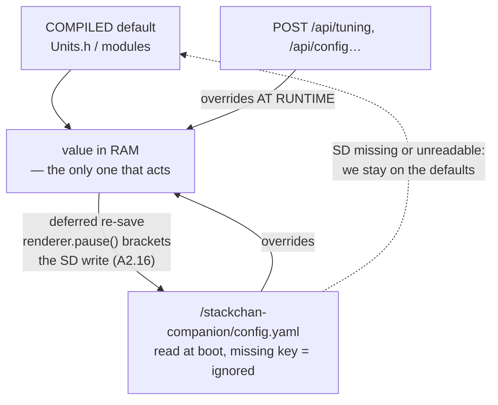

> **English** · [Français](CONFIG.fr.md)

# CONFIG — `/stackchan-companion/config.yaml` schema (SD)

> The schema is **frozen**: neither the parser nor an SD card already in the
> field may break between versions.
> Parser: minimal YAML, "key: value + sections" (no nested lists — anything
> richer goes through the API, not through the YAML).

Principles:
- **Everything is optional** — a missing SD card or a missing key means the
  compiled default applies (defaults live in `Units.h` / in the modules, never
  in the parser).
- `POST /api/config` and `POST /api/tuning` write the same keys and re-save the
  file: **the YAML is the API's persistence layer**, not a competing source.

That last point is how to read this file. There are **no two authorities**
fighting over a value: the compiled default is the floor, the YAML overrides it
at boot, the API overrides it at runtime — and re-persists into that same YAML.
The live value always lives in RAM.



Defer SD writes to `loop()` and bracket them with `renderer.pause()` /
`resume()`: SPI2 is shared with the LCD, so a write issued from a network
callback freezes the display for the duration of the card's retries (see
[`architecture/WORKFLOWS.md §8`](../architecture/WORKFLOWS.md)).

```yaml
# =============================================================================
# /stackchan-companion/config.yaml — StackChan-Companion
# Everything is optional. The comments document default + range.
# =============================================================================

# =============================================================================
# WHAT IS ACTUALLY READ, and it is not everything below.
# `SdConfig::load` dispatches exactly FOUR things: the top-level `lang`, and
# the sections `wifi:`, `api:` and `tuning:`. Every other block in this file —
# `display:`, `sound:`, `leds:`, `servo:`, `behavior:`, `launcher:`, `debug:` —
# is a SPEC, not a wire: editing those keys changes nothing, silently.
# They are kept because they describe intent, and marked because a
# configuration file that ignores half of what it documents is worse than one
# that documents less. The LIVE spelling of the same knobs is under `tuning:`
# further down (sound_volume_night, leds_brightness, servos, ...) — that is
# the one to edit.
#
# The same silence applies INSIDE a parsed section: `wifi:` reads exactly the
# five keys shown below and nothing else. An unknown key there is dropped like
# an unknown block, and `SdConfig::save()` does not write it back — so it also
# disappears from the card the first time anything is saved.
# =============================================================================

# UI language for EVERYTHING: embedded console, API, guest bins, launcher.
lang: en                     # "en" | "fr". ABSENT = ENGLISH

wifi:
  client_ssid: ""            # empty = direct AP
  client_password: ""        # ANY printable character is allowed, which is
                             # what WPA-PSK permits (8-63 printable ASCII).
                             # Inside double quotes, `"` and `\` are written
                             # ESCAPED — `pass: "a\"b\\c"` is `a"b\c`. Single
                             # quotes take no escapes, so `'a\b'` is literally
                             # `a\b`. Everything else (`#`, `:`, spaces,
                             # accents) needs nothing beyond the quotes.
  ap_ssid: "StackChan-AP"
  ap_password: "goodlife"
  hostname: "stackchan"      # mDNS → http://stackchan.local/

# ⚠ An empty password leaves EVERYTHING open on the LAN — the SD card in read
# AND write, the flash, the camera. What that actually exposes, and what it is
# worth on your network, is [`SECURITY.md`](SECURITY.md).
api:
  username: "admin"          # Basic Auth user name
  password: ""               # empty (default) = API + console WIDE OPEN,
                             # no authentication at all. Non-empty = protects
                             # EVERYTHING (console `/`, `/swagger`, `/api/*`)
                             # via HTTP Basic Auth — works with Home Assistant
                             # (rest_command/rest with username/password).
                             # Changeable at runtime via POST /api/security
                             # (console: "API security" section) — that
                             # endpoint is ITSELF behind the same Basic Auth
                             # as soon as a password is active (no bypass);
                             # persisted on the SD card. Credentials are
                             # serialized IN QUOTES (safe round-trip: empty,
                             # spaces, '#'); API input is stripped of " and \.

# NOT READ by SdConfig::load — see the note above.
display:
  brightness: 76             # 0-255
  status_bar: false          # battery icon
  crt: false                 # global CRT effect on/off (§3.8)
  crt_scanlines: true        # individual components (active if crt: true)
  crt_glow: true
  crt_flicker: true
  crt_phosphor: true         # ignored if the perf budget rules it out

# NOT READ by SdConfig::load — see the note above.
sound:                       # §3.9 — off by default
  enabled: false
  volume: 96                 # 0-255
  volume_night: 32           # volume from real sunset to real sunrise
                             # (NTP + tuning lat/lon, see below)
  use_sd_samples: false      # true → /sounds/*.wav replace the chirps

# NOT READ by SdConfig::load — see the note above.
leds:                        # §3.9 — off by default
  enabled: false
  brightness: 38             # 0-255 (~15 %)

# NOT READ by SdConfig::load — see the note above.
servo:
  start_x: 166               # initial yaw position  (K151 constants by default)
  start_y: 93                # initial pitch position (home 93° —
                             # 10° of margin to lower the head)
  idle_release_ms: 0         # 0 = never auto-release the torque

# NOT READ by SdConfig::load — see the note above.
behavior:
  roulette_min_ms: 6000      # emotion roulette interval
  roulette_max_ms: 12000
  api_override_ms: 10000     # how long an emotion set by the API is held

# NOT READ by SdConfig::load — see the note above.
launcher:
  enabled: true              # swipe-down enabled
  timeout_s: 30              # automatic exit from the UI

# NOT READ by SdConfig::load — see the note above.
debug:
  serial: true               # serial logs
  imu: false                 # IMU telemetry at 5 Hz
  telemetry: false           # serial stream in serial-plotter format

# --- Tuning (exposed via GET/POST /api/tuning, persisted here) ----------------
# Every key maps 1:1 to a module's default constant. The YAML only lists the
# values that were changed; /api/tuning always returns the whole set.
#
# `Tuning::table()` holds 77 keys and it is the source of truth for all three
# faces of the same knob: this file, the API, and the console. 75 of them have
# a control on the embedded console; the two exceptions are deliberate —
# `band_mode`, driven by the band buttons through /api/statusbar, and
# `cfg_version`, an internal schema number that is not a user setting.
# `scripts/gates/check-console.py` holds that correspondence in both
# directions: a key with no control fails the gate, and so does a console
# slider naming a key that no longer exists.
tuning:
  # Source of truth for the keys: engine/Tuning.h (table()).
  eye_color_dim: 0.80        # global palette darkening
  eye_spacing: 14            # EDGE-TO-EDGE gap between the eyes in px
                             # (0 = touching, max 44)
  eye_depth_scale: 0         # near/far depth effect (0 = pure offset —
                             # 1 = full depth effect)
  blink_lag_ms: 30           # right-eye lag (0-150)
  crt_glow_px: 3             # halo dilation (px)
  crt_glow_dim: 0.28         # halo intensity vs eye color
  vor_gain: 0.90             # 0-1.2: VOR counter-rotation gain
  vor_drift_alpha: 0.02      # complementary accel filter (when still)
  vor_mag_alpha: 0.0         # magnetometer yaw correction DURING motion —
                             # the drift the accel filter cannot see (gravity
                             # says nothing about rotation around itself).
                             # LEAVE AT 0 ON A K151: the internal BMM150
                             # mostly sees the body's servo magnets (370 µT
                             # per 80° of head yaw, six times Earth, and not
                             # reproducible at an identical pose), so the
                             # correction is unusable there. The knob exists
                             # for a build with an EXTERNAL, motor-free
                             # magnetometer. Measurements: VALIDATION.md.
  saccade_ms: 80             # duration of a catch-up saccade (60-120)
  saccade_recentre: 0.75     # |offset|/max that triggers the catch-up
  shake_gyro_thr: 35         # sustained °/s → Scared
  gyro_yaw_axis: 1           # gyro→screen mapping, tunable at runtime
  gyro_yaw_sign: 1           # (validated on HW: yaw=Y+, pitch=X+ —
  gyro_pitch_axis: 0         #  CONVENTIONS.md §3)
  gyro_pitch_sign: 1
  pickup_dev_g: 0.08         # lift sensitivity (deviation from 1 g)
  pickup_hold_ms: 120        # how long the deviation must hold before "lifted"
  personality: 0             # WHICH CHARACTER is loaded (behavior/
                             # Personalities.h): 0 = the historical robot,
                             # 1 = Haro. An INDEX, not a boolean: the existing
                             # behaviour is a personality in its own right, and
                             # a boolean would need renaming the day a third
                             # appears. A personality owns its RULE FILE, its
                             # roulette (weights + cadence) and its identity
                             # colour — and NOTHING else: switching never
                             # rewrites your other settings. Unknown index →
                             # 0, re-persisted.
  roulette: 1                # 1 = random moods. The robot draws an emotion
                             # every few seconds, which is what makes it feel
                             # alive when nothing is happening — and what stops
                             # any expression from MEANING something, since the
                             # next draw overwrites whatever a rule just said.
                             # 0 = only rules and reflexes speak. NOT a freeze:
                             # timed emotions still expire back to rest, and
                             # blinking, glancing and breathing are driven
                             # elsewhere and keep running.
  fixation_min_ms: 800       # bounds of the idle fixations
  fixation_max_ms: 4000
  blink_median_ms: 3500      # log-uniform autoblink median
  head_follow: 1             # 1 = the head follows the fixations (ON by
                             # default: 'eyes lead, head follows' is the
                             # core of the project's animation identity)
  headfollow_hold_ms: 1000   # off-center fixation held before the head follows
  servo_idle_release_ms: 4000  # torque released after X ms without motion
                                # (0 = never) — spares the battery and the
                                # servo gears while the head is idle
  servos: 1                  # 0 = servos disabled: torque RELEASED (limp head,
                             # movable by hand) + no head motion at all; smooth
                             # resume. The eyes keep animating. Persists (reboot).
  leds: 0                    # 1 = emotional LED emphasis
  leds_brightness: 38        # 0-255
  sound: 0                   # 1 = chirps
  sound_volume: 96           # 0-255
  sound_volume_night: 32     # 0-255: volume from real SUNSET to real SUNRISE
                             # (SoundFx.h + firmware/common/SunClock.h).
                             # Needs NTP: no synced clock = NOT night, i.e.
                             # the loud setting, which is the safe default.
  lat: -20.89                # robot latitude  (+ = north) -- solar position
  lon: 55.53                 # robot longitude (+ = east)  for the above
  mic_enable: 0              # 1 = the MICROPHONE captures. On its own the
                             # robot listens and stays still — which is what
                             # the band's sound visualiser needs. Delayed by
                             # 20 s of uptime (anti-brick guard, A2.20).
  sound_track: 0             # 1 = sound tracking (head toward the noise, 2 mics;
                             # muted during servo motion +350 ms). IMPLIES
                             # `mic_enable`: tracking without a microphone is
                             # a switch that does nothing, so a card written
                             # before `mic_enable` existed still behaves
                             # exactly as it did.
  soundtrack_thr: 100        # sensitivity: RMS threshold (10-8000, low = sensitive)
  soundtrack_sign: -1        # left/right direction of the turn. -1 is the
                             # value VERIFIED ON HARDWARE. Do NOT 'correct'
                             # it back to +1 from the reasoning alone: that
                             # inversion has been made twice already, and
                             # the robot then turns AWAY from the noise.
  soundtrack_step_deg: 30    # distance: max rotation per step (°, 4-40 —
                             # actual step ∝ square root of the L/R imbalance)
  soundtrack_move_ms: 400    # base speed (ms/step, modulated ×1.4→×0.4
                             # by the loudness of the sound)
  soundtrack_shock_thr: 4000 # startle: RMS that triggers the shocked dance
                             # and then the turn (0 = disabled)
  head_home_ms: 8000         # return to home: idle time (ms) with no head
                             # activity and no sound before an unconditional
                             # return (all dances/options; 0 = never)
  camera: 0                  # 1 = GC0308 camera endpoints (/api/camera/*)
                             # for Home Assistant / Frigate. Initialized ON
                             # DEMAND, powered off when idle (frugal). See
                             # docs/integrations/HOMEASSISTANT.md §Camera
  cam_fps: 10                # frames/s ceiling (capture + stream, 1-15)
  cam_quality: 12            # JPEG quality of the ?full=1 still (1-63, low = better)
  cam_stream_quality: 45     # JPEG quality of the stream/live view (1-63, high =
                             # more compressed/lighter = snappier commands)
  cam_stream_qvga: 1         # 1 = stream/view downsampled to 320x240 (~4x
                             # fewer bytes on the air + 4x less jpge CPU);
                             # 0 = VGA (Frigate). The ?full=1 still stays VGA.
  cam_brightness: 1          # exposure/AEC target (-2..+2; +1 = balanced)
  cam_contrast: 0            # contrast (-2..+2; 0 = calibration)
  cam_saturation: 1          # saturation (-2..+2)
  cam_lowlight: 0            # 1 = low light: AEC gain/exposure ceilings raised
  cam_colorbar: 0            # 1 = the sensor's TEST PATTERN instead of the
                             # scene: proves the SCCB link and the DMA path
                             # when a black frame could be either
  cam_vflip: 0               # vertical mirror (0/1)
  cam_hmirror: 0             # horizontal mirror (0/1)
  screen_bright: 76          # SCREEN backlight, 10..255 — the whole panel.
                             # Distinct from `eye_color_dim`, which only
                             # darkens the eye palette and leaves the status
                             # band, the launcher and the guest bins at full
                             # brightness. Ignored while `auto_brightness` is
                             # on; setting it from the console turns that off,
                             # since the sensor would overwrite a manual value
                             # within two seconds. The floor of 10 exists so
                             # the control cannot hide itself.
  led_swap: 0                # 1 = reverse the LED ring order (the strip is
                             # wired the other way round on some units)
  led_depth: 0               # 0-200 %, 0 = OFF. The twelve LEDs are two bars
                             # of six running PERPENDICULAR to the display, so
                             # a bar carries a depth as well as a brightness.
                             # This is the gain on that second dimension: a
                             # commanded yaw DARKENS the far end of each bar
                             # rather than brightening the near one, so the
                             # bar only ever loses light and the 255 ceiling
                             # keeps meaning what it means. 100 % spends the
                             # whole effect at 120 °/s. At 0 the payload is
                             # byte-identical to the one the bars have always
                             # received. Driven by the COMMANDED servo rate,
                             # never the gyro: the gyro also fires when a hand
                             # turns the robot, and the bars would then report
                             # a turn the robot never made.
  led_depth_front: 1         # which end of a bar is the FRONT — index 0 (1)
                             # or index 5 (0). NOT MEASURED: nobody has read
                             # the wiring, so this exists for the same reason
                             # `led_swap` does. Without it, light massing at
                             # the wrong end is indistinguishable from
                             # arithmetic that is simply wrong.
  auto_brightness: 0         # 1 = automatic screen brightness (LTR-553 sensor)
                             # — takes precedence over `screen_bright`, but
                             # ONLY on a unit that actually has the sensor:
                             # without it this falls back to `screen_bright`
                             # rather than leaving the panel unmanaged
  dark_sleepy: 1             # 1 = NIGHT mode: sustained full darkness (LTR-553
                             # ≤1 % for ~6 s) → the roulette replaces Normal
                             # with Sleepy (dominant weight ~66 %) — it dozes,
                             # but reflexes/dances/API still take priority.
                             # Light back (>10 %) → day mode + wake-up.
  band_mode: 0               # mode of the dynamic zone (0=none, 2=sound,
                             # 3=gauges, 4=timer, 5=pomodoro) — PERSISTED,
                             # survives a reboot. Written by
                             # POST /api/statusbar?mode=. Modes 4/5:
                             # STATUSBAR.md §2b (band gestures + emotions).
  icon_mask: 31              # visible icons of the band (bits: battery=1,
                             # wifi=2, camera=4, mic=8, night=16; 31 = all).
                             # Console: pills on the live telemetry band.
  band_debug: 1              # 1 = emotion·ip info centered in the icon row
                             # (option independent of the band mode).
  band_text_size: 1          # size of the band's say/alert text (1..3)
  band_scroll_speed: 70      # scrolling speed of long text (px/s) —
                             # automatic marquee when the text exceeds the width.
  pomo_work_min: 25          # pomodoro (band mode 5): work block (min, 1-120)
  pomo_break_min: 5          # pomodoro: break block (min, 1-60)
  pomo_cycles: 4             # pomodoro: work blocks before the end (1-8)
  pomo_hydra_min: 1          # pomodoro: DRINK PROMPT slipped between a work
                             # block and its break (min, 0 = off, max 15).
                             # A prefix of the break, never a slice out of it:
                             # the break that follows is the full configured
                             # break, or enabling the reminder would tax you
                             # for drinking. The last block has none - the
                             # session is over. The ONLY one of the four that
                             # accepts 0: work and break are what a pomodoro
                             # IS, so a zero there is a typo and gets clamped
                             # up; hydration is an addition, so 0 is a real
                             # answer meaning "not for me", and it restores
                             # the previous machine exactly.
  timer_dance: 0             # dance played when a countdown ENDS: 0 = none,
                             # else the 1-based index in GET /api/dances.
                             # Fires on the timer's ring and on the pomodoro's
                             # last block - never on a phase change, which
                             # come round every few minutes. The console fills
                             # its selector from that same endpoint, so the
                             # list cannot drift from the robot's own.
  band_sound: 0              # sound SKIN in band mode 2 — three dressings
                             # of the same triggered waveform: 0 wave
                             # (continuous curves), 1 columns (thin strokes),
                             # 2 matrix (pixel blocks). Same picture, three
                             # clothings; both mics feed all three.
                             # NEEDS THE MICROPHONE: without `mic_enable: 1`
                             # nothing is captured and the band says so
                             # ("mic idle") instead of drawing.
                             # `band_mouth` is accepted as an alias on write
                             # (old cards); it is never written back.
  band_sound_gain: 1.0       # SENSITIVITY of the visualiser (0.1-16). A gain
                             # on the samples, applied BEFORE the analysis, so
                             # the trace, the envelope and the bands move
                             # together — one
                             # knob for the three styles. 2 = +6 dB.
                             # The decibel floor is fixed at -48 dB and a room
                             # is not: raise it in a quiet office, lower it if
                             # every band is pinned.
  band_clock: 0              # 1 = wall clock (HH:MM) in the band when the
                             # mode is 0 (None) — empty until NTP has spoken.
  clock_24h: 1               # band clock: 24 h (1) or 12 h with a/p (0)
  tz_offset_h: 0             # local display offset vs UTC, DECIMAL HOURS —
                             # display-only: the robot's night stays
                             # sun-driven (lat/lon), never clock-driven.
  telemetry: 0               # 1 = serial-plotter serial stream (calibration)
  debug: 0                   # 1 = verbose serial trace of every step —
                             # network joins, config reads, HTTP attempts
                             # (status + duration), SD writes. Live (no
                             # reboot); console switch in System. The guest
                             # bins carry the same switch on /config (NVS).
  cors: 0                    # 1 = the API answers with
                             # Access-Control-Allow-Origin: *, so a page
                             # served from somewhere ELSE can read it. Needed
                             # by the choreography editor, which runs from a
                             # local file. READ AT BOOT (the header list is
                             # global to the server and add-only), so a change
                             # takes a restart. Off by default: while it is on,
                             # any page the browser happens to show can talk to
                             # the robot on the local network — and with Basic
                             # Auth off, that includes making it move.
  cfg_version: 5             # schema version (automatic migration: a YAML
                             # older than the current version gets its
                             # recalibrated keys reset to default on load —
                             # do not edit)
```

> ⚠ An existing `config.yaml` FREEZES the defaults as they were when it was
> last saved (the file is regenerated in full by `save()`). After a compiled
> default changes, push the new value once via `POST /api/tuning?key=val`
> (it will be re-persisted).

## `lang` — one language for the whole robot

`lang` sits at the **top level**, not inside a section: it is not a property of
the wifi, of the api or of the tuning, and putting it under one of them would
make it look like one.

| Value | Effect |
|---|---|
| `en` | English (**the default**) |
| `fr` | French |
| absent, empty, unrecognised | **English** |

**Absent means English, deliberately.** A card that does not carry the key must
behave like an English build, not like a broken one — so the fallback never
depends on recognising the string.

**One key for everything.** The embedded console, the REST API, the launcher
and every guest `.bin` read *this* key. Guests do **not** carry a `lang` of
their own: two language settings that can disagree are not a language setting.

The mechanism is `firmware/common/I18n.h` — `sce::T("English", "Francais")`,
the two forms written side by side at the call site rather than two tables
behind a key. A key table lets a key be added, renamed or orphaned on one side
only, with nothing to denounce the drift. Written side by side, a missing
language is a **compile error**, and a dead translation dies with the line that
used it.

⚠ **Accents depend on the FACE, not on the language.** `Font0`, the 6×8 bitmap
face used for most on-screen text, renders UTF-8 as `??`: French drawn in it is
written without accents (`Reglages`). `efontJA_12` and the HTML console are
Unicode and take properly accented French.


## Full SD card layout

```
/companion.bin               SD-Updater restore binary (standard)
/bins/*.bin                  launchable binaries (launcher + [Bins] API)
/dances/*.csv                custom choreographies (CHOREGRAPHIES.md §6)
/stackchan-companion/rules.txt    SD reactive rules (plugins — PLUGINS.md)
/stackchan-companion/*.yaml       configs of the GUEST bins (e.g. flightradar.yaml —
                             editable from the console's SD manager,
                             import/export whitelist; details in
                             docs/guests/README.md)
/sounds/*.wav                optional samples (replace the chirps)
/stackchan-companion/
  config.yaml                this file
```

> ⚠ Hardware: the SD card is mounted at **15 MHz** (SPI bus shared with the
> LCD) — at 25 MHz multi-block writes drop tokens and freeze the display
> during the retries (ROADMAP §A2.16).

## API ↔ YAML mapping

| API | YAML section | Applied |
|---|---|---|
| `POST /api/config?crt=` | — (**not persisted**) | immediately |
| `POST /api/config?lang=` | `lang`, at the TOP level | immediately (at runtime) + SD re-save |
| `POST /api/tuning` | `tuning` | immediately (at runtime) + SD re-save |
| `POST /api/wifi` | `wifi.client_*` | on restart |
| `POST /api/servo` | — (remote control, not persisted) | immediately |
| `POST /api/security` | `api` | immediately (at runtime) + SD re-save |
| console `/` (captive portal in AP mode) | same endpoints | same |

`crt` is the one knob applied without being written back: it travels to the
Brain as a command and `SdConfig::save()` emits no `display:` block, so it
returns to its compiled value at the next boot. `lang` sits at the top level of
the file, outside every section — it governs the console, the API, the launcher
and the guest bins alike, and a section would have implied one of them owned
it.
