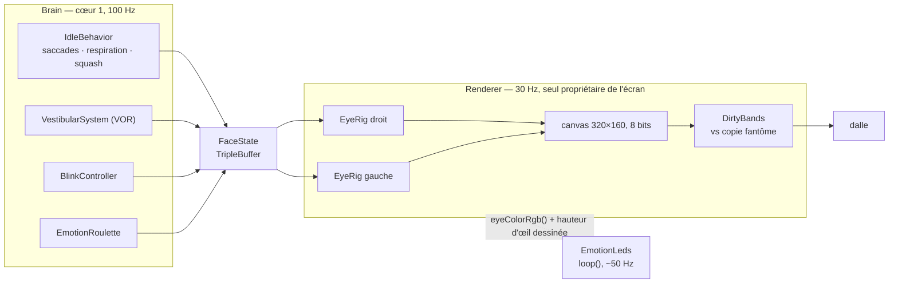
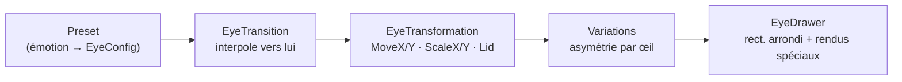

> [English](EYES.md) · **Français** — l'anglais est la version de référence.
> Ce fichier peut être en retard d'une mise à jour : en cas de divergence, l'anglais fait foi.

# Les yeux — géométrie, transitions, animation, LED

Comment un visage passe d'une décision à un pixel allumé. Les **mécanismes**
(quelle tâche exécute quoi, et quand) sont dessinés dans
[`architecture/WORKFLOWS.fr.md`](../architecture/WORKFLOWS.fr.md) ; les
**invariants** à ne pas régresser sont listés dans
[`architecture/CONVENTIONS.fr.md`](../architecture/CONVENTIONS.fr.md) §3bis. Ce
document est ce qu'il y a entre les deux : ce qu'un œil *est*, et ce qui le
fait bouger.

## La chaîne, de bout en bout



Trois règles tiennent ce schéma, et chacune a été payée :

- **Un producteur, un consommateur.** `FaceState` traverse les tâches par un
  triple tampon sans verrou : le renderer ne bloque jamais le Brain et lit
  toujours un instantané *complet*. Tout ce qui a besoin de l'émotion courante
  demande `brain->currentEmotion()` — jamais le tampon.
- **Un seul propriétaire de l'écran.** Tout accès à `M5.Display` passe par la
  tâche renderer. Quand `loop()` dessinait la bande de statut pendant que le
  renderer poussait le sprite, une préemption au milieu d'une transaction SPI
  décalait le pointeur d'adresse du contrôleur LCD et l'image s'enroulait.
  L'application *poste* sa bande (`setStatus`) ; le renderer la dessine.
- **Une seule source de lissage.** Le Brain lisse ; `EyeRig` et `Renderer`
  appliquent tel quel. C'est la règle A2.15, et c'est la raison pour laquelle
  la chaîne d'animation ci-dessous ne contient aucun filtre.

## Ce qu'est un œil

Un œil est un rectangle arrondi aux coins pilotables indépendamment —
`EyeConfig`, porté depuis ESP32_Faces (AGPL-3.0).

```
        Slope_Top  ← inclinaison du bord supérieur (le « sourcil » : le K151
   ╔═══════════════╗   n'a pas d'axe de roulis, c'est la seule disponible)
   ║ Radius_Top    ║
   ║               ║   Inverse_Radius_* creusent un arc CONCAVE dans un coin
   ║ Radius_Bottom ║   OffsetX / OffsetY  décalent le centre, en px
   ╚═══════════════╝
        Slope_Bottom
```

| Canal | Signification |
|---|---|
| `Width`, `Height` | taille totale en px — **0 signifie que rien n'est dessiné** |
| `Slope_Top`, `Slope_Bottom` | inclinaison des bords, 0 = horizontal |
| `Radius_Top`, `Radius_Bottom` | rayons des coins |
| `Radius_Top_Outer`, `Radius_Bottom_Outer` | surcharge par côté ; **0 = hériter** du rayon de base |
| `OuterIsLeft` | quel côté est « extérieur » — celui du bord de l'écran, anatomique |
| `Inverse_Radius_*`, `Inverse_Offset_*` | coins rentrants (concaves) |
| `OffsetX`, `OffsetY` | décalage du centre par rapport à la position par défaut |

**Chaque membre a un initialiseur, et c'est une propriété de sûreté, pas du
rangement.** Un `EyeConfig` indéterminé plus une transition lancée vers lui
dessinait une géométrie aléatoire pendant les premières secondes après le
démarrage — le bug des « bandes au boot ». Un `EyeConfig` par défaut est un œil
de taille nulle : l'état sûr ne dessine *rien*.

« Extérieur » est **anatomique** : cela désigne le côté de l'œil tourné vers le
bord de l'écran et ne suit *pas* le miroir aléatoire des presets. Les rayons
par côté sont résolus par `EyeRig::mirrored` **avant** la transition, pour que
l'interpolation parte de la vraie valeur et non de la sentinelle `0 = hériter`.

## La chaîne d'animation

Un œil est dessiné en parcourant une chaîne fixe, une fois par frame :



`EyeRig` ne connaît ni les tâches ni le registre des expressions. Toute son API
est `setEmotion` / `lookAtPx` / `tick` / `draw`, et il attend des **pixels déjà
convertis** — le renderer applique `units::pxFromGaze`, l'unique point de
conversion du dépôt.

### Pourquoi l'étage de transformation n'a pas de rampe

`EyeTransformation` applique `MoveX/MoveY/ScaleX/ScaleY/Lid` **directement**.
Il faisait autrefois tourner une rampe de 200 ms relancée à chaque
`SetDestin`, laquelle agissait comme un filtre passe-bas sur des valeurs que le
Brain avait *déjà* lissées — saccades, blenders, VOR, `openRatio`. Résultat
visible : un clignement réduit à quelques pixels, un clin d'œil mou, et une
compensation VOR qu'on ne voyait pas. C'est A2.15 en un paragraphe.

### La paupière n'est pas l'échelle

Fermer un œil passe par un **canal `Lid` séparé**, pas par `ScaleY`. Le port
d'origine utilisait un étage de clignement en trapèze ; il a été retiré.

- La paupière est **ancrée en bas par défaut** — elle tombe, et le bord
  inférieur ne remonte jamais.
- **Douze émotions « rondes »** (Normal, Surprised, Awe, Nervous, Excited,
  Questioning, Curious, Doubt, Contempt, Smug, Dead, Squint) se ferment en
  mode **centré**, convergeant vers le centre vertical du *plus petit* œil de
  la paire.
- Squash et profondeur restent centrés dans les deux modes.
- Les deux yeux sous `EYE_CLOSED` (0,06) dessinent **une ligne de 1 px pleine
  largeur**, posée exactement là où la fermeture aboutit
  (`EyeRig::bottomEdgeY`) — la continuité fente → ligne est une signature
  Cozmo, et elle tient dans les deux modes.

## Transitions entre émotions

Un changement d'émotion est une interpolation de la géométrie vivante vers le
nouveau preset. Trois méthodes, portées et étendues :

| Méthode | Courbe |
|---|---|
| `LINEAR` | `t` |
| `EASE_IN_OUT` | `3t² − 2t³` |
| `SPRING` | `1 − e^(−d·k·t)·cos(k·t)`, borné à 1 |

Quatre presets validés sur matériel les portent :

| Config | Méthode | Durée | Usage |
|---|---|---|---|
| `CALM` | ease | 300 ms | expressions qui se posent |
| `NORMAL` | ease | 220 ms | le défaut |
| `STRONG` | spring | 180 ms (k 14, d 0,60) | changements vifs, sursauts |
| `SOFT` | ease | 400 ms | changements lents et doux |

La config de transition voyage **dans l'instantané**
(`FaceState.transition`) : le Brain choisit donc le *ressenti* de chaque
changement plutôt que le renderer n'applique une vitesse globale.

**Contrat d'état sûr** : à la construction `Destin = snapshot = *Origin`, si
bien qu'une transition jamais configurée interpole vers l'état courant — un
no-op — au lieu d'une géométrie indéfinie. `SetDestin()` est la seule porte
d'entrée, et il prend l'instantané lui-même.

## Les canaux que possède le Brain

Tout ce qui est continu est décidé en amont et seulement appliqué en aval.

| Canal | Source | Note |
|---|---|---|
| `gaze` | saccades, VOR, head-follow, suivi sonore | unités de regard `[-1..1]`, viewer-centric |
| `openL` / `openR` | `BlinkController` | `[0..1]`, 1 = ouvert |
| `breath` | `IdleBehavior` | `[-1..+1]`, projeté sur ±3 px |
| `squashX` / `squashY` | Brain, d'après la dynamique du regard | 1,0 = neutre |
| `asymMirror` | Brain, tiré à chaque épisode d'émotion | quel œil porte l'asymétrie |
| `transition` | Brain, par changement | voir ci-dessus |
| `colorDim`, `depthScale`, `eyeSpacing`, `crt` | `Tuning` | réglables à chaud |

**`asymMirror` est tiré par le Brain, jamais par le renderer**, et il est
*calé* sur le sens miroité d'une danse en cours pour que l'œil qui porte le
mouvement corresponde à la direction que prend la tête.

## Le clignement

`BlinkController` est **l'unique propriétaire des paupières**. Rien ne le
suspend de l'extérieur : il applique une politique par expression plus des
fenêtres de suppression internes bornées dans le temps, ce qui rend
impossible par construction toute la classe des drapeaux suspend/restore qui
fuient.

| Politique | Comportement |
|---|---|
| défaut | intervalle log-uniforme, médiane 3,5 s ; clignement 60/40/100 ms |
| gel borné | Surprised / Scared / Awe → 2–4 s grands ouverts, **puis les clignements reprennent** — un regard qui ne cligne plus jamais a l'air mort |
| réduite | Frozen / Scary / Nervous / Contempt / Excited → cadence fortement réduite |
| blocage total | `Dead` — le seul |
| Focused | cadence ÷ 2 |
| Angry / Furious / Excited | cadence × 1,5, plus sec |
| Sleepy | « lutte contre le sommeil », **une machine à états PAR ŒIL** |

`Sleepy` mérite sa ligne : les deux yeux tournent **de façon asynchrone** —
affaissement lent, chute rapide, réouverture laborieuse avec micro-plongées, un
plafond vers 70 % et un plancher qui signifie que *l'œil ne se ferme jamais
tout à fait*, parce qu'il lutte. Un sursaut se déclenche environ un cycle sur
quatre, chaque œil à son rythme.

**Couplages naturels** : une grande saccade élève la probabilité de clignement
(`notifySaccade`), et un changement d'émotion fort en déclenche souvent un
(`notifyEmotionChanged`). Période réfractaire 300 ms. L'œil droit suit le
gauche par un tampon circulaire avec `blink_lag_ms` de retard — **30 ms** par
défaut ; 80 ms a été essayé et se lisait comme un défaut, pas comme de la vie.

## La roulette

`EmotionRoulette` est ce qui donne l'air vivant à un robot au repos : un
**tirage pondéré** sur un cycle de 6–12 s, pure (Clock et Rng injectés),
cadencée par le Brain et sans tâche propre.

| Poids | Émotions |
|---|---|
| 0,8 | Normal |
| 0,4 – 0,3 | Happy, Focused |
| 0,2 – 0,1 | Glee, Worried, Sleepy |
| 0,08 – 0,06 | Sad, Surprised, Angry, Annoyed, Curious |
| 0,04 – 0,02 | Excited, Questioning, Blush, Awe, Skeptic, Furious |

Chaque émotion porte son propre `TransitionConfig` par défaut : la *manière* du
changement fait donc partie de la table plutôt que d'un réglage global.

**La roulette consomme son tick même verrouillée.** Le verrou est un simple
booléen d'arbitrage passé par le Brain (une danse tourne, un réflexe a la
parole). Consommer le tick malgré tout est délibéré : le cycle de 6–12 s ne
dérive jamais, et le robot ne tire donc pas une rafale d'expressions à
l'instant où une danse se termine.

### Dans le noir, la table est réécrite

Avec `dark_sleepy` actif (le défaut) et le capteur de lumière ambiante qui
rapporte l'obscurité, la roulette entre en **mode nuit** et deux poids
changent :

| Émotion | Jour | Nuit |
|---|---|---|
| `Normal` | 0,8 | **0** — retirée du tirage |
| `Sleepy` | 0,10 | **3,0** — environ **66 %** des tirages |

Tout le reste garde son poids, et c'est tout l'enjeu : le robot **somnole**,
avec de temps en temps une autre expression qui passe, plutôt que de se figer
sur un visage. Ce qu'il ne peut plus faire, c'est avoir l'air franchement
*éveillé* — `Normal` n'est pas seulement improbable la nuit, elle est
impossible.

Le déclencheur n'est câblé nulle part. Il est **exprimé en règles** dans le
`RuleEngine`, qui surveille le champ `light` publié par `loop()` :

| Règle | Condition | Effet |
|---|---|---|
| s'endormir | `light ≤ 1` **tenu 6 s** (temporisation 2 s) | `AmbientDark 1` |
| se réveiller | `light > 10` | `AmbientDark 0` |
| option désactivée | `dark_sleepy < 0,5` | `AmbientDark 0`, idempotent |

L'écart entre 1 et 10 est une **hystérésis** : un seuil unique battrait au
rythme du bruit propre du capteur au crépuscule. Le maintien de 6 secondes fait
le même travail dans le temps — une main qui passe au-dessus du robot n'est pas
la tombée de la nuit. Et la commande voyage par la `CommandQueue` comme tout le
reste : les réflexes la préemptent donc toujours (A2.5), et une danse ou un
appel d'API l'emporte toujours sur la roulette.

À noter que le capteur de lumière est quasiment occulté par le boîtier : ces
seuils sont donc exprimés dans les *counts que ce boîtier produit réellement* —
voir [`hardware/PERIPHERALS.fr.md`](../hardware/PERIPHERALS.fr.md). Une lecture
échouée rend −1 et jamais 0, précisément pour qu'un capteur en panne ne puisse
pas être pris pour la tombée de la nuit.

## Synchronisation des LED

Douze WS2812C en deux barres de six. La règle est **l'emphase, pas
l'éclairage**.

| Grandeur | Source |
|---|---|
| Couleur | `Renderer::eyeColorRgb()` — la couleur **réellement affichée**, transition et assombrissement compris |
| Luminosité barre gauche | `Renderer::eyeHeightL()` — la hauteur **dessinée** de l'œil gauche, normalisée sur la référence Surprised (112 px) |
| Luminosité barre droite | `eyeHeightR()`, de même |
| Vitesse de rampe | ∝ intensité de l'émotion — vive sur Furious, lente sur Sleepy |
| Au repos | respiration lente, suivant le canal `breath` |
| Changement fort | une brève pulsation, puis retour |

Prendre la couleur au renderer plutôt que la recalculer est tout l'enjeu :
recalculer, c'est que les LED et l'écran divergent pendant chaque transition,
c'est-à-dire exactement quand quelqu'un les regarde.

Comme la luminosité suit la hauteur *dessinée*, un œil plus grand donne une
barre plus lumineuse — une expression asymétrique (Curious, Questioning) se
voit donc sur les barres, et un œil fermé éteint la sienne exactement à la
hauteur où la ligne de clignement se pose.

**Cadence** : appelé depuis `loop()` à ~50 Hz mais n'écrit en I2C que si
quelque chose a réellement changé. Les changements de luminosité seule sont
plafonnés à 40 Hz ; les changements de couleur partent immédiatement, parce que
c'est cette synchronisation-là qui compte. Le bus PY32 tourne à 100 kHz et une
frame fait 25 octets — le plafond existe pour garder le trafic inutile hors
d'un bus que l'IMU partage. Les LED sont **éteintes par défaut** (clé de tuning
`leds`).

## L'amener sur la dalle

La zone des yeux est un **canvas 320×160 en 8 bits** en SRAM interne, avec un
repli dégradé en PSRAM. Le budget de frame mesuré est de 21,4 ms en moyenne,
26,1 ms au pire, plus environ 7 ms de CRT — dans la période de 33 ms.

Le nombre intéressant est ailleurs. Une poussée complète de la zone des yeux
fait 320 × 160 × 2 o sur un bus SPI2 à 40 MHz = 102 400 octets = **20,5 ms de
temps de fil pur**, alors que *tout* le code de dessin réuni fait environ
3,5 ms. Le seul levier du bon ordre de grandeur est donc **le nombre de pixels
poussés**.

Le renderer garde donc une **copie fantôme** de ce que la dalle affiche
(51 200 o en PSRAM), la compare au canvas *après* le dessin, et ne pousse que
les bandes de lignes qui diffèrent (`engine/DirtyBands.h`, testé nativement).

- La comparaison porte sur des **pixels déjà rendus**, jamais sur une valeur de
  canal. Rien n'est sauté et rien n'est lissé — c'est une optimisation de
  **transport**, et A2.15 n'est même pas effleurée.
- Pas de PSRAM → pas de fantôme → `pushSprite` complet. Le repli est l'ancien
  chemin de code, pas une panne.
- **Le piège** est un fantôme qui décrit un écran qui n'existe plus. Tout tiers
  qui peint dans `y < 160` doit l'invalider. Dans ce firmware ils passent tous
  par `pause()` — c'est A2.1/A2.16, la seule façon sanctionnée de céder
  l'écran — donc l'invalidation vit dans le chemin post-`resume()`, sans
  condition.

## Overlays et mouvement propre à chaque émotion

Les **overlays** (`engine/EyeEffects.h`) sont une fonction pure de (émotion,
temps), dessinée par le Renderer APRÈS les yeux et AVANT le CRT, sans aucun
état dans le Brain ni dans `FaceState`. Ils apparaissent en fondu avec la
progression de la transition.

| Overlay | Émotions | Ce qu'il dessine |
|---|---|---|
| Blush | Blush, Glee, Smug | trois traits roses par joue (`0xFF8CB0`) |
| Sparkles | Excited, Awe | trois étoiles ✦ sur des temps décalés |
| Sweat | Scared, Worried, Frustrated | une goutte qui perle puis glisse, cycle de 2,4 s |

`Blush` est aussi une émotion à part entière : yeux Happy, oscillation timide,
joues roses et chirp joyeux, poids 0,04 dans la roulette.

**Rayons extérieurs par coin** : `EyeConfig.Radius_Top_Outer` /
`Radius_Bottom_Outer` (0 = hérité, résolu dans `EyeRig::mirrored`) plus
l'`OuterIsLeft` anatomique. `normalize()` borne le pire cas et les transitions
interpolent les valeurs résolues. Surprised utilise un rayon extérieur haut de
56, Awe un rayon extérieur bas de 56.

**Formes qui bougent à l'intérieur d'une émotion** :

- **Normal** : centré verticalement, UN œil (côté aléatoire, via le miroir)
  légèrement plus petit (`Preset_Normal_Alt`, 92 contre 100), les deux
  respirant sur la MÊME période et la même phase de 1000 ms — une phase
  décalée se lit comme « faux ».
- **Sleepy** : respiration synchronisée (2000 ms, amplitudes 6/8) mais
  fermetures ASYNCHRONES par œil (voir [Le clignement](#le-clignement)), bords
  bas ancrés, et un plancher de lutte (`SL_FLOOR` 0,08, 1-2 px) pour qu'un
  affaissement n'atteigne jamais la ligne de clignement.
- **Sad** « regard vers le ciel » : au-delà de `MoveY` > 5 px il passe à la
  forme Scary, avec hystérésis.
- **Curious, Questioning, Contempt, Worried** : une asymétrie statique choisie
  à l'entrée (un œil Normal, l'autre Big). Curious la bascule en plus vers le
  bord regardé (`MoveX` ±12/6 px, hystérésis) : Big 104×105, Normal 68×92,
  rayon 18. Questioning reprend les mêmes tailles, avec le
  `Slope_Top`/`Radius_Top` du grand œil pris sur `Preset_Worried_Alt`
  (-0,20/15).

L'œil qui porte une asymétrie est choisi par le Brain (`asymMirror`, plus
haut), jamais ici.

## D'où vient le code

La géométrie des yeux, les méthodes de transition et le tirage de la roulette
sont **portés d'esp32-eyes / ESP32_Faces** (Luis Llamas, Aitchison), et ces
fichiers conservent leur en-tête **AGPL-3.0** d'origine. Ils sont compilés dans
le même binaire, donc l'AGPL-3.0 régit la distribution du firmware complet —
voir la section Licences du `README.md` racine.

Ce qui n'est *pas* porté, c'est tout ce que ce document appelle une règle : la
source unique de lissage, le canal de paupière séparé, le triple tampon, la
poussée par bandes sales, et la synchronisation des LED.
