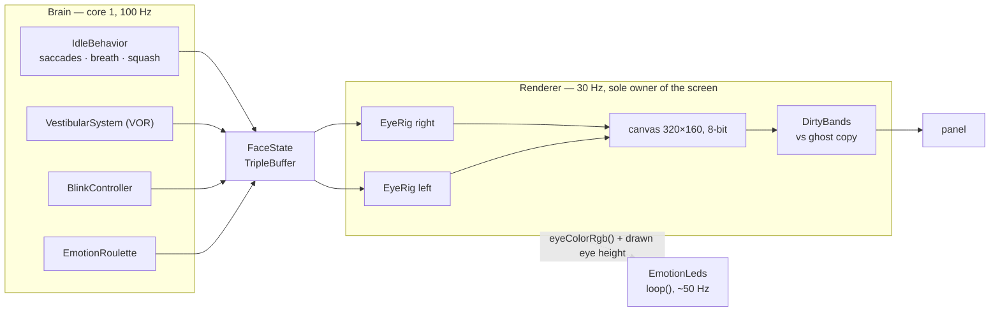
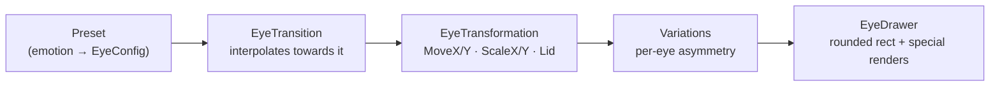

> **English** · [Français](EYES.fr.md)

# The eyes — geometry, transitions, animation, LEDs

How a face gets from a decision to a lit pixel. The **mechanisms** (which task
runs what, when) are drawn in
[`architecture/WORKFLOWS.md`](../architecture/WORKFLOWS.md); the **invariants**
that must not regress are listed in
[`architecture/CONVENTIONS.md`](../architecture/CONVENTIONS.md) §3bis. This
document is the part in between: what an eye *is*, and what moves it.

## The chain, end to end



Three rules hold that picture together, and each one was paid for:

- **One producer, one consumer.** `FaceState` crosses tasks through a
  lock-free triple buffer, so the renderer never blocks the Brain and always
  reads a *complete* snapshot. Anything else that needs the current emotion
  asks `brain->currentEmotion()` — never the buffer.
- **One owner of the screen.** Every access to `M5.Display` goes through the
  renderer task. When `loop()` drew the status band while the renderer was
  pushing the sprite, preemption mid-SPI-transaction shifted the LCD
  controller's address pointer and the image wrapped. The app *posts* its band
  (`setStatus`); the renderer draws it.
- **One source of smoothing.** The Brain smooths; `EyeRig` and `Renderer`
  apply as-is. This is rule A2.15 and it is the reason the animation chain
  below has no filter in it.

## What an eye is

An eye is a rounded rectangle with independently controllable corners —
`EyeConfig`, ported from ESP32_Faces (AGPL-3.0).

```
        Slope_Top  ← tilt of the upper edge (the "eyebrow": the K151 has no
   ╔═══════════════╗   roll axis, so this tilt is the only one available)
   ║ Radius_Top    ║
   ║               ║   Inverse_Radius_* carve a CONCAVE arc into a corner
   ║ Radius_Bottom ║   OffsetX / OffsetY  offset the centre, in px
   ╚═══════════════╝
        Slope_Bottom
```

| Channel | Meaning |
|---|---|
| `Width`, `Height` | total size in px — **0 means nothing is drawn** |
| `Slope_Top`, `Slope_Bottom` | edge tilt, 0 = horizontal |
| `Radius_Top`, `Radius_Bottom` | corner radii |
| `Radius_Top_Outer`, `Radius_Bottom_Outer` | per-side override; **0 = inherit** the base radius |
| `OuterIsLeft` | which side is "outer" — the screen-edge side, anatomical |
| `Inverse_Radius_*`, `Inverse_Offset_*` | re-entrant (concave) corners |
| `OffsetX`, `OffsetY` | centre offset vs the default position |

**Every member has an initialiser, and that is a safety property, not tidiness.**
An indeterminate `EyeConfig` plus a transition started towards it drew random
geometry for the first few seconds after boot — the "bands at boot" bug. A
default `EyeConfig` is a zero-sized eye, so the safe state draws *nothing*.

"Outer" is **anatomical**: it means the screen-edge side of the eye and does
*not* follow the random mirroring of the presets. The per-side radii are
resolved by `EyeRig::mirrored` **before** the transition, so interpolation
starts from the real value rather than from the `0 = inherit` sentinel.

## The animation chain

One eye is drawn by walking a fixed chain, once per frame:



`EyeRig` knows neither the tasks nor the expression registry. Its whole API is
`setEmotion` / `lookAtPx` / `tick` / `draw`, and it expects **pixels already
converted** — the renderer applies `units::pxFromGaze`, the single conversion
point in the codebase.

### Why the transformation stage has no ramp

`EyeTransformation` applies `MoveX/MoveY/ScaleX/ScaleY/Lid` **directly**. It
used to run a 200 ms ramp restarted on every `SetDestin`, which acted as a
low-pass filter on values the Brain had *already* smoothed — saccades,
blenders, VOR, `openRatio`. The visible result: a blink reduced to a few
pixels, a mushy wink, and VOR compensation you could not see. That is A2.15 in
one paragraph.

### The lid is not the scale

Closing an eye goes through a **separate `Lid` channel**, not through
`ScaleY`. The original port used a trapezium blink stage; it was removed.

- The lid is **bottom-anchored by default** — it falls, and the bottom edge
  never rises.
- **Twelve "round" emotions** (Normal, Surprised, Awe, Nervous, Excited,
  Questioning, Curious, Doubt, Contempt, Smug, Dead, Squint) close in
  **centred** mode instead, converging towards the vertical centre of the
  *smaller* eye of the pair.
- Squash and depth stay centred in both modes.
- Both eyes below `EYE_CLOSED` (0.06) draw **one full-width 1 px line**, laid
  down exactly where the closing ended up (`EyeRig::bottomEdgeY`) — the slit →
  line continuity is a Cozmo signature, and it holds in both modes.

## Transitions between emotions

A change of emotion is an interpolation from the live geometry to the new
preset. Three methods, ported and extended:

| Method | Curve |
|---|---|
| `LINEAR` | `t` |
| `EASE_IN_OUT` | `3t² − 2t³` |
| `SPRING` | `1 − e^(−d·k·t)·cos(k·t)`, clamped to 1 |

Four hardware-validated presets carry them:

| Config | Method | Duration | Used for |
|---|---|---|---|
| `CALM` | ease | 300 ms | settling expressions |
| `NORMAL` | ease | 220 ms | the default |
| `STRONG` | spring | 180 ms (k 14, d 0.60) | snappy, startled changes |
| `SOFT` | ease | 400 ms | slow, soft changes |

The transition config travels **inside the snapshot** (`FaceState.transition`),
so the Brain chooses the *feel* of each individual change rather than the
renderer applying one global speed.

**Safe-state contract**: at construction `Destin = snapshot = *Origin`, so a
transition that was never configured interpolates towards the current state — a
no-op — instead of towards undefined geometry. `SetDestin()` is the only way
in, and it takes the snapshot itself.

## The channels the Brain owns

Everything continuous is decided upstream and merely applied downstream.

| Channel | Source | Note |
|---|---|---|
| `gaze` | saccades, VOR, head-follow, sound tracking | gaze units `[-1..1]`, viewer-centric |
| `openL` / `openR` | `BlinkController` | `[0..1]`, 1 = open |
| `breath` | `IdleBehavior` | `[-1..+1]`, projected to ±3 px |
| `squashX` / `squashY` | Brain, from gaze dynamics | 1.0 = neutral |
| `asymMirror` | Brain, drawn per emotion episode | which eye carries the asymmetry |
| `transition` | Brain, per change | see above |
| `colorDim`, `depthScale`, `eyeSpacing`, `crt` | `Tuning` | live-tunable |

**`asymMirror` is drawn by the Brain, never by the renderer**, and it is
*locked* onto the mirrored direction of a running dance so that the eye
carrying the movement matches the direction the head is going.

## Blinking

`BlinkController` is **the single owner of the eyelids**. Nothing suspends it
from the outside: it applies a policy per expression plus internal suppression
windows bounded in time, which makes the whole class of leaked
suspend/restore flags impossible by construction.

| Policy | Behaviour |
|---|---|
| default | log-uniform interval, median 3.5 s; blink 60/40/100 ms |
| bounded freeze | Surprised / Scared / Awe → 2–4 s wide open, **then blinks resume** — a gaze that never blinks again looks dead |
| reduced | Frozen / Scary / Nervous / Contempt / Excited → heavily reduced rate |
| total block | `Dead` — the only one |
| Focused | rate ÷ 2 |
| Angry / Furious / Excited | rate × 1.5, snappier |
| Sleepy | "fighting off sleep", **one state machine per eye** |

`Sleepy` is worth its own line: the two eyes run **asynchronously** — slow
droop, fast fall, laborious reopening with micro-dips, a ceiling near 70 % and
a floor that means *the eye never quite closes*, because it is fighting. A
startle fires about one cycle in four, each eye at its own pace.

**Natural couplings**: a large saccade raises blink probability
(`notifySaccade`), and a strong emotion change often triggers one
(`notifyEmotionChanged`). Refractory period 300 ms. The right eye follows the
left through a ring buffer with `blink_lag_ms` of delay — default **30 ms**;
80 ms was tried and read as a fault rather than as life.

## The roulette

`EmotionRoulette` is what makes an idle robot look alive: a **weighted draw**
on a 6–12 s cycle, pure (Clock and Rng injected), ticked by the Brain and
owning no task of its own.

| Weight | Emotions |
|---|---|
| 0.8 | Normal |
| 0.4 – 0.3 | Happy, Focused |
| 0.2 – 0.1 | Glee, Worried, Sleepy |
| 0.08 – 0.06 | Sad, Surprised, Angry, Annoyed, Curious |
| 0.04 – 0.02 | Excited, Questioning, Blush, Awe, Skeptic, Furious |

Each emotion carries its own default `TransitionConfig`, so the *manner* of the
change is part of the table rather than a global setting.

**The roulette consumes its tick even while locked.** The lock is a plain
arbitration boolean handed in by the Brain (a dance is running, a reflex has
the floor). Consuming the tick regardless is deliberate: the 6–12 s cycle never
drifts, so the robot does not fire a burst of expressions the moment a dance
ends.

### In the dark, the table is rewritten

With `dark_sleepy` on (the default) and the ambient light sensor reporting
darkness, the roulette enters **night mode** and two weights change:

| Emotion | Day | Night |
|---|---|---|
| `Normal` | 0.8 | **0** — removed from the draw entirely |
| `Sleepy` | 0.10 | **3.0** — about **66 %** of draws |

Everything else keeps its weight, and that is the point: the robot **dozes**,
with the occasional other expression passing through, rather than freezing on
one face. What it can no longer do is look plainly *awake* — `Normal` is not
merely unlikely at night, it is impossible.

The trigger is not hardwired anywhere. It is **expressed as rules** in the
`RuleEngine`, which watches the `light` field published by `loop()`:

| Rule | Condition | Effect |
|---|---|---|
| fall asleep | `light ≤ 1` **held 6 s** (cooldown 2 s) | `AmbientDark 1` |
| wake up | `light > 10` | `AmbientDark 0` |
| option turned off | `dark_sleepy < 0.5` | `AmbientDark 0`, idempotent |

The gap between 1 and 10 is **hysteresis**: a single threshold would flap on
the sensor's own noise at dusk. The 6-second hold does the same job in time —
a hand passing over the robot is not nightfall. And the command travels through
the `CommandQueue` like everything else, so reflexes still preempt it (A2.5)
and a dance or an API call still overrides the roulette.

Note that the light sensor is nearly occluded by the enclosure, so those
thresholds are in the *counts that this enclosure actually produces* — see
[`hardware/PERIPHERALS.md`](../hardware/PERIPHERALS.md). A failed read returns
−1 and never 0, precisely so that a broken sensor cannot be mistaken for
nightfall.

## LED synchronisation

Twelve WS2812C in two bars of six. The rule is **emphasis, not lighting**.

| Quantity | Source |
|---|---|
| Colour | `Renderer::eyeColorRgb()` — the colour **actually displayed**, transition and dimming included |
| Left bar brightness | `Renderer::eyeHeightL()` — the **drawn** height of the left eye, normalised against the Surprised reference (112 px) |
| Right bar brightness | `eyeHeightR()`, likewise |
| Ramp speed | ∝ emotion intensity — snappy on Furious, slow on Sleepy |
| Idle | slow breathing, following the `breath` channel |
| Strong change | a brief pulse, then back down |

Taking the colour from the renderer rather than recomputing it is the whole
point: recomputing means the LEDs and the screen disagree during every
transition, which is exactly when someone is looking at them.

Because brightness follows the *drawn* height, a bigger eye is a brighter bar —
so an asymmetric expression (Curious, Questioning) shows up on the bars, and a
closed eye takes its bar out at exactly the height where the blink line settles.

**Cadence**: called from `loop()` at ~50 Hz but writing I2C only when
something actually changed. Brightness-only changes are capped at 40 Hz; colour
changes go out immediately, because that is the sync that matters. The PY32 bus
runs at 100 kHz and a frame is 25 bytes — the cap exists to keep useless
traffic off a bus the IMU shares. LEDs are **off by default** (`leds` tuning
key).

## Getting it onto the panel

The eye zone is a **320×160 8-bit canvas** in internal SRAM, with a degraded
PSRAM fallback. The measured frame budget is 21.4 ms average, 26.1 ms max, plus
about 7 ms of CRT — inside the 33 ms period.

The interesting number is elsewhere. A full push of the eye zone is
320 × 160 × 2 B on a 40 MHz SPI2 bus = 102 400 bytes = **20.5 ms of pure wire
time**, while *all* the drawing code together is about 3.5 ms. The only lever of
the right order of magnitude is therefore **the number of pixels pushed**.

So the renderer keeps a **ghost copy** of what the panel is showing (51 200 B in
PSRAM), compares it to the canvas *after* drawing, and pushes only the row
bands that differ (`engine/DirtyBands.h`, tested natively).

- The comparison is on **pixels already rendered**, never on a channel value.
  Nothing is skipped and nothing is smoothed — this is a **transport**
  optimisation, and A2.15 is not even touched.
- No PSRAM → no ghost → full `pushSprite`. The fallback is the old code path,
  not a failure.
- **The trap** is a ghost that describes a screen which no longer exists. Any
  third party painting into `y < 160` must invalidate it. In this firmware they
  all go through `pause()` — that is A2.1/A2.16, the only sanctioned way to
  hand the screen over — so the invalidation lives in the post-`resume()` path,
  unconditionally.

## Overlays and per-emotion motion

**Overlays** (`engine/EyeEffects.h`) are a pure function of (emotion, time)
drawn by the Renderer AFTER the eyes and BEFORE the CRT, with no state in the
Brain or in `FaceState`. They fade in with the transition progress.

| Overlay | Emotions | What it draws |
|---|---|---|
| Blush | Blush, Glee, Smug | three pink strokes per cheek (`0xFF8CB0`) |
| Sparkles | Excited, Awe | three ✦ stars on offset beats |
| Sweat | Scared, Worried, Frustrated | a drop that beads then slides, 2.4 s cycle |

`Blush` is also an emotion in its own right: Happy eyes, a shy oscillation,
the pink cheeks and a happy chirp, roulette weight 0.04.

**Per-corner outer radii**: `EyeConfig.Radius_Top_Outer` /
`Radius_Bottom_Outer` (0 = inherit, resolved in `EyeRig::mirrored`) plus the
anatomical `OuterIsLeft`. `normalize()` clamps the worst case and transitions
lerp the resolved values. Surprised uses a top outer radius of 56, Awe a
bottom outer radius of 56.

**Shapes that move within an emotion**:

- **Normal**: vertically centred, ONE eye (random side, through the mirror)
  slightly smaller (`Preset_Normal_Alt`, 92 vs 100), both breathing on the SAME
  1000 ms period and phase — an offset phase reads as "wrong".
- **Sleepy**: synchronised breathing (2000 ms, amplitudes 6/8) but closures
  ASYNCHRONOUS per eye (see [Blinking](#blinking)), bottom edges anchored, and a
  struggle floor (`SL_FLOOR` 0.08, 1-2 px) so a droop never reaches the blink
  line.
- **Sad** "looking at the sky": past `MoveY` > 5 px it switches to the Scary
  shape, with hysteresis.
- **Curious, Questioning, Contempt, Worried**: a static asymmetry chosen at
  entry (one eye Normal, the other Big). Curious also swaps it towards the
  edge being looked at (`MoveX` ±12/6 px, hysteresis): Big 104×105, Normal
  68×92, radius 18. Questioning uses the same sizes, with the big eye's
  `Slope_Top`/`Radius_Top` taken from `Preset_Worried_Alt` (-0.20/15).

Which eye carries an asymmetry is decided by the Brain (`asymMirror`, above),
never here.

## Where the code comes from

The eye geometry, the transition methods and the roulette draw are **ported
from esp32-eyes / ESP32_Faces** (Luis Llamas, Aitchison), and those files keep
their original **AGPL-3.0** headers. They are compiled into the same binary, so
AGPL-3.0 governs the distribution of the whole firmware — see the Licences
section of the root `README.md`.

What is *not* ported is everything this document calls a rule: the single
smoothing source, the separate lid channel, the triple buffer, the dirty-band
push, and the LED synchronisation.
