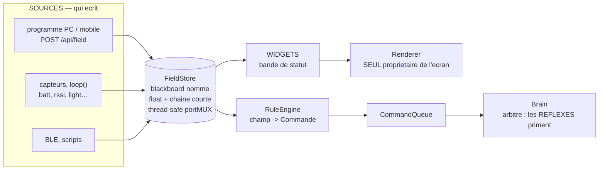

> [English](PLUGINS.md) · **Français** — l'anglais est la version de référence.
> Ce fichier peut être en retard d'une mise à jour : en cas de divergence, l'anglais fait foi.

# PLUGINS.md — étendre StackChan sans recompiler

StackChan expose **un seul contrat** — `sources → champs → {widgets, règles}` —
et la possibilité vient de trois façons de s'y lier, du plus libre au plus sûr.
Aucune ne demande de flasher le firmware.

> Le rendu de la **bande de statut** (modes, champs affichés, icônes, API) a sa
> propre référence : **`docs/reference/STATUSBAR.md`**. Ce document-ci décrit le contrat
> général (champs, règles, widgets).

## Le vocabulaire (le contrat)

| Élément | Quoi | Qui écrit | Qui lit |
|---|---|---|---|
| **Champ** | valeur nommée (float **ou** chaîne courte) dans le *blackboard* (`FieldStore`) | toute source : `POST /api/field`, loop (capteurs), BLE, scripts | widgets de la bande, moteur de règles |
| **Commande** | mutation whitelistée (`CmdType`) via la `CommandQueue` du Brain | API, touch, **règles** | le Brain (qui arbitre — réflexes prioritaires) |
| **Widget** | dessin d'une zone de la bande basse | — | le **Renderer** (seul propriétaire de l'écran) |
| **Règle** | `champ → Commande` (ou `→ champ`) | `rules.txt` / built-in | le moteur (`RuleEngine`) |

Champs internes déjà posés : `batt chg rssi cam night mic micL micR light
dark_sleepy ip clk tmr tmr_st` (+ ce que tes scripts poussent : `g0..g2`,
`g0l/g0r`, …). Trois d'entre eux sont des CHAÎNES sans nombre utile derrière
(`ip`, `clk` l'heure murale, `tmr` l'affichage du minuteur de la bande) ; une
règle lit le float, elle observe donc `tmr_st` — la phase du minuteur en nombre
— et jamais `tmr`. La table tient `MAX_FIELDS = 28` entrées, des clés de 13
caractères.

Le contrat tient en une forme : **personne ne câble de chemin dédié vers
l'écran ni vers le Brain**. On pose un champ, et ce qui l'observe réagit.
C'est ce qui permet d'ajouter une source sans toucher au firmware.



Le détail du rendu de la bande (modes, priorités, icônes) est dans
[`STATUSBAR.fr.md`](STATUSBAR.fr.md), et le mécanisme complet
`sources → champs → {widgets, règles}` est illustré dans
[`architecture/WORKFLOWS.md §11`](../architecture/WORKFLOWS.fr.md).

## Tier 1 — un programme (possibilité **illimitée**)

N'importe quel langage/machine parle l'API HTTP. C'est là que vit la puissance
maximale (vrai OS, libs, réseau), sans contrainte ESP32.

```bash
# afficher 3 jauges Claude
POST /api/statusbar?mode=3
POST /api/field?g0=62&g0l_s=CTX&g0r_s=stackch.&g1=41&g1l_s=5H&g1r_s=1h24
# notifier
POST /api/say?text=Lave-linge%20termine&ms=6000
# réagir : pousser son propre champ, qu'une RÈGLE observe
POST /api/field?build=1
```

Pousseurs fournis : `scripts/dev/statusbar-push.ps1` (générique) et
`scripts/dev/claude-statusline.ps1`, chacun avec un jumeau `.sh` — le pont
statusline Claude Code, qui fait vivre au robot l'activité Claude **sans Claude
Desktop ni BLE**.

### Installer le pont, sur les trois plateformes

Claude Code lit `~/.claude/settings.json` sur toutes ; seule la ligne de
commande change. Pointer `STACKCHAN_IP` sur le robot et ajouter :

```jsonc
// Windows
"statusLine": { "type": "command",
  "command": "pwsh -NoProfile -File C:/chemin/vers/scripts/dev/claude-statusline.ps1" }

// macOS et Linux  (un `chmod +x` une fois pour toutes)
"statusLine": { "type": "command",
  "command": "/chemin/vers/scripts/dev/claude-statusline.sh" }
```

| Plateforme | L'adresse du robot | Exige |
|---|---|---|
| Windows | `$env:STACKCHAN_IP = '192.168.1.50'` | PowerShell 7 (`pwsh`) |
| macOS | `export STACKCHAN_IP=192.168.1.50` | `curl` (fourni), `python3` (outils en ligne de commande Xcode) |
| Linux | `export STACKCHAN_IP=192.168.1.50` | `curl`, `python3` |

Le jumeau `.sh` est délibérément écrit pour **bash 3.2**, le bash que macOS
livre encore : tableaux et `printf`, pas de `mapfile`, pas de tableaux
associatifs, pas de `${var,,}`. Il tourne donc tel quel sur les deux, et il en
va de même pour `statusbar-push.sh`.

Poser aussi `CLAUDE_CTX_WINDOW` si la fenêtre de votre modèle ne fait pas
200 000 jetons — voir plus bas pourquoi ce nombre est la seule chose qu'il
faille vraiment régler.

Ce pont fait deux choses à la fois : il affiche une statusline normale, et il
pousse les champs que lisent les règles livrées sur la carte. Claude Code passe
un JSON sur stdin à une commande de statusline, et **le contexte n'y est pas** :
ce schéma n'est pas documenté et aucun champ n'y annonce le remplissage de la
fenêtre. Ce qui *est* documenté, c'est `transcript_path` ; le pont le lit donc :
la dernière entrée portant un `message.usage` donne les jetons du dernier
prompt, et leur part de la fenêtre est publiée sous `ctx`. Le dénominateur est
le point faible, il est donc explicite : `$CLAUDE_CTX_WINDOW` d'abord, sinon
`autoCompactWindow` de `~/.claude/settings.json`, sinon 200000. Sur un modèle à
fenêtre de 1 M, le défaut affiche 100 % en permanence — poser la variable est la
réponse, pas un bug à diagnostiquer.

Le pont ne met `claude` à 1 **que si `ctx` a pu être calculé**. Une règle comme
`ctx lt 20` est VRAIE tant que le champ est absent, puisqu'un champ inconnu vaut
0 ; un pont qui annoncerait sa présence sans fournir le contexte ferait
joyeusement déclencher la règle de la fenêtre vide à chaque session. `claude`
signifie donc « le contexte est livré », ce dont ces règles ont exactement
besoin comme grille. Le même appel remplit deux jauges de la bande : `g0` = le
contexte, libellé CTX avec le nom du projet à droite, et `g1` = le coût de la
session rapporté à 5 $, libellé COST.

## Tier 2 — des règles sur SD (autonome, **borné, sûr**)

`/stackchan-companion/rules.txt` — une règle par ligne, rechargée à chaud par
`POST /api/rules/reload` ou depuis la console. Le robot réagit **tout seul**,
sans hôte allumé.

```
# enable | field | op | value | sustainMs | cooldownMs | action | a1 | a2
claude | ctx   | ge | 90 | 3000 | 60000 | SetEmotion | Scared | 4000
       | batt  | lt | 15 | 0    | 60000 | SetEmotion | Worried
       | build | ge | 1  | 0    | 5000  | PlayDance  | nod
```

`enable` est une **grille** : la règle dort tant que ce champ vaut moins de 0,5,
et une grille vide signifie toujours active. La comparaison est l'une de
`gt ge lt le eq ne` contre un nombre, et le déclenchement est un **front tenu** :
la condition doit rester vraie pendant `sustainMs`, la règle tire alors UNE fois
et ne se ré-arme qu'au retour à faux — un champ garé au-dessus de son seuil ne
harcèle donc pas le robot. `cooldownMs` est le plancher entre deux tirs d'une
même règle. Les actions sont `SetEmotion <nom> [ms]`, `PlayDance <nom>`,
`Blink`, `WinkLeft`, `WinkRight`, `AmbientDark <0|1>` et `set <champ> <valeur>`
— cette dernière réécrit dans le blackboard, ce qui permet à une règle d'en
nourrir une autre, ou un script qui interroge le champ.

Les noms que prennent ces deux actions sont catalogués, et les deux catalogues
sont tenus face au code par `check-doc-coverage` : les expressions dans
[`EMOTIONS.fr.md`](EMOTIONS.fr.md), les danses dans
[`CHOREGRAPHIES.fr.md`](CHOREGRAPHIES.fr.md) §5. Un nom qui n'existe pas fait
échouer l'analyse de la ligne, et une ligne qui ne s'analyse pas est simplement
**absente** de la table chargée — `GET /api/rules` est là pour le voir.

Un champ inconnu vaut 0, et c'est ce qui rend le fichier sûr à livrer bien
rempli : une règle écrite pour une source que l'on ne fait pas tourner ne
déclenche tout simplement jamais. C'est aussi le piège auquel répond la grille
`enable`, car une règle formulée « sous un seuil » est *vraie* sur un champ que
personne ne publie.

### La grammaire, exactement

Une ligne fait **7 à 9 champs** séparés par `|` ; tout ce qui suit le neuvième
tombe avec le reste de la ligne. Seuls `field`, `op` et `action` doivent porter
quelque chose — un `value`, un `sustainMs` ou un `cooldownMs` vide vaut 0, et un
`enable` vide est la grille « toujours active ». En dessous de sept champs, la
ligne n'est pas une règle du tout et elle est jetée ; ce sont les deux champs
d'arguments qui font neuf, donc une action qui n'en prend aucun s'arrête au
septième et `| batt | lt | 15 | | | Blink` est une règle complète.

Les opérateurs, les noms d'action, les noms d'émotion et les noms de danse sont
**insensibles à la casse**. Les noms de champ, **non** : ils sont comparés octet
pour octet, sur leurs 13 premiers caractères — deux champs qui ne diffèrent
qu'au-delà du 13e sont le même champ, et `Batt` n'est pas `batt`.

Les commentaires sont **de ligne entière uniquement** : le `#` doit être le
premier caractère non blanc. Un `#` au milieu d'une règle reste à l'intérieur du
jeton où il tombe, ce qui est l'inverse du CSV des danses (celui-là coupe au
premier `#`, où qu'il soit). Les deux formats sont lus par des analyseurs
différents et aucun n'emprunte les habitudes de l'autre.

**`PlayDance` joue n'importe quelle danse — compilée ou sur la carte.** Le nom
est résolu au moment où la règle SE DÉCLENCHE, contre la liste fusionnée : les
quinze danses compilées d'abord, puis `/dances/*.csv`. `PlayDance haro_float`
fonctionne donc avec le seul fichier posé sur la carte.

Il le fallait dans ce sens plutôt qu'au parse, pour deux raisons distinctes. Au
démarrage les règles sont lues AVANT `danceStore.reload()` : la banque SD est
vide pendant l'analyse du fichier, et un nom cherché à ce moment-là ne pourrait
jamais trouver une chorégraphie de la carte. Et `DanceStore` est DOUBLE-BANQUE
et se recharge à chaud : un index mémorisé au parse désignerait une autre danse
après un téléversement. La règle transporte donc le NOM (interné dans l'arène de
`RuleStore`, un pointeur stable comme A2.17 l'exige) et le puits applicatif le
résout à chaque déclenchement.

Un nom qui ne correspond à rien est **dit à voix haute** sur la trace série
plutôt qu'ignoré : la règle existe, elle s'est déclenchée, et rien ne s'est
produit — ce qui, vu de l'extérieur, ressemble exactement à une règle qui ne se
déclenche jamais, la forme la plus difficile à diagnostiquer. Vérifier
l'orthographe avec `GET /api/dances/files`.

Un tir supprimé par `cooldownMs` ne **ré-arme pas** la règle. La condition est
toujours debout quand le cooldown s'achève, donc la règle tire à ce moment-là,
sur le même front, sans aucune nouvelle transition faux→vrai. `cooldownMs` se lit
donc « pas plus souvent que ça », jamais « une chance, puis on oublie ».

La capacité est `MAX_RULES = 24` **compilées comprises**, donc 21 règles peuvent
venir de la carte. Les chaînes qu'une règle doit faire survivre à l'analyse —
grille, champ, clé de `set`, description — sont copiées dans une arène de 2560
octets partagée par tout le fichier. Une arène pleine n'est pas une erreur : la
copie échoue simplement et la règle continue de fonctionner avec ce qui lui
reste, et c'est pourquoi la description est copiée EN DERNIER (voir plus bas).

Rien de tout cela ne se journalise. Une ligne que l'analyseur refuse est
**absente**, et voici comment on gagne ce sort : un opérateur hors des six, un
nom d'émotion inconnu, un nom de danse qui n'est pas l'une des 15, un `set` sans
clé, moins de sept champs, et une ligne de plus de 127 octets. `GET /api/rules`
est le moyen de savoir lesquelles de ses lignes sont passées.

### D'où vient la description d'une règle

Le format n'a pas de champ de description, et en ajouter un casserait tous les
fichiers déjà écrits — mais les gens expliquent quand même leurs règles dans un
commentaire au-dessus, alors c'est là que la description est lue. Les lignes de
commentaire immédiatement au-dessus d'une règle sont **accumulées** et jointes
par des espaces, si bien qu'une phrase repliée sur deux lignes `#` fait une seule
description. Une ligne vide **ou un `#` seul** vide le tampon, ce qui empêche
l'en-tête de format de vingt lignes du fichier de se coller à la première règle
en dessous. Le résultat est plafonné à 96 octets, ramené à une frontière de mot
et terminé par `…` plutôt que coupé en plein mot.

Elle est internée **en dernier**, délibérément : l'arène est finie, et une règle
qui a perdu sa description fonctionne encore là où une règle qui a perdu son nom
de champ, non. Prendre la description en premier laisserait un fichier bavard
casser les règles qu'il décrit.

La description est servie sous `d` et affichée en dernière colonne du tableau des
règles de la console — le seul endroit où « pourquoi cette règle est là » survit
au voyage de la carte jusqu'au navigateur.

**Le modèle est écrit par le firmware**, il n'est pas livré sur la carte :
`RuleStore::writeDefaultIfAbsent` crée `rules.txt` au démarrage quand la carte
n'en a pas ou que le fichier est vide, si bien que le format se documente sur la
carte même que l'utilisateur s'apprête à éditer.
`sdcard/stackchan-companion/rules.txt.example` en est un miroir, tenu octet pour
octet par `scripts/gates/check-mirrors.py` (entrée « rules.txt template ») — ce
modèle est la seule description de la syntaxe que la plupart des utilisateurs
liront jamais, donc une copie qui dérive enseigne une grammaire que l'analyseur
situé quelques lignes plus bas rejette. La même barrière refuse toute ligne de
modèle au-delà de **126 octets** : `RuleStore::load` lit dans un
`char line[128]` et JETTE une ligne trop longue en entier plutôt que de la
tronquer (une tête tronquée s'analyserait, et la queue reviendrait comme une
seconde règle, inventée) ; un commentaire trop long disparaîtrait donc en
silence du fichier que l'on lit justement pour apprendre le format, et une règle
trop longue ne se chargerait jamais, en silence elle aussi.

Le modèle livre **quatre règles actives pour la jauge de contexte Claude**,
toutes grillées sur `claude` et donc inertes tant que le pont statusline du
Tier 1 n'est pas installé : un premier avertissement à 75 % de la fenêtre, une
vraie réaction à 90 %, un hochement de tête négatif à 97 % (au plus une fois
toutes les cinq minutes), et une mine satisfaite sous 20 %, tenue dix secondes
pour qu'un compactage tombant au milieu d'une réponse ne se lise pas comme une
célébration. Tout le reste du fichier est commenté et là pour être copié.

Relire ce qui a réellement été chargé est un point d'entrée à part,
`GET /api/rules`, parce que `POST /api/rules/reload` répond 202 sans rien dire
du résultat : une ligne qui échoue à l'analyse est simplement **absente** —
aucune erreur, aucun log — et le seul symptôme est un robot qui ne réagit pas.
La réponse est `{"builtins":N,"rules":[{en,f,op,v,sus,cd,act,on,sd},…]}`, où `on`
dit que la grille de la règle est satisfaite à l'instant et `sd` qu'elle vient
de la carte plutôt que d'être compilée dans le binaire (`builtins` compte les
compilées, les trois règles de nuit `dark_sleepy` ; la table en contient 24 au
maximum). C'est le moteur lui-même qui répond `on`, plutôt qu'un recalcul sur
une copie du champ : une liste ne peut donc jamais contredire ce qui évalue. La
console rend cette réponse sous forme de tableau dans **Pilotage › Règles**, en
grisant les règles dont la grille est fermée — une section à elle plutôt qu'un
coin du panneau de la bande de statut, puisqu'une règle observe un champ et
poste une commande, et que la bande est au mieux l'une des choses qu'elle finira
par changer.

**Sûreté** : une règle ne peut poster que des Commandes whitelistées — elle ne
peut pas dessiner hors du Renderer ni bricker le robot ; les **réflexes**
(secousse→Scared, soulèvement→Curious) restent PRIORITAIRES (règle A2.5).

## Tier 3 — un `.bin` invité (**total**, grossier)

Le launcher SD (`/api/bins/launch`, `docs/guests/README.md`) exécute un firmware
arbitraire — prise de contrôle complète. Pour « je remplace tout ».

## BLE — canal de contrôle #2 (prévu)

Un **second front-end** sur le même contrat que l'API HTTP : un serveur BLE
(Nordic UART Service, UUID `6e400001…`) recevant des lignes de commande texte
(`e <emotion> [ms]`, `d <danse>`/`d stop`, `b`/`wl`/`wr`, `f <clé>=<val>`,
`s <texte>`, `sb <0..3>`) → CommandQueue / FieldStore / `setSay`. Utile quand
le WiFi est faible/absent (piloter depuis un téléphone, ex. nRF Connect).
Mêmes réflexes prioritaires, aucune écriture écran hors Renderer.

**État** : non activé. La coexistence BLE + WiFi demande une init **différée**
≥ 20 s d'uptime (règle A2.20 : fenêtre web pour désactiver l'option persistée)
et une configuration coexistence (sdkconfig) à valider sur matériel.

## Ajouter un *type* de widget (contribution firmware)

Les 4 modes de bande (aucune/debug/vu/jauges) sont intégrés
(`Renderer::drawStatusBand`). Un dessin inédit = une PR : un cas de plus dans
le dispatch. Le reste (données, layouts, réactions) est déjà ouvert par le
contrat ci-dessus.

## Le code

| Fichier | Rôle |
|---|---|
| `engine/FieldStore.h` | blackboard (champs), thread-safe, pur |
| `behavior/Command.h` | `CmdType`/`Command` (canal de mutation, pur) |
| `behavior/RuleEngine.h` | règles `champ→Commande`, pur, testé |
| `app/RuleStore.h` | parser, chargeur SD des règles, et le modèle par défaut |
| `app/WebApi.h` | `GET /api/rules` (ce qui est chargé), `POST /api/rules/reload` |
| `scripts/dev/claude-statusline.ps1` (+ `.sh`) | pont Claude Code : `claude`, `ctx`, `g0`, `g1` |
| `engine/Renderer.h` | `drawStatusBand` (widgets), `setSay` |
