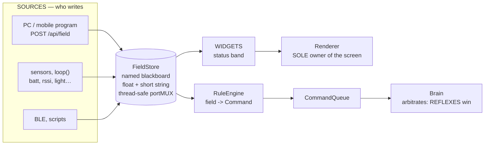

> **English** · [Français](PLUGINS.fr.md)

# PLUGINS.md — extending StackChan without recompiling

StackChan exposes **a single contract** — `sources → fields → {widgets, rules}` —
and the power comes from three ways of hooking into it, from the freest to the
safest. None of them requires flashing the firmware.

> The rendering of the **status band** (modes, displayed fields, icons, API) has
> its own reference: **`docs/reference/STATUSBAR.md`**. This document describes the
> general contract (fields, rules, widgets).

## The vocabulary (the contract)

| Element | What | Who writes | Who reads |
|---|---|---|---|
| **Field** | named value (float **or** short string) in the *blackboard* (`FieldStore`) | any source: `POST /api/field`, loop (sensors), BLE, scripts | band widgets, rule engine |
| **Command** | whitelisted mutation (`CmdType`) through the Brain's `CommandQueue` | API, touch, **rules** | the Brain (which arbitrates — reflexes take priority) |
| **Widget** | drawing of one zone of the bottom band | — | the **Renderer** (sole owner of the screen) |
| **Rule** | `field → Command` (or `→ field`) | `rules.txt` / built-in | the engine (`RuleEngine`) |

Internal fields already published: `batt chg rssi cam night mic micL micR light
dark_sleepy ip clk tmr tmr_st` (+ whatever your scripts push: `g0..g2`,
`g0l/g0r`, …). Three of them are STRINGS with no useful number behind them
(`ip`, `clk` the wall clock, `tmr` the band timer's readout); a rule reads the
float, so it watches `tmr_st` — the timer's phase as a number — and never `tmr`.
The table holds `MAX_FIELDS = 28` entries, keys of 13 characters.

The contract boils down to one shape: **nobody wires a dedicated path to the
screen or to the Brain**. You publish a field, and whatever observes it reacts.
That is what makes it possible to add a source without touching the firmware.



The details of the band's rendering (modes, priorities, icons) live in
[`STATUSBAR.md`](STATUSBAR.md), and the complete
`sources → fields → {widgets, rules}` mechanism is drawn in
[`architecture/WORKFLOWS.md §11`](../architecture/WORKFLOWS.md).

## Tier 1 — a program (**unlimited** possibilities)

Any language on any machine speaks the HTTP API. This is where the maximum
power lives (a real OS, libraries, the network), with no ESP32 constraints.

```bash
# display 3 Claude gauges
POST /api/statusbar?mode=3
POST /api/field?g0=62&g0l_s=CTX&g0r_s=stackch.&g1=41&g1l_s=5H&g1r_s=1h24
# notify
POST /api/say?text=Lave-linge%20termine&ms=6000
# react: push a field of your own that a RULE watches
POST /api/field?build=1
```

Pushers provided: `scripts/dev/statusbar-push.ps1` (generic) and
`scripts/dev/claude-statusline.ps1`, each with a `.sh` twin — the Claude
Code statusline bridge, which makes the robot live Claude's activity **without
Claude Desktop and without BLE**.

### Installing the bridge, on the three platforms

Claude Code reads `~/.claude/settings.json` on all of them; only the command
line differs. Point `STACKCHAN_IP` at the robot and add:

```jsonc
// Windows
"statusLine": { "type": "command",
  "command": "pwsh -NoProfile -File C:/path/to/scripts/dev/claude-statusline.ps1" }

// macOS and Linux  (chmod +x it once)
"statusLine": { "type": "command",
  "command": "/path/to/scripts/dev/claude-statusline.sh" }
```

| Platform | The robot's address | Needs |
|---|---|---|
| Windows | `$env:STACKCHAN_IP = '192.168.1.50'` | PowerShell 7 (`pwsh`) |
| macOS | `export STACKCHAN_IP=192.168.1.50` | `curl` (shipped), `python3` (Xcode Command Line Tools) |
| Linux | `export STACKCHAN_IP=192.168.1.50` | `curl`, `python3` |

The `.sh` twin is deliberately written to **bash 3.2**, which is the bash macOS
still ships: arrays and `printf`, no `mapfile`, no associative arrays, no
`${var,,}`. It therefore runs unchanged on both, and the same is true of
`statusbar-push.sh`.

Set `CLAUDE_CTX_WINDOW` too if your model's window is not 200 000 tokens —
see below for why that number is the one thing worth getting right.

That bridge does two jobs at once: it prints an ordinary statusline, and it
pushes the fields the rules shipped on the card read. Claude Code hands a
statusline command a JSON on stdin, and **the context is not in it** — that
schema is undocumented and no field in it announces how full the window is.
What *is* documented is `transcript_path`, so the bridge reads it: the last
entry carrying a `message.usage` gives the tokens of the latest prompt, and
their share of the window is published as `ctx`. The denominator is the weak
point, so it is made explicit: `$CLAUDE_CTX_WINDOW` first, then
`autoCompactWindow` from `~/.claude/settings.json`, then 200000. On a model with
a 1 M window the default reads 100 % for ever — setting the variable is the
answer, not a bug to diagnose.

The bridge sets `claude` to 1 **only when `ctx` could actually be computed**. A
rule such as `ctx lt 20` is TRUE while the field is absent, because an unknown
field reads 0; a bridge that announced its presence without supplying the
context would cheerfully fire the empty-window rule on every session. `claude`
therefore means "context is being delivered", which is exactly what those rules
need to gate on. The same call fills two gauges of the band: `g0` = the context,
labelled CTX with the project name on the right, and `g1` = the session cost as
a share of $5, labelled COST.

## Tier 2 — rules on SD (autonomous, **bounded, safe**)

`/stackchan-companion/rules.txt` — one rule per line, hot-reloaded by
`POST /api/rules/reload` or from the console. The robot reacts **all by
itself**, with no host powered on.

```
# enable | field | op | value | sustainMs | cooldownMs | action | a1 | a2
claude | ctx   | ge | 90 | 3000 | 60000 | SetEmotion | Scared | 4000
       | batt  | lt | 15 | 0    | 60000 | SetEmotion | Worried
       | build | ge | 1  | 0    | 5000  | PlayDance  | nod
```

`enable` is a **gate**: the rule sleeps while that field reads below 0.5, and an
empty gate means always active. The comparison is one of `gt ge lt le eq ne`
against a number, and the firing is a **held edge** — the condition must stay
true for `sustainMs`, the rule then fires ONCE and re-arms only when the
condition goes back to false, so a field parked above its threshold does not
spam the robot. `cooldownMs` is the floor between two firings of the same rule.
Actions are `SetEmotion <name> [ms]`, `PlayDance <name>`, `Blink`, `WinkLeft`,
`WinkRight`, `AmbientDark <0|1>` and `set <field> <value>` — the last one writes
back into the blackboard, which is how a rule feeds another rule or a script
polling the field.

The names those two actions take are catalogued, and both catalogues are held
against the code by `check-doc-coverage`: the expressions in
[`EMOTIONS.md`](EMOTIONS.md), the dances in
[`CHOREGRAPHIES.md`](CHOREGRAPHIES.md) §5. A name that does not exist makes the
line fail to parse, and a line that fails to parse is simply **absent** from
the loaded table — `GET /api/rules` is where you see that.

An unknown field reads 0, which is what makes the file safe to ship fully
populated: a rule written for a source you do not run simply never fires. It is
also the trap the `enable` gate exists for, since a rule phrased as "below a
threshold" is *true* on a field nobody publishes.

### The grammar, exactly

A line is **7 to 9 fields** separated by `|`; anything past the ninth is cut off
with the rest of the line. Only `field`, `op` and `action` have to carry
something — an empty `value`, `sustainMs` or `cooldownMs` reads 0, and an empty
`enable` is the "always active" gate. Below seven fields the line is not a rule
at all and is dropped; the two argument fields are what make nine, so an action
that takes none stops at the seventh and `| batt | lt | 15 | | | Blink` is a
complete rule.

Ops, action names, emotion names and dance names are **case-insensitive**.
Field names are **not**: they are compared byte for byte, on their first 13
characters — two fields that only differ past the 13th are the same field, and
`Batt` is not `batt`.

Comments are **whole-line only**: the `#` has to be the first non-blank
character. A `#` in the middle of a rule stays inside the token it lands in,
which is the opposite of the dance CSV (that one cuts at the first `#`
anywhere). The two formats are read by different parsers and neither borrows
the other's habits.

**`PlayDance` plays any dance — compiled or on the card.** The name is resolved
when the rule FIRES, against the merged list: the fifteen compiled dances first,
then `/dances/*.csv`. So `PlayDance haro_float` works with nothing but the file
on the card.

It has to be that way round rather than resolved at parse time, for two separate
reasons. At boot the rules are read BEFORE `danceStore.reload()`, so the SD bank
is empty while the file is being parsed — a name looked up then could never find
a card choreography. And `DanceStore` is DOUBLE-BANKED and reloads hot, so an
index stored at parse time would designate a different dance after an upload.
The rule therefore carries the NAME (interned in `RuleStore`'s own arena, a
stable pointer as A2.17 requires) and the app-side sink resolves it per firing.

A name that matches nothing is **said out loud** on the serial trace rather than
dropped: the rule exists, it fired, and nothing happened — which from the outside
looks exactly like a rule that never fires, the hardest shape to diagnose. Check
the spelling against `GET /api/dances/files`.

A firing suppressed by `cooldownMs` does **not** arm the rule. The condition is
still standing when the cooldown runs out, so the rule fires then, on the same
edge, without any new false→true transition. `cooldownMs` therefore reads as
"not more often than this", never as "one chance, then forget it".

Capacity is `MAX_RULES = 24` **built-ins included**, so 21 rules can come from
the card. The strings a rule needs to outlive the parse — gate, field, `set`
key, description — are copied into an arena of 2560 bytes shared by the whole
file. A full arena is not an error: the copy simply fails and the rule keeps
working with whatever it still has, which is why the description is copied LAST
of all (see below).

Nothing here logs. A line the parser refuses is **absent**, and these are the
ways to earn that: an op outside the six, an unknown emotion name, a dance name
that is not one of the 15, `set` with no key, fewer than seven fields, and a
line over 127 bytes. `GET /api/rules` is how you find out which of your lines
made it.

### Where a rule's description comes from

The format has no description field, and adding one would break every file
already written — but people explain their rules in a comment above them
anyway, so that is where the description is read from. The comment lines
immediately above a rule are **accumulated** and joined with spaces, so a
sentence wrapped over two `#` lines is one description. A blank line **or a
bare `#`** empties the buffer, which is what keeps the file's twenty-line format
header from being attached to the first rule below it. The result is capped at
96 bytes, cut back to a word boundary and ended with `…` rather than mid-word.

It is interned **last**, deliberately: the arena is finite, and a rule that lost
its description still works while a rule that lost its field name does not.
Taking the description first would let a wordy file break the rules it
describes.

The description is served as `d` and shown as the last column of the console's
rule table — the only place where "why is this rule here" survives the trip
from the card to the browser.

**The template is written by the firmware**, not shipped on the card:
`RuleStore::writeDefaultIfAbsent` creates `rules.txt` at boot when the card has
none or the file is empty, so the format documents itself on the very card the
user is about to edit. `sdcard/stackchan-companion/rules.txt.example` is a mirror of
that literal, held byte for byte by `scripts/gates/check-mirrors.py` (entry
"rules.txt template") — the template is the only description of the syntax most
users will ever read, so a copy that drifts teaches a grammar the parser sitting
a few lines below it rejects. The same gate refuses any template line over
**126 bytes**: `RuleStore::load` reads into a `char line[128]` and DISCARDS an
over-long line whole rather than truncating it (a truncated head would parse,
and the tail would come back as a second, invented rule), so an over-long
comment would silently vanish from the file being read to learn the format, and
an over-long rule would silently never load.

The template ships **four active rules for the Claude context gauge**, all gated
on `claude` and therefore inert until the statusline bridge of Tier 1 is
installed: a first warning at 75 % of the window, a real reaction at 90 %, a
head shake at 97 % (once every five minutes), and a contented face below 20 %,
held ten seconds so a compaction landing mid-answer does not read as
celebration. Everything else in the file is commented out and there to be
copied.

Reading back what was actually loaded is a separate endpoint, `GET /api/rules`,
because `POST /api/rules/reload` answers 202 and says nothing about the outcome:
a line that fails to parse is simply **absent** — no error, no log — and the
only symptom is a robot that does not react. The reply is
`{"builtins":N,"rules":[{en,f,op,v,sus,cd,act,on,sd},…]}`, where `on` says the
rule's gate is satisfied right now and `sd` says it came from the card rather
than being compiled in (`builtins` counts the compiled-in ones, the three
`dark_sleepy` night rules; the table holds 24 rules at most). `on` is answered
by the engine itself rather than recomputed from a copy of the field, so a
listing can never disagree with the thing that evaluates. The console renders
that reply as a table under **Pilot › Rules**, greying the rules whose gate is
closed — a section of its own rather than a corner of the status-band panel,
since a rule watches a field and posts a command, and the band is at most one of
the things it may end up changing.

**Safety**: a rule can only post whitelisted Commands — it cannot draw outside
the Renderer and cannot brick the robot; the **reflexes**
(shake→Scared, lift→Curious) stay TOP PRIORITY (rule A2.5).

## Tier 3 — a guest `.bin` (**total**, coarse)

The SD launcher (`/api/bins/launch`, `docs/guests/README.md`) runs an arbitrary
firmware — a complete takeover. For "I'm replacing everything".

## BLE — control channel #2 (planned)

A **second front-end** on the same contract as the HTTP API: a BLE server
(Nordic UART Service, UUID `6e400001…`) receiving text command lines
(`e <emotion> [ms]`, `d <dance>`/`d stop`, `b`/`wl`/`wr`, `f <key>=<val>`,
`s <text>`, `sb <0..3>`) → CommandQueue / FieldStore / `setSay`. Useful when
WiFi is weak or absent (driving it from a phone, e.g. nRF Connect). Same reflex
priorities, no screen writes outside the Renderer.

**Status**: not enabled. BLE + WiFi coexistence requires a **deferred** init at
≥ 20 s of uptime (rule A2.20: a web window to disable the persisted option) and
a coexistence configuration (sdkconfig) to be validated on hardware.

## Adding a widget *type* (firmware contribution)

The 4 band modes (none/debug/vu/gauges) are built in
(`Renderer::drawStatusBand`). A brand-new drawing = a PR: one more case in the
dispatch. Everything else (data, layouts, reactions) is already opened up by
the contract above.

## The code

| File | Role |
|---|---|
| `engine/FieldStore.h` | blackboard (fields), thread-safe, pure |
| `behavior/Command.h` | `CmdType`/`Command` (the mutation channel, pure) |
| `behavior/RuleEngine.h` | `field→Command` rules, pure, tested |
| `app/RuleStore.h` | rule parser, SD loader, and the default template |
| `app/WebApi.h` | `GET /api/rules` (what is loaded), `POST /api/rules/reload` |
| `scripts/dev/claude-statusline.ps1` (+ `.sh`) | Claude Code bridge: `claude`, `ctx`, `g0`, `g1` |
| `engine/Renderer.h` | `drawStatusBand` (widgets), `setSay` |
