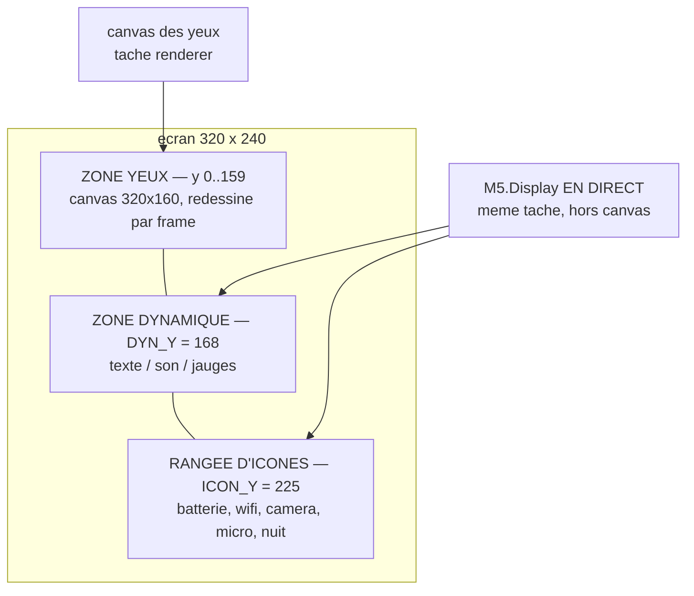
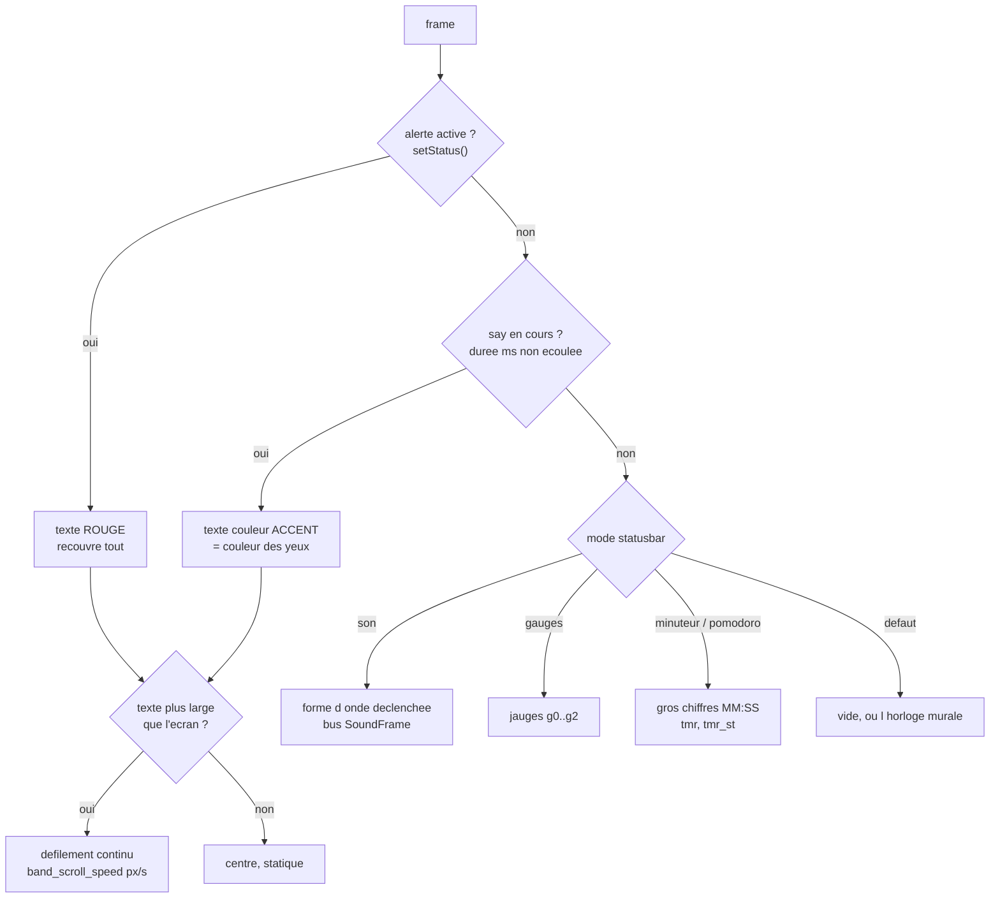

> [English](STATUSBAR.md) · **Français** — l'anglais est la version de référence.
> Ce fichier peut être en retard d'une mise à jour : en cas de divergence, l'anglais fait foi.

# STATUSBAR.md — Bande de statut

Documentation dédiée de la **bande de statut** (bas d'écran, `y 160..240`) :
layout, modes, champs lus, API, et exemples. Le contrat plugins qui l'alimente
est décrit dans `docs/reference/PLUGINS.md` ; ce document se concentre sur *l'affichage*.

## 1. Vue d'ensemble

La zone yeux occupe `320×160` (`y 0..159`) ; les **80 px du bas** (`y 160..239`)
sont la bande de statut. Elle est dessinée **EN DIRECT sur `M5.Display`**, dans
la tâche renderer (règle A2.1 : une seule tâche touche l'écran) — indépendante
du canvas des yeux, donc jamais recouverte par une frame d'émotion.

Deux régions :

| Région | Y | Contenu |
|---|---|---|
| **Zone dynamique** | `DYN_Y = 168` (haut) | texte / son / jauges (selon le mode) |
| **Rangée d'icônes** | `ICON_Y = 225` (bas) | batterie, wifi, caméra, micro, nuit |

Constantes : `Renderer.h` (`BAND_TOP=160`, `DYN_Y=168`, `ICON_Y=225`).



Les deux régions du bas sont dessinées **en direct sur `M5.Display`**,
jamais sur le canvas des yeux : c'est ce qui les rend indépendantes de la
frame d'émotion en cours.

**Change-detection par région** : en régime stable, rien n'est redessiné (le
texte, les icônes et les jauges comparent une signature/valeur avant de
repeindre). Coût quasi nul par frame. Seul le **visualiseur son** repeint, et seulement les lamelles
en place à chaque frame (allumé/éteint, pas de `fillRect`).

## 2. Les modes de la zone dynamique

Enum `StatusBarMode` (`Renderer.h`), sélectionné par `POST /api/statusbar?mode=`.
Le mode est **persisté** (tuning `band_mode`) : il **survit au reboot** (utile
p.ex. pour laisser la bande en mode jauges alimentée par un script PC). Défaut
sortie d'usine : `0` (aucune).

**Geste tactile** : un **swipe horizontal dans la zone de la bande** (y ≥ 160,
que la bande soit affichée ou non) fait défiler les modes — gauche = suivant,
droite = précédent (`0 → 2 → 3 → 4 → 5 → 0`). Le nouveau mode est appliqué par
loop() (seul applicateur, qui **valide** aussi la valeur : un `band_mode`
inconnu — un `1` resté dans une vieille config, par exemple — est ramené à
`0`) et persisté de façon **coalescée** (~2 s après le dernier changement : une
rafale de swipes = une seule écriture SD). Les swipes L/R au-dessus de la bande
(zone des yeux) défilent les émotions ; un tap de bande ne déclenche jamais de
wink (réservé à la zone des yeux, `TouchGestures::tapZoneMaxY`). **Un swipe
vertical dans la zone de la bande veut dire ce que le mode affiché en fait** —
le visualiseur son fait défiler ses trois habillages (§6) et le minuteur règle
ses chiffres (§2b) — et reste inerte partout ailleurs, pomodoro compris : pas
de danse aléatoire ni de launcher sur un geste un peu diagonal. **Le tap de
bande**, lui, appartient aux seuls modes minuteur, et dans le pomodoro il veut
dire deux choses selon la moitié de la mise en page où il tombe (§2b).

| Mode | Val | Affichage | Champs lus |
|---|---|---|---|
| `BAND_OFF` | `0` | **Défaut** : noir, ou l'horloge murale (`band_clock`) | `clk` |
| `BAND_SOUND` | `2` | le visualiseur son : trois styles sur les micros stéréo, vide au repos | bus `SoundFrame` |
| `BAND_GAUGES` | `3` | 3 jauges horizontales | `g0..g2` + labels |
| `BAND_TIMER` | `4` | minuteur, gros chiffres | `tmr`, `tmr_st` |
| `BAND_POMO` | `5` | pomodoro `cycle/total MM:SS` | `tmr`, `tmr_st` |

> La valeur `1` n'est pas un mode de zone dynamique : les infos `émotion · ip`
> sont une **option indépendante** (`band_debug`) affichée **centrée
> dans la rangée d'icônes** (§7). Elles
> coexistent donc avec n'importe quel mode.

> **Option `band_clock`** : le mode 0 — **Défaut** dans la console, puisqu'il
> n'est pas forcément vide — peut montrer l'horloge
> murale : `HH:MM` gris à la même taille pleine que le minuteur (qui porte
> un **sablier** pixel-art à sa gauche précisément pour que les deux
> visages ne se confondent pas), vide tant que NTP n'a pas parlé. Le robot
> ne connaît que l'UTC (sa nuit est pilotée par le soleil, à dessein),
> donc l'affichage a son propre `tz_offset_h` (curseur console, ±14 h, pas d'un quart d'heure) —
> affichage seulement.

Le mode est extensible : ajouter un `case` dans `drawStatusBand` = un nouveau
type de widget (contribution firmware, cf. `docs/reference/PLUGINS.md`).

## 2b. Minuteur et pomodoro (modes 4 / 5)

Les machines à états vivent dans `engine/BandTimer.h` — **pures**, Clock
injectée, testées nativement (`test_bandtimer`, 8 cas). loop() possède
l'instance unique : le tactile la nourrit, loop la tique et publie son
affichage par le même tableau noir FieldStore que les autres widgets
(`tmr` = texte composé, `tmr_st` = état de couleur), et ses **événements
deviennent des émotions** par la CommandQueue — des posts ordinaires, donc
la règle réflexe (A2.5) préempte toujours un visage d'alarme.

**Minuteur (mode 4)** — un compte à rebours réglé sur la bande elle-même,
**motif réveil au tap** :

- le visage lit **MM:SS, minutes jusqu'à 99** — un format, un sens, les
  secondes toujours visibles — taille 4 pleine, avec un **sablier**
  pixel-art à sa gauche teinté de la couleur d'état : l'horloge murale
  partage le même grand visage et l'icône est ce qui les distingue.
- quand il est **éditable** (arrêt ou pause) : **maintenir et glisser pour
  DÉFILER** — moitié gauche = **minutes** (enroule 0↔99), moitié droite =
  **secondes** (0↔59), une unité par 20 px, en direct (la valeur suit le
  doigt ; glisser vers le haut augmente, et le doigt peut sortir de la
  bande vers le haut pour les grandes courses — l'aiguillage se fait sur
  le départ du geste). Un flick rapide fait ±1, et les taps du motif
  réveil marchent toujours (tiers gauche/droit, au-dessus des chiffres =
  +1, en dessous = −1, centre = l'action primaire). Un compte *en course*
  n'est pas éditable (un frôlement accidentel ne doit pas changer en
  silence un minuteur armé) ; le mettre en pause d'abord.
- un **maintien immobile de 0,7-3 s** relâché sur place = **remise à
  zéro**, depuis n'importe quelle phase : le compte se vide, le réglage
  survit. Le plafond de 3 s et le test d'immobilité préservent l'avalement
  pouce-posé/robot-transporté — ceux-là tiennent plus longtemps ou
  dérivent. (Remet aussi le pomodoro au cycle 1.)
- le **tap central** = l'action primaire de la phase courante :
  arrêt→démarrage (si une durée est réglée — 00:00 ne s'arme pas),
  course→pause (le reste est **gelé**, pas ré-ancré sur l'horloge),
  pause→reprise, sonnerie→acquittement (la durée réglée est restaurée pour
  resservir). En course ou en sonnerie, la **bande entière** est l'action
  primaire : une alarme doit s'arrêter au premier tap, pas au tap bien
  visé.
- affichage : `MM:SS` dans toutes les phases — la valeur réglée à l'arrêt,
  le reste en course ou en pause. Un compte qui n'avancerait qu'à la minute
  se lirait comme une panne, donc les secondes sont toujours à l'écran.
  Couleurs : gris = arrêt, couleur des yeux = en course, ambre = pause,
  **rouge clignotant** = sonnerie.
- **alarme** : à zéro la bande fait clignoter `00:00` et le robot tire
  **Excited** (les yeux étoiles — le visage d'alarme) pendant 10 s. La
  sonnerie dure jusqu'au tap d'acquittement.

**Pomodoro (mode 5)** — `cycle/total MM:SS` dans les mêmes gros chiffres :

- **taper N'IMPORTE OÙ = l'action principale** : démarrer / mettre en pause /
  reprendre / acquitter. Ce qu'on fait plusieurs fois par session ne doit rien
  demander à viser — c'est la règle que l'alarme a toujours eue (elle doit
  s'arrêter au premier tap, pas à un tap bien ajusté).
- **taper l'icône de phase** (à gauche des chiffres) **= sauter la phase en
  cours** — « ce bloc est fini plus tôt », « je ne veux pas de cette pause ».
  Elle emprunte la MÊME transition que l'expiration : un bloc sauté fait
  avancer le cycle, respecte la règle du dernier bloc et lève le même
  événement. Une petite cible délibérée est juste ici pour la raison qui la
  rendait fausse pour démarrer/mettre en pause : c'est sauter par accident qui
  coûte. Inerte hors d'une phase en course.
- **maintien (0,7-3 s) = remise à zéro**, inchangé.
- **glissement haut/bas, à l'arrêt seulement, fait défiler la FORME.** Classées
  par fréquence, démarrer/mettre en pause revient plusieurs fois par session et
  la forme une fois par quinzaine : le geste délibéré va donc au geste rare,
  qui ne peut plus déranger une session en cours. La console reste son vrai
  foyer.
- **une barre de progression** sous les chiffres (y206-222, la seule bande de
  pixels inutilisée) dit OÙ l'on en est, ce à quoi le temps restant répond
  mal. Couleur de la phase ; vide pour les phases sans durée.
- **les quatre formes** — 25/5×4, 50/10×3, 90/20×2, 15/3×4 — écrivent les
  trois clés de tuning (`pomo_work_min`, `pomo_break_min`, `pomo_cycles` ;
  bornées 1-120 / 1-60 / 1-8 dans la machine, curseurs dans la console) et
  sont persistées. À l'arrêt la bande affiche `1/N MM:00` : les deux nombres
  qui bougent SONT le retour, aucune étiquette n'est nécessaire.
  **Seulement entre deux sessions** (arrêt ou fin) : un pomodoro en course
  n'est pas reformé par un frôlement — c'est le même verrou d'édition que le
  compte à rebours — et pendant une session TOUTE la bande est
  départ/pause. Un réglage qui ne correspond à aucune forme (saisi dans la
  console) tombe sur la première.
- **la limite bouge avec le texte**, et le peintre comme le routage tactile
  la prennent dans `units::bandTextX0()` (Units.h §7) : les chiffres sont
  centrés, donc `1/4 25:00` et `1/4 120:00` ne mettent pas l'icône au même
  endroit. Tout ce qui est à gauche du premier chiffre EST l'icône — c'est
  toute la marge gauche qui est la cible, pas la vignette de 18 px.
- **émotions aux transitions** : bloc de travail → **Focused**, hydratation →
  **Curious**, pause → **Happy**, fin du dernier bloc de travail → **Glee**
  (pas de pause orpheline après le dernier bloc — des devoirs après la
  sonnerie). Vert = pause/fini.
- **hydratation** (`pomo_hydra_min`, 1 min, 0 = arrêt, max 15) : une invite à
  boire glissée **entre un bloc de travail et sa pause**. Le placement est
  tout le propos — une invite au *début* de la pause est une invite qu'on
  suit en se levant ; fondue dans la pause elle n'est qu'une étiquette,
  placée après elle coupe le retour au travail. C'est un **préfixe** de la
  pause et non une tranche prise dessus : la pause qui suit est la pause
  réglée, entière, sinon activer le rappel ferait payer le fait de boire. Le
  dernier bloc n'en a pas (la session est finie), et `0` restitue
  *exactement* l'ancienne machine — le même contrat « arrêt = l'ancien
  comportement, octet pour octet » que la profondeur des barres LED. Vérifié
  par `test_bandtimer`.

### Les icônes de phase

Chaque phase porte une vignette pixel-art de 18×24 à gauche des chiffres,
teintée de la couleur d'état :

| phase | icône | |
|---|---|---|
| Run / Idle / Paused | ⧗ sablier | un compte à rebours, l'originale |
| Work | cerveau | le bloc où l'on réfléchit |
| Hydrate | goutte d'eau | boire |
| Break | tasse | repos |
| Ring | cloche | la sonnerie, clignotant avec les chiffres |
| Done | drapeau | la session est finie |

**Les six sortent d'UN SEUL point d'appel de dessin** (A2.22) : les glyphes
sont des données, et une unique boucle imbriquée tamponne la table que la
phase désigne. Écrites de la façon évidente — une chaîne de `if` avec une
petite boucle chacune — ce seraient six corps `fillRect` semblables dans une
même fonction, que GCC 8.4 Xtensa a le droit d'élaguer ; le symptôme serait
une phase dont l'icône n'apparaîtrait jamais, en silence. `check-a222.py`
épingle `drawBandClock` à exactement deux points d'appel `fillRect` (le fond
opaque, puis le tampon) : une septième phase doit être une nouvelle table et
non une nouvelle boucle.

Le renderer choisit l'icône d'après **`tmr_ph`**, un champ publié À CÔTÉ de
`tmr_st` et non déduit de lui : `tmr_st` est un code de *couleur*, et pause,
hydratation et fini partagent le vert. Déduire l'icône de la couleur
donnerait le même dessin à l'invite à boire et à la pause, ce qui est
précisément ce que les icônes existent pour éviter.

### Une danse à la sonnerie

`timer_dance` (0 = aucune, sinon l'indice 1-based dans `/api/dances`) joue une
danse quand un compte à rebours **se termine** — `Ring` pour le minuteur,
`AllDone` pour le pomodoro — et jamais à un changement de phase : travail,
hydratation et pause reviennent toutes les quelques minutes, et un robot qui
se lève aussi souvent est un robot qu'on débranche. La console remplit son
sélecteur depuis le même `fetch /api/dances` qui dessine les boutons de
danse : la liste ne peut donc pas diverger de celle du robot.

## 3. Priorité de la zone dynamique

À chaque frame, la zone dynamique choisit quoi afficher, par ordre de priorité :



- **Alerte** : posée par le firmware via `setStatus()` (ex. « BATTERIE FAIBLE
  15% » quand `batt ≤ 15` et pas en charge). Rouge, recouvre tout tant qu'elle
  tient.

### Piloter le minuteur depuis la console ou l'API

Tout ce que le doigt fait sur le bandeau a un point d'entrée, si bien qu'un
minuteur s'arme depuis un téléphone ou un script aussi bien que depuis le
robot :

```bash
curl -X POST "http://<ip>/api/timer?action=set&m=25&s=0"          # durée
curl -X POST "http://<ip>/api/timer?action=set&m=10&s=0&start=1"  # et go
curl -X POST "http://<ip>/api/timer?action=tap"                   # départ / pause / acquittement
curl -X POST "http://<ip>/api/timer?action=reset"                 # retour à l'arrêt
```

`start=1` règle ET démarre en UNE requête, ce qui relève de la justesse et non
du confort : le firmware ne tient qu'un emplacement de commande, donc deux
appels de suite pourraient voir le second écraser le premier avant que
`loop()` ne l'ait vidé. C'est ce qu'envoient les boutons de départ rapide de la
console (5, 7, 10, 15 min), et il remet à zéro d'abord — presser « 10 min » est
une intention explicite, pas le frôlement contre lequel le verrou d'édition
protège un compte en cours.

`m` est borné à 0-99 et `s` à 0-59 — les mêmes bornes que le geste du
bandeau, définies une fois et non deux. `set` passe par
`addMinutes`/`addSeconds` comme le geste, donc il obéit au même verrou
d'édition : un compte **en cours** n'est pas réécrit en silence, il faut le
mettre en pause d'abord.

Les panneaux Minuteur et Pomodoro de la console sont ces trois appels, plus —
pour le pomodoro — les trois curseurs de durée (`pomo_work_min`,
`pomo_break_min`, `pomo_cycles`). Changer une durée réarme le bloc SUIVANT ;
cela ne coupe pas celui en cours.

**Note A2.6** : le gestionnaire HTTP écrit une commande dans un emplacement
unique et rien d'autre. `BandTimer` appartient à `loop()`, et une tâche
AsyncTCP qui ferait avancer une machine à états que `loop()` fait avancer
aussi est exactement la course que cette règle interdit.

### Le format de l'horloge

`clock_24h` (interrupteur console, mode Défaut uniquement) : 24 h, ou 12 h
avec un suffixe `a`/`p`. Minuit et midi valent tous deux « 12 » dans ce
format — le premier est `12:00a`, le second `12:00p`.

- **Say** : notification éphémère `POST /api/say?text=…&ms=…` (couleur accent =
  couleur des yeux). Recouvre le mode pendant `ms`, puis rend la main.
- **Mode** : son / jauges / off selon `statusbar` (le debug n'est pas un mode).

**Texte long → défilement (marquee)** : si le texte (say ou alerte) dépasse la
largeur de l'écran, il **défile** de droite à gauche en boucle continue
(vitesse `band_scroll_speed` px/s, réglable) ; sinon il est centré et statique.
Le texte est stocké sur **160 caractères** (pas de troncature) ; taille réglable
(`band_text_size`, 1..3). La zone est **purgée avant ET après** l'affichage
(clear au changement / à l'expiration) → aucun résidu de texte. Depuis la
console, la notification dure `max(4 s, longueur × 250 ms)` pour laisser le
temps de tout lire.

## 4. Le blackboard (source unique)

Tout ce qu'affiche la bande vient du **`FieldStore`** (`engine/FieldStore.h`) :
un magasin de champs nommés `{ float, chaîne courte }`, thread-safe (portMUX),
lu par le renderer, écrit par *n'importe quelle source*. Personne ne câble de
chemin dédié vers l'écran — on **pose un champ**, le widget le lit.

Limites : `MAX_FIELDS = 28`, clé ≤ 13 car., chaîne ≤ 23 car.

### Champs poussés automatiquement par le firmware (`main.cpp`)

Deux rythmes, et le partage n'est pas arbitraire : **ce qu'un widget dessine
part à chaque passe**, pour que l'image ne traîne jamais derrière le doigt ou
le son, tandis que ce qu'un humain lit part à **1 Hz**, parce qu'interroger le
PMIC ou la radio trente fois par seconde n'apporte rien et coûte une
transaction I2C.

| Champ | Type | Cadence | Sens |
|---|---|---|---|
| `batt` | float | 1 Hz | niveau batterie 0..100 (−1 = inconnu) |
| `chg` | 0/1 | 1 Hz | en charge |
| `rssi` | float | 1 Hz | RSSI WiFi dBm (0 en AP/déconnecté) |
| `cam` | 0/1 | 1 Hz | caméra active (`tuning.camera`) |
| `night` | 0/1 | 1 Hz | mode nuit (roulette) |
| `mic` | 0/1 | 1 Hz | micro actif |
| `ip` | chaîne | 1 Hz | IP courante (mode debug) |
| `clk` | float | 1 Hz | horloge murale, ce que dessine `band_clock` du mode Défaut |
| `micL`, `micR` | float 0..1 | chaque passe | niveau audio gauche/droite, enveloppe attaque/relachement appliquee a la source — telemetrie seule (`/api/status`, console) ; le visualiseur a son propre bus |
| `light` | float | chaque passe | lumière ambiante 0..100 (seulement si un LTR-553 a répondu) |
| `dark_sleepy` | 0/1 | chaque passe | option « sommeil dans le noir » |
| `tmr`, `tmr_st` | chaîne, float | chaque passe, modes 4/5 seuls | le texte composé du décompte et son état de couleur — postés uniquement tant qu'un mode minuteur est affiché, puisque rien d'autre ne les lit |

### Champs posés par les sources externes (widgets jauges, etc.)

Voir §5. Toute source : `POST /api/field`, un script PC, Home Assistant, une
règle SD (`set …`), un futur canal BLE.

## 5. Mode jauges (`g0..g2`)

Trois lignes de jauge, indexées `0..2`. Chaque jauge lit **3 champs** :

| Champ | Rôle | Ex. |
|---|---|---|
| `g<n>` | pourcentage `0..100` (< 0 ⇒ slot vide, non dessiné) | `g0=62` |
| `g<n>l` | label gauche (≤ 7 car.) | `g0l=CTX` |
| `g<n>r` | texte droite (eta/légende, ≤ 15 car.) | `g0r=1h24` |

Couleur de barre par seuil : `≥85 %` rouge, `≥70 %` ambre, sinon une **base
propre à chaque jauge** (g0 cyan, g1 indigo, g2 vert) — **indépendante de la
couleur des yeux**. Le `_s`
force la chaîne si la valeur ressemble à un nombre (ex. `g0r_s=1h24`). Redessin
throttlé à 200 ms et seulement si une valeur change.

Exemple — trois jauges « quota » :

```bash
curl -X POST "http://<ip>/api/field?g0=62&g0l=CTX&g0r_s=ctx&g1=30&g1l=5h&g1r_s=2h10&g2=48&g2l=WEEK&g2r_s=3j"
curl -X POST "http://<ip>/api/statusbar?mode=3"
```

## 6. Mode son (`band_sound`)

**Un visualiseur, pas un vu-mètre.** Le mode `2` montre ce que les deux micros
ont réellement capté : un **oscilloscope déclenché**, habillé de trois façons.
Un bargraphe nourri par une texture générée bougerait de façon convaincante et
ne dirait rien — toutes les barres bougent de toute façon, donc rien à l'écran
ne trahirait le mensonge.

**Les deux micros, et aucune symétrie forcée.** Le robot a un micro gauche et un
micro droit. Refléter un seul niveau autour d'un axe central dessine deux fois le
même nombre ; ici les deux canaux sont deux signaux : `wave` en trace deux
courbes, et les deux habillages en barres prennent le plus fort des deux par
colonne, parce qu'une silhouette n'a qu'une hauteur et qu'un mélange laisserait
un canal se cacher dans l'autre. Ce qu'un canal fait, il le fait seul.

### D'où viennent les nombres

L'analyse tourne dans `loop()`, dans la passe qui consomme déjà un bloc micro
(`SoundTracker` → `SoundViz`), et jamais sur la tâche de rendu : A2.15 place tout
le lissage du côté producteur, et A2.22 ne laisse pas de place sur une frame que
les yeux ont déjà à moitié dépensée.

```
M5.Mic.record ──► SoundTracker ──► SoundViz ──► TripleBuffer<SoundFrame> ──► Renderer
  512 trames        (loop, 100 Hz)   (FFT +          (un producteur,           (peint
  stéréo 16 kHz                       enveloppes)     un consommateur)          les deltas)
```

| Étape | Ce qui se passe |
|---|---|
| **Désentrelacement** | l'échantillon `2i` est le micro **droit**, `2i+1` le gauche — validé matériel, et l'ordre que lit `SoundDirection`. À l'envers, tout l'affichage est en miroir et rien dans l'image ne le dit |
| **Trace** | prise sur les échantillons **bruts**, avant que la transformation ne les consomme |
| **Transformation** | une seule FFT complexe de 512 points rend les **deux** canaux : le spectre d'un signal réel est à symétrie conjuguée, donc le gauche part dans la partie réelle, le droit dans l'imaginaire, et les deux se séparent exactement après coup |
| **Moyenne, puis fenêtre** | la moyenne est retirée **avant** la fenêtre de Hann, pas après. Une fenêtre a un spectre à elle, donc une constante multipliée par elle atterrit en cases 1 et 2 autant qu'en case 0 — annuler la case 0 laisse deux barres fantômes plantées sous tout le reste |
| **Bandes** | 16 bandes logarithmiques de 60 Hz à 7 kHz, chacune valant le **pic** de ses cases. La moyenne noierait un ton seul dans une bande large |
| **Échelle** | décibels sur 48 dB de dynamique. En linéaire, la parole reste collée au sol |
| **Enveloppe** | asymétrique — attaque 0,55, relâchement 0,14. Un filtre symétrique arrondit l'attaque, qui est précisément la partie d'un son que l'œil lit |
| **Enveloppe de la trace** | une valeur par colonne d'affichage (`env`), l'échantillon le plus fort du groupe en prenant le micro le plus fort. C'est ce que dessinent les habillages `columns` et `matrix` — la même forme d'onde que `wave`, quantifiée |
| **Maintien de crête** | montée instantanée, puis chute lente et constante — environ trois secondes depuis la pleine échelle. Il y en a deux : un sur les bandes (`peak`, calculé et publié, que rien ne dessine aujourd'hui) et un sur l'enveloppe (`envPeak`, le témoin de matrix). Ce sont les seules parties de l'affichage qui aient une mémoire, et c'est précisément pour cela qu'elles vivent du côté producteur (A2.15) |
| **Sensibilité** | `band_sound_gain` (0,1–16, défaut 1) multiplie les échantillons **avant** tout ce qui précède, donc la trace, l'enveloppe et les bandes montent ensemble — un seul bouton, et rien en aval ne peut être en désaccord sur le niveau de la pièce |

Une trentaine de blocs par seconde, une transformation chacun. `engine/Fft.h` est
**pur** et porte une suite native (`test_fft`) : une sinusoïde tombe dans sa case
et nulle part ailleurs, le continu disparaît partout, un canal reste muet pendant
que l'autre sature.

**La trace est déclenchée**, sur un passage par zéro montant cherché dans la
première moitié du bloc, et tracée sur une **fenêtre fixe** de 256 échantillons
à partir de là. Le déclenchement seul ne suffit pas : tracer ce qui reste après
lui fait dépendre la base de temps de l'endroit où il est tombé, donc le même
ton ressort étiré de quelques pour cent d'un bloc à l'autre et l'image respire
horizontalement au lieu de tenir en place. Déclenchement plus fenêtre fixe : un
pixel vaut toujours le même nombre de microsecondes. La décimation vers les 160
colonnes prend le plus proche voisin, jamais une moyenne : moyenner transforme un
signal carré en sinusoïde, la seule chose qu'un oscilloscope ne doit pas faire.

### Trois styles, une seule forme d'onde

Les trois styles sont des **habillages de la même image** : la fenêtre
déclenchée de 256 échantillons, le temps en largeur, vêtue en courbe, en traits
fins ou en blocs — ce que montraient les trois images de référence. Changer de
style ne change jamais ce qui est dit, seulement l'habit. Le SPECTRE par bandes
reste calculé et publié dans `SoundFrame` — rien ne le dessine aujourd'hui ;
c'est la nourriture de la bouche de l'assistant (ROADMAP §8).

| `band_sound` | Style | Ce que c'est | Géométrie |
|---|---|---|---|
| `0` | **Wave** | deux courbes continues, une par micro, un pixel par colonne. Chaque segment va de son propre échantillon à la colonne suivante et les colonnes se touchent, donc ils se rejoignent en une polyligne comme le ferait une courbe tracée. **L'encre suit l'agitation** : quasi noire au repos, elle blanchit le long de la palette quand la courbe bouge | 160 colonnes × 2 px = **320 px, bord à bord** |
| `1` | **Columns** | la même fenêtre en traits : chaque colonne est l'**enveloppe** de ses cinq échantillons (le plus fort des deux micros — une silhouette n'a qu'une hauteur), déployée des deux côtés de l'axe. **Monochrome** — tous les traits du même cyan | 32 traits au pas de 10 px, 3 px de large — **pleine largeur** |
| `2` | **Matrix** | la même enveloppe quantifiée en piles de **blocs carrés**, les extérieurs plus clairs, avec un témoin de crête détaché au-delà de chaque extrémité, **coloré par sa propre hauteur** — sur la palette près de l'axe, blanc au bord de la zone. Un niveau non nul allume toujours **au moins un bloc** : la quantification gouverne le niveau, jamais la présence de son | 32 piles au pas de 10 px, blocs de 3 × 3 px au pas de 4 px, une couture d'une ligne sur l'axe — **pleine largeur** |

**Plus de disposition en miroir.** L'ère spectre mettait un canal par moitié,
graves vers l'extérieur, et les deux spectres quasi identiques d'une pièce
normale faisaient lire l'affichage comme un ornement symétrique. Un habillage de
la forme d'onde n'a pas de moitiés : la largeur est le temps, et la forme est
celle du signal.

| | |
|---|---|
| Zone | lignes 163..215 — le bandeau, et non les quarante lignes de la mise en page du texte qu'il empruntait. Les marges sont volontairement **inégales** : trois lignes sous les yeux, dix au-dessus de la rangée d'icônes, parce qu'une barre à pleine échelle qui s'arrête deux lignes sous une ligne de petits glyphes se lisait comme la touchant |
| Axe | ligne 189, le **milieu** de la zone : tous les styles croissent des deux côtés, et un axe décentré donnerait plus de place vers le bas que vers le haut, si bien qu'un affichage à pleine échelle serait visiblement bancal |
| Amplitude | **23 px** de chaque côté, la même pour les trois styles — trois habillages d'une seule forme d'onde doivent s'accorder sur la hauteur de la pleine échelle |
| Pourquoi 23 et pas 26 | la zone en permet 26, mais la marque la plus extérieure de matrix est le bloc de crête en `k = HALF/4`, dont les lignes sont `CY ∓ 4·(HALF/4) ∓ 3` ; ces lignes ne sont dans la zone que si la demi-hauteur est de la forme 4m+3. À 26, le bloc de crête d'une colonne à pleine échelle sortirait de trois lignes et `mSeg` le rognerait en silence. Trois `static_assert` le vérifient à la compilation |
| Alimenté par | `TripleBuffer<SoundFrame>` — 160 colonnes de trace par canal, 32 colonnes d'enveloppe avec leur maintien de crête, 16 bandes par canal |
| Sélection | `POST /api/statusbar?mode=2`, puis `POST /api/tuning?band_sound=0\|1\|2` |
| Coût | mesuré sur cible, la frame entière — yeux compris — tourne entre 4 et 10 ms de moyenne selon les styles, pour un budget de 33 ms. Le chiffre est celui de la frame, pas du bandeau : l'animation des yeux du moment le fait varier davantage que le choix du style |

**Rien n'est dessiné sous le visualiseur, et rien au repos.** Aucune ligne de
base posée, aucun trait central : le silence dessine le silence. Une seconde
chose qui affirme l'état de repos à côté des données qui le dessinent déjà, ce
sont deux sources pour un même fait, et c'est ainsi qu'elles finissent par se
contredire.

**Quand le micro n'écoute pas, la bande le dit** plutôt que de dessiner un
silence qu'elle n'a jamais mesuré. Le bus I2S partagé appartient au haut-parleur
pendant qu'il joue (A2.20), le micro reste éteint les 20 premières secondes
d'uptime, et il reste éteint tout court tant que `mic_enable` vaut `0` — **ce
qui est le défaut**. Dans les trois cas le producteur publie une trame marquée
non-vivante et la bande affiche *micro au repos*. Le visualiseur a donc une
condition préalable que le sélecteur de mode ne sait pas exprimer : **activer le
micro**, sans quoi les trois styles n'ont rien à dessiner.

**La console dit lequel des trois cas c'est, et propose le remède.** Le panneau
Son porte une ligne d'état du micro, alimentée par le même état `mic` que la
pastille de télémétrie affiche — *éteint*, *préchauffage* avec les secondes
restantes (`micWait`), *en veille* tant que le haut-parleur tient le bus I2S
partagé, ou *actif*. Un **bouton d'activation** n'apparaît que dans le cas
*éteint* et poste `mic_enable=1` ; dans les trois autres il n'y a rien à
presser, parce que rien ne va mal — le décompte se termine seul et le
haut-parleur rend le bus. Une bande vide est autrement indiscernable d'une
pièce silencieuse, et l'utilisateur qui ne peut pas distinguer les deux conclut
que la fonction est cassée. (Activer le *suivi du son* allume aussi le micro :
suivre sans micro n'est pas un état qu'il vaut la peine de pouvoir choisir.)

**Les trois sont dessinés dans la rampe propre au companion : cyan → indigo.**
C'est le dégradé que balaient déjà le launcher, le lobby, l'écran de flash et la
console web (`--acc-grad`, `L_ACC`/`L_ACC2`), pour que la bande ressemble à ce à
quoi elle appartient. Ce n'est délibérément **pas** la couleur des yeux : cette
règle gouverne ce que porte le *visage* (A2.17, les LEDs suivent `eyeColorRgb`),
et ce widget est du chrome. La saturation se dit en **pâlissant**, vers la
couleur de texte de la console, plutôt qu'en empruntant un ambre à une autre
palette.

**Les trois s'accordent sur la présence et sur la pleine échelle ; ils
diffèrent par ce qu'ils résument.** Donnez le même bloc aux trois et la colonne
la plus haute a la même hauteur dans chacun — mesuré, pas supposé. Mais `wave`
trace la forme d'onde instantanée là où les habillages en barres tracent son
ENVELOPPE, si bien qu'au-delà de quelques centaines de hertz les barres se
tiennent près de la crête pendant que la courbe passe l'essentiel de son temps
en dessous. C'est ce qu'est une enveloppe, et c'est pourquoi les barres
paraissent plus promptes que la courbe ; ce n'est pas une différence de gain.
Matrix ajoutait un second écart, bien réel — `h / 4` tronquait, donc tout ce qui
était sous un sixième de la pleine échelle ne dessinait rien alors que `columns`
le dessinait — et celui-là était un défaut, désormais corrigé.

**Chaque style dit le niveau une fois, et à sa manière.** Matrix dégrade en
HAUTEUR — la barre à LED est le seul idiome où la couleur-par-hauteur est déjà
comprise — et porte un témoin de crête blanc. Wave le dit par la LUMINOSITÉ :
une courbe calme est quasi noire, si bien que la bande est sombre quand la pièce
l'est et que l'œil n'est appelé que s'il s'est passé quelque chose ; un trait de
luminosité constante fait paraître le silence et la parole aussi mouvementés
l'un que l'autre. Columns le dit par la hauteur seule et reste **monochrome** :
un dégradé en largeur faisait lire une rangée de traits fins comme un graphe de
dégradé, une seconde chose dite par la couleur alors que la hauteur disait déjà
la seule chose que ce style a à dire.

**Le témoin de crête est une MÉMOIRE, et les mémoires vivent du côté du
producteur.** L'enveloppe et son maintien sont calculés dans `SoundViz` et
publiés dans `SoundFrame` (`env`, `envPeak`) — le renderer ne fait que les
dessiner. Un maintien dérivé de la colonne d'affichage serait du lissage né dans
le peintre, ce qu'A2.15 interdit précisément. SA COULEUR DIT SA HAUTEUR : la palette, assombrie,
près de l'axe, blanchissant vers le bord de la zone. Une couleur fixe rendait
toutes les transitoires identiques — un claquement atteignant la pleine échelle
et une porte qui se ferme trois blocs plus haut étaient la même marque à deux
endroits, et l'œil devait lire la position pour savoir laquelle. La couleur est
le canal le plus rapide : elle porte donc le même fait que la hauteur, et les
deux s'accordent par construction. Le blanchiment est **quadratique** : en
linéaire, tout ce qui dépassait le milieu se lisait à peu près blanc et le haut
de l'échelle cessait d'être remarquable ; au carré, le témoin reste sur la
palette l'essentiel de son parcours et seules les crêtes qui atteignent vraiment
le bord virent au blanc — ce qui évite aussi qu'une pièce animée ne devienne une
rangée de points blancs. (Le blanc pur partout a été essayé d'abord : il criait
plus fort que la pile qu'il est là pour annoter ; une couleur sombre unique ne
disait à l'œil rien que la position ne disait déjà.) Il monte
instantanément et redescend à vitesse fixe — environ trois secondes depuis la
pleine échelle — assez longtemps pour qu'un claquement laisse une trace visible,
assez court pour ne pas la fossiliser, et un retour à *micro au repos*
l'efface.

**Deltas uniquement.** Chaque colonne se souvient de ce qui est réellement sur le
verre et ne repeint que ce qui a bougé — la bande n'a pas de tampon arrière, donc
tout repeindre à 30 Hz coûterait le budget de frame et se verrait comme un
scintillement. Chaque rectangle d'une frame est collecté puis émis par **un
seul** point d'appel `fillRect` (A2.22), borné à la zone pour que rien ne puisse
déborder dans la rangée d'icônes au-dessus. Tout ce qui peint par-dessus la bande
(launcher, SD-Updater, une alerte) invalide cette mémoire via
`bandWiped()`/`clearDyn()` ; un visualiseur qui continue de différencier contre
une croyance fausse reste coincé à moitié ouvert.

Sélectionné depuis la console (*Bande de statut → Mode : Son → Style*) ou par
`POST /api/tuning?band_sound=0|1|2`. C'est une **valeur de tuning**, pas un mode
de bande : elle emprunte le tuyau qui persiste déjà les choix d'affichage sur la
carte. Le renderer remarque le changement lui-même et repeint à neuf, car la
mémoire des deltas est propre à chaque style.

## 7. Rangée d'icônes

Toujours affichée (indépendante du mode), redessinée seulement si un état
change (signature compacte).

| Icône | Position | Champ | Rendu |
|---|---|---|---|
| Batterie | bord **gauche** (`x≈6`) | `batt`, `chg` | pile + niveau ; rouge si `≤15 %` et pas en charge, accent si en charge |
| WiFi | bord **droit** (`x 300..315`) | `rssi` | 4 barres (seuils −60/−70/−80 dBm) |
| Caméra ● | contextuelle (droite→intérieur) | `cam` | point **rouge** |
| Micro | contextuelle | `mic` | pastille arrondie |
| Nuit ☾ | contextuelle | `night` | croissant |

Les **contextuelles** se rangent de la droite vers l'intérieur à partir de
`x=280` (marge de 8 px avant les barres wifi), **espacées de 18 px**. Seules
celles dont l'état est actif occupent un emplacement (empaquetage à droite).

**Masquage** : chaque icône est masquable via le tuning `icon_mask` (masque de
bits — batterie=1, wifi=2, caméra=4, micro=8, nuit=16 ; `31` = toutes). Une
icône masquée n'occupe aucun emplacement. Console : les 5 pastilles *Icônes
visibles*, sur la bande de télémétrie vivante. API :
`POST /api/tuning?icon_mask=N` (persisté).
Couleurs **indépendantes de la couleur des yeux** : batterie verte en charge /
rouge si faible / grise sinon ; caméra = point rouge.

**Infos debug (`émotion · ip`)** : option `band_debug` (0/1) — quand active,
affichées **centrées dans la rangée d'icônes** (entre la batterie à gauche et
les contextuelles à droite), en gris. Indépendante du mode de la zone dynamique
(coexiste avec son/jauges/off). Console : le toggle *« Infos debug »*, sur la
bande de télémétrie vivante. API : `POST /api/tuning?band_debug=0|1`.

Deux autres voies que la console. **Être sur le point d'accès de repli les
force**, en surchargeant le réglage sans l'écrire : un robot que personne ne
peut joindre n'a que deux endroits où son adresse existe, la ligne série et
cette rangée de pixels. Et **deux doigts maintenus trois secondes sur le
visage** la bascule — un geste délibérément malcommode pour un acte rare, donc
impossible à atteindre par accident, ce qui est l'exigence d'une commande sans
affordance à l'écran. Écarter les doigts : le panneau fusionne en un seul deux
contacts trop rapprochés, et le geste ne voit alors jamais de second point.

**Croix tactiles** : tant que `band_debug` est active, chaque contact trace une
verticale et une horizontale qui se croisent là où est le doigt, une couleur par
point (rouge pour le premier, vert pour le second). Le tracé se fait au point de
sortie unique de tous les chemins de rendu, donc il survit à un clignement et à
l'écran « … », et APRÈS le post-traitement CRT — un instrument lui-même
maculé ne mesure rien. Un doigt sur le bandeau garde sa verticale et perd son
horizontale : le canevas s'arrête à la zone des yeux, et une ligne rabattue sur
la dernière rangée revendiquerait une position que le doigt n'a pas.

## 8. API

| Route | Effet |
|---|---|
| `POST /api/statusbar?mode=<0\|2\|3\|4\|5>` | change le mode (0=défaut, 2=son, 3=jauges, 4=minuteur, 5=pomodoro) |
| `POST /api/field?<clé>=<val>[&…]` | pose un/des champs (num → float, sinon chaîne ; `<clé>_s` force la chaîne) |
| `POST /api/say?text=<txt>&ms=<ms>` | notification éphémère (défaut `ms=4000`) ; texte long → défile |
| `POST /api/rules/reload` | recharge les règles SD (plugins réactifs, cf. PLUGINS.md) |
| `GET /api/rules` | la table de règles **telle que chargée** — `builtins`, puis par règle `en`/`f`/`op`/`v`/`sus`/`cd`/`act`/`on`/`sd`. Une ligne qui échoue à l'analyse est simplement absente : c'est la seule façon de savoir ce que le moteur a retenu |

**Réglages (persistés, via `POST /api/tuning?clé=val`)** :

| Clé | Rôle |
|---|---|
| `band_mode` | mode de la zone dynamique persisté (0=défaut, 2=son, 3=jauges, 4=minuteur, 5=pomodoro) |
| `icon_mask` | icônes visibles (bits batt=1 wifi=2 cam=4 mic=8 nuit=16 ; 31 = toutes) |
| `band_debug` | 1 = infos `émotion · ip` centrées dans la rangée d'icônes |
| `band_text_size` | taille du texte say/alerte (1..3, défaut 1) |
| `band_scroll_speed` | vitesse de défilement du texte long (px/s, défaut 70) |

`GET /api/status` expose le mode courant sous la clé `statusbar` ; `GET /api/tuning`
renvoie les trois réglages ci-dessus.

Depuis la **console** (`/`) : le panneau *Bande de statut* de l'onglet
**Pilotage** → **sélecteur de mode**, champ `say`, **sliders taille texte /
vitesse défilement**, test de jauges ; la section *Règles* à côté → la table
chargée et son rechargement. Les **pastilles d'icônes** et le toggle *Infos
debug* sont sur la bande de télémétrie vivante, que tous les onglets partagent.
Routes aussi dans le **Swagger** (`/swagger`).

## 9. Scripts PC fournis

| Script | Rôle |
|---|---|
| `scripts/dev/statusbar-push.ps1` · `.sh` | pousseur générique de champs (wrapper `POST /api/field`). **Windows / macOS / Linux** |
| `scripts/dev/claude-statusline.ps1` · `.sh` | pont Claude Code, **Windows / macOS / Linux** (installation : [`PLUGINS.fr.md`](PLUGINS.fr.md)) : pousse `ctx` (% de la fenêtre de contexte, lu dans le transcript de session) et `claude` (à 1 seulement si `ctx` a pu être calculé), plus `g0` = contexte avec le label `CTX` et `g1` = coût de la session avec le label `COST` |

## 10. Étendre

- **Nouvelle donnée à afficher** → poser un champ (aucune recompilation).
- **Nouvelle réaction** (émotion/danse selon un champ) → règle SD
  (`/stackchan-companion/rules.txt`, cf. `docs/reference/PLUGINS.md`).
- **Nouveau type de widget** (dessin inédit) → un `case` dans
  `Renderer::drawStatusBand` (contribution firmware).

## Fichiers

| Fichier | Rôle |
|---|---|
| `engine/FieldStore.h` | blackboard (champs), thread-safe, pur |
| `engine/Renderer.h` | `drawStatusBand` + helpers (`drawVu`/`drawGauges`/`drawDebug`/`drawIcons`), `setSay`, `setStatusBar` |
| `app/WebApi.h` | routes `statusbar`/`field`/`say`/`rules/reload` |
| `app/WebConsole.h` | panneau *Bande de statut* (sélecteur de mode, say, jauges) + la section *Règles* à côté |
| `docs/reference/PLUGINS.md` | contrat `sources → champs → {widgets, règles}` (vue d'ensemble) |
