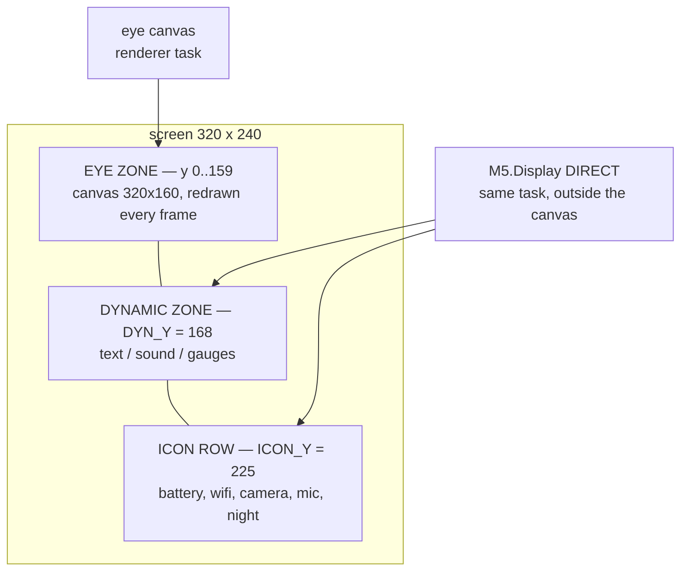
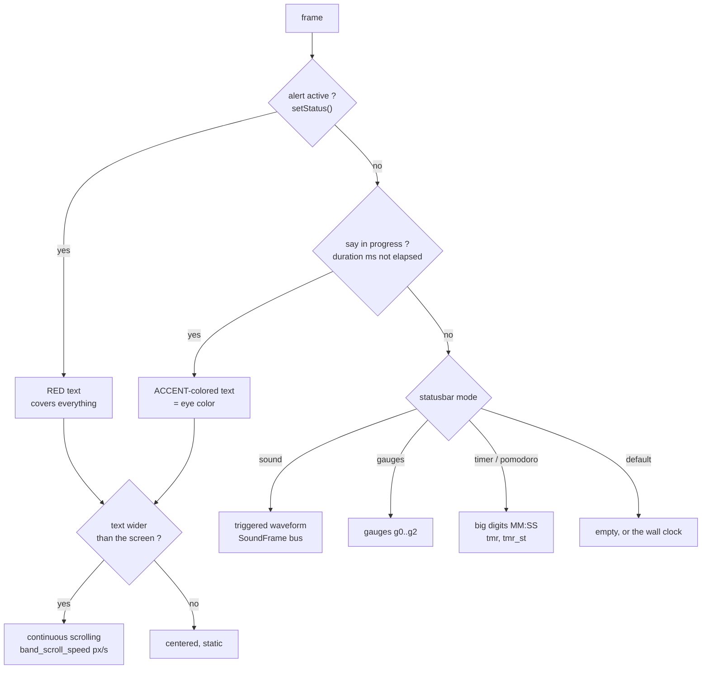

> **English** · [Français](STATUSBAR.fr.md)

# STATUSBAR.md — Status band

Dedicated documentation for the **status band** (bottom of the screen,
`y 160..240`): layout, modes, fields read, API, and examples. The plugin
contract that feeds it is described in `docs/reference/PLUGINS.md`; this
document focuses on the *display*.

## 1. Overview

The eye zone occupies `320×160` (`y 0..159`); the **bottom 80 px** (`y 160..239`)
are the status band. It is drawn **DIRECTLY on `M5.Display`**, from the renderer
task (rule A2.1: a single task touches the screen) — independent of the eye
canvas, so it is never covered by an emotion frame.

Two regions:

| Region | Y | Content |
|---|---|---|
| **Dynamic zone** | `DYN_Y = 168` (top) | text / sound / gauges (depending on the mode) |
| **Icon row** | `ICON_Y = 225` (bottom) | battery, wifi, camera, mic, night |

Constants: `Renderer.h` (`BAND_TOP=160`, `DYN_Y=168`, `ICON_Y=225`).



Both bottom regions are drawn **directly on `M5.Display`**, never on the eye
canvas: that is what makes them independent of the emotion frame in progress.

**Per-region change detection**: in steady state nothing is redrawn (text, icons
and gauges compare a signature/value before repainting). Near-zero cost per
frame. Only the **sound visualiser** repaints, and only the slivers that moved (deltas,
no `fillRect`).

## 2. Modes of the dynamic zone

Enum `StatusBarMode` (`Renderer.h`), selected by `POST /api/statusbar?mode=`.
The mode is **persisted** (tuning `band_mode`): it **survives a reboot** (useful
e.g. to leave the band in gauge mode fed by a PC script). Factory default: `0`
(none).

**Touch gesture**: a **horizontal swipe inside the band area** (y ≥ 160, whether
the band is displayed or not) cycles through the modes — left = next, right =
previous (`0 → 2 → 3 → 4 → 5 → 0`). The new mode is applied by loop() (the only
applier, which also **validates** the value: an unknown `band_mode` — a `1` left
in an old config, say — is forced back to `0`) and persisted in a **coalesced**
way (~2 s after the last change: a burst of swipes = a single SD write). L/R
swipes above the band (eye zone) cycle through emotions; a band tap never
triggers a wink (reserved for the eye zone, `TouchGestures::tapZoneMaxY`).
**A vertical swipe in the band area means whatever the mode on screen makes
of it** — the sound visualiser cycles its three skins (§6) and the timer sets
its digits (§2b) — and is inert everywhere else, the pomodoro included: no
random dance and no launcher on a slightly diagonal gesture. **The band tap
belongs to the timer modes** alone, and in the pomodoro it means two different
things depending on which half of the layout it lands in (§2b).

| Mode | Val | Display | Fields read |
|---|---|---|---|
| `BAND_OFF` | `0` | **Default**: black, or the wall clock (`band_clock`) | `clk` |
| `BAND_SOUND` | `2` | the sound visualiser: three styles over the stereo mics, blank at rest | `SoundFrame` bus |
| `BAND_GAUGES` | `3` | 3 horizontal gauges | `g0..g2` + labels |
| `BAND_TIMER` | `4` | countdown timer, big digits | `tmr`, `tmr_st` |
| `BAND_POMO` | `5` | pomodoro `cycle/total MM:SS` | `tmr`, `tmr_st` |

> The value `1` is not a dynamic-zone mode: the `emotion · ip` info is an
> **independent option** (`band_debug`) displayed **centered in the icon row**
> (§7). It therefore coexists with any mode.

> **`band_clock` option**: mode 0 — **Default** in the console, since it is
> not necessarily empty — can show the wall clock: gray `HH:MM` at the same
> full size as the timer (which wears a pixel-art **hourglass** on its left
> precisely so the two faces cannot be confused), empty until NTP has spoken.
> The robot only knows UTC (its night is sun-driven by design), so the display
> uses its own `tz_offset_h` (console slider, ±14 h, quarter-hour steps) —
> display-only.

The mode is extensible: adding a `case` in `drawStatusBand` = a new widget type
(firmware contribution, cf. `docs/reference/PLUGINS.md`).

## 2b. Timer and pomodoro (modes 4 / 5)

The state machines live in `engine/BandTimer.h` — **pure**, Clock-injected,
natively tested (`test_bandtimer`, 8 cases). loop() owns the single instance:
touch feeds it, loop ticks it and publishes its display through the same
FieldStore blackboard as every other widget (`tmr` = composed text, `tmr_st`
= colour state), and its **events become emotions** through the CommandQueue
— ordinary posts, so the reflex rule (A2.5) still preempts an alarm face.

**Timer (mode 4)** — a countdown set on the band itself, **alarm-clock tap
pattern**:

- the face reads **MM:SS, minutes up to 99** — one format, one meaning,
  seconds always visible — full size 4, with a pixel-art **hourglass** on its
  left tinted with the state colour: the wall clock shares the same big face
  and the icon is what tells them apart.
- while **editable** (idle or paused): **hold and slide to SCROLL** — left
  half = **minutes** (wraps 0↔99), right half = **seconds** (0↔59), one
  unit per 20 px, live (the value follows the finger; sliding up
  increases, and the finger may leave the band upward for long runs — the
  routing keys on where the gesture started). A quick flick steps ±1, and
  the alarm-clock taps still work (left/right third, above the digits =
  +1, below = −1, centre = the primary action). A *running* countdown is
  not editable (an accidental brush must not silently change an armed
  timer); pause it first.
- a **still hold of 0.7-3 s** released in place = **reset**, from any
  phase: the countdown empties, the setting survives. The 3 s ceiling and
  the stillness test keep the resting-thumb/carried-robot swallow intact —
  those hold longer or drift. (Also resets the pomodoro to cycle 1.)
- the **centre tap** = the primary action of the current phase:
  idle→start (if a duration is set — 00:00 does not arm), running→pause
  (the remainder is **frozen**, not re-anchored on wall time),
  paused→resume, ringing→acknowledge (the set duration is restored for
  reuse). While running or ringing the **whole band** is the primary
  action: an alarm must stop on the first tap, not a well-aimed one.
- display: `MM:SS` in every phase — the set value while idle, the remainder
  while running or paused. A countdown that only ticks once a minute reads as
  broken, so the seconds are always on screen. Colours: gray = idle, eye
  colour = running, amber = paused, **red flashing** = ringing.
- **alarm**: at zero the band flashes `00:00` and the robot fires
  **Excited** (the star eyes — the alarm face) for 10 s. The ring lasts
  until the tap acknowledges it.

**Pomodoro (mode 5)** — `cycle/total MM:SS` in the same big digits:

- **tap ANYWHERE = the primary action**: start / pause / resume /
  acknowledge. The thing you do many times a session needs no aim, the same
  rule the alarm has always had (it must stop on the first tap, not a
  well-aimed one).
- **tap the phase icon** (left of the digits) **= skip the current phase** —
  "this block is done early", "I do not want this break". It takes the same
  transition expiry takes, so a skipped block advances the cycle, honours the
  last-block rule and raises the same event. A small deliberate target is
  right here for the reason it was wrong for start/pause: skipping by accident
  is the failure that matters. Inert unless a phase is running.
- **hold (0.7-3 s) = reset**, unchanged.
- **swipe up/down, while stopped only, cycles the SHAPE.** Ranked by how often
  they happen, start/pause is many times a session and the shape maybe once a
  fortnight — so the rare act gets the deliberate gesture and never disturbs a
  running session. The console remains its real home.
- **a progress bar** under the digits (y206-222, the band's one unused strip)
  says where you ARE, which the remaining time answers badly. Phase colour;
  empty for phases with no duration.
- **the four shapes** — 25/5×4, 50/10×3, 90/20×2, 15/3×4 — write the three
  tuning keys (`pomo_work_min`, `pomo_break_min`, `pomo_cycles`; clamped
  1-120 / 1-60 / 1-8 in the machine, sliders in the console) and are
  persisted. Idle reads `1/N MM:00`, so the two numbers that move are the
  feedback; no label is needed. **Only between sessions** (Idle or Done): a
  running pomodoro is not re-shaped by a stray touch, the same edit lock the
  countdown has, and during a run the WHOLE band is start/pause instead.
  Settings matching no shape (typed in the console) land on the first one.
- **the boundary moves with the text**, and both the painter and the touch
  routing take it from `units::bandTextX0()` (Units.h §7): the digits are
  centred, so `1/4 25:00` and `1/4 120:00` do not put the icon in the same
  place. Everything left of the first digit is the icon — the whole left
  margin is the target, not the 18 px stamp.
- **emotions at the transitions**: work block → **Focused**, hydration →
  **Curious**, break → **Happy**, end of the last work block → **Glee** (no
  trailing break — homework past the bell). Green = break/done.
- **hydration** (`pomo_hydra_min`, 1 min, 0 = off, max 15): a drink prompt
  slipped in **between a work block and its break**. The placement is the
  point — a prompt at the *start* of the pause is one you act on while
  getting up; folded into the break it is a label nobody reads, put after it
  it interrupts the return to work. It is a **prefix** of the break, not a
  slice out of it: the break that follows is the full configured break, or
  enabling the reminder would tax you for drinking. The last block has none
  (the session is over), and `0` restores the previous machine *exactly* —
  the same "off is the old behaviour, byte for byte" contract the LED depth
  channel keeps. Asserted in `test_bandtimer`.

### The phase icons

Each phase wears an 18×24 pixel-art stamp to the left of the digits, tinted
with the state colour:

| phase | icon | |
|---|---|---|
| Run / Idle / Paused | ⧗ hourglass | a countdown, the original |
| Work | brain | the block you think in |
| Hydrate | water drop | drink |
| Break | mug | rest |
| Ring | bell | the alarm, blinking with the digits |
| Done | flag | the session is over |

**All six come from ONE draw call site** (A2.22): the glyphs are data, and a
single nested loop stamps whichever table the phase selects. Written the
obvious way — an `if` chain with a little loop each — they would be six
similar `fillRect` bodies in one function, and GCC 8.4 Xtensa is entitled to
thin those out; the symptom would be one phase whose icon silently never
appears. `check-a222.py` pins `drawBandClock` at exactly two `fillRect` call
sites (the opaque backing, then the stamp), so a seventh phase must be a new
table and not a new loop.

The renderer picks the icon from **`tmr_ph`**, a field published beside
`tmr_st` rather than derived from it: `tmr_st` is a *colour* code, and break,
hydration and done all share green. Deriving the icon from the colour would
give the drink prompt and the break the same drawing, which is the one thing
the icons exist to prevent.

### A dance at the bell

`timer_dance` (0 = none, else the 1-based index in `/api/dances`) plays a
dance when a countdown **ends** — `Ring` for the timer, `AllDone` for the
pomodoro — and never on a phase change: work, hydration and break come round
every few minutes, and a robot that stands up that often is a robot you
unplug. The console fills its selector from the same `/api/dances` fetch that
draws the dance buttons, so the list cannot drift from the robot's own.

## 3. Priority in the dynamic zone

Every frame, the dynamic zone picks what to display, in priority order:



- **Alert**: posted by the firmware through `setStatus()` (e.g. "BATTERIE FAIBLE
  15%" when `batt ≤ 15` and not charging). Red, covers everything for as long as
  it holds.

### Driving the timer from the console or the API

Everything the finger does on the band has an endpoint, so a timer can be armed
from a phone or a script as well as from the robot:

```bash
curl -X POST "http://<ip>/api/timer?action=set&m=25&s=0"          # duration
curl -X POST "http://<ip>/api/timer?action=set&m=10&s=0&start=1"  # and go
curl -X POST "http://<ip>/api/timer?action=tap"                   # start / pause / ack
curl -X POST "http://<ip>/api/timer?action=reset"                 # back to idle
```

`start=1` sets AND starts in ONE request, which is a correctness requirement
rather than a convenience: the firmware holds a single command slot, so two
calls in a row could see the second overwrite the first before `loop()` drained
it. It is what the console's preset buttons (5, 7, 10, 15 min) send, and it
resets first — pressing "10 min" is an explicit intent, not the stray brush the
edit lock protects a running countdown from.

`m` is clamped to 0-99 and `s` to 0-59 — the same bounds the band's own
gesture uses, defined once rather than twice. `set` goes through
`addMinutes`/`addSeconds` like the gesture does, so it obeys the same edit
lock: a **running** countdown is not silently rewritten, it is paused first.

The console's Timer and Pomodoro panels are these three calls plus, for the
pomodoro, the three duration sliders (`pomo_work_min`, `pomo_break_min`,
`pomo_cycles`). Changing a duration re-arms the NEXT block; it does not cut
the one running.

**A2.6 note**: the HTTP handler writes a one-slot command and nothing else.
`BandTimer` belongs to `loop()`, and an AsyncTCP thread stepping a state
machine that `loop()` is also stepping is exactly the race that rule forbids.

### The clock's format

`clock_24h` (console toggle, Default mode only): 24-hour, or 12-hour with an
`a`/`p` suffix. Midnight and noon are both "12" in that format — the first is
`12:00a`, the second `12:00p`.

- **Say**: ephemeral notification `POST /api/say?text=…&ms=…` (accent color =
  eye color). Covers the mode for `ms`, then hands control back.
- **Mode**: sound / gauges / off according to `statusbar` (debug is not a mode).

**Long text → scrolling (marquee)**: if the text (say or alert) exceeds the
screen width, it **scrolls** right to left in a continuous loop (speed
`band_scroll_speed` px/s, adjustable); otherwise it is centered and static. The
text is stored on **160 characters** (no truncation); size adjustable
(`band_text_size`, 1..3). The zone is **purged before AND after** display (clear
on change / on expiry) → no leftover text. From the console, the notification
lasts `max(4 s, length × 250 ms)` to give time to read everything.

## 4. The blackboard (single source)

Everything the band displays comes from the **`FieldStore`**
(`engine/FieldStore.h`): a store of named fields `{ float, short string }`,
thread-safe (portMUX), read by the renderer, written by *any source*. Nobody
wires a dedicated path to the screen — you **post a field**, the widget reads it.

Limits: `MAX_FIELDS = 28`, key ≤ 13 chars, string ≤ 23 chars.

### Fields pushed automatically by the firmware (`main.cpp`)

Two rhythms, and the split is not arbitrary: **what a widget draws goes out
every pass**, so the picture never lags the finger or the sound, while what a
human reads goes out **at 1 Hz**, because polling a PMIC or the radio thirty
times a second buys nothing and costs an I2C transaction.

| Field | Type | Rate | Meaning |
|---|---|---|---|
| `batt` | float | 1 Hz | battery level 0..100 (−1 = unknown) |
| `chg` | 0/1 | 1 Hz | charging |
| `rssi` | float | 1 Hz | WiFi RSSI dBm (0 in AP/disconnected) |
| `cam` | 0/1 | 1 Hz | camera active (`tuning.camera`) |
| `night` | 0/1 | 1 Hz | night mode (roulette) |
| `mic` | 0/1 | 1 Hz | mic active |
| `ip` | string | 1 Hz | current IP (debug mode) |
| `clk` | float | 1 Hz | wall clock, what the Default mode's `band_clock` draws |
| `micL`, `micR` | float 0..1 | every pass | left/right audio level, attack/release envelope applied at the source — telemetry only (`/api/status`, console); the visualiser has its own bus |
| `light` | float | every pass | ambient light 0..100 (only if an LTR-553 answered) |
| `dark_sleepy` | 0/1 | every pass | "sleep in the dark" option |
| `tmr`, `tmr_st` | string, float | every pass, modes 4/5 only | the countdown's composed text and its colour state — posted only while a timer mode is displayed, since nothing else reads them |

### Fields posted by external sources (gauge widgets, etc.)

See §5. Any source: `POST /api/field`, a PC script, Home Assistant, an SD rule
(`set …`), a future BLE channel.

## 5. Gauge mode (`g0..g2`)

Three gauge lines, indexed `0..2`. Each gauge reads **3 fields**:

| Field | Role | Ex. |
|---|---|---|
| `g<n>` | percentage `0..100` (< 0 ⇒ empty slot, not drawn) | `g0=62` |
| `g<n>l` | left label (≤ 7 chars) | `g0l=CTX` |
| `g<n>r` | right text (eta/caption, ≤ 15 chars) | `g0r=1h24` |

Bar color by threshold: `≥85 %` red, `≥70 %` amber, otherwise a **base color
specific to each gauge** (g0 cyan, g1 indigo, g2 green) — **independent of the
eye color**. The `_s` suffix forces a string if the value looks like a number
(e.g. `g0r_s=1h24`). Redraw throttled to 200 ms and only if a value changes.

Example — three "quota" gauges:

```bash
curl -X POST "http://<ip>/api/field?g0=62&g0l=CTX&g0r_s=ctx&g1=30&g1l=5h&g1r_s=2h10&g2=48&g2l=WEEK&g2r_s=3j"
curl -X POST "http://<ip>/api/statusbar?mode=3"
```

## 6. Sound mode (`band_sound`)

**A visualiser, not a meter.** Mode `2` shows what the two microphones actually
picked up: a **triggered oscilloscope trace**, dressed three ways. A bargraph
fed by a generated texture would move convincingly and mean nothing — every bar
moves anyway, so nothing on screen would reveal the lie.

**Both microphones, and no forced symmetry.** The robot has a left and a right
microphone. Mirroring one level about a centre line draws the same number twice;
here the two channels are two signals: `wave` plots them as two traces, and the
two bar skins take the louder of the two per column, because a silhouette has
one height and a mix would let a channel hide inside the other. What a channel
does, it does alone.

### Where the numbers come from

The analysis runs on `loop()`, in the pass that already consumes a microphone
block (`SoundTracker` → `SoundViz`), and never on the renderer task: A2.15 puts
every bit of smoothing on the producer side, and A2.22 leaves no room on a frame
the eyes have already half spent.

```
M5.Mic.record ──► SoundTracker ──► SoundViz ──► TripleBuffer<SoundFrame> ──► Renderer
  512 frames        (loop, 100 Hz)   (FFT +          (single producer,          (paints
  stereo 16 kHz                       envelopes)      single consumer)           deltas)
```

| Step | What happens |
|---|---|
| **De-interleave** | sample `2i` is the **right** microphone, `2i+1` the left — validated on hardware, and the order `SoundDirection` reads. Backwards, the whole display mirrors and nothing about the picture says so |
| **Trace** | taken from the **raw** samples, before the transform consumes them |
| **Transform** | one 512-point complex FFT yields **both** channels: a real signal has a conjugate-symmetric spectrum, so left goes in the real part, right in the imaginary, and the two separate exactly afterwards |
| **Mean, then window** | the mean is removed **before** the Hann window, not after. A window has a spectrum of its own, so a constant multiplied by it lands in bins 1 and 2 as well as bin 0 — zeroing bin 0 leaves two phantom bars standing under everything |
| **Bands** | 16 logarithmic bands from 60 Hz to 7 kHz, each worth the **peak** of its bins. The mean would drown a lone tone in a wide band |
| **Scale** | decibels over a 48 dB range. On a linear scale, speech sits on the floor |
| **Envelope** | asymmetric — attack 0.55, release 0.14. A symmetric filter rounds off the attack, which is the part of a sound the eye reads |
| **Envelope of the trace** | one value per display column (`env`), the loudest sample of the group taking the louder microphone. This is what the `columns` and `matrix` skins draw — the same waveform as `wave`, quantised |
| **Peak hold** | instant up, then a slow constant fall — about three seconds from full scale. Two of them: one on the bands (`peak`, computed and published, drawn by nothing today) and one on the envelope (`envPeak`, matrix's marker). They are the only parts of the display with a memory, and that is precisely why they live on the producer's side (A2.15) |
| **Sensitivity** | `band_sound_gain` (0.1–16, default 1) multiplies the samples **before** everything above, so the trace, the envelope and the bands scale together — one knob, and nothing downstream can disagree about how loud the room is. The console's slider covers 0.25–16 in steps of 0.25; the bottom of the firmware's range is reachable through the API, for a microphone placed against a loudspeaker |

About thirty blocks a second, one transform each. `engine/Fft.h` is **pure** and
carries a native suite (`test_fft`): a sine lands in its bin and nowhere else,
DC disappears everywhere, one channel stays silent while the other saturates.

**The trace is triggered**, on a rising zero crossing found in the first half of
the block, and it is plotted over a **fixed window** of 256 samples from there.
The trigger alone is not enough: plotting whatever remains after it makes the
time base depend on where it landed, so the same tone comes out stretched by a
few percent from one block to the next and the picture breathes horizontally
instead of standing still. Trigger plus fixed span means one pixel is always the
same number of microseconds. Decimation to the 160 columns is nearest-neighbour,
never averaged: averaging turns a square wave into a sine, which is the one thing
a scope must not do.

### Three styles, one waveform

The three styles are **skins of the same picture**: the triggered 256-sample
window, time across the width, dressed as a curve, as thin strokes, or as
blocks — which is what the three reference images showed. Switching styles
never changes what is being said, only the clothing. The band SPECTRUM is
still computed and published in `SoundFrame` — nothing draws it today; it is
the food of the assistant's mouth (ROADMAP §8).

| `band_sound` | Style | What it is | Geometry |
|---|---|---|---|
| `0` | **Wave** | two continuous traces, one per microphone, one pixel per column. Each stroke spans from its own sample to the next column and the columns touch, so they join into one polyline the way a plotted curve does. **The ink follows the agitation**: nearly black at rest, whitening through the ramp as the curve moves | 160 columns × 2 px = **320 px, edge to edge** |
| `1` | **Columns** | the same window as strokes: each column is the **envelope** of its five samples (the louder of the two mics — a silhouette has one height), grown both ways from the axis. **Monochrome** — every stroke the same cyan | 32 strokes on a 10 px pitch, 3 px wide — **full width** |
| `2` | **Matrix** | the same envelope quantised into stacks of **square blocks**, the outer ones lighter, with a peak marker detached beyond each end, **coloured by its own height** — on the ramp near the axis, white at the edge of the zone. A non-zero level always lights **at least one block**: the quantisation governs the level, never whether there is any sound | 32 stacks on a 10 px pitch, blocks 3 × 3 px on a 4 px pitch, a one-row seam on the axis — **full width** |

**No mirror layout.** The spectrum era put one channel per half, bass outward,
and the two near-identical spectra of a normal room made the display read as a
symmetric ornament. A skin of the waveform has no halves: the width is time,
and the shape is the signal's own.

| | |
|---|---|
| Zone | rows 163..215 — the band, not the forty rows of the text layout it used to borrow. The margins are deliberately **unequal**: three rows under the eyes, ten above the icon row, because a full-scale bar landing two rows under a line of small glyphs read as touching it |
| Axis | row 189, the **middle** of the zone: every style grows both ways from it, and an axis off centre would give more room downwards than upwards, so a full-scale display would be visibly lopsided |
| Amplitude | **23 px** either way, the same for all three styles — three skins of one waveform must agree about how tall full scale is |
| Why 23 and not 26 | the zone allows 26, but matrix's outermost mark is the peak block at `k = HALF/4`, whose rows are `CY ∓ 4·(HALF/4) ∓ 3`; those rows are inside the zone only when the half-height is of the form 4m+3. At 26 a full-scale peak block would sit three rows outside and `mSeg` would trim it in silence. Three `static_assert`s check it at build time |
| Fed by | `TripleBuffer<SoundFrame>` — 160 trace columns per channel, 32 envelope columns with their peak hold, 16 bands per channel |
| Selection | `POST /api/statusbar?mode=2`, then `POST /api/tuning?band_sound=0\|1\|2` |
| Cost | measured on target the whole frame — eyes included — averages between 4 and 10 ms across the three styles, against a 33 ms budget. The figure is the frame, not the band: the eye animation of the moment moves it more than the choice of style does |

**Nothing is drawn under the visualiser, and nothing at rest.** No baseline is
laid down, no centre line: silence draws silence. A second thing asserting the
rest state alongside the data that already draws it is two sources for one fact,
and that is how they come to disagree.

**When the microphone is not listening the band says so** rather than drawing a
silence it never measured. The shared I2S bus belongs to the speaker while it
plays (A2.20), the microphone stays off for the first 20 s of uptime, and it
stays off altogether while `mic_enable` is `0` — **which is the default**. In
all three cases the producer publishes one frame marked not-live and the band
prints *mic idle*. So the visualiser has a precondition the mode selector cannot
express: **enable the microphone**, or the three styles have nothing to draw.

**The console says which of those it is, and offers the fix.** The Sound panel
carries a microphone status line fed by the same `mic` state the telemetry chip
shows — *off*, *warming up* with the remaining seconds (`micWait`), *standby*
while the speaker holds the shared I2S bus, or *active*. An **enable button**
appears **only in the `off` case** and posts `mic_enable=1`; in the other three
there is nothing to press, because nothing is wrong — the countdown ends by
itself and the speaker gives the bus back. A blank band is otherwise
indistinguishable from a silent room, and a user who cannot tell those apart
concludes the feature is broken. (Enabling *sound tracking* turns the
microphone on as well: tracking without a microphone is not a state worth
being able to select.)

**All three are drawn in the companion's own ramp: cyan → indigo.** That is the
gradient the launcher, the lobby, the flash screen and the web console already
sweep between (`--acc-grad`, `L_ACC`/`L_ACC2`), so the band looks like the thing
it belongs to. It is deliberately **not** the eye colour: that rule governs what
the *face* wears (A2.17, the LEDs follow `eyeColorRgb`), and this widget is
chrome. Saturation is said by going **pale**, towards the console's text colour,
rather than by borrowing an amber from another palette.

**The three agree on presence and on full scale; they differ in what they
summarise.** Feed the same block to all three and the tallest column is the same
height in each — measured, not assumed. But `wave` plots the instantaneous
waveform while the bar skins plot its ENVELOPE, so for anything above a few
hundred hertz the bars sit near the peak while the curve spends most of its time
below it. That is what an envelope is, and it is why the bar skins look more
eager than the curve; it is not a difference of gain. Matrix used to add a
second, real gap — `h / 4` truncated, so anything under a sixth of full scale
drew nothing while `columns` drew it — and that one was a defect, now fixed.

**Each style says loudness once, and in its own way.** Matrix grades by
HEIGHT — an LED bar is the one idiom where colour-by-height is already read as
level — and carries a white peak marker. Wave says it by BRIGHTNESS: a calm
trace is nearly black, so the band is dark when the room is and the eye is only
called when something happened; a line of constant brightness makes silence and
speech look equally eventful. Columns says it by height alone and stays
**monochrome**: a ramp across the width made a row of thin strokes read as a
gradient chart, a second thing said by the colour while the height was already
saying the only thing this style has.

**The peak marker is a MEMORY, and memories live on the producer's side.** Both
the envelope and its peak-hold are computed in `SoundViz` and published in
`SoundFrame` (`env`, `envPeak`) — the renderer only draws them. A peak-hold
derived from the display column would be smoothing born in the painter, which is
exactly what A2.15 forbids. ITS COLOUR SAYS HOW HIGH IT IS: the ramp, dimmed, near
the axis, whitening towards the edge of the zone. One fixed colour made every
transient look alike — a clap that reached full scale and a door closing three
blocks up were the same mark in two places, and the eye had to read the position
to learn which. Colour is the faster channel, so it carries the same fact the
height does and the two agree by construction. The whitening is **quadratic**:
linear, everything above the middle read as roughly white and the top of the
scale stopped being special; squared, the marker stays on the palette for most
of its travel and only peaks that really reach the edge go white — which is also
what keeps a busy room from being a row of white specks. (Pure white everywhere
was tried first and out-shouted the stack it is there to annotate; a single dim
colour told the eye nothing the position was not already telling it.) It rises instantly and falls at a fixed rate — about three seconds
from full scale — long enough for a clap to leave a visible trace, short enough
not to fossilise it, and a return to *mic idle* clears it outright.

**Deltas only.** Each column remembers what is actually on the glass and repaints
just what moved — the band has no back buffer, so repainting everything at 30 Hz
would both cost the frame budget and show as a flicker. Every rectangle of a
frame is collected and emitted through **one** `fillRect` call site (A2.22),
clamped to the zone so nothing can leak into the icon row above. Anything that
paints over the band (launcher, SD-Updater, an alert) voids that memory through
`bandWiped()`/`clearDyn()`; a visualiser left differencing against a false belief
stays stuck half open.

Selected from the console (*Status band → Mode: Sound → Style*) or with
`POST /api/tuning?band_sound=0|1|2`. It is a **tuning value**, not a band mode:
it rides the pipe that already persists display choices to the card. The
renderer notices the change itself and repaints from scratch, because the delta
memory is style-specific.

## 7. Icon row

Always displayed (independent of the mode), redrawn only if a state changes
(compact signature).

| Icon | Position | Field | Rendering |
|---|---|---|---|
| Battery | **left** edge (`x≈6`) | `batt`, `chg` | cell + level; red if `≤15 %` and not charging, accent if charging |
| WiFi | **right** edge (`x 300..315`) | `rssi` | 4 bars (thresholds −60/−70/−80 dBm) |
| Camera ● | contextual (right→inward) | `cam` | **red** dot |
| Mic | contextual | `mic` | rounded pill |
| Night ☾ | contextual | `night` | crescent |

The **contextual** ones pack from the right inward starting at `x=280` (8 px
margin before the wifi bars), **spaced 18 px apart**. Only those whose state is
active take a slot (right-packed).

**Masking**: each icon can be masked through the `icon_mask` tuning (bitmask —
battery=1, wifi=2, camera=4, mic=8, night=16; `31` = all). A masked icon takes
no slot. Console: the 5 *Visible icons* pills, on the live telemetry band. API:
`POST /api/tuning?icon_mask=N` (persisted). Colors are **independent of the eye
color**: battery green while charging / red if low / grey otherwise; camera =
red dot.

**Debug info (`emotion · ip`)**: `band_debug` option (0/1) — when active, it is
displayed **centered in the icon row** (between the battery on the left and the
contextual icons on the right), in grey. Independent of the dynamic-zone mode
(coexists with sound/gauges/off). Console: the *Debug info* toggle, on the live
telemetry band. API: `POST /api/tuning?band_debug=0|1`.

Two ways in besides the console. **Being on the fallback access point forces it
on**, overriding the setting without writing it: a robot nobody can reach has
exactly two places its address exists, the serial line and this row of pixels.
And **two fingers held three seconds on the face** toggles it — a deliberately
awkward gesture for a rare act, so it cannot be reached by accident, which is
the requirement for a control with no on-screen affordance. Spread the fingers:
the panel merges two contacts placed close together into one, and the gesture
then never sees a second point.

**Touch crosshairs**: while `band_debug` is on, every contact draws a vertical
and a horizontal line crossing where the finger is, one colour per point (red
for the first, green for the second). It is drawn at the single exit point of
every rendering path, so it survives a blink and the "…" screen, and after the
CRT post-process — an instrument that is itself smeared measures nothing. A
finger on the status band keeps its vertical line and loses the horizontal one:
the canvas stops at the eye zone, and a line clamped to the last row would
claim a position the finger does not have.

## 8. API

| Route | Effect |
|---|---|
| `POST /api/statusbar?mode=<0\|2\|3\|4\|5>` | changes the mode (0=default, 2=sound, 3=gauges, 4=timer, 5=pomodoro) |
| `POST /api/field?<key>=<val>[&…]` | posts one/several fields (numeric → float, otherwise string; `<key>_s` forces a string) |
| `POST /api/say?text=<txt>&ms=<ms>` | ephemeral notification (default `ms=4000`); long text → scrolls |
| `POST /api/rules/reload` | reloads the SD rules (reactive plugins, cf. PLUGINS.md) |
| `GET /api/rules` | the rule table **as loaded** — `builtins`, then per rule `en`/`f`/`op`/`v`/`sus`/`cd`/`act`/`on`/`sd`. A line that fails to parse is simply absent, so this is the only way to tell what the engine kept |

**Settings (persisted, through `POST /api/tuning?key=val`)**:

| Key | Role |
|---|---|
| `band_mode` | persisted dynamic-zone mode (0=default, 2=sound, 3=gauges, 4=timer, 5=pomodoro) |
| `icon_mask` | visible icons (bits batt=1 wifi=2 cam=4 mic=8 night=16; 31 = all) |
| `band_debug` | 1 = `emotion · ip` info centered in the icon row |
| `band_text_size` | say/alert text size (1..3, default 1) |
| `band_scroll_speed` | scrolling speed of long text (px/s, default 70) |

`GET /api/status` exposes the current mode under the `statusbar` key;
`GET /api/tuning` returns the three settings above.

From the **console** (`/`): the *Status band* panel of the **Pilot** tab →
**mode selector**, `say` field, **text size / scroll speed sliders**, gauge
test; the *Rules* section beside it → the loaded table and its reload. The
**icon pills** and the *Debug info* toggle are on the live telemetry band, which
every tab shares. Routes are also in the **Swagger** page (`/swagger`).

## 9. PC scripts provided

| Script | Role |
|---|---|
| `scripts/dev/statusbar-push.ps1` · `.sh` | generic field pusher (wrapper around `POST /api/field`). **Windows / macOS / Linux** |
| `scripts/dev/claude-statusline.ps1` · `.sh` | Claude Code bridge, **Windows / macOS / Linux** (install: [`PLUGINS.md`](PLUGINS.md)): pushes `ctx` (context-window %, read from the session transcript) and `claude` (1 only when `ctx` could actually be computed), plus `g0` = context with the `CTX` label and `g1` = session cost with the `COST` label |

## 10. Extending

- **New data to display** → post a field (no recompilation).
- **New reaction** (emotion/dance based on a field) → SD rule
  (`/stackchan-companion/rules.txt`, cf. `docs/reference/PLUGINS.md`).
- **New widget type** (novel drawing) → a `case` in
  `Renderer::drawStatusBand` (firmware contribution).

## Files

| File | Role |
|---|---|
| `engine/FieldStore.h` | blackboard (fields), thread-safe, pure |
| `engine/Renderer.h` | `drawStatusBand` + helpers (`drawVu`/`drawGauges`/`drawDebug`/`drawIcons`), `setSay`, `setStatusBar` |
| `app/WebApi.h` | `statusbar`/`field`/`say`/`rules/reload` routes |
| `app/WebConsole.h` | *Status band* panel (mode selector, say, gauges) + the *Rules* section beside it |
| `docs/reference/PLUGINS.md` | `sources → fields → {widgets, rules}` contract (overview) |
