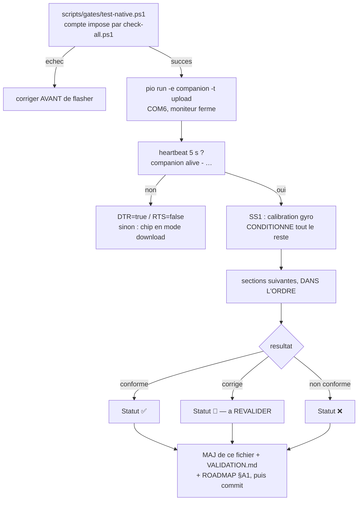

> [English](PLAYBOOK-HW.md) · **Français** — l'anglais est la version de référence.
> Ce fichier peut être en retard d'une mise à jour : en cas de divergence, l'anglais fait foi.

# PLAYBOOK-HW.md — checklist de validation hardware

> Format tableau : remplir/mettre à jour la colonne **Statut** (et **Notes**
> si besoin) à chaque essai. Dérouler les sections DANS L'ORDRE (§1 conditionne
> tout le reste). Après CHAQUE session de test : mettre à jour ce fichier +
> `VALIDATION.md` (tableau de bord synthétique) + `docs/ROADMAP.md` §A1,
> committer (messages sans accents dans `git commit -m` PowerShell).

**Légende Statut** : 🔲 à tester · ⏳ en cours · ✅ validé · 🔧 corrigé (à
revalider) · ❌ échec confirmé

Le cycle d'une session de validation. L'ordre n'est pas décoratif : §1
calibre le mapping gyro, dont **tout** le reste dépend — un VOR mal câblé
fait échouer des sections qui n'ont rien à voir.



## Portails automatisés

Cinq vérifications existaient et se lançaient à la main, c'est-à-dire quand
quelqu'un y pensait. `scripts/check-all.ps1` est le point d'entrée unique, et
`-Hook` l'installe en **pre-push** git : y penser cesse de faire partie du
processus (`git push --no-verify` le contourne une fois, délibérément).

| Portail | Ce qu'il prouve |
|---|---|
| `check-doc-parity.py` | chaque `*.md` a son jumeau `*.fr.md`, section par section |
| `check-contrast.py` | les quatre thèmes tiennent leurs rapports de contraste |
| `check-vendored.py` | les **cinq** copies embarquées dans `SceGuest.h` (`Yaml.h`, `I18n.h`, `FirmwareInfo.h`, `Trace.h`, `Gesture.h`) n'ont pas dérivé de leurs originaux dans `firmware/common/` — la divergence même qui a motivé la règle 17. Elles n'existent que pour que le stub reste copiable seul dans un projet tiers, ce qui est précisément pourquoi on ne peut pas les laisser sans surveillance |
| `check-mirrors.py` | les constantes que l'éditeur de chorégraphies **recopie à la main** correspondent encore au firmware (`YAW_RANGE`, les offsets de pitch, `MAX_KEYS`, `MAX_NAME`). L'éditeur ne peut pas inclure `Units.h`, et son propre commentaire nomme la panne : les afficher « évite d'écrire un CSV que le robot rognerait en silence ». Chaque changement d'une borne comme `YAW_RANGE` impose d'éditer LES DEUX côtés ; en oublier un laisserait l'éditeur produire des danses que le robot rogne sans rien dire. Il tient la même ligne sur `MIN_SUITES`/`MIN_TESTS` entre les jumeaux `.ps1`/`.sh`, les VID/PID USB des cartes, le gabarit `rules.txt`, chaque défaut de curseur de la console, et les deux `CLAUDE.md` — plus une règle qui n'est pas une constante : **un `main.cpp` d'invité qui appelle `xTaskCreate` doit brancher `guest.netGuard`**, parce qu'un arrêt coopératif appliqué à un bin et oublié dans un autre est exactement ce qui a fait durer dix minutes le retour au companion |
| `pio test -e native` | **Le COMPTE de suites/cas est vérifié** (`$MIN_SUITES`/`$MIN_TESTS` dans `check-all.ps1`), **avec UNE reprise annoncée.** `pio test` sort en 0 quand tout ce qu'il a LANCÉ passe, ce qui ne dit rien de ce qu'il n'a pas lancé — une suite qui cesse d'être ramassée doit désormais faire échouer le portail au lieu de disparaître.
**Le harnais est instable par salves sous Windows** quand il enchaîne toutes les suites : une exécution peut rapporter bien moins de cas/suites qu'attendu, avec certaines suites `ERRORED`, alors que chacune de ces suites PASSE seule (`pio test -e native -f test_behavior`) — c'est donc le harnais ou le système de fichiers, pas le code. D'où une reprise — un portail qui échoue au hasard finit ignoré — et d'où le fait qu'elle soit toujours ANNONCÉE, car une reprise qui masque l'aléa est la façon dont une vraie régression passe |
| build ×4 | le companion, les deux bins invités ET la variante Fire lient encore - la variante est là parce que personne ne la compile tant qu’il n’a pas la carte, et une garde #if mal fermée ne se voit pas sur la cible principale |
| `check-a222.py` | **A2.22 vérifié DANS LE BINAIRE LIÉ** : il compte les appels à une primitive de dessin dans un symbole et compare à ce que dit la conception. GCC 8.4 Xtensa supprime le second de deux appels similaires, ce qu'aucune relecture de source ne peut voir — celui-ci lit l'ELF |

`check-comments-only.py` n'est **pas** dans le portail, volontairement : il
prouve qu'un changement n'a touché que des commentaires, donc il sort en 1 dès
que du code change, ce qui est le cas normal. C'est un outil pour un type de
passe, pas un portail — l'y mettre a fait échouer le portail à son premier
lancement.

## Prérequis (rappels environnement)

- Firmware : env `companion`, port **COM6** (USB-JTAG CoreS3).
  `& "$env:USERPROFILE\.platformio\penv\Scripts\pio.exe" run -e companion -t upload --upload-port COM6`
  ⚠ Fermer tout moniteur série avant upload (port busy).
- Série 115200 : **DTR=true, RTS=false** à l'ouverture (DTR+RTS ensemble =
  séquence bootloader esptool → chip figé en mode download). Heartbeat 5 s :
  `companion alive - emotion:X ip:X sd:0|1 heap:... heapMin:... stk*:... frame ... uptime:...`.
- Tests natifs avant tout flash : `.\scripts\gates\test-native.ps1` (compte imposé
  par `check-all.ps1` — voir `$MIN_SUITES`/`$MIN_TESTS`).
- **Après chaque flash, confirmer CE QUI TOURNE** — un upload réussi ne prouve
  pas que la carte le démarre. `pio -t upload` écrit un slot OTA (`app0`) et ne
  touche jamais `otadata`, qui choisit le slot ; un invité qui rend la main
  reflashe `/companion.bin` depuis la carte SD par-dessus. Les deux laissent un
  hash esptool vérifié et un robot de retour sur le WiFi.
  `curl -s "http://<ip>/api/firmware"` → `slot` nomme la partition démarrée ;
  `sha` doit égaler `sha256sum .pio/build/companion/firmware.elf` (8 premiers
  hex) et `console` l'empreinte imprimée par
  `python scripts/build/gen_console_gz.py --check` ; `reset` dit pourquoi la
  carte a démarré (`panic`/`task_wdt`/`brownout` = plantage).
- API : mode AP `StackChan-AP` / `goodlife` → `http://192.168.4.1` ; mode STA
  → `http://stackchan.local/` ou IP du heartbeat. Console `/`, tuning à chaud
  `POST /api/tuning?cle=valeur`, télémétrie `POST /api/tuning?telemetry=1`
  (série 10 Hz : `gX/gY/gZ` gyro brut, `headVelX/Y` mappé, `vorX/Y`,
  `tiltX/Y`, `gazeX/Y`, `openL`).

---

## 1. Calibration mapping gyro + efférence — ✅ SECTION VALIDÉE

Mapping par défaut validé HW : yaw=gyro.y+, pitch=gyro.x+, réglable à chaud
sans reflash (`gyro_yaw_axis/sign`, `gyro_pitch_axis/sign` — boutons console
section « Calibration VOR »). Consigné `CONVENTIONS.md §3`.

| # | Test | Procédure | Critère de succès | Statut | Notes |
|---|---|---|---|---|---|
| 1.1 | Télémétrie active | `POST /api/tuning?telemetry=1` (ou bouton console) | Flux série 10 Hz visible | ✅ | |
| 1.2 | Biais/baseline boot | Robot immobile ~3 s après reset | `headVelX/Y`≈0 (±0,5), `vorX/Y` stables | ✅ | |
| 1.3 | Axe + signe yaw | Tourner LENTEMENT vers la DROITE observateur ; ajuster `gyro_yaw_axis`/`gyro_yaw_sign` si besoin | `headVelX>0` et `vorX<0` pendant la rotation | ✅ | défauts confirmés (axe=1/Y, sign=+1) |
| 1.4 | Axe + signe pitch | Incliner la tête vers le HAUT ; ajuster `gyro_pitch_axis`/`gyro_pitch_sign` | `headVelY>0` et `vorY<0` | ✅ | défauts confirmés (axe=0/X, sign=+1) |
| 1.5 | Visuel VOR | Rotations lentes + inclinaison tenue | Contre-rotation visible, saccade de rattrapage sèche, compensation TENUE (pas de retour à zéro) | ✅ | |
| 1.6 | Consignation | — | Mapping dans `CONVENTIONS.md §3` | ✅ | |
| 1.7 | Efférence servo (head-follow) | `POST /api/tuning?head_follow=1`, observer les yeux pendant un suivi de tête | Yeux NON perturbés par le mouvement servo lui-même | ✅ | le VOR intègre PENDANT les mouvements servo (efférence soustraite) ; `selfMotion` n'inhibe plus que la détection de secousse |

---

## 2. Comportement idle + blink (P2)

| # | Test | Procédure | Critère de succès | Statut | Notes |
|---|---|---|---|---|---|
| 2.1 | Idle 10 min | Observer sans interaction | Fixations TENUES (zéro flottement), saccades sèches + micro-rebond, micro-jitter seulement > 2 s de fixation | ✅ | |
| 2.2 | Squash & stretch | Observer pendant une saccade | Étirement H + compression V (~10 %), retour élastique | ✅ | |
| 2.3 | Sleepy « lutte » | `POST /api/emotion?name=Sleepy&ms=30000` (ou tirage roulette) | Droop lent → chute → réouverture laborieuse (1-2 hoquets) → plafond ~70 % → re-droop ; ~1/4 : sursaut tenu ~1 s ; sortie douce (360 ms, pas de snap) | ✅ | forme des paupières : voir 4e.5 |
| 2.4 | Politiques blink + ligne Cozmo | `name=Surprised`/`Dead`/wink ; observer un blink complet (aussi sur Happy/Glee/Blush — bas d'œil plat) | Fermeture nette ; **deux yeux totalement fermés = UNE ligne 1 px pleine largeur, posée sur le BORD BAS des yeux** — la paupière tombe et la ligne se pose là où elle finit (continuité slit → ligne ; sur Happy/Glee/Blush la ligne = premier pixel du bas de l'œil) ; un wink garde le rendu par œil | ✅ | la ligne se pose sur le bord bas (`EyeRig::bottomEdgeY`), pas au centre de l'œil |
| 2.5 | Lag œil droit réglable | `POST /api/tuning?blink_lag_ms=0..150` | Retard réglable, 0 = synchrone | ✅ | défaut 30 ms |
| 2.6 | Fréquence blink | `POST /api/tuning?blink_median_ms=1500` puis remettre 3500 | Blinks visiblement plus fréquents à 1500 | ✅ | |
| 2.7 | Coins d'yeux (débordement) | Observer Scared + pendant les blinks | Aucun décroché/débordement ; les DEUX yeux gardent leur largeur quand le regard se décale | ✅ | un décroché au raccord pente/coin ou un œil rétréci contre un milieu fixe sont les deux régressions connues à surveiller |
| 2.8 | Paupières tombantes | Observer un blink lent (`blink_median_ms=1500`) et Sleepy | La fermeture vient UNIQUEMENT du haut — le bord BAS de l'œil ne remonte jamais ; la ligne « fermé » se pose au bord bas (continuité slit→ligne) | ✅ | canal `lid` ancré en bas |

---

## 3. Réactions physiques IMU (P3)

| # | Test | Procédure | Critère de succès | Statut | Notes |
|---|---|---|---|---|---|
| 3.1 | Secousse → Scared | Secouer franchement > 0,5 s | Scared ~2 s puis reprise roulette ; réglage `shake_gyro_thr` | ✅ | seuil 35, magnitude 3 axes, guard selfMotion |
| 3.2 | Inclinaison statique tenue | Pencher le robot et TENIR | Yeux tiennent la compensation, stables (pas de tremblement) | ✅ | dépend de §1.5 |
| 3.3 | Préemption réflexe | `POST /api/emotion?name=Happy&ms=30000` puis SECOUER (Scared immédiat) ; puis SOULEVER (Curious immédiat) ; wink en cours + secousse = coupé net ; danse + secousse = abort immédiat | Coupure IMMÉDIATE dans tous les cas, priorité secousse > soulèvement | ✅ | |
| 3.4 | Pickup → Curious + pieds ballants | Soulever le robot | ~0,5 s : Curious + tête relevée + servos en roue libre ; porter = Curious maintenu ; poser + 1 s stable = couple ré-engagé + reprise | ✅ | seuils 0.08 g/120 ms, relève −14°, relâche 250 ms |
| 3.5 | Boot (biais gyro) | Ne pas manipuler ~3 s après reset | Biais correctement calibré | ✅ | |
| 3.6 | Effet profondeur VOR | Observer un œil pendant une compensation VOR | Pas de changement de proportion : décalage PUR des deux yeux | ✅ | les deux yeux partagent une ligne médiane mobile, pas un centre écran fixe — un changement de largeur sur un œil signale une régression de ce clamp |

---

## 4. Servo (P4a)

| # | Test | Procédure | Critère de succès | Statut | Notes |
|---|---|---|---|---|---|
| 4.1 | Boot neutre | Observer au démarrage | Tête au HOME (yaw 166, pitch 93) sans à-coup | ✅ | |
| 4.2 | Head-follow | `POST /api/tuning?head_follow=1`, tenir une fixation excentrée ~1 s | Tête tourne doucement (600 ms) vers la direction du regard, yeux se recentrent pendant la rotation, cadence max 1/2,5 s | ✅ | `head_follow=1` est le défaut compilé — la boucle « eyes lead, head follows » est le cœur Cozmo du projet. ⚠ Un config.yaml SD portant explicitement `head_follow: 0` prend le pas sur le défaut — repousser 1 via API (persisté) le cas échéant |
| 4.5 | Amplitude de lacet ±130 | `POST /api/servo?yaw=N&pitch=93` à 196, 226, 256, **296** puis 136, 106, 76, **36**, en relisant `/api/status` sous 8 s (`head_home_ms` ramène la tête au home ensuite) | Chaque consigne est renvoyée telle quelle ; **320 est clampé à 296 et 10 à 36** | ✅ | |
| 4.6 | Pose mesurée vs commandée | `POST /api/tuning?servos=0` puis `GET /api/servo/pos` | `valid:true` et `yaw`/`pitch` à ~1° de `cmdYaw`/`cmdPitch`. Avec `servos=1` il doit répondre `valid:false` — le bus est en écriture seule en fonctionnement | ✅ | |
| 4.7 | Secteur aveugle du capteur | Avec `servos=0`, faire un TOUR COMPLET à la main en interrogeant `/api/servo/pos` | La lecture balaie 0…300 puis **décroche** : le potentiomètre du SCS0009 n'a pas de piste sur les ~60° restants, l'angle saute au lieu de boucler | ✅ | c'est POURQUOI la position est ambiguë après plusieurs tours, et pourquoi `YAW_RANGE = 130` autour de 166 garde `[36, 296]` entièrement dans l'arc lisible |
| 4.3 | Clamps sécurité | Mouvements extrêmes | Jamais de dépassement yaw **36-296°** (±130) / **pitch 19-99°** (`PITCH_MIN`/`PITCH_MAX`, `Units.h`) | 🔧 | les bornes de pitch reprennent la SPEC OFFICIELLE M5Stack (Y 5~85°, raw ≈ 104 − officiel) : les butées physiques 14/104 calent le servo et peuvent l'abîmer, ne jamais tenir dessus pour une sonde ; re-vérification dédiée nécessaire aux bornes actuelles (les mouvements de posture sont couverts séparément par 4f.18) |
| 4.4 | Fluidité + auto-release | Observer trajectoires + inactivité prolongée | Trajectoire 50 Hz lisse, pas de buzz ; couple relâché après `servo_idle_release_ms` (4000 ms) puis ré-engagé au prochain mouvement | ✅ | un `config.yaml` SD écrit sous un `CFG_VERSION` antérieur migre son délai stocké vers le défaut actuel au chargement |

---

## 4b. Danses (P4b) — `GET /api/dances` pour la liste

| # | Test | Procédure | Critère de succès | Statut | Notes |
|---|---|---|---|---|---|
| 4b.1 | Danses jouables (15) | `POST /api/dance?name=X` : happy, robot, panic, nod, lookAround, shakeNo, greet, laugh, thinking, shy, shocked (+ wiggle/peek → 4e.6, furious → 4e.13, cry → 4g.8) | Retour doux au neutre + Normal (roulette reprend) | ✅ | |
| 4b.2 | Sens miroité aléatoire | Rejouer plusieurs fois happy/robot/panic/lookAround/shakeNo/thinking/shy | Sens de départ G/D imprévisible (tirage 50/50) | ✅ | |
| 4b.3 | Regard « eyes lead, head follows » | Observer thinking/lookAround/happy | Les yeux VISENT la cible AVANT que la tête n'arrive (saccade 80 ms), pas un simple accompagnement de la pose servo | ✅ | la cible keyframe eyes-lead évite que le regard soit asservi à la pose servo instantanée |
| 4b.4 | NOD/SHY plongée regard | Observer nod, shy | Les yeux plongent (le servo ne descend pas sous l'horizon) | ✅ | |
| 4b.5 | Panic vif | `POST /api/dance?name=panic` | Agitation VIVE, mouvements réellement atteints | ✅ | |
| 4b.6 | Préemption pendant danse | Danse + secousse (abort + Scared) ; danse + soulèvement (abort + Curious + pieds ballants) ; `POST /api/dance?name=stop` | Coupure immédiate dans tous les cas | ✅ | |
| 4b.7 | VOR pendant danse | Danser sans manipuler le robot | Pas de faux Scared (efférence/guard `selfMotion`) | ✅ | si faux Scared : refaire §1 |
| 4b.8 | Fluidité trajectoires | Observer les transitions inter-keyframes | 50 Hz lisse, aucun à-coup | ✅ | |
| 4b.9 | Danse `shocked` | `POST /api/dance?name=shocked` | Surprised claque, recul sec −14°, double blink tenu haut, maintien ~3 s, retour + blink | ✅ | |

---

## 4c. Touch + Launcher + LEDs + Son (P5)

| # | Test | Procédure | Critère de succès | Statut | Notes |
|---|---|---|---|---|---|
| 4c.1 | Si12T caresse tête | Caresser / glisser vers l'avant sur la tête | Caresse → Happy 3 s + wink gauche ; glissement avant → Glee + wink droit | ✅ | |
| 4c.2 | Gestes écran | Tap centre (blink), tap G/D (wink), swipe G/D (émotion ±1, 8 s), swipe HAUT (danse aléatoire), swipe BAS (Launcher) — tous en ZONE YEUX (y < 160) ; dans la bande (y ≥ 160) : swipe G/D = cycle des modes, verticaux INERTES | Tous les gestes répondent IMMÉDIATEMENT, même pendant une animation/danse (règle : interactions prioritaires) | ✅ | |
| 4c.3 | Launcher SD | Préparer `/bins/` (≥1 .bin, ex. `pio run -e imu-test` → copier le firmware) ; swipe bas | Yeux se ferment → liste paginée → [SauverFW] écrit `/companion.bin` → Annuler/Quitter reprend proprement → timeout 30 s → refus .bin trop gros → [LANCER] flash+reboot (retour : BtnA maintenu au boot) | ✅ | |
| 4c.4 | LEDs | `POST /api/tuning?leds=1` puis `leds=0` | Couleur = exactement celle affichée à l'écran, **sans retard perceptible** ; luminosité graduelle, vitesse de rampe ∝ intensité ; pulse lissé ; extinction propre | ✅ | cadence d'écriture LED bridée à 40 Hz (25 ms) pour rester en avance sur l'écran à 30 Hz ; l'I2C reste léger (~3 ms/trame) |
| 4c.5 | Son (chirps) | `POST /api/tuning?sound=1&sound_volume=96` puis `sound=0` | Chirp à CHAQUE changement d'émotion (montant=joie, descendant=triste, buzz=colère, trille=peur, « ?! »=Surprised, soupir=Sleepy) ; silence en idle ; throttle 400 ms | ✅ | |

---

## 4d. Web / persistance / API [Bins] (P6)

| # | Test | Procédure | Critère de succès | Statut | Notes |
|---|---|---|---|---|---|
| 4d.1 | Persistance tuning | `POST /api/tuning?leds=1` → reset → `GET /api/tuning` | `leds=1` toujours présent après reboot ; **écriture SD sans salve d'erreurs ni gel d'affichage** (10 sauvegardes rafale) | ✅ | voir 4d.2 pour le mécanisme gel/erreurs |
| 4d.2 | Écriture SD sans gel/erreur | `POST /api/wifi?ssid=X&pass=Y` → reset | Mode STA, IP dans bandeau/heartbeat, repli AP si échec 10 s ; écriture SD sans salve d'erreurs ni gel d'affichage | ✅ | la panne vient de la CONTENTION du bus SPI2 partagé LCD/SD, pas de la fréquence SD — une écriture qui coïncide avec un push renderer fait échouer le protocole carte. `renderer.pause()`/`resume()` autour de toute écriture/lecture SD différée (même garde que le Launcher) est le fix. Un pic isolé de quelques centaines de ms sur la toute première lecture après une rafale d'écritures, non reproduit sur une relecture immédiate, est un housekeeping carte attendu, pas une régression de contention |
| 4d.3 | API [Bins] | `GET /api/bins` ; upload `curl -F "file=@fw.bin" http://IP/api/bins` ; `DELETE /api/bins?name=X` ; `POST /api/bins/launch?name=X` | Apparaît dans liste + launcher tactile ; launch → 202 puis flash+reboot ~2 s ; refus si taille > partition OTA (log `REFUSE`) | ✅ | classe de régression d'ordre de routes : voir ROADMAP §A2.19 — `/api/bins/launch` et `/api/bins/stop` doivent rester enregistrés AVANT `/api/bins` (upload), sinon le matching BackwardCompatible d'ESPAsyncWebServer les avale |
| 4d.4 | Console embarquée | `http://IP/` (mode AP, sans internet) | Bande de télémétrie vivante (graphe heap+frame, chips d'état, pastilles d'icônes) au-dessus des quatre onglets ; toggles d'état CRT/LEDs/son/télémétrie/head-follow synchronisés ; pad tête dans Pilotage ; tuning en tableau (id/défaut/slider/description) sous Options ; les fichiers de la carte dans Fichiers | ✅ | |
| 4d.5 | Portail captif | Connexion au hotspot `StackChan-AP`/`goodlife` | L'OS propose « se connecter » ou toute URL redirige vers la console | ✅ | |
| 4d.6 | mDNS | Mode STA, `http://stackchan.local/` | Répond (Windows : nécessite Bonjour, sinon tester depuis smartphone) | 🔲 | |
| 4d.7 | Swagger / OpenAPI | `http://IP/swagger` ; `GET /api/openapi.json` | Swagger charge (STA, internet navigateur) ; JSON valide en AP comme en STA | ✅ | |
| 4d.8 | SceGuest | Compiler un .bin avec `src/guest/SceGuest.h`, le lancer, puis `POST http://IP-invité/api/bins/stop` | Reflash `/companion.bin` + reboot (le fichier doit exister sur la SD au préalable) | ✅ | optionnel, nécessite un bin maison ; dépend de l'ordre de routes 4d.3 côté companion |
| 4d.9 | Modèle SD | Copier le contenu de `sdcard/` à la racine de la carte | Boot avec `sd:1` au heartbeat + `config.yaml chargée` dans les logs | ✅ | |
| 4d.10 | Télécommande servo | Pad ←→↑↓/⌂ console, ou `POST /api/servo?dyaw=&dpitch=` | Mouvement dans le sens attendu (← = tête vers la gauche observateur) | ✅ | |
| 4d.11 | Reload config SD | Console « ↻ Relire config.yaml » ou `POST /api/config/reload` | 202, tuning de la carte appliqué à chaud ~1 s (wifi : au restart) ; 503 sans SD | ✅ | même classe d'ordre de routes A2.19 que 4d.3 : doit être enregistré avant `/api/config` |
| 4d.12 | Chorégraphies SD | Copier `sdcard/dances/exemple.csv` → SD `/dances/` (ou upload console) ; `POST /api/dance?name=exemple` | Danse jouée (miroir aléatoire) ; listée dans `GET /api/dances` + console ; ✕ supprime ; re-upload même nom = modifie ; keyframe de sortie Normal ajoutée si absente ; fichier malformé ignoré avec log | ✅ | `/api/dances/files` partage la classe d'ordre de routes A2.19 avec 4d.3/4d.11 |
| 4d.13 | Console = 100 % des API | Parcourir la console | Chaque endpoint a son contrôle, dans les quatre onglets : Pilotage (émotions, danses, animations, pad tête, bande de statut, règles), Options (toggles options, caméra, tuning tableau), Fichiers (danses, bins, config, règles — ▶/🚀/↻/✕/import), Système (NTP, CORS, wifi, VOR, Basic Auth, OTA, langue, reload config, redémarrage/extinction), plus la bande de télémétrie partagée (graphe heap+frame, chips) | ✅ | |
| 4d.14 | Bruit I2C Si12T | Observer la série en idle | `Wire Error 263` (timeout requestFrom Si12T) apparaît par vagues ~1,3 s : SANS impact fonctionnel (heap/uptime stables, touch OK) — bruit de log connu | ✅ | bruit accepté (bénin) |
| 4d.15 | Un retrait de carte est REMARQUÉ | Robot en marche, retirer la microSD et attendre ~3 s | Série `[board] SD RETIREE` ; `/api/status` bascule sur `sd:0` et la console cesse de proposer les fichiers | 🔲 | sans cette sonde, une carte retirée laisse `sd:1` périmé et un envoi dans le montage périmé gèle le renderer plusieurs secondes au timeout |
| 4d.16 | Une carte réinsérée REVIENT | La remettre, attendre ~3 s | Série `[board] SD REMONTEE` ; `sd:1`, la liste des fichiers est juste, et un envoi sur `/api/sd/put` réussit SANS redémarrage | 🔲 | un drapeau qui ne sait que passer à faux rendrait le premier retrait définitif ; le tic fait `end()` + `begin()`, le pilote tenant un montage qui ne décrit plus rien |
| 4d.17 | La sonde ne coûte rien au repos | Observer `frameAvgUs` dans `/api/status` pendant une minute, carte en place | Inchangé (~26 ms), aucun à-coup périodique | 🔲 | tic de 3 s, renderer mis en pause seulement autour de la sonde — une sonde qui se mettrait en pause à CHAQUE passage de boucle coûterait plusieurs ms par frame |
| 4d.15 | Routage ESPAsyncWebServer — non-régression | `GET /api/tuning`, `POST /api/dance?name=X` (embarquée), `GET /api/dances/files`, `POST /api/dances/reload`, `DELETE /api/dances/file` | Aucun endpoint « parent » (`/api/config`, `/api/dances`, `/api/bins`) n'avale par erreur un endpoint « enfant » enregistré après lui — voir ROADMAP §A2.19 pour la règle générale | ✅ | |

---

## 4e. Effets overlay + émotion Blush (T7)

| # | Test | Procédure | Critère de succès | Statut | Notes |
|---|---|---|---|---|---|
| 4e.1 | Blush | `POST /api/emotion?name=Blush` | Yeux Happy roses + 3 traits obliques rosés sous chaque œil + oscillation verticale timide | ✅ | poids roulette 0.04 |
| 4e.2 | Sparkles + étoile Excited | `name=Excited` ou `name=Awe` | Étoile ✦ NETTE sur fond noir (aucun jaune au-dessus/en-dessous des pointes) ; suit squash/paupière ; 3 sparkles près des coins des yeux | ✅ | l'étoile se dessine SEULE (A2.17) — une forme de fond dessinée dessous dépasserait de ses découpes concaves |
| 4e.9 | Équidistance des yeux | Cycler les 30 émotions (swipe L/R) | Le CENTRE de chaque œil reste au même endroit pour TOUTES les émotions (continuité, jamais de contact) — seules tailles/formes/hauteurs changent. Exception voulue : Nervous (petit œil rapproché, l'espacement bord-à-bord reste standard) | ✅ | discipline des presets : `mirrored` inverse OffsetX au lieu de le neutraliser |
| 4e.10 | Écartement réglable | Slider console `eye_spacing` (ou `POST /api/tuning?eye_spacing=N`, 0..44) | N = écart BORD-À-BORD en px (preset le plus large) — **0 = les bords se touchent** (sans jamais se chevaucher, garde GAP-1 à 0), **14 = le défaut**, 44 = max ; à chaud, persisté SD | ✅ | ⚠ un config.yaml SD portant explicitement `eye_spacing: 0` donne des yeux COLLÉS — re-poser 14 via slider/API le cas échéant |
| 4e.11 | Sleepy aligné en bas | `name=Sleepy` | Le bord INFÉRIEUR des paupières mi-closes reste à la hauteur du bas d'un œil Normal (la paupière tombe, le bas ne bouge pas) ; ligne blink au CENTRE des yeux (2.4) | ✅ | presets OffsetY −19/−23 |
| 4e.3 | Sweat | `name=Scared`, `Worried` ou `Frustrated` | Goutte bleue qui perle en haut à droite de l'œil droit puis glisse (cycle 2,4 s) | ✅ | |
| 4e.4 | Fondu + CRT + pas de résidu | Changer d'émotion plusieurs fois, avec et sans CRT actif | Apparition en fondu (pas de pop), effet visible dans le post-process CRT, aucun résidu après changement d'émotion | ✅ | |
| 4e.5 | Sleepy sans trait | `name=Sleepy` | Paupières plates mi-closes façon Cozmo, AUCUN trait résiduel sous les yeux | ✅ | presets Sleepy/Alt à pente basse nulle |
| 4e.6 | Danses `wiggle`/`peek` | `POST /api/dance?name=wiggle` / `peek` | wiggle : frétillement yaw ±8° cadencé + wink (signature Cozmo) ; peek : glisse lente 30° + figé suspicieux ~2 s + recentrage SEC + blink | ✅ | |
| 4e.7 | Awe/Disgust sans trait | `name=Awe` puis `name=Disgust` | Aucun « trait » sous les yeux ; Awe : coins nettement plus arrondis, silhouette trapézoïdale conservée | ✅ | les deux partagent Slope_Bottom = 0 avec la famille Sleepy/Scared |
| 4e.8 | CRT masque à points | `POST /api/config?crt=1` | Rendu « matrice de points phosphore » (dots discrets + gouttières sombres) ; traînée + halo inchangés ; frame sous la période 33 ms avec CRT on | ✅ | frame avg CRT on reste sous la période 33 ms avec marge ; la boucle du masque reste optimisable si cette marge se resserre |
| 4e.12 | Nervous (ex-Squint) | `POST /api/emotion?name=Nervous` | Entrée SÈCHE (transition STRONG) + tremblement horizontal rapide des deux yeux (150 ms, asymétrique 7/4 px) + petit œil RAPPROCHÉ (espacement quasi standard) | ✅ | |
| 4e.13 | Danse `furious` | `POST /api/dance?name=furious` (avec `leds=1` pour le crescendo) | Cocotte-minute cartoon : tics serrés qui s'intensifient, tête qui MONTE cran par cran (−2°→−24°), LEDs de plus en plus lumineuses (paliers Annoyed→Frustrated→Angry→Furious + pulses), suspension ~0,4 s, EXPLOSION (spasmes ±20°), retombée soufflée + Normal | ✅ | 14ᵉ danse, mirrorable |

---

## 4f. Direction artistique yeux (réf. docs/assets/cozmo.jpg)

| # | Test | Procédure | Critère de succès | Statut | Notes |
|---|---|---|---|---|---|
| 4f.1 | Normal vivant asymétrique | `name=Normal`, revenir plusieurs fois | Yeux CENTRÉS verticalement ; UN des deux (le côté change aléatoirement d'un épisode à l'autre) est légèrement plus petit en hauteur (92 vs 100) ; les hauteurs « respirent » ENSEMBLE (même rythme, même phase, amplitudes ≠) ; largeurs STRICTEMENT constantes | ✅ | Preset_Normal_Alt ; période commune 1000 ms |
| 4f.2 | Glee moitié haute | `name=Glee` | Les yeux (oscillation comprise) restent dans la moitié HAUTE de la zone 320×160 | ✅ | OffsetY +40 |
| 4f.3 | Sad regard ciel | `name=Sad`, attendre une fixation vers le HAUT (~1 fixation sur 3-4) ; pour forcer : pencher le robot vers l'avant (le VOR fait monter le regard) | Regard bas/centre : forme Sad actuelle ; regard qui monte : les yeux GRANDISSENT en forme Scary (biseau inversé) — « il regarde le ciel » ; retour doux en redescendant, pas de flapping | ✅ | hystérésis MoveY 3/1,5 px (fixations biaisées centre, une hystérésis plus large ne se déclenche presque jamais), transitions SOFT |
| 4f.4 | Alignements Worried/Annoyed/Smug | `name=Worried`, `Annoyed`, `Smug` | Worried : bords BAS des deux yeux alignés ; Annoyed : bords HAUTS alignés ; Smug : les deux yeux CENTRÉS verticalement | ✅ | OffsetY presets |
| 4f.5 | Surprised coins ext. | `name=Surprised` | Coins extérieurs HAUTS nettement plus ronds que les intérieurs — quart de cercle plein (l'écarquillement « s'ouvre » vers les tempes) | ✅ | Radius_Top_Outer 56 |
| 4f.6 | Awe = Surprised inversé | `name=Awe` | Miroir vertical exact de Surprised : même gabarit 112×112, coin extérieur très rond en BAS au lieu du haut ; **AUCUN trait** (zéro pente) | ✅ | |
| 4f.7 | Scared retouché | `name=Scared` | Plus haut (85), bas quasi carré (comme Suspicious), haut en DÔME : le point le plus haut est le MILIEU de l'œil | ✅ | Radius_Top 48, zéro pente (décroché impossible) |
| 4f.8 | NOUVEAU Squint | `POST /api/emotion?name=Squint` | Plissement concentré : silhouette Focused SANS pente haute, pente basse avec le MILIEU DU VISAGE au plus bas / extérieurs hauts (+0.28), plus fin (28 px) ; blinks rares (÷2) | ✅ | émotion 29 |
| 4f.9 | Curious œil de bord | `name=Curious` (ou soulever le robot), regard vers un côté | L'œil le plus proche du bord côté regard devient plus grand ; l'autre reste normal ; bascule douce quand le regard traverse le centre | ✅ | hystérésis ±12/6 px ; l'asymétrie STATIQUE à l'entrée (voir 4g.6) doit tenir même avec un regard centré |
| 4f.10 | Sleepy asynchrone | `name=Sleepy`, observer ~20 s | Chaque œil s'endort et lutte SUR SON PROPRE CYCLE (deux machines indépendantes : droops, chutes et sursauts jamais simultanés) ; la RESPIRATION des hauteurs reste synchronisée (amplitudes 6/8, même phase) ; **les bords BAS restent ANCRÉS** ; **les yeux ne se FERMENT jamais tout à fait** : les chutes s'arrêtent à 1-2 px (plancher de lutte, pas de ligne blink) | ✅ | 4e.5/4e.11 restent valides ; SL_FLOOR 0.08 ; 2 machines/œil |
| 4f.11 | Miroir aléatoire des asymétries | Cycler plusieurs fois `Annoyed`, `Smug`, `Questioning`, `Contempt`, `Nervous` — ET des émotions symétriques à pentes (`Angry`, `Sad`, `Furious`, `Scary`) | D'un épisode à l'autre, l'œil « porteur » (petit/plissé/grand) change de côté aléatoirement ; sur Nervous, le petit œil reste RAPPROCHÉ du centre quel que soit son côté ; sur Angry/Sad & co, les pentes tombent TOUJOURS vers le milieu du visage (jamais vers l'extérieur), quel que soit le tirage | ✅ | `FaceState.asymMirror` ; la géométrie miroir est ANATOMIQUE (pentes/OffsetX ne basculent jamais avec le drapeau miroir) |
| 4f.12 | Sync miroir émotion↔danse | Jouer une danse mirrorable (`wiggle`) plusieurs fois avec une émotion asymétrique | Quand la danse part en sens miroir, l'asymétrie des yeux bascule du MÊME côté (l'œil porteur suit le mouvement) | ✅ | asymMirror = _danceYawSign < 0 |
| 4f.13 | Barres LED ∝ hauteur d'œil | `leds=1`, observer blinks/winks (auto ou `POST /api/wink?eye=left`) | Chaque barre suit la HAUTEUR de son œil : barre gauche ↔ œil gauche, droite ↔ œil droit. Œil fermé (blink/wink) → barre ÉTEINTE ; grand ouvert → luminosité max ; proportionnel entre. Un wink éteint UNE barre, l'autre reste. `led_swap=1` si L/R inversé | ✅ | `Renderer::eyeOpenL/R` → `EmotionLeds` par barre |
| 4f.14 | LEDs couleur au tick près | `leds=1`, changer d'émotion (couleurs différentes, ex. Normal→Angry) | La couleur des LEDs évolue EXACTEMENT en même temps que celle des yeux pendant toute la transition (aucun retard perceptible) | ✅ | écriture immédiate sur changement de couleur ; luminosité seule reste 40 Hz |
| 4f.19 | Reboot API/console + états micros | Console : bouton « ⟳ Reboot » (confirm) ; panneau d'états, cellule « micros » : `sound_track` OFF, puis ON pendant le boot, pendant un chirp (`sound=1`), puis en régime | Reboot : 202 puis redémarrage ~1 s (`POST /api/reboot` identique) ; micros : « off » (option désactivée) → « warming up… (Ns) » avec compte à rebours pendant la garde de boot → « standby (haut-parleur) » pendant un chirp → niveaux `L x · R y · amb · évts` vivants en régime (seul cet état est non grisé) | ✅ | états `mic` par NOM (off/warmup/standby/actif) + `micWait` (source unique firmware) |
| 4f.18 | Posture tête par émotion (home 93°) | `name=Sad`, `Sleepy`, `Blush` puis `Smug`, `Excited` (servo actif) | Home = tête légèrement relevée (93°) ; Sad/Sleepy/Blush/Worried : la tête BAISSE doucement (jusqu'à +6°, la course descendante est COURTE) ; Smug/Excited/Awe : menton relevé ; retour au home sur Normal ; le head-follow conserve le biais | ✅ | PITCH_NEUTRAL 93, **PITCH_MIN 19 / PITCH_MAX 99** (spec M5Stack Y 5~85°, raw ≈ 104 − officiel ; les butées 14/104 CALENT le servo), `Brain::pitchBiasFor` |
| 4f.17 | Suivi du son (2 micros) | `sound_track=1` (toggle console) puis : claquer doucement sur un côté, fort sur un côté, TRÈS fort (> `soundtrack_shock_thr`) devant | La tête tourne vers le son : pas ∝ au déséquilibre G/D et vitesse ∝ à l'intensité (doux = petit pas mou, fort et latéral = pas ample et vif) ; s'arrête en face (niveaux équilibrés) ; un fond continu ne déclenche pas (porte ambiante, voir `évts`) ; **son de choc → SURSAUT : la danse `shocked` (recul sec + blinks) se joue, PUIS la tête se tourne vers la source** ; sens `soundtrack_sign=+1` ; danses/pickup/secousse prioritaires ; avec `sound=1`, chirps et écoute cohabitent (standby ~300 ms) ; **SOURDINE pendant le mouvement** : le bruit servos/engrenages capté pendant un virage ne redéclenche PAS de virage (événements ignorés trajectoire en vol + 350 ms — plus d'auto-poursuite, retour au home non retardé) | ✅ | 5 tunings `soundtrack_*` |
| 4f.16 | OTA firmware (console + API) | Console → « Firmware — mise à jour OTA » → choisir `.pio/build/companion/firmware.bin` → Flasher (ou `curl -F "firmware=@firmware.bin" http://<ip>/api/update`) | Barre de progression ; pendant le flash l'écran affiche « … » (3 carrés arrondis centrés IMMOBILES, LEDs éteintes) ; 200 + reboot auto (~1 s après la réponse), la console revient sur le nouveau firmware ; un `.bin` invalide → 500 + message + la face reprend ; upload coupé en cours → abort auto (10 s) + la face reprend | ✅ | `POST /api/update` + `Renderer::setBusy` |
| 4f.15 | Fermeture CENTRÉE (12 émotions) | Blinks/winks sur `Normal`, `Surprised`, `Awe`, `Nervous`, `Excited`, `Questioning`, `Curious`, `Doubt`, `Contempt`, `Smug`, `Dead`, `Squint` | La fermeture converge vers le CENTRE VERTICAL du plus petit œil de la paire (les deux yeux se rejoignent sur la même ligne, wink compris) ; sur les émotions à paupière plate (Happy/Glee/Sleepy…) l'ancrage BAS historique reste inchangé ; continuité slit → ligne conservée | ✅ | `LidCenter/LidAnchorY` |

---

## 4g. Capteurs additionnels + fix Curious/Questioning

| # | Test | Procédure | Critère de succès | Statut | Notes |
|---|---|---|---|---|---|
| 4g.1 | Batterie (API + console) | `GET /api/status` (`batt`, `chg`) ; console : cellule « batterie » | % cohérent, `chg=1` sur secteur/USB ; cellule rouge si ≤15 % hors charge | ✅ | |
| 4g.2 | Alerte basse charge | Décharger sous 15 % sans charger | Bandeau écran « BATTERIE FAIBLE N% » remplace le bandeau normal | 🔲 | non testable sans décharge réelle |
| 4g.3 | Volume nuit (solaire) — **décision** | `GET /api/sensors` → `clock` (non nul = NTP synchronisé) et `night`. Puis `POST /api/tuning?lon=<lon-180>`, relire `night`, et restaurer | `night` bascule 0 → 1 à l'antipode puis revient. `clock` = 0 signifie NTP jamais synchronisé, ce qui est déjà la réponse à « pourquoi c'est encore fort » | ✅ | |
| 4g.9 | Volume nuit — **à l'oreille** | Avec `sound=1`, déclencher un chirp pendant que `night:1` (l'astuce de l'antipode marche à toute heure) | Volume des chirps = `sound_volume_night` (32) au lieu de `sound_volume` (96) | 🔲 | la décision est validée (4g.3) ; reste le volume lui-même, à l'oreille |
| 4g.4 | Double-tap → Happy + wink | Taper deux fois franchement sur la coque | Happy 3 s + wink, dans la fenêtre 500 ms entre les deux chocs | ✅ | |
| 4g.5 | Face-bas → Sleepy tenu | Poser le robot écran-vers-le-sol ~1,5 s | Sleepy tenu tant que posé ; reprise normale dès redressé | ✅ | |
| 4g.6 | Curious asymétrie statique | `name=Curious` avec regard CENTRÉ (ne pas provoquer de saccade excentrée) | Un œil nettement plus grand que l'autre DÈS l'activation (pas seulement quand le regard dévie) | ✅ | tailles Big 104×105 / Normal 68×92 rayon 18 |
| 4g.7 | Questioning taille alignée | `name=Questioning` juste après `name=Curious` | Tailles des grands/petits yeux visuellement comparables entre les deux émotions ; pente du grand œil sans décroché | ✅ | |
| 4g.8 | Danse `cry` | `POST /api/dance?name=cry` | Chute tête à la butée → 2 reniflements (hoquets pitch) → tenue longue (~3 s) en bas → retour au home + Normal | ✅ | 15ᵉ danse |
| 4g.10 | Magnétomètre BMM150 — le CAPTEUR, pas le champ | `.\scripts\dev\test-mag.ps1` (par HTTP — ouvrir la série RESET la carte). Phase 1 repos : échantillons vivants ; phase 2 : approcher un aimant/acier à ~2 cm pendant la capture | Phase 1 VIVANT (échantillons distincts, norme non nulle), phase 2 RÉACTIF (excursion ≫ bruit de repos). Une norme ≫ 65 µT est l'environnement aimanté du K151, PAS un défaut du capteur — le verdict cap reste ❌ (VALIDATION.md) | ✅ (phase 1) 🔲 (phase 2) | phase 1 : échantillons distincts, norme ~400 µT, la perturbation DYNAMIQUE reconfirmée ; la phase 2 demande une main et un aimant |

---

## 4h. Camera / latence / servos / mode nuit

| # | Test | Procedure | Attendu | Verdict | Notes |
|---|---|---|---|---|---|
| 4h.1 | Reflexe Scared avec servos=0 | Decocher « Servos », secouer le robot | Scared s'affiche (yeux), tete immobile | ✅ | |
| 4h.2 | Reprise douce apres manipulation | servos=0, tourner la tete a la main ~40°, servos=1 | La tete revient SANS claquement (ReadPos rebase) | ✅ | |
| 4h.3 | Dead sans calage | POST /api/emotion?name=Dead | Montee ~0,7 s, tenue 2 s en haut, redescente ; servos REPONDENT ensuite | ✅ | marge 10° au-dessus de PITCH_MIN |
| 4h.4 | Greet wink en haut | POST /api/dance?name=greet | Montee sans wink → wink G tete GELEE ~1,7 s → descente | ✅ | |
| 4h.5 | Mode nuit cycle complet | Eteindre la lumiere 10 s, la rallumer | Sleepy domine la roulette (rares autres emotions) ; reveil blink au retour | ✅ | reflexes prioritaires : secouer dans le noir → Scared |
| 4h.6 | Auto-off camera 60 s | Vue camera ON puis fermee, attendre 70 s | /api/status cam=idle, AUCUN gel VOR au moment du off | ✅ | |
| 4h.7 | Flux MJPEG a cam_fps=1 | cam_fps=1, ouvrir /api/camera/stream 60 s | Flux vivant (1 image/s), pas de stall | ✅ | re-serve 300 ms constant |
| 4h.8 | Instantane apres cycle camera | camera=0→1 puis Instantane aussitot | Image pleine qualite en ≤3,6 s (pas de 503 en boucle) | ✅ | |

## 4i. flight-radar sur M5Stack Fire — portage autonome

**Préalable** : le pilote **VCP CP210x** de Silicon Labs. Sans lui, Windows
énumère le CP2104 du Fire avec `ConfigManagerErrorCode 28` et ne crée aucun
port COM — `.\scripts\dev\find-port.ps1 -Board fire` le dit et sort en 1.

⚠ **Ne jamais téléverser sans `--upload-port`** quand le StackChan est branché
à côté : le mauvais choix écrase son companion.

```powershell
$env:SCE_WIFI_SSID="..." ; $env:SCE_WIFI_PASS="..."   # SEULE source d'identifiants ici
pio run -e flight-radar-fire -t upload --upload-port (.\scripts\dev\find-port.ps1 -Board fire)
pio run -e space-fire        -t upload --upload-port (.\scripts\dev\find-port.ps1 -Board fire)
pio run -e led-fluid-fire    -t upload --upload-port (.\scripts\dev\find-port.ps1 -Board fire)
```

**Une ligne série muette sur le Fire, c'est en général l'avis « pas de carte »
et non un plantage.** `SceGuest::noSdNotice` bloque dans `setup()` jusqu'à ce
qu'on réponde : plus de battement de cœur, plus rien d'imprimé — la dernière
ligne visible est le `SD ECHEC montage` du bin lui-même. **A** retente le
montage, **B** ou **C** continue sans carte. Bon à savoir avant d'attraper un
reset : enchaîner les cycles DTR/RTS pour « voir quelque chose » est la façon
dont une carte finit en mode download.

**CETTE CARTE TOURNE SANS CARTE SD.** Quelques lignes ci-dessous affirment ce
que seule une carte pourrait fournir ; elles sont conservées, renommées et
marquées comme telles, plutôt que supprimées — une ligne qui disparaît emporte
avec elle la raison de son existence. Tout ce que le CoreS3 lit sur la carte
est absent ici : les identifiants WiFi (ils viennent de l'environnement de
compilation, `${sysenv.SCE_WIFI_SSID/PASS}` dans `platformio.ini`),
`flightradar.yaml` (les défauts compilés de `Config` s'appliquent : rayon
**500 nm**, aéroport **RUN**, luminosité **60**, thème **2 Scope**), la base
de pistes `runways.csv`, et le `/companion.bin` vers lequel il n'y a pas de
retour. Rien de ce que l'on change ne survit à un redémarrage.

Ordonné pour que chaque étape ne s'exécute qu'une fois la précédente répondue ;
la numérotation ne suit pas strictement l'ordre thématique (par exemple 4i.15
prolonge 4i.10 sans lui être adjacente).

> **Un verdict global « tourne sur la vraie carte » couvre les lignes
> ci-dessous passées à ✅.** Les procédures fines (jetons autorouter,
> hot-swap, persistance…) gardent leur 🔲 jusqu'à leur déroulé individuel —
> un verdict global est une observation de l'ensemble, pas de chaque ligne.

| # | Test | Procédure | Attendu | Verdict | Notes |
|---|---|---|---|---|---|
| 4i.1 | Il démarre et dessine | Mise sous tension | Écran allumé, rose et radar tracés, pas de boot-loop | ✅ | |
| 4i.2 | WiFi par les drapeaux de build | Lire la série à 115200 | `[radar] WiFi STA ip=…` | ✅ | sans carte, `readSdCreds()` ne trouve rien et les `${sysenv.SCE_WIFI_SSID/PASS}` compilés sont la SEULE source. Non définis à la compilation → `WiFi AP/echec` et le point d'accès `SCE-Guest` sur 192.168.4.1 |
| 4i.3 | L'absence de carte est encaissée | Même ligne ci-dessus | `[radar] SD ECHEC montage`, puis le boot continue jusqu'au radar | 🔲 | le brochage VSPI (`-DSCE_SD_SCK=18 -DSCE_SD_MISO=19 -DSCE_SD_MOSI=23 -DSCE_SD_CS=4`) reste déclaré mais NON VÉRIFIÉ sur cette carte sans carte SD — en installer une rouvrirait cette ligne |
| 4i.4 | B court = l'anneau | Appuyer 4× sur B | radar → METAR → TAF → NOTAM → radar | ✅ | B doit atteindre le radar depuis N'IMPORTE quel écran |
| 4i.5 | A/C sur le radar | A puis C avec du trafic | Le suivi passe à l'avion précédent/suivant | 🔲 | |
| 4i.6 | A/C sur la pile NOTAM | Ouvrir la vue NOTAM, A/C | Carte précédente/suivante | 🔲 | |
| 4i.7 | B long = mise à jour | Maintenir B ~1 s | Bandeau d'armement à 250 ms, puis « mise a jour… » | 🔲 | et SANS changement de vue derrière — l'appui court ne doit pas se déclencher aussi |
| 4i.8 | C long = rayon | Maintenir C sur le radar | 50 → 100 → 250 → 500 nm | 🔲 | remplace la pincée |
| 4i.9 | A long = l'adresse | Maintenir A | `http://<ip>/config` à l'écran, ~8 s | 🔲 | |
| 4i.10 | La console remplace les modales | Ouvrir cette URL | Les 20 réglages répondent (22 moins `servo` et `auto_bright`, non compilés) et s'appliquent À CHAUD | 🔲 | ni clavier ni panneau ne sont compilés. La persistance après un redémarrage est couverte séparément par 4i.15 : sans carte, il n'y a rien où persister |
| 4i.11 | `track` depuis le web | Saisir un indicatif dans `track`, enregistrer | Le vol est traqué ; vide = arrêt du suivi | 🔲 | partage le chemin de validation du clavier |
| 4i.12 | Enregistrer ne coupe pas le suivi | Traquer un vol, puis enregistrer un réglage SANS RAPPORT | Le suivi SURVIT | 🔲 | garde la règle « n'agit que sur un vrai changement » |
| 4i.13 | Pas de matériel fantôme | Drapeaux de build et gardes `#if` ; la ligne d'options au boot le confirme | `servo` et `auto_bright` absents de la page de réglages (19, pas 21), aucun pilote servo/LTR dans le binaire, `servo=0 … (ltr=0)` et aucune transaction I2C vers un capteur qui n'est pas là | ✅ | PREUVE PAR LE CODE, sans carte : `platformio.ini` passe `-DSCE_HAS_SERVO=0 -DSCE_HAS_LTR553=0` ; ces gardes retirent l'include `Stackchan_servo.h`, `servoInit()`, `ltrBegin()` et les deux `addSetting()`, `lib_deps` omet `stackchan-arduino` donc le pilote n'est jamais lié, et `ltrOk` devient un `constexpr 0` |
| 4i.14 | Le StackChan est intact | Après un upload Fire, rallumer le StackChan | Le companion démarre toujours | ✅ | toute la raison d'être de `find-port.ps1` |
| 4i.24 | Un enregistrement de réglages ne coûte PAS un jeton | Compte autorouter fonctionnel, noter la pile NOTAM, ne changer QUE la luminosité sur `/config` et enregistrer | La pile continue de répondre sans réauthentification ; `notam-token.txt` sur la carte est INCHANGÉ (même date, même contenu) | 🔲 | `settingSet` se déclenche pour chaque champ posté, pas pour ceux qui ont bougé — `notam_user`, champ `Text` renvoyé à chaque enregistrement, lâcherait le porteur et en frapperait un neuf jusqu'au plafond hebdomadaire |
| 4i.20 | L'avertissement sans carte apparaît et ATTEND | Démarrer sans carte dans le lecteur | Avertissement plein écran à titre rouge ; il reste jusqu'à un appui bouton, il ne décompte pas | 🔲 | point d'appel unique, verrouillé par `check-a222.py` |
| 4i.21 | `B`/`C` continuent sans carte | Appuyer sur B ou C | Le radar démarre ; le pied affiche `pas de microSD : reglages non enregistres` À LA PLACE de l'indication de traque, en permanence | 🔲 | l'avertissement survit à l'écran |
| 4i.22 | `A` remonte, et relit | Insérer une carte PENDANT l'avertissement, appuyer sur A | Série `SD reessai : montee` puis `carte inseree : configuration relue` ; les réglages du yaml sont réellement en vigueur (en vérifier un sur `/config`) | 🔲 | un réessai qui ne relit pas serait un mensonge |
| 4i.23 | Un réessai qui ne trouve rien le dit | Appuyer sur A SANS carte | Ligne rouge `Toujours pas de carte` ; l'avertissement reste | 🔲 | |
| 4i.15 | Les réglages NE persistent PAS | Changer la luminosité ou le thème dans `/config`, enregistrer, puis couper l'alimentation | Les défauts compilés sont de retour (luminosité 60, thème 2 Scope, rayon 500 nm, aéroport RUN) ; la série dit `[radar] pas de SD : reglages non persistes (valables jusqu'au redemarrage)` UNE fois, pas à chaque passage de `loop()` | 🔲 | prolonge 4i.10. `saveConfigSd()` n'a que la carte comme support ; avec `sdOk` faux, le drapeau `cfgDirty` est LÂCHÉ au lieu d'être retenté |
| 4i.16 | Le compte autorouter ne survit pas non plus | Saisir `notam_user`/`notam_pass`, attendre que la pile NOTAM se remplisse, redémarrer | La pile redit « Compte autorouter absent » : le compte doit être saisi à chaque démarrage | 🔲 | conséquence de 4i.15 — le porteur n'est présenté qu'une fois le compte saisi, et le compte ne survit pas davantage, donc aucun stockage de jeton ne vaut la peine d'être conservé sur une carte sans SD. L'avertissement de démarrage l'énonce à la place |
| 4i.17 | Ressaisir le compte frappe un jeton | Après 4i.16, ressaisir le compte et ouvrir la pile NOTAM | Les cartes reviennent ; pas de `403 toomanytokens` sauf si 20 sont déjà actifs | 🔲 | `settingSet("notam_user")` efface le jeton en cache PAR CONSTRUCTION (un compte corrigé ne doit pas continuer d'interroger avec l'ancien) et `notam_user` est un champ `Text`, donc chaque enregistrement le renvoie → un jeton neuf par session sur une carte sans SD. Vingt par compte et par semaine est le plafond à surveiller |
| 4i.18 | Piste METAR sans la base SD | Ouvrir la vue METAR | La rose se dessine SEULE, sans axe de piste, sauf si `metar_rwy` est saisi à la main — et cette valeur ne persiste pas davantage (4i.15) | 🔲 | `runwayFromSd()` retourne faux sur `!sdOk` ; `/stackchan-companion/runways.csv` est un fichier de carte. Tous les chemins d'échec de cette recherche finissent déjà en « pas de piste », rien d'autre ne doit changer |
| 4i.19 | Aucun hall de démarrage compilé | `platformio.ini` et le `#if SCE_COMPANION` de `setup()` | Le hall « retour au companion » de 2,5 s ne peut pas s'exécuter ; le boot va droit au radar | ✅ | PREUVE PAR LE CODE, sans carte : `-DSCE_COMPANION=0` retire `checkSDUpdater()`, lui-même imbriqué dans un `if (sdOk)` — deux raisons indépendantes. `POST /api/bins/stop` reste enregistré exprès et répond honnêtement en l'absence de `/companion.bin` |
| 4i.25 | Une carte retirée à chaud est REMARQUÉE | Radar en marche sur un CoreS3 AVEC carte, retirer la carte, attendre ~3 s | Série `[radar] SD RETIREE : reglages non persistes` ; le pied bascule sur `pas de microSD : reglages non enregistres` et A+C affiche `SD KO !` | 🔲 | sans cette sonde `sdOk` resterait le résultat périmé du montage au BOOT : le pied continuerait de promettre que les réglages sont enregistrés, et `saveConfigSd()` écrirait dans un montage périmé avec le cache du jeton autorouter. Une sonde de 3 s dans `loop()` (une ouverture de répertoire) est ce qui l'attrape |
| 4i.26 | Une carte insérée à chaud est RELUE | Depuis 4i.25 (ou depuis un démarrage sans carte écarté par B/C), changer `brightness` et `theme` dans `flightradar.yaml` sur un PC, insérer la carte, attendre ~3 s | Série `[radar] SD REMONTEE : configuration relue` ; la luminosité ET le thème du yaml sont en vigueur immédiatement, le pied revient à l'indication de traque, et la piste METAR revient de la base SD | 🔲 | une carte vue mais non lue serait un mensonge — les mêmes trois sources que le RÉESSAI de l'avertissement de démarrage (`loadConfig`+`migrateTheme`, le cache du jeton, `runwayFromSd` via la station oubliée). La CARTE GAGNE sur ce qui a été saisi pendant son absence, exactement comme ce réessai |
| 4i.27 | La sonde ne coûte rien au repos | Carte en place : surveiller la ligne `[radar] stats` (10 s) pendant 2 min, et l'écran. Puis recommencer sur un Fire sans carte | Avec carte : `stkLoop` inchangé, aucun à-coup toutes les 3 s. Sans carte : la tentative de remontage toutes les 3 s laisse intacts les compteurs à 1 s et la réponse des boutons | 🔲 | la branche qui tourne toujours est un `SD.open("/")` ; la moitié coûteuse (`end()`+`begin()`) ne s'exécute que tant que la carte est connue ABSENTE. PAS de `renderer.pause()` ici, délibérément : ce bin n'a pas de tâche renderer, `loop()` dessine ET `loop()` est le seul utilisateur de la carte, les deux accès sont donc séquentiels par construction — A2.16 vise deux tâches qui partagent SPI2 |

## 5. Backlog (non testable tant que non implémenté)

| # | Item | Statut |
|---|---|---|
| 5.1 | Lever le guard `selfMotion` du VOR après validation efférence | ✅ fait (VOR v3.1 — voir 1.7) |
| 5.2 | Run d'endurance nuit (≥ 8 h) | ✅ **VALIDÉ** — un run de 12,7 h avec ZÉRO reboot firmware ; **heap stable** (aucune fuite sur 11 h+ au plancher) ; **piles saines et constantes** largement au-dessus du seuil ; 0 panic/abort/ECHEC écriture. **Frame avg reste sous la période 33 ms avec CRT resté ON**, pas de famine ; Wire 263 réguliers sans impact (4d.14) |
| 5.3 | Chorégraphies personnalisables (fichiers SD) | ✅ **implémenté** (`app/DanceStore.h`) — voir 4d.12 pour la validation |

---

## 6. Critères de clôture de phase (rappel `ROADMAP.md` §A1/§A5)

| Phase | Critère de clôture |
|---|---|
| P2 | Idle 10 min sans flottement + Sleepy convaincant + zéro snap visuel |
| P3 | Yeux stables monde pendant manipulation + rattrapage saccadique visible + Scared/pickup fiables |
| P4 | Danses fluides + VOR actif pendant danse sans faux Scared (efférence) |
