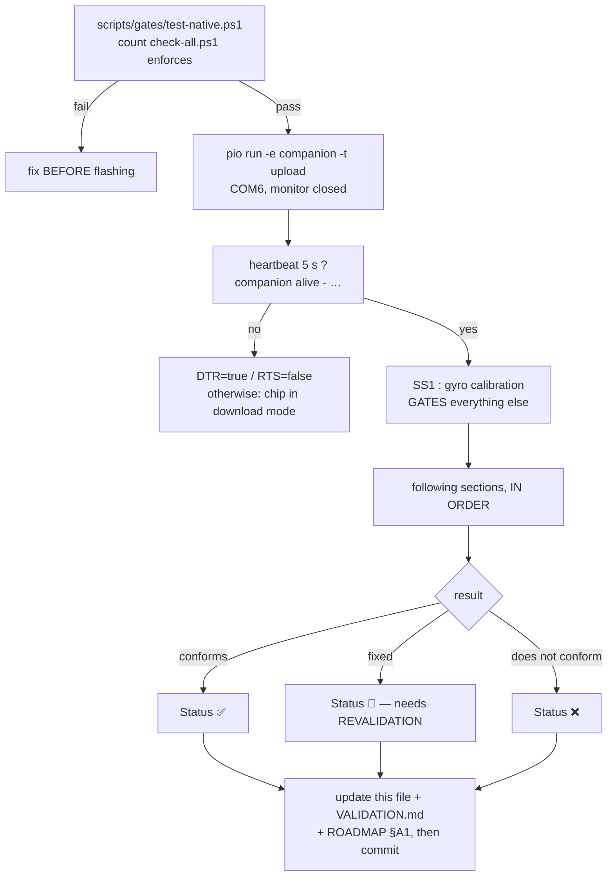

> **English** · [Français](PLAYBOOK-HW.fr.md)

# PLAYBOOK-HW.md — hardware validation checklist

> Table format: fill in / update the **Status** column (and **Notes** when
> useful) on every attempt. Work through the sections IN ORDER (§1 gates
> everything else). After EVERY test session: update this file +
> `VALIDATION.md` (summary dashboard) + `docs/ROADMAP.md` §A1, then commit
> (no accented characters in `git commit -m` under PowerShell).

**Status legend**: 🔲 to test · ⏳ in progress · ✅ validated · 🔧 fixed (needs
revalidation) · ❌ confirmed failure

The cycle of a validation session. The order is not decorative: §1 calibrates
the gyro mapping, and **everything** else depends on it — a miswired VOR makes
sections fail that have nothing to do with it.



## Automated gates

Five checks existed and were run by hand, i.e. run when someone remembered.
`scripts/check-all.ps1` is the single entry point and `-Hook` installs it as a
git **pre-push**, so remembering stops being part of the process
(`git push --no-verify` bypasses it once, deliberately).

| Gate | What it proves |
|---|---|
| `check-doc-parity.py` | every `*.md` has its `*.fr.md` twin, section for section |
| `check-contrast.py` | the four themes hold their contrast ratios |
| `check-vendored.py` | the **five** copies embedded in `SceGuest.h` (`Yaml.h`, `I18n.h`, `FirmwareInfo.h`, `Trace.h`, `Gesture.h`) have not drifted from their `firmware/common/` originals — the divergence that rule 17 was written about. They exist only so the stub stays copyable alone into a third-party project, which is exactly why they cannot be left unwatched |
| `check-mirrors.py` | the constants the choreography editor **restates by hand** still match the firmware (`YAW_RANGE`, the pitch offsets, `MAX_KEYS`, `MAX_NAME`). The editor cannot include `Units.h`, and its own comment names the failure: showing them "avoids writing a CSV that the robot would silently clip". Whenever a bound like `YAW_RANGE` changes, BOTH sides have to be edited; missing one would let the editor keep authoring dances the robot trims without a word. It holds the same line on `MIN_SUITES`/`MIN_TESTS` across the `.ps1`/`.sh` twins, the board USB VID/PIDs, the `rules.txt` template, every console slider default, and the two `CLAUDE.md` — plus one rule that is no constant at all: **a guest `main.cpp` calling `xTaskCreate` must wire `guest.netGuard`**, because a cooperative stop applied to one bin and forgotten in another is precisely how the road back to the companion once took ten minutes |
| `pio test -e native` | **The suite/case COUNT is asserted** (`$MIN_SUITES`/`$MIN_TESTS` in `check-all.ps1`), **with ONE announced retry.** `pio test` exits 0 when everything it RAN passed, which says nothing about what it did not run — a suite that stops being picked up must fail the gate instead of vanishing.
**The harness is intermittently unreliable on Windows** when it runs all suites in sequence: a run can report far fewer cases/suites than expected, with some suites `ERRORED`, while each of those suites PASSES alone (`pio test -e native -f test_behavior`) — so it is the harness or the filesystem, not the code. Hence one retry — a gate that fails at random is a gate people learn to ignore — and hence the retry is always ANNOUNCED, because a retry that hides the flake is how a real regression gets waved through |
| build ×6 | companion, the three guest bins AND both Fire variants still link - the variants are here because nobody builds them until they have the board in hand, and an unclosed #if does not show on the main target |
| `check-a222.py` | **A2.22 verified in the LINKED BINARY**: it counts the calls to a drawing primitive inside a symbol and compares with the design. GCC 8.4 Xtensa drops the second of two similar calls, which no amount of source review can see — this reads the ELF |

`check-comments-only.py` is deliberately **not** in the gate: it proves a change
touched comments only, so it exits 1 as soon as code changed, which is the
normal case. It is a tool for one kind of sweep, not a gate — putting it in the
list made the gate fail on its own first run.

## Prerequisites (environment reminders)

- Firmware: env `companion`, port **COM6** (CoreS3 USB-JTAG).
  `& "$env:USERPROFILE\.platformio\penv\Scripts\pio.exe" run -e companion -t upload --upload-port COM6`
  ⚠ Close every serial monitor before uploading (port busy).
- Serial 115200: **DTR=true, RTS=false** on open (DTR+RTS together = the
  esptool bootloader sequence → chip stuck in download mode). Heartbeat
  every 5 s:
  `companion alive - emotion:X ip:X sd:0|1 heap:... heapMin:... stk*:... frame ... uptime:...`.
- Native tests before any flash: `.\scripts\gates\test-native.ps1` (the count
  `check-all.ps1` enforces — see `$MIN_SUITES`/`$MIN_TESTS`).
- **After every flash, confirm what is running** — a successful upload does not
  prove the board boots it. `pio -t upload` writes one OTA slot (`app0`) and
  never touches `otadata`, which chooses the slot; a guest handing the robot
  back reflashes `/companion.bin` from the SD card over it. Both leave a
  verified esptool hash and a robot back on WiFi.
  `curl -s "http://<ip>/api/firmware"` → `slot` names the booted partition;
  `sha` must equal `sha256sum .pio/build/companion/firmware.elf` (first 8 hex)
  and `console` the digest printed by
  `python scripts/build/gen_console_gz.py --check`; `reset` says why the board
  last started (`panic`/`task_wdt`/`brownout` = a crash).
- API: AP mode `StackChan-AP` / `goodlife` → `http://192.168.4.1`; STA mode
  → `http://stackchan.local/` or the IP from the heartbeat. Console `/`, live
  tuning `POST /api/tuning?key=value`, telemetry `POST /api/tuning?telemetry=1`
  (serial at 10 Hz: `gX/gY/gZ` raw gyro, `headVelX/Y` mapped, `vorX/Y`,
  `tiltX/Y`, `gazeX/Y`, `openL`).

---

## 1. Gyro mapping calibration + efference — ✅ SECTION VALIDATED

Default mapping validated on hardware: yaw=gyro.y+, pitch=gyro.x+,
adjustable live without reflashing (`gyro_yaw_axis/sign`,
`gyro_pitch_axis/sign` — console buttons in the "Calibration VOR" section).
Recorded in `CONVENTIONS.md §3`.

| # | Test | Procedure | Success criterion | Status | Notes |
|---|---|---|---|---|---|
| 1.1 | Telemetry on | `POST /api/tuning?telemetry=1` (or the console button) | 10 Hz serial stream visible | ✅ | |
| 1.2 | Boot bias/baseline | Robot held still ~3 s after reset | `headVelX/Y`≈0 (±0.5), `vorX/Y` stable | ✅ | |
| 1.3 | Yaw axis + sign | Turn SLOWLY toward the viewer's RIGHT; adjust `gyro_yaw_axis`/`gyro_yaw_sign` if needed | `headVelX>0` and `vorX<0` during the rotation | ✅ | defaults confirmed (axis=1/Y, sign=+1) |
| 1.4 | Pitch axis + sign | Tilt the head UP; adjust `gyro_pitch_axis`/`gyro_pitch_sign` | `headVelY>0` and `vorY<0` | ✅ | defaults confirmed (axis=0/X, sign=+1) |
| 1.5 | VOR, visually | Slow rotations + a held tilt | Visible counter-rotation, crisp catch-up saccade, compensation HELD (no drift back to zero) | ✅ | |
| 1.6 | Recorded | — | Mapping written in `CONVENTIONS.md §3` | ✅ | |
| 1.7 | Servo efference (head-follow) | `POST /api/tuning?head_follow=1`, watch the eyes during a head-follow move | Eyes NOT disturbed by the servo motion itself | ✅ | VOR integrates DURING servo moves (efference subtracted); `selfMotion` only inhibits shake detection |

---

## 2. Idle behavior + blink (P2)

| # | Test | Procedure | Success criterion | Status | Notes |
|---|---|---|---|---|---|
| 2.1 | 10 min idle | Watch without interacting | Fixations HELD (zero drift), crisp saccades + micro-overshoot, micro-jitter only after > 2 s of fixation | ✅ | |
| 2.2 | Squash & stretch | Watch during a saccade | H stretch + V squash (~10 %), elastic return | ✅ | |
| 2.3 | Sleepy "struggle" | `POST /api/emotion?name=Sleepy&ms=30000` (or wait for the roulette) | Slow droop → collapse → laboured reopening (1-2 hiccups) → ceiling ~70 % → droop again; ~1 in 4: a startle held ~1 s; soft exit (360 ms, no snap) | ✅ | eyelid shape: see 4e.5 |
| 2.4 | Blink policies + Cozmo line | `name=Surprised`/`Dead`/wink; watch a full blink (also on Happy/Glee/Blush — flat eye bottom) | Clean closure; **both eyes fully closed = ONE full-width 1 px line, sitting on the BOTTOM EDGE of the eyes** — the lid falls and the line lands where it ends up (slit → line continuity; on Happy/Glee/Blush the line = the first pixel of the eye bottom); a wink keeps per-eye rendering | ✅ | line sits on the bottom edge (`EyeRig::bottomEdgeY`), not the eye centre |
| 2.5 | Adjustable right-eye lag | `POST /api/tuning?blink_lag_ms=0..150` | Lag adjustable, 0 = synchronous | ✅ | default 30 ms |
| 2.6 | Blink rate | `POST /api/tuning?blink_median_ms=1500`, then put 3500 back | Visibly more frequent blinks at 1500 | ✅ | |
| 2.7 | Eye corners (overflow) | Watch Scared + during blinks | No break in the outline, no overflow; BOTH eyes keep their width when the gaze shifts | ✅ | a break at the slope/corner junction or a shrunken eye against a fixed midline are the two known failure modes if this regresses |
| 2.8 | Drooping eyelids | Watch a slow blink (`blink_median_ms=1500`) and Sleepy | Closure comes ONLY from the top — the BOTTOM edge of the eye never rises; the "closed" line lands on the bottom edge (slit→line continuity) | ✅ | `lid` channel anchored at the bottom |

---

## 3. Physical IMU reactions (P3)

| # | Test | Procedure | Success criterion | Status | Notes |
|---|---|---|---|---|---|
| 3.1 | Shake → Scared | Shake firmly for > 0.5 s | Scared ~2 s then the roulette resumes; tuning via `shake_gyro_thr` | ✅ | threshold 35, 3-axis magnitude, selfMotion guard |
| 3.2 | Held static tilt | Tilt the robot and HOLD | Eyes hold the compensation, stable (no tremor) | ✅ | depends on §1.5 |
| 3.3 | Reflex preemption | `POST /api/emotion?name=Happy&ms=30000` then SHAKE (Scared immediately); then LIFT (Curious immediately); wink in progress + shake = cut dead; dance + shake = immediate abort | IMMEDIATE cut in every case, shake takes priority over lift | ✅ | |
| 3.4 | Pickup → Curious + dangling feet | Lift the robot | ~0.5 s: Curious + head raised + servos freewheeling; carrying it = Curious sustained; put it down + 1 s stable = torque re-engaged and behaviour resumes | ✅ | thresholds 0.08 g/120 ms, lift −14°, release 250 ms |
| 3.5 | Boot (gyro bias) | Do not touch the robot for ~3 s after reset | Bias calibrated correctly | ✅ | |
| 3.6 | VOR depth effect | Watch one eye during a VOR compensation | No change of proportion: a PURE offset of both eyes | ✅ | the eyes share a movable midline, not a fixed screen centre — a width change on one eye means that clamp regressed |

---

## 4. Servo (P4a)

| # | Test | Procedure | Success criterion | Status | Notes |
|---|---|---|---|---|---|
| 4.1 | Neutral at boot | Watch the robot start up | Head at HOME (yaw 166, pitch 93) with no jolt | ✅ | |
| 4.2 | Head-follow | `POST /api/tuning?head_follow=1`, hold an off-centre fixation ~1 s | Head turns gently (600 ms) toward the gaze direction, eyes re-centre during the rotation, max rate 1 per 2.5 s | ✅ | `head_follow=1` is the compiled default — the "eyes lead, head follows" loop is the Cozmo heart of this project. ⚠ An SD `config.yaml` carrying an explicit `head_follow: 0` overrides the default — push it back to 1 through the API (persisted) if so |
| 4.5 | Yaw amplitude ±130 | `POST /api/servo?yaw=N&pitch=93` at 196, 226, 256, **296** then 136, 106, 76, **36**, reading `/api/status` within 8 s (`head_home_ms` returns the head home after that) | Every commanded angle is echoed back unchanged; **320 clamps to 296 and 10 clamps to 36** | ✅ | |
| 4.6 | Measured pose vs commanded | `POST /api/tuning?servos=0` then `GET /api/servo/pos` | `valid:true` and `yaw`/`pitch` within ~1° of `cmdYaw`/`cmdPitch`. With `servos=1` it must answer `valid:false` — the bus is write-only in operation | ✅ | |
| 4.7 | Sensor blind sector | With `servos=0`, turn the head a FULL revolution by hand while polling `/api/servo/pos` | The reading sweeps 0…300 and then **decouples**: the SCS0009 potentiometer has no track over the remaining ~60°, so the angle jumps instead of wrapping | ✅ | this is WHY the position is ambiguous after several turns, and why `YAW_RANGE = 130` around 166 keeps `[36, 296]` entirely inside the readable arc |
| 4.3 | Safety clamps | Extreme movements | Never exceeds yaw **36-296°** (±130) / **pitch 19-99°** (`PITCH_MIN`/`PITCH_MAX`, `Units.h`) | 🔧 | the pitch bounds mirror the official M5Stack spec (Y 5~85°, raw ≈ 104 − official) — the physical end stops 14/104 stall the servo and can damage it, never hold against them for a probe; needs a dedicated re-check against the current bounds (posture-driven moves are covered separately by 4f.18) |
| 4.4 | Smoothness + auto-release | Watch trajectories + a long idle period | Smooth 50 Hz trajectory, no buzz; torque released after `servo_idle_release_ms` (4000 ms) and re-engaged on the next move | ✅ | an SD `config.yaml` written under an older `CFG_VERSION` migrates its stored delay to the current default at load time |

---

## 4b. Dances (P4b) — `GET /api/dances` for the list

| # | Test | Procedure | Success criterion | Status | Notes |
|---|---|---|---|---|---|
| 4b.1 | Playable dances (15) | `POST /api/dance?name=X`: happy, robot, panic, nod, lookAround, shakeNo, greet, laugh, thinking, shy, shocked (+ wiggle/peek → 4e.6, furious → 4e.13, cry → 4g.8) | Soft return to neutral + Normal (roulette resumes) | ✅ | |
| 4b.2 | Random mirrored direction | Replay happy/robot/panic/lookAround/shakeNo/thinking/shy several times | Starting direction L/R unpredictable (50/50 draw) | ✅ | |
| 4b.3 | "Eyes lead, head follows" gaze | Watch thinking/lookAround/happy | The eyes AIM at the target BEFORE the head gets there (80 ms saccade), not merely tagging along with the servo pose | ✅ | the eyes-lead keyframe target keeps the gaze from being slaved to the instantaneous servo pose |
| 4b.4 | NOD/SHY gaze dive | Watch nod, shy | The eyes dive (the servo does not go below the horizon) | ✅ | |
| 4b.5 | Lively panic | `POST /api/dance?name=panic` | LIVELY agitation, movements actually reached | ✅ | |
| 4b.6 | Preemption during a dance | Dance + shake (abort + Scared); dance + lift (abort + Curious + dangling feet); `POST /api/dance?name=stop` | Immediate cut in every case | ✅ | |
| 4b.7 | VOR during a dance | Dance without touching the robot | No false Scared (efference / `selfMotion` guard) | ✅ | if a false Scared shows up: redo §1 |
| 4b.8 | Trajectory smoothness | Watch the transitions between keyframes | Smooth 50 Hz, no jolt | ✅ | |
| 4b.9 | `shocked` dance | `POST /api/dance?name=shocked` | Surprised snaps in, crisp −14° recoil, double blink held high, held ~3 s, return + blink | ✅ | |

---

## 4c. Touch + Launcher + LEDs + Sound (P5)

| # | Test | Procedure | Success criterion | Status | Notes |
|---|---|---|---|---|---|
| 4c.1 | Si12T head stroke | Stroke / slide forward on the head | Stroke → Happy 3 s + left wink; forward slide → Glee + right wink | ✅ | |
| 4c.2 | Screen gestures | Tap centre (blink), tap L/R (wink), swipe L/R (emotion ±1, 8 s), swipe UP (random dance), swipe DOWN (Launcher) — all in the EYE ZONE (y < 160); inside the status bar (y ≥ 160): swipe L/R = cycle the modes, vertical swipes INERT | Every gesture responds IMMEDIATELY, even during an animation or a dance (rule: interactions take priority) | ✅ | |
| 4c.3 | SD Launcher | Prepare `/bins/` (≥1 .bin, e.g. `pio run -e imu-test` → copy the firmware); swipe down | Eyes close → paginated list → [SauverFW] writes `/companion.bin` → Cancel/Quit resumes cleanly → 30 s timeout → an oversized .bin is refused → [LANCER] flashes and reboots (to come back: hold BtnA at boot) | ✅ | |
| 4c.4 | LEDs | `POST /api/tuning?leds=1` then `leds=0` | Colour = exactly what the screen shows, **with no perceptible lag**; gradual brightness, ramp speed ∝ intensity; smoothed pulse; clean fade to off | ✅ | LED write rate gated at 40 Hz (25 ms) to stay ahead of the 30 Hz screen; the I2C stays light (~3 ms per frame) |
| 4c.5 | Sound (chirps) | `POST /api/tuning?sound=1&sound_volume=96` then `sound=0` | A chirp on EVERY emotion change (rising=joy, falling=sad, buzz=anger, trill=fear, "?!"=Surprised, sigh=Sleepy); silence when idle; 400 ms throttle | ✅ | |

---

## 4d. Web / persistence / [Bins] API (P6)

| # | Test | Procedure | Success criterion | Status | Notes |
|---|---|---|---|---|---|
| 4d.1 | Tuning persistence | `POST /api/tuning?leds=1` → reset → `GET /api/tuning` | `leds=1` still there after reboot; **SD write with no error burst and no display freeze** (10 saves back to back) | ✅ | see 4d.2 for the freeze/error mechanism |
| 4d.2 | SD write without freeze/error | `POST /api/wifi?ssid=X&pass=Y` → reset | STA mode, IP in the status bar / heartbeat, fallback to AP if it fails for 10 s; SD write with no error burst and no display freeze | ✅ | the failure mode is CONTENTION on the SPI2 bus shared between LCD and SD, not the SD clock frequency — a write that coincides with a renderer push makes the card protocol fail. `renderer.pause()`/`resume()` around every deferred SD write/read (the same guard the Launcher uses) is the fix. A single-hundred-ms spike on the very FIRST read right after a write burst, not reproduced on immediate re-reads, is expected card housekeeping rather than a contention regression |
| 4d.3 | [Bins] API | `GET /api/bins`; upload `curl -F "file=@fw.bin" http://IP/api/bins`; `DELETE /api/bins?name=X`; `POST /api/bins/launch?name=X` | Shows up in the list + in the touch launcher; launch → 202 then flash+reboot ~2 s; refused if larger than the OTA partition (log `REFUSE`) | ✅ | route-order regression class: see ROADMAP §A2.19 — `/api/bins/launch` and `/api/bins/stop` must stay registered BEFORE `/api/bins` (upload) or ESPAsyncWebServer's BackwardCompatible matching swallows them |
| 4d.4 | Embedded console | `http://IP/` (AP mode, no internet) | Live telemetry band (heap+frame graph, status chips, icon pills) above the four tabs; CRT/LEDs/sound/telemetry/head-follow state toggles in sync; head pad in Pilot; tuning as a table (id/default/slider/description) under Options; the card's files in Files | ✅ | |
| 4d.5 | Captive portal | Connect to the `StackChan-AP`/`goodlife` hotspot | The OS offers "sign in", or any URL redirects to the console | ✅ | |
| 4d.6 | mDNS | STA mode, `http://stackchan.local/` | Responds (on Windows: needs Bonjour, otherwise test from a smartphone) | 🔲 | |
| 4d.7 | Swagger / OpenAPI | `http://IP/swagger`; `GET /api/openapi.json` | Swagger loads (STA, browser has internet); valid JSON in AP as well as in STA | ✅ | |
| 4d.8 | SceGuest | Build a .bin with `src/guest/SceGuest.h`, launch it, then `POST http://guest-IP/api/bins/stop` | Reflashes `/companion.bin` + reboots (the file must already be on the SD card) | ✅ | optional, needs a home-made bin; depends on the 4d.3 route order on the companion side |
| 4d.9 | SD template | Copy the contents of `sdcard/` to the root of the card | Boots with `sd:1` in the heartbeat + `config.yaml chargée` in the logs | ✅ | |
| 4d.10 | Servo remote | Console pad ←→↑↓/⌂, or `POST /api/servo?dyaw=&dpitch=` | Motion goes the expected way (← = head toward the viewer's left) | ✅ | |
| 4d.11 | Reload SD config | Console "↻ Relire config.yaml" or `POST /api/config/reload` | 202, tuning from the card applied live in ~1 s (wifi: at restart); 503 with no SD card | ✅ | same A2.19 route-order class as 4d.3: must be registered before `/api/config` |
| 4d.12 | SD choreographies | Copy `sdcard/dances/exemple.csv` → SD `/dances/` (or upload from the console); `POST /api/dance?name=exemple` | Dance plays (random mirroring); listed in `GET /api/dances` + in the console; ✕ deletes it; re-uploading the same name replaces it; a Normal exit keyframe is appended if missing; a malformed file is ignored with a log line | ✅ | `/api/dances/files` shares the A2.19 route-order class with 4d.3/4d.11 |
| 4d.13 | Console = 100 % of the API | Walk through the console | Every endpoint has its control, in the four tabs: Pilot (emotions, dances, animations, head pad, status band, rules), Options (option toggles, camera, tuning table), Files (dances, bins, config, rules — ▶/🚀/↻/✕/import), System (NTP, CORS, wifi, VOR, Basic Auth, OTA, language, config reload, restart/power off), plus the shared telemetry band (heap+frame graph, chips) | ✅ | |
| 4d.14 | Si12T I2C noise | Watch the serial output while idle | `Wire Error 263` (Si12T requestFrom timeout) shows up in waves about every 1.3 s: NO functional impact (heap/uptime stable, touch fine) — known log noise | ✅ | noise accepted (benign) |
| 4d.15 | A pulled card is NOTICED | With the robot running, pull the microSD out and wait ~3 s | Serial `[board] SD RETIREE`; `/api/status` flips to `sd:0` and the console stops offering the files | 🔲 | without this check a pulled card leaves `sd:1` stale and an upload into the stale mount freezes the renderer for several seconds on timeout |
| 4d.16 | A re-inserted card comes BACK | Put it back, wait ~3 s | Serial `[board] SD REMONTEE`; `sd:1`, the file list is right again, and an upload to `/api/sd/put` succeeds WITHOUT a reboot | 🔲 | a flag that only ever goes false would make the first removal permanent; the tick does `end()` + `begin()`, since the driver holds a mount that no longer describes anything |
| 4d.17 | The probe costs nothing while idle | Watch `frameAvgUs` in `/api/status` over a minute, card in place | Unchanged (~26 ms), no periodic stutter | 🔲 | 3 s tick, renderer paused only around the probe — a probe that pauses on EVERY loop pass costs several ms a frame instead |
| 4d.15 | ESPAsyncWebServer routing — no regression | `GET /api/tuning`, `POST /api/dance?name=X` (built-in), `GET /api/dances/files`, `POST /api/dances/reload`, `DELETE /api/dances/file` | No "parent" endpoint (`/api/config`, `/api/dances`, `/api/bins`) mistakenly swallows a "child" endpoint registered after it — see ROADMAP §A2.19 for the general rule | ✅ | |

---

## 4e. Overlay effects + the Blush emotion (T7)

| # | Test | Procedure | Success criterion | Status | Notes |
|---|---|---|---|---|---|
| 4e.1 | Blush | `POST /api/emotion?name=Blush` | Pink Happy eyes + 3 pinkish diagonal strokes under each eye + shy vertical oscillation | ✅ | roulette weight 0.04 |
| 4e.2 | Sparkles + the Excited star | `name=Excited` or `name=Awe` | A CRISP ✦ star on black (no yellow above or below the points); follows squash and the eyelid; 3 sparkles near the eye corners | ✅ | the star draws ALONE (A2.17) — a background shape drawn underneath it would stick out of its concave cut-outs |
| 4e.9 | Eye equidistance | Cycle through the 30 emotions (swipe L/R) | The CENTRE of each eye stays in the same place for ALL emotions (continuity, never touching) — only sizes/shapes/heights change. Intended exception: Nervous (small eye pulled inward, edge-to-edge spacing stays standard) | ✅ | preset discipline: `mirrored` inverts OffsetX rather than cancelling it |
| 4e.10 | Adjustable spacing | Console slider `eye_spacing` (or `POST /api/tuning?eye_spacing=N`, 0..44) | N = EDGE-TO-EDGE gap in px (widest preset) — **0 = the edges touch** (never overlapping, GAP-1 guard at 0), **14 = the default**, 44 = max; live, persisted to SD | ✅ | ⚠ an SD `config.yaml` carrying an explicit `eye_spacing: 0` gives GLUED eyes — set 14 again via the slider/API if so |
| 4e.11 | Sleepy aligned at the bottom | `name=Sleepy` | The BOTTOM edge of the half-closed eyelids stays at the height of the bottom of a Normal eye (the lid falls, the bottom does not move); blink line at the CENTRE of the eyes (2.4) | ✅ | presets OffsetY −19/−23 |
| 4e.3 | Sweat | `name=Scared`, `Worried` or `Frustrated` | A blue drop beads at the top right of the right eye then slides down (2.4 s cycle) | ✅ | |
| 4e.4 | Fade + CRT + no residue | Change emotion several times, with and without CRT on | Fade-in (no pop), the effect is visible through the CRT post-process, no residue after an emotion change | ✅ | |
| 4e.5 | Sleepy without a stroke | `name=Sleepy` | Flat half-closed Cozmo-style lids, NO leftover stroke under the eyes | ✅ | Sleepy/Alt presets carry zero bottom slope |
| 4e.6 | `wiggle`/`peek` dances | `POST /api/dance?name=wiggle` / `peek` | wiggle: rhythmic ±8° yaw wiggle + a wink (Cozmo signature); peek: slow 30° slide + suspicious freeze ~2 s + CRISP re-centring + blink | ✅ | |
| 4e.7 | Awe/Disgust without a stroke | `name=Awe` then `name=Disgust` | No "stroke" under the eyes; Awe: distinctly rounder corners, trapezoidal silhouette preserved | ✅ | both share Slope_Bottom = 0 with the Sleepy/Scared family |
| 4e.8 | CRT dot mask | `POST /api/config?crt=1` | A "phosphor dot matrix" look (discrete dots + dark gutters); trail + halo unchanged; frame stays under the 33 ms period with CRT on | ✅ | frame avg with CRT on stays under the 33 ms period with margin; the mask loop could be optimised further if that margin ever tightens |
| 4e.12 | Nervous (ex-Squint) | `POST /api/emotion?name=Nervous` | CRISP entry (STRONG transition) + fast horizontal tremor of both eyes (150 ms, asymmetric 7/4 px) + the small eye PULLED INWARD (spacing close to standard) | ✅ | |
| 4e.13 | `furious` dance | `POST /api/dance?name=furious` (with `leds=1` for the crescendo) | Cartoon pressure cooker: tight tics building up, the head climbing notch by notch (−2°→−24°), LEDs getting brighter (steps Annoyed→Frustrated→Angry→Furious + pulses), a ~0.4 s suspension, EXPLOSION (±20° spasms), a deflated collapse + Normal | ✅ | 14th dance, mirrorable |

---

## 4f. Eye art direction (ref. docs/assets/cozmo.jpg)

| # | Test | Procedure | Success criterion | Status | Notes |
|---|---|---|---|---|---|
| 4f.1 | Lively asymmetric Normal | `name=Normal`, come back to it several times | Eyes CENTRED vertically; ONE of the two (the side changes randomly from one episode to the next) is slightly shorter in height (92 vs 100); the heights "breathe" TOGETHER (same rhythm, same phase, different amplitudes); widths STRICTLY constant | ✅ | Preset_Normal_Alt; common period 1000 ms |
| 4f.2 | Glee in the upper half | `name=Glee` | The eyes (oscillation included) stay in the UPPER half of the 320×160 zone | ✅ | OffsetY +40 |
| 4f.3 | Sad looking at the sky | `name=Sad`, wait for a fixation UPWARD (~1 fixation in 3-4); to force it: tilt the robot forward (the VOR raises the gaze) | Gaze low/centre: the current Sad shape; gaze rising: the eyes GROW into the Scary shape (inverted bevel) — "he is looking at the sky"; soft return on the way back down, no flapping | ✅ | MoveY hysteresis 3/1.5 px (fixations bias toward the centre, so a wider hysteresis almost never triggers), SOFT transitions |
| 4f.4 | Worried/Annoyed/Smug alignments | `name=Worried`, `Annoyed`, `Smug` | Worried: the BOTTOM edges of both eyes aligned; Annoyed: TOP edges aligned; Smug: both eyes CENTRED vertically | ✅ | preset OffsetY |
| 4f.5 | Surprised outer corners | `name=Surprised` | The TOP OUTER corners clearly rounder than the inner ones — a full quarter circle (the widening "opens" toward the temples) | ✅ | Radius_Top_Outer 56 |
| 4f.6 | Awe = Surprised inverted | `name=Awe` | An exact vertical mirror of Surprised: same 112×112 template, the very round outer corner at the BOTTOM instead of the top; **NO stroke** (zero slope) | ✅ | |
| 4f.7 | Scared touched up | `name=Scared` | Taller (85), bottom almost square (like Suspicious), top DOMED: the highest point is the MIDDLE of the eye | ✅ | Radius_Top 48, zero slope (a break in the outline is impossible) |
| 4f.8 | NEW Squint | `POST /api/emotion?name=Squint` | Concentrated squint: the Focused silhouette WITHOUT the top slope, bottom slope with the MIDDLE OF THE FACE at its lowest / the outer sides high (+0.28), thinner (28 px); rare blinks (÷2) | ✅ | emotion 29 |
| 4f.9 | Curious edge eye | `name=Curious` (or lift the robot), gaze to one side | The eye nearest the edge on the gaze side becomes bigger; the other stays normal; soft switch when the gaze crosses the centre | ✅ | hysteresis ±12/6 px; the STATIC asymmetry on entry (see 4g.6) must hold even with a centred gaze |
| 4f.10 | Asynchronous Sleepy | `name=Sleepy`, watch for ~20 s | Each eye falls asleep and fights back ON ITS OWN CYCLE (two independent machines: droops, collapses and startles never simultaneous); the height BREATHING stays synchronised (amplitudes 6/8, same phase); **the BOTTOM edges stay ANCHORED**; **the eyes never quite CLOSE**: collapses stop at 1-2 px (a struggle floor, no blink line) | ✅ | 4e.5/4e.11 still hold; SL_FLOOR 0.08; 2 machines per eye |
| 4f.11 | Random mirroring of asymmetries | Cycle several times through `Annoyed`, `Smug`, `Questioning`, `Contempt`, `Nervous` — AND through symmetric emotions that have slopes (`Angry`, `Sad`, `Furious`, `Scary`) | From one episode to the next, the "carrying" eye (small/squinted/big) switches side at random; on Nervous the small eye stays PULLED IN toward the centre whichever side it is on; on Angry/Sad & co. the slopes ALWAYS fall toward the middle of the face (never outward), whatever the draw | ✅ | `FaceState.asymMirror`; the mirror geometry is ANATOMICAL (slopes/OffsetX never flip with the mirror flag) |
| 4f.12 | Emotion↔dance mirror sync | Play a mirrorable dance (`wiggle`) several times with an asymmetric emotion | When the dance starts in the mirrored direction, the eye asymmetry flips to the SAME side (the carrying eye follows the movement) | ✅ | asymMirror = _danceYawSign < 0 |
| 4f.13 | LED bars ∝ eye height | `leds=1`, watch blinks/winks (automatic or `POST /api/wink?eye=left`) | Each bar tracks the HEIGHT of its own eye: left bar ↔ left eye, right ↔ right eye. Eye closed (blink/wink) → bar OFF; wide open → maximum brightness; proportional in between. `led_swap=1` if L/R are swapped | ✅ | `Renderer::eyeOpenL/R` → `EmotionLeds` per bar |
| 4f.14 | LED colour to the tick | `leds=1`, change emotion (different colours, e.g. Normal→Angry) | The LED colour moves EXACTLY in step with the eye colour throughout the transition (no perceptible lag) | ✅ | written immediately on a colour change; brightness alone stays at 40 Hz |
| 4f.19 | API/console reboot + microphone states | Console: the "⟳ Reboot" button (with confirmation); state panel, "micros" cell: `sound_track` OFF, then ON during boot, during a chirp (`sound=1`), then in steady state | Reboot: 202 then a restart in ~1 s (`POST /api/reboot` behaves the same); microphones: "off" (option disabled) → "warming up… (Ns)" with a countdown during the boot guard → "standby (haut-parleur)" during a chirp → live `L x · R y · amb · évts` levels in steady state (this is the only state that is not greyed out) | ✅ | `mic` states BY NAME (off/warmup/standby/actif) + `micWait` (single source in the firmware) |
| 4f.18 | Head posture per emotion (home 93°) | `name=Sad`, `Sleepy`, `Blush` then `Smug`, `Excited` (servo on) | Home = head slightly raised (93°); Sad/Sleepy/Blush/Worried: the head LOWERS gently (up to +6°, the downward travel is SHORT); Smug/Excited/Awe: chin up; return to home on Normal; head-follow keeps the bias | ✅ | PITCH_NEUTRAL 93, **PITCH_MIN 19 / PITCH_MAX 99** (M5Stack spec Y 5~85°, raw ≈ 104 − official; the end stops 14/104 STALL the servo), `Brain::pitchBiasFor` |
| 4f.17 | Sound tracking (2 microphones) | `sound_track=1` (console toggle) then: clap softly on one side, loudly on one side, VERY loudly (> `soundtrack_shock_thr`) in front | The head turns toward the sound: step ∝ the L/R imbalance and speed ∝ the intensity (soft = a small soft step, loud and off to the side = a wide brisk step); it stops facing the source (levels balanced); a continuous background does not trigger it (ambient gate, see `évts`); **a shock-level sound → STARTLE: the `shocked` dance plays (crisp recoil + blinks), THEN the head turns toward the source**; direction is `soundtrack_sign=+1`; dances/pickup/shake take priority; with `sound=1`, chirps and listening coexist (standby ~300 ms); **MUTED WHILE MOVING**: the servo/gear noise picked up during a turn does NOT trigger another turn (events ignored while the trajectory is in flight + 350 ms — no self-chasing, the return to home is not delayed) | ✅ | 5 `soundtrack_*` tunings |
| 4f.16 | Firmware OTA (console + API) | Console → "Firmware — mise à jour OTA" → pick `.pio/build/companion/firmware.bin` → Flash (or `curl -F "firmware=@firmware.bin" http://<ip>/api/update`) | Progress bar; during the flash the screen shows "…" (3 centred rounded squares, MOTIONLESS, LEDs off); 200 + automatic reboot (~1 s after the response), the console comes back on the new firmware; an invalid `.bin` → 500 + a message and the face resumes; an upload cut mid-way → automatic abort (10 s) + the face resumes | ✅ | `POST /api/update` + `Renderer::setBusy` |
| 4f.15 | CENTRED closure (12 emotions) | Blinks/winks on `Normal`, `Surprised`, `Awe`, `Nervous`, `Excited`, `Questioning`, `Curious`, `Doubt`, `Contempt`, `Smug`, `Dead`, `Squint` | The closure converges toward the VERTICAL CENTRE of the smaller eye of the pair (both eyes meet on the same line, winks included); on the flat-lid emotions (Happy/Glee/Sleepy…) the historical BOTTOM anchoring is unchanged; slit → line continuity preserved | ✅ | `LidCenter/LidAnchorY` |

---

## 4g. Additional sensors + the Curious/Questioning fix

| # | Test | Procedure | Success criterion | Status | Notes |
|---|---|---|---|---|---|
| 4g.1 | Battery (API + console) | `GET /api/status` (`batt`, `chg`); console: the "batterie" cell | Sensible %, `chg=1` on mains/USB; cell turns red at ≤15 % when not charging | ✅ | |
| 4g.2 | Low-charge warning | Discharge below 15 % without charging | The screen banner "BATTERIE FAIBLE N%" replaces the normal banner | 🔲 | not testable without a real discharge |
| 4g.3 | Night volume (solar) — **decision** | `GET /api/sensors` → `clock` (non-zero = NTP synced) and `night`. Then `POST /api/tuning?lon=<lon-180>` and read `night` again, and restore | `night` flips 0 → 1 at the antipode and back. `clock` = 0 means NTP never synced, which is itself the answer to "why is it still loud" | ✅ | |
| 4g.9 | Night volume — **audible** | With `sound=1`, trigger a chirp while `night:1` (antipode trick above works at any hour) | Chirp volume = `sound_volume_night` (32) instead of `sound_volume` (96) | 🔲 | the decision is validated (4g.3); this is the volume itself, by ear |
| 4g.4 | Double-tap → Happy + wink | Tap the shell twice, firmly | Happy 3 s + wink, within the 500 ms window between the two taps | ✅ | |
| 4g.5 | Face-down → Sleepy held | Lay the robot screen-down for ~1.5 s | Sleepy held as long as it stays down; normal behaviour resumes as soon as it is turned back up | ✅ | |
| 4g.6 | Curious static asymmetry | `name=Curious` with a CENTRED gaze (do not provoke an off-centre saccade) | One eye clearly bigger than the other AS SOON AS it activates (not only when the gaze deviates) | ✅ | sizes Big 104×105 / Normal 68×92 radius 18 |
| 4g.7 | Questioning size aligned | `name=Questioning` right after `name=Curious` | The big/small eye sizes look comparable between the two emotions; the big eye's slope has no break in the outline | ✅ | |
| 4g.8 | `cry` dance | `POST /api/dance?name=cry` | Head drops to the stop → 2 sniffles (pitch hiccups) → a long hold (~3 s) down there → return to home + Normal | ✅ | 15th dance |
| 4g.10 | BMM150 magnetometer — the SENSOR, not the field | `.\scripts\dev\test-mag.ps1` (over HTTP — a serial open RESETS the board). Phase 1 rest: samples must be alive; phase 2: bring a magnet/steel to ~2 cm during the capture | Phase 1 VIVANT (distinct samples, non-zero norm), phase 2 REACTIF (excursion ≫ resting noise). A norm ≫ 65 µT is the K151's magnetised environment, NOT a sensor fault — the heading verdict stays ❌ (VALIDATION.md) | ✅ (phase 1) 🔲 (phase 2) | phase 1: distinct samples, norm ~400 µT, the DYNAMIC interference reconfirmed; phase 2 needs a hand and a magnet |

---

## 4h. Camera / latency / servos / night mode

| # | Test | Procedure | Expected | Verdict | Notes |
|---|---|---|---|---|---|
| 4h.1 | Scared reflex with servos=0 | Uncheck "Servos", shake the robot | Scared shows up (eyes), head stays still | ✅ | |
| 4h.2 | Soft resume after handling | servos=0, turn the head by hand ~40°, servos=1 | The head comes back with NO snap (ReadPos rebase) | ✅ | |
| 4h.3 | Dead without stalling | POST /api/emotion?name=Dead | Rise ~0.7 s, held 2 s at the top, back down; the servos still RESPOND afterwards | ✅ | 10° margin above PITCH_MIN |
| 4h.4 | Greet wink at the top | POST /api/dance?name=greet | Rise with no wink → left wink with the head FROZEN ~1.7 s → descent | ✅ | |
| 4h.5 | Full night-mode cycle | Turn the light off for 10 s, then back on | Sleepy dominates the roulette (other emotions rare); a wake-up blink when the light returns | ✅ | reflexes still take priority: shake it in the dark → Scared |
| 4h.6 | Camera auto-off after 60 s | Camera view ON then closed, wait 70 s | /api/status cam=idle, NO VOR freeze at the moment it turns off | ✅ | |
| 4h.7 | MJPEG stream at cam_fps=1 | cam_fps=1, open /api/camera/stream for 60 s | Stream stays alive (1 image/s), no stall | ✅ | constant 300 ms re-serve |
| 4h.8 | Snapshot after a camera cycle | camera=0→1 then Snapshot right away | Full-quality image in ≤3.6 s (no 503 loop) | ✅ | |

## 4i. flight-radar on M5Stack Fire — standalone port

**Prerequisite**: the Silicon Labs **CP210x VCP driver**. Without it Windows
enumerates the Fire's CP2104 with `ConfigManagerErrorCode 28` and creates no
COM port at all — `.\scripts\dev\find-port.ps1 -Board fire` says so and exits 1.

⚠ **Never upload without `--upload-port`** while the StackChan is plugged in
alongside: the wrong pick overwrites its companion.

```powershell
$env:SCE_WIFI_SSID="..." ; $env:SCE_WIFI_PASS="..."   # the ONLY credential source here
pio run -e flight-radar-fire -t upload --upload-port (.\scripts\dev\find-port.ps1 -Board fire)
pio run -e space-fire        -t upload --upload-port (.\scripts\dev\find-port.ps1 -Board fire)
pio run -e led-fluid-fire    -t upload --upload-port (.\scripts\dev\find-port.ps1 -Board fire)
```

**A silent serial line on the Fire is usually the no-card notice, not a crash.**
`SceGuest::noSdNotice` blocks inside `setup()` until somebody answers, so there
is no heartbeat and nothing further is printed — the last line you see is the
bin's own `SD ECHEC montage`. **A** retries the mount, **B** or **C** continues
without a card. Worth knowing before reaching for a reset: cycling DTR/RTS to
"see something" is how a board ends up in download mode.

**THIS BOARD RUNS WITH NO SD CARD.** A few rows below assert things a card
would be needed to provide; they are kept, renamed and marked as such, rather
than deleted — a row that disappears takes with it the reason it existed.
Everything the CoreS3 reads from the card is absent here: the WiFi credentials
(they come from the build environment, `${sysenv.SCE_WIFI_SSID/PASS}` in
`platformio.ini`), `flightradar.yaml` (the compiled-in `Config` defaults stand:
radius **500 nm**, airport **RUN**, brightness **60**, theme **2 Scope**), the
runway base `runways.csv`, and the `/companion.bin` there is no going back to.
Nothing a user changes survives a reboot.

Ordered so that each step only runs once the one before it has answered; the
numbering is not strictly sequential by topic (e.g. 4i.15 continues 4i.10 even
though the two are not adjacent).

> **A global "runs on the real board" verdict covers the rows below flipped
> ✅.** The fine-grained procedures (autorouter tokens, hot-swap,
> persistence…) keep their 🔲 until each is walked through individually — a
> global pass is an observation of the whole, not of every row.

| # | Test | Procedure | Expected | Verdict | Notes |
|---|---|---|---|---|---|
| 4i.1 | It boots and draws | Power on | Screen lit, rose and radar drawn, no boot loop | ✅ | |
| 4i.2 | WiFi from the build flags | Read the serial at 115200 | `[radar] WiFi STA ip=…` | ✅ | with no card, `readSdCreds()` finds nothing and the compiled-in `${sysenv.SCE_WIFI_SSID/PASS}` are the ONLY source. Unset at build time → `WiFi AP/echec` and the `SCE-Guest` AP on 192.168.4.1 |
| 4i.3 | A missing card is survived | Same line above | `[radar] SD ECHEC montage`, and the boot carries on to the radar | 🔲 | the VSPI pinout (`-DSCE_SD_SCK=18 -DSCE_SD_MISO=19 -DSCE_SD_MOSI=23 -DSCE_SD_CS=4`) stays declared but UNVERIFIED on this board absent a card — fitting one re-opens this row |
| 4i.4 | B short = the ring | Press B four times | radar → METAR → TAF → NOTAM → radar | ✅ | B must reach the radar from ANY screen |
| 4i.5 | A/C on the radar | Press A then C with traffic present | The track moves to the previous/next aircraft | 🔲 | |
| 4i.6 | A/C on the NOTAM deck | Open the NOTAM view, press A/C | Previous/next card | 🔲 | |
| 4i.7 | B long = refresh | Hold B ~1 s | Arming banner at 250 ms, then "refreshing…" | 🔲 | and NOT followed by a view change — the short press must not also fire |
| 4i.8 | C long = radius | Hold C on the radar | 50 → 100 → 250 → 500 nm | 🔲 | replaces the pinch |
| 4i.9 | A long = the address | Hold A | `http://<ip>/config` on screen, ~8 s | 🔲 | |
| 4i.10 | The console replaces the modals | Open that URL | The 20 settings answer (22 minus `servo` and `auto_bright`, compiled out) and apply LIVE | 🔲 | no keyboard/panel is compiled in. Persistence across a reboot is covered separately by 4i.15 — with no card there is nothing to persist to |
| 4i.11 | `track` from the web | Type a callsign in `track`, save | The flight is tracked; empty = tracking stops | 🔲 | shares the keyboard's commit path |
| 4i.12 | Saving does not cut the track | Track a flight, then save an UNRELATED setting | The track SURVIVES | 🔲 | guards the "acts only on a real change" rule |
| 4i.13 | No phantom hardware | Build flags and `#if` guards; the boot options line confirms it | `servo` and `auto_bright` absent from the settings page (19, not 21), no servo/LTR driver in the binary, `servo=0 … (ltr=0)` and no I2C transaction to a sensor that is not there | ✅ | CODE PROOF, no board needed: `platformio.ini` passes `-DSCE_HAS_SERVO=0 -DSCE_HAS_LTR553=0`; those guards strip the `common/HeadServo.h` include (and with it `Stackchan_servo.h`), `head.begin()`, `ltrBegin()` and the two `addSetting()` calls, `lib_deps` omits `stackchan-arduino` so the driver is never linked, and `ltrOk` becomes a `constexpr 0` |
| 4i.14 | The StackChan is untouched | After a Fire upload, power the StackChan on | The companion still boots | ✅ | the whole point of `find-port.ps1` |
| 4i.24 | A settings save does NOT cost a token | With an autorouter account working, note the NOTAM deck, change ONLY the brightness on `/config` and save | The deck keeps answering with no re-authentication; `notam-token.txt` on the card is UNCHANGED (same mtime, same content) | 🔲 | `settingSet` fires for every posted field, not the changed ones — `notam_user` being a `Text` field re-sent on every save would drop the bearer and mint a new one out of the weekly ceiling |
| 4i.20 | The no-card notice appears and WAITS | Boot with no card in the slot | Full-screen red-titled notice; it stays until a button is pressed, it does not time out | 🔲 | single call site, gated by `check-a222.py` |
| 4i.21 | `B`/`C` continue without a card | Press B or C on the notice | The radar starts; the footer reads `pas de microSD : reglages non enregistres` INSTEAD of the tracking hint, permanently | 🔲 | the warning outlives the notice |
| 4i.22 | `A` remounts, and re-reads | Insert a card WHILE the notice shows, press A | Serial `SD reessai : montee` then `carte inseree : configuration relue`; the settings of the yaml are actually in force (check one on `/config`) | 🔲 | a retry that did not re-read would be a lie |
| 4i.23 | A retry that finds nothing says so | Press A with NO card | A red line `Toujours pas de carte`; the notice stays | 🔲 | |
| 4i.15 | Settings do NOT persist | Change the brightness or the theme in `/config`, save, then power-cycle | The compiled defaults are back (brightness 60, theme 2 Scope, radius 500 nm, airport RUN); the serial says `[radar] pas de SD : reglages non persistes (valables jusqu'au redemarrage)` ONCE, not once per pass of `loop()` | 🔲 | continues 4i.10. `saveConfigSd()` has the card as its only store; with `sdOk` false the `cfgDirty` flag is DROPPED instead of retried |
| 4i.16 | The autorouter account does not survive either | Enter `notam_user`/`notam_pass`, wait for the NOTAM deck to fill, reboot | The deck says "No autorouter account" again: the account has to be typed in at every boot | 🔲 | consequence of 4i.15 — the bearer is only ever presented once the account is set, and the account does not survive either, so there is no token store worth keeping on a card-less board. The boot notice states this instead |
| 4i.17 | Re-typing the account mints a token | After 4i.16, type the account again and open the NOTAM deck | The cards come back; no `403 toomanytokens` unless 20 are already live | 🔲 | `settingSet("notam_user")` clears the cached bearer BY DESIGN (a corrected account must not keep querying with the old one) and `notam_user` is a `Text` field, so every save re-sends it → one fresh token per session on a card-less board. Twenty per account per week is the ceiling to watch |
| 4i.18 | METAR runway without the SD base | Open the METAR view | The rose draws ALONE, with no runway axis, unless `metar_rwy` is typed by hand — and that value does not persist either (4i.15) | 🔲 | `runwayFromSd()` returns false on `!sdOk`; `/stackchan-companion/runways.csv` is a card file. Every failure path of that lookup already ends in "no runway", so nothing else is expected to change |
| 4i.19 | No boot lobby is compiled in | `platformio.ini` and the `#if SCE_COMPANION` in `setup()` | The 2.5 s "back to the companion" lobby cannot run; the boot goes straight to the radar | ✅ | CODE PROOF, no board needed: `-DSCE_COMPANION=0` strips `checkSDUpdater()`, which is in any case nested inside `if (sdOk)` — two independent reasons. `POST /api/bins/stop` stays registered on purpose and answers honestly when there is no `/companion.bin` |
| 4i.25 | A card pulled at runtime is NOTICED | Radar running on a CoreS3 WITH a card, pull the card out, wait ~3 s | Serial `[radar] SD RETIREE : reglages non persistes`; the footer switches to `pas de microSD : reglages non enregistres` and A+C shows `SD KO !` | 🔲 | without this probe `sdOk` stays the stale BOOT mount result: the footer keeps promising that settings are saved, and `saveConfigSd()` writes into a stale mount along with the autorouter token cache. A 3 s probe in `loop()` (one directory open) is what catches it |
| 4i.26 | A card inserted at runtime is RE-READ | From 4i.25 (or from a card-less boot dismissed with B/C), change `brightness` and `theme` in `flightradar.yaml` on a PC, insert the card, wait ~3 s | Serial `[radar] SD REMONTEE : configuration relue`; the yaml's brightness AND theme are in force straight away, the footer goes back to the tracking hint, and the METAR runway comes back from the SD base | 🔲 | a card seen but not read would be a lie — same three sources as the boot notice's RETRY (`loadConfig`+`migrateTheme`, the token cache, `runwayFromSd` through the forgotten station). The CARD WINS over what was typed while it was out, exactly like that retry |
| 4i.27 | The probe costs nothing at rest | Card in place: watch the 10 s `[radar] stats` line for 2 min and the screen. Then repeat on a card-less Fire | With a card: `stkLoop` unchanged, no hitch every 3 s. With none: the remount attempt every 3 s leaves the 1 s counters and the buttons unaffected | 🔲 | the branch that runs forever is one `SD.open("/")`; the expensive half (`end()`+`begin()`) only runs while the card is known ABSENT. NO `renderer.pause()` here, deliberately: this bin has no renderer task, `loop()` draws AND `loop()` is the sole SD user, so the two accesses are sequential by construction — A2.16 is about two tasks sharing SPI2 |

## 4j. space — the head follows the satellite

Option `servo` (off by default) and `servo_az` on the bin's `/config`. The math
is pinned natively (`test_astro`, `headtrack.h`); what only the robot can say
is which way the head actually turns. Find a satellite that is up NOW (the
SKY or PASSES view, or any tracker) and set `norad` to it for the test.

| # | Test | Procedure | Expected | Status | Notes |
|---|---|---|---|---|---|
| 4j.1 | Off by default | Launch `space.bin` on a card whose `space.yaml` has no `servo` key | The head does not move; serial `[space] servo off` | 🔲 | the neck is not even powered: `head.begin()` only runs once the option is on |
| 4j.2 | Direction | Set `servo_az` to where the robot's face points, `norad` to a satellite above 15°, tick `servo`, save | Within ~3 s (servo start ~1.8 s) the head turns TOWARDS the satellite's azimuth and raises its nose by about its elevation; serial `[space] tete : suit le satellite` | ✅ | the one thing the native tests cannot see. A head turning the opposite way means the sign convention is wrong, NOT `servo_az`: check it with the satellite straight ahead first (it must stay centred). **2026-09-25**: `servo_az` set so satellite 21610 sat 90° to the robot's left → the head turned to the robot's left (the viewer's right). A first try assuming the robot faced north turned the "wrong" way: it did not face north. Test left/right, not compass |
| 4j.3 | Follows, then rests | Leave it running through the satellite's set | Small corrections once a second while it is up; at the set, back to centre and level, torque released 1.5 s later (the head turns freely by hand); serial `[space] tete : au repos` | 🔲 | |
| 4j.4 | Switching off | Untick `servo` mid-pass, save | The head goes home and its torque is released | ✅ | 2026-09-25 — unticked mid-track: the head came back to its starting pose, level |

## 5. Backlog (not testable until implemented)

| # | Item | Status |
|---|---|---|
| 5.1 | Lift the VOR's `selfMotion` guard once efference is validated | ✅ done (VOR v3.1 — see 1.7) |
| 5.2 | Overnight endurance run (≥ 8 h) | ✅ **VALIDATED** — a 12.7 h run with ZERO firmware reboot; **stable heap** (no leak over 11 h+ at the floor); **healthy, constant stacks** well above threshold; 0 panic/abort/write failure. **Frame avg stays under the 33 ms period with CRT left ON**, no starvation; regular Wire 263 with no impact (4d.14) |
| 5.3 | Customisable choreographies (SD files) | ✅ **implemented** (`app/DanceStore.h`) — see 4d.12 for the validation |

---

## 6. Phase closure criteria (reminder, `ROADMAP.md` §A1/§A5)

| Phase | Closure criterion |
|---|---|
| P2 | 10 min idle with no drift + a convincing Sleepy + zero visual snap |
| P3 | Eyes world-stable while being handled + visible saccadic catch-up + reliable Scared/pickup |
| P4 | Smooth dances + VOR active during a dance with no false Scared (efference) |
