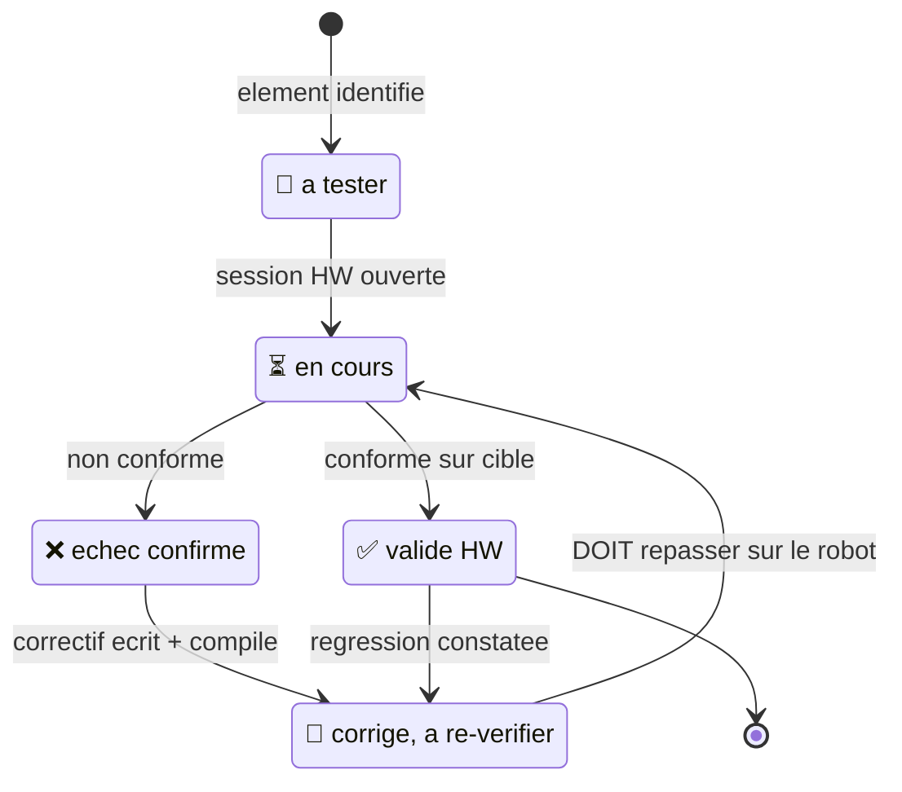

> [English](VALIDATION.md) · **Français** — l'anglais est la version de référence.
> Ce fichier peut être en retard d'une mise à jour : en cas de divergence, l'anglais fait foi.

# VALIDATION.md — StackChan-Companion

Tableau de bord des validations **hardware** (CoreS3/K151 réel).
Procédures détaillées : [`PLAYBOOK-HW.fr.md`](PLAYBOOK-HW.fr.md) —
consigner ici le verdict, là-bas le déroulé.

Légende : ✅ validé HW · 🔧 corrigé, à re-vérifier · 🔲 à tester · ⏳ en cours

La distinction qui compte : **🔧 n'est pas ✅**. Un correctif écrit et
compilé n'a rien prouvé tant qu'il n'a pas tourné sur le robot — c'est
justement là que se logent les régressions de ce projet (compilateur qui
supprime un appel de dessin, contention SPI2, verrou I2C).

## Moteur de rendu (P0/P1)

| Élément | Statut | Verdict |
|---|---|---|
| Boot sans bandes, fond propre | ✅ | 2026-07-06 |
| 30 expressions (formes, couleurs assombries ×0.80) | ✅ | Excited ✦ / Dead ✕ inclus — retouches 2026-07-16 : voir T8 |
| Effet CRT (traînée ~230 ms, halo 3 px/28 %, 40 MHz) | ✅ | verdicts P1b |
| Coins d'yeux sans débordement (rayons ∝ échelle) | ✅ | validé user 2026-07-21 (2.7) |
| LEDs (protocole PY32 réel) | ✅ | rouge/vert/bleu OK |

## Comportement (P2)

| Élément | Statut | Verdict |
|---|---|---|
| Idle : fixations tenues, saccades sèches, squash & stretch | ✅ | 2026-07-11 |
| Sleepy « lutte contre le sommeil » | ✅ | 2026-07-11 (couleur éclaircie 🔧) |
| Blink pleine fermeture / wink 220 ms | ✅ | rampe renderer supprimée — **validé user 2026-07-30** |
| Lag œil droit paramétrable (`blink_lag_ms`, défaut 30) | ✅ | défaut réduit — **validé user 2026-07-30** |
| API émotions/animations/status/tuning | ✅ | 2026-07-11 |

## Physique — IMU (P3)

| Élément | Statut | Verdict |
|---|---|---|
| VOR : contre-rotation + saccades de rattrapage | ✅ | 2026-07-11 (§1.5) |
| Mapping gyro (yaw=Y+, pitch=X+, réglable à chaud) | ✅ | consigné CONVENTIONS §3 |
| Inclinaison statique tenue | ⏳ | 2026-07-11, **à rejuger** : ce contrôle a duré quelques secondes, et la ligne de base absorbait alors une inclinaison tenue avec une constante de ~50 s — les deux affirmations étaient vraies, chacune sur son échelle de temps. La dérive n'est plus suivie que près de la pose de repos (22-08), et `_tilt.y` a été inversé pour contre-tourner comme `_tilt.x` (22-08) : le comportement consigné ici n'est donc pas celui qui est livré. Penchez le robot en arrière : le regard doit maintenant DESCENDRE avec lui |
| Secousse → Scared (seuil 35, guard danses) | ✅ | seuil posé (35), fin de Laugh vérifiée — **validé user 2026-07-30** |
| Préemption réflexe (secousse/soulèvement coupent tout) | ✅ | 2026-07-11 |
| Pickup → Curious + pieds ballants | ✅ | seuils 0.08 g/120 ms + relâche 250 ms — **validé user 2026-07-30** |
| §1.7 Efférence servo | ✅ | 2026-07-11 — guard selfMotion du VOR levé (v3.1) : VOR actif pendant les danses |

## Servo + danses (P4)

| Élément | Statut | Verdict |
|---|---|---|
| Boot neutre (166/93 — ex-103), trajectoires 50 Hz sans buzz | ✅ | home 93 validé user 2026-07-16 (« ok visuels ») |
| 10 danses + accompagnement du regard + préemption + stop | ✅ | 2026-07-11 |
| Danse `shocked` + sens miroité aléatoire | ✅ | validé user 2026-07-17 |
| « Eyes lead » : regard en avance de phase sur la tête (toutes danses) | ✅ | fix 2026-07-11 — **validé user 2026-07-25** |
| Télécommande `/api/servo` + console | ✅ | smoke test 2026-07-11 (sens des flèches à confirmer) |
| Auto-release couple (15 s) | ✅ | poussé en tuning — relâche/ré-engagement vérifiés, **validé user 2026-07-30** |
| Head-follow | ✅ | **validé user 2026-07-13** → `head_follow=1` défaut compilé |
| Séquence de réveil (pose mesurée, montée lente yeux fermés, yeux ouverts SUR l'IP) | ✅ | **validé user 2026-08-04** (« réveil = ok ») — pas d'éclair Normal, pas de claquement : le rail est coupé pendant l'attach servo, la pose est relue (avec reprises — le SCS0009 répond tard), et la première frame est gardée derrière un compteur de séquence jusqu'à connaître la pose |
| Le retour de lanceur re-mesure la pose affaissée (`rebaseAndEngage`) | ✅ | **validé user 2026-08-04** (« retour lanceur = ok ») — la tête se relève doucement de l'affaissement, sans à-coup ; le chemin de refus de flash API partage le même mécanisme (non observé séparément) |
| Fusion magnétomètre/VOR (`vor_mag_alpha`) | ❌ | **Impraticable sur le K151.** Le capteur voit surtout les aimants servo du CORPS à travers un gradient raide : dépendance au lacet de tête mesurée à **370 µT pour 80°** de mouvement — six fois le champ terrestre — et la lecture est **irreproductible à consigne commandée identique** (±100-175 µT entre répétitions : jeu servo + hystérésis), avec des sauts d'état de couple de ~50 µT et la danse qui triple le bruit. Une calibration par carte de pose ne peut pas converger sur cette irreproductibilité. Seule voie restante : un magnétomètre externe loin des moteurs (Grove). Le code + 3 tests natifs restent, `vor_mag_alpha` reste à 0 |

## Interactions + apps (P5/P6)

| Élément | Statut | Verdict |
|---|---|---|
| Si12T (caresse tête) + gestes écran | ✅ | 2026-07-11 (swipe L/R vs danse 🔧 corrigé) |
| Launcher SD `/bins/` (swipe bas) | ✅ | validé user 2026-07-21 (4c.3) |
| Console embarquée `/` + Swagger + OpenAPI | ✅ | 2026-07-11 |
| Portail captif (AP) + mDNS (`stackchan.local`) | ✅ | **validé user 2026-07-30** |
| Persistance config.yaml (tuning) | ✅ | validé user 2026-07-17 |
| API [Bins] upload/launch | ✅ | **2 bugs de routage corrigés 2026-07-12** (bins/launch, bins/stop jamais fonctionnels — voir TESTS 4d.3) — **validé user 2026-07-30**. **2026-09-25** : la moitié `loop()` du lancement avait été perdue (202 répondu, rien de flashé) — rétablie, et `space.bin` lancé par l'API tournait 10 s plus tard |
| SceGuest (stop distant d'un .bin maison) | ✅ | nécessite un bin compilé avec le stub — **validé user 2026-07-30** |
| flight-radar-fire — portage autonome sur M5Stack Fire (boutons, sans companion) | ✅ | **verdict global user 2026-08-04 (« Fire OK »)** — démarre, WiFi, navigation boutons, StackChan intact à côté ; les lignes fines restent ouvertes au PLAYBOOK §4i |
| led-fluid-fire — portage autonome sur M5Stack Fire | ⏳ | flashé le 23-08-2026 et **démarre** (sa propre trace atteint l'avis « pas de carte » ; l'I2C monte sur les sda 21 / scl 22 du Fire, donc `SCE_HAS_PY32=0` a bien tenu `Wire1.begin(12, 11)` à l'écart de la flash SPI). Rien au-delà du démarrage n'est jugé : la carte n'avait pas de SD, donc `setup()` attend un bouton sur `noSdNotice`. **À vérifier** : le sens de l'inclinaison (le MPU6886 est monté autrement que celui du CoreS3 — c'est à cela que servent les trois cases `tilt_*`), le mapping A/C parcourt-B agit, et le cadre du curseur sur le panneau de réglages |
| Chirps par valence (`sound=1`) / LEDs émotion (`leds=1`) | ✅ | validé user 2026-07-21 (4c.4/4c.5) |
| Écriture SD sans gel/erreur (POST /api/tuning, /api/wifi) | ✅ | 2026-07-12 — cause réelle = contention SPI2 (pas la fréquence) ; fix `renderer.pause()` autour des accès SD différés ; rafale 10× = 0 erreur/30 ms, 1 pic isolé 441 ms non reproduit sur 5 relectures (carte physique, pas contention) — TESTS 4d.2 |

## Style Cozmo (T7 — réf. docs/assets/cozmo.jpg)

| Élément | Statut | Verdict |
|---|---|---|
| Blush (émotion + joues), sweat | ✅ | refonte 4 traits sous les yeux 07-22 — **validé user 2026-07-25** |
| Étoile Excited nette (plus de rect dessous) + sparkles repositionnées | ✅ | fix 2026-07-12 — **validé user 2026-07-25** |
| Équidistance des centres d'yeux (30 émotions) | ✅ | mécanisme discipline-presets validé user 2026-07-16 (« ok visuels ») |
| Blink ligne 1 px pleine largeur | ✅ | ligne posée sur le bord BAS (2026-07-15) — validé user 2026-07-16 |
| Sleepy paupières plates (sans trait) | ✅ | validé user 2026-07-16 (refonte + asynchronie T8) |
| Scared sans décroché + largeur stable au décalage | ✅ | remplacé par le dôme T8 — validé user 2026-07-16 |
| Danses `wiggle`/`peek` | ✅ | validé user 2026-07-17 |
| LEDs : couleur sync ÉCRAN (Renderer::eyeColorRgb) + rampes ∝ intensité | ✅ | fait 2026-07-12 — **validé user 2026-07-25** |
| Console web (graphe heap+frame, toggles, tableau tuning, danses SD, bins) | ✅ | validé user 2026-07-17 |
| Chorégraphies SD (DanceStore : upload/modif/suppr/reload API+console) | ✅ | **validé user 2026-07-25** |
| Reload config SD (`POST /api/config/reload`) | ✅ | bug de routage corrigé 2026-07-12 — **validé user 2026-07-25** |
| SD détection | ✅ | `sd:1` confirmé au boot, robot en STA avec credentials carte |
| Danse `furious` (cocotte-minute, crescendo LED) | ✅ | validé user 2026-07-17 |
| Squint nerveux (tremblement + entrée sèche) | ✅ | devenu **Nervous** (T8) — validé user 2026-07-16 |

## Direction artistique yeux (T8, réf. docs/assets/cozmo.jpg)

**Verdict global user 2026-07-16 : « ok sur tous les visuels »** — toute la
section validée d'un bloc après les passes itératives de la journée.

| Élément | Statut | Verdict |
|---|---|---|
| Normal : centré vertical, UN œil (côté aléatoire) légèrement plus petit | ✅ | validé user 2026-07-16 (Preset_Normal_Alt 92, respiration synchronisée) |
| Glee : yeux dans la moitié HAUTE de la zone | ✅ | validé user 2026-07-16 (OffsetY +40) |
| Sad : « regard ciel » (regard monte → forme Scary, hystérésis) | ✅ | validé user 2026-07-16 (seuil 3 px — le 5 px ne sortait presque jamais) |
| Worried : bords BAS alignés · Annoyed : bords HAUTS alignés · Smug : yeux CENTRÉS | ✅ | validé user 2026-07-16 (Smug recentré 2ᵉ passe) |
| Surprised : coins extérieurs hauts élargis (56 = quart plein) | ✅ | validé user 2026-07-16 (48→56 en 2ᵉ passe) |
| Awe = Surprised inversé verticalement (coins ext. 48 bas / 46 haut, zéro pente) | ✅ | validé user 2026-07-16 (3 passes — le trait venait du Slope_Bottom) |
| Scared : H85, bas carré (8), haut en DÔME (sommet au milieu) | ✅ | validé user 2026-07-16 (dôme Radius_Top 48 — décroché pente/coin impossible) |
| Nervous (ex-Squint) : petit œil rapproché (espacement standard, 2 côtés) | ✅ | validé user 2026-07-16 (OffsetX anatomique — fix miroir) |
| NOUVEAU Squint : Focused sans pente haute, pente basse +0.28, H28 | ✅ | validé user 2026-07-16 (allers-retours de signe = bug miroir, résolu) |
| Curious : œil côté regard carré 112×112 (bascule dynamique) | ✅ | régression 07-17 corrigée (asymétrie statique, tailles 104×105 / 68×92) — **validé user 2026-07-25** |
| Questioning : taille alignée sur Curious (104×105 / 68×92) | ✅ | validé user 2026-07-17 |
| Sleepy : fermetures asynchrones par œil + plancher de lutte | ✅ | validé user 2026-07-16 (2 machines indépendantes, SL_FLOOR 0.08, bords bas ancrés) |
| Miroir aléatoire des asymétries + sync sens danse | ✅ | validé user 2026-07-16 (pentes/OffsetX anatomiques après le bug Angry/Sad) |
| LEDs : blink = LED off ; wink = intensité ×0.4 ; couleur au tick près | ✅ | validé user 2026-07-16 (état publié avant pushSprite) |
| Fermeture CENTRÉE (12 émotions rondes) : blink/wink vers le centre du plus petit œil | ✅ | validé user 2026-07-16 |
| OTA firmware via console/API (`POST /api/update`) + écran « … » | ✅ | validé 2026-07-16 : cycle complet OTA réseau + visuels ok |
| Suivi du son — 2 micros (`sound_track=1`) | ✅ | validé user 2026-07-16 après itérations terrain : écoute continue, sens -1, thr 100, step 30, courbe √, sursaut = danse `shocked` puis virage — A2.20 |
| Posture tête par émotion (home pitch 93°, min 15°) | ✅ | validé user 2026-07-16 |
| Reboot API/console + états micros au panneau (off/warming up/standby/actif) | ✅ | validé 2026-07-16 (reboot testé bout en bout + « ok visuels ») |
| Écran de gel « … » (3 carrés arrondis) | ✅ | validé user 2026-07-16 ; animation RETIRÉE le 07-30 (elle rendait le gel bavard sur SPI2) |
| Retour au HOME généralisé (`head_home_ms`) : pause sans activité tête/son → retour systématique, toutes danses et options | ✅ | validé user 2026-07-17 (remplace le retour-au-calme son ; fix ServoMotion associé) |
| Tête baissée au plus bas : émotions (Sad/Sleepy/Blush) + danses NOD/SHY | ✅ | validé user 2026-07-17 **avec `pitchOff` +10/+9** (butée physique 103°). Depuis, `PITCH_MAX` est ramené à 99 (spec M5Stack) et le plafond est `PITCH_DOWN_MAX` = **+6** : le geste est le même, l'amplitude descendante est plus courte de 4° |
| Charge CPU console (load0/load1, courbes 0-100 %) | ✅ | validé 2026-07-16 (valeurs cohérentes : c0 ~2 %, c1 ~69 %) |

## Capteurs additionnels

| Élément | Statut | Verdict |
|---|---|---|
| Double-tap logiciel (pic accel) → Happy + wink | ✅ | validé user 2026-07-17 (« caresse tête = ok ») |
| Orientation face-bas soutenue → Sleepy tenu | ✅ | validé user 2026-07-17 (signe accel.z confirmé HW dès la 1ʳᵉ passe) |
| Batterie AXP2101 (`batt`/`chg` API + cellule console + alerte <15 %) | ✅ | validé user 2026-07-17 |
| Volume nuit (`sound_volume_night`, coucher→lever réels) | ✅ décision / 🔲 volume | refait 2026-08-01 (NTP + position solaire, réglages `lat`/`lon`). La DÉCISION de nuit est validée sur cible sans attendre l'obscurité : `/api/sensors` publie `clock` + `night`, et décaler `lon` de 180° fait basculer `night` 0→1→0 (PLAYBOOK 4g.3). Reste le VOLUME du chirp, à l'oreille (4g.4) |
| Caméra GC0308 (snapshot + flux MJPEG, HA/Frigate, off défaut) | ✅ | **validé image réelle user 2026-07-18** — 4 obstacles HW résolus (SCCB via M5.In_I2C, frames partielles/pause renderer, YUV422+JPEG logiciel, table calibration officielle) ; couleurs naturelles, orientation 0/0, VOR actif pendant le flux |
| Vue caméra console + tuning caméra catégorisé | ✅ | validé user 2026-07-18 (rafraîchissement ~1/s, sliders directs registre) |

## Durcissement (revue de code) + verrou de bus

Constats issus de la revue de code (10 angles) et du correctif de verrou de
bus I2C partagé.

| Élément | Statut | Verdict |
|---|---|---|
| Verrou bus I2C (`I2cBus.h`) : VOR vivant (mutex par transaction) | ✅ | design amendé 07-20/21 : rafale de CONFIG SCCB exclusive (~0,5 s de gel assumé, A2.21), power-cycle HORS verrou — caméra fiable validée user |
| LEDs corps / touch Si12T / batterie / SCCB ne glitchent plus l'IMU | ✅ | activer LEDs + caméra + toucher la tête, surveiller faux Scared — **validé user 2026-07-25** |
| Sleepy/Blush : plus de re-commande servo en boucle (tête se pose) | ✅ | cible pitch clampée → condition de repos converge — **validé user 2026-07-25** |
| Caméra : 1 snapshot = 1 capture (loop() non saturée) ; `camera=0` stoppe un flux ouvert | ✅ | **validé user 2026-07-25** |
| Qualité JPEG `cam_quality` : bas = meilleure image (inversion corrigée) | ✅ | **validé user 2026-07-25** |
| Échec init caméra ne laisse plus le rail ALDO3 alimenté | ✅ | **validé user 2026-07-25** |
| `/api/poweroff` ne boucle plus sous USB | ✅ | **validé user 2026-07-25** |
| Sécurité : `password: ""` = API ouverte ; credentials `#`/espaces round-trip ; upload OTA/bins auth-gated | ✅ | tester lockout + flash non authentifié refusé — **validé user 2026-07-25** |
| `/api/security` et `/api/wifi` sans course inter-tâches | ✅ | POST rapides pendant une sauvegarde SD — **validé user 2026-07-25** |

## Capteurs non exploités → implémentés — à valider HW

| Élément | Statut | Verdict |
|---|---|---|
| Jauge INA226 (tension bus/shunt) → `/api/sensors` | 🔲 | vérifier `ina_v` cohérent avec la batterie |
| Magnétomètre BMM150 : cap `heading` → `/api/sensors` | ✅ | tourner le robot, heading varie 0-360 — **validé user 2026-07-30** |
| Lumière LTR-553 : `auto_brightness` (écran s'adapte) | ✅ | masquer/éclairer le capteur, luminosité suit (~2 s) — **validé user 2026-07-30** |
| NFC ST25R3916 / IR IRM56384 | ⏳ | non implémentés — nécessitent lib dédiée + session HW |

## Revue max — corrections à revalider HW

Constats trouvés par revue de code (six angles, chacun vérifié
adversarialement) puis corrigés. Aucun n'a encore été observé sur la cible.

| Élément | Statut | Verdict attendu |
|---|---|---|
| `Excited` : l'étoile suit le regard dans le BON sens (elle descendait quand le regard montait) | 🔲 | `name=Excited` puis `POST /api/tuning?gaze_y=…` ou une danse à `gazeY` : l'étoile monte avec le regard, comme les autres yeux |
| ~~`Dead` : la croix suit le regard~~ **SUPERSEDED 08-03** | ⏳ | l'inverse a été demandé et livré : Dead est IMMOBILE (regard, VOR, respiration, squash gelés dans le Brain). La lecture d'alors était qu'une croix clouée au centre ressemblait à un défaut de rendu ; ce n'en est pas un, c'est le propos — un mort ne regarde rien. Clos comme superseded, jamais comme fait |
| Bornes pitch resserrées 19/99 — rejoue 4f.18 du playbook | 🔲 | Sad/Sleepy/Blush baissent la tête jusqu'à +6°, sans jamais tenir une butée |
| Lecture SD bornée (`config.yaml`, `/dances/*.csv`) | 🔧 | déposer un fichier volumineux SANS saut de ligne : le robot l'ignore et démarre, au lieu de manquer de tas |
| Écran GELÉ pendant un téléversement (statique, plus de saccades) | 🔲 | téléverser un gros `.bin` : la face se fige sur les « … » immobiles, revient à la fin ; connexion coupée en cours → dégel au bout de 10 s |
| Garde de routes A2.19 étendu (masques combinés + doublons) | ✅ | 2026-07-30 : aucune ligne `A2.19 VIOLEE` ni `route DOUBLON` au boot du companion flashé |

## Endurance (P7)

| Élément | Statut | Verdict |
|---|---|---|
| Instrumentation (heapMin interne + stk par tâche) | ✅ | heartbeat vérifié 2026-07-11 |
| Run nuit (≥ 8 h, heap stable, zéro reboot) | ✅ | **2026-07-13 : 12,7 h sans reboot firmware**, heap stable (plancher figé 11 h+, zéro fuite), piles ≫ seuil, 0 panic/ECHEC, CRT ON toute la nuit (frame 30,7-31 ms < 33) — TESTS 5.2 |

## Caméra/latence/comportement

Tâche caméra dédiée, vue QVGA + instantané `?full=1`, latence réseau, option
`servos`, mode nuit roulette, revue max (15 findings corrigés), anims
Greet/Dead. Tests natifs verts + vérifs API à chaque flash.

| Élément | Statut | Verdict |
|---|---|---|
| Caméra : cycles `camera=0→1` relivrent des frames (init power-cycle + purge deinit) | ✅ | 2026-07-20 user (« image nickel ») + 3/3 cycles API 07-21 |
| Latence commandes pendant vue active (QVGA compressé + yield radio) | ✅ | mesuré : médiane 63 ms (avant 1150 ms) |
| Heap interne stable sous flux (JPEG streamé PSRAM) | ✅ | heapMin 58 Ko → plus de mort AsyncTCP ; re-mesurer après fmt2jpg_cb |
| Instantané `?full=1` (VGA pleine qualité, 503-retry) | ✅ | 17,7 Ko servi essai 3 (07-21) |
| Option `servos=0` : couple relâché, tête molle, reprise douce | ✅ | 2026-07-20 user ; ReadPos rebase (tête déplacée à la main) ✅ 2026-07-21 (4h.2) |
| Réflexe Scared ACTIF avec `servos=0` (fix isMoving) | ✅ | 2026-07-21 user (4h.1) |
| Mode nuit roulette (`dark_sleepy`) : somnole dans le noir, réveil lumière | ✅ | live au flash + cycle complet validé user 2026-07-21 (4h.5) |
| LTR-553 gain 96x : bureau éclairé ≈ 50 % | ✅ | mesuré 70-76 counts = 51-52 % (07-20) |
| Greet : wink en haut, gel ~1,7 s, descente | ✅ | 2026-07-21 user (4h.4) |
| Dead : tête en haut (marge anti-calage), tenue 2 s, servos survivants | ✅ | 2026-07-21 user (4h.3) — plus de calage ; montée accélérée 400 ms 07-25 |
| Auto-off caméra 60 s sans consommateur (sans re-init fantôme) | ✅ | 2026-07-21 user (4h.6) |
| Console : pad flex centré, toggles Tête, resync 30 s | ✅ | 2026-07-21 user (« nickel ») |
| Dead : X complet (2 bras), 14 px, bords lisses, frame ~27 ms | ✅ | 2026-07-25 — bug GCC (2ᵉ appel de dessin supprimé du binaire) contourné, prouvé par relecture buffer (A2.22) ; forme validée user (épaisseur/encoches corrigées sur retours) |
| Swipes tactiles pendant Dead (plus de famine loop) | ✅ | 2026-07-25 — frame 57→27 ms + garde anti-famine ×3 ticks ; trace série `[touch]` pendant Dead |
| Bande : swipe G/D = cycle modes (zone y≥160), verticaux inertes | ✅ | **validé user 2026-07-25** (« 4c.2 zones tactiles = OK ») |
| Bin invité flight-radar : launch → radar → tap cible/traîne → stop distant | ✅ | 07-25 : launch + radar + page invité HTTP 200 validés ; 3 bugs corrigés à distance (SPI/SD, tâche réseau TLS, guillemets SceGuest) ; /companion.bin poussé via API — re-launch du bin corrigé + stop + cible/traîne avec avions réels **validé user 2026-07-30** |
| Suivi du son : sourdine pendant mouvement servo (+350 ms) | ✅ | flashé 07-25 — validé à l'oreille (`sound_track=1`, la tête ne se poursuit plus elle-même), **validé user 2026-07-30** |

## Bins invités — flight-radar & ha-remote

La colonne « Verdict » distingue ce que l'utilisateur a **vu marcher sur le
robot** de ce qui est seulement compilé : les correctifs sont ✅ *pour la
partie déjà observée sur cible*, 🔧 pour ceux compilés et flashés mais pas
encore revérifiés individuellement.

| Élément | Statut | Verdict |
|---|---|---|
| `ha-remote` : bootloop au premier chargement (chien de garde IDLE0 dans `deserializeJson`, `Stream::timedRead` octet par octet) | ✅ | 2026-07-28 — `YieldingReader` (lecture par blocs + `vTaskDelay`) ; plus de panic |
| `ha-remote` : « aucune entité » (`TooDeep`, NestingLimit 10 par défaut) | ✅ | 2026-07-28 — `NestingLimit(24)` ; **61 entités lues en 12,9 s**, heap plat |
| `ha-remote` : téléchargement tronqué sur WiFi faible (chunked non dé-tramé — `getStream()` rend le socket BRUT) | ✅ | 2026-07-28 — dé-tramage dans `YieldingReader` |
| `ha-remote` : « gros décalage » et commandes perdues | ✅ | 2026-07-28 user — le sondage complet après chaque action est supprimé (suivi ciblé d'UNE entité), file d'actions à 8 places |
| `ha-remote` : accents affichés | ✅ | 2026-07-28 user |
| `ha-remote` : vignettes caméra (« image incomplète » puis « image trop lourde ») | ✅ | 2026-07-28 user (« ah c'est revenu ») — le garde `clean()` rejetait des téléchargements COMPLETS, la sortie de boucle ne repassant pas par `rawFill()` |
| `ha-remote` : volet — position rafraîchie, STOP et OUVRIR opérants | ✅ | 2026-07-28 user |
| `ha-remote` : glissé de position du volet (le `dragEnt` n'était jamais initialisé quand le volet armait le geste) | 🔧 | corrigé après constat de revue — **non rejoué sur le robot** |
| `ha-remote` : boutons de volet jointifs, pleine hauteur (76→220 px) | 🔧 | disparus une première fois (un `return` sautait aussi les boutons), restaurés — à revoir à l'œil |
| `ha-remote` : bouton unique ALLUMER **ou** ÉTEINDRE selon l'état | 🔧 | compilé |
| `ha-remote` : compteur actifs/total sur l'accueil (`3/6`) | 🔧 | compilé |
| `ha-remote` : panneau de réglages au swipe → (drapeau posé sous verrou, modale ouverte par `loop()`) | 🔧 | une première version ne s'ouvrait pas (appel supprimé par une purge de bloc), restaurée — **à re-tester** |
| `ha-remote` : réglages n'écrivant que les champs MODIFIÉS | 🔧 | corrigé sur constat de revue (l'instantané réécrivait les trois et annulait une saisie faite sur `/config`) |
| `flight-radar` : 4 thèmes appariés jour/nuit (0 Gundam, 1 Gundam nuit ocre, 2 Scope, 3 Scope nuit) | ✅ | 2026-07-28 user (« ça me semble bien ») après plusieurs allers-retours sur la teinte ocre |
| `flight-radar` : contraste WCAG AA des 4 thèmes | ✅ | **mesuré** par `scripts/gates/check-contrast.py` sur les couleurs quantifiées RGB565 — les 3 thèmes d'alors échouaient réellement avant cette passe |
| `flight-radar` : alarme Gundam (séquence relevée du MP3 fourni, décroissance incluse, 2 s entre cycles) | ✅ | validée à l'oreille — **validé user 2026-07-30** |
| `flight-radar` : symboles hélicoptère et planeur | ✅ | 2026-07-28 user (« sont ok ») |
| `flight-radar` : vecteur de route absent sur les vols proches (horizon fixe trop long) | ✅ | horizon adaptatif avec plancher 5 px + `Plane::hasTrack` — revu sur des vols réels, **validé user 2026-07-30** |
| `flight-radar` : nez du blip d'avion de ligne raccourci d'1 px par ma conversion A2.22 | ✅ | régression introduite puis corrigée (`light ? 4 : 6`) — **validé user 2026-07-30** |
| `SceGuest` : écrans de flash SD-Updater au thème du launcher | ✅ | 2026-07-28 |
| `SceGuest` : `/api/bins/stop` protégé par filtre d'`Origin` | ✅ | 2026-07-28 — la première tentative (jeton CSRF) rendait l'arrêt inutilisable depuis curl et la console ; robot récupéré par reflash USB du companion |
| Éditeur de chorégraphies `tools/` : fidélité au firmware | ✅ | vérifié en **Node** puis sur le robot — `Glee` OffsetY −40/−40, `Angry` pentes +0,3/−0,3, `Surprised` rayons extérieurs 56/40, bornes pitch −74..+6 ; une danse exportée confrontée au robot — **validé user 2026-07-30** |

## Identité du build et aller-retour invité

Cette section existe à cause d'une panne que les autres lignes ne peuvent pas
attraper : un flash qui *réussit* et laisse quand même tourner le mauvais
firmware. `pio -t upload` écrit un slot OTA et ne touche jamais `otadata`,
tandis que le retour d'un invité réécrit le companion depuis `/companion.bin`
sur la carte — donc une copie périmée écrase un flash tout neuf, et tous les
signaux extérieurs (hash vérifié par esptool, robot de retour sur le WiFi)
disent quand même « réussi ». Seul un firmware qui **se nomme** tranche.

| Item | Statut | Verdict |
|---|---|---|
| L'aller-retour invité ne détruit rien (lancer un bin, revenir au companion, rien d'autre n'a changé) | ✅ | 2026-08-15 — `GET /api/firmware` lu avant le lancement et après le retour : même `sha`, même `console`, `reset` revenu à `sw`. C'est le contrôle qui aurait attrapé l'écrasement par un `/companion.bin` périmé, ce qu'aucun « le flash a réussi » ne fait jamais |
| Temps de retour du companion ≈ **14 s** | ✅ | 2026-08-15 — mesuré de la demande d'arrêt jusqu'au retour des réponses de `/api/status`. La tâche réseau de fond est désormais garée par `sce::CoopStop` avant `updateFromFS` ; non garée, le même retour dépassait **dix minutes**, la tâche et le reflash se disputant la flash |
| L'identité du build concorde avec le dépôt | ✅ | 2026-08-15 — le `sha` servi par `/api/firmware` égale `sha256sum .pio/build/companion/firmware.elf` (8 premiers hex), et `console` égale ce qu'imprime `python scripts/build/gen_console_gz.py --check`. Deux builds de la même branche sont sinon indiscernables de l'extérieur |
| Trace de debug runtime sur le port série | ✅ | 2026-08-15 — `POST /api/tuning?debug=1` (et `_dbg` sur le `/config` d'un invité) fait apparaître en direct des lignes `[dbg][net]` / `[dbg][cfg]` à 115200, qui cessent dès que la clé repasse à 0. Aucun secret dedans : les URL sont coupées à la query string, les jetons rapportés présent/absent |
| `space` : la tête suit le satellite (`servo`, `servo_az`) | ✅ | 2026-09-25 — calcul de la pose épinglé par `test_astro` ; sur le robot, satellite 21610 placé à 90° sur la gauche du robot via `servo_az` : la tête a tourné vers la gauche du robot (PLAYBOOK 4j.2) |
| Bins invités : réglages radio du companion (TX 19,5 dBm avant la jonction, veille du modem coupée) | ✅ | 2026-09-25 — flight-radar sur le robot à environ −75 dBm : ping 2-12 ms, contre 71-295 ms sous un invité (2-8 ms sous le companion) |
| `flight-radar` : tête tournée vers le vol | 🔧 | 2026-09-25 — son `166 + cap` était inversé par rapport à la convention validée en 4j.2 ; désormais le `headtrack.h` partagé. Pas encore observé avec un vrai vol |
| Accord A+C de `space` → overlay debug plein écran, sur un vrai M5Stack Fire | 🔲 | l'accord vit dans `sce::ButtonBank` et est testé nativement (`test_spaceinput`), l'overlay compile dans `space-fire` et est couvert par `check-a222.py` — mais rien n'a encore appuyé deux boutons physiques à la fois sur la carte |
| Rendu d'éclipse lunaire (disque cuivré + ligne `eclipse` en tête de colonne) | 🔲 | la **détection** est validée nativement contre le canon d'éclipses de la NASA (`test_astro`, dates ombrales et une pleine lune qui manque l'ombre). Le **rendu**, lui, n'a jamais été vu : aucune éclipse ombrale n'est tombée pendant une session. Il attend le ciel, pas un correctif |
