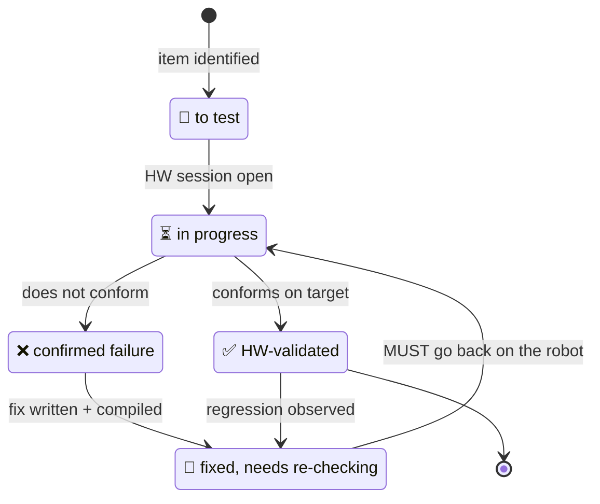

> **English** · [Français](VALIDATION.fr.md)

# VALIDATION.md — StackChan-Companion

Dashboard of **hardware** validations (real CoreS3/K151).
Detailed procedures: [`PLAYBOOK-HW.md`](PLAYBOOK-HW.md) — record the verdict
here, the step-by-step over there.

Legend: ✅ HW-validated · 🔧 fixed, needs re-checking · 🔲 to test · ⏳ in progress

The distinction that matters: **🔧 is not ✅**. A fix that is written and
compiled has proved nothing until it has run on the robot — and that is
exactly where this project's regressions hide (a compiler dropping a draw
call, SPI2 contention, the I2C lock).

## Rendering engine (P0/P1)

| Item | Status | Verdict |
|---|---|---|
| Boot with no banding, clean background | ✅ | 2026-07-06 |
| 30 expressions (shapes, darkened colours ×0.80) | ✅ | Excited ✦ / Dead ✕ included — retouches 2026-07-16: see T8 |
| CRT effect (~230 ms trail, 3 px/28 % halo, 40 MHz) | ✅ | P1b verdicts |
| Eye corners with no overflow (radii ∝ scale) | ✅ | user-validated 2026-07-21 (2.7) |
| LEDs (real PY32 protocol) | ✅ | red/green/blue OK |

## Behaviour (P2)

| Item | Status | Verdict |
|---|---|---|
| Idle: held fixations, dry saccades, squash & stretch | ✅ | 2026-07-11 |
| Sleepy "fighting off sleep" | ✅ | 2026-07-11 (colour lightened 🔧) |
| Full-closure blink / 220 ms wink | ✅ | renderer ramp removed — **validated by user 2026-07-30** |
| Configurable right-eye lag (`blink_lag_ms`, default 30) | ✅ | default lowered — **validated by user 2026-07-30** |
| Emotions/animations/status/tuning API | ✅ | 2026-07-11 |

## Physics — IMU (P3)

| Item | Status | Verdict |
|---|---|---|
| VOR: counter-rotation + catch-up saccades | ✅ | 2026-07-11 (§1.5) |
| Gyro mapping (yaw=Y+, pitch=X+, tunable at runtime) | ✅ | recorded in CONVENTIONS §3 |
| Static tilt held | ⏳ | 2026-07-11, **to be re-judged**: that check ran over seconds, and the baseline then absorbed a held tilt with a ~50 s time constant — both statements were true on their own timescale. The drift is now gated on staying near the rest pose (08-22), and `_tilt.y` was flipped to counter-rotate like `_tilt.x` (08-22), so the behaviour this line recorded is not the behaviour that ships. Tip the robot back: the gaze should now go DOWN with it |
| Shake → Scared (threshold 35, dance guard) | ✅ | threshold set (35), end of Laugh checked — **validated by user 2026-07-30** |
| Reflex pre-emption (shake/pickup cut everything) | ✅ | 2026-07-11 |
| Pickup → Curious + dangling feet | ✅ | thresholds 0.08 g/120 ms + 250 ms release — **validated by user 2026-07-30** |
| §1.7 Servo efference | ✅ | 2026-07-11 — the VOR's selfMotion guard was lifted (v3.1): VOR active during dances |

## Servo + dances (P4)

| Item | Status | Verdict |
|---|---|---|
| Neutral boot (166/93 — formerly 103), 50 Hz trajectories with no buzz | ✅ | home 93 user-validated 2026-07-16 ("visuals ok") |
| 10 dances + gaze accompaniment + pre-emption + stop | ✅ | 2026-07-11 |
| `shocked` dance + random mirrored direction | ✅ | user-validated 2026-07-17 |
| "Eyes lead": gaze phase-ahead of the head (all dances) | ✅ | fix 2026-07-11 — **user-validated 2026-07-25** |
| `/api/servo` remote + console | ✅ | smoke test 2026-07-11 (arrow direction to be confirmed) |
| Torque auto-release (15 s) | ✅ | moved into tuning — release/re-engagement checked, **validated by user 2026-07-30** |
| Head-follow | ✅ | **user-validated 2026-07-13** → `head_follow=1` compiled-in default |
| Wake-up sequence (measured pose, slow rise eyes shut, eyes open ON the IP) | ✅ | **user-validated 2026-08-04** ("réveil = ok") — no Normal flash, no slam: the rail cuts across servo attach, the pose is read back (with retries — the SCS0009 answers late), and the first frame is gated behind a sequence counter until the pose is known |
| Launcher return re-measures the sagged pose (`rebaseAndEngage`) | ✅ | **user-validated 2026-08-04** ("retour lanceur = ok") — head rises gently from the sag, no snap; API flash-refusal path shares the same mechanism (not separately observed) |
| Magnetometer/VOR fusion (`vor_mag_alpha`) | ❌ | **Impractical on the K151.** The sensor mostly sees the BODY's servo magnets through a steep gradient: measured **370 µT of head-yaw dependence per 80°** of movement — six times Earth's field — and the reading is **irreproducible at an identical commanded pose** (±100-175 µT between repeats: servo slop + hysteresis), with torque-state steps of ~50 µT and dancing tripling the noise. A pose-map calibration cannot converge on that irreproducibility. Only path left: an external magnetometer away from the motors (Grove). Code + 3 native tests stay, `vor_mag_alpha` stays 0 |

## Interactions + apps (P5/P6)

| Item | Status | Verdict |
|---|---|---|
| Si12T (head petting) + screen gestures | ✅ | 2026-07-11 (swipe L/R vs dance 🔧 fixed) |
| SD `/bins/` launcher (swipe down) | ✅ | user-validated 2026-07-21 (4c.3) |
| Embedded console `/` + Swagger + OpenAPI | ✅ | 2026-07-11 |
| Captive portal (AP) + mDNS (`stackchan.local`) | ✅ | **validated by user 2026-07-30** |
| config.yaml persistence (tuning) | ✅ | user-validated 2026-07-17 |
| [Bins] upload/launch API | ✅ | **2 routing bugs fixed 2026-07-12** (bins/launch, bins/stop never worked — see TESTS 4d.3) — **validated by user 2026-07-30**. **2026-09-25**: the `loop()` half of the launch had been lost (202 answered, nothing flashed) — restored, and `space.bin` launched through the API was running 10 s later |
| SceGuest (remote stop of a home-made .bin) | ✅ | requires a bin compiled with the stub — **validated by user 2026-07-30** |
| flight-radar-fire — standalone port on M5Stack Fire (buttons, no companion) | ✅ | **user global verdict 2026-08-04 (« Fire OK »)** — boots, WiFi, button navigation, StackChan untouched alongside; the fine-grained rows stay open in PLAYBOOK §4i |
| led-fluid-fire — standalone port on M5Stack Fire | ⏳ | flashed 2026-08-23 and **boots** (its own trace reaches the no-card notice; I2C comes up on the Fire's own sda 21 / scl 22, so `SCE_HAS_PY32=0` kept `Wire1.begin(12, 11)` away from the SPI flash). Nothing beyond boot is judged: the board had no SD card, so `setup()` is waiting on `noSdNotice` for a button. **To verify**: the tilt direction (the MPU6886 is mounted differently from the CoreS3's — that is what the three `tilt_*` switches are for), the A/C-walks-B-acts mapping, and the cursor highlight on the settings panel |
| Valence chirps (`sound=1`) / emotion LEDs (`leds=1`) | ✅ | user-validated 2026-07-21 (4c.4/4c.5) |
| SD writes with no freeze/error (POST /api/tuning, /api/wifi) | ✅ | 2026-07-12 — real cause = SPI2 contention (not the frequency); fix is `renderer.pause()` around deferred SD accesses; burst of 10× = 0 errors/30 ms, one isolated 441 ms spike not reproduced over 5 re-reads (physical card, not contention) — TESTS 4d.2 |

## Cozmo style (T7 — ref. docs/assets/cozmo.jpg)

| Item | Status | Verdict |
|---|---|---|
| Blush (emotion + cheeks), sweat | ✅ | reworked into 4 strokes under the eyes 07-22 — **user-validated 2026-07-25** |
| Crisp Excited star (no more rect underneath) + sparkles repositioned | ✅ | fix 2026-07-12 — **user-validated 2026-07-25** |
| Equidistant eye centres (30 emotions) | ✅ | preset-discipline mechanism user-validated 2026-07-16 ("visuals ok") |
| Blink as a full-width 1 px line | ✅ | line placed on the BOTTOM edge (2026-07-15) — user-validated 2026-07-16 |
| Sleepy flat eyelids (no stroke) | ✅ | user-validated 2026-07-16 (rework + T8 asynchrony) |
| Scared with no step + stable width when the gaze shifts | ✅ | replaced by the T8 dome — user-validated 2026-07-16 |
| `wiggle`/`peek` dances | ✅ | user-validated 2026-07-17 |
| LEDs: colour synced to the SCREEN (Renderer::eyeColorRgb) + ramps ∝ intensity | ✅ | done 2026-07-12 — **user-validated 2026-07-25** |
| Web console (heap+frame graph, toggles, tuning table, SD dances, bins) | ✅ | user-validated 2026-07-17 |
| SD choreographies (DanceStore: upload/edit/delete/reload via API+console) | ✅ | **user-validated 2026-07-25** |
| SD config reload (`POST /api/config/reload`) | ✅ | routing bug fixed 2026-07-12 — **user-validated 2026-07-25** |
| SD detection | ✅ | `sd:1` confirmed at boot, robot in STA with the card's credentials |
| `furious` dance (pressure cooker, LED crescendo) | ✅ | user-validated 2026-07-17 |
| Nervous squint (tremor + dry entry) | ✅ | became **Nervous** (T8) — user-validated 2026-07-16 |

## Eye art direction (T8, ref. docs/assets/cozmo.jpg)

**Global user verdict 2026-07-16: "ok on every visual"** — the whole section
validated in one block after the day's iterative passes.

| Item | Status | Verdict |
|---|---|---|
| Normal: vertically centred, ONE eye (random side) slightly smaller | ✅ | user-validated 2026-07-16 (Preset_Normal_Alt 92, synchronised breathing) |
| Glee: eyes in the UPPER half of the zone | ✅ | user-validated 2026-07-16 (OffsetY +40) |
| Sad: "sky gaze" (gaze rises → Scary shape, hysteresis) | ✅ | user-validated 2026-07-16 (3 px threshold — the 5 px one almost never triggered) |
| Worried: BOTTOM edges aligned · Annoyed: TOP edges aligned · Smug: eyes CENTRED | ✅ | user-validated 2026-07-16 (Smug re-centred on the 2nd pass) |
| Surprised: widened upper outer corners (56 = a full quarter) | ✅ | user-validated 2026-07-16 (48→56 on the 2nd pass) |
| Awe = Surprised flipped vertically (outer corners 48 bottom / 46 top, zero slope) | ✅ | user-validated 2026-07-16 (3 passes — the stroke came from Slope_Bottom) |
| Scared: H85, square bottom (8), DOMED top (apex in the middle) | ✅ | user-validated 2026-07-16 (dome Radius_Top 48 — a slope/corner step is impossible) |
| Nervous (formerly Squint): small eye brought closer (standard spacing, both sides) | ✅ | user-validated 2026-07-16 (anatomical OffsetX — mirror fix) |
| NEW Squint: Focused without the top slope, bottom slope +0.28, H28 | ✅ | user-validated 2026-07-16 (the sign flip-flopping was the mirror bug, resolved) |
| Curious: square 112×112 eye on the gaze side (dynamic switch) | ✅ | 07-17 regression fixed (static asymmetry, sizes 104×105 / 68×92) — **user-validated 2026-07-25** |
| Questioning: size aligned with Curious (104×105 / 68×92) | ✅ | user-validated 2026-07-17 |
| Sleepy: per-eye asynchronous closures + struggle floor | ✅ | user-validated 2026-07-16 (2 independent state machines, SL_FLOOR 0.08, bottom edges anchored) |
| Random mirroring of asymmetries + sync with the dance direction | ✅ | user-validated 2026-07-16 (anatomical slopes/OffsetX after the Angry/Sad bug) |
| LEDs: blink = LED off; wink = intensity ×0.4; colour to the tick | ✅ | user-validated 2026-07-16 (state published before pushSprite) |
| CENTRED closure (12 round emotions): blink/wink towards the centre of the smaller eye | ✅ | user-validated 2026-07-16 |
| Firmware OTA via console/API (`POST /api/update`) + "…" screen | ✅ | validated 2026-07-16: full network OTA cycle + visuals ok |
| Sound tracking — 2 microphones (`sound_track=1`) | ✅ | user-validated 2026-07-16 after field iterations: continuous listening, direction -1, thr 100, step 30, √ curve, startle = `shocked` dance then turn — A2.20 |
| Head posture per emotion (home pitch 93°, min 15°) | ✅ | user-validated 2026-07-16 |
| Reboot via API/console + microphone states in the panel (off/warming up/standby/active) | ✅ | validated 2026-07-16 (reboot tested end to end + "visuals ok") |
| Freeze screen "…" (3 rounded squares) | ✅ | user-validated 2026-07-16; animation REMOVED on 07-30 (it made the freeze chatty on SPI2) |
| Generalised return to HOME (`head_home_ms`): a pause with no head/sound activity → systematic return, all dances and options | ✅ | user-validated 2026-07-17 (replaces the sound calm-down return; associated ServoMotion fix) |
| Head lowered as far as it goes: emotions (Sad/Sleepy/Blush) + NOD/SHY dances | ✅ | user-validated 2026-07-17 **with `pitchOff` +10/+9** (physical end stop 103°). Since then `PITCH_MAX` has been brought back to 99 (M5Stack spec) and the ceiling is `PITCH_DOWN_MAX` = **+6**: the gesture is the same, the downward travel is 4° shorter |
| Console CPU load (load0/load1, 0-100 % curves) | ✅ | validated 2026-07-16 (consistent values: c0 ~2 %, c1 ~69 %) |

## Additional sensors

| Item | Status | Verdict |
|---|---|---|
| Software double-tap (accel peak) → Happy + wink | ✅ | user-validated 2026-07-17 ("head petting = ok") |
| Sustained face-down orientation → Sleepy held | ✅ | user-validated 2026-07-17 (accel.z sign confirmed on HW on the very first pass) |
| AXP2101 battery (`batt`/`chg` API + console cell + alert <15 %) | ✅ | user-validated 2026-07-17 |
| Night volume (`sound_volume_night`, real sunset→sunrise) | ✅ decision / 🔲 volume | rebuilt 2026-08-01 (NTP + solar position, `lat`/`lon` tuning keys). The night DECISION is validated on target without waiting for dark: `/api/sensors` publishes `clock` + `night`, and moving `lon` by 180° flips `night` 0→1→0 (PLAYBOOK 4g.3). The chirp VOLUME itself is still to be heard (4g.4) |
| GC0308 camera (snapshot + MJPEG stream, HA/Frigate, off by default) | ✅ | **validated on a real image by the user 2026-07-18** — 4 HW obstacles solved (SCCB via M5.In_I2C, partial frames/renderer pause, YUV422+software JPEG, official calibration table); natural colours, orientation 0/0, VOR active during the stream |
| Console camera view + categorised camera tuning | ✅ | user-validated 2026-07-18 (~1/s refresh, sliders straight to the register) |

## Hardening (code review) + bus lock

Findings from the code review (10 angles) plus the shared I2C bus lock fix.

| Item | Status | Verdict |
|---|---|---|
| I2C bus lock (`I2cBus.h`): VOR stays alive (per-transaction mutex) | ✅ | design amended 07-20/21: the SCCB CONFIG burst is exclusive (~0.5 s of accepted freeze, A2.21), power-cycle OUTSIDE the lock — reliable camera, user-validated |
| Body LEDs / Si12T touch / battery / SCCB no longer glitch the IMU | ✅ | turn on LEDs + camera and touch the head, watch for false Scared — **user-validated 2026-07-25** |
| Sleepy/Blush: no more servo re-commanding in a loop (the head settles) | ✅ | pitch target clamped → the rest condition converges — **user-validated 2026-07-25** |
| Camera: 1 snapshot = 1 capture (loop() not saturated); `camera=0` stops an open stream | ✅ | **user-validated 2026-07-25** |
| JPEG quality `cam_quality`: low = better image (inversion fixed) | ✅ | **user-validated 2026-07-25** |
| A failed camera init no longer leaves the ALDO3 rail powered | ✅ | **user-validated 2026-07-25** |
| `/api/poweroff` no longer loops under USB | ✅ | **user-validated 2026-07-25** |
| Security: `password: ""` = open API; credentials with `#`/spaces round-trip; OTA/bins upload auth-gated | ✅ | test the lockout and that an unauthenticated flash is refused — **user-validated 2026-07-25** |
| `/api/security` and `/api/wifi` free of inter-task races | ✅ | rapid POSTs during an SD save — **user-validated 2026-07-25** |

## Unused sensors → implemented — to validate on HW

| Item | Status | Verdict |
|---|---|---|
| INA226 gauge (bus/shunt voltage) → `/api/sensors` | 🔲 | check that `ina_v` is consistent with the battery |
| BMM150 magnetometer: `heading` → `/api/sensors` | ✅ | rotate the robot, heading varies 0-360 — **validated by user 2026-07-30** |
| LTR-553 light: `auto_brightness` (screen adapts) | ✅ | cover/light up the sensor, brightness follows (~2 s) — **validated by user 2026-07-30** |
| NFC ST25R3916 / IR IRM56384 | ⏳ | not implemented — need a dedicated library + an HW session |

## Max review — fixes to re-validate on HW

Findings from a code review (six angles, each verified adversarially) and then
fixed. None has been observed on the target yet.

| Item | Status | Expected verdict |
|---|---|---|
| `Excited`: the star follows the gaze in the RIGHT direction (it went down when the gaze went up) | 🔲 | `name=Excited` then `POST /api/tuning?gaze_y=…` or a dance with `gazeY`: the star rises with the gaze, like the other eyes |
| ~~`Dead`: the cross follows the gaze~~ **SUPERSEDED 08-03** | ⏳ | the opposite was asked for and shipped: Dead is IMMOBILE (gaze, VOR, breathing, squash frozen in the Brain). The earlier reading was that a cross nailed to the centre looked like a rendering fault; it is not a fault, it is the point - dead is not looking at anything. Closed as superseded, never as done |
| Pitch bounds tightened to 19/99 — replay 4f.18 from the playbook | 🔲 | Sad/Sleepy/Blush lower the head down to +6°, never holding an end stop |
| Bounded SD reads (`config.yaml`, `/dances/*.csv`) | 🔧 | drop a large file with NO line break: the robot ignores it and boots, instead of running out of heap |
| Screen FROZEN during an upload (static, no more saccades) | 🔲 | upload a big `.bin`: the face freezes on the motionless "…", comes back at the end; connection dropped mid-way → thaw after 10 s |
| A2.19 route guard extended (combined masks + duplicates) | ✅ | 2026-07-30: no `A2.19 VIOLEE` line and no `route DOUBLON` at boot of the flashed companion |

## Endurance (P7)

| Item | Status | Verdict |
|---|---|---|
| Instrumentation (internal heapMin + per-task stk) | ✅ | heartbeat checked 2026-07-11 |
| Overnight run (≥ 8 h, stable heap, zero reboots) | ✅ | **2026-07-13: 12.7 h with no firmware reboot**, heap stable (floor frozen 11 h+, zero leak), stacks ≫ threshold, 0 panic/FAILURE, CRT ON all night (frame 30.7-31 ms < 33) — TESTS 5.2 |

## Camera/latency/behaviour

Dedicated camera task, QVGA view + `?full=1` snapshot, network latency,
`servos` option, roulette night mode, max review (15 findings fixed),
Greet/Dead animations. Native tests pass + API checks on every flash.

| Item | Status | Verdict |
|---|---|---|
| Camera: `camera=0→1` cycles deliver frames again (power-cycle init + deinit purge) | ✅ | 2026-07-20 user ("image spotless") + 3/3 API cycles 07-21 |
| Command latency while the view is active (compressed QVGA + radio yield) | ✅ | measured: median 63 ms (1150 ms before) |
| Internal heap stable under streaming (JPEG streamed from PSRAM) | ✅ | heapMin 58 KB → no more AsyncTCP death; re-measure after fmt2jpg_cb |
| `?full=1` snapshot (full-quality VGA, 503-retry) | ✅ | 17.7 KB served on attempt 3 (07-21) |
| `servos=0` option: torque released, head limp, gentle resume | ✅ | 2026-07-20 user; ReadPos rebase (head moved by hand) ✅ 2026-07-21 (4h.2) |
| Scared reflex ACTIVE with `servos=0` (isMoving fix) | ✅ | 2026-07-21 user (4h.1) |
| Roulette night mode (`dark_sleepy`): dozes off in the dark, wakes on light | ✅ | live on flash + full cycle user-validated 2026-07-21 (4h.5) |
| LTR-553 gain 96x: lit desk ≈ 50 % | ✅ | measured 70-76 counts = 51-52 % (07-20) |
| Greet: wink up high, ~1.7 s freeze, then down | ✅ | 2026-07-21 user (4h.4) |
| Dead: head up (anti-stall margin), held 2 s, servos survive | ✅ | 2026-07-21 user (4h.3) — no more stall; rise sped up to 400 ms on 07-25 |
| Camera auto-off after 60 s with no consumer (no phantom re-init) | ✅ | 2026-07-21 user (4h.6) |
| Console: centred flex pad, Head toggles, 30 s resync | ✅ | 2026-07-21 user ("spotless") |
| Dead: complete X (2 strokes), 14 px, smooth edges, frame ~27 ms | ✅ | 2026-07-25 — GCC bug (2nd draw call dropped from the binary) worked around, proved by reading back the buffer (A2.22); shape user-validated (thickness/notches fixed from feedback) |
| Touch swipes during Dead (no more loop starvation) | ✅ | 2026-07-25 — frame 57→27 ms + anti-starvation guard ×3 ticks; serial trace `[touch]` during Dead |
| Status bar: L/R swipe = cycle modes (zone y≥160), vertical ones inert | ✅ | **user-validated 2026-07-25** ("4c.2 touch zones = OK") |
| flight-radar guest bin: launch → radar → tap target/trail → remote stop | ✅ | 07-25: launch + radar + guest page HTTP 200 validated; 3 bugs fixed remotely (SPI/SD, TLS network task, SceGuest quotes); /companion.bin pushed via the API — re-launch of the fixed bin + stop + target/trail with real aircraft **validated by user 2026-07-30** |
| Sound tracking: muted during servo motion (+350 ms) | ✅ | flashed 07-25 — validated by ear (`sound_track=1`, the head no longer chases itself), **validated by user 2026-07-30** |

## Guest bins — flight-radar & ha-remote

The "Verdict" column separates what the user has **seen working on the
robot** from what is merely compiled: fixes are ✅ *for the part already
observed on target*, 🔧 for fixes that are compiled and flashed but not yet
individually re-walked through.

| Item | Status | Verdict |
|---|---|---|
| `ha-remote`: bootloop on first load (IDLE0 watchdog inside `deserializeJson`, `Stream::timedRead` byte by byte) | ✅ | 2026-07-28 — `YieldingReader` (block reads + `vTaskDelay`); no more panic |
| `ha-remote`: "no entities" (`TooDeep`, NestingLimit 10 by default) | ✅ | 2026-07-28 — `NestingLimit(24)`; **61 entities read in 12.9 s**, flat heap |
| `ha-remote`: truncated download on weak WiFi (chunked framing not decoded — `getStream()` hands back the RAW socket) | ✅ | 2026-07-28 — de-framing inside `YieldingReader` |
| `ha-remote`: "big lag" and lost commands | ✅ | 2026-07-28 user — the full poll after each action is gone (targeted follow-up of ONE entity), 8-slot action queue |
| `ha-remote`: accented characters displayed | ✅ | 2026-07-28 user |
| `ha-remote`: camera thumbnails ("incomplete image" then "image too heavy") | ✅ | 2026-07-28 user ("ah, it's back") — the `clean()` guard was rejecting COMPLETE downloads, because leaving the loop did not go back through `rawFill()` |
| `ha-remote`: shutter — position refreshed, STOP and OPEN working | ✅ | 2026-07-28 user |
| `ha-remote`: dragging the shutter position (`dragEnt` was never initialised when the shutter armed the gesture) | 🔧 | fixed after a review finding — **not replayed on the robot** |
| `ha-remote`: shutter buttons flush together, full height (76→220 px) | 🔧 | they disappeared once (a `return` was skipping the buttons too), restored — to be eyeballed again |
| `ha-remote`: a single TURN ON **or** TURN OFF button depending on state | 🔧 | compiled |
| `ha-remote`: active/total counter on the home screen (`3/6`) | 🔧 | compiled |
| `ha-remote`: settings panel on swipe → (flag set under the lock, modal opened by `loop()`) | 🔧 | a first version would not open (the call was removed by a block purge), restored — **to be re-tested** |
| `ha-remote`: settings writing only the fields that CHANGED | 🔧 | fixed on a review finding (the snapshot rewrote all three and cancelled an entry made on `/config`) |
| `flight-radar`: 4 paired day/night themes (0 Gundam, 1 Gundam night ochre, 2 Scope, 3 Scope night) | ✅ | 2026-07-28 user ("looks good to me") after several rounds on the ochre tint |
| `flight-radar`: WCAG AA contrast of the 4 themes | ✅ | **measured** by `scripts/gates/check-contrast.py` on the RGB565-quantised colours — the 3 themes of the time really did fail before this pass |
| `flight-radar`: Gundam alarm (sequence transcribed from the supplied MP3, decay included, 2 s between cycles) | ✅ | validated by ear — **validated by user 2026-07-30** |
| `flight-radar`: helicopter and glider symbols | ✅ | 2026-07-28 user ("they're ok") |
| `flight-radar`: track vector missing on nearby flights (fixed horizon too long) | ✅ | adaptive horizon with a 5 px floor + `Plane::hasTrack` — reviewed on real flights, **validated by user 2026-07-30** |
| `flight-radar`: the airliner blip's nose shortened by 1 px by my A2.22 conversion | ✅ | regression introduced then fixed (`light ? 4 : 6`) — **validated by user 2026-07-30** |
| `SceGuest`: SD-Updater flash screens themed like the launcher | ✅ | 2026-07-28 |
| `SceGuest`: `/api/bins/stop` protected by an `Origin` filter | ✅ | 2026-07-28 — the first attempt (CSRF token) made stopping unusable from curl and from the console; robot recovered by a USB reflash of the companion |
| `tools/` choreography editor: fidelity to the firmware | ✅ | checked in **Node** then on the robot — `Glee` OffsetY −40/−40, `Angry` slopes +0.3/−0.3, `Surprised` outer radii 56/40, pitch bounds −74..+6; an exported dance confronted with the robot — **validated by user 2026-07-30** |

## Build identity and the guest round-trip

The section exists because of a class of failure the other rows cannot catch: a
flash that *succeeds* and still leaves the wrong firmware running. `pio -t
upload` writes one OTA slot and never touches `otadata`, while a guest's return
rewrites the companion from `/companion.bin` on the card — so a stale copy
overwrites a brand-new flash, and every outside signal (esptool's verified hash,
the robot back on the WiFi) still reports success. Only a firmware that
**names itself** settles it.

| Item | Status | Verdict |
|---|---|---|
| Guest round-trip is non-destructive (launch a bin, return to the companion, nothing else changed) | ✅ | 2026-08-15 — `GET /api/firmware` read before the launch and after the return: same `sha`, same `console`, `reset` back to `sw`. This is the check that would have caught the stale-`/companion.bin` overwrite, which no amount of "the flash succeeded" ever does |
| Companion return time ≈ **14 s** | ✅ | 2026-08-15 — measured from the stop request to `/api/status` answering again. The background network task is now parked by `sce::CoopStop` before `updateFromFS`; unparked, the same return ran **past ten minutes**, the task and the reflash taking turns on the flash |
| Build identity matches the repository | ✅ | 2026-08-15 — the `sha` served by `/api/firmware` equals `sha256sum .pio/build/companion/firmware.elf` (first 8 hex), and `console` equals what `python scripts/build/gen_console_gz.py --check` prints. Two builds of the same branch are otherwise indistinguishable from the outside |
| Runtime debug trace on the serial port | ✅ | 2026-08-15 — `POST /api/tuning?debug=1` (and `_dbg` on a guest's `/config`) makes `[dbg][net]` / `[dbg][cfg]` lines appear live at 115200 and stop when the key goes back to 0. No secret in them: URLs are cut at the query string, tokens reported present/absent |
| `space`: the head follows the satellite (`servo`, `servo_az`) | ✅ | 2026-09-25 — pose math pinned by `test_astro`; on the robot, satellite 21610 set 90° to the robot's left through `servo_az`: the head turned to the robot's left (PLAYBOOK 4j.2) |
| Guest bins: companion radio settings (TX 19.5 dBm before the join, modem sleep off) | ✅ | 2026-09-25 — flight-radar on the robot at about −75 dBm: ping 2-12 ms, was 71-295 ms under a guest (2-8 ms under the companion) |
| `flight-radar`: head turned towards the flight | 🔧 | 2026-09-25 — its `166 + bearing` was mirrored against the convention 4j.2 validated; now the shared `headtrack.h`. Not yet watched with a real flight |
| `space` A+C chord → full-screen debug overlay, on a real M5Stack Fire | 🔲 | the chord lives in `sce::ButtonBank` and is natively tested (`test_spaceinput`), the overlay compiles into `space-fire` and is covered by `check-a222.py` — but nothing has yet pressed two physical buttons at once on the board |
| Lunar eclipse render (copper disc + `eclipse` line at the head of the column) | 🔲 | **detection** is validated natively against the NASA eclipse canon (`test_astro`, umbral dates and a full moon that misses the shadow). The **render** has never been seen: no umbral eclipse has fallen during a session. It waits on the sky, not on a fix |
