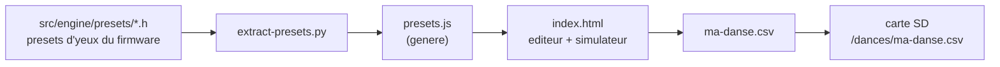

> [English](README.md) · **Français** — l'anglais est la version de référence.
> Ce fichier peut être en retard d'une mise à jour : en cas de divergence, l'anglais fait foi.

# `tools/` — outils PC

Utilitaires qui tournent sur la machine de développement, pas sur le robot.
Aucun n'est nécessaire au firmware : ils servent à *préparer* ou *vérifier*
ce qu'on lui donne.

Triés par ce qu'ils FONT, parce qu'un tableau qui en listait deux sur six est
précisément la raison pour laquelle trois d'entre eux sont restés inconnus des
mois durant — un outil introuvable est un outil qu'on réécrit.

```
tools/
  choregraphies/   une application : l'éditeur visuel de danses
  generators/      écrivent un fichier que le firmware ou la carte SD consomme
  probes/          interrogent un service externe, pour écrire un analyseur
                   contre ce qu'il répond vraiment plutôt que contre sa doc
```

| Outil | Rôle |
|---|---|
| [`choregraphies/`](choregraphies/) | éditeur visuel de danses → CSV pour `/dances/`. Double-cliquer `index.html` : sans installation, sans serveur. Écrire une danse ne demande que le navigateur ; **capturer une pose parle au robot** en HTTP |
| [`generators/make-runways.py`](generators/make-runways.py) | OurAirports → `/stackchan-companion/runways.csv`, la base des pistes de la rose METAR de flight-radar |
| [`generators/gen-worldmap.py`](generators/gen-worldmap.py) | polygones de terres Natural Earth → bitmap 1 bit en PROGMEM pour la vue ISS du bin `space`. L'en-tête qu'il écrit fait 5,7 ko d'hexadécimal sans structure : sans le générateur, personne ne pourrait changer la résolution ni dire d'où vient la forme |
| [`generators/scale_presets.py`](generators/scale_presets.py) | les presets esp32-eyes, mis à l'échelle 128×64 → 320×160, dans `EyePresetsM5.h`. Générateur **à un coup**, gardé pour mémoire — les presets qu'il a produits ont été retouchés à la main depuis, le relancer effacerait ce travail |
| [`probes/autorouter-notam.py`](probes/autorouter-notam.py) | récupère de vrais NOTAM depuis autorouter.aero pour écrire l'analyseur de flight-radar contre. Les identifiants viennent de l'ENVIRONNEMENT uniquement — l'API réutilise le login du compte, ils ne doivent jamais atterrir dans un historique de shell ni dans ce dépôt |

## Capturer une pose depuis le robot

Deux curseurs disent mal « comme ça ». Le robot est un meilleur périphérique
d'entrée que l'un ou l'autre : **relâché, sa tête se pose à la main, et il
rapporte les angles dans lesquels on l'a mise.**

Dans l'éditeur, sous les curseurs de keyframe : saisissez l'IP du robot et
cochez **Capture depuis le robot**. Cela relâche les servos — la tête devient
molle, placez-la où vous voulez — et le yaw et le pitch mesurés s'affichent en
direct. Puis **⤓ Capturer dans la keyframe**, ou cochez *suivre en direct* pour
que chaque mouvement s'écrive dans la keyframe sélectionnée pendant que vous la
posez. Éteindre l'interrupteur remet les servos comme ils étaient, pas comme
l'outil suppose qu'ils étaient.

La mesure est celle du firmware : `GET /api/servo/pos`, qui ne rapporte une pose
que servos coupés. Ce n'est pas un confort — le bus SCS0009 est en écriture
seule en fonctionnement, donc une lecture glissée entre deux `WritePos` rend les
servos muets. Les relâcher EST la condition pour les mesurer. Le sondage tourne à
**5 Hz** : plus vite, le robot passe sa propre boucle à répondre alors qu'il sert
déjà sa console ; plus lentement, poser la tête cesse de sembler entendu — l'angle
arriverait après que la main s'est arrêtée.

**Les servos sont rendus par les deux sorties.** Décocher la case restaure la
valeur relevée *avant* le début de la capture, et c'est pourquoi l'outil lit
`GET /api/tuning` d'abord : quelqu'un qui tourne avec `servos=0` ne doit pas se
retrouver avec une tâche servo qu'il n'avait pas. Fermer l'onglet ou le navigateur
poste la même restauration par `navigator.sendBeacon` — la seule requête qu'une
page en train d'être détruite a encore le droit d'émettre, et sans elle un onglet
fermé s'en irait en laissant la tête molle.

**Un interrupteur sur le robot d'abord.** L'éditeur est une page `file://`
locale, donc chacune de ses requêtes est cross-origin et le navigateur jette la
réponse sauf si le robot l'autorise. Dans la console : *Système · Accès
cross-origin*, puis **redémarrez** — la liste d'en-têtes est globale au serveur
et en ajout seul, elle est donc lue au boot. C'est éteint par défaut parce que
tant que c'est actif, n'importe quelle page affichée par votre navigateur peut
parler au robot sur le réseau local, et Basic Auth coupé, cela inclut le faire
bouger. Éteignez-le une fois terminé. Ce que cela expose réellement est détaillé
dans [`docs/reference/SECURITY.fr.md`](../docs/reference/SECURITY.fr.md) ; les
points d'entrée qu'utilise l'éditeur — `GET /api/servo/pos`, `GET`/`POST
/api/tuning` — sont dans [`docs/reference/API.fr.md`](../docs/reference/API.fr.md).

Les angles reviennent en degrés servo BRUTS et cet éditeur parle en offsets ;
les deux conversions sont une soustraction (yaw − 166, pitch − 93, depuis
`Units.h`) et les deux sens s'accordent déjà avec les curseurs. Ce que le robot
rend est borné aux mêmes limites que tout ce qu'on tape ici : la tête peut être
posée un peu au-delà de ce qu'une chorégraphie peut demander, et un CSV que le
robot rogne en silence est exactement la panne que cet outil existe pour
empêcher.

## `choregraphies/` — éditeur de danses


Ouvrir **`choregraphies/index.html`** d'un double-clic. Aucune installation,
aucune étape de build, aucun serveur : c'est une simple page `file://`. Ce n'est
pas pour autant un outil hors ligne — **écrire** une danse ne demande que le
navigateur, tandis que **capturer une pose** (§ ci-dessus) va chercher le robot,
et c'est la seule fonction qui met l'éditeur sur le réseau.



### Ce qu'il fait

- compose une timeline de keyframes : expression, yaw, pitch, regard
  vertical, paupières, durée de trajet servo, durée totale. Les commandes
  sont rangées par **portée** — ce qui agit sur UNE keyframe (**↑ ↓ ⧉ ✕**)
  est sur sa ligne, sans sélection préalable ; ce qui agit sur la séquence
  (**+** ajouter, **▶ Lire**) est à droite du titre. Toutes portent une
  infobulle décrivant leur effet ;
- **simule** la pose sur une **tête en 3D** : les yeux sont dessinés avec la
  géométrie du firmware (`src/engine/EyeDrawer.h`) appliquée aux **presets
  réels** et à la **couleur réelle** de l'expression (`emotionToRgb`,
  assombrie par `eye_color_dim`) — ils ne sont pas tous cyan : jaune pour la
  joie, rouge-orange pour la colère, lavande pour la peur, blanc pour la
  surprise. Tout cela sur la face avant de la tête, donc tourner la tête
  tourne les yeux avec elle, comme sur le robot ;
- **règle les servos au glissé** : attraper la tête et la poser où on la
  veut — horizontalement le yaw, verticalement le pitch. Les curseurs et le
  CSV suivent, et un voyant « butée » s'allume dès qu'un axe est au bout de
  sa course (la descente ne fait que 6°, c'est vite arrivé) ;
- **lit** la séquence (**▶ Lire**, à droite du titre Timeline) avec les
  vraies durées, en interpolant la pose pendant `servoMs` puis en la
  tenant — ce que fait `ServoMotion` ;
- importe / exporte le CSV attendu par `app/DanceStore.h`, décrit dans
  [`../docs/reference/CHOREGRAPHIES.md`](../docs/reference/CHOREGRAPHIES.fr.md).

La tête est un **cube**, et c'est le modèle fidèle : le boîtier CoreS3 fait
54×54 mm de face. C'est l'écran qui n'occupe pas toute cette face — sa zone
active mesure environ 40,8×30,6 mm, soit ~76 % × 57 % du carré — d'où une
dalle encastrée dans une façade noire, avec de la coque claire visible sur
les côtés et les arêtes. Le bandeau sous les yeux n'est qu'un repère de
cadrage : il rappelle que les yeux n'occupent que les deux tiers de l'écran
(les 320×160 de `units::EYEZONE_H` sur 320×240).

Les bornes du firmware sont appliquées à la saisie — **yaw ±130°**, **pitch
−74..+6°** (négatif relève la tête, positif la baisse jusqu'à la butée),
`gazeY` ±1 mais **saturé à ±0,20** par le robot — et les règles d'écriture
sont rappelées à l'écran : `holdMs` inférieur à `servoMs` sera remonté, la
dernière keyframe doit revenir à `Normal` en pose neutre, et au-delà de
**23 keyframes** le robot tronque.

### Fidélité du simulateur

Il rejoue la chaîne du firmware, dans l'ordre :

| Étape | Ce qu'elle fait |
|---|---|
| `EyeRig::setEmotion` | choisit un preset **par œil** — 12 émotions sont asymétriques — et l'ancre de fermeture des paupières |
| `EyeRig::mirrored` | inverse `OffsetY` toujours, `OffsetX` et les pentes pour l'œil droit, résout les rayons extérieurs |
| `eyegeom::normalize` | applique les invariants de rayons |
| `EyeDrawer::Draw` | trace la forme, **rayon par coin** |
| `emotionToRgb` + `dimRgb888` | applique la couleur de l'expression, assombrie de 20 % comme sur l'écran |

C'est ce qui fait que les sourcils d'`Angry` forment un V et non deux traits
parallèles, et que `Surprised` garde son coin extérieur élargi — son point de
design.

Les **rendus spéciaux** et les **overlays** y sont aussi, parce que sans eux
l'outil montrait un rectangle là où le robot montre autre chose — l'écart le
plus trompeur, puisque rien ne le signalait :

| Émotion | Ce que dessine le robot |
|---|---|
| `Excited` | une **étoile** ✦ seule, jamais sur un fond de preset |
| `Dead` | une **croix** ✕ à bras arrondis |
| `Blush` `Glee` `Smug` | joues rosies — 4 traits fins sous chaque œil, en miroir |
| `Excited` `Awe` | étincelles scintillantes, cycles décalés d'un tiers |
| `Scared` `Worried` `Frustrated` | goutte qui perle, glisse, et recommence |

Les deux derniers sont cycliques : ils s'animent pendant la lecture, et se
figent à l'arrêt sur une phase représentative — à `t = 0` la goutte est
invisible, l'aperçu statique aurait menti par omission.

### Ce qu'il ne fait pas

Ni animations d'inactivité (respiration, saccades, micro-overshoot), ni VOR,
ni **variantes dynamiques de preset** (`Sad` devient `Scary` quand le regard
monte), ni halo CRT. Le simulateur montre la **pose** d'une keyframe ; sur le
robot, la même danse sera plus vivante — et, pour les émotions à variante
dynamique, elle pourra être franchement différente.

### Après une modification des presets, des couleurs ou du mapping

```bash
python tools/choregraphies/extract-presets.py
```

`presets.js` est **généré** : le modifier à la main le ferait diverger du
firmware dès la retouche suivante. Le script relit **quatre** sources et le
réécrit entièrement :

| Source | Ce qu'il en tire |
|---|---|
| `src/engine/presets/*.h` | les formes brutes des yeux |
| `src/engine/Emotions.h` | les 30 noms canoniques **et** `emotionToRgb` (la couleur de chaque expression) |
| `src/engine/EyeRig.h` | quel preset pour l'œil gauche, le droit, et l'ancre de fermeture (`lidCenter`) |
| `src/engine/Tuning.h` | `eye_color_dim`, l'assombrissement global de la palette |

Le script **échoue** plutôt que de produire un fichier trompeur : preset cité
par `EyeRig` mais introuvable, `emotionToRgb` sans `default:`, `eye_color_dim`
absent. Il signale aussi les émotions sans preset explicite (elles retombent
sur `Normal`, comme sur le robot).

### Installer une danse sur le robot

Copier le CSV dans `/dances/` de la carte SD, ou le téléverser par l'API :

```bash
curl -X POST "http://<ip>/api/sd/put?path=/dances/ma-danse.csv" \
     -F "file=@ma-danse.csv"
curl -X POST "http://<ip>/api/dances/reload"
```

Le nom du fichier donne le nom de la danse.

## `make-runways.py` — la base des pistes de la rose METAR

```bash
python tools/generators/make-runways.py                 # telecharge la source
python tools/generators/make-runways.py runways.csv     # utilise une copie locale
```

Écrit `sdcard/stackchan-companion/runways.csv` (~236 Kio) et annonce ce qu'il a
produit. La vue METAR de flight-radar dessine la piste de l'aérodrome sur sa
rose des vents ; aucun METAR ne porte cette donnée, elle est donc cherchée sur
la carte SD au lieu d'être saisie à la main.

| | |
|---|---|
| Source | `runways.csv` d'[OurAirports](https://ourairports.com/data/), [miroir de David Megginson](https://davidmegginson.github.io/ourairports-data/runways.csv) — ~4 Mo, 48 000 lignes |
| Licence | **domaine public** — ce qui la rend distribuable à côté d'un firmware AGPL-3.0 |
| Retenu | les pistes qui ont un **cap vrai** et ne sont **pas fermées** : ~14 200 |
| Sortie | enregistrements de **largeur fixe** de 17 octets, `ICAO` sur 7 + extrémités sur 3 + 3 + cap sur 3 + `\n` |
| Tri | ICAO croissant, puis longueur **décroissante** |
| Contrôle | recoupée avec l'**AIP officielle** le 2026-07-31 (voir plus bas) |

```
FMEE   12 30 102\n
FMEE   14 32 116\n
FMEP   15 33 129\n
```

### Recoupement avec l'AIP officielle

OurAirports est communautaire, et toute la géométrie de la rose tient à ce
cap — il a donc été vérifié contre l'AIP française elle-même : le **jeu AIXM
5.1 qu'EUROCONTROL publie pour la France et l'outre-mer**
([page France](https://ext.eurocontrol.int/aixm_confluence/display/AIX/France),
`LF_AIP_DS_PartOf_*.zip`, gratuit, sans compte).

| FMEE | `trueBearing` AIP | `runways.csv` |
|---|---|---|
| 12 / 30 | 102.00 / 282.00 | `102` |
| 14 / 32 | 116.00 / 296.00 | `116` |

Le `nominalLength` de l'AIP confirme aussi le **choix de la piste
principale** : 12/30 fait 3200 m contre 2670 m pour 14/32, soit la piste que
le tri par longueur décroissante place en tête — l'enregistrement sur lequel
le firmware s'arrête.

Ce jeu n'est **pas** la source et ne doit pas le devenir : il ne couvre que la
France (545 aérodromes contre 10 727 ici) et il est figé sur un vieux cycle
AIRAC. C'est le *témoin*. Le XML de l'e-shop SIA (XML-SIA / AIXM 4.5, une
commande par cycle AIRAC) est la même donnée derrière un paiement et un
téléchargement manuel — aucune raison d'en dépendre.

Ces deux propriétés portent la fonction, aucune n'est cosmétique :

- la **largeur constante** fait du fichier un tableau adressable — taille du
  fichier ÷ 17 = le nombre d'enregistrements, donc le bin fait une **recherche
  dichotomique sur les offsets** (14 sondages plus une lecture de confirmation
  de 17 octets pour n'importe quel aérodrome, sans cache ni index). Un CSV de
  largeur variable aurait imposé un balayage linéaire de 4 Mo à chaque
  changement de station, hors de portée du bin ;
- la **longueur décroissante** fait du premier enregistrement d'un aérodrome
  sa piste PRINCIPALE, si bien que le firmware s'arrête au premier trouvé.
  FMEE en a deux (12/30 de 10 499 ft, 14/32 de 8 760 ft) et c'est la longue
  qu'un pilote désigne.

Un NUMÉRO de piste N'EST PAS SON CAP — c'est le cap **magnétique** arrondi à
la dizaine, alors que la rose est graduée en degrés vrais. La `12/30` de FMEE
fait en réalité 102/282°, 18° d'écart avec les 120 que suggère le numéro :
c'est précisément pour cela que le cap est cherché plutôt que déduit.

Le script **s'auto-teste** : il rejoue la dichotomie du firmware sur *tous* les
aérodromes du fichier et vérifie que chacun est trouvé et tombe sur sa piste la
plus longue. Une sortie non nulle signifie que le fichier n'est pas
cherchable — il ne doit pas partir sur la carte.

Le côté lecture et la règle de priorité (le réglage `metar_rwy` l'emporte sur
la base ; sans l'un ni l'autre, la rose s'affiche seule) sont dans
[`../docs/guests/FLIGHT-RADAR.fr.md`](../docs/guests/FLIGHT-RADAR.fr.md).
