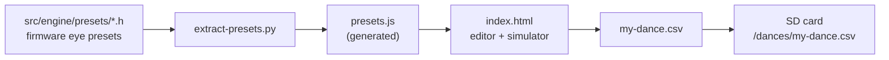

> **English** · [Français](README.fr.md)

# `tools/` — PC-side tools

Utilities that run on the development machine, not on the robot. None of them
are required by the firmware: they exist to *prepare* or *check* what we feed
it.

Sorted by what they DO, because the table listing two of the six was how three
of them went unmentioned for months — a tool nobody can find is a tool that gets
written a second time.

```
tools/
  choregraphies/   an application: the visual dance editor
  generators/      write a file the firmware or the SD card then consumes
  probes/          talk to an external service, so we can write a parser against
                   what it really answers rather than what its documentation says
```

| Tool | Role |
|---|---|
| [`choregraphies/`](choregraphies/) | visual dance editor → CSV for `/dances/`. Double-click `index.html`: no install, no server. Authoring a dance needs nothing but the browser; **capturing a pose talks to the robot** over HTTP |
| [`generators/make-runways.py`](generators/make-runways.py) | OurAirports → `/stackchan-companion/runways.csv`, the runway base of the flight-radar METAR rose |
| [`generators/gen-worldmap.py`](generators/gen-worldmap.py) | Natural Earth land polygons → a 1-bit PROGMEM bitmap for the `space` bin's ISS view. The header it writes is 5.7 kB of structureless hex: without the generator nobody could change the resolution or explain where the shape came from |
| [`generators/scale_presets.py`](generators/scale_presets.py) | the esp32-eyes presets, scaled 128×64 → 320×160, into `EyePresetsM5.h`. A **one-shot** generator kept for the record — the presets it produced have been hand-tuned since, so re-running it would undo that |
| [`probes/autorouter-notam.py`](probes/autorouter-notam.py) | fetches real NOTAMs from autorouter.aero to write the flight-radar parser against. Credentials come from the ENVIRONMENT only — the API reuses your account login, so they must never reach a shell history or this repo |

## Capturing a pose from the robot

Two sliders are a poor way to say "like this". The robot is a better input
device than either: **released, its head is posable by hand, and it reports the
angles it has been put into.**

In the editor, under the keyframe sliders: enter the robot's IP and tick
**Capture from the robot**. That releases the servos — the head goes limp,
place it where you want it — and the measured yaw and pitch appear live. Then
**⤓ Capture into the keyframe**, or tick *follow live* to have every movement
written into the selected keyframe as you pose it. Turning the switch off puts
the servos back the way they were, not the way the tool assumes they were.

The measurement is the firmware's own: `GET /api/servo/pos`, which reports a
pose only while the servos are off. That is not a convenience — the SCS0009 bus
is write-only in operation, so a read taken between two `WritePos` leaves the
servos mute. Releasing them IS the precondition of measuring them. The poll runs
at **5 Hz**: faster and the robot spends its own loop answering a board that is
already serving its console, slower and posing the head stops feeling answered —
the angle would land after the hand had stopped moving.

**The servos are handed back on both ways out.** Unticking the box restores the
value sampled *before* the capture began, which is why the tool reads
`GET /api/tuning` first: an owner who runs with `servos=0` must not be handed a
servo task they never had. Closing the tab or the browser posts the same restore
through `navigator.sendBeacon` — the only request a page being torn down is
still allowed to make, and without it a closed tab would walk away leaving the
head limp.

**One switch on the robot first.** The editor is a local `file://` page, so
every request it makes is cross-origin and the browser discards the answer
unless the robot allows it. In the console: *System · Cross-origin access*,
then **restart** — the header list is global to the server and add-only, so it
is read at boot. It is off by default because while it is on, any page your
browser happens to show can talk to the robot on the local network, and with
Basic Auth off that includes making it move. Turn it off when you are done.
What that actually exposes is spelled out in
[`docs/reference/SECURITY.md`](../docs/reference/SECURITY.md); the endpoints
the editor uses — `GET /api/servo/pos`, `GET`/`POST /api/tuning` — are in
[`docs/reference/API.md`](../docs/reference/API.md).

Angles come back as RAW servo degrees and this editor speaks offsets; both
conversions are a subtraction (yaw − 166, pitch − 93, from `Units.h`) and both
directions already agree with the sliders. What the robot hands over is clamped
to the same limits as anything else typed here: the head can be posed a little
past what a choreography may ask for, and a CSV the robot silently trims is the
exact failure this tool exists to prevent.

## `choregraphies/` — the dance editor


Double-click **`choregraphies/index.html`** to open it. No installation, no
build step, no server: it is a plain `file://` page. It is not an offline-only
tool, though — **authoring** a dance needs nothing but the browser, while
**capturing a pose** (§ above) reaches out to the robot, which is the one
feature that puts the editor on the network.



### What it does

- builds a timeline of keyframes: expression, yaw, pitch, vertical gaze,
  eyelids, servo travel time, total duration. Commands are grouped by
  **scope** — whatever acts on ONE keyframe (**↑ ↓ ⧉ ✕**) sits on its own row,
  with no prior selection needed; whatever acts on the sequence (**+** add,
  **▶ Lire** play) sits to the right of the heading. Every one of them carries
  a tooltip describing its effect;
- **simulates** the pose on a **3D head**: the eyes are drawn with the
  firmware's geometry (`src/engine/EyeDrawer.h`) applied to the **real
  presets** and the **real color** of the expression (`emotionToRgb`, dimmed by
  `eye_color_dim`) — they are not all cyan: yellow for joy, red-orange for
  anger, lavender for fear, white for surprise. All of that on the front face
  of the head, so turning the head turns the eyes with it, just like on the
  robot;
- **sets the servos by dragging**: grab the head and put it where you want it
  — horizontally for yaw, vertically for pitch. The sliders and the CSV follow,
  and an "end stop" indicator lights up as soon as an axis reaches the end of
  its travel (looking down only gets 6°, which happens fast);
- **plays** the sequence (**▶ Lire**, to the right of the Timeline heading)
  with the real durations, interpolating the pose during `servoMs` and then
  holding it — exactly what `ServoMotion` does;
- imports / exports the CSV expected by `app/DanceStore.h`, described in
  [`../docs/reference/CHOREGRAPHIES.md`](../docs/reference/CHOREGRAPHIES.md).

The head is a **cube**, and that is the faithful model: the CoreS3 enclosure is
54×54 mm across the front. It is the screen that does not fill that face — its
active area measures roughly 40.8×30.6 mm, i.e. ~76 % × 57 % of the square —
hence a panel recessed into a black bezel, with light-colored shell visible
along the sides and the edges. The band below the eyes is only a framing
reference: it is a reminder that the eyes occupy just two thirds of the screen
(the 320×160 of `units::EYEZONE_H` out of 320×240).

The firmware's bounds are enforced on input — **yaw ±130°**, **pitch −74..+6°**
(negative raises the head, positive lowers it down to the end stop), `gazeY`
±1 but **saturated at ±0.20** by the robot — and the authoring rules are
restated on screen: a `holdMs` lower than `servoMs` will be raised, the last
keyframe must return to `Normal` in a neutral pose, and beyond **23
keyframes** the robot truncates.

### Simulator fidelity

It replays the firmware's chain, in order:

| Step | What it does |
|---|---|
| `EyeRig::setEmotion` | picks a preset **per eye** — 12 emotions are asymmetric — and the eyelid closing anchor |
| `EyeRig::mirrored` | flips `OffsetY` always, `OffsetX` and the slopes for the right eye, resolves the outer radii |
| `eyegeom::normalize` | applies the radius invariants |
| `EyeDrawer::Draw` | traces the shape, **corner radius by corner radius** |
| `emotionToRgb` + `dimRgb888` | applies the expression's color, dimmed by 20 % as on the screen |

That is what makes `Angry`'s eyebrows form a V instead of two parallel
strokes, and what makes `Surprised` keep its widened outer corner — its design
point.

The **special renders** and the **overlays** are in there too, because without
them the tool showed a rectangle where the robot shows something else — the
most deceptive gap of all, since nothing flagged it:

| Emotion | What the robot draws |
|---|---|
| `Excited` | a **star** ✦ on its own, never on top of a preset shape |
| `Dead` | a **cross** ✕ with rounded arms |
| `Blush` `Glee` `Smug` | blushing cheeks — 4 thin strokes under each eye, mirrored |
| `Excited` `Awe` | twinkling sparkles, cycles offset by a third |
| `Scared` `Worried` `Frustrated` | a sweat drop that beads, slides, and starts over |

The last two are cyclic: they animate during playback, and freeze when stopped
on a representative phase — at `t = 0` the drop is invisible, so a static
preview would have lied by omission.

### What it does not do

No idle animations (breathing, saccades, micro-overshoot), no VOR, no
**dynamic preset variants** (`Sad` becomes `Scary` when the gaze goes up), no
CRT glow. The simulator shows the **pose** of a keyframe; on the robot the same
dance will be livelier — and, for the emotions with a dynamic variant, it may
be plainly different.

### After changing the presets, the colors or the mapping

```bash
python tools/choregraphies/extract-presets.py
```

`presets.js` is **generated**: editing it by hand would make it diverge from
the firmware at the very next tweak. The script re-reads **four** sources and
rewrites it entirely:

| Source | What it takes from it |
|---|---|
| `src/engine/presets/*.h` | the raw eye shapes |
| `src/engine/Emotions.h` | the 30 canonical names **and** `emotionToRgb` (the color of each expression) |
| `src/engine/EyeRig.h` | which preset for the left eye, which for the right, and the closing anchor (`lidCenter`) |
| `src/engine/Tuning.h` | `eye_color_dim`, the global dimming of the palette |

The script **fails** rather than produce a misleading file: a preset referenced
by `EyeRig` but not found, an `emotionToRgb` without a `default:`, a missing
`eye_color_dim`. It also reports the emotions with no explicit preset (they
fall back to `Normal`, just like on the robot).

### Installing a dance on the robot

Copy the CSV into `/dances/` on the SD card, or upload it through the API:

```bash
curl -X POST "http://<ip>/api/sd/put?path=/dances/ma-danse.csv" \
     -F "file=@ma-danse.csv"
curl -X POST "http://<ip>/api/dances/reload"
```

The file name gives the dance its name.

## `make-runways.py` — the runway base of the METAR rose

```bash
python tools/generators/make-runways.py                 # downloads the source
python tools/generators/make-runways.py runways.csv     # uses a local copy
```

Writes `sdcard/stackchan-companion/runways.csv` (~236 KiB) and reports what it
produced. The flight-radar METAR view draws the aerodrome's runway on its
compass rose; a METAR never carries that datum, so it is looked up on the SD
card instead of being typed in.

| | |
|---|---|
| Source | [OurAirports](https://ourairports.com/data/) `runways.csv`, [mirrored by David Megginson](https://davidmegginson.github.io/ourairports-data/runways.csv) — ~4 MB, 48 000 lines |
| Licence | **public domain** — which is what makes it shippable next to an AGPL-3.0 firmware |
| Kept | runways with a **true heading** that are **not closed**: ~14 200 of them |
| Output | **fixed-width** records of 17 bytes, `ICAO` on 7 + ends on 3 + 3 + heading on 3 + `\n` |
| Order | ICAO ascending, then length **descending** |
| Control | cross-checked against the **official AIP** on 2026-07-31 (see below) |

```
FMEE   12 30 102\n
FMEE   14 32 116\n
FMEP   15 33 129\n
```

### Cross-check against the official AIP

OurAirports is community-maintained, and the rose's whole geometry hangs on
that heading — so it was verified against the French AIP itself: the
**AIXM 5.1 dataset EUROCONTROL publishes for France and its overseas
territories** ([France page](https://ext.eurocontrol.int/aixm_confluence/display/AIX/France),
`LF_AIP_DS_PartOf_*.zip`, free, no account).

| FMEE | AIP `trueBearing` | `runways.csv` |
|---|---|---|
| 12 / 30 | 102.00 / 282.00 | `102` |
| 14 / 32 | 116.00 / 296.00 | `116` |

The AIP's `nominalLength` also confirms the **main-runway pick**: 12/30 is
3200 m against 2670 m for 14/32, which is the runway the length-descending
sort puts first — the record the firmware stops on.

That dataset is **not** the source and should not become one: it covers France
only (545 aerodromes against 10 727 here) and is frozen on an old AIRAC cycle.
It is the *control*. The SIA e-shop XML (XML-SIA / AIXM 4.5, one manual order
per AIRAC cycle) is the same data behind a paywall and a download — no reason
to depend on it.

Both properties are load-bearing, and neither is cosmetic:

- the **constant width** turns the file into an addressable array — file size
  ÷ 17 = the record count, so the bin **binary-searches on offsets** (14
  probes plus a confirming read of 17 bytes for any aerodrome, no cache, no
  index). A variable-width CSV would have meant a linear scan of 4 MB on
  every station change, which the bin can neither hold nor afford;
- the **descending length** makes the first record of an aerodrome its MAIN
  runway, so the firmware stops at the first hit. FMEE has two (12/30 at
  10 499 ft, 14/32 at 8 760 ft) and the long one is the one a pilot means.

A runway NUMBER IS NOT ITS HEADING — it is the **magnetic** bearing rounded to
the ten, while the rose is drawn in true degrees. FMEE's `12/30` really lies
102/282°, 18° off the 120 the number suggests: precisely why the heading is
fetched rather than deduced.

The script **self-tests** what it wrote: it replays the firmware's binary
search over *every* aerodrome in the file and checks that each one is found
and lands on its longest runway. A non-zero exit means the file is not
searchable — it must not be shipped.

See [`../docs/guests/FLIGHT-RADAR.md`](../docs/guests/FLIGHT-RADAR.md) for the
reading side and the priority rule (the `metar_rwy` setting overrides the
base; with neither, the rose is drawn alone).
